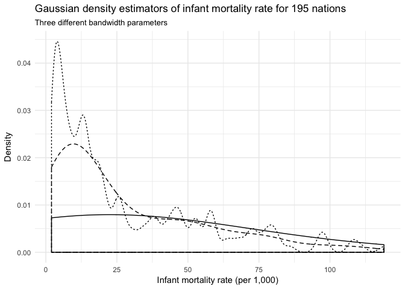
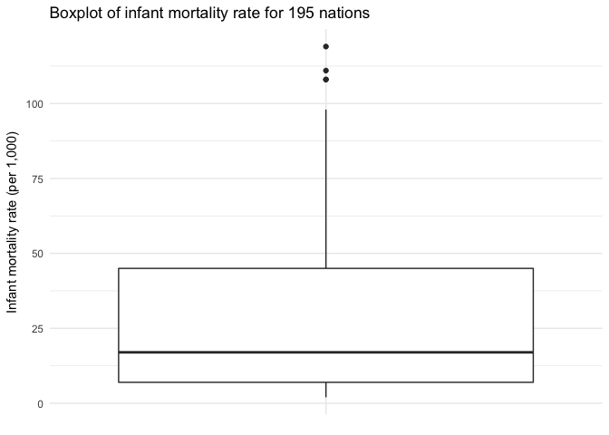
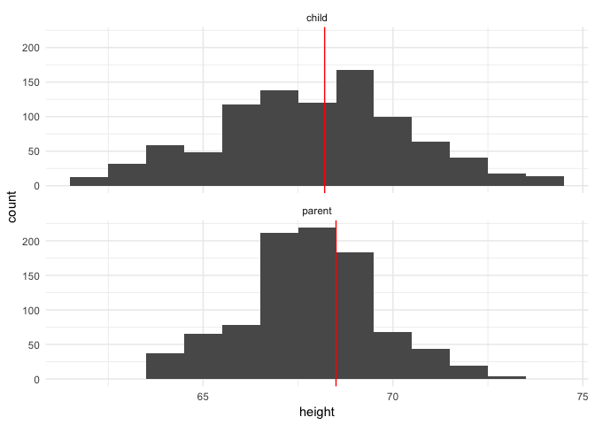
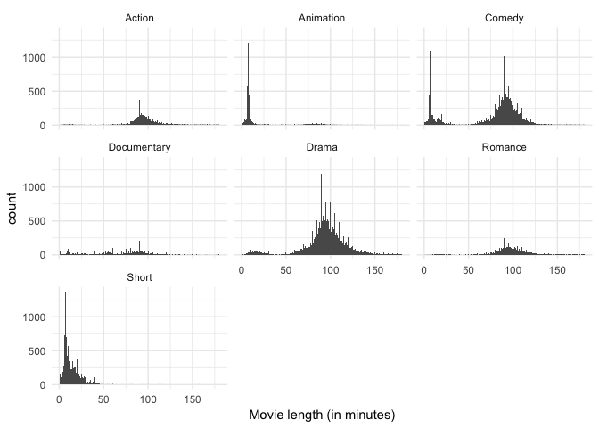
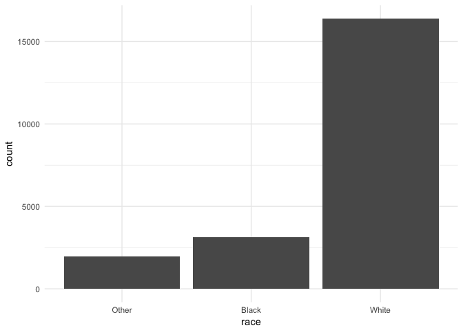

Exploratory data analysis
================

-   [Exploratory data analysis](#exploratory-data-analysis)
    -   [Differences between EDA and modeling](#differences-between-eda-and-modeling)
    -   [EDA vs. CDA](#eda-vs.-cda)
-   [Continuous variables](#continuous-variables)
    -   [Numeric statistics](#numeric-statistics)
        -   [Measures of central tendency](#measures-of-central-tendency)
        -   [Measures of dispersion](#measures-of-dispersion)
    -   [Common plot types](#common-plot-types)
        -   [Histograms](#histograms)
        -   [Density estimation](#density-estimation)
        -   [Boxplot](#boxplot)
    -   [Things to look for in continuous variables](#things-to-look-for-in-continuous-variables)
    -   [Examples](#examples)
        -   [Galton's heights](#galtons-heights)
        -   [Outlier detection](#outlier-detection)
        -   [Compare distributions of subgroups](#compare-distributions-of-subgroups)
-   [Categorical variables](#categorical-variables)
    -   [Types of charts](#types-of-charts)
        -   [Bar chart](#bar-chart)
        -   [Pie chart](#pie-chart)
-   [Bivariate relationships](#bivariate-relationships)
    -   [Scatterplots](#scatterplots)
        -   [`movies` example](#movies-example)
        -   [Smoothing lines](#smoothing-lines)
        -   [Adding jitter to the graph](#adding-jitter-to-the-graph)
        -   [Comparing groups within scatterplots](#comparing-groups-within-scatterplots)
        -   [Scatterplot matrix](#scatterplot-matrix)
        -   [Heatmap of correlation coefficients](#heatmap-of-correlation-coefficients)
        -   [Parallel coordinate plots](#parallel-coordinate-plots)
-   [Documenting EDA](#documenting-eda)
    -   [Formats](#formats)
    -   [Example notebooks](#example-notebooks)
        -   [Python](#python)
        -   [R](#r)
-   [Session info](#session-info)

``` r
library(tidyverse)
library(ggthemes)
library(knitr)
library(broom)
library(stringr)

options(digits = 3)
set.seed(1234)
theme_set(theme_minimal())
```

Exploratory data analysis
=========================

1.  Generate questions about your data.
2.  Search for answers by visualising, transforming, and modeling your data.
3.  Use what you learn to refine your questions and or generate new questions.

-   Rinse and repeat until you publish a paper.

EDA is fundamentally a creative process - it is not an exact science. It requires knowledge of your data and a lot of time. A lot of questions can be answered using EDA:

1.  What type of variation occurs within my variables?
2.  What type of covariation occurs between my variables?
3.  Are there outliers in the data?
4.  Do I have missingness? Are there patterns to it?
5.  How much variation/error exists in my statistical estimates? Is there a pattern to it?

**R for Data Science** does a good job explaining the mechanics of EDA in R, while **The Truthful Art** provides a clear primer for some of the statistical principles involved in basic data description and exploration.[1]

Differences between EDA and modeling
------------------------------------

EDA is not the same thing as statistical modeling. Statistical modeling attempts to explain and summarize relationships between variables through a low-dimensional approach. For instance, in regression analysis we try to summarize the relationship between an outcome of interest and a predictor by estimating a parameter that summarizes the monotonic, linear relationship. Whereas in exploratory data analysis we are not limited to a strict functional form, or even focused on explaining relationships between variables (covariation).

Consider a dataset on tips given to a single waiter over a three-month period in a restaurant with the following variables:[2]

| Variable  | Explanation                                                 |
|-----------|-------------------------------------------------------------|
| `obs`     | Observation number                                          |
| `totbill` | Total bill (cost of the meal), including tax, in US dollars |
| `tip`     | Tip (gratuity) in US dollars                                |
| `sex`     | Sex of person paying for the meal (0=male, 1=female)        |
| `smoker`  | Smoker in party? (0=No, 1=Yes)                              |
| `day`     | 3=Thur, 4=Fri, 5=Sat, 6=Sun                                 |
| `time`    | 0=Day, 1=Night                                              |
| `size`    | Size of the party                                           |

``` r
tips <- read_csv("data/tips.csv")
```

    ## Parsed with column specification:
    ## cols(
    ##   obs = col_integer(),
    ##   totbill = col_double(),
    ##   tip = col_double(),
    ##   sex = col_character(),
    ##   smoker = col_character(),
    ##   day = col_character(),
    ##   time = col_character(),
    ##   size = col_integer()
    ## )

``` r
str(tips)
```

    ## Classes 'tbl_df', 'tbl' and 'data.frame':    244 obs. of  8 variables:
    ##  $ obs    : int  1 2 3 4 5 6 7 8 9 10 ...
    ##  $ totbill: num  17 10.3 21 23.7 24.6 ...
    ##  $ tip    : num  1.01 1.66 3.5 3.31 3.61 4.71 2 3.12 1.96 3.23 ...
    ##  $ sex    : chr  "F" "M" "M" "M" ...
    ##  $ smoker : chr  "No" "No" "No" "No" ...
    ##  $ day    : chr  "Sun" "Sun" "Sun" "Sun" ...
    ##  $ time   : chr  "Night" "Night" "Night" "Night" ...
    ##  $ size   : int  2 3 3 2 4 4 2 4 2 2 ...
    ##  - attr(*, "spec")=List of 2
    ##   ..$ cols   :List of 8
    ##   .. ..$ obs    : list()
    ##   .. .. ..- attr(*, "class")= chr  "collector_integer" "collector"
    ##   .. ..$ totbill: list()
    ##   .. .. ..- attr(*, "class")= chr  "collector_double" "collector"
    ##   .. ..$ tip    : list()
    ##   .. .. ..- attr(*, "class")= chr  "collector_double" "collector"
    ##   .. ..$ sex    : list()
    ##   .. .. ..- attr(*, "class")= chr  "collector_character" "collector"
    ##   .. ..$ smoker : list()
    ##   .. .. ..- attr(*, "class")= chr  "collector_character" "collector"
    ##   .. ..$ day    : list()
    ##   .. .. ..- attr(*, "class")= chr  "collector_character" "collector"
    ##   .. ..$ time   : list()
    ##   .. .. ..- attr(*, "class")= chr  "collector_character" "collector"
    ##   .. ..$ size   : list()
    ##   .. .. ..- attr(*, "class")= chr  "collector_integer" "collector"
    ##   ..$ default: list()
    ##   .. ..- attr(*, "class")= chr  "collector_guess" "collector"
    ##   ..- attr(*, "class")= chr "col_spec"

If our primary question is "what are the factors that affect tipping behavior?", then we can quickly fit a linear regression model to explain this outcome:[3]

``` r
tips <- tips %>%
  mutate(tiprate = tip / totbill)

tips_lm <- lm(tiprate ~ sex + smoker + day + time + size, data = tips)
tidy(tips_lm)
```

    ##          term estimate std.error statistic  p.value
    ## 1 (Intercept)  0.20656   0.02492    8.2892 8.65e-15
    ## 2        sexM -0.00854   0.00835   -1.0234 3.07e-01
    ## 3   smokerYes  0.00364   0.00850    0.4280 6.69e-01
    ## 4      daySat -0.00177   0.01834   -0.0967 9.23e-01
    ## 5      daySun  0.01667   0.01902    0.8764 3.82e-01
    ## 6      dayThu -0.01818   0.02319   -0.7837 4.34e-01
    ## 7   timeNight -0.02337   0.02612   -0.8948 3.72e-01
    ## 8        size -0.00962   0.00422   -2.2824 2.34e-02

Based on this analysis, `size` is the only significant predictor. Quick answer to our original question. But is this sufficient?

``` r
glance(tips_lm)
```

    ##   r.squared adj.r.squared  sigma statistic p.value df logLik  AIC  BIC
    ## 1     0.042        0.0136 0.0607      1.48   0.175  8    342 -665 -634
    ##   deviance df.residual
    ## 1    0.868         236

Our *R*<sup>2</sup> is just 0.042. That's a pretty crappy model. And it misses a lot of other interesting aspects of the data.

``` r
ggplot(tips, aes(tip)) +
  geom_histogram(binwidth = 1)
```


The histogram of tip amounts (binwidth = 1) shows the distribution is skewed right and unimodal. Overall the tips are not that large.

``` r
ggplot(tips, aes(tip)) +
  geom_histogram(binwidth = .1)
```


By shrinking the binwidth to .10, we see a new phenomenon. Peaks occur at whole and half-dollar amounts, likely caused by customers picking round numbers for tips. We see this a lot too at the gas pump.

``` r
ggplot(tips, aes(totbill, tip)) +
  geom_point() +
  geom_abline(slope = .18, linetype = 2) +
  expand_limits(x = c(0, NA),
                y = c(0, NA)) +
  geom_text(data = tips %>%
              summarize(rsq = format(cor(totbill, tip), digits = 3)),
            aes(x = 2, y = 9, label = rsq))
```


By generating a scatterplot with a line representing a generous tipper (defined as a tip of 18%), we see that the majority of patrons are cheap tippers. The *R*<sup>2</sup> is decent for the observations, suggesting a moderate to strong correlation between the variables. But this correlation is not consistent across all observations in the data: there is more variation from the line as the total bill increases.

Of course we are also frequently interested in multiple variables and their covariation with one another, such as smoker and sex:

``` r
ggplot(tips, aes(totbill, tip)) +
  geom_point() +
  geom_abline(slope = .18, linetype = 2) +
  expand_limits(x = c(0, NA),
                y = c(0, NA)) +
  facet_grid(smoker ~ sex, labeller = "label_both") +
  geom_text(data = tips %>%
              group_by(smoker, sex) %>%
              summarize(rsq = format(cor(totbill, tip), digits = 3)),
            aes(x = 2, y = 9, label = rsq))
```


With the faceted scatterplot (with *R*<sup>2</sup> in the top-left of each facet), we can draw several comparisons and conclusions. For instance, non-smokers have a stronger correlation between total bill amount and tip size than smokers. Additionally for non-smokers, men tend to pay larger bills than women.

Without EDA, we would have missed these nuances to the data.

EDA vs. CDA
-----------

EDA is heavily graphics-based and distinct from traditional confirmatory data analysis (CDA) techniques. CDA is the typical approach to quantitative research: identify a question of interest, develop a theory/hypothesis, collect data, and finally analyze it to confirm or refute your hypothesis. EDA is a distinct approach that could be called atheoretical, data snooping, inductive, etc. Given computational tools now available, there's no reason to avoid EDA. EDA can be used to inform CDA by guiding our question selection and assessing the data for any violations of assumptions required for valid statistical inference.

Continuous variables
====================

Numeric statistics
------------------

### Measures of central tendency

These statistics measure the central or typical value of a probability distribution.

-   **Median** - the value separating the data into two halves each containing 50% of the observations
-   **Mode** - the value that appears most often in a data set
-   **Arithmetic mean**

    $$\\bar{x} = \\frac{1}{n} \\sum\_{i = 1}^n x\_i$$

    -   Note that means can also be parameters in probability distributions, such as the Normal distribution which contains a mean *μ* and variance *σ*<sup>2</sup>.

### Measures of dispersion

These measure the extent to which a distribution is stretched or squeezed. The **variance** is the expectation of the squared deviation of a random variable from its mean:

*E*\[*X*\]=*μ*

Var(*X*)≡*σ*<sup>2</sup> = *E*\[*X*<sup>2</sup>\]−(*E*\[*X*\])<sup>2</sup>

While **deviation** is a measure of the difference between the observed value of a variable and some other value (often that variable's mean).

-   **Standard deviation** - quantifies the amount of variation or dispersion in a set of data values

$$\\sigma = \\sqrt{E\[X^2\] - (E\[X\])^2}$$

-   **Median absolute deviation** - robust measure of the variability of a univariate sample of data

    *M**A**D* = median(|*X*<sub>*i*</sub> − median(*X*)|)

    -   The median of the absolute deviations from the data's median
    -   MAD is more resilient to outliers in the data, because it is derived from medians and not arithmetic means

Common plot types
-----------------

-   Histogram
-   Density estimate
-   Boxplot

### Histograms

**Histograms** are graphical representations of the distribution of data. They attempt to estimate the probability distribution of a continuous variable by dividing the range of the variable into equal-width intervals called **bins**, counting the number of observations falling into each bin, and displaying the frequency counts in a bar chart.

``` r
infant <- read_csv("data/infant.csv") %>%
  # remove non-countries
  filter(is.na(`Value Footnotes`) | `Value Footnotes` != 1) %>%
  select(`Country or Area`, Year, Value) %>%
  rename(country = `Country or Area`,
         year = Year,
         mortal = Value)
```

    ## Parsed with column specification:
    ## cols(
    ##   `Country or Area` = col_character(),
    ##   Subgroup = col_character(),
    ##   Year = col_integer(),
    ##   Source = col_character(),
    ##   Unit = col_character(),
    ##   Value = col_integer(),
    ##   `Value Footnotes` = col_integer()
    ## )

``` r
ggplot(infant, aes(mortal)) +
  geom_histogram(bins = 10, boundary = 0) +
  labs(title = "Histogram of infant mortality rate for 195 nations",
       subtitle = "10 bins, origin = 0",
       x = "Infant mortality rate (per 1,000)",
       y = "Frequency")
```


``` r
ggplot(infant, aes(mortal)) +
  geom_histogram(bins = 10, boundary = -5) +
  labs(title = "Histogram of infant mortality rate for 195 nations",
       subtitle = "10 bins, origin = -5",
       x = "Infant mortality rate (per 1,000)",
       y = "Frequency")
```


Both histograms above use bins of width 10 but differ in their **origin**, or the starting point for the histogram. The first graph uses bins starting at 0 (e.g. 0 to 10, 10 to 20, 20 to 30), whereas the second graph uses bins starting at -5 (e.g. -5 to 5, 5 to 15, 15 to 25). Determining the optimal binwidth and origin point can be trial-and-error, though there are more complex options to try and optimize these values.

### Density estimation

In fact histograms are strongly related to **nonparametric density estimation**. Unlike histograms, which divide the data into discrete bins, nonparametric density estimation attempts to estimate the probability density function (PDF) of a variable based on a sample. Since the PDF is a smooth, continuous function, we can think of it like a smoothing histogram.

Histograms can also be thought of as simple density estimators, though rather than each bar representing a frequency count having it represent the proportion of observations in the sample that fall into the given bin.

*x*<sub>0</sub> is the origin and each of the *m* bins has width 2*h*. The end points of each bin are at *x*<sub>0</sub>, *x*<sub>0</sub> + 2*h*, *x*<sub>*o*</sub> + 4*h*, …, *x*<sub>0</sub> + 2*m**h*. An observation *X*<sub>*i*</sub> falls in the *j*th bin if:

*x*<sub>0</sub> + 2(*j* − 1)*h* ≤ *X*<sub>*i*</sub> &lt; *x*<sub>0</sub> + 2*j**h*

Therefore the histogram estimator of the density at any *x* value located in the *j*th bin is based the number of observations that fall into that bin:

$$\\hat{p}(x) = \\frac{\\\#\_{i = 1}^n \[x\_0 + 2(j - 1)h \\leq X\_i &lt; x\_0 + 2jh\]}{2nh}$$

where \# is the counting operator. If we remove the arbitrary origin *x*<sub>0</sub> by counting locally within a continuously moving window of half-width *h* centered at *x*:

$$\\hat{p}(x) = \\frac{\\\#\_{i = 1}^n \[x\_0 + 2(j - 1)h \\leq X\_i &lt; x\_0 + 2jh\]}{2nh}$$

We can generalize this equation to evaluate $\\hat{p}(x)$ at a large number of *x* values covering the range of *X* by applying a locally weighted averaging function using a rectangular weight function:

$$\\hat{p}(x) = \\frac{1}{nh} \\sum\_{i = 1}^n W \\left( \\frac{x - X\_i}{h} \\right)$$

where

$$W(z) = \\begin{cases} 
      \\frac{1}{2} & \\text{for } |z| &lt; 1 \\\\
      0 & \\text{otherwise} \\\\
   \\end{cases}$$

$$z = \\frac{x - X\_i}{h}$$

This **naive estimator** is very similar to a histogram that uses bins of width 2*h* but has no fixed origin.

``` r
ggplot(infant, aes(mortal)) +
  geom_density(kernel = "rectangular") +
  labs(title = "Naive density estimator of infant mortality rate for 195 nations",
       x = "Infant mortality rate (per 1,000)",
       y = "Density")
```


The downside to the rectangular weighting function is that the resulting density plot is not very clean and smooth. As observations enter and exit the window defined by the rectangle *W*(*z*), the resulting estimator is rough.

The rectangular weighting function produces a density estimate which covers an area of 1; that is, integrating over the range of *X* for $\\hat{p}(x)$ yields a value of 1. Any function that has this property (such as a probability density function) can be used as a weight function.

Another term for a weight function is a **kernel**. We should select a kernel that is smooth, symmertric, and unimodal to smooth out these rough edges of the naive density estimator. Therefore we can write the general density estimator as:

$$\\hat{x}(x) = \\frac{1}{nh} \\sum\_{i = 1}^k K \\left( \\frac{x - X\_i}{h} \\right)$$

and substitute for *K*(*z*) any other kernel.

##### Gaussian kernel

$$K(z) = \\frac{1}{\\sqrt{2 \\pi}}e^{-\\frac{1}{2} z^2}$$

Not to be confused with the [(Gaussian) radial basis function kernel](persp009_svm.html#kernels).

``` r
x <- rnorm(1000)

qplot(x, geom = "blank") +
  stat_function(fun = dnorm) +
  labs(title = "Gaussian (normal) kernel",
       x = NULL,
       y = NULL)
```


``` r
ggplot(infant, aes(mortal)) +
  geom_density(kernel = "gaussian") +
  labs(title = "Gaussian density estimator of infant mortality rate for 195 nations",
       x = "Infant mortality rate (per 1,000)",
       y = "Density")
```


Now we have a much smoother density function.

##### Rectangular (uniform) kernel

$$K(z) = \\frac{1}{2} \\mathbf{1}\_{\\{ |z| \\leq 1 \\} }$$

where **1**<sub>{|*z*|≤1}</sub> is an indicator function that takes on the value of 1 if the condition is true (|*z*|≤1) or 0 if the condition is false. This is the naive density estimator identified previously.

``` r
x <- runif(1000, -1.5, 1.5)
x_lines <- tribble(
  ~x, ~y, ~xend, ~yend,
  -1, 0, -1, .5,
  1, 0, 1, .5
)

qplot(x, geom = "blank") +
  stat_function(fun = dunif, args = list(min = -1), geom = "step") +
  # geom_segment(data = x_lines, aes(x = x, y = y, xend = xend, yend = yend)) +
  labs(title = "Rectangular kernel",
       x = NULL,
       y = NULL)
```


``` r
ggplot(infant, aes(mortal)) +
  geom_density(kernel = "rectangular") +
  labs(title = "Rectangular density estimator of infant mortality rate for 195 nations",
       x = "Infant mortality rate (per 1,000)",
       y = "Density")
```


##### Triangular kernel

*K*(*z*)=(1 − |*z*|)**1**<sub>{|*z*|≤1}</sub>

``` r
triangular <- function(x) {
  (1 - abs(x)) * ifelse(abs(x) <= 1, 1, 0)
}

qplot(x, geom = "blank") +
  stat_function(fun = triangular) +
  labs(title = "Triangular kernel",
       x = NULL,
       y = NULL)
```


``` r
ggplot(infant, aes(mortal)) +
  geom_density(kernel = "triangular") +
  labs(title = "Triangular density estimator of infant mortality rate for 195 nations",
       x = "Infant mortality rate (per 1,000)",
       y = "Density")
```


##### Quartic (biweight) kernel

$$K(z) = \\frac{15}{16} (1 - z^2)^2 \\mathbf{1}\_{\\{ |z| \\leq 1 \\} }$$

``` r
biweight <- function(x) {
  (15 / 16) * (1 - x^2)^2 * ifelse(abs(x) <= 1, 1, 0)
}

qplot(x, geom = "blank") +
  stat_function(fun = biweight) +
  labs(title = "Biweight kernel",
       x = NULL,
       y = NULL)
```


``` r
ggplot(infant, aes(mortal)) +
  geom_density(kernel = "biweight") +
  labs(title = "Biweight density estimator of infant mortality rate for 195 nations",
       x = "Infant mortality rate (per 1,000)",
       y = "Density")
```


##### Epanechnikov kernel

$$K(z) = \\frac{3}{4} (1 - z^2) \\mathbf{1}\_{\\{ |z| \\leq 1 \\} }$$

``` r
epanechnikov <- function(x) {
  (15 / 16) * (1 - x^2)^2 * ifelse(abs(x) <= 1, 1, 0)
}

qplot(x, geom = "blank") +
  stat_function(fun = epanechnikov) +
  labs(title = "Epanechnikov kernel",
       x = NULL,
       y = NULL)
```


``` r
ggplot(infant, aes(mortal)) +
  geom_density(kernel = "epanechnikov") +
  labs(title = "Epanechnikov density estimator of infant mortality rate for 195 nations",
       x = "Infant mortality rate (per 1,000)",
       y = "Density")
```


##### Comparison of kernels

``` r
qplot(x, geom = "blank") +
  stat_function(aes(color = "Gaussian"), fun = dnorm) +
  stat_function(aes(color = "Epanechnikov"), fun = epanechnikov) +
  stat_function(aes(color = "Rectangular"), fun = dunif, args = list(min = -1), geom = "step") +
  stat_function(aes(color = "Triangular"), fun = triangular) +
  stat_function(aes(color = "Biweight"), fun = biweight) +
  labs(x = NULL,
       y = NULL,
       color = NULL) +
  theme(legend.position = c(0.04, 1),
        legend.justification = c(0, 1),
        legend.background = element_rect(fill = "white"))
```


``` r
ggplot(infant, aes(mortal)) +
  geom_density(aes(color = "Gaussian"), kernel = "gaussian") +
  geom_density(aes(color = "Epanechnikov"), kernel = "epanechnikov") +
  geom_density(aes(color = "Rectangular"), kernel = "rectangular") +
  geom_density(aes(color = "Triangular"), kernel = "triangular") +
  geom_density(aes(color = "Biweight"), kernel = "biweight") +
  labs(title = "Density estimators of infant mortality rate for 195 nations",
       x = "Infant mortality rate (per 1,000)",
       y = "Density",
       color = "Kernel") +
  theme(legend.position = c(0.96, 1),
        legend.justification = c(1, 1),
        legend.background = element_rect(fill = "white"))
```


#### Selecting the bandwidth *h*

Even within the same kernel, different values for the bandwidth *h* will produce different density estimates because the moving window used to include observations in the local estimate will change.

``` r
ggplot(infant, aes(mortal)) +
  geom_density(kernel = "gaussian", adjust = 5) +
  geom_density(kernel = "gaussian", adjust = 1, linetype = 2) +
  geom_density(kernel = "gaussian", adjust = 1/5, linetype = 3) +
  labs(title = "Gaussian density estimators of infant mortality rate for 195 nations",
       subtitle = "Three different bandwidth parameters",
       x = "Infant mortality rate (per 1,000)",
       y = "Density")
```



If the underlying density of the sample is normal with standard deviation *σ*, then for the Gaussian kernel estimation the most efficient bandwidth *h* will be:

*h* = 0.9*σ**n*<sup>−1/5</sup>

As the sample size increases, the optimal window narrower and permits finer detail than a smaller sample. Of course we don't actually know the population standard deviation *σ*. Instead we know the sample standard deviation *s*. If the underlying density is normal, we could just substitute *s* as an unbiased estimate for *σ*. Of course the problem is that we **assumed** the underlying density is normal. If this is not true, then it's possible that the sample standard deviation is inflated. In that case, we can adjust by using an "adaptive" estimator of spread:

$$A = \\min \\left( S, \\frac{IQR}{1.349} \\right)$$

where *I**Q**R* is the interquartile range of the sample and 1.349 is the interquartile range of the standard normal distribution *N*(0, 1).

This is the default method for calculating the bandwidth with a Gaussian kernel using the `density()` function in R. Other kernels use different functions for determining the optimal value for *h*.

### Boxplot

``` r
ggplot(infant, aes("", mortal)) +
  geom_boxplot() +
  labs(title = "Boxplot of infant mortality rate for 195 nations",
       x = NULL,
       y = "Infant mortality rate (per 1,000)")
```



A **box plot** or **boxplot** is a method for graphically depicting groups of numerical data through their quartiles. Box plots may also have lines extending vertically from the boxes (whiskers) indicating variability outside the upper and lower quartiles, hence the terms box-and-whisker plot and box-and-whisker diagram. Outliers may be plotted as individual points.

-   Bottom and top of the box always represent the first and third quartiles
-   Band inside the box is always the second quartile (the median)
-   Ends of whiskers may vary depending on what package is used to generate the boxplot
    -   Lowest and highest data points within 1.5 of the **interquartile range** (difference between first and third quartiles) - also known as a Tukey boxplot
-   Remaining data points are plotted as an outlier with a dot

This plot is not typically used for a single variable and grouping - because of its compactness, boxplots are useful for comparing distributions across or among subgroups in the data

#### Violin plot

``` r
ggplot(infant, aes("", mortal)) +
  geom_violin() +
  labs(title = "Violin plot of infant mortality rate for 195 nations",
       x = NULL,
       y = "Infant mortality rate (per 1,000)")
```


A **violin plot** is a compact display of a continuous distribution. In essence, it is a mirrored density plot displayed in the same way as a boxplot. Because a boxplot only reports summary statistics, a violin plot is more useful if you want to compare or show the presence of different peaks, their position, and relative amplitude.

Things to look for in continuous variables
------------------------------------------

-   Assymetry - the distribution is skewed to the left or the right
-   Outliers - there are one or more values that are far from the rest of the data
-   Multimodality - the distribution has more than one peak
-   Gaps - there are ranges of values within the data where no cases are reported
-   Heaping - some values occur unexpectedly often
-   Rounding - only certain values are found
-   Impossibilities - values outside the feasible range
-   Errors - values that look wrong for one reason or another

Examples
--------

### Galton's heights

``` r
data(galton, package = "UsingR")

galton_tidy <-  as_tibble(galton) %>%
  gather(person, height)

ggplot(galton_tidy, aes(height)) +
  geom_histogram(binwidth = 1) +
  facet_wrap(~ person, scales = "free")
```


`galton` contains heights (in inches) for 928 children and 205 "midparents". Each parent height is an average of the father's height and 1.08 ties the mother's height. The daughters' heights are aslo said to have been multiplied by 1.08. This dataset was famously used by Sir Francis Galton to develop theories of correlation and regression in the 19th century.

Above we see two histograms plotted, one for the children and one for the parents. Each has the same binwidth (1 inch). While they look symmetric with no outliers, it is difficult to directly compare the histograms because they use different scales for the *x* and *y* axes.

#### Investigate for gaps or heaping

We should draw histograms with smaller bins.

``` r
ggplot(galton_tidy, aes(height)) +
  geom_histogram(binwidth = .1) +
  facet_wrap(~ person, scales = "free")
```


We can see that there are only a limited number of unique values used for height. In both histograms there appear to be narrow gaps between each bar. In fact, if we were to look at the original data, we'd see that nearly all the children's heights end in .0 and .5, whereas all the adults' heights end in .2 and .7. This suggests limited precision in the estimates of height.

#### Comparing the distributions

If we want to directly compare the distribution of children and adult heights, how can we do this? One approach is to draw both histograms on the same plot and distinguish each distribution by color.

``` r
ggplot(galton_tidy, aes(height, fill = person)) +
  geom_histogram()
```

    ## `stat_bin()` using `bins = 30`. Pick better value with `binwidth`.


Oops, this is not really any good. Bars are being drawn overtop of one another and it is not possible to follow along. We could instead draw a separate histogram for each distribution in two separate grids **but use the same *x* and *y* axis scales**.

``` r
galton_median <- galton_tidy %>%
  group_by(person) %>%
  summarize(median = median(height))

ggplot(galton_tidy) +
  geom_histogram(aes(height), binwidth = 1) +
  geom_vline(data = galton_median, aes(xintercept = median), color = "red") +
  facet_wrap(~ person, ncol = 1)
```



Or I find it easier if we put the data on the same panel, either using a density estimate or a boxplot:

``` r
ggplot(galton_tidy, aes(height, color = person)) +
  geom_density()
```


``` r
ggplot(galton_tidy, aes(person, height)) +
  geom_boxplot()
```


Both plots suggest that while the medians are similar, the parents' heights have far less variation than the children's heights. In fact, this makes perfect sense because the parents' heights are themselves an average of mother and father, so we should expect less variation.

### Outlier detection

`ggplot2movies` contains a dataset called `movies`, with information on over 58,000 movies collected from IMDB. One of the variables it collects is `length`, or the runtime of the film in minutes. What is the distribution of this continuous variable?

``` r
data(movies, package = "ggplot2movies")

ggplot(movies, aes(length)) +
  geom_histogram()
```

    ## `stat_bin()` using `bins = 30`. Pick better value with `binwidth`.


This plot is not very useful, except that it tells us we have at least one **outlier**, or extremely long movie, in the data. This is why the data appears heavily skewed. With over 58,000 movies in the first two bins, one case will never be visible. This histogram is not very useful here.

A boxplot, on the other hand, does a nice job of summarizing and visualizing outliers.

``` r
ggplot(movies, aes("", length)) +
  geom_boxplot() +
  labs(x = NULL)
```


There are actually quite a few outliers in the data. We could now use this information to filter the dataset and find out which movies these are: are they errors in coding the observation, or just an extremely long film?

``` r
filter(movies, length > 1000)
```

    ## # A tibble: 3 x 24
    ##                                              title  year length budget
    ##                                              <chr> <int>  <int>  <int>
    ## 1                           Cure for Insomnia, The  1987   5220     NA
    ## 2                                       Four Stars  1967   1100     NA
    ## 3 Longest Most Meaningless Movie in the World, The  1970   2880     NA
    ## # ... with 20 more variables: rating <dbl>, votes <int>, r1 <dbl>,
    ## #   r2 <dbl>, r3 <dbl>, r4 <dbl>, r5 <dbl>, r6 <dbl>, r7 <dbl>, r8 <dbl>,
    ## #   r9 <dbl>, r10 <dbl>, mpaa <chr>, Action <int>, Animation <int>,
    ## #   Comedy <int>, Drama <int>, Documentary <int>, Romance <int>,
    ## #   Short <int>

In fact all of these movies exist, and their lengths are accurate.

If we want to investigate and explore this dataset further, we have to decide how to proceed. Since 99% of all the observations in the dataset have run times lower than three hours, let's just look at those observations. Compare the following graphs: which appears the most useful?

``` r
movies_lite <- filter(movies, length <= 180)

ggplot(movies_lite, aes("", length)) +
  geom_boxplot() +
  coord_flip() +
  labs(x = NULL,
       y = "Movie length (in minutes)")
```


``` r
ggplot(movies_lite, aes(length)) +
  geom_density() +
  labs(x = "Movie length (in minutes)")
```


``` r
ggplot(movies_lite, aes(length)) +
  geom_histogram(binwidth = 1) +
  labs(x = "Movie length (in minutes)")
```


I think the third plot provides the most information:

1.  There are few long films (i.e. over 2 and a half hours)
2.  There is a distinct group of short films with a peak of 7 minutes
3.  There is a sharp peak at a length of 90 minutes.
4.  There is clear evidence of round numbers being favored.

### Compare distributions of subgroups

Recall the earlier example of using a density estimate to compare the distribution of heights for children and parents:

``` r
ggplot(galton_tidy, aes(height, color = person)) +
  geom_density()
```


This worked because we were only comparing between two subgroups. What happens if we want to compare across more than that? At what point does the density estimate not prove effective anymore?

Let's consider `movies` and compare the distribution of film length by **genre** using a density estimate:

``` r
genre <- movies_lite %>%
  gather(genre, value, Action:Short) %>%
  filter(value == 1) %>%
  select(-value)
```

``` r
ggplot(genre, aes(length, color = genre)) +
  geom_density() +
  scale_color_brewer(type = "qual")
```


This is really messy - can we learn much from it? There still appear to be two peaks for each genre of film, but beyond that I cannot really tell a story from this. What are our alternative options?

#### Multiple windows plot

A **multiple windows plot** (also known as a **trellis plot** or **facet graph**) splits dataset by some subgrouping and draws the exact same graph for each subgroup. The benefit is that by putting everything in the same overall graph, each mini-graph is directly shared with the other mini-graphs. Comparisons can sometimes be made more easily in this manner, rather than subsetting the dataset and creating the same graph multiple times through an iterative operation.

We could recreate the original histogram for movie length, but facet it by genre:

``` r
ggplot(genre, aes(length)) +
  geom_histogram(binwidth = 1) +
  labs(x = "Movie length (in minutes)") +
  facet_wrap(~ genre)
```



There is still a lot going on here, but I think it's easier to digest than the density estimate with multiple colors. We can see that over all there are far more comedies, dramas, and short films than any other category. The bimodal peaks still seem to apply to comedies, but beyond that it is not clear other genres have the same feature. Short films and animations appear to have a single peak around 10 minutes or so, whereas action films, documentaries, and romances appear to have a single peak closer to 90 minutes. Perhaps genre explains the bimodality in the data.

``` r
ggplot(genre, aes(length)) +
  geom_histogram(binwidth = 1) +
  labs(x = "Movie length (in minutes)") +
  facet_wrap(~ genre, scales = "free_y")
```


We can adjust the *y* axes to freely adjust to the natural peak of each subgroup. This distorts the comparisons between groups in that we cannot see immediately that comedies and dramas dominate the dataset, but it does zoom in a bit more on the smaller categories without switching entirely to a density estimate (we can still observe heaping). The story remains pretty similar.

#### Boxplot

``` r
ggplot(genre, aes(genre, length)) +
  geom_boxplot() +
  labs(x = "Genre",
       y = "Movie length (in minutes)")
```


A boxplot reveals the clear differences in median run time and the fact that each genre has a substantial number of outliers, but I don't know if it reveals quite the same story. Do you see anything different?

Categorical variables
=====================

**Categorical variables** are discrete variables with a fixed set of possible values.

Types of charts
---------------

### Bar chart

A bar chart is pretty simple: one bar for each value of the variable, and the height of the bar is equal to the number of obsrvations falling in that category.

Let's consider a sample of data from the **General Social Survey**, which is a long-running US survey conducted by NORC at the University of Chicago. The survey has thousands of questions about social and political behavior, and is one of the most important surveys in social science.

``` r
library(forcats)
gss_cat
```

    ## # A tibble: 21,483 x 9
    ##     year       marital   age   race        rincome            partyid
    ##    <int>        <fctr> <int> <fctr>         <fctr>             <fctr>
    ##  1  2000 Never married    26  White  $8000 to 9999       Ind,near rep
    ##  2  2000      Divorced    48  White  $8000 to 9999 Not str republican
    ##  3  2000       Widowed    67  White Not applicable        Independent
    ##  4  2000 Never married    39  White Not applicable       Ind,near rep
    ##  5  2000      Divorced    25  White Not applicable   Not str democrat
    ##  6  2000       Married    25  White $20000 - 24999    Strong democrat
    ##  7  2000 Never married    36  White $25000 or more Not str republican
    ##  8  2000      Divorced    44  White  $7000 to 7999       Ind,near dem
    ##  9  2000       Married    44  White $25000 or more   Not str democrat
    ## 10  2000       Married    47  White $25000 or more  Strong republican
    ## # ... with 21,473 more rows, and 3 more variables: relig <fctr>,
    ## #   denom <fctr>, tvhours <int>

A simple bar chart tells us the racial makeup of the survey respondents:

``` r
ggplot(gss_cat, aes(race)) +
  geom_bar()
```



So we can see that there are approximately 16,000 whites, 3000 blacks, and 2000 "other".

#### Concerns with bar charts

##### Omitted categories

One thing to be careful when building bar charts is omitting categories from the graph. For example, the race question includes a fourth possible response:

``` r
ggplot(gss_cat, aes(race)) +
  geom_bar() +
  scale_x_discrete(drop = FALSE)
```


These levels represent valid values that simply did not occur in this dataset. You probably would want to omit this in the final paper where you publish the graph, but for EDA purposes it may be important to keep in your graph.

##### Order matters

Consider the following graph of the average number of hours spent watching TV per day across religions:

``` r
relig_summary <- gss_cat %>%
  group_by(relig) %>%
  summarise(
    age = mean(age, na.rm = TRUE),
    tvhours = mean(tvhours, na.rm = TRUE),
    n = n()
  )

ggplot(relig_summary, aes(relig, tvhours)) +
  geom_col() +
  coord_flip()
```


Religion is a **nominal variable** - there is no inherent ordering to the variable. So why order the bars in this way? Simply, this was the default order. But we don't have to keep it this way. You probably want to draw the graph in an order that makes sense given some overall pattern. For instance, should we order it alphabetically?

``` r
ggplot(relig_summary, aes(factor(relig, levels = rev(sort(levels(relig)))), tvhours)) +
  geom_col() +
  coord_flip()
```


Hmm. Not really useful here. What about instead sorting in order of most TV watched to least TV watched?

``` r
ggplot(relig_summary, aes(fct_reorder(relig, tvhours), tvhours)) +
  geom_col() +
  coord_flip()
```


This makes more sense because we can make direct comparisons based on the number of TV hours watched, which we probably care about most in this situation.

What if we create a similar plot looking at how average age varies across reported income level? Notice also that instead of a bar graph, I draw a **dot graph**. Basically a scatterplot for discrete variables. The main difference is that a bar chart should always start at an origin of 0, whereas dot graphs can use meaningful values in the data to draw the minimum and maximum range of the axis.

``` r
rincome_summary <- gss_cat %>%
  group_by(rincome) %>%
  summarise(
    age = mean(age, na.rm = TRUE),
    tvhours = mean(tvhours, na.rm = TRUE),
    n = n()
  )

ggplot(rincome_summary, aes(age, fct_reorder(rincome, age))) +
  geom_point()
```


In this situation, arbitrary reordering doesn't make sense. Income levels have a natural order to them. Instead, perhaps we should maintain that order, but put the non-income values at the bottom of the graph:

``` r
ggplot(rincome_summary, aes(age, fct_relevel(rincome, "Not applicable"))) +
  geom_point()
```


Why do you think the average age for "Not applicable" is so high?

#### Variations on bar charts

We've already seen dot charts. We can also draw **dodged**, **stacked area**, and **proportional** bar charts. These are good for adding another subgroup comparison.

For example, here is a dataset from FiveThirtyEight which includes observations on all gun deaths in the United States from 2012-2014. What is the distribution of gun deaths by intent?

``` r
data(gun_deaths, package = "rcfss")

gun_deaths %>%
  count(intent) %>%
  na.omit() %>%
  ggplot(aes(fct_reorder(intent, n, .desc = TRUE), n)) +
  geom_col()
```


Most gun deaths are by suicide, with homicides making up a large component as well. Does this vary by race?

``` r
gun_deaths %>%
  count(intent, race) %>%
  na.omit() %>%
  mutate(intent = factor(intent, levels = c("Suicide", "Homicide",
                                            "Accidental", "Undetermined"))) %>%
  ggplot(aes(intent, n, fill = race)) +
  geom_col()
```


``` r
gun_deaths %>%
  count(intent, race) %>%
  na.omit() %>%
  mutate(intent = factor(intent, levels = c("Suicide", "Homicide",
                                            "Accidental", "Undetermined"))) %>%
  ggplot(aes(intent, n, fill = race)) +
  geom_col(position = "dodge")
```


``` r
gun_deaths %>%
  count(intent, race) %>%
  na.omit() %>%
  mutate(intent = factor(intent, levels = c("Suicide", "Homicide",
                                            "Accidental", "Undetermined"))) %>%
  ggplot(aes(intent, n, fill = race)) +
  geom_col(position = "fill")
```


### Pie chart

``` r
gun_deaths %>%
  count(intent) %>%
  na.omit() %>%
  mutate(pct = n / sum(n)) %>%
  with(pie(pct, labels = intent, clockwise = TRUE))
```


Ahh yes, the dreaded **pie chart**. Pie charts are proportional graphs which use angles, arc lengths, and area to identify the frequency of observations in each group. This is different from bar graphs, which use height of the bars (or length) to identify the frequency of observations in each group. Pie charts have received a lot of criticisms from academics and visualization experts. The key question is which is easier to distinguish: line length or area, angle, and arc length?

> [Spence, Ian, and Stephan Lewandowsky. "Displaying proportions and percentages." *Applied Cognitive Psychology* 5.1 (1991): 61-77.](http://onlinelibrary.wiley.com.proxy.uchicago.edu/doi/10.1002/acp.2350050106/abstract;jsessionid=E21007114F95498B3EA95F35DD6A21BF.f03t04)

Experimental evidence suggests angles and arc lengths are more difficult to perceive in their relative size than something like height (i.e. a bar chart).

Subjective area = Area<sup>.86</sup>

-   People misjudge/misestimate area
-   This function is not derived from rigorous science
-   Focus more on the subarea (area/size of individual slices rather than the entire circle)
-   People also do not generally use pie charts to estimate precise magnitudes (if so, use a table instead)

``` r
pie <- data_frame(label = c("A", "B", "C", "D"),
                  value = c(10, 20, 40, 30))

# bar chart
pie_bar <- ggplot(pie, aes(label, value)) +
  geom_col(color = "black", fill = "white") +
  theme_void2()

# proportional area chart
pie_prop <- pie %>%
  mutate(ymin = 0,
         ymax = 1,
         xmax = cumsum(value),
         xmin = xmax - value,
         x = (xmax - xmin) / 2 + xmin)

pie_prop <- ggplot(pie_prop, aes(xmin = xmin, xmax = xmax,
             ymin = ymin, ymax = ymax)) +
  geom_rect(fill = "white", color = "black") +
  scale_x_continuous(breaks = pie_prop$x, labels = pie_prop$label) +
  theme_void2()

# pie chart
pie_pie <- ggplot(pie, aes(x = factor(1), y = value)) +
  geom_col(width = 1, color = "black", fill = "white") +
  geom_text(aes(label = label), position = position_stack(vjust = .5), size = 4) +
  coord_polar(theta = "y", direction = 1) +
  theme_void() +
  theme(legend.position = "none")

gridExtra::grid.arrange(pie_bar, pie_prop, pie_pie)
```


``` r
# table
pie %>%
  select(value) %>%
  t %>%
  knitr::kable(col.names = pie$label,
               row.names = FALSE)
```

|    A|    B|    C|    D|
|----:|----:|----:|----:|
|   10|   20|   40|   30|

#### Experiment 1

-   Compare speed at processing and making comparisons between bar charts and pie charts
-   **No substantial difference in processing time or accuracy of interpretations** - see Figures 2 and 3

#### Experiment 2

-   Ordering of the bars/slices didn't really effect interpretation speed or accuracy - ordering apparently is not a major perceptual strategy

#### Experiment 3

-   Pie charts better for A + B vs. C + D comparisons
-   Hypothesis: in pie charts, adjacent slices were easier to visually combine together
-   In truth, this didn't matter - but for bar charts, adjacency actually helped

#### Takeaways

-   For pure magnitude identification, bar charts are superior
-   For comparing percentages, either chart is acceptable
-   To compare combinations of groupings, pie charts are slightly superior
-   Tables are only useful if you want to report exact percentages

Bivariate relationships
=======================

Scatterplots
------------

One of the most common plots to use when assessing relationships between continuous variables. Features that can be found in a scatterplot:

-   Causal relationships (linear and nonlinear) - not guaranteed
-   Associations (correlations)
-   Outliers or groups of outliers - some observations are outliers in two dimensions but not a single dimension
-   Clusters
-   Gaps
-   Barriers - some combinations of values that may not be possible
-   Conditional relationships - relationship is conditional on some third variable

### `movies` example

``` r
ggplot(movies, aes(votes, rating)) +
  geom_point()
```


Insights that could be found include:

1.  No films with lots of votes and a low average rating
2.  For films with more than a small number of votes, the average rating increases with the number of votes
3.  No film with lots of votes has an average rating close to the maximum (suggests a barrier)
4.  A few films with high number of votes (over 50,000) look like outliers. See the points below the trend
5.  Films with low number of votes have high variance in rating
6.  The only films with very high ratings also have relatively few votes

### Smoothing lines

To help identify if a pattern or trend really exists in the scatterplot, we can overlay the plot with a **smoothing line**, or a line derived from a statistical model. This model could be linear or non-linear, parametric or non-parametric - we will discuss specific methods next term.

``` r
ggplot(movies, aes(votes, rating)) +
  geom_point() +
  geom_smooth()
```

    ## `geom_smooth()` using method = 'gam'


-   Adds a non-linear smoothing line to the graph
-   Suggests a positive, non-linear association between votes and rating
-   Less confidence in our estimates as votes increase - fewer observations from which to generalize

### Adding jitter to the graph

``` r
ggplot(galton, aes(parent, child)) +
  geom_point()
```


Sometimes continuous variables don't have many unique values due to rounding, such as Galton's height dataset. In this situation, we can draw a scatterplot but we cannot see how many unique values actually exist in the dataset. One alternative is to **jitter** each value, or add a bit of random noise to the *x* and *y* coordinates for each data point. Because the noise is added at random, it should not unfairly distort or bias the graph.

``` r
ggplot(galton, aes(parent, child)) +
  geom_jitter()
```


We can now see that some combinations of parent-child heights are more common than others. Is there a positive trend?

``` r
ggplot(galton, aes(parent, child)) +
  geom_jitter(alpha = .2) +
  geom_abline(slope = 1, linetype = 2) +
  geom_smooth(method = "lm")
```


Here I added a linear (OLS) smoothing line, add a dashed reference line for a perfect 1-to-1 relationship between parent and child height, and fade the data points by adding some transparency, to make the graph less messy. We can see the relationship between parent and child height is positive and somewhat close to 1-to-1, though not precisely.

Note that smoothing lines are not definitive proof of correlation or causation. The relationship seen in the smoothing line could be driven by some third, ungraphed variable. Further exploration is certainly warranted, as well as theory to back up your claims.

### Comparing groups within scatterplots

If you want to check for conditional relationships using scatterplots, you have a few options. If there is a small number of groups, you could add a color aesthetic to the graph to differentiate between each group.

``` r
ggplot(data = mpg, mapping = aes(x = displ, y = hwy, color = drv)) +
  geom_point()
```


Here we have a dataset of automobiles and want to understand the relationship between engine size and highway fuel efficiency, conditional on the drive-type. By changing the color of each data point based on its group membership, we can see a few things:

1.  Front wheel drive cars do not have fuel efficiency below 20 MPG
2.  Rear wheel drive cars tend to have larger engines
3.  Within each group, the relationship still tend to be negative

However, as the number of groups increases, it becomes more difficult to visually distinguish between each group.

``` r
ggplot(data = mpg, mapping = aes(x = displ, y = hwy, color = class)) +
  geom_point()
```


With seven categories, this is becoming more tricky. What if we have even more categories?

``` r
data(oly12, package = "VGAMdata")

ggplot(oly12, aes(Height, Weight, color = Sport)) +
  geom_point()
```

    ## Warning: Removed 1346 rows containing missing values (geom_point).


Too many categories. Instead, build a facet graph.

``` r
oly12 %>%
  mutate(Sport = abbreviate(Sport, 12)) %>%
  ggplot(aes(Height, Weight)) +
  geom_point(size = 1) +
  facet_wrap(~ Sport)
```

    ## Warning: Removed 1346 rows containing missing values (geom_point).


While still a bit cramped, it helps. Now we can see some different features of the data.

1.  Some sports have no height/weight information for competitors
2.  Some sports have far fewer competitors than others
3.  Across sports, there still seems to be a positive relationship between height and weight

If you want to focus your comparison on just a handful of categories, filter the data first and then draw the plot.

``` r
oly12 %>%
  filter(Sport %in% c("Judo", "Weightlifting", "Wrestling")) %>%
  ggplot(aes(Height, Weight)) +
  geom_point(size = 1) +
  facet_wrap(~ Sport)
```

    ## Warning: Removed 69 rows containing missing values (geom_point).


### Scatterplot matrix

To quickly visualize several variables in a dataset and their relation to one another, a **scatterplot matrix** is a quick and detailed tool for generating a series of scatterplots for each combination of variables. Consider `credit.csv` which contains a sample of individuals from a credit card company, identifying their total amount of credit card debt and other financial/demographic variables:

``` r
credit <- read_csv("data/Credit.csv") %>%
  # remove first ID column
  select(-X1)
```

    ## Warning: Missing column names filled in: 'X1' [1]

    ## Parsed with column specification:
    ## cols(
    ##   X1 = col_integer(),
    ##   Income = col_double(),
    ##   Limit = col_integer(),
    ##   Rating = col_integer(),
    ##   Cards = col_integer(),
    ##   Age = col_integer(),
    ##   Education = col_integer(),
    ##   Gender = col_character(),
    ##   Student = col_character(),
    ##   Married = col_character(),
    ##   Ethnicity = col_character(),
    ##   Balance = col_integer()
    ## )

``` r
names(credit) <- stringr::str_to_lower(names(credit))   # convert column names to lowercase
```

If we want to quickly assess the relationship between all of the variables (in preparation for more advanced statistical learning techniques), we could generate a matrix of scatterplots using the base `graphics` package:

``` r
# only graph numeric variables
pairs(select_if(credit, is.numeric))
```


We can use this to look for trends and associations between each set of variables. This base `graphics` implementation is very minimal, as it is strictly for numeric variables and only shows tinyscatterplots.

We can also use `GGally::ggpairs()` to generate a scatterplot matrix. `GGally` is a package for R that extends `ggplot2` by adding helper functions for common multivariate data structures. `ggpairs()` is a function that allows us to quickly generate a scatterplot matrix.

``` r
library(GGally)
```

    ## 
    ## Attaching package: 'GGally'

    ## The following object is masked from 'package:dplyr':
    ## 
    ##     nasa

``` r
ggpairs(select_if(credit, is.numeric))
```


When applied to strictly numeric variables, the lower triangle generates scatterplots, the upper triangle prints the correlation coefficient, and the diagonal panels are density plots of the variable.

`ggpairs()` also works on datasets with a mix of qualitative and quantitative variables, drawing appropriate graphs based on whether the variables are continuous or discrete:

``` r
ggpairs(select(rcfss::scorecard, type:debt))
```


### Heatmap of correlation coefficients

Scatterplot matricies can provide lots of information, but can also be very densely packed. Perhaps instead we want to quickly visualize the correlation between each of the variables.[4] The function below calculates Pearson's correlation coefficient for each combination of continuous variables and visualizes them using a heatmap.

``` r
cormat_heatmap <- function(data){
  # generate correlation matrix
  cormat <- round(cor(data), 2)
  
  # melt into a tidy table
  get_upper_tri <- function(cormat){
    cormat[lower.tri(cormat)]<- NA
    return(cormat)
  }
  
  upper_tri <- get_upper_tri(cormat)
  
  # reorder matrix based on coefficient value
  reorder_cormat <- function(cormat){
    # Use correlation between variables as distance
    dd <- as.dist((1-cormat)/2)
    hc <- hclust(dd)
    cormat <-cormat[hc$order, hc$order]
  }
  
  cormat <- reorder_cormat(cormat)
  upper_tri <- get_upper_tri(cormat)
  
  # Melt the correlation matrix
  melted_cormat <- reshape2::melt(upper_tri, na.rm = TRUE)
  
  # Create a ggheatmap
  ggheatmap <- ggplot(melted_cormat, aes(Var2, Var1, fill = value))+
    geom_tile(color = "white")+
    scale_fill_gradient2(low = "blue", high = "red", mid = "white", 
                         midpoint = 0, limit = c(-1,1), space = "Lab", 
                         name="Pearson\nCorrelation") +
    theme_minimal()+ # minimal theme
    theme(axis.text.x = element_text(angle = 45, vjust = 1, 
                                     size = 12, hjust = 1))+
    coord_fixed()
  
  # add correlation values to graph
  ggheatmap + 
    geom_text(aes(Var2, Var1, label = value), color = "black", size = 4) +
    theme(
      axis.title.x = element_blank(),
      axis.title.y = element_blank(),
      panel.grid.major = element_blank(),
      panel.border = element_blank(),
      panel.background = element_blank(),
      axis.ticks = element_blank(),
      legend.position = "bottom")
}

cormat_heatmap(select_if(mpg, is.numeric))
```


``` r
cormat_heatmap(select_if(credit, is.numeric))
```


``` r
cormat_heatmap(select_if(diamonds, is.numeric))
```


We quickly see for each dataset which variables are correlated most strongly with one another.

### Parallel coordinate plots

**Parallel coordinate plots** are an alternative graphical format for multivariate data analysis (continuous or discrete). They can be quite busy and messy. Key things for parallel coordinate plots:

-   Ordering variables in different ways helps to identify relevant patterns. Therefore a lot of this is trial and error
-   Adding interactivity helps

``` r
library(plotly)
```

    ## 
    ## Attaching package: 'plotly'

    ## The following object is masked from 'package:ggplot2':
    ## 
    ##     last_plot

    ## The following object is masked from 'package:stats':
    ## 
    ##     filter

    ## The following object is masked from 'package:graphics':
    ## 
    ##     layout

``` r
ggparcoord(data = iris, columns = 1:4, groupColumn = 5)
```


``` r
# with the iris data, order the axes by overall class (Species) separation
# using the anyClass option
ggparcoord(data = iris, columns = 1:4, groupColumn = 5, order = "anyClass")
```


``` r
# add points to the plot, add a title, and use an alpha scalar to make the
# lines transparent
p <- ggparcoord(data = iris, columns = 1:4, groupColumn = 5, order = "anyClass", 
    showPoints = TRUE, title = "Parallel Coordinate Plot for the Iris Data", 
    alphaLines = 0.3)
p
```


``` r
# add some basic interactivity
ggplotly(p)
```

    ## We recommend that you use the dev version of ggplot2 with `ggplotly()`
    ## Install it with: `devtools::install_github('hadley/ggplot2')`


Documenting EDA
===============

Keeping track of all your exploration of a dataset is important. As you will be generating a ton of figures and insights, you want to track all of this consistently and reliably. Additionally, most of your EDA will not make it into your final analysis in whatever form that takes (e.g. oral presentation, paper, poster) so it makes sense to keep this stored separately from files related to that.

A good approach is to keep an [EDA notebook](http://r4ds.had.co.nz/r-markdown-workflow.html). In it, you integrate your code, output, and analysis into a single document. It is reproducible in that each time you compile the notebook, all your code and output are generated anew. It:

-   Records what you did and why you did it - your memory will eventually fail you (some more quickly than others), so recording what you do and its purpose will be very helpful
-   Supports rigorous thinking - it will help you generate strong analysis by allowing you to review and look back on different aspects of your analysis
-   Help others understand your work - you can share the notebook with peers/collaborators/classmates when working in a team environment

Some helpful pointers in developing a notebook:

-   Give it a title, meaningful filename, and a first paragraph that describes the aims of the analysis
-   Don't delete anything - if you spend a lot of time on an analysis idea that turns out to be a dead end, don't delete it. Instead record why you failed and leave it in the notebook. This helps you avoid the same dead end later
-   Programmatically transform and update your data - don't modify data files outside of the software environment, instead code them into the notebook
-   Regularly compile/knit the notebook from scratch to make sure it all still works properly
-   Don't forget to Git track the notebook and associated output

Formats
-------

-   Jupyter Notebooks (support Python, R, Julia, Scala, and over 40 languages)
-   R Markdown (supports R \[with minimal support for other languages\])

Example notebooks
-----------------

### Python

-   [2010 US Census data](https://anaconda.org/jbednar/census/notebook)
-   [Kaggle Competition | Titanic Machine Learning from Disaster](http://nbviewer.jupyter.org/github/agconti/kaggle-titanic/blob/master/Titanic.ipynb)
-   [Simple Exploration Notebook - Zillow Prize](https://www.kaggle.com/sudalairajkumar/simple-exploration-notebook-zillow-prize)

### R

-   [Exploring Survival on the Titanic](https://www.kaggle.com/mrisdal/exploring-survival-on-the-titanic)
-   [NYC Taxi EDA - Update: The fast & the curious](https://www.kaggle.com/headsortails/nyc-taxi-eda-update-the-fast-the-curious)

Session info
============

``` r
devtools::session_info()
```

    ## Session info -------------------------------------------------------------

    ##  setting  value                       
    ##  version  R version 3.4.1 (2017-06-30)
    ##  system   x86_64, darwin15.6.0        
    ##  ui       RStudio (1.1.383)           
    ##  language (EN)                        
    ##  collate  en_US.UTF-8                 
    ##  tz       America/Chicago             
    ##  date     2017-11-22

    ## Packages -----------------------------------------------------------------

    ##  package      * version    date       source                              
    ##  assertthat     0.2.0      2017-04-11 CRAN (R 3.4.0)                      
    ##  backports      1.1.0      2017-05-22 CRAN (R 3.4.0)                      
    ##  base         * 3.4.1      2017-07-07 local                               
    ##  bindr          0.1        2016-11-13 CRAN (R 3.4.0)                      
    ##  bindrcpp     * 0.2        2017-06-17 CRAN (R 3.4.0)                      
    ##  boxes          0.0.0.9000 2017-07-19 Github (r-pkgs/boxes@03098dc)       
    ##  broom        * 0.4.2      2017-08-09 local                               
    ##  cellranger     1.1.0      2016-07-27 CRAN (R 3.4.0)                      
    ##  clisymbols     1.2.0      2017-05-21 cran (@1.2.0)                       
    ##  codetools      0.2-15     2016-10-05 CRAN (R 3.4.1)                      
    ##  colorspace     1.3-2      2016-12-14 CRAN (R 3.4.0)                      
    ##  compiler       3.4.1      2017-07-07 local                               
    ##  crayon         1.3.4      2017-10-03 Github (gaborcsardi/crayon@b5221ab) 
    ##  crosstalk      1.0.0      2016-12-21 CRAN (R 3.4.0)                      
    ##  data.table     1.10.4     2017-02-01 CRAN (R 3.4.0)                      
    ##  datasets     * 3.4.1      2017-07-07 local                               
    ##  devtools       1.13.3     2017-08-02 CRAN (R 3.4.1)                      
    ##  digest         0.6.12     2017-01-27 CRAN (R 3.4.0)                      
    ##  dplyr        * 0.7.4.9000 2017-10-03 Github (tidyverse/dplyr@1a0730a)    
    ##  evaluate       0.10.1     2017-06-24 CRAN (R 3.4.1)                      
    ##  forcats      * 0.2.0      2017-01-23 CRAN (R 3.4.0)                      
    ##  foreign        0.8-69     2017-06-22 CRAN (R 3.4.1)                      
    ##  GGally       * 1.3.2      2017-08-02 CRAN (R 3.4.1)                      
    ##  ggplot2      * 2.2.1      2016-12-30 CRAN (R 3.4.0)                      
    ##  ggthemes     * 3.4.0      2017-02-19 CRAN (R 3.4.0)                      
    ##  glue           1.1.1      2017-06-21 CRAN (R 3.4.1)                      
    ##  graphics     * 3.4.1      2017-07-07 local                               
    ##  grDevices    * 3.4.1      2017-07-07 local                               
    ##  grid           3.4.1      2017-07-07 local                               
    ##  gridExtra      2.2.1      2016-02-29 CRAN (R 3.4.0)                      
    ##  gtable         0.2.0      2016-02-26 CRAN (R 3.4.0)                      
    ##  haven          1.1.0      2017-07-09 CRAN (R 3.4.1)                      
    ##  highr          0.6        2016-05-09 CRAN (R 3.4.0)                      
    ##  hms            0.3        2016-11-22 CRAN (R 3.4.0)                      
    ##  htmltools      0.3.6      2017-04-28 CRAN (R 3.4.0)                      
    ##  htmlwidgets    0.9        2017-07-10 CRAN (R 3.4.1)                      
    ##  httpuv         1.3.5      2017-07-04 CRAN (R 3.4.1)                      
    ##  httr           1.3.1      2017-08-20 CRAN (R 3.4.1)                      
    ##  jsonlite       1.5        2017-06-01 CRAN (R 3.4.0)                      
    ##  knitr        * 1.17       2017-08-10 cran (@1.17)                        
    ##  labeling       0.3        2014-08-23 CRAN (R 3.4.0)                      
    ##  lattice        0.20-35    2017-03-25 CRAN (R 3.4.1)                      
    ##  lazyeval       0.2.0      2016-06-12 CRAN (R 3.4.0)                      
    ##  lubridate      1.6.0      2016-09-13 CRAN (R 3.4.0)                      
    ##  magrittr       1.5        2014-11-22 CRAN (R 3.4.0)                      
    ##  Matrix         1.2-11     2017-08-16 CRAN (R 3.4.1)                      
    ##  memoise        1.1.0      2017-04-21 CRAN (R 3.4.0)                      
    ##  methods      * 3.4.1      2017-07-07 local                               
    ##  mgcv           1.8-18     2017-07-28 CRAN (R 3.4.1)                      
    ##  mime           0.5        2016-07-07 CRAN (R 3.4.0)                      
    ##  mnormt         1.5-5      2016-10-15 CRAN (R 3.4.0)                      
    ##  modelr         0.1.1      2017-08-10 local                               
    ##  munsell        0.4.3      2016-02-13 CRAN (R 3.4.0)                      
    ##  nlme           3.1-131    2017-02-06 CRAN (R 3.4.1)                      
    ##  parallel       3.4.1      2017-07-07 local                               
    ##  pkgconfig      2.0.1      2017-03-21 CRAN (R 3.4.0)                      
    ##  plotly       * 4.7.1      2017-07-29 CRAN (R 3.4.1)                      
    ##  plyr           1.8.4      2016-06-08 CRAN (R 3.4.0)                      
    ##  prettyunits    1.0.2      2015-07-13 CRAN (R 3.4.0)                      
    ##  progress       1.1.2      2016-12-14 CRAN (R 3.4.0)                      
    ##  psych          1.7.5      2017-05-03 CRAN (R 3.4.1)                      
    ##  purrr        * 0.2.3      2017-08-02 CRAN (R 3.4.1)                      
    ##  R6             2.2.2      2017-06-17 CRAN (R 3.4.0)                      
    ##  rcfss          0.1.5      2017-07-31 local                               
    ##  RColorBrewer   1.1-2      2014-12-07 CRAN (R 3.4.0)                      
    ##  Rcpp           0.12.13    2017-09-28 cran (@0.12.13)                     
    ##  readr        * 1.1.1      2017-05-16 CRAN (R 3.4.0)                      
    ##  readxl         1.0.0      2017-04-18 CRAN (R 3.4.0)                      
    ##  reshape        0.8.7      2017-08-06 CRAN (R 3.4.1)                      
    ##  reshape2       1.4.2      2016-10-22 CRAN (R 3.4.0)                      
    ##  rlang          0.1.2      2017-08-09 CRAN (R 3.4.1)                      
    ##  rmarkdown      1.6        2017-06-15 CRAN (R 3.4.0)                      
    ##  rprojroot      1.2        2017-01-16 CRAN (R 3.4.0)                      
    ##  rsconnect      0.8        2017-05-08 CRAN (R 3.4.0)                      
    ##  rstudioapi     0.6        2016-06-27 CRAN (R 3.4.0)                      
    ##  rvest          0.3.2      2016-06-17 CRAN (R 3.4.0)                      
    ##  scales         0.4.1      2016-11-09 CRAN (R 3.4.0)                      
    ##  shiny          1.0.5      2017-08-23 cran (@1.0.5)                       
    ##  stats        * 3.4.1      2017-07-07 local                               
    ##  stringi        1.1.5      2017-04-07 CRAN (R 3.4.0)                      
    ##  stringr      * 1.2.0      2017-02-18 CRAN (R 3.4.0)                      
    ##  tibble       * 1.3.4      2017-08-22 CRAN (R 3.4.1)                      
    ##  tidyr        * 0.7.0      2017-08-16 CRAN (R 3.4.1)                      
    ##  tidyselect     0.1.1      2017-07-24 CRAN (R 3.4.1)                      
    ##  tidyverse    * 1.1.1.9000 2017-07-19 Github (tidyverse/tidyverse@a028619)
    ##  tools          3.4.1      2017-07-07 local                               
    ##  utils        * 3.4.1      2017-07-07 local                               
    ##  viridisLite    0.2.0      2017-03-24 CRAN (R 3.4.0)                      
    ##  withr          2.0.0      2017-07-28 CRAN (R 3.4.1)                      
    ##  xml2           1.1.1      2017-01-24 CRAN (R 3.4.0)                      
    ##  xtable         1.8-2      2016-02-05 CRAN (R 3.4.0)                      
    ##  yaml           2.1.14     2016-11-12 CRAN (R 3.4.0)

[1] In fact, you may recognize that many of Cairo's graphs are generated in R using `ggplot2` (note the default background grid).

[2] Source: [Interactive and Dynamic Graphics for Data Analysis: With R and Ggobi](https://link-springer-com.proxy.uchicago.edu/book/10.1007%2F978-0-387-71762-3). Data obtained from: [The GGobi Book](http://www.ggobi.org/book/).

[3] Note we calculate a new variable `tiprate`, which is $\\frac{\\text{tip}}{\\text{totbill}}$

[4] Example drawn from [ggplot2 : Quick correlation matrix heatmap - R software and data visualization](http://www.sthda.com/english/wiki/ggplot2-quick-correlation-matrix-heatmap-r-software-and-data-visualization).
