EDA Assignment Notebook 1
================
Tyler Amos

``` r
library(ggplot2)
library(reshape2)
```

``` r
# Set labels to be smaller - this helps readability
par(cex.axis=0.8)
# Load data 
df<- read.csv("https://raw.githubusercontent.com/UC-MACSS/persp-analysis/master/assignments/exploratory-data-analysis/data/gss2012.csv")

# Remove year and id as they are not meaningful

df <- df[,-c(1,2)]
```

Missing Values, Outliers, and Other Issues
==========================================

This section seeks to answer the following questions:

-   Are there outliers in the data?

-   Do I have missingness? Are there patterns to it?

``` r
missing_data <- sort(colSums(is.na(df)), decreasing = TRUE)

barplot(missing_data, horiz = TRUE)
```

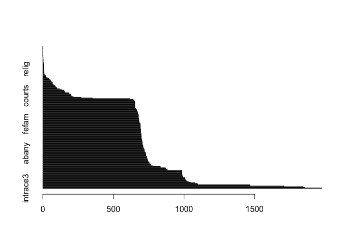

``` r
plot(missing_data)
```

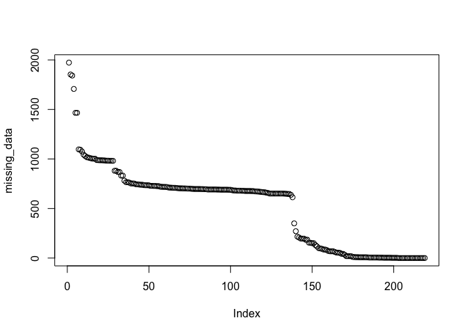

``` r
hist(missing_data)
```

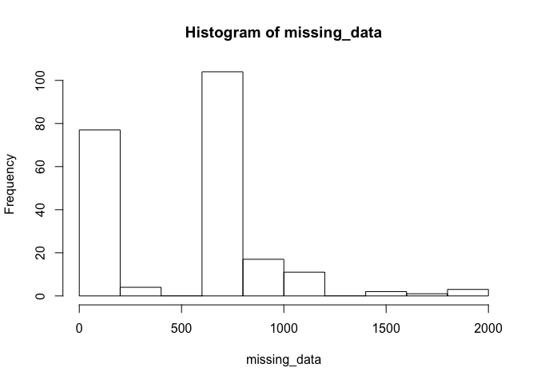

``` r
missing <- head(missing_data, n = 20)

dotchart(t(missing))
```

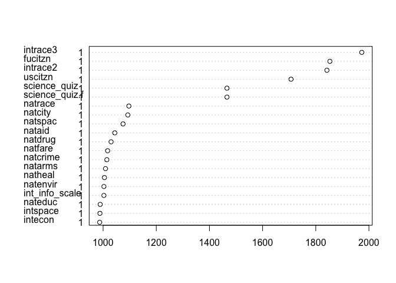

``` r
barplot(missing, horiz = TRUE)
```

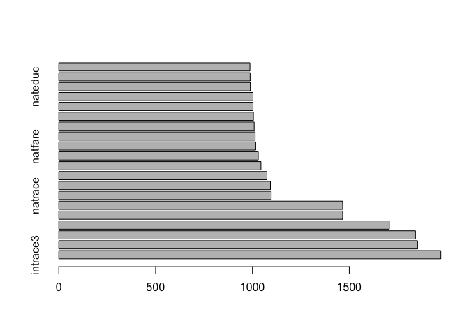

-   Missingness tends to be concentrated among a small group of variables.
-   The most missing are demographic questions such as citizenship and race, then science\_quiz, and then the questions regarding national priorities.
-   The responses tend to form into two tiers - commonly answered, and not so commonly answered, with a smaller third tier.

#### Skew and Normality

``` r
hist(df$age)
```

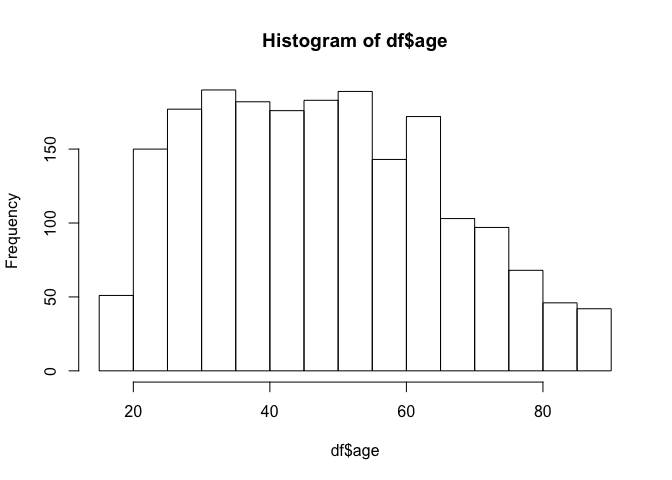

-   Most people in the dataset are of working age (18-75).
-   Data is fairly normally distributed, perhaps some skew towards mid-thirties and again mid-forties.

``` r
plot(df$race)
```

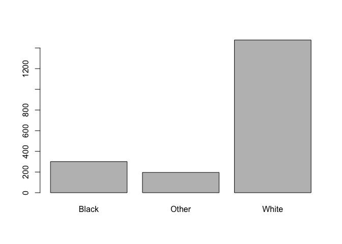

-   The dataset is very skewed towards white individuals.

``` r
plot(df$sex)
```


-   Slight skew towards female respondents

``` r
polview <- ordered(df$polviews, levels = c("ExtrmCons", "Conserv", "SlghtCons", "Moderate", "SlghtLib", "Liberal", "ExtrmLib"))
plot(polview)
```

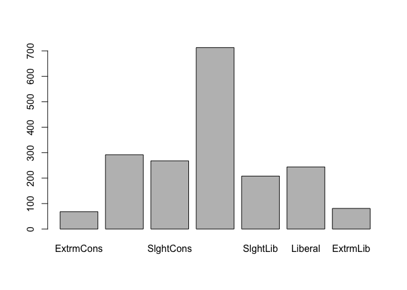

-   Most people consider themselves moderates, but generally there is a slight conservative bias in the dataset.

#### Issue: Lack of Mutual Exclusivity in Responses for Abortion Attitude Questions

``` r
plot(df$abany ~ df$abdefect)
```

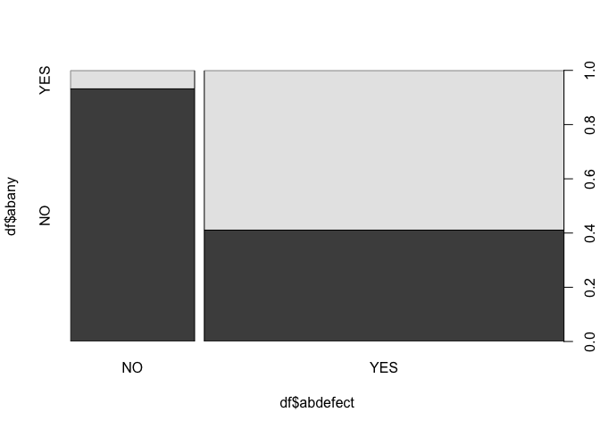

-   Potential data quality issue: some people who say they support unconditional access to abortion are responding that they are opposed to abortion in the case of birth defects.

``` r
plot(df$abany ~ df$abdefect + df$abhlth + df$abnomore + df$abpoor + df$abrape + df$absingle)
```

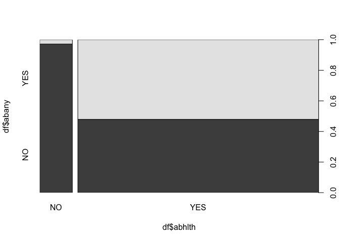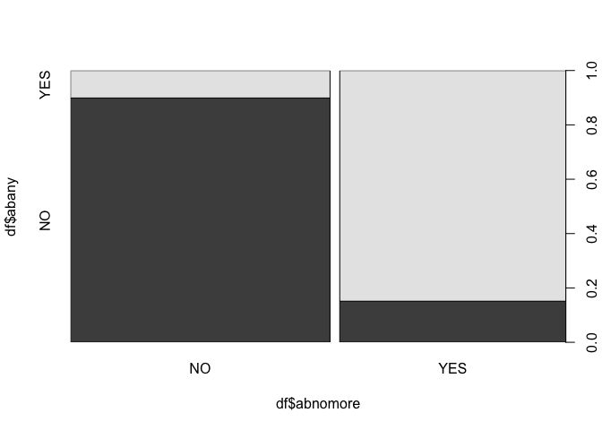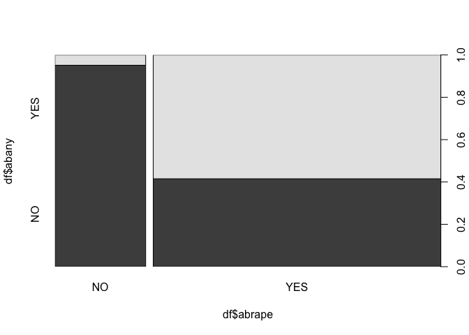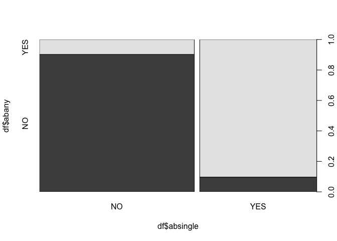

-   This data quality issue appears to persist - perhaps an issue with the survey design or skip logic.

#### Methodological concerns regarding questions on racial attitudes

-   There are some questions regarding racial attitudes which are potentially misleading/unclear

``` r
wrkwayup <- ordered(df$wrkwayup, levels = c("AGREE STRONGLY", "AGREE SOMEWHAT", "NEITHER AGREE NOR DISAGREE", "DISAGREE SOMEWHAT", "DISAGREE STRONGLY"))

plot(df$spkrac ~ wrkwayup)
```

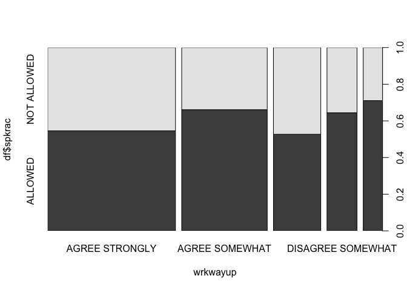

-   Tolerance for individual advocating racial inferiority of black individuals vs. a loaded statement regarding "working ones way up" vis-a-vis black invididuals.
-   Interesting that there is no clear trend, but appears to be some decrease in tolerance for that individual with people who strong disagree with the statement.

``` r
plot(df$closeblk ~ df$spkrac + wrkwayup)
```

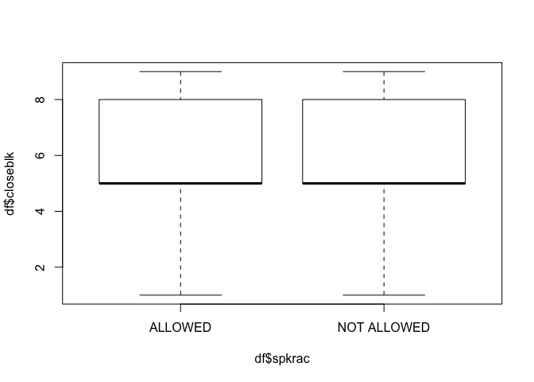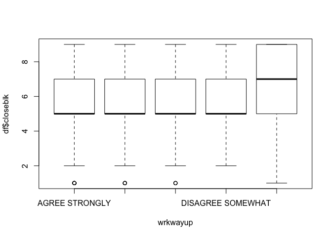

``` r
hist(df$closeblk)
```

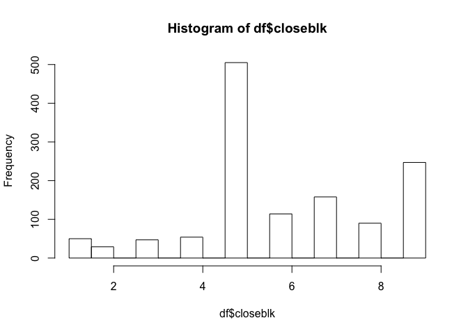

``` r
plot(df$spkrac)
```


``` r
plot(wrkwayup)
```

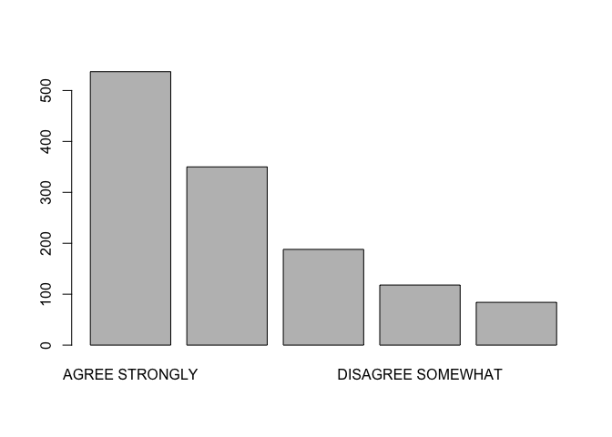

-   Interesting that "closeness" to black individuals seems to have no meaningful association with other variables.

-   The plot closeblk vs wrkwayup is interesting for its final category, vigorous disapproval which has a wider distribution and also contains only values indicating strong "closeness" to black individuals. This suggests the question is flawed and maybe draws out highly charged, or non-representative answers. This is supported by the unusually similar distributions across the other categories.

``` r
tdf <- data.frame(df$closeblk, df$closewht, df$race)
colnames(tdf) <- c("closeblk", "closewht", "race")

ggplot(tdf, aes(closeblk, closewht)) +
  geom_point() +
  geom_jitter()
```

    ## Warning: Removed 680 rows containing missing values (geom_point).

    ## Warning: Removed 680 rows containing missing values (geom_point).

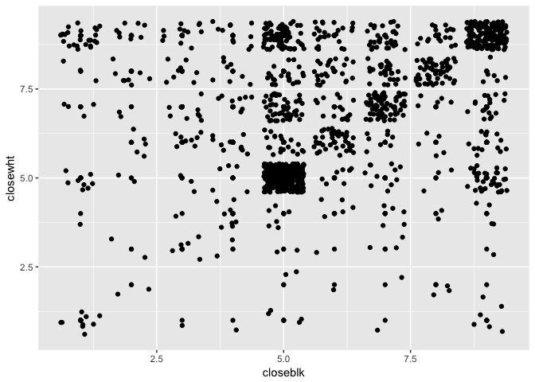

``` r
ggplot(tdf, aes(closeblk, closewht, colour = race)) +
  geom_point() +
  geom_jitter()
```

    ## Warning: Removed 680 rows containing missing values (geom_point).

    ## Warning: Removed 680 rows containing missing values (geom_point).

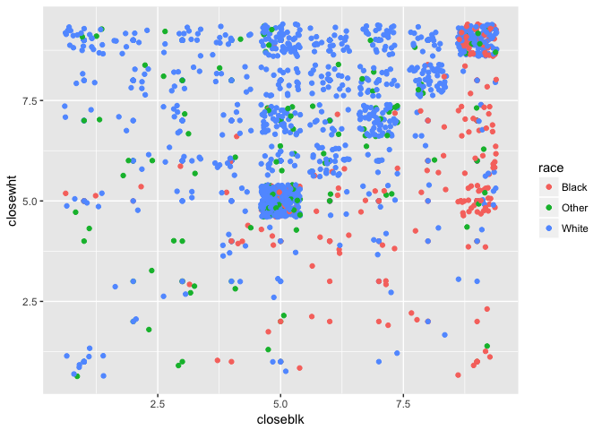

    * Dotplot with jitter confirms the above suppositions. Many people choose round values (5, 8), and there is a clear tendency to select the same value for both questions. 
    * The question is therefore flawed in some way as much of these answers are likely not representative of respondents true internal state. 
    * It is worth noting, however, that closeness to white is clearly more common than closeness to black. 
    * This can probably be considered due to the large white bias in the dataset.
    * Notice, however, that it does seem to be a one or the other scenario (close to black, or close to white). Other is too small to be accurately represented.

``` r
tdf <- na.omit(data.frame(cbind(df$closeblk, df$black_traits, df$white_traits, df$closewht, df$race)))
colnames(tdf) <- c("closeblk", "black_traits", "white_traits", "closewht", "race")

ggplot(tdf, aes(closeblk, black_traits, colour = race)) +
  geom_point() +
  geom_jitter()
```


``` r
ggplot(tdf, aes(closewht, white_traits, colour = race)) +
  geom_point() +
  geom_jitter()
```

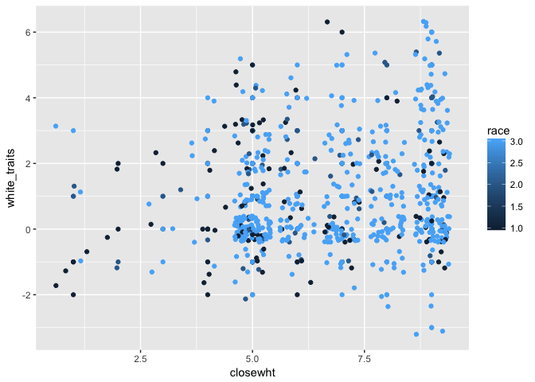

    * The codebook does not clarify what exactly the black/white_traits variable means. I will assume based on the wording of the entry that it means if respondents are able to identify stereotypes of a particular group, as the brief description suggestions. 
    * If that is so, then the plot would suggest individuals in general struggle to describe their closeness to a group, as assessed by their ability to identify stereotypes (a proxy for knowledge about the life/social condition of that group)

``` r
ggplot(tdf, aes(closewht, white_traits)) +
  geom_count()
```

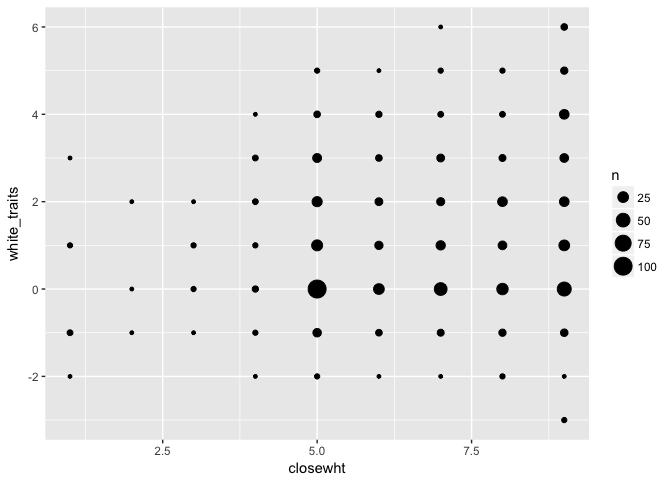

-   Note the binning by discrete survey response choices.

Correlations and Associations
=============================

This section looks into the following questions:

-   How much variation/error exists in my statistical estimates? Is there a pattern to it?

-   What type of variation occurs within my variables?

-   What type of covariation occurs between my variables?

``` r
plot(df[,1:10])
```

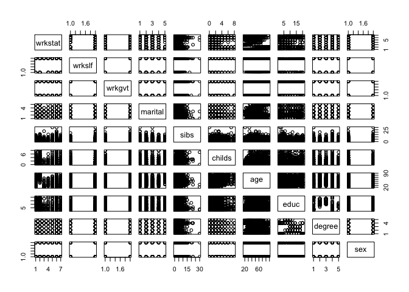

-   The data is clearly categorical, so associations would be best identified by comparing based in small subsets based on heuristics.

Economic Status Associations
----------------------------

``` r
ggplot(df, aes(df$marital, df$wrkstat, colour = df$sex)) +
  geom_point() +
  geom_jitter()
```

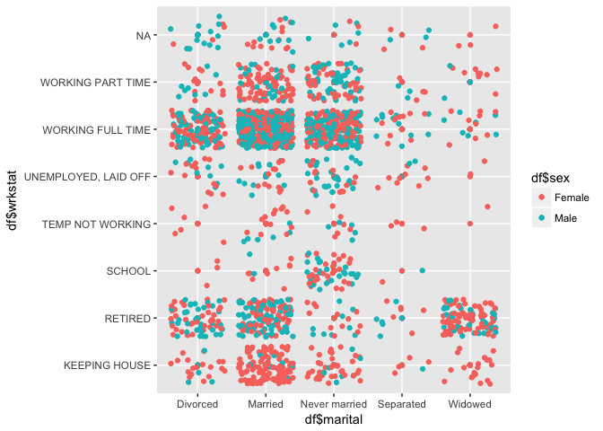

-   Most full-time workers are married or divorced, with some lifetime singles.

``` r
plot(df$wrkslf ~ df$age)
```

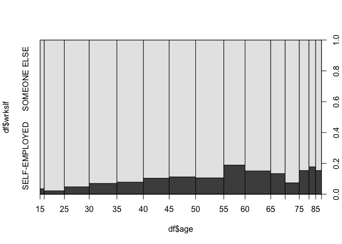

-   Middle aged and elderly are most commonly self-employed; trend does increase with age overall.

``` r
ggplot(df, aes(x = wrkgvt, y = polviews)) + 
  geom_bin2d()
```

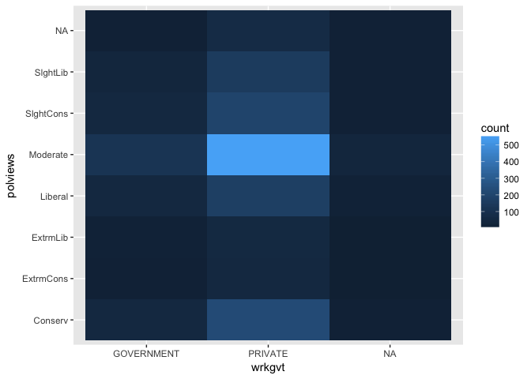

-   Moderates seem more often to work for government, conservatives tend to work for the private sector - confirms simple heuristic.

``` r
plot(df$getahead ~ df$race)
```


-   Attitudes towards acquisition of wealth/success by race. No substantial differences.

``` r
fechld <- ordered(df$fechld, c("STRONGLY AGREE", "AGREE", "DISAGREE", "STRONGLY DISAGREE"))

plot(df$kids ~ fechld)
```

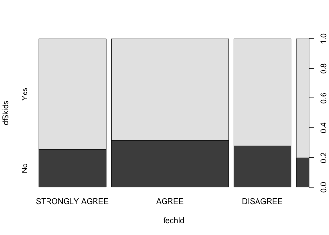

-   Asking whether a working mother can establish as strong connection with children vs those who have children.
-   It seems like extreme values are the only ones with some noticeable variation.

Social Issue Associations
-------------------------

### Abortion

``` r
plot(df$abany)
```

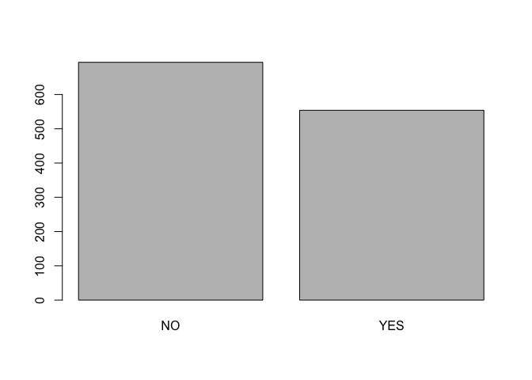

-   Support for access to legal abortion in any situation. Clear majority oppose categorically.

``` r
plot(df$abany ~ df$pres08)
```

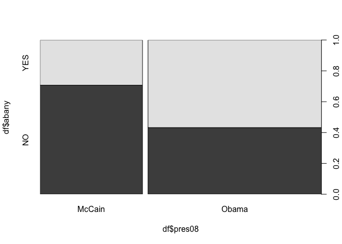

-   Support for access to legal abortion by 2008 votes for President.

``` r
plot(df$abany ~ df$marital)
```

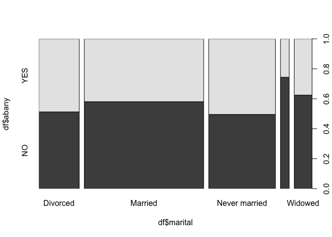

    * No clear trend on the basis of marital status re: support for unconditional abortion access.

``` r
plot(df$abany ~ df$sex)
```

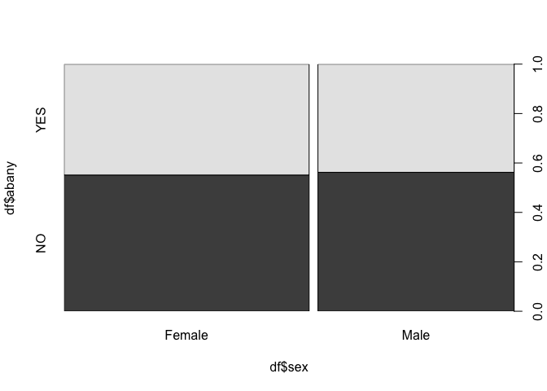

-   Little distinction for support for unconditional abortion access on the basis of sex.

``` r
plot(df$abany ~ df$natcrime)
```

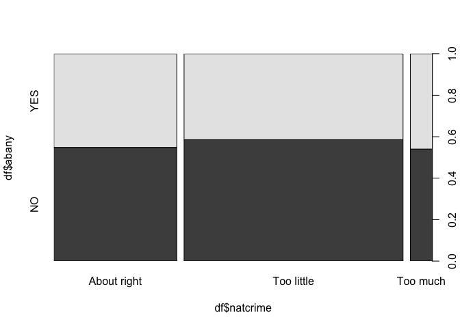

-   Attitudes towards unconditional abortion access compared to perceived amount spending on law enforcement.

-   Slight increase in the "too little" category.

-   May reflect feelings towards authority, morality, etc.

``` r
plot(df$abany ~ df$natrace)
```

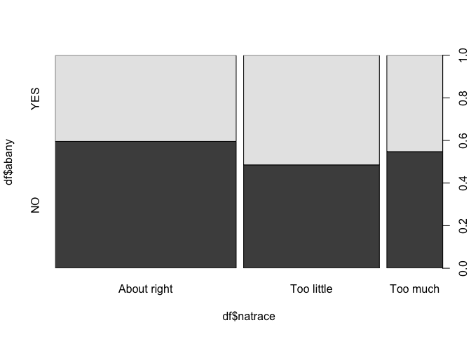

-   No clear trend on the basis of belief on spending to improve African Americans' lives.
-   The hypothesis here was that maybe unconditional support for abortion would be tied to attitudes on racial justice.

``` r
plot(df$abany ~ df$spkath)
```


-   This supports the above hunch - that attitudes towards abortion are also tied to beliefs about authority and tolerance.

-   Note the people who would not allow an atheist to speak in their town are also more likely to oppose unconditional abortion access.

``` r
plot(df$abany ~ df$spkmslm)
```

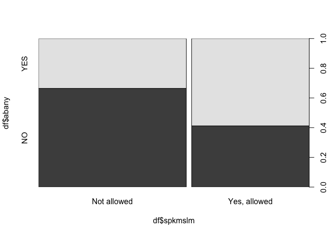

-   We see the same trend, but somewhat weaker, as regards an individual "preaching hatred" against the United States.

Trying the same process, but for a less jingoistic item. An individual claiming black people are genetically inferior:

``` r
plot(df$abany ~ df$spkrac)
```

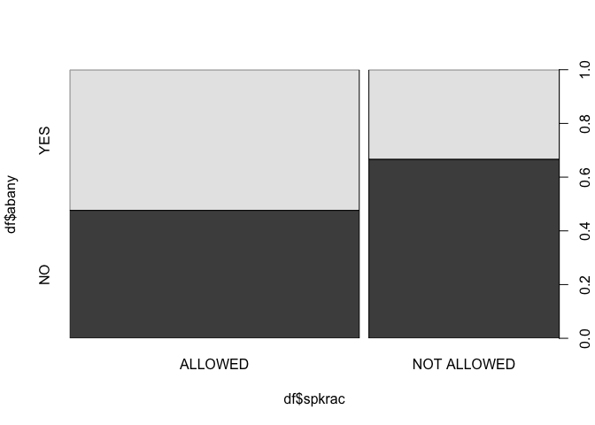

``` r
ggplot(df, aes(x = abany, y = spkrac)) +
  geom_count()
```

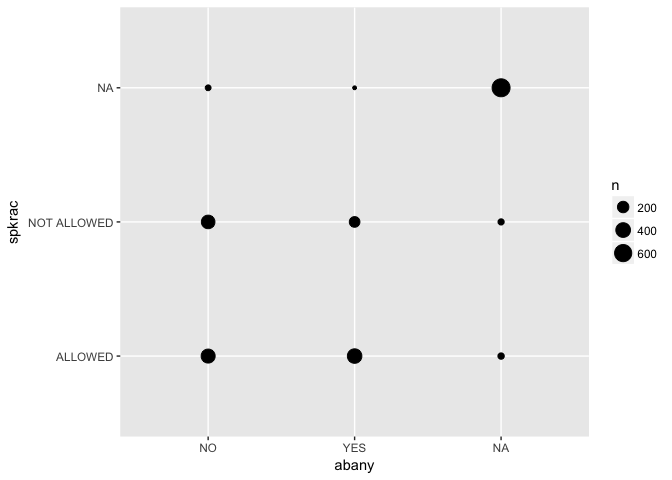

-   The trend holds for the issue of racial prejudice as well, roughly at the same rate as "preaching hatred".

``` r
plot(df$abany ~ df$spkcom)
```

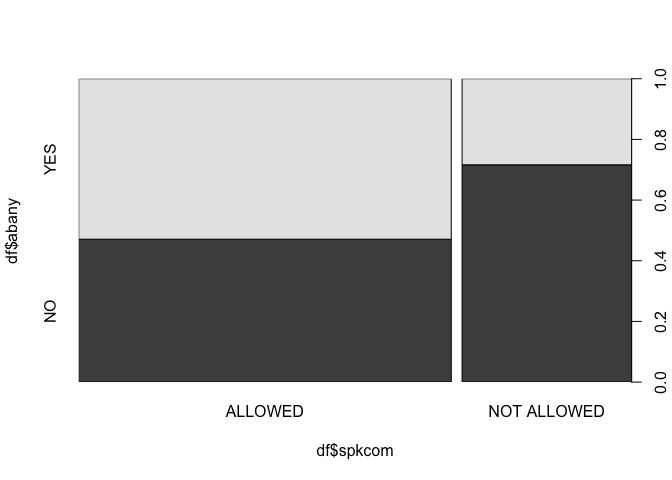

``` r
ggplot(df, aes(x = abany, y = spkcom)) +
  geom_count()
```

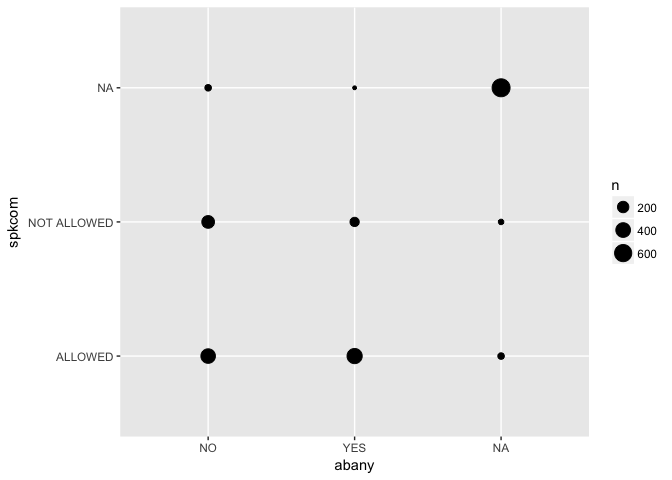

-   In the scenario of an admitted communist the trend holds.

``` r
plot(df$abany ~ df$spkhomo)
```

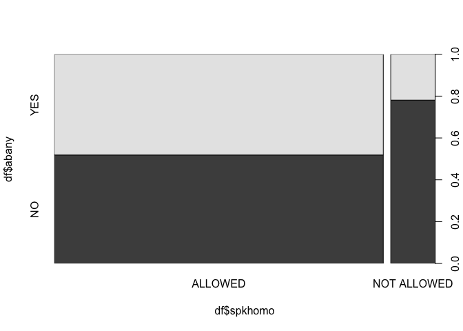

``` r
ggplot(df, aes(x = abany, y = spkhomo)) +
  geom_count()
```

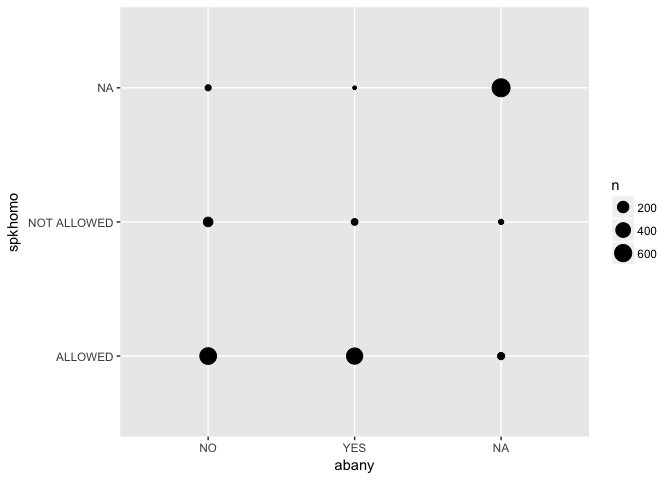

-   Interesting that this (should a homosexual be allowed to speak) aligns quite a bit with the question on an atheist speaking. It seems what is really the crux of the issue might be religion.

#### Support for Abortion and Religion

``` r
plot(df$abany ~ df$relig)
```

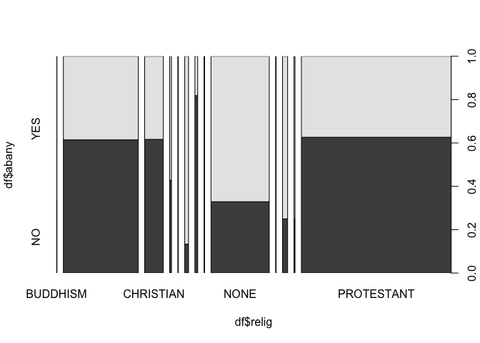

``` r
ggplot(df, aes(abany, relig)) + 
  geom_count()
```

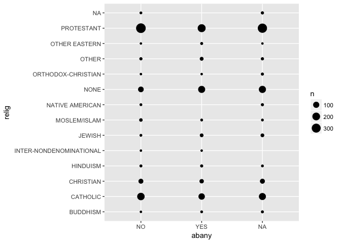

``` r
counts_relig_abany <- table(df$relig, df$abany)

ggplot(df, aes(df$abany, df$relig)) + 
  geom_bin2d()
```

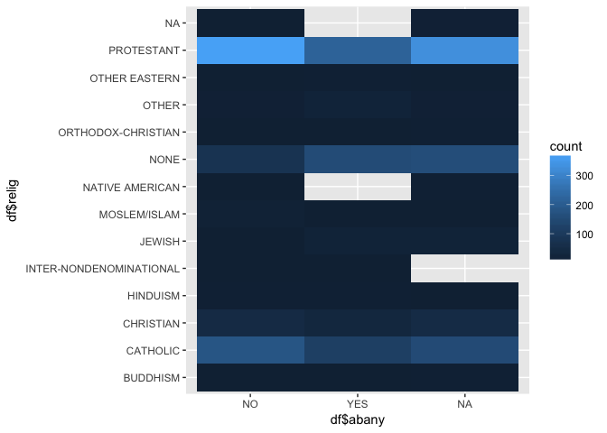

``` r
# Try to visualize in a new way:
plot(counts_relig_abany)
```

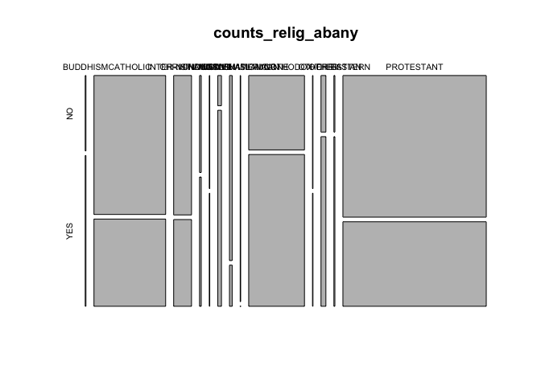

-   On another contentious issue, we see no significant trend with religious identification. Results vary widely, except among Christian groups, which are unusually consistent. This may point to an issue with the data quality re: Christians.

Let's try with people who feel they were reborn, this should capture a broader scope of Christians than just denominations. It also gets at the more robust believers, which, per my theory, should be strongly, negatively, associated with support for abortion.

``` r
plot(df$reborn_r ~ df$abany)
```

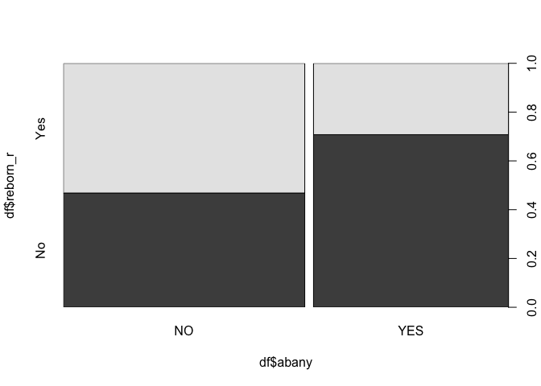

-   This once again supports the theory, as we see a substantial difference in support based on "reborn" status.

``` r
ev <- ordered(df$evangelical, levels = c("High", "Mod", "Low"))
plot(ev ~ df$abany)
```

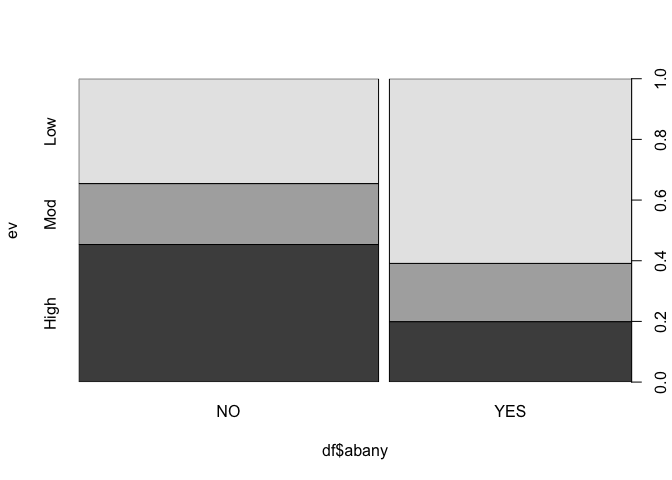

-   To some extent identification with a particular sub-group of Christianity does seem to covary with support for abortion, but not to as large an extent as I would have thought.

#### Abortion and Attitudes on Sexual Practices

``` r
plot(df$abany ~ df$pornlaw)
```

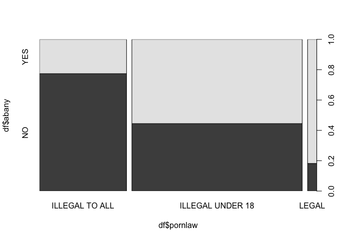

-   Attitudes towards pornography - again we see that 80% figure in opposition in the most socially conservative option.

``` r
xmarsex <- ordered(df$xmarsex, levels = c("ALWAYS WRONG", "ALMST ALWAYS WRG", "SOMETIMES WRONG", "NOT WRONG AT ALL"))

plot(df$abany ~ xmarsex)
```

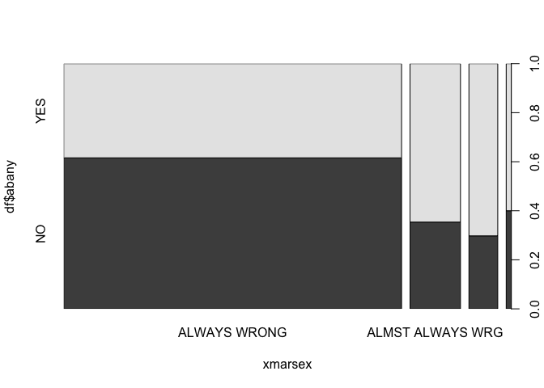

-   Attitudes on extramarital sex are not as strong as attitudes towards pornography or tolerance of homosexuality.

``` r
plot(df$abany ~ df$homosex)
```

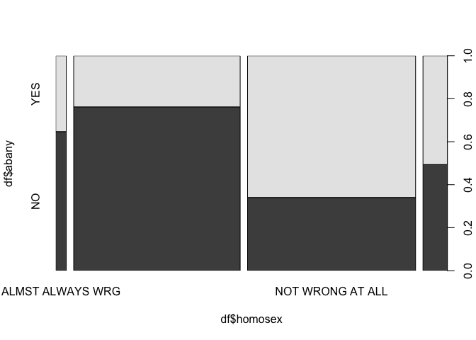

-   Attitudes on homosexual sex again bring out that 80% figure among the opposed.

``` r
polview <- ordered(df$polviews, levels = c("ExtrmCons", "Conserv", "SlghtCons", "Moderate", "SlghtLib", "Liberal", "ExtrmLib"))

plot(df$abany ~ polview)
```

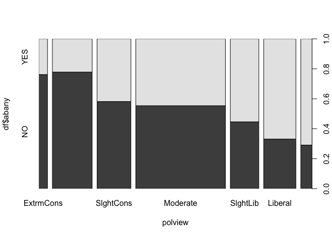

``` r
tdf <- data.frame(polview, df$abany)


ggplot(tdf, aes(y = polview, x = df.abany)) +
  geom_bin2d()
```


-   Unsurprisingly, unconditional support for abortion seems to be a strong indicator of conservative/liberal identity.

``` r
bibley <- ordered(df$bible, levels = c("WORD OF GOD", "INSPIRED WORD", "BOOK OF FABLES"))

tdf <- data.frame(df$abany, bibley)

ggplot(tdf, aes(x = bibley, y = df.abany)) + 
  geom_bin2d()
```


``` r
plot(df$abany ~ bibley)
```

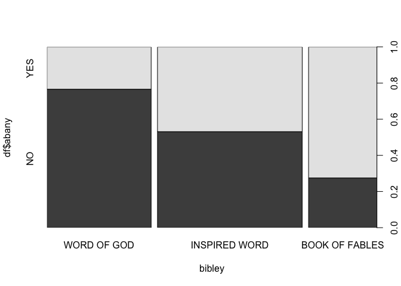

-   We see this trend again when looking at people's belief in the bible as the word of God vs attitudes on abortion. The trend is less clear with the binned histogram - a regular histogram appears to communicate the point more clearly.

``` r
ggplot(df, aes(x = pornlaw, y = premarsx)) + 
  geom_bin2d()
```

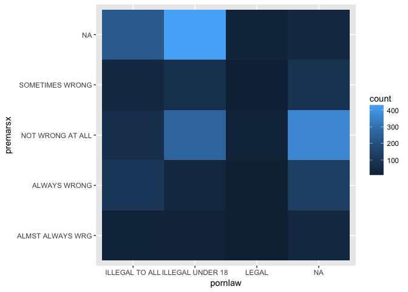

-   Exploring attitudes using some more straightforward measures of social conservativism - attitude towards premarital sex and pornography. No clear overall trend.

### Economic Equality and Attitudes on Sexual Practices

``` r
tdf <- data.frame(df$eqwlth, df$pornlaw)
tdf <- na.omit(tdf)

ggplot(na.omit(tdf), aes(x = df.eqwlth, y = df.pornlaw)) +
  geom_bin2d() 
```

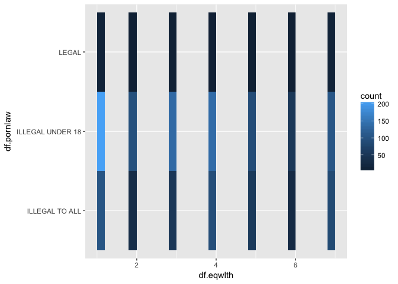

-   Interesting dynamic in status-quo supporters (Illegal under 18). Support is generally high for government acting to promote equal wealth (eqwlth), but support for status quo wanes as we move away (towards 7 on y-axis).
-   Interesting also that this is not necessarily reflected in a growth in support among abolishionists (Illegal to all).

### Economic Inequality Associations

``` r
plot(df$eqwlth ~ df$getahead)
```

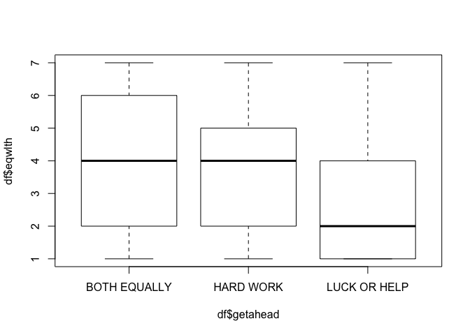

-   Not suprisingly, belief that you need help or luck to get ahead appears strongly associated with strong attitudes on governments' role in promoting equality.
-   This dynamic is only present on one end. This may mean you feel inequality is a problem or you are apathetic.
-   Note also the strong skew in the "Luck or help" category

``` r
deg <- ordered(df$degree, levels = c("<HS", "HS", "Junior Coll", "Bachelor deg", "Graduate deg") )
plot(df$eqwlth ~ deg)
```

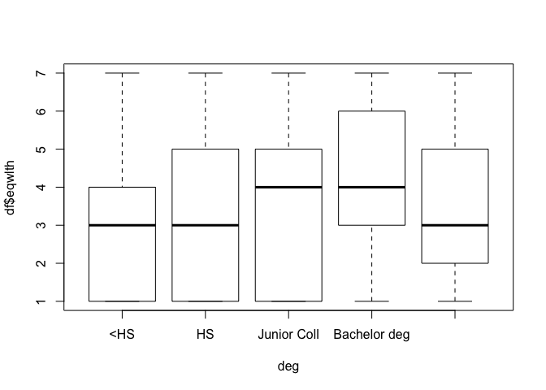

``` r
tdf <- data.frame(deg, df$eqwlth, df$polviews)

ggplot(tdf, aes(deg, df.eqwlth, colour = df.polviews)) +
  geom_boxplot()
```

    ## Warning: Removed 650 rows containing non-finite values (stat_boxplot).


``` r
ggplot(tdf, aes(colour = deg, y = df.eqwlth, x = df.polviews)) +
  geom_col()
```

    ## Warning: Removed 650 rows containing missing values (position_stack).

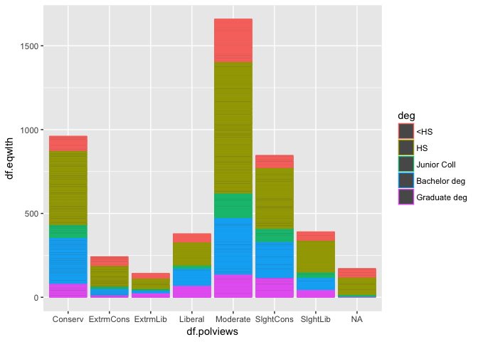

-   Interesting trend between education and belief in importance of government interventions to equalize wealth.
-   While less education appears to be associated with higher belief in the importance of equalizing interventions, junior college and bachelor degree holders appear to rank it lower. This trend reverses with graduate education.

Faith/Confidence in Institutions Associations
---------------------------------------------

``` r
conclerg <- as.character(df$conclerg)
conclerg <- ordered(conclerg, levels = c("A GREAT DEAL","ONLY SOME",  "HARDLY ANY"))

confed <- as.character(df$confed)
confed <- ordered(confed, levels = c("A GREAT DEAL","ONLY SOME",  "HARDLY ANY"))

tdf <- na.omit(data.frame(cbind(conclerg, confed)))
colnames(tdf) <- c("conclerg", "confed")

ggplot(tdf) + 
  geom_violin(aes(x = conclerg, y = confed))
```

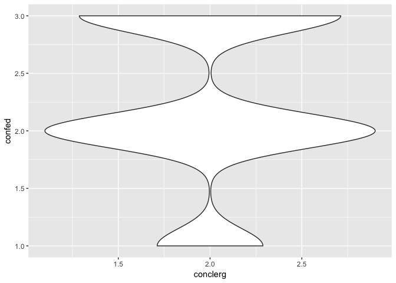

``` r
plot(conclerg ~ confed)
```

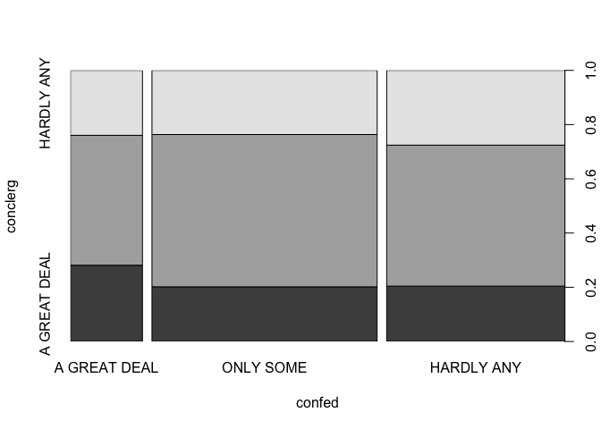

-   Confidence in religious institutions and the executive branch of government seem to dovetail nicely.
-   Maybe this reflects a broader sentiment towards authority?
-   Violin plot is not particularly insightful here.

``` r
conclerg <- as.character(df$conclerg)
conclerg <- ordered(conclerg, levels = c("A GREAT DEAL","ONLY SOME",  "HARDLY ANY"))
obey <- as.character(df$obey)
obey <- ordered(obey, levels = c("MOST IMPORTANT", "2ND IMPORTANT", "3RD IMPORTANT", "4TH IMPORTANT", "LEAST IMPORTANT"))

plot(conclerg ~ obey)
```

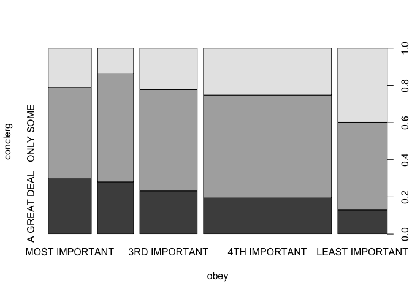

``` r
ggplot(data.frame(conclerg, obey), aes(x = conclerg, y = obey)) +
  geom_point()+
  geom_jitter()
```

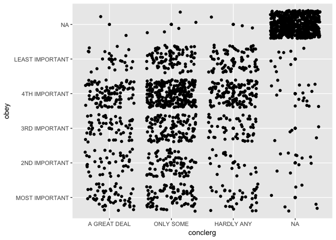

-   Confidence in religious individuals and belief in importance of children obeying their parents
-   This does not appear to challenge or support my assertion that sentiments toward authority carry across institutions.

``` r
plot(df$militarist_tol ~ df$con_govt)
```

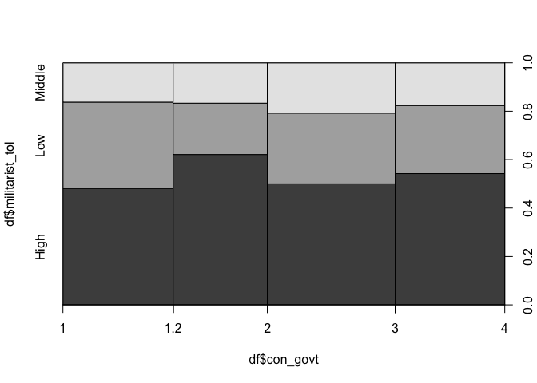

-   Militarism doesn't seem to be associated in any systematic way with confidence in the government.

``` r
deg <- ordered(df$degree, levels = c("<HS", "HS", "Junior Coll", "Bachelor deg", "Graduate deg") )
plot(df$con_govt ~ deg)
```

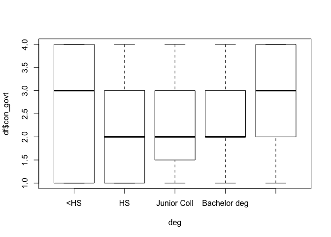

-   Interestingly, more education seems to be associated with steadily less confidence in government. Although there is an interesting jump at graduate level-education.
-   Also interesting to note is the strong skew in the Bachelor level responses. All others are - to a greater or lesser extent - normally distributed.

``` r
deg <- ordered(df$degree, levels = c("<HS", "HS", "Junior Coll", "Bachelor deg", "Graduate deg") )

plot( deg ~ df$con_govt + df$conarmy + df$conclerg + df$conbus + df$coneduc + df$contv + df$consci)
```

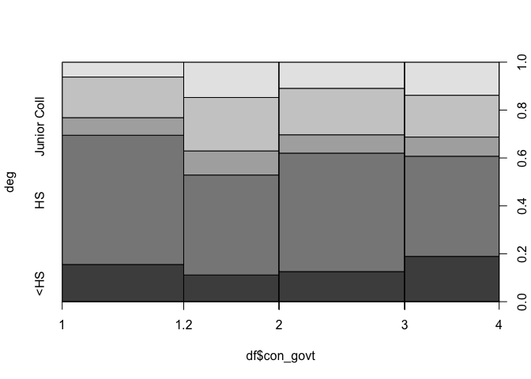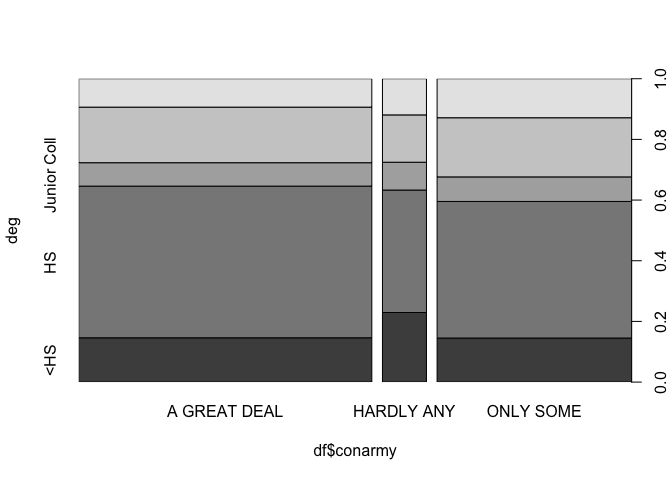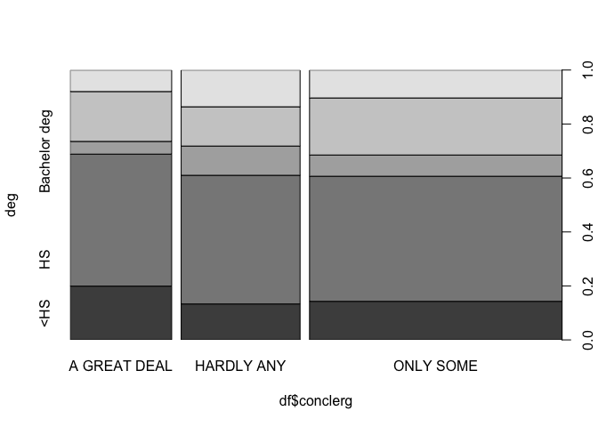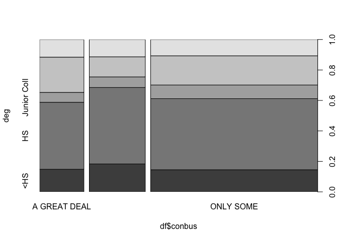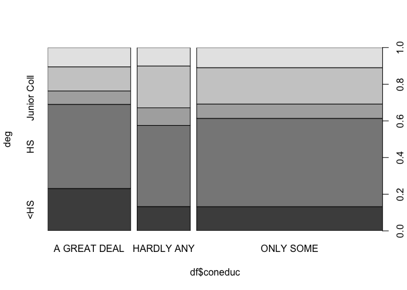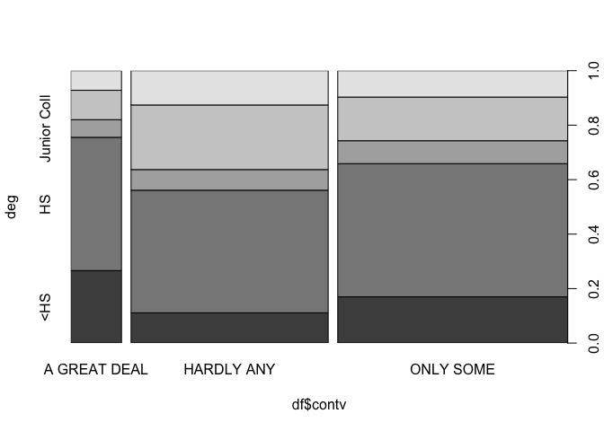

-   Individuals with less than high school education have high confidence in education.

``` r
plot(df$gunlaw ~ df$con_govt)
```

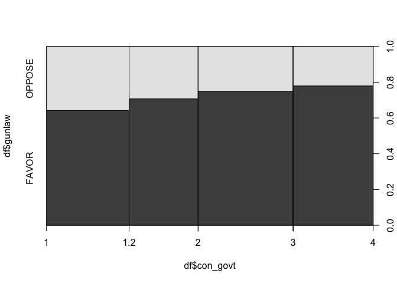

-   As confidence in government declines support for gun control increases - somewhat counterintuitive
-   Maybe this suggests "liberals" are more cynical/pessimistic?

``` r
plot(df$gunlaw ~ df$conlegis)
```

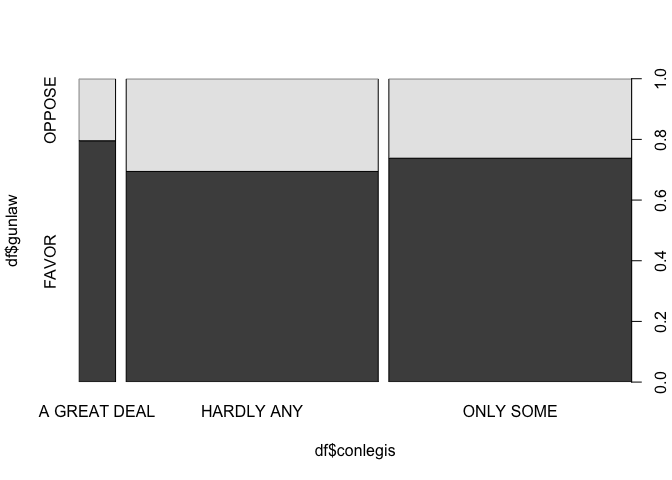

``` r
polview <- ordered(df$polviews, levels = c("ExtrmCons", "Conserv", "SlghtCons", "Moderate", "SlghtLib", "Liberal", "ExtrmLib"))

hap <- ordered(df$happy, levels = c("NOT TOO HAPPY", "PRETTY HAPPY", "VERY HAPPY"))

plot(hap ~ polview)
```

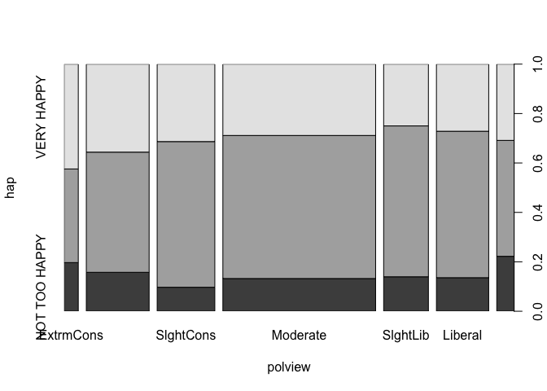

-   Actually it appears to be that at both ends the "extremists" report greater unhappiness - this may be useful as a proxy for pessimism.

Misc. Social Issues Associations
--------------------------------

``` r
plot(df$gunlaw ~ polview)
```


#### Tolerance Assocations

``` r
ggplot(df, aes(df$militarist_tol, df$spkmslm, colour = df$polviews)) +
  geom_point() +
  geom_jitter()
```

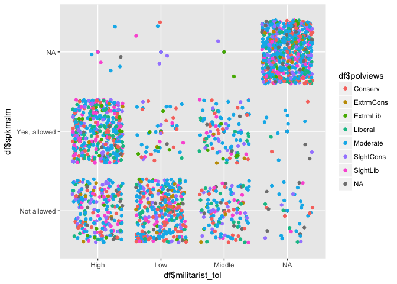

-   Interesting association between militarism and tolerance for opposing views (as examined through the example of an "anti-american" speaker).

``` r
militarist_tol <- ordered(df$militarist_tol, levels = c("High", "Middle", "Low"))

tdf <- na.omit(data.frame(militarist_tol, df$tolerance))

ggplot(tdf, aes(x = militarist_tol, y = df.tolerance))+
  geom_point()+
  geom_jitter()
```

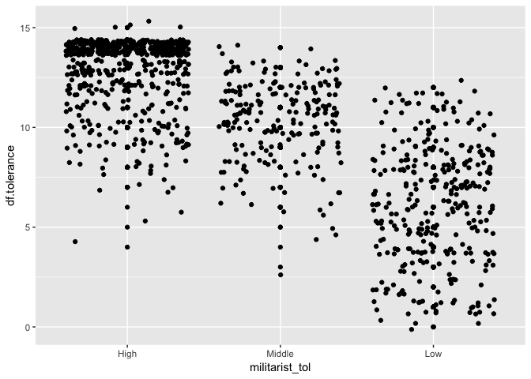

``` r
tdf <- na.omit(data.frame(df$owngun, df$tolerance, df$partyid))

ggplot(tdf, aes(y = df.owngun, x = df.tolerance, colour = df.partyid)) +
  geom_point() +
  geom_jitter()
```

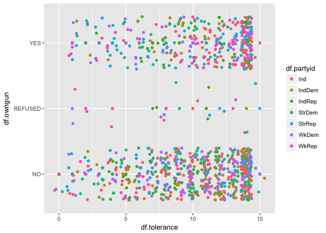

-   Tolerance measure and gun ownership. While obviously many people in the dataset own guns, the distributions are fairly similar.

``` r
polview <- ordered(df$polviews, levels = c("ExtrmCons", "Conserv", "SlghtCons", "Moderate", "SlghtLib", "Liberal", "ExtrmLib"))
tdf <- na.omit(data.frame(polview, df$tolerance, df$reborn_r))

ggplot(tdf, aes(x = polview, y = df.tolerance, colour = df.reborn_r)) +
  geom_point() +
  geom_jitter()
```

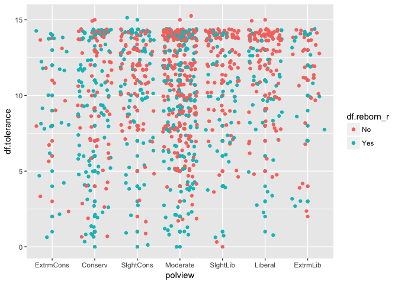

``` r
boxplot(df$tolerance)
```

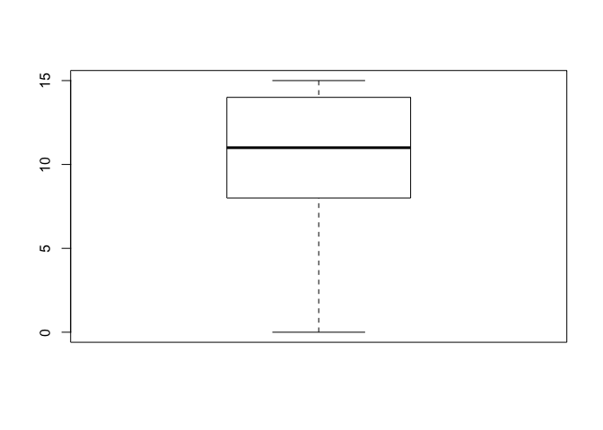

-   Interesting that there is relatively little trend as regards tolerance. The mass of the distribution is quite "high", however.
