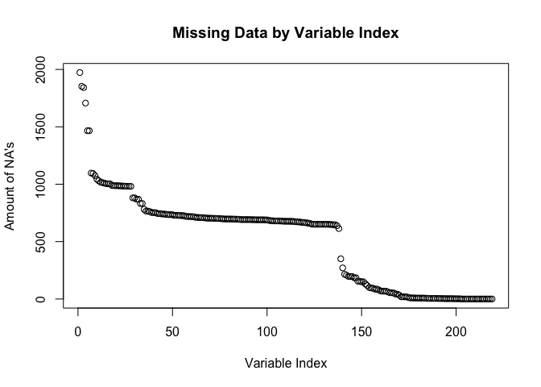
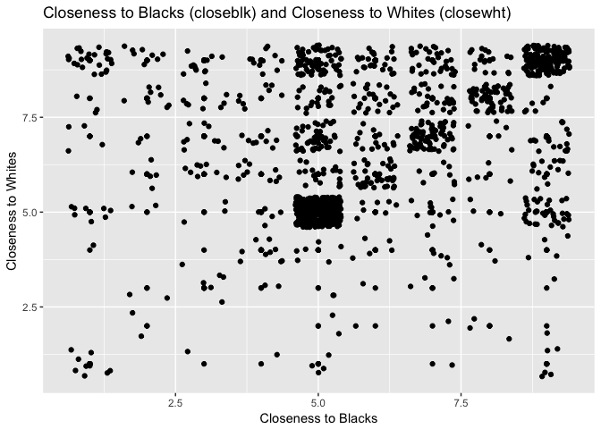
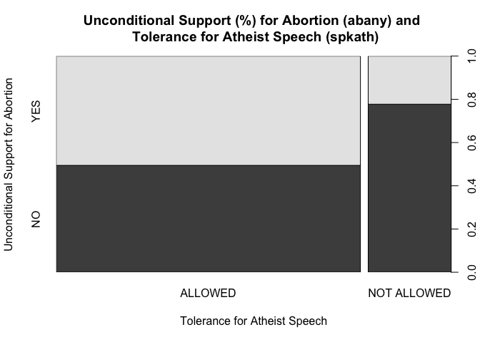
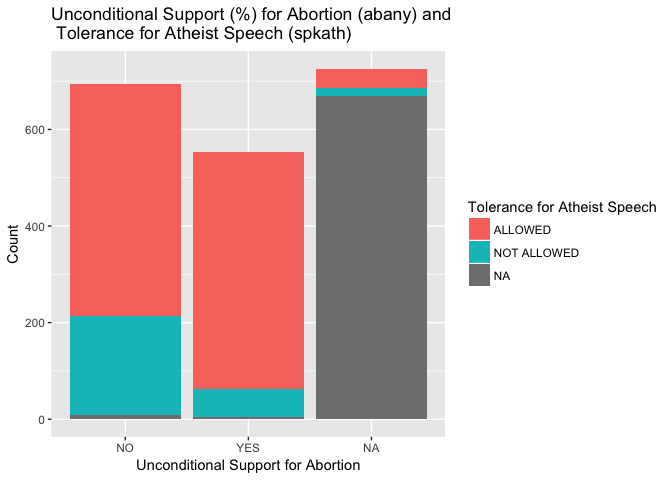
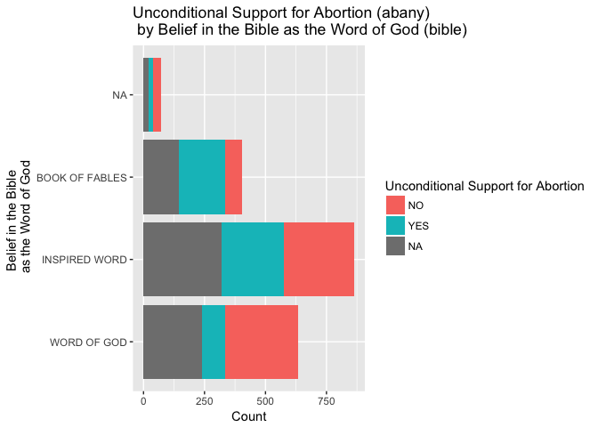
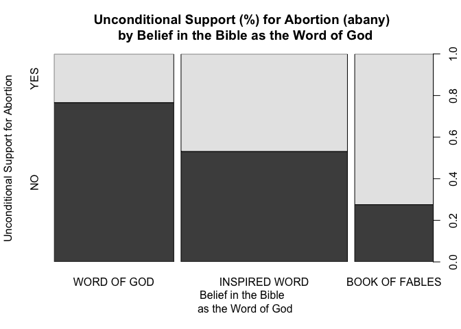
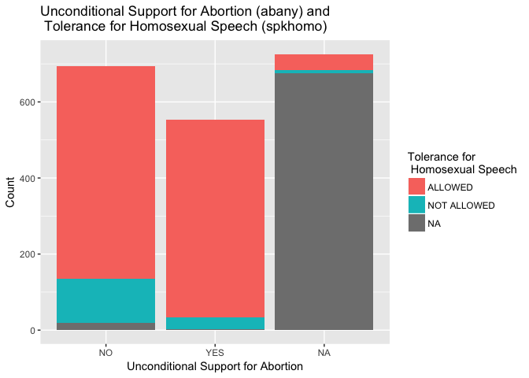
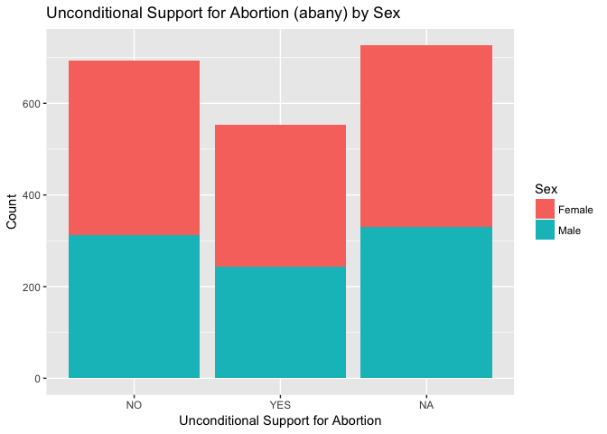
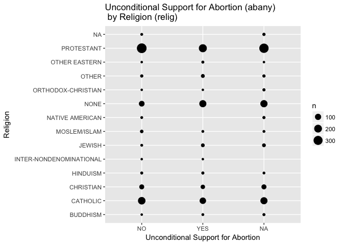

EDA Assignment Notebook 2
================
Tyler Amos

Insight Summary from Exploratory Data Analysis
==============================================

### Insights on Data Quality and Completeness

The General Social Survey (GSS) dataset (as provided) appears to have three tiers of variables with missing data. A small number of variables have a very high number of "NA" values, while the majority fall into either a higher or lower tier of completeness. This is likely attributable to the survey's skip logic. Some questions would be asked to all respondents, whereas others would be asked on the basis of respondents' previous responses.

The dataset is also skewed in a number of ways, for example:

-   Strong skew towards white individuals;
-   Slight skew towards women;
-   Slight skew towards self-identified conservatives;
-   Strong skew towards self-identified moderates;
-   Some generational "humps" at certain ages (e.g., mid-thirties, mid-forties).

Additional issues with data quality arose when examining self-reported measures of "closeness" to black and white communities. As is clear from the plot below, self-reported scores most often fall on round figures (5, 8), suggesting respondents are not providing thoughtful answers. There is also a clear tendency for individuals to report the same score for closeness to white individuals as black individuals, as evidenced by the diagonal positive trend in the plot.

Lastly, and most relevant for the next portion of this discussion, my exploratory analysis appeared to identify an issue with the survey skip logic regarding questions on abortion. Specifically, there is a small, but persistent number of respondents who indicate categorical opposition to abortion (abany), yet when comparing these answers with the other abortion questions (e.g., abdefect), some individuals who were categorically opposed indicate their openness to this qualified situation.

### Potential Research Questions:

In order to focus my exploratory analysis, I chose to concentrate on one issue and explore that issue from a variety of angles. Specifically, I selected support for access to abortion. Based on my exploratory analysis, I could propose a research question as follows:

-   What are the demographic characteristics which best predict individual support for abortion access?
    -   What are the demographic characteristics which best predict qualified support for abortion access?
        -   E.g., Which characteristics best predict support for abortion in the case of a risk to the mother's health?

*Hypothesis:* Characteristics which encode attitudes towards authority and tolerance will be most predictive of support for abortion.

#### Supporting Exploratory Analysis

Through exploratory analysis, it became apparent that there was an association between attitudes towards authority, tolerance for opposing viewpoints, and support for access to abortion. This developed into a heuristic which implied individuals who hold strong beliefs opposing access to abortion are also likely to hold strong beliefs regarding moral dualities (right/wrong, permissible/not permissible).

This heuristic resulted in the following association being identified: Individuals with strong feelings against abortion (unconditional opposition) often display less tolerance for the speech of individuals with whom they disagree. The plot below highlights one such case.

Interestingly, support for abortion did not appear to covary with certain indicators of attitudes towards authority/morality. For example, attitudes regarding unconditional access to abortion did not have a notable variation by perceived importance of spending on law enforcement (natcrime).

This finding led to a focus on touchstone social conservative issues, specifically those related to sexuality and gender (e.g., tolerance of homosexuality, pornography). As with a number of other issues, attitudes towards pornography (pornlaw), extra-marital sex (xmarsex) and homosexuality (homosex) drew out substantial variation in responses between abortion opposers and supporters. In fact, responses for these "hot button" issues consistently provide similar results, with between 60-80% of opposing individuals in common.

Unsurprisingly, respondents' religiousity, as measured by Christians' belief that the bible is the literal word of their god (bible), did appear to have a notable association with support for access to abortion.

One of the more interesting findings, and the motivator for the above hypothesis, is that a recurring population of abortion-opposing individuals appeared in similar numbers while examining tolerance for various types of speech. When presented with the hypothetical scenario of allowing an individual opposed to all churches and religion, or an anti-US muslim cleric, or an avowed communist to speak, dual-opposers were reliably between 60-80% of individuals opposed.

### Surprising Findings

The most unexpected finding was the level of opposition to unconditional abortion in the sampled population. In fact, opposition (55%) to unconditional access to abortion outweighs support (44%). In light of abortions' legal status in the United States, this is somewhat surprising. Another such finding is the lack of impact certain variables have on support for access to abortion. For example, support for abortion appeared not to vary greatly by respondents' sex, or religion (see below). Another surprising, and disconcerting, finding was the high number of respondents reporting that they felt homosexual sex (homosex) was morally wrong in some way ("Sometimes wrong": 6%, Almost always wrong": 2%, or "Always wrong": 45%).

