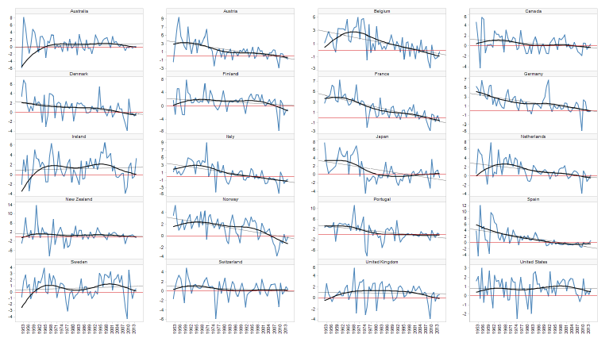
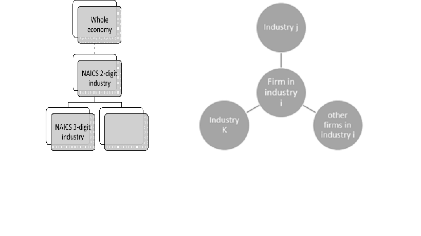

"Productivity isn't everything, but in the long run it is almost everything." ---- Paul Krugman

## Abstract
This proposal aims at measuring how the diffusion of innovation could potentially explain the productivity puzzle for the last decade after Global Financial Crisis. By applying an amplifying-asking survey system based on supervised learning model to survey data on firms and reported data in COMPUSTAT database, we try to document the structure of a productivity diffusion network from the perspective of human capital mobility, capital flow and input-output linkages.

## Introduction

### The productivity puzzle

A simple definition of productivity is a measure of output per unit of input. Productivity is very important in determining the long-term economic growth and living standards. According to some study (BOE 2017) for instance, if the productivity of UK has been constant since 1850, living standard there would only have doubled, trapped in the later-Victorian levles. 

However, unlike some other economic measures, the measure of productivity is not directly observable. A common measure of productivity ---- Total Factor Productivity (TFP) is calculated as the residual of a log-linear relation between inputs and outputs if we assume a Cobb-Douglas production function (by decomposing the output into the contribution generated by labor, capital, intermediary goods, energy etc). However, according to some studies, productivity has been slowing down for the last decade or so (see the chart below). A term has also been coined for this phenomenon of slowdown in productivity ---- "Secular stagnation" (Summers 2013). However, as topics like Big Data, Artificia Intelligence are occupying headlines almost everyday, people began to question why all the sprouting innovations we saw have translated into a slowing productivity growth? Namely, how to resolve the puzzle between this "secular stagnation" and "secular innovation"?

### Potential explantion and focus of this study

Numerous theories of explanations have emerged almost as soon as the puzzle itself has drawn much attention. One of them argues that it's not the slowdown in innovation that causes the slowdown in productivity, instead, it's the slow diffusion across firm within industries and across industries that fail to translate innovation growth into productivity growth at the scale of the whole economy (Newman et al (2015), Hoekman et al (2004)). In other words, the frequency and efficiency of resource allocation within and across industries has slowed down. More detailed explanations proposed to this slowdown in diffusion of innovation include increase in market power, lack of competition and a poor performance in the long tail of non-productive firms due to pooer management practice. 

Since the diffusion of innovation across firms and industries is usually carried out through the mobility of human capital, flow of funds and input-output linkages, this study will primarily focus on understanding more on the dynamics of productivity diffusion networks across firms and industries based on human capital, capital flow and input-output linkages, through an amplified-asking survey approach.

## Survey system design

### Overview

This study will leverage on our designed survey and a comprehensive Global firm-level database ---- COMPUSTAT to understand the productivity diffusion network within and across industry through the amplified-asking approach. 

In the first stage of the study, we will design an online survey to collect information on in/out-degree of other industries in terms of their influence of productivity from each firms. In the second stage, we will train a supervised-learning model based on our collected survey data and associated COMPUSTAT data and analyze its predicting accuracy performance. In the third stage, based on our trained model in stage2, we will impute survey data for all the firms in COMPUSTAT dataset to construct a fully-fleshed productivity diffusion network across time.

### Stage 1: Conducting survey

The main goal of this study is to understand the dynamics of network in which the productivity is diffused within and across industries. And we are interested in measuring this network from three perspectives: 
1. Human capital mobility 
2. Capital flow
3. Input output linkages.

In order to ensure the comprehensiveness of our coverage for supervised-learning in stage 2 and 3 of the study, we will utilize a hierarchical sampling-structure. We will firstly decompose the whole economy into NAICS 2-digit industries, then we will furtherly break them into 3-digit industries. We will assign the number of firms to be sampled in each 3-digit industry according to the share of value-added of this industry in the whole economy. (See chart below)

For each firm been surveyed, we will ask them to rank how firms in other industries (listed out for them) will have an important influence on their own firms, through human capital mobilization, capital flow and input-output linkages (upstream and down stream industries) respectively. We will then assign the weight to each industries in the survey based on their rankings (could be linear or non-linear) for each firm-observation to construct an adjacency matrix. For providing firms with incentive to participate, we will share our research result with them to shed some light on their firm's position and efficiency in the neighborhood of productivity diffusion network around them. (See chart below)

### Stage 2: Train the model
Based on the survey data collected in stage 1, we will list some variables of these surveyed firms in associated accounts in COMPUSTAT dataset. For example, the industry classification of the firm based on NAICS system, employment size of the firm, capital stock information of the firm, total sales, cost of goods sold, firm age, total assets etc. 
We will then train our model based on the survey data and associated variables of the sampled firms in COMPUSTAT dataset using some supervised-learning model. We will also perform a diagnostic anlaysis on the accuracy of prediction in terms of the ranking of the importance of other industries in influencing their productivity.

### stage 3: Impute production network over whole sample in COMPUSTAT dataset

After we trained a model with satifactory predictory accuracy in stage 2, we will apply the model to the whole COMPUSTAT dataset to construct a comprehensice network of diffusion network of productivity based on human capital, capital and input-output linkage. We will then study how this network has evolved over recent years. For instance, whether the centrality of certain industries has surged during the last few years, which indicates these industries have become more influential in terms of diffusing the productivity to other industries. Or, whether the network has become more segregated, implying that even if there exists innovation in one industry, due to the segregation in the network between industries, the innovation is restrained to a local phenomenon.

## Discussion

### Representation
Representation of the sample might be a potential caveat in our study since the survey sample will be limited to public firms since our "population" ---- COMPUSTAT dataset only record the firm-level financial/ecomomic information for public firms. Since all the private firms might constitute the majority of the long tails in terms of productivity distribution, our study could run the risk of not capturing enough of the whole picture if the slowdown in diffusion is indeed a cause of slowdown in productivity at aggregate economy level we witnessed.

A potential remedy would be to use any firm-level data provided by other sources like IRS, which, however, would not be feasible if IRS decide not to make encrypted firm-level data available to research community.

### Measurement error

Measurement error in our study could come from two sources: survey and COMPUSTAT dataset. In our study, it's possible that managers of the firm might only have a relatively vague impression in terms of which industries might have the most influence in terms of productivity on their own. We hope simplifying our survey by asking them only to rank the industries would help firms to make the response more easily. However, since the weight is only assigned after the data is colleceted, important information might be lost in terms of the degree of importance of each industry. A potential remedy would be to add an extra section in the survey asking the firms to give a rough weight distribution of other industries in terms of their significance in influencing the productivity of their own firm. Another dimension of the measurement error in the survey might come from the time effect. Since the survey is conducted only at a certain point of time, the model in predicting the diffusion network might be changing across time, which happens to be a quite important aspect of our research question. Therefore, a modified survey design would be able to span across a few years to capture fully the change of diffusion network dynamics. As for measurement error in COMPUSTAT dataset, we could utilize some IV approach to purge the measurement error out, like instrumenting capital stock on investment data.

## Reference
Summers, L (2013), IMF Fourteenth Annual Research Conference in Honor of Stanley Fischer, 8 November

Hoekman, B, K, Maskus, K, Saggi (2004), 'Transfer of technology to developing countries: unilateral and multilateral policy options', Institute of Behavioural Science Working Paper PEC2004-0003.

Newman, C, J, Rand, T Talbot and D Tarp (2015), 'Technology transfers, foreign investment and productivity spillovers', European Economic Review, March

