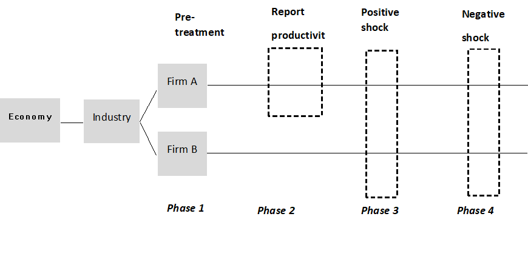

```{r setup, include=FALSE}
knitr::opts_chunk$set(echo = TRUE)
```

## Introduction

Understanding firm's input decision in the production process and how shocks to productivity will influence this decision process has been a heated topics in Economics. Prior to answering these questions, clearly identifying productivity of a firm is the first step. However, the endogenous interaction between firm's productivity and its input decision complicates a clear identification of productivity. Moreover, the fact that productivity is unobservable and that there exists a difference between firms' perceived and realized productivity will further complicates the picture. Existing literature, especially empirical study based on real-world data will suffer from the complications we mentioned before, when trying to unbiasedly identify the productivity of firms. However, we could utilize a "cleaner" lab-experiment to control for the shocks to productivity and see how firms' input decision will react to changes in productivity, both perceived and realized.

In our proposed experimental study, we will design an Application Programming Interface (API) to simulate a real world production process with introduction of different types of productivity shocks (signs and magnitude) into the system. By inviting firms' managers (will be explained in more detail later) to participate in this experiment through the app/website based on this API, we will be able to understand more of firm's input decision when facing different productivity changes. To be more specific, there are three sets of questions we design this experiment to look into: 1) Whether firms would efficiently extract information on productivity based on firm's historical performance, 2) When there exists different types of shocks to productivity, how firm's input decision in the next period will be influenced, and whether these reaction will be symmetric.We will discuss our experiment design in more details in the next section.


## Experiment design 

In this section, we will firstly list the two specific questions this experiment will probe into. Then we will introduce the model framework underlying our experiment's API and its relation with our research questions. We will further discuss the randomization structure of our design. 

### Core experiment questions

#### 1. Could firms consistently extract information on productivity? 
This is more like a preparatory questions for the next one ---- firms' reaction to productivity shocks, which we concerns most. In order to estimate firms' reaction to productivity shocks, we firstly need to understand whether firms could consistently capture their productivity to make an optimal input decision in the next period. The answer to this question in our experiment will be used to weight observation for the next question during interpretation.

#### 2. How firm will alter its input decision according to productivity shocks?
In our experiment to simulate a simplified real-world production process, we will introduce shocks to firms' productivity and record participants' input decision in the next period for analysis. Through comparing participants' reaction with the "optimal decision", we will be able to capture the responsiveness of firms towards different productivity shocks

### Model framework for the experiment

We will utilize the framework in Olley and Pakes (1996) and Levinshon and Petrin (2003), a firm's production process is modeled as a system of simultaneous equations, where we assume (also specifically mentioned in experiment instruction) that firms are cost minimization where input is exogenously determined as a given production target:

(Production process) $$y_{it} = \alpha_{L}l_{it} + \alpha_{K}k_{it} + \omega_{it} + e_{it}$$
(Labor input decision) $$ l_{it} = f_{L}(l_{i, t-1}, k_{i,t}, \omega_{it})$$
(Capital input decision) $$ i_{it} = f_{K}(l_{i, t-1}, k_{it}, \omega_{it})$$

$y$ is the log real output (value added), $k$ is the log real capital stock, $l$ is the log real labor input. $\omega$ is the log of productivity level. The simulated production model in our experiment is very simple: participants (firms) will choose the level of capital and labor input in each round based on the information he/she already had (capital/labor/output in previous rounds). The following table summarize the decision to make and information available for each participants at each round. 

##### A. Information available: i) Firms' labor input $l_{i, t-p}$ ii) capital inputs $k_{i, t-p}$ iii) outputs in previous rounds $y_{i, t-p}$ and target of production $y^{*}$
##### B. Variables to choose: Firms' labor/capital input in the current round ($l_{i,t}, k_{i, t}$)
##### C. Variable of interest: Firms' responsiveness score, calculated as $\frac{y_{i,t}}{y^{*}}$*$distance((l_{i,t}, k_{i, t}),(l^{*}, k^{*}))$ --- a measure of how good is firm's responsiveness for a productivity shocks based on it's choice's distance to the optimal input bundle, weighted by the production target fulfillment.

### Randomization structure of the experiment and hiring design

We are using a mixed experiment design in the sense that we study both between-group and within-group difference. In phase 1, we will not report productivity measure $\omega$ to all the firms (participants), while in phase 2, we will report productivity measure $\omega$ explicitly to the treatment group of firms (participants). We would be able to compare both between-group (treament vs control) and within group (pre-/post-treatment for treatment group) on whether firm could consistently capture the productivity through comparing their performances after the within/cross group treatment. Similarly, when we introduce the positive/negative productivity shocks later on in the experiment, we could also compare between/within group on firms' (participants') response towards productivity shocks and whether there exists asymmetry in terms of whether the shocks are positive or negative.

We aim to recruit firm managers directly involved in firms' input (investment/hiring) decisions for as comprehensive a coverage of industries as possible (based on NAICS code). And we will try to locate at least 10 participants representing different firms in a single NAICS 2-digit industry. For each industry, we will use a random numbe rgenerator to decide who will be in control/treatment group. Please note that this is a group randomized design, the grouping by industry could be considered as a control for itself. Invitations to participating will be sent out through different platforms (e.g., through firm email address, online ad at Bloomberg, participation invitation at large-scale commericial/business conference). To provide incentive to participate, we would generate a report for each participants (firm managers) on both his/her (relative) performance in our experiment and his/her company's historical performance in terms of input decision against productivity shocks under our experiment's framework (applicable to public fimrs only however).




## Discussion

In this last section, we will assess on different aspects of the quality of our experiment deisign and its interpetation.

### Validity

#### Statistical conclusion validity
It's possible for each NAICS 2 digit industry, we would not be able to obtain enough number of participants. This will potentially deteriorate the statistical robustness when we try to interpret and generalize the responsiveness of firms' input decision towards productivity shocks to a larger scale of the economy. One remedies to this would a relatively longer simulation rounds for each participants to more robustly capture their behavior, however, the length of the experiment should not be so long that it exceeds the a reasonalble span of time (less than 30 mins)

#### External and internal validity
Internal validity would not be a huge concern of this experiment given almost all of its operations are conducted algorithmically and automatically, the human associated error would be minimized. However, this doesn't preclude the necessity of test-running the algorithms in our underlying API. 
Externl validity would, however, be a huge concern in our design. Given our hiring approach, it's certainly possible that bigger public firms would be more accessible. Besides, whether the participants we recruited could be representative of the input decision maker in the real production process could be another concern. To remedy this caveat, we would include a very simple survey at the beginnig of the experiment to assess the quality of the reponse of the participants for weighting in the interpretation stage of the study. We could also send out our digital invitation on some small business conferences. 

### Heterogeneity of treatment effects

In terms of the potential heterogeneity of treatment effects, our study has already taken it into consideration through separating participants into different industry groups based on NAICS code since it's well recognized that the input structure between labor and capital could vary widly across different industries, while tend to have similar structure within a same industry. However, it's possible that other factors other than industry, like firm age, firm size, location etc., could also contribute to the heterogeneity of treatment effect (productivity shocks). We could improve our design through including more information on different attributes of an experiment objects in our design. We Will also test the heterogeneity in responsiveness of input decision across different groups of firm categorization.

### Mechanisms concern

Compared to the previous two concerns, this one might potentially be the biggest caveat in our experiment design. The primary reason lies in that we are utilizin a specific model framework to model the production process, which could be several orders more complicated in real life, while we are relying the simpliest Cobb-Douglas production function in depicting the process. The linearity and time-invariant feature in our model could potentially be a barrier for participants to correctly interpret the shocks as a productivity shocks and respond accordingly. Moreover, it's certainly possible that participants could intepret the productivity shocks we designed as a different type of shock (e.g., input supply shock). 

In order to conduct a robustness check, we could conduct a similar experiment based on a different production function, like translog production function on the same participant group in the future. Beside, we could also combine a very short survey at the end of the experiment asking participants whether the productivity we calculated in the experiment is in line with their perceived measure of productivity in their own firm in real life. Even though, we can hardly say this experiment design in complete, compared to traditional empirical study on input decision's response to productivity change, this lab-experiment design would generate a cleaner and better-controlled perspective into how firm will allocate their next period's input decision in response to their expected and realized productivity changes.


## Reference
Olley, S. and Pakes, A.(1996) “The Dynamics of Productivity in the Telecommunications Equip-
ment Industry”Econometrica 64:1263-1295

Levinsohn, J. and Petrin, A. (2003) “Estimating Production Functions Using Inputs to Control
for Unobservables,”Review of Economic Studies 317-342


