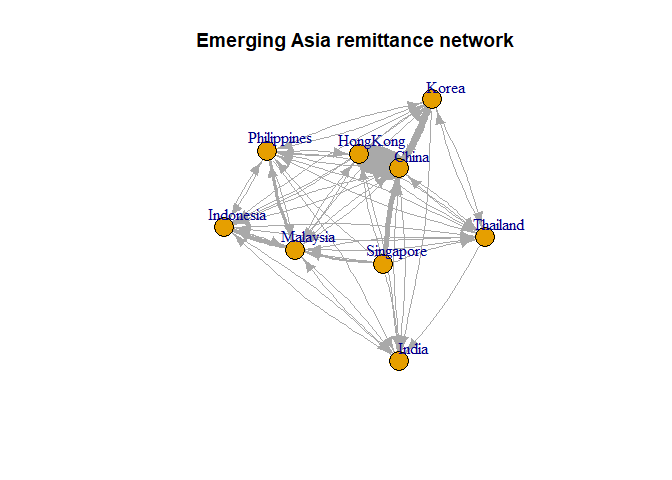
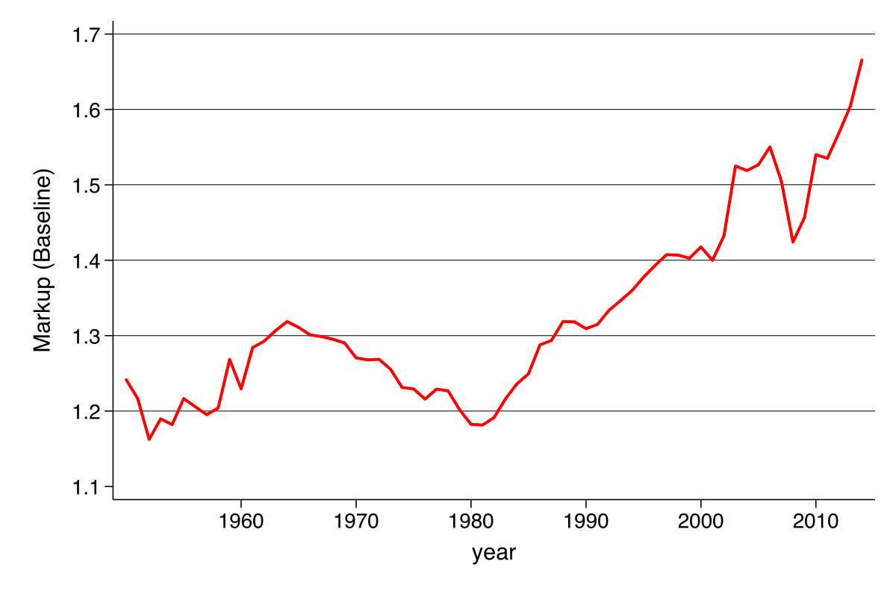

Kaggle open call project
------------------------

### My handle on Kaggle

chenanhua

### Open competition of interest

I am interested in the [Santander Product Recommendation
competition](https://www.kaggle.com/c/santander-product-recommendation).
The goal of this competition is to predict whcih product their existing
customers will use in the next month based on their past behavior and
that of similar customers. To be more specific, given a 1.5 years of
customers behavior data from Santander bank as a training data, we need
to develop a machine learning model to predict what a customer will buy
in addition to what they already had at the last month in the training
data.

In order to join the competition and make a submission, I need to go to
the Data page to understand and download the dataset. After data
cleaning, I probably will conduct some starter/exploratory analysis,
such as the distrubition of certain customer attributes (e.g., age, long
term deposit etc) across time and some simple but obvious bi-variate
correlation between the product choice and certain customer features.
Then I probably will consider develop and (re)train a machine learning
model majorly based on logistic regression before submitting the
predicted test dataset (in .csv) on the submission page.

### Explore a dataset on Kaggle ---- Emerging Asia country remittance network

I will explore a bit of the [bilateral-remittance
dataset](https://www.kaggle.com/theworldbank/worldwide-economic-remittances/data)
published by World Bank. I will focus on depicting the empirical network
structure of this remittance relation through a descriptive network
chart for Emerging Aisa economies. The thickness of the edge represents
the amount of remittance. It shows that the remittance tie between China
and Hong Kong is extremely strong (both to and from). Also, the
remittance from Korea/Singapore to China is also noticable, while
Thailand and india are relatively segregated from the remittance network
from other countries. And Singapore seems to serve as a transmission hub
between East Asia countries(centered around China) and SOuth East
countries (Philippines, Malaysia and Indonesia).

A potential research question related to this database is to study the
relationship between this remittance network with trade network of
capital flow network among emerging Asia countries and to see whether we
could use thes remittance flow data to construct a proxy for variables
where high quality data is not available (like capital flow data).
However, the current database doesn't publish time series of the
bilateral remittance, we probably need to rely on the time dynamics of
this network to construct the proxy.

    # load in the data
    remit = as.data.frame(read.csv("./bilateral-remittance.csv"))
    rownames(remit) = remit[,2]
    remit[,c(1, 2)] = NULL
    country_list = c("China", "India", "Philippines", "Indonesia", "Singapore", "Thailand",
                     "Korea", "Malaysia", "HongKong")
    remit_ea = remit[country_list, country_list]
    remit_ea$India = as.numeric(levels(remit_ea$India))[remit_ea$India]

    ## Warning: NAs introduced by coercion

    #remit_ea[remit_ea == 0] = 1e-10
    remit_ea = as.matrix(remit_ea)
    #net=graph.adjacency(remit_ea,mode="directed",weighted=TRUE,diag=FALSE)

    # Plotting the network graph
    set.seed(231)
    colourlist <- 
      #palette(
      c(
        "#6a3d9a",
        "#1f78b4",
        "#b2df8a",
        "#33a02c",
        "#fb9a99",
        "#e31a1c",
        "#fdbf6f",
        "#ff7f00",
        "#cab2d6"
      )
    g <- graph.adjacency(remit_ea, mode = "directed", weighted = T)

    #E(g)$width <- E(g)$weight/4.5
    E(g)$width <- E(g)$weight/500
    E(g)$arrow.size <- .8
    g$main <- "Emerging Asia remittance network"
    plot(g, vertex.label.dist=2, edge.curved = 0.1)

Improving a journal article using human computational techniques
----------------------------------------------------------------

### Summary of their study

The study I am focusing on in this subsection is a recent NBER working
paper ["The Rise of Market Power and the Macroeconomic
Implications"](http://www.nber.org/papers/w23687) by Jan De Loecker and
Jan Eeckhout. The main empirical findings documented in this study is
that there has been a steady increasing trend in US companies' markup
since 1980s from 1.18 to 1.67 in 2014 (see chart below). The paper is
calculating the makrup using a production function approach from the
supply side via comparing the ratio of cost of goods sold to total sales
weighted by the output elasiticity of variable inputs. However, one
piece that is missing from the study (authors also pointed out
explicitly in the study) is an analysis on where this emerging markup
origins from. Even though from the title of the paper, authors assume
the rising markup is an indication of rising market power, I believe the
origin of this surging markup needs more detailed analysis where we
could utilize some human computational techniques. 

### My extension

Compared to the supply-side production function approach to estimate the
unobservable markups in the paper, I decide to extend the study by
shedding some light on the origins of this surging markup, but from a
product-based and demand side approach. It's certainly possible that
increase in firms' productivity could contribute to increasing markups,
other factors on demand side, like people's changing preference (e.g.,
substitutability among differentiated products), quality of the products
etc will also influence the markup. The core research questions in this
extension is how various QUALITATIVE properties of products will
influence its potential markup. I need to clarify a central assumption I
make in this extension: I assume the marginal cost of production for
products under same product category and highly similar functionality
will be the same, therefore, the relative difference across prices of
highly-similar products will be assumed solely due to other features
like branding, marketing etc.

#### Brief design

Through human computation portals like Amazon MTurks, I would design
HITs for participants to browse over online commericial webpages of
products we assigned to them to quantify certain qualitative features of
similar products and record their respective retail prices. The way we
design to quantify the qualitative features of products would be a
scoring system. For instance, we would ask the participants to rate the
intensity of existence of this products in the daily-life advertisement
or other marketing activities and assign a score ranging from 1 to 5 in
the system. Besides, we would also require them to record the retail
prices and functionality score of these similar products for controlling
purpose. At the end, we would also ask them to sumbit their choices
among these similar products given a fixed budget constraint assigned to
them.

With collected data through human computation portal, we would construct
a large scale database on products' prices, qunatified feature scores
(e.g., in branding, marketing, company images etc) and participants'
choices given a constant budget. Based on this database controlled for
product functionality, we will study the econometric relation between
prices (i.e. markups if our assumption holds) and other product
features, which would be impossible to quantify and capture otherwise,
hopefully shed some light on the increasing markup from demand side on a
product-by-product basis.

#### Why human computation could factor into this extension study

Before we dive into the discussion, we need to mention a subfindings in
the original paper: they find the biggest increases in markup comes from
small firms. Since, in general, small businesses tend to produce
relatively more differentiated products compared to more standardized
products of bigger firms. This means there might be a larger number of
products to screen and their differences could be very subtle to capture
and account for. Another feature of the extension to this study is that
there is a lot of qualitative information associated with products that
are hard or impossible to quantify using common machine based techniques
like web-scrapping etc.

Human computation, however, is a very innovative interaction between
computer and human. It utilizes both the subtleness in human brain's
cognition capability of complex information (the qualitative product
information in our case) and computers' ability of organizing and
recording information. By utilizing the human computation in our
extension study, we would be able to utilize participants' ability to
capture and quantify the qualitative product information, which could
extremely hard to capture by other purely-machine-based techniques.
Besides, as authors of the paper point out, the largest increases in
markups are witnessed in the smaller firms (smaller in terms of its
share of sales in the industry and the whole economy). If we believe
smaller firms will tend to produce less-standardized and more
differentiated products, this could mean in order to study the markup
increases, we need to collect data on a product-by-product basis, which
could be accompanished better by human computation design given its
dissaggregated nature.

The essence of human computation is to construct an efficient portfolio
of human-computer interactions to better utilize the
organizing/automation/recording capability of computer and complex
cognition capability of humans. In my proposed extension study, human
computation naturally becomes a preferred approach, since we could
design an algorithm to assign the screening of different categories of
products to each "micro-work" and assigned the tasks to different
participants in a systematic fashion. At the same time, we would be able
to leverage on human's complex cognitive ability to quantify the myriads
of qualitative product associted information to generate a fully
digitalized database for analysis on demand side driving factors to
markup trend.

Alternative homework: InfluezaNet
---------------------------------

This study will focus on comparing and constrasting among InfluenzaNet,
Google flu and traditional tracking system (physician-based reporting
system) and discuss a bit on the potential caveats facing respective
systems when there is a counterfactual flu outbreak.

### Tracking system comparison

We will conduct the comparison from the following three aspects: source
of data & data collection process, tracking design & associated costs
and potential deficiency in the system.

#### Data sources & data collection process

The data recorded in the tradtional physician-based surveillance system
relies on the incidence of provision of health care in primary health
care practices, namely, only patients who uses the health care services
will be recorded and reported in the system. While the InfluenzaNet will
recruit participants from the general population after they completed an
intake questionaire that includes certain demographic and lifestyle
questions. After the registration, participants will receive a weekly
newsletter, requesting a questionire to be filled regarding certain
symptoms they might experience during the last week. They could also
create account for other related personnels on their behalf, like
parents for children etc. To motivate the patients, the organizer will
provide the most up-to-date information on the current dynamic of
Ifluenza-like-illness (ILI hereafter). Google, in 2008, proposed an
innovative "Nowcasting" system of ILIs tracking system according to
people's google search on ILIs related information, based on the
assumption that these searches have a close relation with whether the
people who search them are potentailly sick.

In terms of coverage of data, we see an ascending scale from
physician-based reporting to InfluenzaNet then to Google Flue tacking.
Besides scale, there are also some distinct differences among the three
of them. Physician-based reporting and Google flu data seem to have a
"self-selecting" nature in them, in the sense that the primary sources
of their data might have already been infected with the ILIs while
InfluenzaNet is more like a random controlled trials that actually would
exclude participants who have already been infected with ILIs from their
database.

Also, a quite significant difference among them is that Google
flu/physician-based system are using a "Revealed preference" data while
InfluenzaNet is using a "Reported preference" data, i.e. data in Google
flu and physician-based tracking system will directly observe people's
behavior, not suffering from certain reporting/survey bias issue. (This
in no sense means they are better, they actually have very severe issues
of their own, as I will show later)

#### Tracking design & associated costs

Among these three surveillance systems, physician-based tracking system
is the most straightforward --- simply based on the counting of report
filed by health care service practioners, though suffering from quite
several caveats (we leave the discussion on this in the last
subsection), the simplicity in the tracking design doesn't necessarily
compromises the quality of the data, given it's reported by expertised
professionals. InfluenzaNet's design has more random-control features in
it compared to physician-based reporting ---- The extensive set of
information they collected in the intake questionaires, including
demographic information, medical history and life-styles will help them
to filter and weight the data in their construction of more aggregated
indicator (e.g., regional/national attack rate). Google flu is actually
using the following model:
*l**o**g**i**t*(*P*)=*β*0 + *β*1*l**o**g**i**t*(*Q*)+*ϵ*
 where *P* is the physician-based reporting, and *Q* is one of the 50
million time series of Google common query with weekly frequency. Then
they are using the historical data to train the model in order to select
the queries/query that fitts the physician-based reporting the best and
use these queries to "Nowcast" the trend of ILIs. In terms of cost,
Google Flu trend definitely stands out in its cost efficieny given its
data are generated at an almost zero variable/marginal cost per data
entry while InfluenzaNet might incurr considerable amount of financial
needs, like costs associated with participants recruitment, campaign
costs (campaign that promotes the InfluenzaNet), educational purpose
related costs and website/staff maintainance costs.

#### Potential errors

All three tracking system will suffer from non-negligible while
different types of potential errors. The biggest potential risk
associated with Physician-based reporting is in its coverage and
selection bias --- not everyone infected will pay a visit to health care
provider. Actually, the fact that many of them wouldn't use health-care
service will be highly correlated with the outbreak of the ILIs. Also,
the accessibility of health care services is proved to be correlated
with many demographic/economic.geographical variables, leading to the
potential biased estimation of the dynamic of ILIs.

While one of InlfuenzaNet's primary design motivations is to remedy the
deficiency in physician-based system We just mentioned, itself also
suffers from certain selection bias in randomizing, for example, the
younger and older population (two tails of population distribution) are
significantly under-represented in their survey system. Given that these
two groups of population are actually more vulnerable to ILIs based on
their average immune system robustness, under-representation of them in
the tracking system will significantly harness the accuracy of its
estimates. Also, one challenge facing InfluenzaNet is that how to
account for differential participants (e.g., participants might have
differential involvment in the weekly survey, therefore how to weight
responses with different response rate). All the potential biasedness
issue associated with survey methods will apply to InfluenzaNet system.

After success in estimation accuracy for sometime, Google flu fails
tragically at predicting the 2013 flu peak by missing it by 140%!. Some
research shows a persistent pattern with Google Flu's performance:
performing well for 2-3 years then failing significantly. A biggeset
caveat lies in the overfitting of their algorithm to some seasonal terms
totally unrelated to flu. Because flu outbreak may possesses very strong
seasonal patterns, its coincidence with other highly-seasonal query
doesn't necessarily predict its outbreak. Such type of machine learning
model would require very frequent revision to avoid over-fitting issue.
Aparts from all the discussion, we need to remind us that both
InfluenzaNet and Google Flu will highly depend on the fact that data
sources will have access to Internet.

### A counterfacutal ILI outbreak scenario

After conparing the three tracking system above, let's now consider a
counterfactual ILI outbreak scenario and analyze how each system will
potentailly fail. In order to push these three systems to break, we
firstly define certain characters of this counterfactual outbreak:

##### 1) This counterfactual outbreak is starting from under-developed countries where internet access and physician services are very limited

##### 2) This counterfactual outbreak is drastically different from historical ILIs pattern, in that the "dormant period" from infection to emergence of symptoms will be longer.

According to our first setup of these counterfactual outbreak, the lack
of medical service access in these under-developed countries will
severly harness the timeliness and reliability of the pyhsician-based
reporting system. Though organizations like Doctor Without Borders would
be able to partially alleviate the situations, it's certain possible
that the population in these under-developed countries will be
distributed in a macro-disaggregated but locally concentrated pattern,
which will significantly dilute the "firing power" of these
organizations, therefore the quality of pyhsician-based reporting
system. Given the fact that Internet access is also poor in these
counterfactual case, both InfluenzaNet and Google flu will not be able
to help much. Let alone the fact that InfluenzaNet, especially, will
depend on a well-established social infrastructures (e.g., government,
network of NGOs) to operate efficiently.

Even if we assume Internet access is not a problem (e.g., Facebook's
design of Internet in the air in India), our second setup in the
counterfactual design might harness the effectiveness of Google flu
tracking system. As we discussed above, Google flu's algorithm is
significantly depending on the historical data where it's been trained.
Given this counterfactual outbreak is drastically different from
historical ILIs' patterns with a much longer dormant period, it's
possible that when people began to search terms related to the symptoms,
the infected population has alreday been much larger. The Nowcasting
feature of Google flu might not be that "Now" anymore.

To conclude, no tracking system is perfect, and as our counterfactual
case shows that under certain assumptions, all of them could potentially
fail significantly. However, from physician-based reporting to
InfluenzaNet to Google Flu shows a clear evolutionary trend in ILIs
tracking system, with more integration of different databases and better
designed algorithm, big data techniques will certainly be helpful in
helping estimating and predicting the ILIs outbreaks in the future.
