EDA Assignment 1: Data exploration notebook
================
Chen Anhua
November 23, 2017

Part I: Exploratory Data Analysis on GSS
----------------------------------------

Please note that not every chart made in this part will be related to the writeup in Part II.

### Understand more about the dataset

#### Composition of respondents by race

We would like to know more about the joint distribution of respondents by race and other demographic/social/economic attributes.

``` r
hist.race = ggplot(df, aes(race)) + geom_histogram(stat = "count")+
  labs(title = "Respondents' racial distribution")
```

    ## Warning: Ignoring unknown parameters: binwidth, bins, pad

``` r
print(hist.race)
```

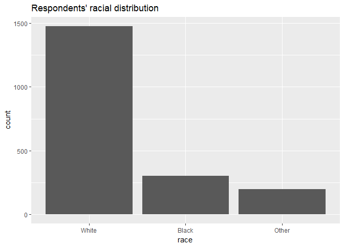

``` r
var_list = c("sex", 
             "degree",
             "marital",
             "polviews",
             "age_3",
             "rincom06_5"
             )
for (var in var_list){
  name = paste0("hist.race.", var)
  mat = df %>%
    count(race, get(var)) %>%
    na.omit() %>%
    mutate(race = factor(race, levels = c("White", "Black", "Other"))) 
  colnames(mat) = c("race", var, "n")
  
  plot = ggplot(mat, aes(race, n,  fill = get(var))) + geom_col(position = "fill") + 
    labs(title = paste0("Respondents' ",var," distribution by race"),
         y = "Proportion")
  assign(name, plot)
  print(plot)
}
```

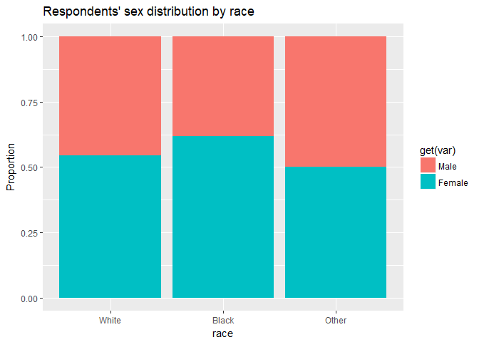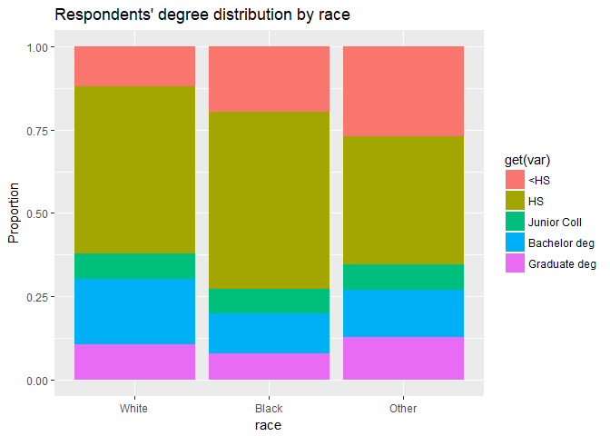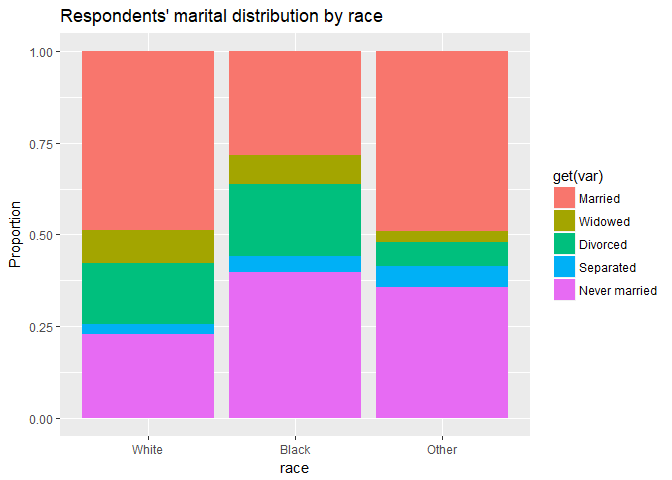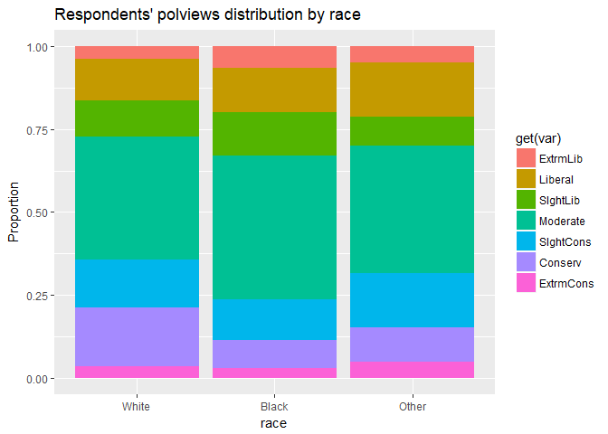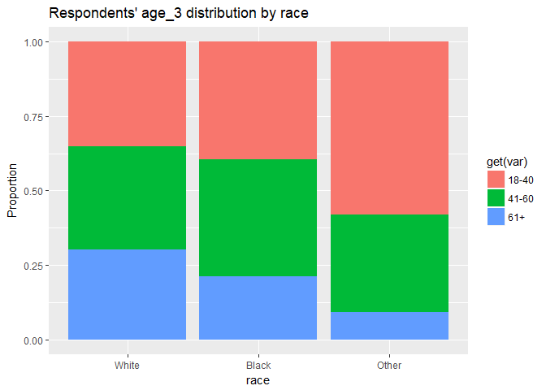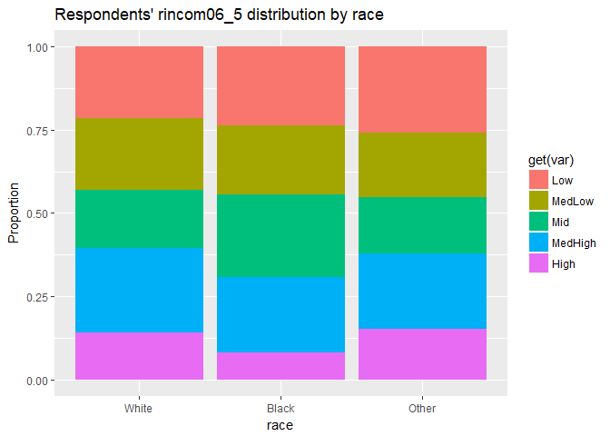

#### Existence of systematic missing response

To understand the limitations of this GSS data better, we would look into the distribution of non-responses (NA) in the data. We will firstly look into the general distribution of occurence of NAs by all different categorization. Instead of using the number of NAs, we would use the percentage of NAs here to control for the different number of questions for different survey sections.

``` r
df$missingness.general = apply(df, 1, function(x) sum(is.na(x)))    # generate variable to count missingness in the data
# we are also interested in the pattern of NAs in different sections of questions
# These lists will be reused in the later section
nat_list = colnames(df)[grepl("nat", colnames(df))]     # colnames on opinions of national-level issues
mslm_list = colnames(df[grepl("mslm", colnames(df))])[4:6]    # colnames on opinions of muslim-related issues
com_list = colnames(df[grepl("com", colnames(df))])[3:5]    # colnames on opinions of communism-related issues
int_list = colnames(df[grepl("int", colnames(df))])[1:10]
con_list = colnames(df[grepl("con", colnames(df))])[1:13]
mil_list = colnames(df[grepl("mil", colnames(df))])[c(1:3)]
ath_list = colnames(df[grepl("ath", colnames(df))])[c(2:4)]
rac_list = colnames(df[grepl("rac", colnames(df))])[3:5]


# Create missingness count for each section of the questions
df$missingness.national = apply(df[nat_list], 1, function(x) sum(is.na(x))/length(x)) 
df$missingness.muslim = apply(df[mslm_list], 1, function(x) sum(is.na(x))/length(x)) 
df$missingness.communism = apply(df[com_list], 1, function(x) sum(is.na(x))/length(x)) 
df$missingness.interest = apply(df[int_list], 1, function(x) sum(is.na(x))/length(x)) 
df$missingness.confidence = apply(df[con_list], 1, function(x) sum(is.na(x))/length(x)) 
df$missingness.military = apply(df[mil_list], 1, function(x) sum(is.na(x))/length(x))
df$missingness.atheist = apply(df[ath_list], 1, function(x) sum(is.na(x))/length(x))
df$missingness.racist = apply(df[rac_list], 1, function(x) sum(is.na(x))/length(x))


na.plot.general = ggplot(df, aes(missingness.general)) + geom_density()+
  labs(title = "General distribution of NAs percentage")
print(na.plot.general)
```


``` r
sec_list = c("national",
             "muslim",
             "communism",
             "interest",
             "confidence",
             "military",
             "atheist",
             "racist"
             )
for (sec in sec_list){
  name.race = paste0(sec,".race")
  plot.race = ggplot(df, aes(get(paste0("missingness.", sec)), color = race)) + geom_density() +
    labs(title = paste0("Distribution of NAs percentage of ", sec, " related questions across race"),
         x = "Percentage of NAs")
  print(plot.race)
  assign(name.race, plot.race)
  name.degree = paste0(sec,".degree")
  plot.degree = ggplot(df, aes(get(paste0("missingness.", sec)), color = degree)) + geom_density() +
    labs(title = paste0("Distribution of NAs percentage of ", sec, " related questions across degree"),
         x = "Percentage of NAs")
  print(plot.degree)
  assign(name.degree, plot.degree)
}
```

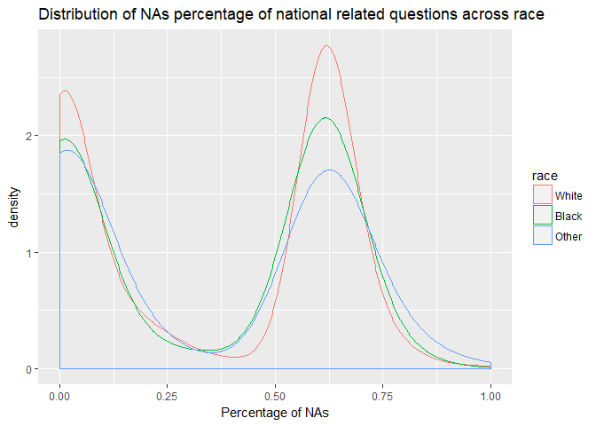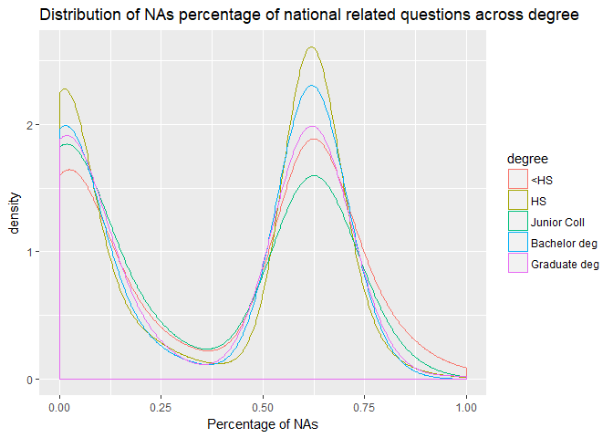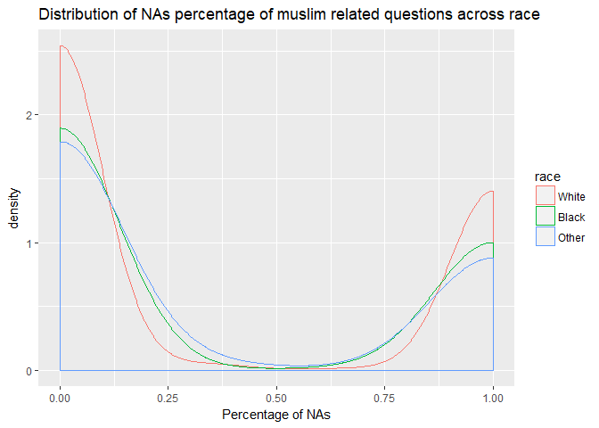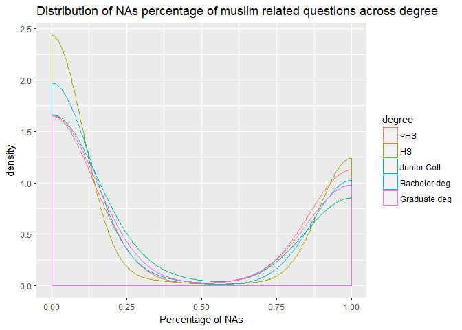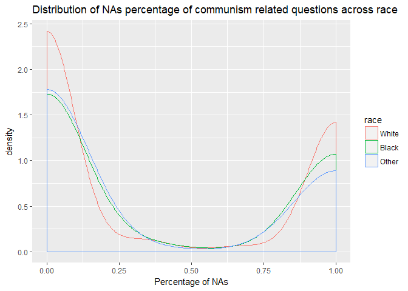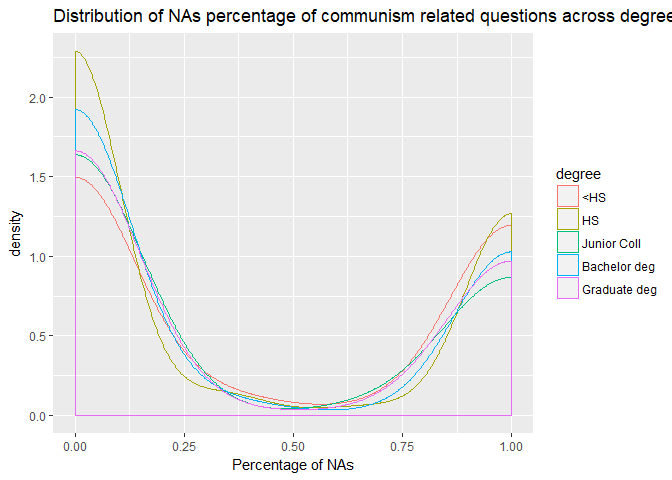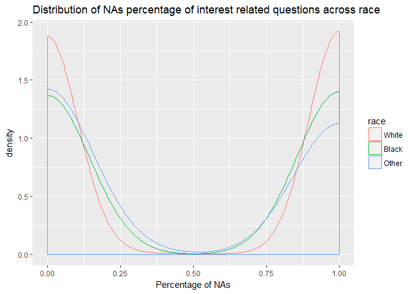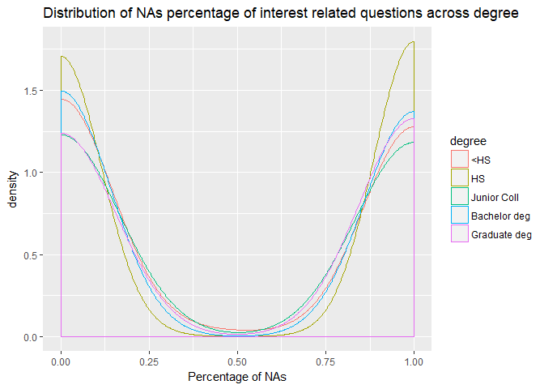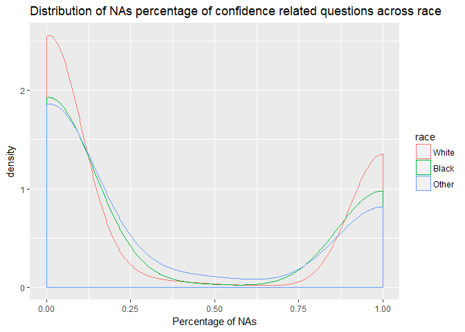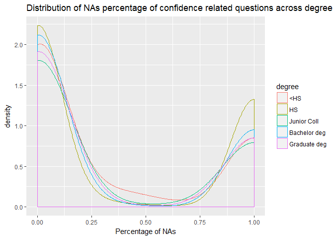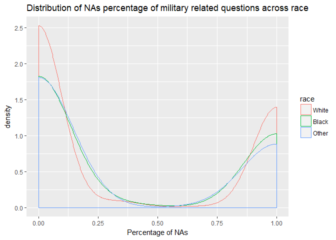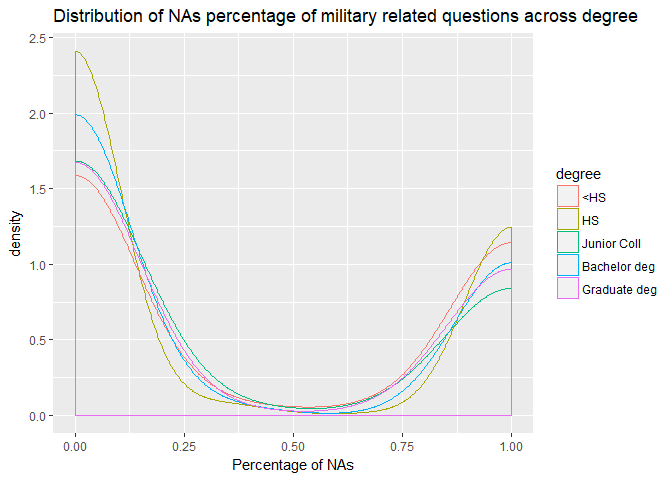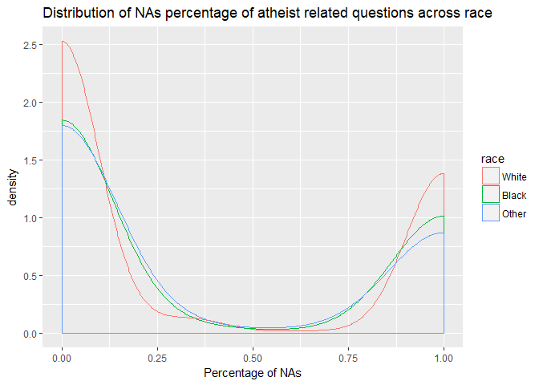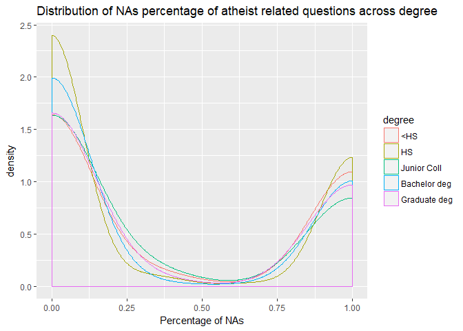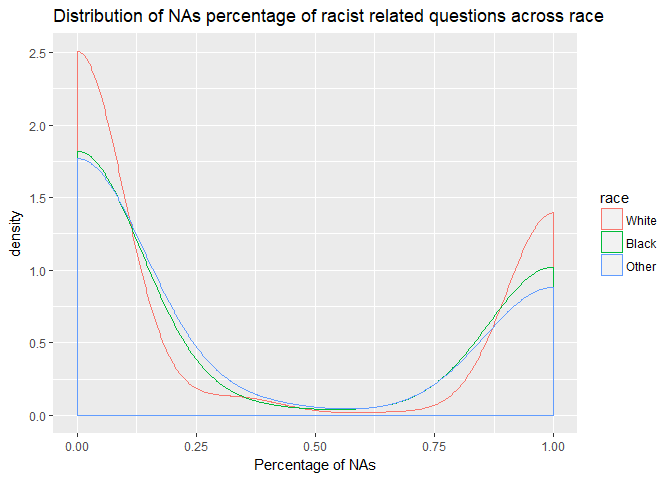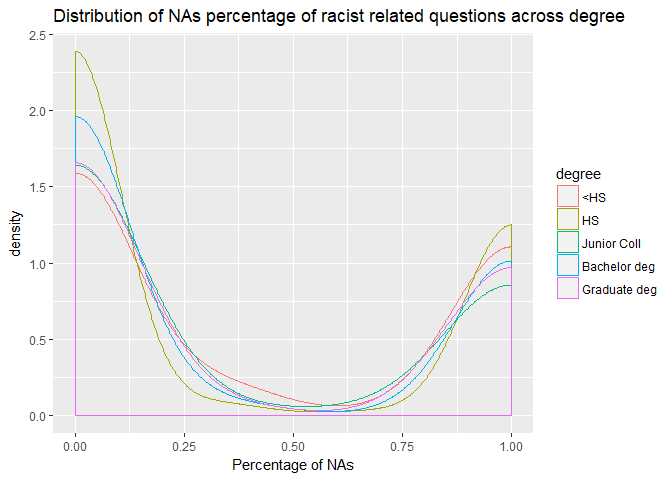

``` r
# We are also interested in the correlation of missing NAs across different section of the questions
missingness.cormat = cor(df[, paste0("missingness.", sec_list)])
missingness.cormat.m = melt(missingness.cormat)
missingness.corplot = ggplot(data = missingness.cormat.m, aes(x=Var1, y=Var2, fill=value)) + 
  geom_tile(color = "white")+
    scale_fill_gradient2(low = "blue", high = "red", mid = "white", 
                         midpoint = 0, limit = c(-1,1), space = "Lab", 
                         name="Pearson\nCorrelation") +
    theme_minimal()+ # minimal theme
    theme(axis.text.x = element_text(angle = 45, vjust = 1, 
                                     size = 12, hjust = 1))+
    coord_fixed() +
  labs(title = "Correlation between missing responses in different sections of questions")
print(missingness.corplot)
```

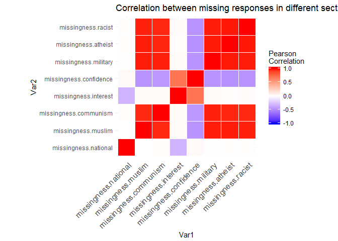

### Systematic difference in respondents' answers across different categorized subgroups within each type of questions

In this section, we would like to explore the difference in the profiles of respondents to questions of different sections. We Will mainly focus on within-section distribution and across-section distribution, namely we are interested in both how different demographic/social/economic attributes (e.g., race, gender, income, degree) will affect the opinion within certain type of question and how these dsitribution are correlated across different section (areas) of questions.

``` r
sec_code_list = c(
  "mslm",
  "com",
  "ath",
  "rac",
  "mil",
  "nat",
  "int",
  "con"
  )
for (sec in sec_code_list) {
  df_sec = df[c("id", "race", var_list, get(paste0(sec, "_list")))]
  df_sec.m = melt(df_sec, id.vars = c("id", "race", var_list))
  df_sec.m = subset(df_sec.m, !is.na(value))
  df_sec.m$value2 = 0
  if (sec == "mslm"){
    df_sec.m[which(df_sec.m$value == "Yes"), c("value2")] = 1
  }
  if (sec == "com"){
    df_sec.m[which(df_sec.m$value == "ALLOWED" | df_sec.m$value == "NOT FIRED" | df_sec.m$value == "NOT REMOVE"), c("value2")] = 1
  }
  if (sec == "ath" | sec == "rac" | sec == "mil"){
    df_sec.m[which(df_sec.m$value == "ALLOWED" | df_sec.m$value == "NOT REMOVE"), c("value2")] = 1
  }
  if (sec == "nat" | sec == "int" | sec == "con"){
    df_sec.m$value2 = as.numeric(as.factor(df_sec.m$value))
  }
  
  plot.general = ggplot(df_sec.m, aes(value)) +
    geom_histogram(stat = "count") +
    facet_wrap(~variable) +theme(axis.text.x = element_text(angle = 90, vjust = 1, 
                                     size = 8, hjust = 1))
  print(paste0(sec, " related questions:"))
  print(plot.general)
  
  mat = df_sec.m %>%
    count(race, variable, value) %>%
    na.omit() %>%
    mutate(race = factor(race, levels = c("White", "Black", "Other"))) 
  plot.proportion = ggplot(mat, aes(x = race, y = n,  fill = value)) + geom_col(position = "fill") + 
    facet_wrap(~variable) 
  print(plot.proportion)
  
  var_list_selected = c(
    "sex",
    "degree",
    "age_3"
  )
  for (var in var_list_selected) {
    plot.jitter = ggplot(df_sec.m, aes(x = race, y = value, color = get(var)) ) +
      geom_jitter(alpha = 0.1, width = 0.25) + 
      facet_wrap(~variable) + 
      theme(axis.text.x = element_text(angle = 90, vjust = 1, 
                                     size = 8, hjust = 1))
    print(plot.jitter)
    
  }
  
  # Within-section correlation
  mat_cor_within = reshape(df_sec.m[c("id", "variable", "value2")], idvar = "id", timevar = "variable", direction  = "wide")
  mat_cor_within$id = NULL
  mat_cor_within = na.omit(mat_cor_within)
  mat_cor_within.m = melt(cor(mat_cor_within))
  within_cor_plot = ggplot(data = mat_cor_within.m, aes(x=Var1, y=Var2, fill=value)) + 
  geom_tile(color = "white")+
    scale_fill_gradient2(low = "blue", high = "red", mid = "white", 
                         midpoint = 0, limit = c(-1,1), space = "Lab", 
                         name="Pearson\nCorrelation") +
    theme_minimal()+ # minimal theme
    theme(axis.text.x = element_text(angle = 45, vjust = 1, 
                                     size = 8, hjust = 1))+
    coord_fixed() +
  labs(title = "Correlation between answers within a same question section")
  print(within_cor_plot)
  
}
```

    ## Warning: Ignoring unknown parameters: binwidth, bins, pad

    ## [1] "mslm related questions:"

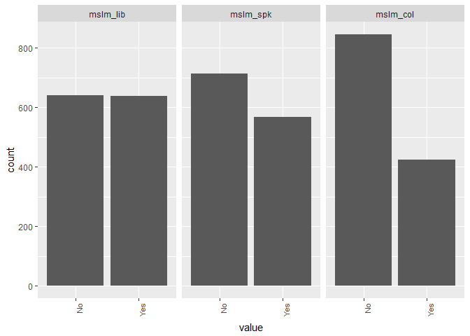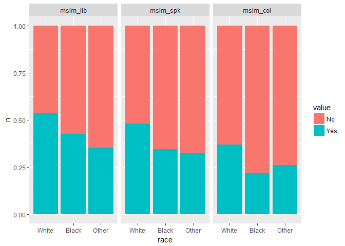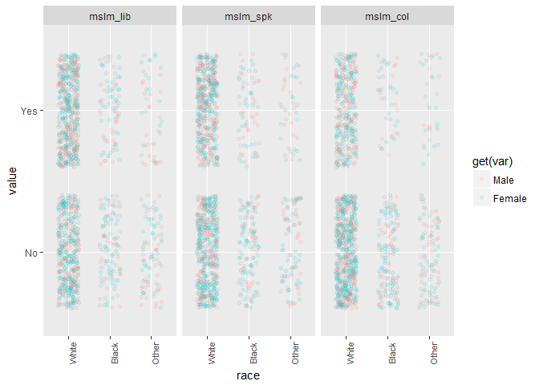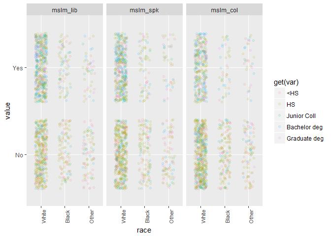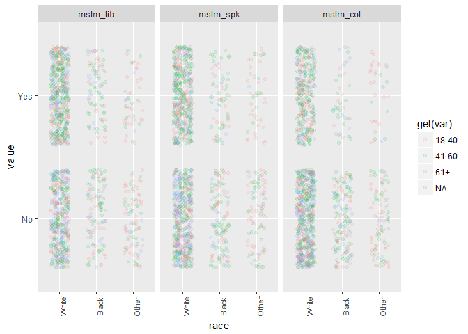

    ## Warning: attributes are not identical across measure variables; they will
    ## be dropped

    ## Warning: Ignoring unknown parameters: binwidth, bins, pad

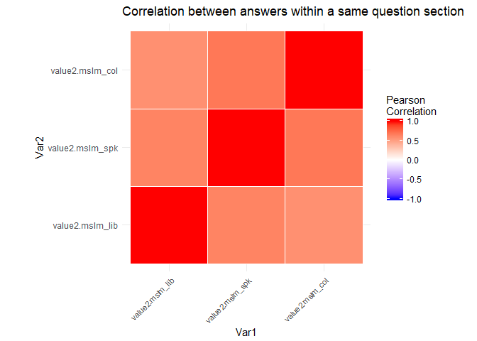

    ## [1] "com related questions:"

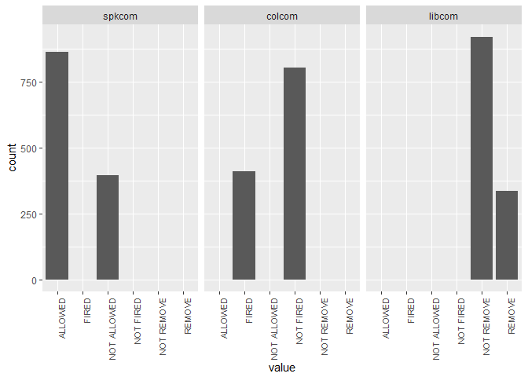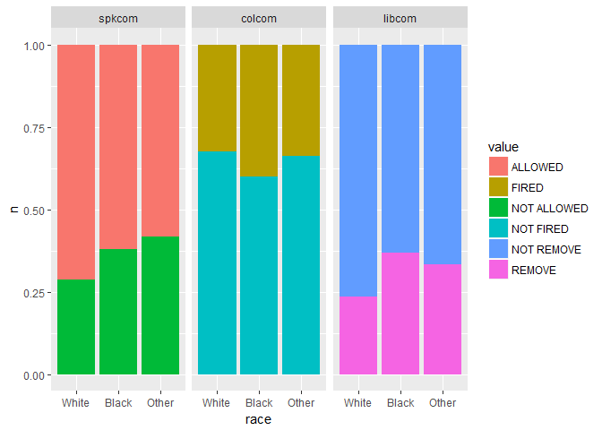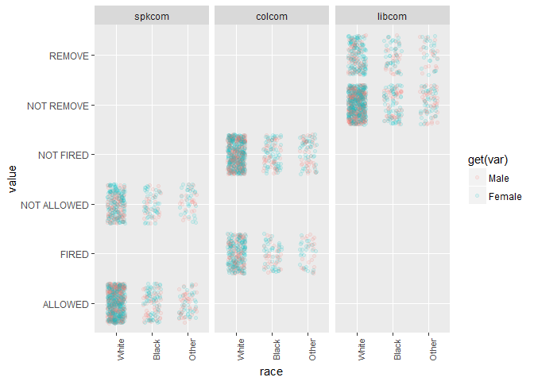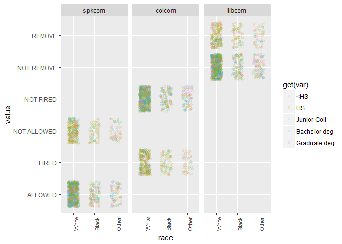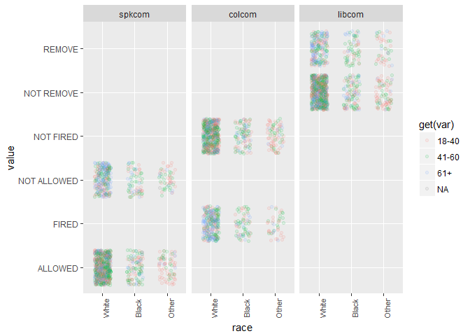

    ## Warning: attributes are not identical across measure variables; they will
    ## be dropped

    ## Warning: Ignoring unknown parameters: binwidth, bins, pad

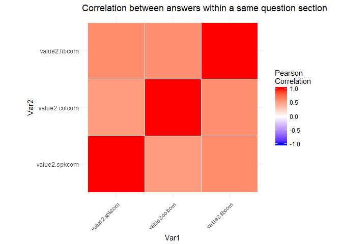

    ## [1] "ath related questions:"

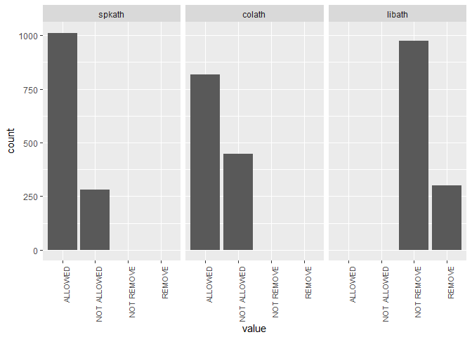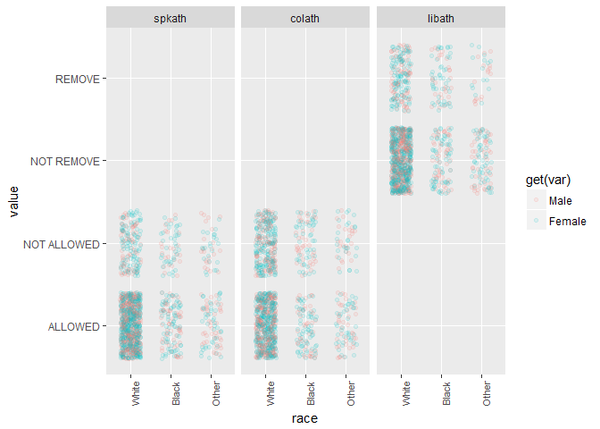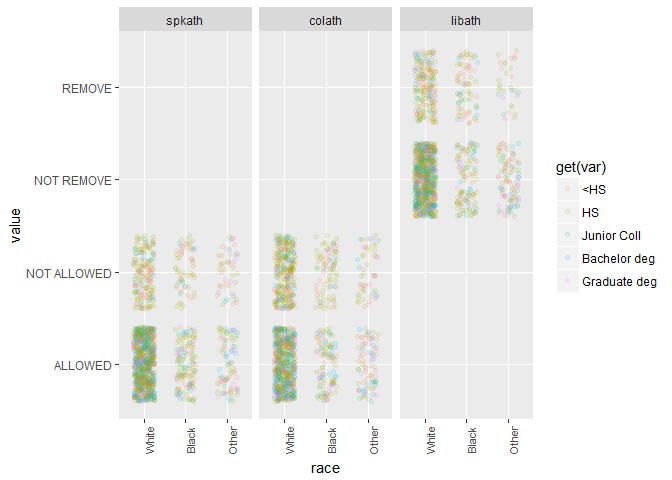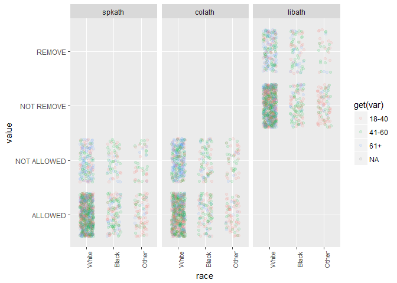

    ## Warning: attributes are not identical across measure variables; they will
    ## be dropped

    ## Warning: Ignoring unknown parameters: binwidth, bins, pad

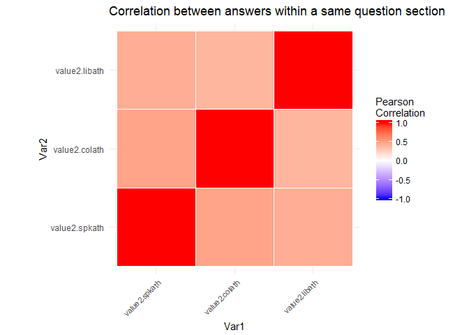

    ## [1] "rac related questions:"

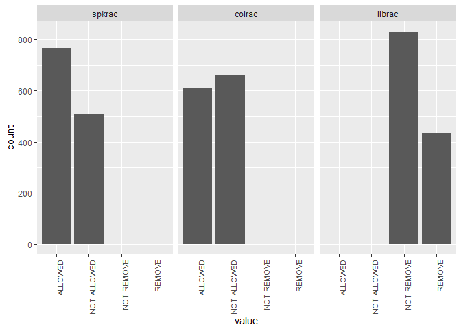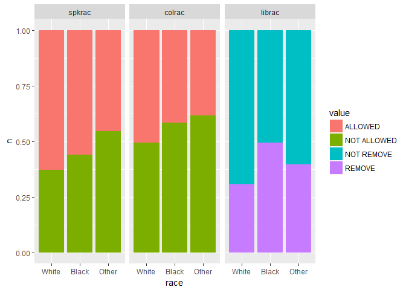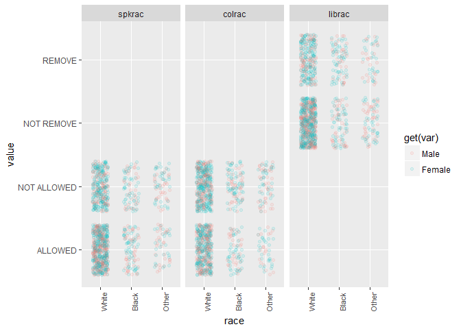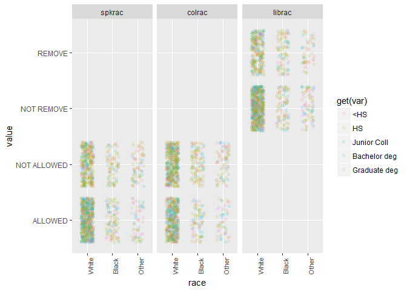

    ## Warning: attributes are not identical across measure variables; they will
    ## be dropped

    ## Warning: Ignoring unknown parameters: binwidth, bins, pad

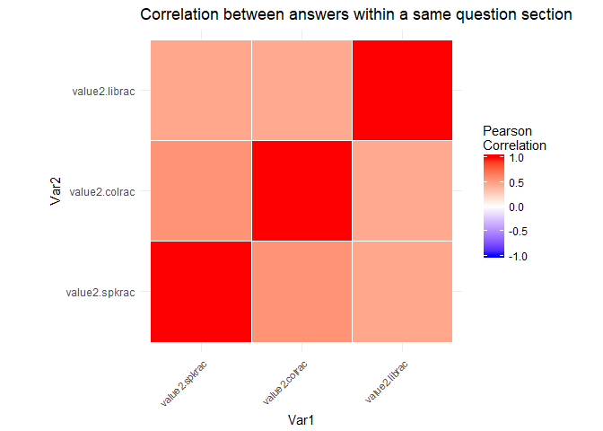

    ## [1] "mil related questions:"

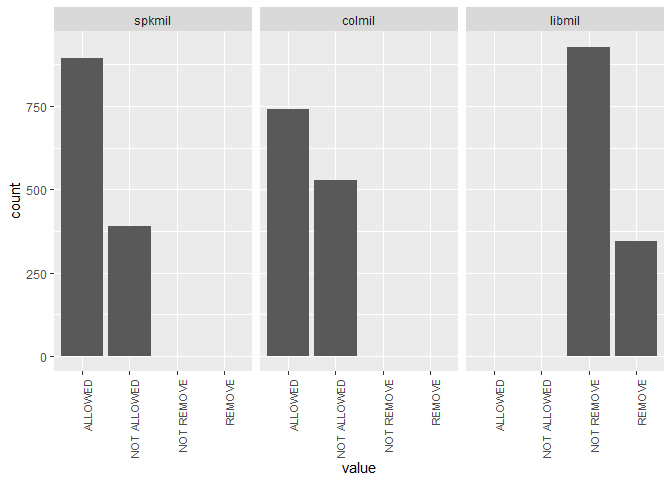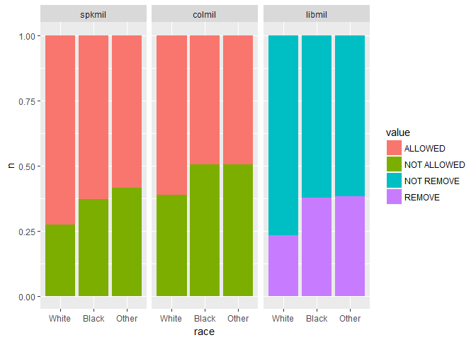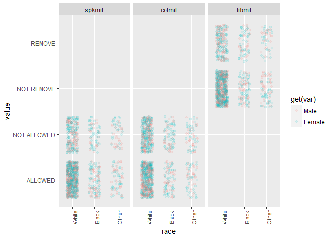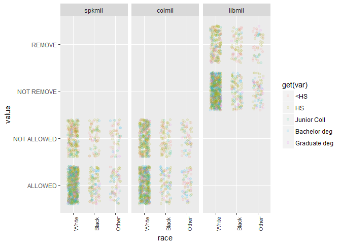

    ## Warning: Ignoring unknown parameters: binwidth, bins, pad


    ## [1] "nat related questions:"


    ## Warning: Ignoring unknown parameters: binwidth, bins, pad


    ## [1] "int related questions:"


    ## Warning: Ignoring unknown parameters: binwidth, bins, pad


    ## [1] "con related questions:"


