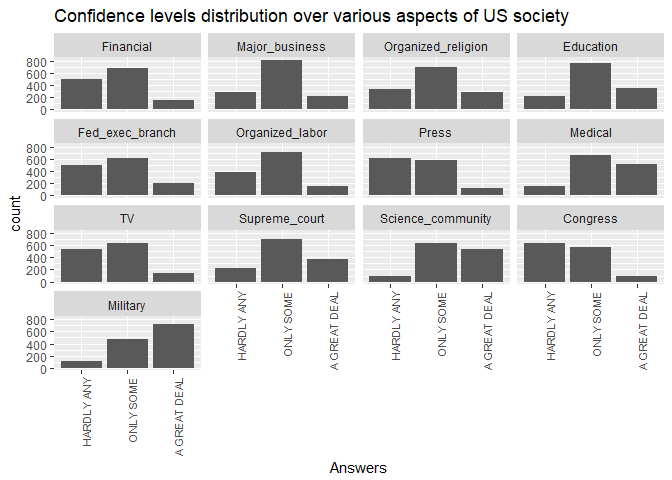
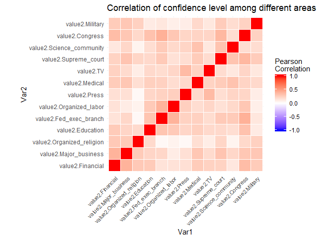
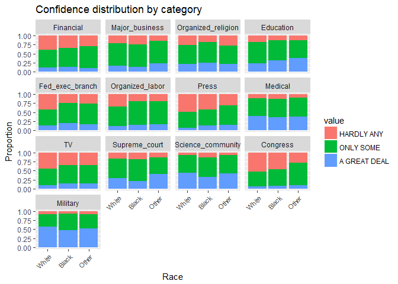
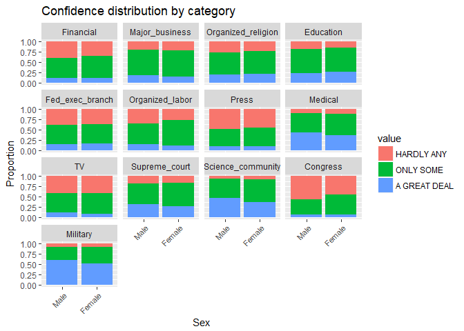
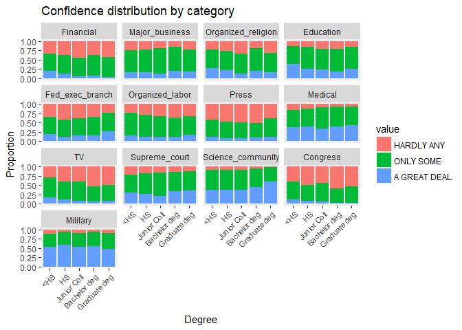
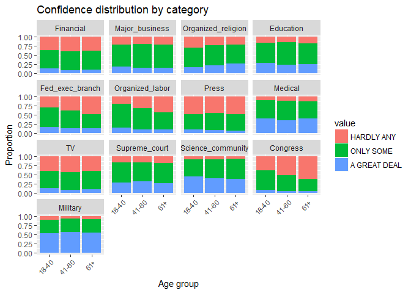
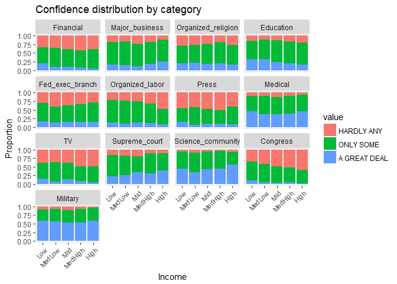
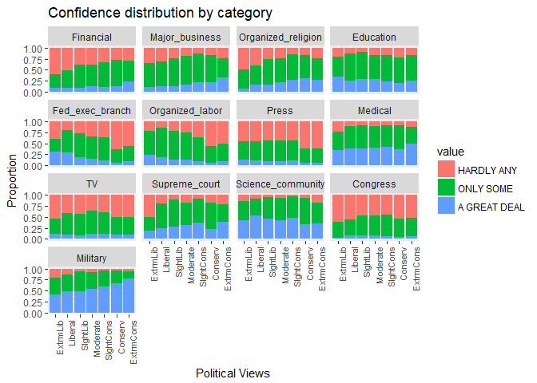

EDA Writeup --- In what, we trust?: A study on cross-sectional variation of confidence levels in US society among subgroups
================
Chen Anhua
November 23, 2017

Abstract
--------

In this proposed study, we examine a rich set of cross-sectional variations of people's confidence level in various aspects of US society based on GSS dataset. We find that confidence level in Congress is playing a relatively central role in terms of correlation with confidence level in other areas. Besides, by grouping the respondents according to different demographical/social/economic attributes like race/sex/age/income/education-degree, we found a meaningful number of differences in the distribution of confidence level towards US society across categorized subgroups. For example, an observation is that people with higher income seem to have relatively more confidence in Federal government branches while less confidence in Congress and in organized labor, the interpretation of which could provide insights into the implication of current institutional structures and policies, on wealth distribution in US society.

0. Introduction
---------------

Measuring and understanding people's confidence level in different areas of the society is of great interest to social scientists, the careful interpretation of which will not only shed lights on how information will shape people's perception, but also will provide meaningful guidance to policy-oriented questions like how certain changes of policy will transform people's expection of society's prospoects in certain areas. Besides, a more detailed cross-sectional analysis on heterogeneous confidence distribution across different subgroups of the population (e.g., by race/gender/political views etc) towards a same societal environmental will provide valuable insights into how different aspects of societal environments are perceived by and are impacting different groups of people. While confidence level is not something that could be easily measured directly, the complementary set of questions related to confidence levels in General Social Survey (GSS) dataset provides an interesting survey-based approach to study the cross-sectional variation of confidence level in different aspects of US society among various groups, potentially generating some early insights into how demographic/social/economic attributes might shape people' expectation formation.

This brief write-up will firstly provide an overview on the general/aggregate distribution of confidence level spanning thirteen different areas of the US society. Then it will focus on two cross-sectional analysis of confidence level distribution: i) The correlation between confidence levels in different aspects of society on an individual basis and ii) The difference of confidence distribution among different subgroup-categorization (e.g., by race/sex/income/age etc.). It then concludes with a discussion on certain caveats of the study and further directions to push this line of research.

1. An overview of the general/aggregate "confidence level distribution" among various aspects of the US society
---------------------------------------------------------------------------------------------------------------

In the design of GSS, there are only three available options in aswering the confidence related questions: "A great deal", "only some" and "hardly any". As shown in the chart below, confidence in military is the only question that receives "A great deal" from over half of the respondents population, followed by confidence in science and confidence in medicine, where "A great deal of confidence" constitutes around 35-40% of the sample. It's also interesting to see what respondents have least confidence in via counting asnwers of "hardly any". The top five areas receiving least confidence are: Press, TV, Congress, Exec. branch of Fed government and bank&financial institutions. Also, questions on confidence in these five areas receives very little "a great deal" answers.

    ## Warning: Ignoring unknown parameters: binwidth, bins, pad

One of the motivations to look first at these aggregate distribution of respondents' confidence is that it could help us to roughly pin down areas of most interest, where people hold relatively strong opinions ("a great deal" or "hardly any"). However, focusing only on the general/aggregate distribution of confidence level for each area will conceal a lot of rich informaiton on cross-sectional variation --- For example, how confidence levels in these areas are correlated with each other, namely whether higher confidence level in one area will be associated with higher confidence level in another area, or vice versa. We will discuss this in the next section.

2. Correlation of confidence levels among different areas
---------------------------------------------------------

In order to construct a correlation of confidence levels, I assign -1, 0, 1 respectively to the asnwers of "Hardly any", "Some only" and "A great deal". The correlation heatmap is shown below. 

Among all pairs of correlation, we highlight several observarions below:

#### 1). Confidence level in Congress is most correlated with confidence in other areas

Based on the darkness of the red color, we could easily observe that confidence level in Congress is most correlated (postively correlated) with confidence in other areas of American society, especially with confidence level in Federal government executive branches and that in Supreme Court. This indicates that people's confidence levels in institutional aspects of the society are highly correlated. This fact become more interesting when combined with the observation that conidence level in these three areas are actually the lowest according to section 1.

If we use 0.30 as a benchmark to define whether a positive correlation is significant, then confidence in Congress has the most number of significantly-correlated pairs: with Financial institution,Education, Federal government and Supreme Court.

#### 2). Confidence level in organized religion is the most insulated one in correlation matrix

Confidence in Organized religion is the least correlated one with other areas. It's especially interesting to see that confidence in organized religion has almost no correlation, especially with confidence in science community/media (TV/Press) and Fed government branches, while still maintaining some mild correlation with Supreme court/Medicine and military.

#### 3). Other highly-correlated pairs

Besides pairs mentioned above, Federal government and organized labor, TV and Press, together with Major business and Financial are another three pairs where confidence levels in them are highly correlated (based on a benchmark correlation of 0.35). Another pair worth mentioning is confidence in science community and confidence in Medicine industry.

3. Confidence levels across different groups
--------------------------------------------

After examining correlation between confidence in various areas, we now turn to the analysis of how different demographical categorizations like race/income/degree will translate into different distribution of confidence levels of US society. We will exmaine the cross-sectional variation in confidence level by race/sex/age/degree/income.

### 3.1 By race

It seems that lack of confidence in Legislature/Executive Institutions (Congress/Fed government) concentrated more in White people but interestingly Black population has the highest proportion of "hardly any" confidence in Supreme Court. Also, the lack of confidence in Meida (Press/TV) concentrated more in White population. In order to further interpret this results, We need to analyze further on each racial's groups' involvment in political activities and criminal rate distribution etc. For instance, it might worth examining further whether Black respondents' relative low confidence level in Supreme court is associated with perceived Legal justice.

### 3.2 By sex

One observation is that Male population has a larger proportion of "hardly any" confidence in Congress compared to Female. Whether this observation is related to the difference between men and women's participation rate in legislatative process might also worth further researching. 

### 3.3 By degree

One interesting observation is that lack of confidence in Press/TV seems to deepen as we move from low degree to higher degree with an exception that respondents' confidence in Press seems to bounce back a bit for graduate degree holder. However, we should interpret this with a grind of salt given the small proportion of graduate-degree holders in the sample. On the contrary, the chart below indicates that people with higher degrees are more confident in science community. Also, we observe a slightly negative correlation between confidence in Congress and degree level --- higher degree holders seem to have less confidence in Congress.

#### 3.4 By age group

The most striking pattern in by-age distribution of confidence level is that people are significantly less confident in Congress and Fed government as they become older.

### 3.5 By income group

By dividing the population into different income groups, we observe a very interesting pattern in confidence of organized labor across different income groups which we don't observe in other categorization --- Respondents with higher income will have significant LESS confidence in organized labor. This observation provides some very valuable insights into understanding the role of labor union in protecting employers on the lower tail of income distribution and its potential impact on the redistribution of wealth in society. Another interesting observation is that, unlike other subgroup-categorization, people in higher income groups seems to have relatively more confidence in Federal government branches while less confidence in Congress. This might be a very interesting starting point to explore how the functional disparities/conflicts between Federal government and Congress could shape the wealth distribution in society.

### 3.6 By Political Views

From very left (extreme liberals) to very right (extreme conservatives, there are some interesting patterns in confidence distribution in different areas. The confidence level in Financial institutions, major companies, organized religion and military have been monotonically increasing as we move from liberal subgroups to conservative ones, while there also exists a strong negative relation between extent of conservatism in political views and confidence in Federal government(pretty intuitive given President Obama belongs to Dem) and in organized labor. However, when interpreting the cross-political-views distribution of confidence, it's important to keep in mind that both of them are reported "subjective" variables reported by respondents, indicating that they share certain endogneity between themselves, unlike the demoraphic attributes like race/gender, origins of which could be regarded largely as exogenously determined (but still might suffer from self-selection problem).

4. Discussion
-------------

One major caveat of this writeup (and a future research direction) is that the bulk of the study is still in the realm of correlation analysis while a more careful causality-oriented interpretation of our observations needs some extra work in causality identification strategy design. For example, we mentioned there is a correlation between respondents' confidence in Congress, government and organized labor, and their income level. Whether it's their income level determines their confidence distribution or the other way around, or there exists some hidden variables that influence both, still needs further work (e.g., finding an instrumental variable) to be identified. Putting the variables of interest into an econometric framework (e.g., a logit regression with rich interaction between fixed effects) could be the next step of this study.

Another limitations of the study is that it doesn't have time-varying feature --- it only uses the data in 2012, if we could enrich the data from cross-sectional data to panel data, combined with other year-specific policy changes, we could have more resoures to identify what specific features of institutional structure will affect people's confidence in it, namely utilizing the time-varying flexibility as a causality-identification mechanism.
