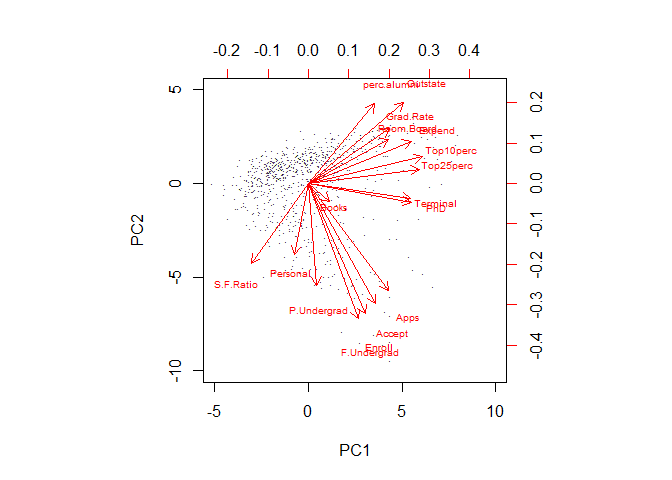
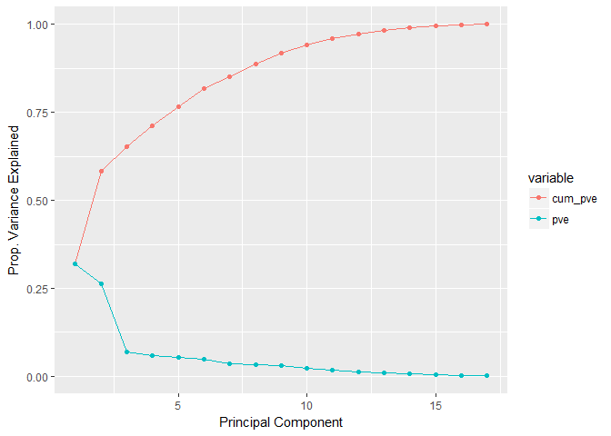
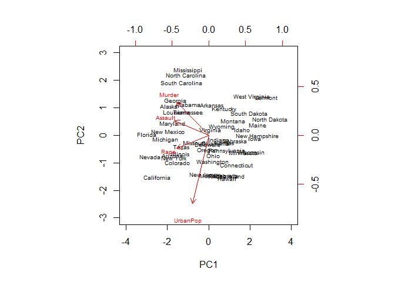
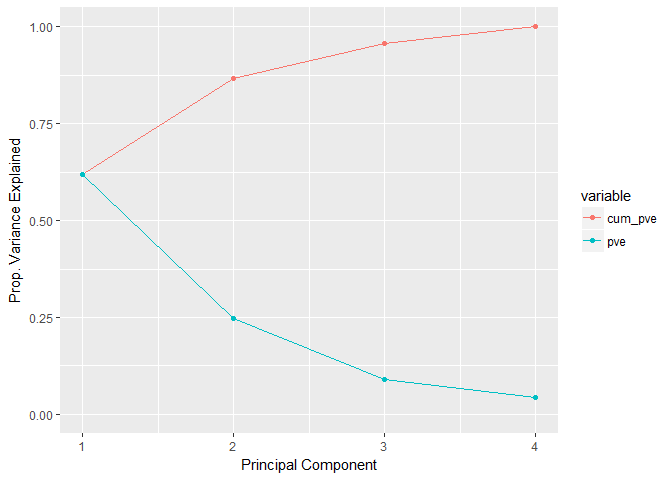
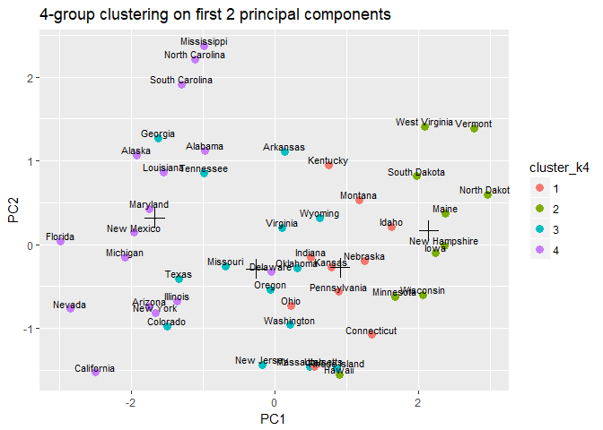
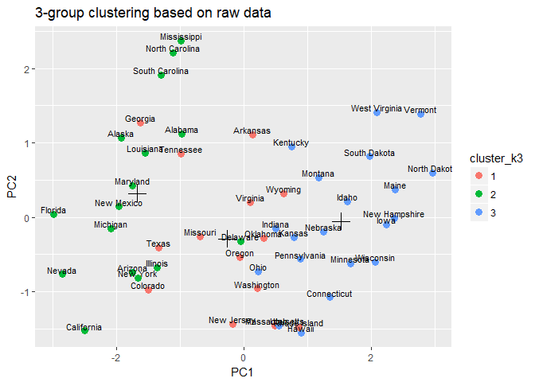
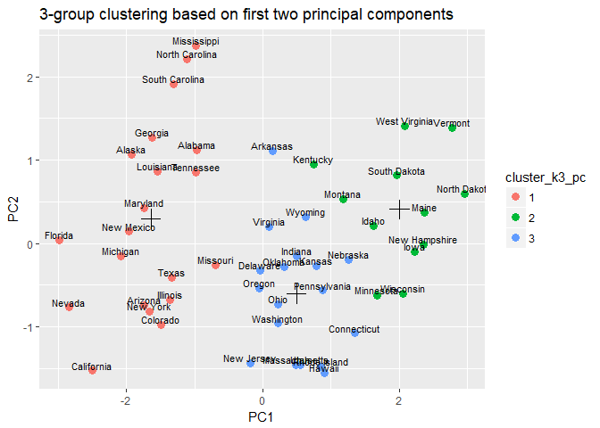
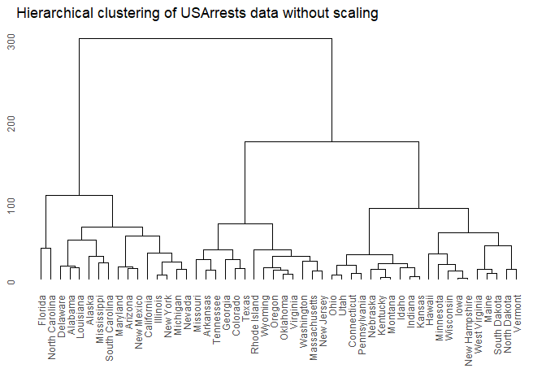
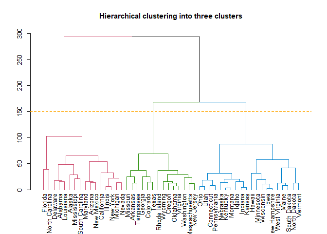
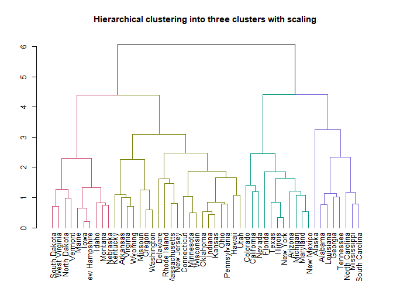

Unsupervised learning assignment
================
Chen Anhua
December 2, 2017

Part I
------

### Question 1

According to the loading vectors table (for the first four principal components) and the bi-plot generated below, the "Percent of new students from top 10% of H.S. class" (Top10perc), "Percent of new students from top 25% of H.S. class" (Top25perc), "Percent of faculty with Ph.D.'s", "Percent of faculty with terminal degrees" and "Instructional expenditure per student" appear strongly correlated on the first principal component, while "Number of fulltime undergraduates", "Number of parttime undergraduates", "Number of applications received", "Number of applications accepted" and "Number of new students enrolled" appear strongly correlated on the second principal component.

``` r
df_college = as.data.frame(read.csv("./College.csv"))
df_college$Private = NULL    # remove non-numerical column
pca_college = prcomp(df_college, scale = T)
print(pca_college$rotation[,1:4])
```

    ##                     PC1         PC2         PC3         PC4
    ## Apps         0.24876560 -0.33159823  0.06309210 -0.28131053
    ## Accept       0.20760150 -0.37211675  0.10124906 -0.26781735
    ## Enroll       0.17630359 -0.40372425  0.08298557 -0.16182677
    ## Top10perc    0.35427395  0.08241182 -0.03505553  0.05154725
    ## Top25perc    0.34400128  0.04477866  0.02414794  0.10976654
    ## F.Undergrad  0.15464096 -0.41767377  0.06139298 -0.10041234
    ## P.Undergrad  0.02644250 -0.31508783 -0.13968172  0.15855849
    ## Outstate     0.29473642  0.24964352 -0.04659887 -0.13129136
    ## Room.Board   0.24903045  0.13780888 -0.14896739 -0.18499599
    ## Books        0.06475752 -0.05634184 -0.67741165 -0.08708922
    ## Personal    -0.04252854 -0.21992922 -0.49972112  0.23071057
    ## PhD          0.31831287 -0.05831132  0.12702837  0.53472483
    ## Terminal     0.31705602 -0.04642945  0.06603755  0.51944302
    ## S.F.Ratio   -0.17695789 -0.24666528  0.28984840  0.16118949
    ## perc.alumni  0.20508237  0.24659527  0.14698927 -0.01731422
    ## Expend       0.31890875  0.13168986 -0.22674398 -0.07927349
    ## Grad.Rate    0.25231565  0.16924053  0.20806465 -0.26912907

``` r
biplot(pca_college, scale = 0, cex = 0.6, 
       xlabs=rep(".", nrow(df_college)), 
       xlim = c(-5, 10), ylim = c(-10, 5), expand = 1.5)
```



### Question 2

According to the table and chart below on cumulative proportion of variance explained, approximately 58% of the variance in College is explained by the first two principal components.

``` r
pca_college.var =pca_college$sdev ^2
pve_college = pca_college.var/sum(pca_college.var )
pve_college_cum = 
  data.frame(pca = seq(1:length(pve_college)),
             cum_pve = cumsum(pve_college), 
             pve = pve_college)    # cumulative PVE

print(pve_college_cum)
```

    ##    pca   cum_pve         pve
    ## 1    1 0.3202063 0.320206282
    ## 2    2 0.5836084 0.263402144
    ## 3    3 0.6526176 0.069009166
    ## 4    4 0.7118475 0.059229892
    ## 5    5 0.7667315 0.054884051
    ## 6    6 0.8165785 0.049847010
    ## 7    7 0.8521673 0.035588715
    ## 8    8 0.8867035 0.034536213
    ## 9    9 0.9178758 0.031172337
    ## 10  10 0.9416277 0.023751915
    ## 11  11 0.9600420 0.018414263
    ## 12  12 0.9730024 0.012960414
    ## 13  13 0.9828599 0.009857541
    ## 14  14 0.9913184 0.008458423
    ## 15  15 0.9964896 0.005171256
    ## 16  16 0.9986472 0.002157540
    ## 17  17 1.0000000 0.001352837

``` r
pve_college_cum.m = melt(pve_college_cum, id.var = "pca")
pve_cum.plot = ggplot(pve_college_cum.m, aes(x = pca, y = value, color = variable)) +
  geom_line() +
  geom_point(aes(color = variable)) +
  xlab("Principal Component") +
  ylab("Prop. Variance Explained") +
  ylim(c(0, 1))
print(pve_cum.plot)
```



Part II
-------

### Q1

``` r
pca_arrests = prcomp(USArrests, scale = T)
biplot(pca_arrests, scale = 0, cex = 0.6, 
       #xlabs=rep(".", nrow(USArrests)), 
       xlim = c(-4, 4), ylim = c(-3, 3), expand = 2)
```



``` r
pca_arrests.var =pca_arrests$sdev ^2
pve_arrests = pca_arrests.var/sum(pca_arrests.var )
pve_arrests_cum = 
  data.frame(pca = seq(1:length(pve_arrests)),
             cum_pve = cumsum(pve_arrests), 
             pve = pve_arrests)    # cumulative PVE

print(pve_arrests_cum)
```

    ##   pca   cum_pve        pve
    ## 1   1 0.6200604 0.62006039
    ## 2   2 0.8675017 0.24744129
    ## 3   3 0.9566425 0.08914080
    ## 4   4 1.0000000 0.04335752

``` r
pve_arrests_cum.m = melt(pve_arrests_cum, id.var = "pca")
pve_cum.plot = ggplot(pve_arrests_cum.m, aes(x = pca, y = value, color = variable)) +
  geom_line() +
  geom_point(aes(color = variable)) +
  xlab("Principal Component") +
  ylab("Prop. Variance Explained") +
  ylim(c(0, 1))
print(pve_cum.plot)
```



Q2-3
----

Based on the first chart generated below, if we cluster the data into two groups, first principal component seems to determine the clustering of the states (into roughly left half and right half). One way to interpret this would be that the first principal component is capturing a good amount of information/variation in data, through which states could be clusterted into two groups. This corresponds to the observation in Q1 that the PVE of first component is already more than 60%. Besides, we can observe that the vertical location of two groups are also slight differentiated (group 2/blue is slightly larger than that of group1/red), which indicates that the second principal component is also providing some information on the variation in data, though significantly less than that provided by the first component. As for the 4-group clustering, we can see that the general classification is still following roughly along the first principal component.

One thing worth pointing out is the outliers in these two graphs, namely states which should have belong to other clusters purely based on the first and second principle components. However, the reason of outlier states' existence lies in the fact that, cumulatively, the first two principal components only explain 87% of the variation in data, leaving the rest 13% unexplained by this 2-dimensional space. This 13% unexplained variation will naturally translate into the "observed outliers" in our 2D charts.

``` r
set.seed(12345)
df_kmeans = data.frame(
  state_name = rownames(USArrests),
  prcomp(USArrests, scale = T)$x,
  cluster_k2 = as.factor(kmeans(USArrests, 2, nstart = 20)$cluster), 
  cluster_k4 = as.factor(kmeans(USArrests, 4, nstart = 20)$cluster)
)
centroid_k2 = aggregate(cbind(PC1, PC2)~cluster_k2, df_kmeans, mean)
centroid_k4 = aggregate(cbind(PC1, PC2)~cluster_k4, df_kmeans, mean)

ggplot(df_kmeans, aes(x = PC1, y = PC2)) +
  geom_point(size = 3, aes(color = cluster_k2)) + 
  geom_text(aes(label= state_name),hjust=0.5, vjust=-0.2, size = 3) +
  geom_point(data = centroid_k2, shape = 3, size = 5) +
  ggtitle("2-group clustering on first 2 principal components")
```


``` r
ggplot(df_kmeans, aes(x = PC1, y = PC2)) +
  geom_point(size = 3, aes(color = cluster_k4)) + 
  geom_text(aes(label= state_name),hjust=0.5, vjust=-0.2, size = 3)+
  geom_point(data = centroid_k4, shape = 3, size = 5) +
  ggtitle("4-group clustering on first 2 principal components")
```



### Q4-5

There is a difference between clustering based on raw data and that based on first two principal components. The chart based on first two principal components (second chart below) "seems" to be a more "clear-cut" or more "locally-concentrated" classification, namely each state (scatter) is more "geometrically" close to its cluster's centroid. The reason is simple: the clustering based on first-two principal components is BOTH clustered and shown in the same 2-dimensional space. While the clustering based on raw data is a classification based on 4-dimensional data but shown in a 2-D space, which may not necessarily looks like a geometrical clustering on a 2-D plane (based on Euclidean distance).

Even thought the second chart for question 5 may "seem" to have a "better" classification in this 2-D representation, this observation is prune to mis-interpretation! Because the method in question 5 will suffer from significant information loss during clustering process. Clustering based in 4-dimensional space will potentially provide more information than clustering in 2-D space. However, based on PVE analysis, if the first two principal components could essentially capture a large proportion of the variation in data across features, then the method in question 5 may be able to filter out insignificant noises, leading to a more efficient classification. Therefore, we should not (and could not) directly compare the perfomances of these two clustering based on this 2-D representation.

``` r
set.seed(12345)
df_kmeans_3 = data.frame(
  state_name = rownames(USArrests),
  prcomp(USArrests, scale = T)$x,
  cluster_k3 = as.factor(kmeans(USArrests, 3, nstart = 20)$cluster), 
  cluster_k3_pc = as.factor(kmeans(prcomp(USArrests, scale = T)$x[,c("PC1", "PC2")], 3, nstart = 20)$cluster)
)
centroid_k3 = aggregate(cbind(PC1, PC2)~cluster_k3, df_kmeans_3, mean)
centroid_k3_pc = aggregate(cbind(PC1, PC2)~cluster_k3_pc, df_kmeans_3, mean)

ggplot(df_kmeans_3, aes(x = PC1, y = PC2)) +
  geom_point(size = 3, aes(color = cluster_k3)) + 
  geom_text(aes(label= state_name),hjust=0.5, vjust=-0.2, size = 3) +
  geom_point(data = centroid_k3, shape = 3, size = 5) +
  ggtitle("3-group clustering based on raw data")
```



``` r
ggplot(df_kmeans_3, aes(x = PC1, y = PC2)) +
  geom_point(size = 3, aes(color = cluster_k3_pc)) + 
  geom_text(aes(label= state_name),hjust=0.5, vjust=-0.2, size = 3)+
  geom_point(data = centroid_k3_pc, shape = 3, size = 5) +
  ggtitle("3-group clustering based on first two principal components")
```



### Q6-7

For the hierarchical clustering based on unscaled raw data (Q6), please see the first chart below.

We also use the horizontal line at y = 150 to cut the states into three clusters (please see second chart for Q7). I also print out the states below to each subgroup.

``` r
hc <- hclust(dist(USArrests), method = "complete")
ggdendrogram(hc, rotate = FALSE, size = 2) +
  labs(title = "Hierarchical clustering of USArrests data without scaling")
```



``` r
dend = as.dendrogram(hc)
d = color_branches(dend, k = 3)
par(cex = 0.8)
plot(d, main  = "Hierarchical clustering into three clusters")
abline(150, 0, col = "orange", lty = 2)
```



``` r
hcluster_groups = cutree(hc, k = 3)
for (i in 1:3){
  print(paste0("Group: ", i))
  print(names(hcluster_groups)[hcluster_groups == i])
  print(cat("\n"))
}
```

    ## [1] "Group: 1"
    ##  [1] "Alabama"        "Alaska"         "Arizona"        "California"    
    ##  [5] "Delaware"       "Florida"        "Illinois"       "Louisiana"     
    ##  [9] "Maryland"       "Michigan"       "Mississippi"    "Nevada"        
    ## [13] "New Mexico"     "New York"       "North Carolina" "South Carolina"
    ## 
    ## NULL
    ## [1] "Group: 2"
    ##  [1] "Arkansas"      "Colorado"      "Georgia"       "Massachusetts"
    ##  [5] "Missouri"      "New Jersey"    "Oklahoma"      "Oregon"       
    ##  [9] "Rhode Island"  "Tennessee"     "Texas"         "Virginia"     
    ## [13] "Washington"    "Wyoming"      
    ## 
    ## NULL
    ## [1] "Group: 3"
    ##  [1] "Connecticut"   "Hawaii"        "Idaho"         "Indiana"      
    ##  [5] "Iowa"          "Kansas"        "Kentucky"      "Maine"        
    ##  [9] "Minnesota"     "Montana"       "Nebraska"      "New Hampshire"
    ## [13] "North Dakota"  "Ohio"          "Pennsylvania"  "South Dakota" 
    ## [17] "Utah"          "Vermont"       "West Virginia" "Wisconsin"    
    ## 
    ## NULL

### Q8

As we compare the results generated below with those in Q6/7, we find the clustering structures are very different. First, the distance has been reduced, naturally because of our normalization. Second, the standardized data becomes more "scatterted" in the sense that it becomes harder to cluster the states into a small number of groups compared to un-normalized data in Q6 and Q7, or we have a more "balanced" dendrogram. The differences among groups of observations at different level become siginificantly smaller due to our standardization.

One aspect to interpret this is that, by standardization, we are normalizing and equalizing the weight of each variable in terms of calculating the dissimilarity score. For example, in our case, the Assualt variable has a larger variation compared to other variables. Therefore, the weight carried by "Assault" will outweight other types of crimes when deciding the dissimilarity between clusters, indicating the clustering we observed in Q6/7 could be mainly determined by the clustering over States' smilarity in Assualt variable. This is especially the case if we are using the Euclidean distance.

``` r
hc_scale <- hclust(dist(scale(USArrests)), method = "complete")
ggdendrogram(hc_scale, rotate = FALSE, size = 2) +
  labs(title = "Hierarchical clustering of USArrests data with scaling")
```


``` r
dend = as.dendrogram(hc_scale)
d_scale = color_branches(dend, k = 4)
par(cex = 0.8)
plot(d_scale, main  = "Hierarchical clustering into three clusters with scaling")
abline(150, 0, col = "orange", lty = 2)
```



``` r
hcluster_groups = cutree(hc_scale, k = 4)
print("When scaling the data:")
```

    ## [1] "When scaling the data:"

``` r
for (i in 1:4){
  print(paste0("Group: ", i))
  print(names(hcluster_groups)[hcluster_groups == i])
  print(cat("\n"))
}
```

    ## [1] "Group: 1"
    ## [1] "Alabama"        "Alaska"         "Georgia"        "Louisiana"     
    ## [5] "Mississippi"    "North Carolina" "South Carolina" "Tennessee"     
    ## 
    ## NULL
    ## [1] "Group: 2"
    ##  [1] "Arizona"    "California" "Colorado"   "Florida"    "Illinois"  
    ##  [6] "Maryland"   "Michigan"   "Nevada"     "New Mexico" "New York"  
    ## [11] "Texas"     
    ## 
    ## NULL
    ## [1] "Group: 3"
    ##  [1] "Arkansas"      "Connecticut"   "Delaware"      "Hawaii"       
    ##  [5] "Indiana"       "Kansas"        "Kentucky"      "Massachusetts"
    ##  [9] "Minnesota"     "Missouri"      "New Jersey"    "Ohio"         
    ## [13] "Oklahoma"      "Oregon"        "Pennsylvania"  "Rhode Island" 
    ## [17] "Utah"          "Virginia"      "Washington"    "Wisconsin"    
    ## [21] "Wyoming"      
    ## 
    ## NULL
    ## [1] "Group: 4"
    ##  [1] "Idaho"         "Iowa"          "Maine"         "Montana"      
    ##  [5] "Nebraska"      "New Hampshire" "North Dakota"  "South Dakota" 
    ##  [9] "Vermont"       "West Virginia"
    ## 
    ## NULL
