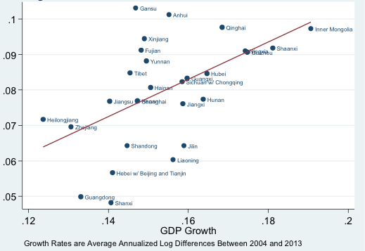

Introduction
------------

This research proposal aims at utilizing remote-sensing data (e.g., DMSP-OLS Light-At-Night satellite data) to more accurately identify the dynamics of economic clustering in China, which are of great research and policy significance. Compared to traditional administrative-region-based unit (e.g., province/city/county), a new economic-based-clustering based on remote-sensing data will have several advantages. First, a clear identification of economic-clustering would allow us to understand better the interaction between regional economic activities and other factors associated with geographic locations, which are not necessarily subject to exogenously-designed administrative boundaries. Second, by using remote-sensing data as a proxy of economic activity, we would be able to better control the systematic mis-reporting of administrative-region-based economic statistics which have already been under heavy criticism. Third, an economic-clustering would allow us to generate better policy implication in terms of cross-regional economic policy coordination and provide a better track and assessment of existed economic-oriented zoning policy in China.

To better identify the economic-activity-based clustering in China includes two phases. In the first stage, we need to examine the relation between Light-At-Night data (LAN) and different economic activity measures, and to which extent, the LAN data could be regarded as a fairly good proxy of different economic activities. It is well documented in several studies (Henderson, Storeygard and Weil (2012), Chen and Nordhaus (2011), Michalopoulos and Papaioannou (2013, 2014)) that there exists a strong correlation between lights and economic activities measure.(See the chart below for the provincial case of China). Following the methodology of Pinkovskiy and Sala-i-Martin (2016a and b), through utilizing LAN data, we will construct a measure of economic activity intensity based on other optimally-weighted economic indicators. In the second stage, we would calculate the local Moran's I statistic (Anselin, 1995) and calculate the clustering structure of China based on economic activity measure calculated in the first stage.

Data
----

In this section, we will mainly discuss the data used in the first stage of the project. We will emphasize more on the discussion of utilizing the LAN data's feature.

### DMSP-OLS Radiance Calibrated Nighttime Lights Time Series (LAN)

Collected by the Defense Meteorological Satellite Program Operational Linescan System (DMSP-OLS) satellite program and maintained by the Natioanl Oceanic and Atmosphere Administration (NGDC 2010), LAN data, in the form of discrete integers rangeing from 0 to 63, represents the luminosity of at the resolution of 30 arcseconds. The data will cover locations +/-65 latitude and +/-180 longtitude. The data is collected by satellites orbiring earth taking picture during 20:30-22:00 local time.

#### Feature: big

The data will cover every single corner of China's territory, the coverage of which is unrivaled by other dataset. (A sample image of global coverage of DMSP-OLS data is pasted below) Even though China has very detailed by-county GDP statistics, compared to an approximately 1 km by 1 km pixel in LAN data, by-county data is still too-aggregated. This big feature will not only guarantee the comprehensiveness of coverage but will also greatly improve the capture of heterogeneity still existed even in the smallest geographical unit of other economic data. For instance, the information of significant differences within a relatively large county would be lost if we use by-county statistics even if different regions of this county should belong to respective economic clustering.

#### Feature: Non-reactive

This feature of the LAN data is of great significance especially under the context of this proposed research project. Chinese official statistics on provinsional and local GDP have long been under the criticism of data falsification and fabrication given the incentive system of local officials in terms of promotion and other political benefits is highly associated with the performance of their administrative region's economic growth. Chinese official GDP statitics published by NBS has been subject to doubt of manipulation due to its over-smoothness compared to those of other countries(Nakamura, Steinsson and Liu (2016)).

The LAN data, on the other hand, is not subject to this problem. The fact that measured entity's chance of strategically "mis-reporting" luminosity data is extremely slim has provided the data with a very nice non-reactive feature.This feature will potentially reduce the influence of systematic mis-reporting which we observed in other official statistics ---- It is reported that the aggregate GDP of China has been adjusted downward by 7% compared to the aggregation of provincial read.

#### Feature: Always-on, inaccessible and drifitng

Satellite-collected remote sensing data will be recorded constantly, the frequency of which enable real-time monitorig of variation in luminosity data. If there does exist strong correlation between luminosity and various economic activities, the LAN data could be extrapolated as a much more frequent and updated proxy for economic activity measures, which are usually subject to significant lag in time due to their survey-based nature.

However, the flip side of the always-on feature of satellite data is the potentiall accessibility issue. Since certain features and potential of remote-sensing data would incur controversy in terms of data-privacy and national security, a real-time, high-resolution and most updated satellite image data would hardly be accessible to public. For instance the LAN data we propose to use in the study only covers time range only from 1992 to 2013 and the benchmark data files are on an annul-baiss. Combination of an always-on feature together with an accessibility issue suggests any drifting dynamics of the data would not be captured timely.

Since this study is primarily focusing on the potential of utilizing satellite data to identify economic clustering, if we were to apply the same methodology to real-time monitoring of clustering evolution, we could reach out to other sources, companies with commercial satellite data, for instance, to remedy the accessbility issue of publicly-available DMSP-OLS data.

#### Feature: Dirty

Like most big-data, LAN data will also be subject to measurement error. However, within the context of our study, if the measurement error existed in LAN data is independent of those existed in outher macroeconomic indicators, it could be an helpful auxiliary variable in deriving an optimally-weighted economic indicator, same as the methodololgy proposed in Pinkovskiy and Sala-i-Martin (2016a and b). We will discuss it further in Methodology section.

Methodology
-----------

There are mainly two components of this section. First, we will introduce the innovative approach proposed by Pinkovskiy and Salai-Martin (2016a and b) on how to utilize LAN data as an auxiliary variable to assign optimal weight to different existed economic variables to construct a best unbiased linear predictor of regional economic activity (e.g., income). Second, based on the linear predictor derived in the first stage, we would calculate the Moran's I statistic (Anselin, 1995) of each geographic unit and generate the clustering based on economic activities.

### Using LAN data to derive an economic activity indicator

*L**i**g**h**t**i*, *t* = *f**i*(*E**A**i**t*)+*ϵ**i**t**L*
*Y**i*, *t**j* = *α**j* + *β**i*, *t**j* + *ϵ**i*, *t**j*
subject to:
*c**o**v*(*E**A**i**t*, *f**i*(*E**A**i**t*)) ≠ 0
*E*(*ϵ**i*, *t**j*|*E**A**i**t*)=*E*(*ϵ**i*, *t**L*|*E**A**i**t*)=0
*E*(*ϵ**i*, *t**j**ϵ**i*, *t**L*|*E**A**i**t*)=0
where *L**i**g**h**t**i*, *t* denotes nighttime lights for location *i* at time *t*. And *Y**i*, *t**j* is the *j*th economic indicator. *E**A**i**t* is the "true" economic activity. We assume the measurement error of light data is independent of the measurement error in other economic indicators in our identification.Based on this proposed framework, we could use the reduced form framework:
$$Light\_{i, t} = \\alpha + \\sum\_{J}^{j = 1}b\_{i, t}^{j}Y\_{i, t}^{j}$$
Based on this regression of night time data on various economic indicators, we could derive an optimal weight assigned to each economic indicators: $\\frac{b\_{i, t}^{j}Y\_{i, t}^{j}}{\\sum\_{J}^{j = 1}b\_{i, t}^{j}Y\_{i, t}^{j}}$ to construct an non-biased linear indicator of economic activities.

### Deriving economic clustering

Based on the varaible depicting economic activity in the first stage *E**A**i**t*, we would calculate the Moran's I statistics for each location and using ArcGIS software to derive the clustering based on economic activities in China. A demonstrated work flow of this process is listed below.

Discussion
----------

### Implication of economic clustering

#### Study the impacts of infrastructure at a more micro and endogenously-determined level

It has been reported that there exists inconsistency between macro and micro evidence in terms of the relation between infrastructure growth and economic growth (A.Ansar, et al., 2016). With the economic clustering we derived in this study, we could exaimine the interaction between infrastructure growth and economic performance at a more micro and endogenously-determined scale, rather than at the aggregated administrative-based level.

#### Analysis on Special Economic Zone based on economic clustering

The economic clustering derived in this project will also shed light on the analysis of Special Economic Zone (SEZ) policy impact. Across time, we could measure the impact of SEZ on the economic activities in its neighbourhood and examine how it has changed the distribution of economic activity through the lens of the evoluation of economic clustering. Across different SEZs, we could also evaluate and compare their performance to provide insights on which factors will contribute to success or failure of a SEZ, to better the allocation of resources in future regional economic policy coordination.

### Caveats and limitations of the study

One of the biggest limitations of the proposed study is the under-utilization of LAN satellit data due to accessibility issue. Given the time coverage and frequency of the data, we follow the framework which utilize LAN data as an auxiliary variable to derive an economic activity indicator based on existed ones. This will considerably under-utilize the real time feature of remote-sensing data. We hope we could refine the study in the future through access to better remote-sensing data.

Reference
---------

Anselin, L., 1995. Local indicators of spatial association -LISA. Geographical Analysis, 27, pp. 93-115.

Chen, Xi, and William D. Nordhaus. "Using Luminosity Data as a Proxy for Economic Statistics" Proceedings of the National Academy of Sciences. 2011

Henderson, J. Vernon, Adam Storeygard, and David N. Weil. "Measuring Economic Growth from Outer Space." American Economic Review 102 (2012), no. 2: 994-1028.

Michalopoulos, Stelios, and Elias Papaioannou. "Pre-colonial Ethnic Institutions and Contem- porary African Development." Econometrica 81 (2013), no. 1: 113-152.

Michalopoulos, Stelios, and Elias Papaioannou. "National Institutions and Sub-national Devel- opment in Africa." Quarterly Journal of Economics 129 (2014) no. 1:151-213.

Nakamura, Emi, Jón Steinsson, and Miao Liu. "Are Chinese Growth and In‡ation too Smooth? Evidence from Engel Curves." American Economic Journal: Macroeconomics 8, no. 3 (2016): 113-144.

National Geophysical Data Center (NGDC). “Version 4 DMSP-OLS Night- time Lights Time Series.” National Oceanic and Atmospheric Administration. <http://www.ngdc.noaa.gov/dmsp/downloadV4composites.html>. 2010. (accessed September 2013).

Pinkovskiy, Maxim, and Xavier Sala-i-Martin. 2016a. "Lights, Camera. . . Income! Illuminating the National Accounts-Household Surveys Debate." Quarterly Journal of Economics 131, no. 2: 579-631.

Pinkovskiy, Maxim, and Xavier Sala-i-Martin. 2016b. "Newer need not be better: evaluating the Penn World Tables and the World Development Indicators using nighttime lights." National Bureau of Economic Research No. w22216.
