EDA For the GSS Data - Lab Notebook
================
Xi Chen
November 27, 2017

``` r
data(gss, package = "poliscidata")
attach(gss)
options(warn=-1)
library(tidyverse)
```

    ## -- Attaching packages ----------------------------------- tidyverse 1.2.1 --

    ## v ggplot2 2.2.1     v purrr   0.2.4
    ## v tibble  1.3.4     v dplyr   0.7.4
    ## v tidyr   0.7.2     v stringr 1.2.0
    ## v readr   1.1.1     v forcats 0.2.0

    ## -- Conflicts -------------------------------------- tidyverse_conflicts() --
    ## x dplyr::filter() masks stats::filter()
    ## x dplyr::lag()    masks stats::lag()

``` r
gss <- as_tibble(gss)

# Firstly explore several basic geographical factors
ggplot(gss, aes(race,fill=sex)) + geom_bar(position="dodge")
```

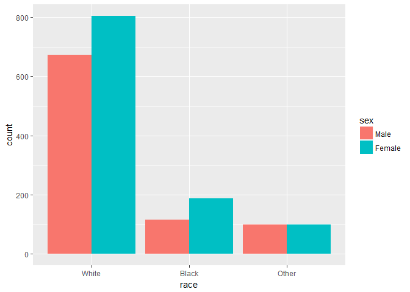

``` r
## There is more white respondents in the data
ggplot(gss, aes(age,fill=sex)) + geom_bar(position="fill")
```

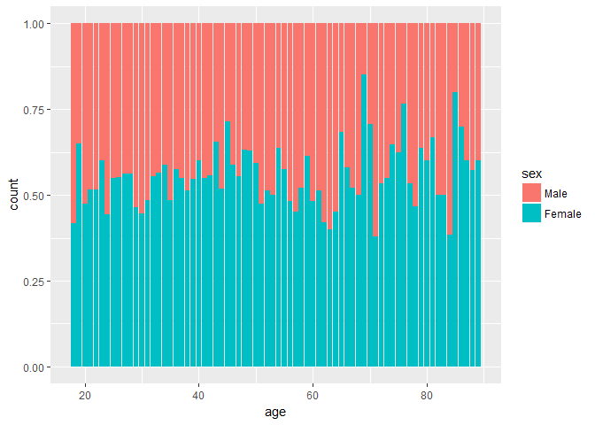

``` r
ggplot(gss, aes(marital,fill=race)) + geom_bar(position="stack")
```

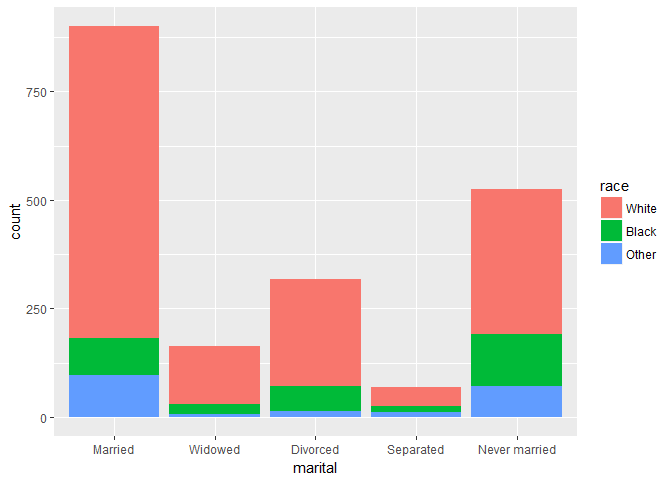

``` r
## Ther is more married respondents in the data
ggplot(gss, aes(wrkgvt,fill=race)) + geom_bar(position="dodge")
```

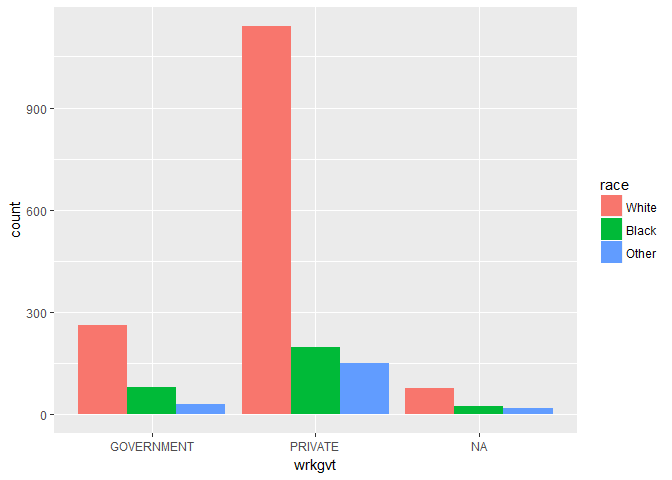

``` r
ggplot(gss, aes(degree, fill=race)) + geom_bar(position="fill")
```

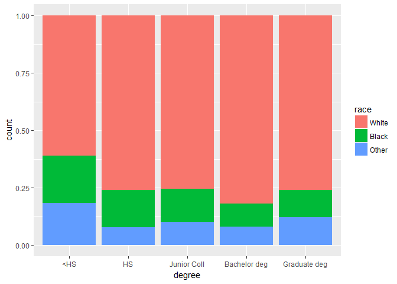

``` r
ggplot(gss, aes(rincom06_5, age)) + geom_jitter()
```

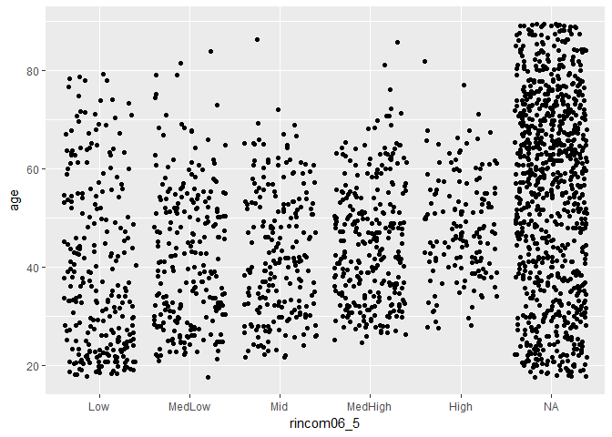

``` r
## A positive relationship between income and age

# The relationship between income and happiness 
ggplot(gss, aes(rincom06_5, fill=happy)) + 
  geom_bar(position="fill") + 
  scale_fill_brewer(palette = "Set1")
```

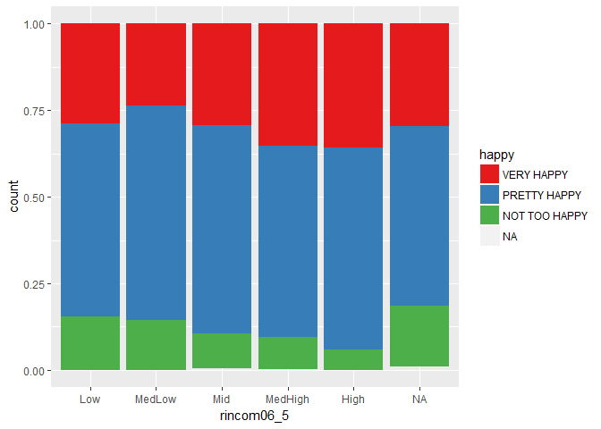

``` r
## No clear relatinthip between income and happiness

# The relationship between sex and income
ggplot(gss, aes(x=age, y=rincom06, color=sex)) + 
  geom_point() +
  scale_colour_hue(l=50) + 
  theme(plot.title = element_text(lineheight=.8, face="bold"))
```

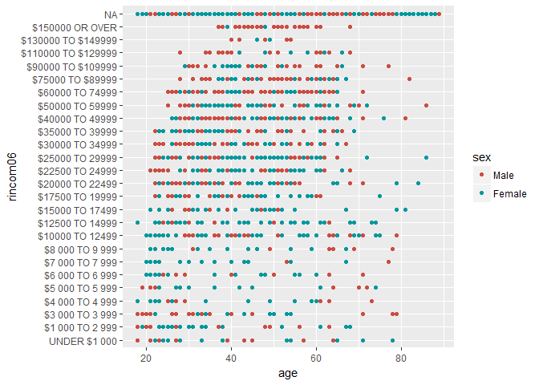

``` r
ggplot(gss, aes(rincom06_5, fill=sex)) + 
  geom_bar(position="fill") + 
  scale_fill_brewer(palette = "Set2")
```

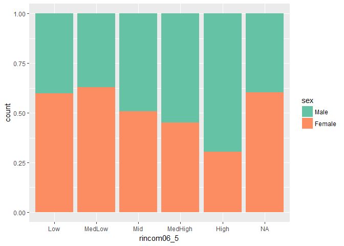

``` r
# The relationship between sex and happiness
ggplot(gss, aes(happy, fill=sex)) + geom_bar(position="fill") +
  scale_x_discrete(labels=c("VERY HAPPY"="Very happy", 
                            "PRETTY HAPPY" = "Pretty happy", 
                            "NOT TOO HAPPY" = "Not too happy"))
```


``` r
# The relationship between race and income 
ggplot(gss, aes(x=age, y=rincom06, color=race)) + 
  geom_point() +
  scale_colour_hue(l=50) + 
  theme(plot.title = element_text(lineheight=.8, face="bold"))
```

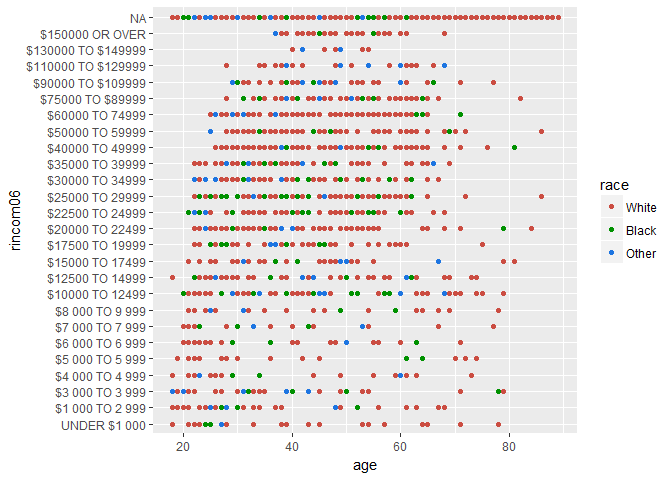

``` r
ggplot(gss, aes(race, income06)) + geom_jitter()
```

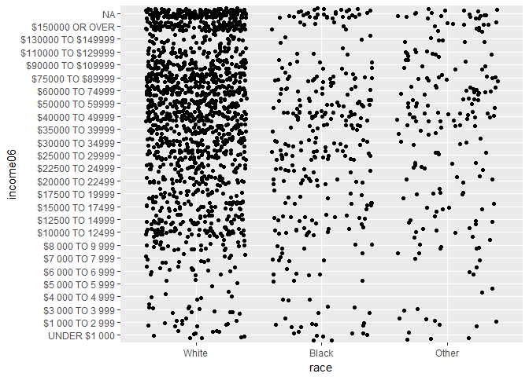

``` r
# The relationship between race and happiness
ggplot(gss, aes(happy, fill=race)) + geom_bar(position="fill") +
  scale_x_discrete(labels=c("VERY HAPPY"="Very happy", 
                            "PRETTY HAPPY" = "Pretty happy", 
                            "NOT TOO HAPPY" = "Not too happy"))
```

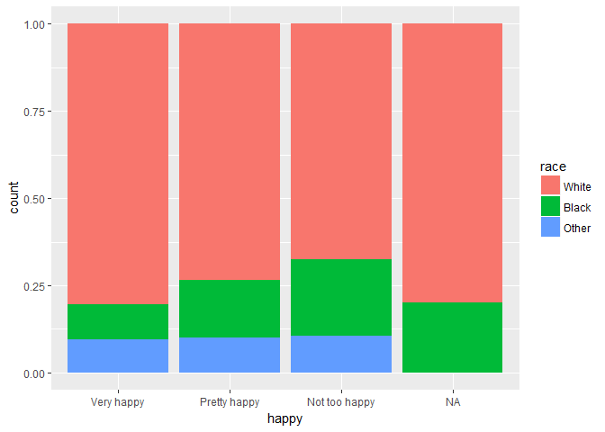

``` r
# The relationship between degree and income / happiness 
ggplot(gss, aes(rincom06_5, fill=degree)) + geom_bar(position="fill")
```

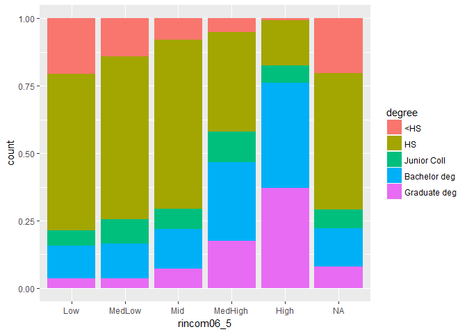

``` r
ggplot(gss, aes(happy, fill=degree)) + geom_bar(position="fill") +
  scale_x_discrete(labels=c("VERY HAPPY"="Very happy", 
                            "PRETTY HAPPY" = "Pretty happy", 
                            "NOT TOO HAPPY" = "Not too happy"))
```

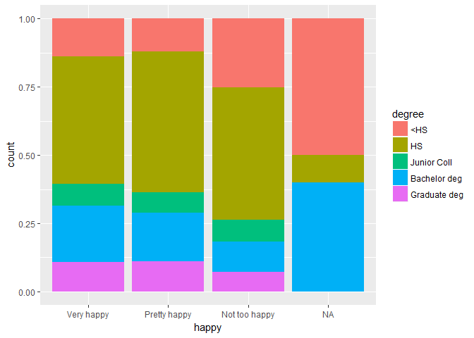

``` r
# The relationship between career and income / happiness 
ggplot(gss, aes(rincom06_5,fill=wrkgvt)) + geom_bar(position="fill")
```

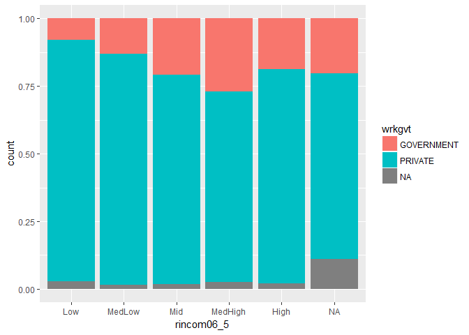

``` r
ggplot(gss, aes(happy,fill=wrkgvt)) + geom_bar(position="fill") +
  scale_x_discrete(labels=c("VERY HAPPY"="Very happy", 
                            "PRETTY HAPPY" = "Pretty happy", 
                            "NOT TOO HAPPY" = "Not too happy"))
```

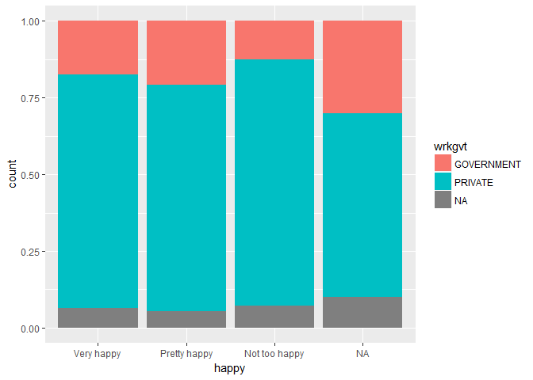

``` r
# The relationship between marital status and income / happiness
ggplot(gss, aes(marital, rincom06)) + geom_jitter()
```

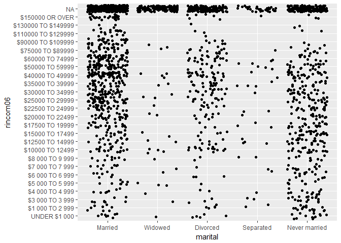

``` r
ggplot(gss, aes(rincom06_5, fill=marital)) + geom_bar(position="fill")
```

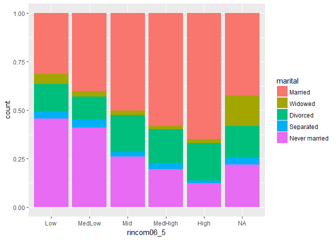

``` r
ggplot(gss, aes(happy, fill=marital)) + geom_bar(position="fill") +
  scale_x_discrete(labels=c("VERY HAPPY"="Very happy", 
                            "PRETTY HAPPY" = "Pretty happy", 
                            "NOT TOO HAPPY" = "Not too happy"))
```

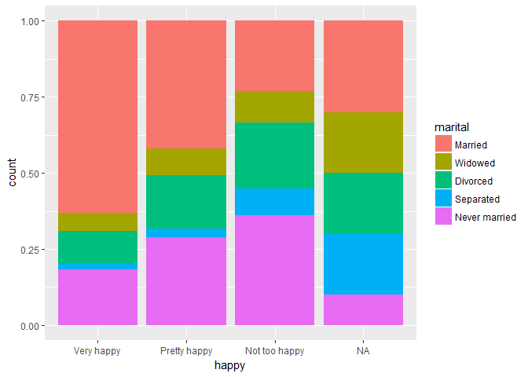

``` r
## Married people are happier

# The relationship between childs and income / happiness
ggplot(gss, aes(rincom06_5, childs)) + geom_jitter()
```

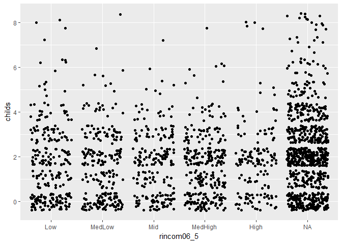

``` r
ggplot(gss, aes(rincom06_5, childs)) + geom_boxplot()
```


``` r
ggplot(gss, aes(rincom06_5, childs)) + geom_violin(scale="area")
```

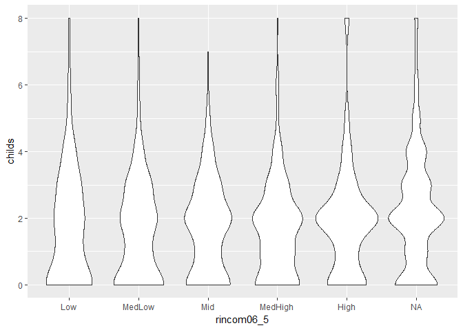

``` r
ggplot(gss, aes(happy, childs)) + geom_boxplot()
```

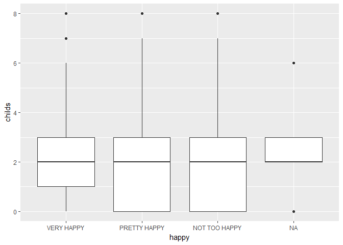

``` r
ggplot(gss, aes(happy, childs)) + geom_violin(scale="area")
```

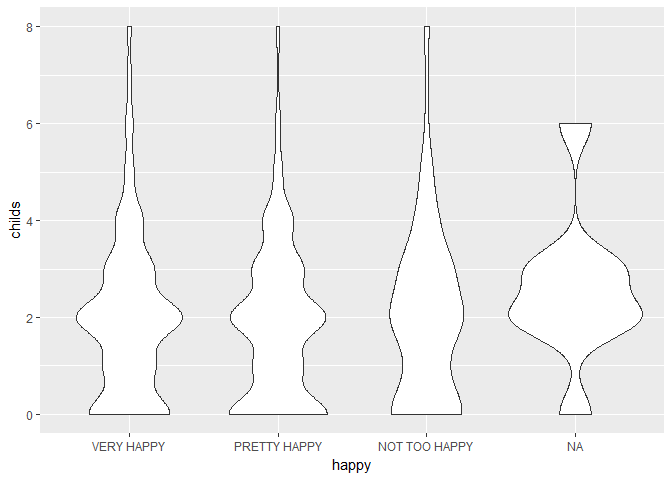

``` r
# The relationship between TV hours and income / happiness
ggplot(gss, aes(rincom06_5, tvhours)) + geom_boxplot()
```

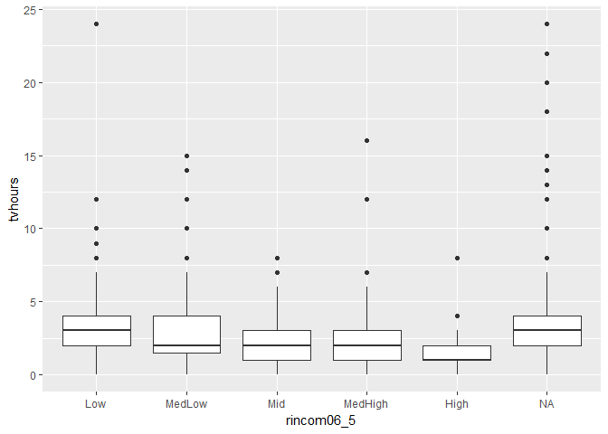

``` r
ggplot(gss, aes(rincom06_5, tvhours)) + geom_violin(scale="area")
```

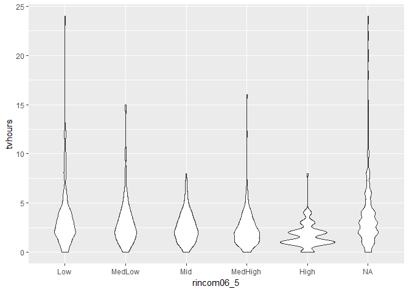

``` r
ggplot(gss, aes(happy, tvhours)) + geom_boxplot()
```

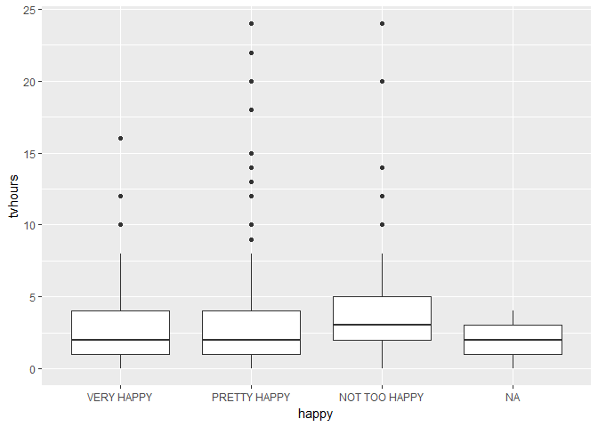

``` r
ggplot(gss, aes(happy, tvhours)) + geom_violin(scale="area")
```

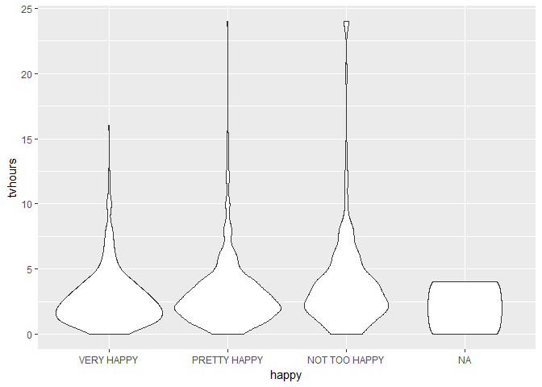

``` r
## More TV, less happeir

# The relationship between news and income / happiness
ggplot(gss, aes(rincom06_5, fill=news)) + geom_bar(position="fill") + 
  coord_flip()
```


``` r
ggplot(gss, aes(happy, fill=news)) + geom_bar(position="fill") + 
  coord_flip()
```

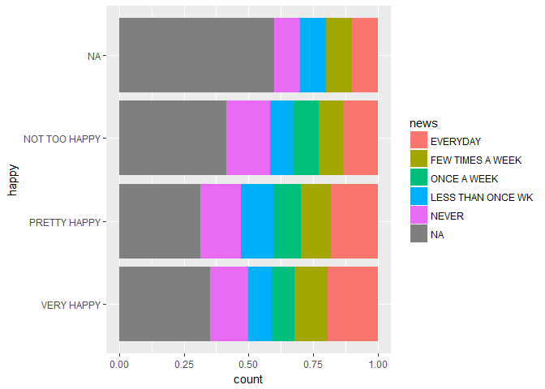

``` r
# The relationship between interested issues and income
ggplot(gss, aes(rincom06_5, int_info_scale)) + 
  geom_boxplot()
```

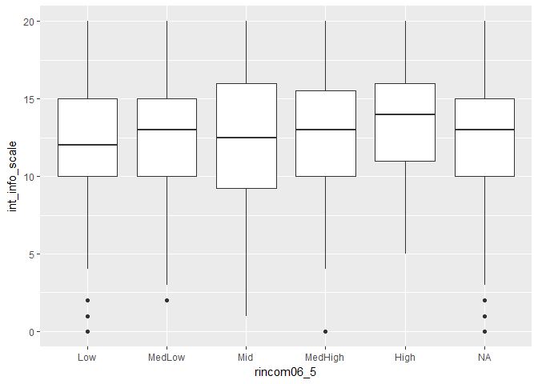

``` r
ggplot(gss, aes(rincom06_5, fill=intecon)) + 
  geom_bar(position="fill") + coord_flip()
```

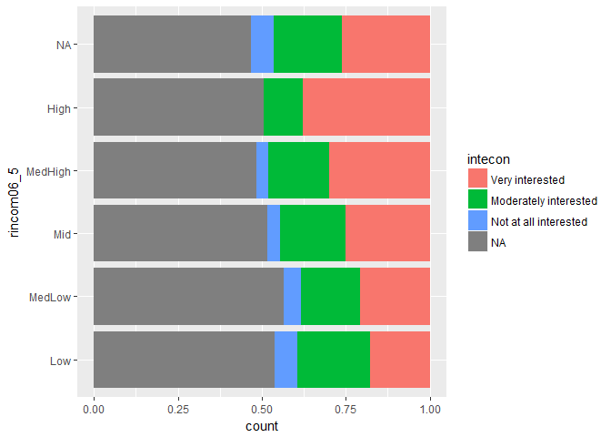

``` r
ggplot(gss, aes(rincom06_5, fill=intsci)) + 
  geom_bar(position="dodge") + coord_flip()
```

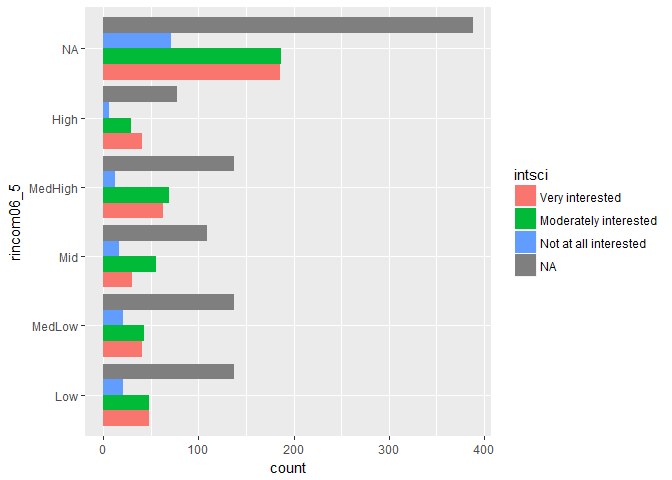

``` r
ggplot(gss, aes(rincom06_5, fill=intintl)) + 
  geom_bar(position="fill") + coord_flip()
```


``` r
ggplot(gss, aes(rincom06_5, fill=inttech)) + 
  geom_bar(position="dodge") + coord_flip()
```

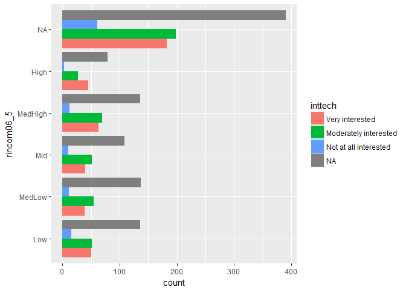

``` r
ggplot(gss, aes(rincom06_5, fill=intmed)) + 
  geom_bar(position="fill") + coord_flip()
```

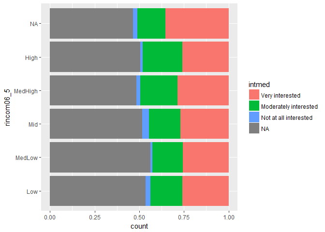

``` r
ggplot(gss, aes(rincom06_5, fill=intspace)) + 
  geom_bar(position="fill") + coord_flip()
```

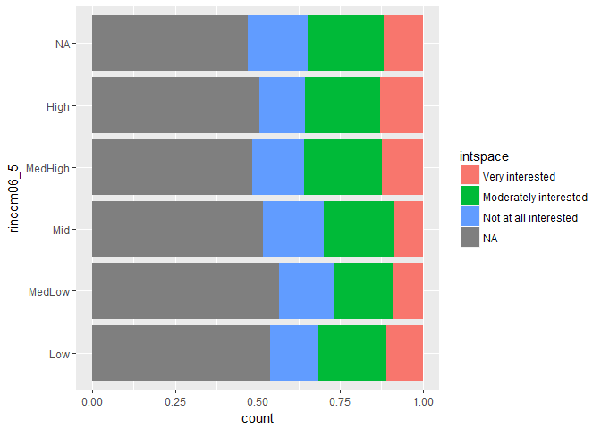

``` r
ggplot(gss, aes(rincom06_5, fill=intenvir)) + 
  geom_bar(position="fill") + coord_flip()
```

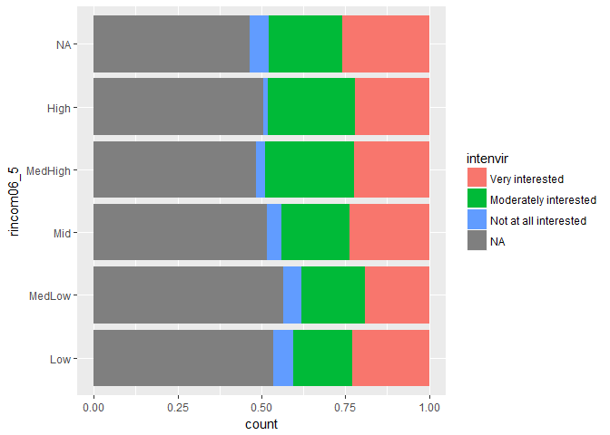

``` r
# The relationship between interested issues and happiness
ggplot(gss, aes(happy, fill=intecon)) + 
  geom_bar(position="fill") + coord_flip()
```

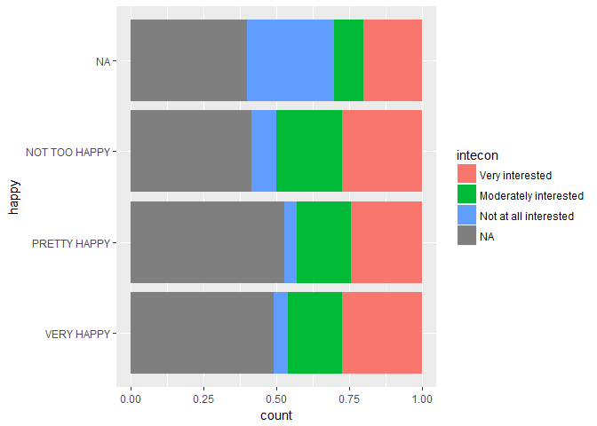

``` r
ggplot(gss, aes(happy, fill=intmed)) + 
  geom_bar(position="fill") + coord_flip()
```

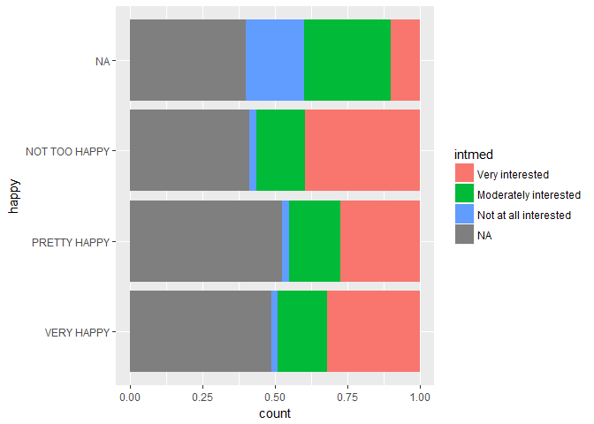

``` r
ggplot(gss, aes(happy, fill=intspace)) + 
  geom_bar(position="fill") + coord_flip()
```

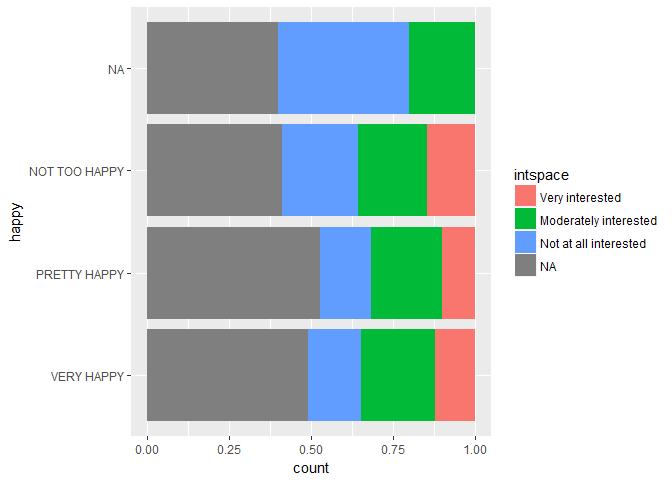

``` r
ggplot(gss, aes(happy, fill=intenvir)) + 
  geom_bar(position="fill") + coord_flip()
```

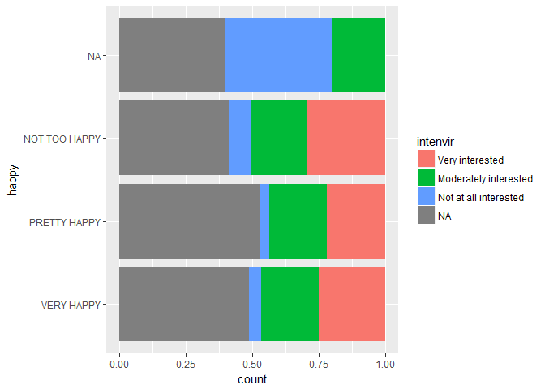

``` r
# The relationship between confidence and income
ggplot(gss, aes(rincom06_5, fill=confinan)) + 
  geom_bar(position="dodge") + coord_flip()
```

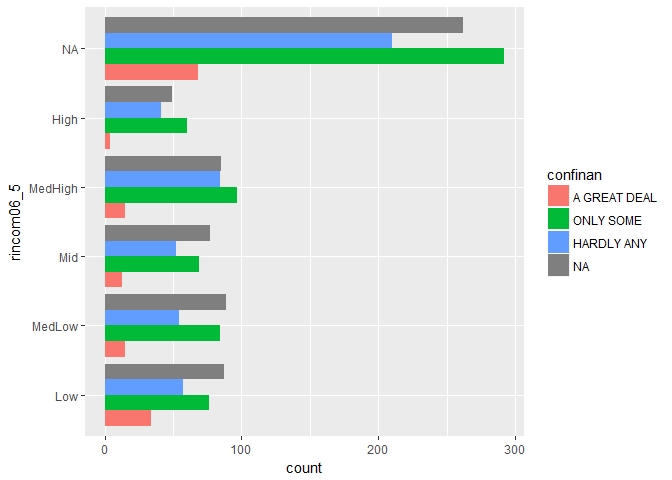

``` r
ggplot(gss, aes(rincom06_5, fill=conbus)) + 
  geom_bar(position="dodge") + coord_flip()
```

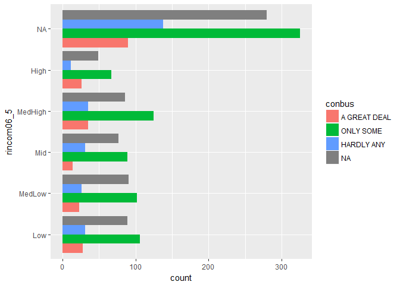

``` r
ggplot(gss, aes(rincom06_5, fill=confed)) + 
  geom_bar(position="dodge") + coord_flip()
```

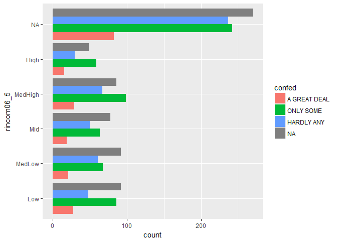

``` r
ggplot(gss, aes(rincom06_5, fill=coneduc)) + 
  geom_bar(position="dodge") + coord_flip()
```

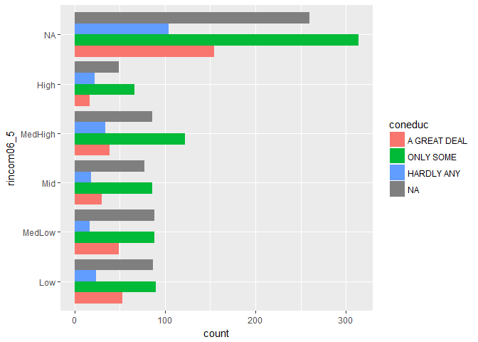

``` r
# The relationship between confidence and happiness
ggplot(gss, aes(happy, fill=confinan)) + 
  geom_bar(position="dodge") + coord_flip()
```


``` r
ggplot(gss, aes(happy, fill=conbus)) + 
  geom_bar(position="dodge") + coord_flip()
```

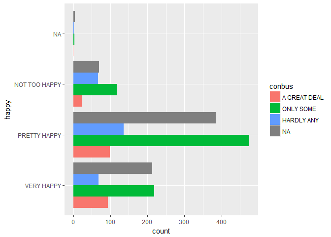

``` r
ggplot(gss, aes(happy, fill=confed)) + 
  geom_bar(position="dodge") + coord_flip()
```

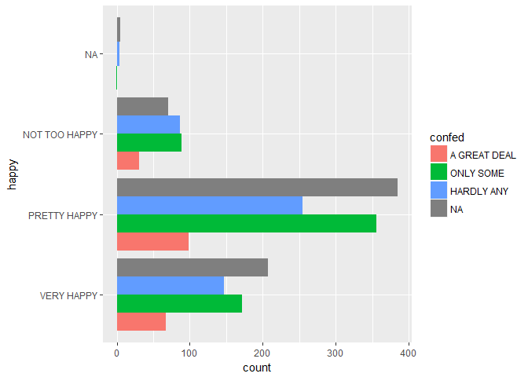

``` r
ggplot(gss, aes(happy, fill=coneduc)) + 
  geom_bar(position="dodge") + coord_flip()
```


``` r
# Respondent' income and sevearl variables
rincome_summary = gss %>%
  group_by(rincom06) %>%
  summarise(
    age = mean(age, na.rm = TRUE),
    tvhours = mean(tvhours, na.rm = TRUE),
    int_info_scale = mean(int_info_scale, na.rm = TRUE),
    social_trust = mean(social_trust, na.rm = TRUE),
    social_connect = mean(social_connect, na.rm = TRUE),
    tolerance = mean(tolerance, na.rm = TRUE),
    science_quiz = mean(science_quiz, na.rm = TRUE),
    n = n()
  )
ggplot(rincome_summary, aes(age, fct_relevel(rincom06))) +
  geom_point()
```

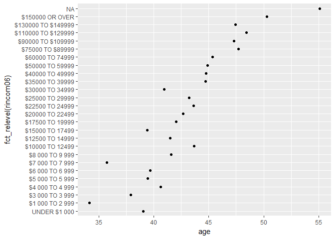

``` r
ggplot(rincome_summary, aes(tvhours, fct_relevel(rincom06))) +
  geom_point()
```

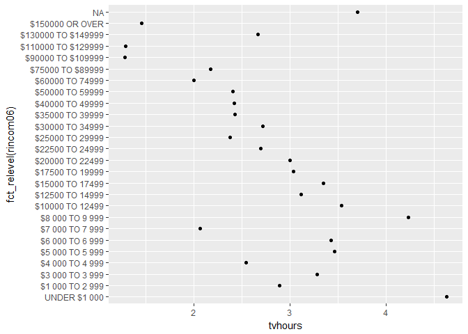

``` r
ggplot(rincome_summary, aes(int_info_scale, fct_relevel(rincom06))) +
  geom_point()
```

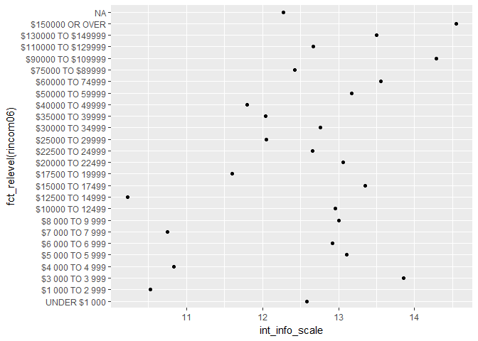

``` r
ggplot(rincome_summary, aes(social_trust, fct_relevel(rincom06))) +
  geom_point()
```

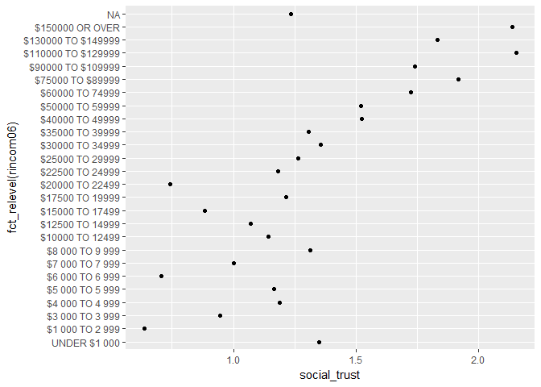

``` r
ggplot(rincome_summary, aes(social_connect, fct_relevel(rincom06))) +
  geom_point()
```

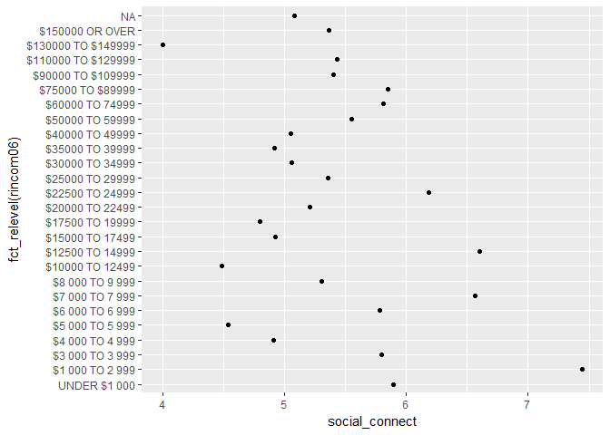

``` r
ggplot(rincome_summary, aes(science_quiz, fct_relevel(rincom06))) +
  geom_point()
```

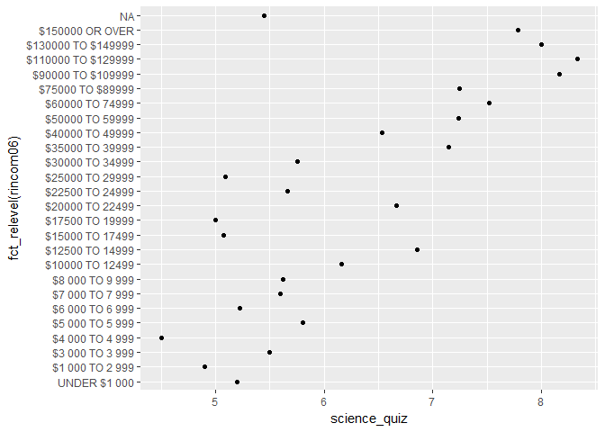

``` r
# Racial Difference in Social Trust
ggplot(gss, aes(social_trust)) + 
  geom_histogram(binwidth = 0.5) + 
  facet_wrap(~race_2)
```

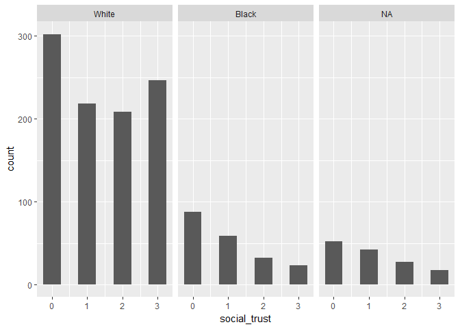

``` r
ggplot(gss, aes(social_trust, color = race_2)) + 
  geom_density() 
```

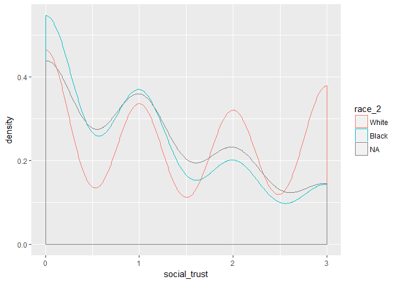

``` r
# Racial Difference in Social connect
ggplot(gss, aes(social_connect)) + 
  geom_histogram(binwidth = 1) + 
  facet_wrap(~race_2)
```

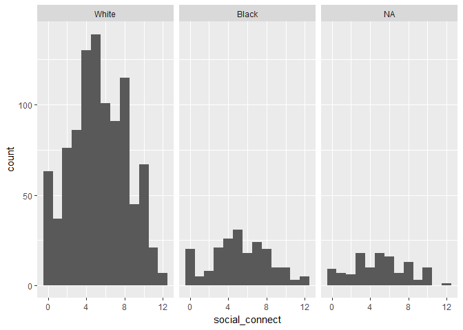

``` r
ggplot(gss, aes(social_connect, color = race_2)) + 
  geom_density() 
```

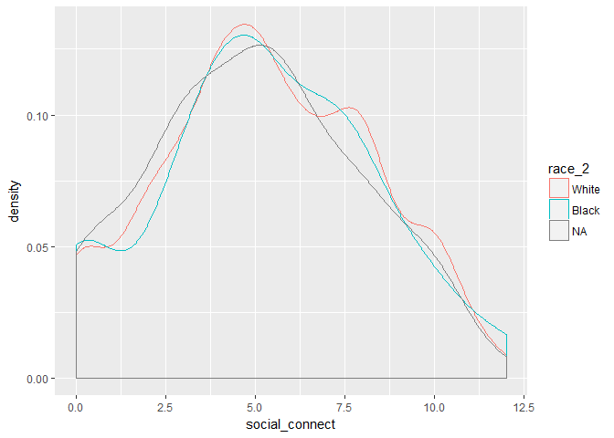

``` r
# Racial Difference in confidence in government
ggplot(gss, aes(con_govt)) + 
  geom_histogram(binwidth = 0.5) + 
  facet_wrap(~race)
```

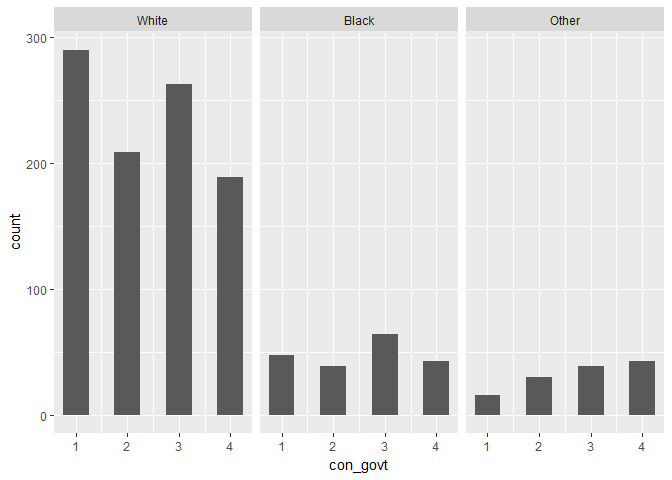

``` r
ggplot(gss, aes(con_govt, color = race_2)) + 
  geom_density() 
```

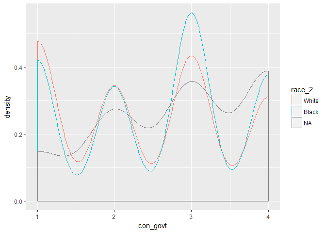

``` r
gss %>% 
  ggplot(aes(con_govt, social_trust, color=race_2))+
  geom_jitter(alpha=.8) +
  scale_color_brewer(palette = "Paired")+
  facet_wrap(~rincom06_5)+
  labs(color = "Race")
```

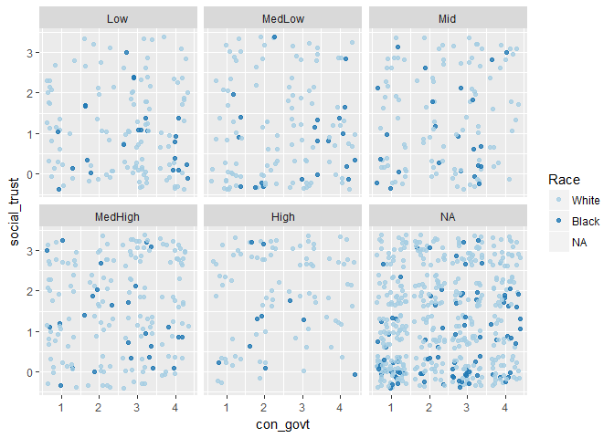

``` r
ggplot(gss, aes(con_govt, fill=race)) + 
  geom_bar(position="fill")
```

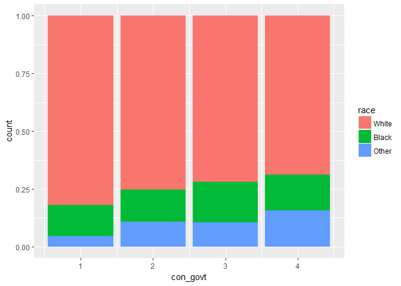

``` r
gss %>% 
  ggplot(aes(con_govt, social_trust, color=race))+
  geom_jitter(alpha=.8) +
  scale_color_brewer(palette = "Accent")+
  facet_wrap(~rincom06_5)+
  labs(color = "Race")
```

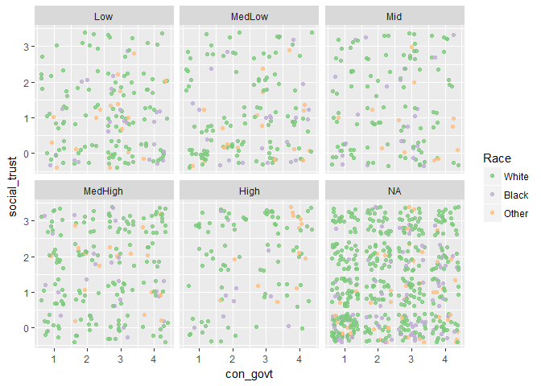

``` r
# Racial Differience in Educational variables
ggplot(gss, aes(race, degree)) + geom_jitter()
```

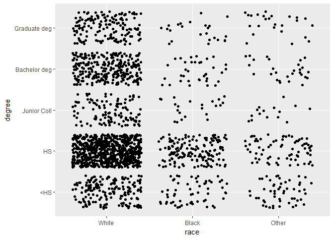

``` r
ggplot(gss, aes(science_quiz)) + 
  geom_histogram(binwidth = 1) + 
  facet_wrap(~race)
```

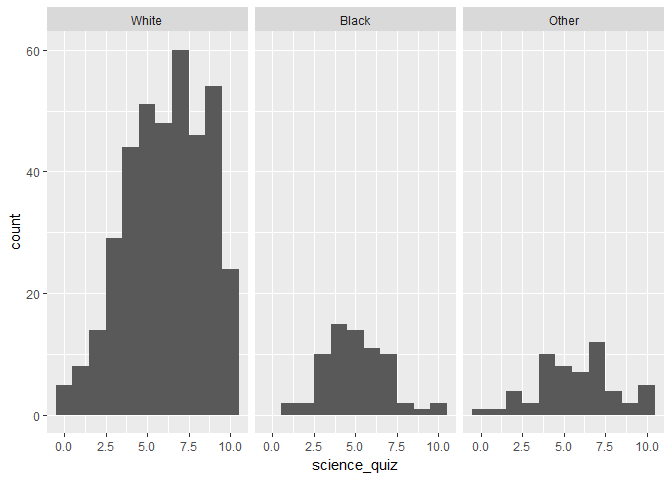

``` r
ggplot(gss, aes(wordsum)) + 
  geom_histogram(binwidth = 1) + 
  facet_wrap(~race)
```

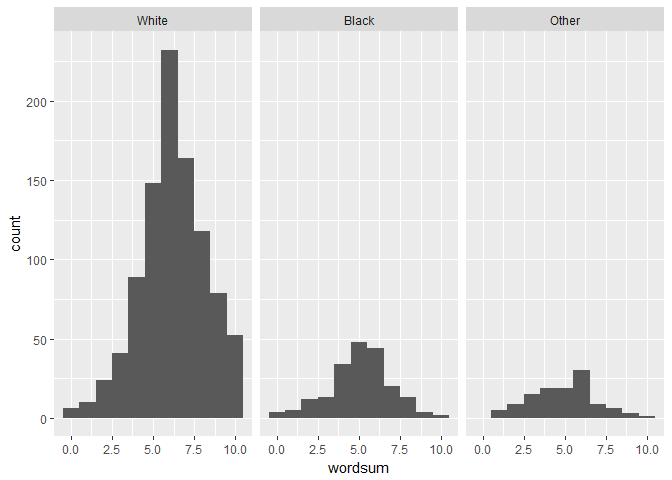

``` r
gss %>% 
  ggplot(aes(science_quiz, wordsum, color=race))+
  geom_jitter(alpha=.8) +
  scale_color_brewer(palette = "Dark2")+
  facet_wrap(~rincom06_5)+
  labs(color = "Race")
```

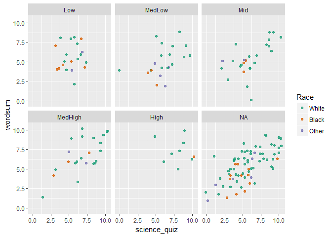

``` r
gss %>%
  count(happy, rincom06) %>%
  na.omit() %>%
  mutate(rincome= factor(rincom06)) %>%
  ggplot(aes(rincome, n, fill = happy)) + 
  geom_bar(stat ='identity')
```

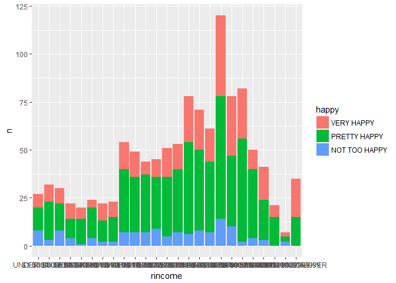
