Unsupervised Learning
================
Xi Chen
December 1, 2017

Colleges
========

``` r
setwd("C:/Users/Xi Chen/Desktop/Perspective - Analysis/My persp-analysis/Assignment/Assignment 8")
college = read.csv("College.csv", header = TRUE)
```

### Q1. Perform PCA analysis on the college dataset and plot the first two principal components. Describe the results.

``` r
# Drop the non-numericial variable: Private
pc = prcomp(college[,-1], scale=TRUE)
head(pc$x[,1:2])
```

    ##             PC1         PC2
    ## [1,] -1.5918301 -0.76683957
    ## [2,] -2.1909905  0.57845739
    ## [3,] -1.4300426  1.09211544
    ## [4,]  2.8537193  2.62891904
    ## [5,] -2.2105837 -0.02161689
    ## [6,] -0.5712973  1.49536146

``` r
biplot(pc, scale=0, cex = .6, 
       xlab="First Principal Component",
       xlabs=rep(".",nrow(college)),
       ylab="Second Principal Component", 
       xlim=c(-5,10),
       ylim=c(-10,5),
       expand = 1.3,
       main="First Two Principal Components")

library(FactoMineR)
```

    ## Warning: package 'FactoMineR' was built under R version 3.3.3

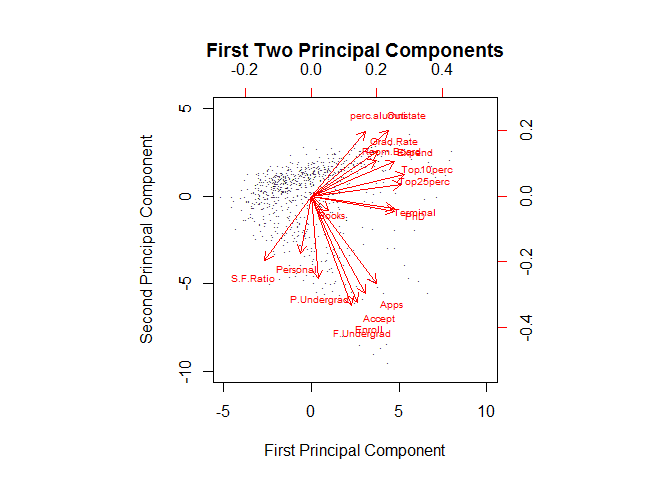

``` r
result = PCA(college[,-1])
```

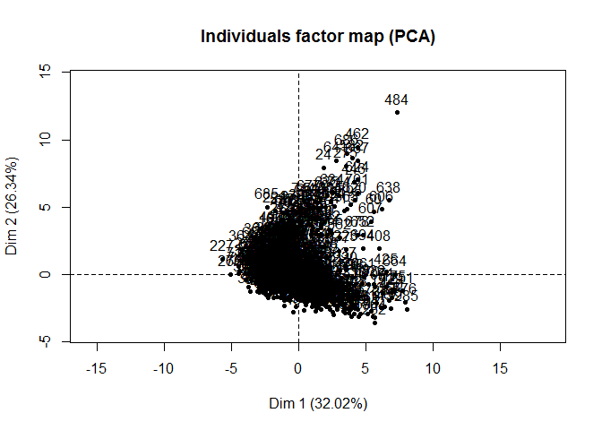

``` r
sort(pc$rotation[,1], decreasing=TRUE)
```

    ##   Top10perc   Top25perc      Expend         PhD    Terminal    Outstate 
    ##  0.35427395  0.34400128  0.31890875  0.31831287  0.31705602  0.29473642 
    ##   Grad.Rate  Room.Board        Apps      Accept perc.alumni      Enroll 
    ##  0.25231565  0.24903045  0.24876560  0.20760150  0.20508237  0.17630359 
    ## F.Undergrad       Books P.Undergrad    Personal   S.F.Ratio 
    ##  0.15464096  0.06475752  0.02644250 -0.04252854 -0.17695789

``` r
sort(pc$rotation[,2], decreasing=FALSE)
```

    ## F.Undergrad      Enroll      Accept        Apps P.Undergrad   S.F.Ratio 
    ## -0.41767377 -0.40372425 -0.37211675 -0.33159823 -0.31508783 -0.24666528 
    ##    Personal         PhD       Books    Terminal   Top25perc   Top10perc 
    ## -0.21992922 -0.05831132 -0.05634184 -0.04642945  0.04477866  0.08241182 
    ##      Expend  Room.Board   Grad.Rate perc.alumni    Outstate 
    ##  0.13168986  0.13780888  0.16924053  0.24659527  0.24964352

Comments:

The variables that appear strongly correlated with the first component: Top10perc, Top25perc, Expend, PhD, Terminal.

The variables that appear strongly correlated with the second component: F.Undergrad, Enroll, Accept, Apps, P.Undergrad.

### Q2. Calculate the cumulative proportion of variance explained by all the principal components (see 10.2.3 in ISLR). Approximately how much of the variance in College is explained by the first two principal components?

``` r
result$eig
```

    ##         eigenvalue percentage of variance
    ## comp 1  5.44350679             32.0206282
    ## comp 2  4.47783645             26.3402144
    ## comp 3  1.17315581              6.9009166
    ## comp 4  1.00690817              5.9229892
    ## comp 5  0.93302887              5.4884051
    ## comp 6  0.84739916              4.9847010
    ## comp 7  0.60500815              3.5588715
    ## comp 8  0.58711563              3.4536213
    ## comp 9  0.52992973              3.1172337
    ## comp 10 0.40378256              2.3751915
    ## comp 11 0.31304247              1.8414263
    ## comp 12 0.22032704              1.2960414
    ## comp 13 0.16757820              0.9857541
    ## comp 14 0.14379320              0.8458423
    ## comp 15 0.08791135              0.5171256
    ## comp 16 0.03667818              0.2157540
    ## comp 17 0.02299823              0.1352837
    ##         cumulative percentage of variance
    ## comp 1                           32.02063
    ## comp 2                           58.36084
    ## comp 3                           65.26176
    ## comp 4                           71.18475
    ## comp 5                           76.67315
    ## comp 6                           81.65785
    ## comp 7                           85.21673
    ## comp 8                           88.67035
    ## comp 9                           91.78758
    ## comp 10                          94.16277
    ## comp 11                          96.00420
    ## comp 12                          97.30024
    ## comp 13                          98.28599
    ## comp 14                          99.13184
    ## comp 15                          99.64896
    ## comp 16                          99.86472
    ## comp 17                         100.00000

``` r
plot(summary(pc)$importance[3,], type="o", col ="brown3",  
     ylab ="Cumulative PVE", xlab="Principal Component",
     main="Cumulative Proportion of Variance Explained")
```

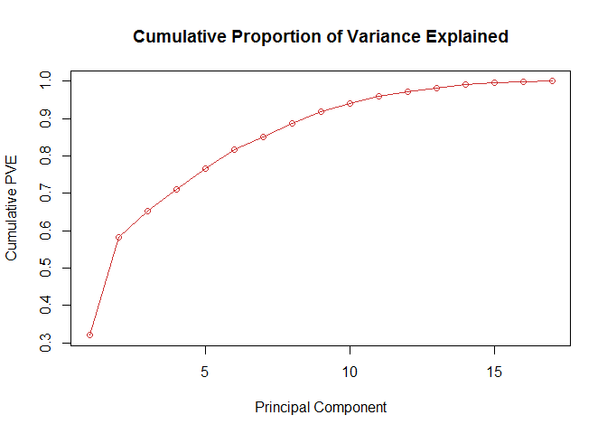

Comments:

Approximately 58.36% of the variance in College is explained by the first two principal components.

Clustering States
=================

``` r
library(ISLR)
```

    ## Warning: package 'ISLR' was built under R version 3.3.3

``` r
data("USArrests")
```

### Q1. Perform PCA on the dataset and plot the observations on the first and second principal components.

``` r
pc = prcomp(USArrests, scale=TRUE)
summary(pc)
```

    ## Importance of components:
    ##                           PC1    PC2     PC3     PC4
    ## Standard deviation     1.5749 0.9949 0.59713 0.41645
    ## Proportion of Variance 0.6201 0.2474 0.08914 0.04336
    ## Cumulative Proportion  0.6201 0.8675 0.95664 1.00000

``` r
head(pc$x)
```

    ##                   PC1        PC2         PC3          PC4
    ## Alabama    -0.9756604  1.1220012 -0.43980366  0.154696581
    ## Alaska     -1.9305379  1.0624269  2.01950027 -0.434175454
    ## Arizona    -1.7454429 -0.7384595  0.05423025 -0.826264240
    ## Arkansas    0.1399989  1.1085423  0.11342217 -0.180973554
    ## California -2.4986128 -1.5274267  0.59254100 -0.338559240
    ## Colorado   -1.4993407 -0.9776297  1.08400162  0.001450164

``` r
pc$rotation
```

    ##                 PC1        PC2        PC3         PC4
    ## Murder   -0.5358995  0.4181809 -0.3412327  0.64922780
    ## Assault  -0.5831836  0.1879856 -0.2681484 -0.74340748
    ## UrbanPop -0.2781909 -0.8728062 -0.3780158  0.13387773
    ## Rape     -0.5434321 -0.1673186  0.8177779  0.08902432

``` r
biplot(pc, scale=0, cex = .6, 
       xlab="First Principal Component",
       ylab="Second Principal Component",
       xlim=c(-4, 4), 
       ylim=c(-3, 3), 
       expand = 2,
       main="First Two Principal Components")
```

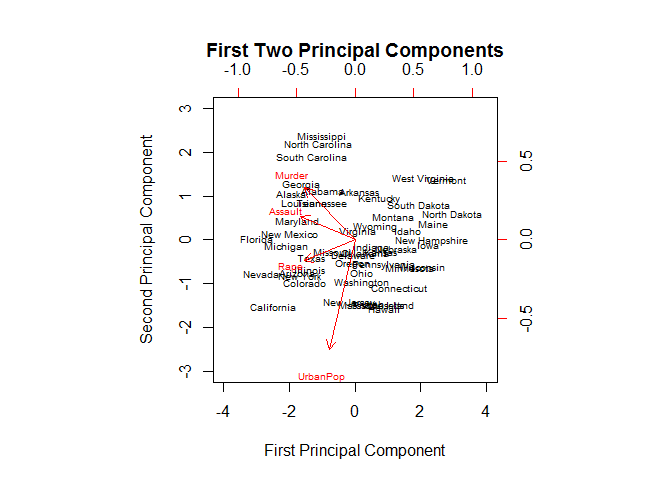

``` r
result = PCA(USArrests)
```

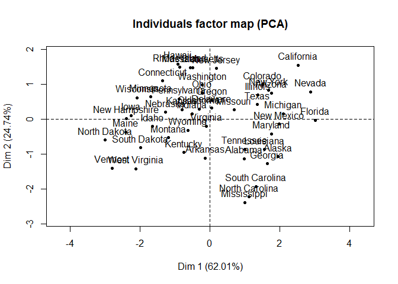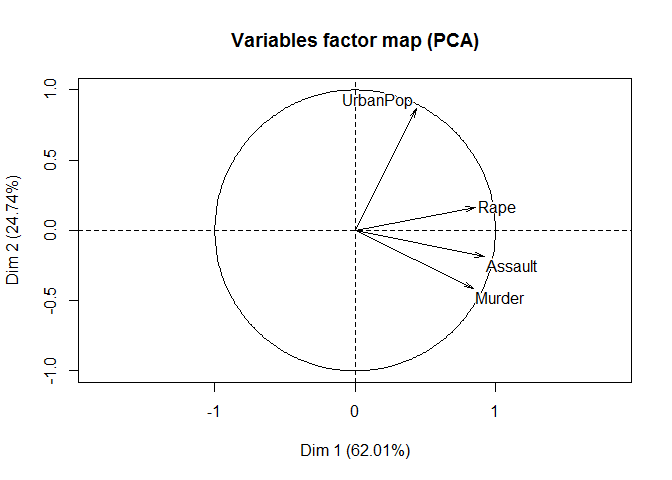

``` r
library(ggplot2)
```

    ## Warning: package 'ggplot2' was built under R version 3.3.2

``` r
d = as.data.frame(pc$x[,1:2])
ggplot(d, aes(d$PC1, d$PC2)) + 
  geom_text(aes(label=rownames(d)), size=3) +
  xlab("First Principal Component") + 
  ylab("Second Principal Component") + 
  ggtitle("Plot the Observations on the First Two Principal Components")
```

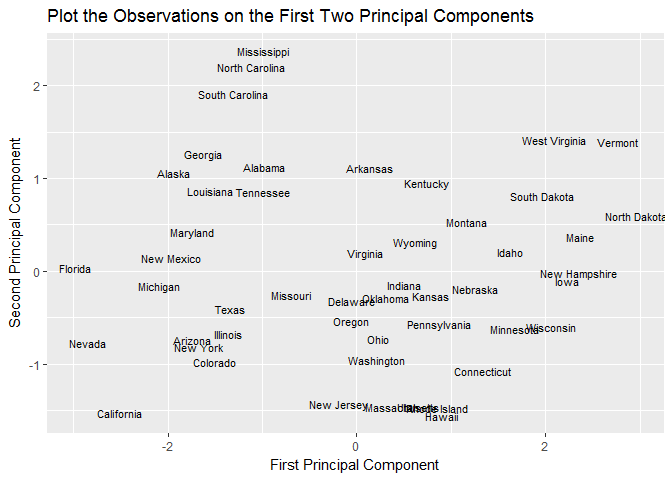

### Q2. Perform K-means clustering with K = 2. Plot the observations on the first and second principal components and color-code each state based on their cluster membership. Describe your results.

``` r
k2 = kmeans(USArrests, 2, nstart = 20)

d = as.data.frame(pc$x[,1:2])
d$cluster = as.factor(k2$cluster)
ggplot(d, aes(d$PC1, d$PC2,color=cluster)) +
  geom_text(aes(label=rownames(d)), size=3) +
  xlab("First Principal Component") + 
  ylab("Second Principal Component") + 
  ggtitle("K-Means Clustering Results with K = 2")
```

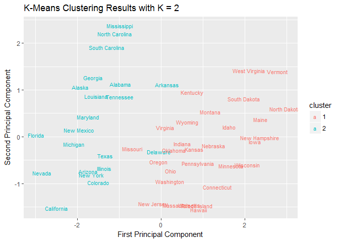

Comments:

The K-means clustering (K=2) sperates the states into two clusters by around score 0 along the dimension of the first principal component. It seems that perhaps the states are roughly split into northern and sourthern groups.

### Q3. Perform K-means clustering with K = 4. Plot the observations on the first and second principal components and color-code each state based on their cluster membership. Describe your results.

``` r
k4 = kmeans(USArrests, 4, nstart = 20)

d = as.data.frame(pc$x[,1:2])
d$cluster = as.factor(k4$cluster)
ggplot(d, aes(d$PC1, d$PC2, color=cluster)) +
  geom_text(aes(label=rownames(d)), size=3) +
  xlab("First Principal Component") + 
  ylab("Second Principal Component") + 
  ggtitle("K-Means Clustering Results with K = 4")
```


Comments:

At the K-means clustering (K=4), the first principal component still greatly influences the clustering results. Socre -1 roughly splits the states into cluster 1 and 4; score 0.5 roughly splits the states into cluster 1 and 2; score 1.5 roughly splits the states into cluster 2 and 3. There are several overlaps between the clusters.

### Q4. Perform K-means clustering with K = 3. Plot the observations on the first and second principal components and color-code each state based on their cluster membership. Describe your results.

``` r
k3 = kmeans(USArrests, 3, nstart = 20)

d = as.data.frame(pc$x[,1:2])
d$cluster = as.factor(k3$cluster)
ggplot(d, aes(d$PC1, d$PC2, color=cluster)) +
  geom_text(aes(label=rownames(d)),size=3) +
  xlab("First Principal Component") + 
  ylab("Second Principal Component") + 
  ggtitle("K-Means Clustering Results with K = 3 (Raw Data)")
```

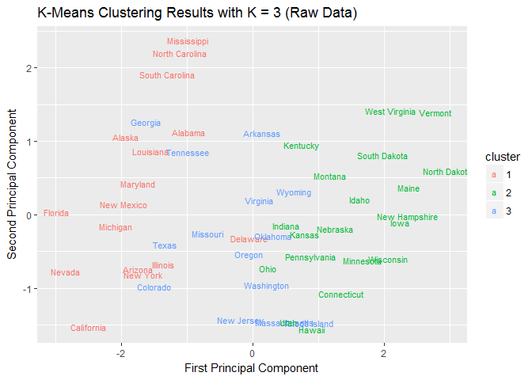

Comments:

The K-means clustering with K=3 has intermediate results between K=2 and K=4. The first principal component still have main effects on the clustering boundaries. There are some overlaps between the clustering boundaries.

### Q5. Perform K-means clustering with K=3 on the first two principal components score vectors, rather than the raw data. Describe your results and compare them to the clustering results with K=3 based on the raw data.

``` r
k3 = kmeans(pc$x[,1:2], 3, nstart = 20)

d = as.data.frame(pc$x[,1:2])
d$cluster = as.factor(k3$cluster)
ggplot(d, aes(d$PC1, d$PC2, color=cluster)) +
  geom_text(aes(label=rownames(d)), size=3) +
  xlab("First Principal Component") + 
  ylab("Second Principal Component") + 
  ggtitle("K-Means Clustering Results with K = 3 (Score Vectors)")
```

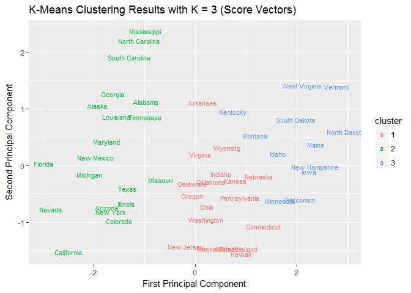

Comments:

Compared to the previous plot based on the raw data, most of the clustering results in this plot are the same, but a few states are changed to different clusters, such as Georgia, Tennessee, Texas, Colorado, and Hawaii. In addition, the clustering boundaries here have less overlaps. Therefore, it seems that clustering on the first two principal components score vectors may increase the accuracy of classification.

### Q6. Using hierarchical clustering with complete linkage and Euclidean distance, cluster the states.

``` r
hc.complete=hclust(dist(USArrests),method="complete")
plot(hc.complete,main="Hierarchical Clustering with Complete Linkage", 
     xlab="", sub="", cex=.9)
```

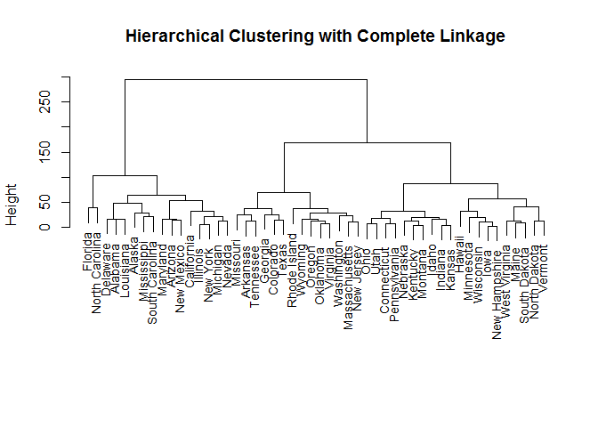

### Q7. Cut the dendrogram at a height that results in three distinct clusters. Which states belong to which clusters?

``` r
plot(hc.complete,main="Hierarchical Clustering with Complete Linkage", 
     xlab="", sub="", cex=.9)
abline(h=150,col="red")
```

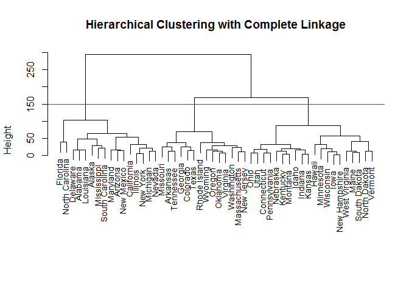

``` r
cutree(hc.complete,3)
```

    ##        Alabama         Alaska        Arizona       Arkansas     California 
    ##              1              1              1              2              1 
    ##       Colorado    Connecticut       Delaware        Florida        Georgia 
    ##              2              3              1              1              2 
    ##         Hawaii          Idaho       Illinois        Indiana           Iowa 
    ##              3              3              1              3              3 
    ##         Kansas       Kentucky      Louisiana          Maine       Maryland 
    ##              3              3              1              3              1 
    ##  Massachusetts       Michigan      Minnesota    Mississippi       Missouri 
    ##              2              1              3              1              2 
    ##        Montana       Nebraska         Nevada  New Hampshire     New Jersey 
    ##              3              3              1              3              2 
    ##     New Mexico       New York North Carolina   North Dakota           Ohio 
    ##              1              1              1              3              3 
    ##       Oklahoma         Oregon   Pennsylvania   Rhode Island South Carolina 
    ##              2              2              3              2              1 
    ##   South Dakota      Tennessee          Texas           Utah        Vermont 
    ##              3              2              2              3              3 
    ##       Virginia     Washington  West Virginia      Wisconsin        Wyoming 
    ##              2              2              3              3              2

``` r
table(cutree(hc.complete,3))
```

    ## 
    ##  1  2  3 
    ## 16 14 20

Comments:

Cluster 1: Alaska, Alabama, Arizona, California, Delaware, Florida, Illionis, Louisiana, Michigan, Mississippi, Maryland, Nevada, New Mexico, New York, North Carolina, South Carolina.

Cluster 2: Arkansas, Colorado, Georgia, Massachusetts, Missuouri, New Jersey, Oklahoma, Oregon, Rhode Island, Tennessee, Texas, Virgini, washington, Wyoming.

Cluster 3: Conecticut, Hawali, Idaho, Indiana, Lowa, Kansas, Kentucky, Maine, Minnesota, Montana, Nebraska, New Hampshire, North Dakota, Ohio, Pennsylavania, South Dakota, Utah, Vermont, West Virginia, Wisconsin.

### Q8. Hierarchically cluster the states using complete linkage and Euclidean distance, after scaling the variables to have standard deviation 1. What effect does scaling the variables have on the hierarchical clustering obtained?

``` r
USArrests_Scaled=scale(USArrests)

hc.complete_scaled=hclust(dist(USArrests_Scaled),method="complete")

plot(hc.complete_scaled, xlab="",sub="",cex=.9, 
     main="Hierarchical Clustering with Scaled Features")
```

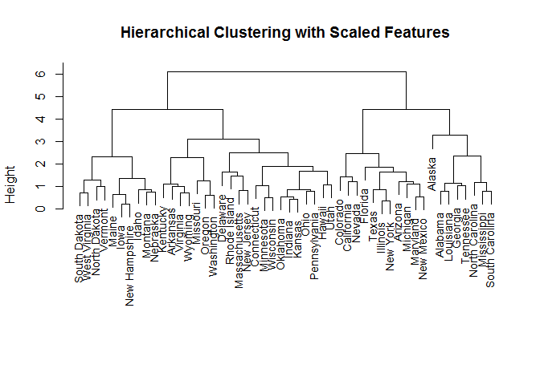

``` r
cutree(hc.complete_scaled,3)
```

    ##        Alabama         Alaska        Arizona       Arkansas     California 
    ##              1              1              2              3              2 
    ##       Colorado    Connecticut       Delaware        Florida        Georgia 
    ##              2              3              3              2              1 
    ##         Hawaii          Idaho       Illinois        Indiana           Iowa 
    ##              3              3              2              3              3 
    ##         Kansas       Kentucky      Louisiana          Maine       Maryland 
    ##              3              3              1              3              2 
    ##  Massachusetts       Michigan      Minnesota    Mississippi       Missouri 
    ##              3              2              3              1              3 
    ##        Montana       Nebraska         Nevada  New Hampshire     New Jersey 
    ##              3              3              2              3              3 
    ##     New Mexico       New York North Carolina   North Dakota           Ohio 
    ##              2              2              1              3              3 
    ##       Oklahoma         Oregon   Pennsylvania   Rhode Island South Carolina 
    ##              3              3              3              3              1 
    ##   South Dakota      Tennessee          Texas           Utah        Vermont 
    ##              3              1              2              3              3 
    ##       Virginia     Washington  West Virginia      Wisconsin        Wyoming 
    ##              3              3              3              3              3

``` r
table(cutree(hc.complete_scaled,3))
```

    ## 
    ##  1  2  3 
    ##  8 11 31

Comments:

Cluster 1: Alabama, Alaska, Georgia, Louisiana, Mississippi, North Carolina, South Carolina, Tennessee.

Cluster 2: Arizona, Colorado,C alifornia, Florida, Illinois, Maryland, Michigan, Montana, Nevada, New Mexico, New York, Texas.

Cluster 3: Arkansas, Connecticut, Delaware, Hawaii, Idaho, Indiana, Iowa, Kansas, Kentucky, Maine, Massachusetts, Minnesota, Missouri, Montana, Nebraska, New Hampshire, New Jersey, Ohio, Oklahoma, Oregon, Pennsylvania, Rhode Island, South Dakota, Utah, Vermont, Virginia, Washington, West Virginia Wisconsin, Wyoming.

We see that the three clusters obtained using original variables and scaled variables are somewhat different. Note that the variables "Murder", "Assault" and "Rape" are the number of corresponding arrests per 100,000 while the variable "UrbanPop" is the percentage of urban population. Therefore, the variables should be scaled beforehand because the original measures have different units.
