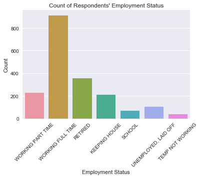
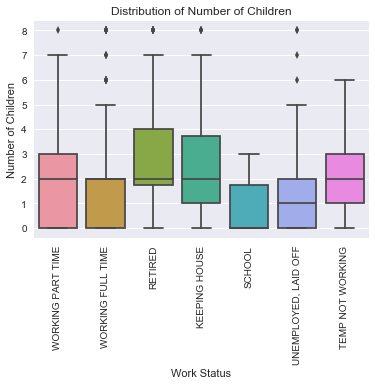
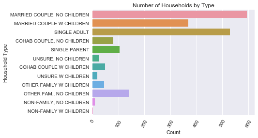
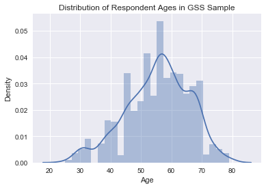
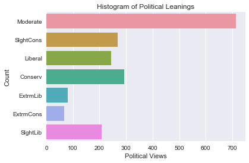

```python
import pandas as pd
import numpy as np
import matplotlib.pyplot as plt
from matplotlib.pyplot import *
import seaborn as sns
df = pd.read_csv('https://raw.githubusercontent.com/UC-MACSS/persp-analysis/master/assignments/exploratory-data-analysis/data/gss2012.csv')
```

### Homework #7
### Tom Curran
### Perspectives on Computational Analysis
### November 27, 2017

In a short paper (around 750 words), summarize your insights and what you've learned about the data. This could include one or two important research questions you think you could answer using the data, as well as some initial hypotheses supported by your exploratory analysis. Or perhaps you've identified unusual variation in a single variable, or extreme outliers or systematic missingness in the data that should be accounted for in future analysis. This component will look different for each student. That's fine. What I want to see is genuine effort and some thought put into what you've learned from this EDA.

- This component should include mostly written analysis and a handful of graphs to support your questions and answers
- Clean up these graphs so they are publication-ready. This means give each graph a meaningful title, axes labels, legends, etc.


#### Summary of Data Exploration:

To explore the GSS data set, I first sought to get an overall view of the available variables and summary statistics of those variables. Using python's `.describe()` method on the GSS dataframe I was able to get a breif overview of the variables. However, since many of the variables are infact categorical (i.e. discrete variables) the summary view of the data frame did not provide any valuable insight. As such, I chose to select several variables of interest ( of the nearly 230 available) and explored the relationships within those domains. The exploration yielded several potential research questions and some interesting red flags about sample of GSS respondents.

#### I) Possible Research Questions:

i) *Family Structure and Work Status:* What is the relationship between family structure and working status? In other words, does the household type or number of children of a respondent have any impact individual's working status?

ii) *Political Leanings and Social Structures:* Does a respondent's education, family and marital status influence their political party affiliation or their political views? In other words, does the fact that a person have a family push the respondent left or right?

#### II) Responses to Research Questions

*i) Family Structure and Work Status*

One of the most interesting things that I found in exploring the work status of respondents was the high number of people working full time. I was surpised because there is an ongoing notion of salary and wage stagnation. Also, different mediums has made it seem as though more people are working multiple jobs. Even from my own experience, it was not uncommon for an individual to have one or two extra jobs. 

The exploration of the data showed that of those working full tyime, a majority of respondents were married, while the sum of respondents that were working full time identifying as 'Separated' or 'Divorced' nearly equaled the total number of 'Married' respondents. Also, interestingly the number of respondents that were 'RETIRED' had a high number of respondents that were 'Separated' or Divorced'. 


```python
%matplotlib inline
x = sns.countplot(x = "wrkstat",
             data = df)

plt.xticks(rotation = 45)
x.set_xlabel("Employment Status")
x.set_ylabel("Count")
x.set_title("Count of Respondents' Employment Status")
```


    <matplotlib.text.Text at 0x11366dd30>





Next, I looked at the distribution of number of children by working status. This graph was also suprising because it showed that part-time workers had a larger inter-quartile range than working full time, and even more suprising was the fact that the retired respondents had a very large inter-quartile range. I also looked at the number of household types. As you can see from the figures below the most prominent household type is 'MARRIED COUPLE, NO CHILDREN'.


```python
num_child = sns.boxplot(x = "wrkstat",
           y = 'childs',
           data = df)

plt.xticks(rotation = 90)

num_child.set_ylabel("Number of Children")
num_child.set_xlabel("Work Status")
num_child.set_title("Distribution of Number of Children")
```


    <matplotlib.text.Text at 0x113a4cb70>





```python
hhtypeplt = sns.countplot(y = "hhtype1", data = df)
plt.xticks(rotation =60)
hhtypeplt.set_xlabel("Count")
hhtypeplt.set_ylabel("Household Type")

hhtypeplt.set_title("Number of Households by Type")
```


    <matplotlib.text.Text at 0x1139265f8>





```python
age = sns.distplot(df.intage)
age.set_xlabel("Age")
age.set_ylabel("Density")
age.set_title("Distribution of Respondent Ages in GSS Sample")

```


    <matplotlib.text.Text at 0x113fa1b38>





These graphs depict an interesting story that could answer the question of the relationship between working status and household type. My hypothesis is that for respondents are more likely to identify with the household 'MARRIED COUPLE W CHILDREN' if they are working part time jobs. In other words, people with children are more likely to work part time jobs than full time jobs. Conversely, I think that if you identify as "Single Adult" or "Married Couple, No Children" you will have a full time job. This hypothesis comes from the notion that full time jobs require experience and education, which takes time, where as many part time jobs do not require college degrees or higher. This research question could be explored further by cross referencing the salary range information, industry of the job and more provided by the GSS. However, there does seem to be a heavily weighted prefrence for middle aged people. This bias within the sample could result in an inaccurate depiction of the effects of house hold structure and children on working status.

ii) *Political Leanings and Social Structures:*

The General Social Survey is able to capture many of the attitudes that the respondents use to identify with certain groups. Chief amongst those groups are the political parties respondent's feel they belong to. This research question was derived from looking at the education, racial demographics, political party affiliation and politial ideals that was captured in the survey. 


```python
polviews_plt = sns.countplot(y = "polviews", data = df)
polviews_plt.set_xlabel("Political Views")
polviews_plt.set_ylabel("Count")
polviews_plt.set_title("Histogram of Political Leanings")
```


    <matplotlib.text.Text at 0x114361d68>





As you can see from the above graph, a majority of people identify as being Moderate in their political views, and the Conservative category eeking out a slightly larger count that Slightly conservatiove, liberal and slightly liberal. When measuring the number of kids each respondent has, there doesn't seem to be a difference between those identifying as a moderate or if you have 2 kids identifying as a moderate. However, there are more people with 2 kids that identify with conservative political views than people with zero kids and conservative political views. These graphs indiciate if there is an over arching movement towards conservativism or conservative political leanings because of having kids, it is only slight. 

My hypothesis for the lack of movement because of children is because the children are an instrument of salary and not of policy. In other words, kids cost money and people who provide for their children want to do so through money and not through policy pushed through by political ideology. Therefore, I believe that if you compared across groups with kids and their respective salaries, you would see a shift from liberal to conservative within groups because the conservatives will aim to save money to use on their kids, which makes conservative policy attractive, versus those with no kids but the same salary. This could be proven because of the various attitude measurements of things like national education, enviornment and health care attitudes can indicate a more conservative or liberal stances. 
