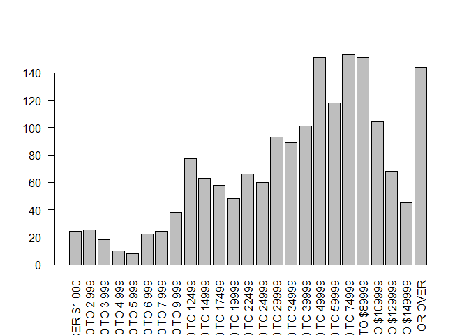
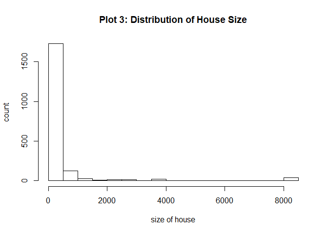

R Notebook
================

This is an [R Markdown](http://rmarkdown.rstudio.com) Notebook. When you execute code within the notebook, the results appear beneath the code.

Try executing this chunk by clicking the *Run* button within the chunk or by placing your cursor inside it and pressing *Ctrl+Shift+Enter*.

Add a new chunk by clicking the *Insert Chunk* button on the toolbar or by pressing *Ctrl+Alt+I*.

When you save the notebook, an HTML file containing the code and output will be saved alongside it (click the *Preview* button or press *Ctrl+Shift+K* to preview the HTML file).

Part 1: EDA on Distributions (Single Variable)
----------------------------------------------

``` r
for (i in ordinal) {
  barplot(table(gss[i]))
}
```

 Results:

1.  For education level/degree, the data seems to have a bimodal distribution, with the highest mode at 12th grade and the second highest mode at 4yrs of college education. This is in accordance with the distribution of "highest degree obtained". We can further test if the bimodal distribution is caused by stacked distributions of different groups (such as sex or race).

2.  The distribution of income level seems to have a mode at around $70,000 to $90,000. However, there is a possibility that the distribution is actually bimodal, becuase the number of respondents with income level "$50,000 to $59,999" is significantly lower than the number of respondents that fall into its neighbor bins.

3.  For political views, most people identified themselves as moderate, and least people identified themselves as extremely libral/conservative.

4.  Most respodents reported feeling "pretty happy". Relatively few people reported themselves as "not too happy".

``` r
for (i in nominal) {
  barplot(table(gss[i]), ylab = "Count", las=2)
}
```


Results:

1.  A significant proportion of the respondents fall into the category of full-time workers.

2.  Among the working respondents, there are significantly more people who work for private companies than those who work for the government.

3.  The male:female ratio of respondents in the sample is not 50:50. Instead, there are considerably more female respondents in the sample than male respondents. (Why is it the case? Is it caused by the sampling method? Or do males have a lower respondence rate as compared to females?)

4.  The sample is dominated by white respondents.

``` r
for (i in discrete) {
  hist(gss[[i]], main = colnames(gss)[i],
       xlab = colnames(gss)[i])
}
```


``` r
ggplot(data = gss) +
  geom_bar(
    mapping = aes(x = income06,fill = race),
    position = "fill"
  ) + theme(axis.text.x = element_text(angle = 90, hjust = 1))
```


``` r
ggplot(data = gss) +
  geom_bar(
    mapping = aes(x = income06,fill = sex),
    position = "fill"
  ) + theme(axis.text.x = element_text(angle = 90, hjust = 1))
```


``` r
ggplot(data = na.omit(gss[,c(11,18)])) +
  geom_bar(
    mapping = aes(x = income06,fill = degree),
    position = "fill"
  ) + theme(axis.text.x = element_text(angle = 90, hjust = 1))
```


``` r
ggplot(data = na.omit(gss[,c(18,76)])) +
  geom_bar(
    mapping = aes(x = income06,fill = happy),
    position = "fill"
  ) + theme(axis.text.x = element_text(angle = 90, hjust = 1))
```


``` r
ggplot(data = na.omit(gss[,c(14,18)])) +
  geom_bar(
    mapping = aes(x = income06,fill = polviews),
    position = "fill"
  ) + theme(axis.text.x = element_text(angle = 90, hjust = 1))
```


``` r
ggplot(data = gss) +
  geom_bar(
    mapping = aes(x = degree,fill = sex),
    position = "fill"
  ) + theme(axis.text.x = element_text(angle = 90, hjust = 1))
```


``` r
ggplot(data = gss) +
  geom_bar(
    mapping = aes(x = degree,fill = race),
    position = "fill"
  ) + theme(axis.text.x = element_text(angle = 90, hjust = 1))
```

 (1) From the stacked bar plot, we can observe that the high income groups are dominanted by white people. Overall, the proportion of white people increases and that of the black people decreases steadily as the income level increases.

1.  No obvious trend from the chart. The gender ratio remains relatively constant cross all income levels.

2.  From the bar plot, we can observe that the proportion of people with a bachelor or graduate degree increases dramatically, white the that of people with a degree lower than High School decreases dramatically. Overall, we can observe that there is a positive association between the income level and the highest level of education obtained.

3.  The bar plot suggests a positive association between happiness and income level. Generally, people with higher income tend to feel happier.

4.  No obvious pattern observable from the plot.

5.  No obvious trend. The gender ratio remains relatively constant across all levels of educational degrees.

6.  From the bar plot, we can observe that the proportion of White people increases slightly and the that of black people decreases slightly as the degree level goes higher. However, the change across different levels of education is relatively small.

``` r
plot(jitter(gss$childs) ~ jitter(gss$sibs))
abline(lm(gss$childs~ gss$sibs), col="red")
```

-1.png) No obvious pattern observable from the jittered scatter plot. However, the fitted linear regression line suggests that there might be a positive association between number of siblings and number of children.

``` r
#Boxplot (Eqlwlth ~ Polviews)
boxplot(eqwlth ~ polviews, data = gss)
```

-1.png)

``` r
# According to the boxplot, we can observe that conservativists tend to support equal wealth
# while liberalists oppose equal wealth.

#Mosaic plot (Natspac)
plot(natspac ~ degree, data = gss) #trend
```

-2.png)

``` r
plot(natspac ~ polviews, data = gss)
```

-3.png)

``` r
#People with higher levels of degrees tend to agree that the national spend on space exploration should
#be increased, whereas peopel with lower degree levels tend to think that the spending is too much.

#Mosaic plot (Natenvir)
plot(natenvir ~ degree, data = gss)
```

-4.png)

``` r
plot(natenvir ~ polviews, data = gss) #trend
```

-5.png)

``` r
#NATHEAL
plot(natheal ~ degree, data = gss)
```

-6.png)

``` r
plot(natheal ~ polviews, data = gss) #trend
```

-7.png)

``` r
#natcity
plot(natcity ~ degree, data = gss)
```

-8.png)

``` r
plot(natcity ~ polviews, data = gss) #trend
```

-9.png)

``` r
#natcrime
plot(natcrime ~ degree, data = gss) #trend?
```

-10.png)

``` r
plot(natcrime ~ polviews, data = gss)
```

-11.png)

``` r
#natdrug
plot(natdrug ~ degree, data = gss)
```

-12.png)

``` r
plot(natdrug ~ polviews, data = gss) #trend
```

-13.png)

``` r
#nateduc
plot(nateduc ~ degree, data = gss)
```

-14.png)

``` r
plot(nateduc ~ polviews, data = gss)#trend
```

-15.png)

``` r
ggplot(data = na.omit(gss[,c(30,10)])) +
  geom_bar(
    mapping = aes(x = educ, fill = nateduc),
    position = "fill"
  ) + theme(axis.text.x = element_text(angle = 90, hjust = 1))
```

-16.png)

``` r
#Generally, we can observe that people with higher education are more likely to think the
#national spending on education is too little.


#natrace
plot(natrace ~ degree, data = gss)
```

-17.png)

``` r
plot(natrace ~ polviews, data = gss) #trend
```

-18.png)

``` r
plot(natrace ~ race, data = gss) #specific case
```

-19.png)

``` r
#natarms
plot(natarms ~ degree, data = gss) #trend
```

-20.png)

``` r
plot(natarms ~ polviews, data = gss) #trend
```

-21.png)

``` r
#nataid
plot(nataid ~ degree, data = gss)
```

-22.png)

``` r
plot(nataid ~ polviews, data = gss) #trend
```

-23.png)

``` r
#
plot(natfare ~ degree, data = gss) #trend?
```

-24.png)

``` r
plot(natfare ~ polviews, data = gss) #trend
```

-25.png)

``` r
#natsoc
plot(natsci ~ degree, data = gss) #trend
```

-26.png)

``` r
plot(natsci ~ polviews, data = gss)
```

-27.png)

According to our analysis of distribution of selected discrete variables, most of the respondents are in the age range of 20 ~ 70 years old. The youngest correspondent in the sample was 18 years old, and the oldest was 89 years old. Most of the correspondents had childs, with 536 exclusions. Among all the parents in our sample, 569 of them had exactly 2 kids, followed by those who had 3 children (301 parents), and those who had 1 child (274 parents). According to Plot 3 (Distribution of Marital Status), most of the survey respondents were married. The category with second most number of respondents was "Never married", and the category with least correspondents was "Separated". According to Plot 4 (Distribution of Race), the sample was dominated by White people.

``` r
income_dist <- barplot(table(gss$income06), las = 2)
```



``` r
size_dist <- hist(gss$size, xlab = "size of house", ylab = "count",
                  main = "Plot 3: Distribution of House Size")
```



``` r
size_dist <- hist(log(gss$size))
```


According to the
