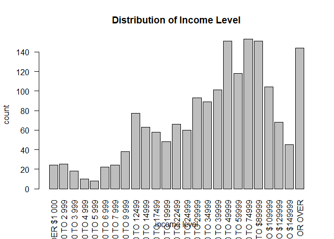
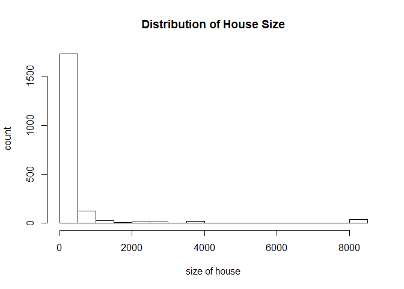
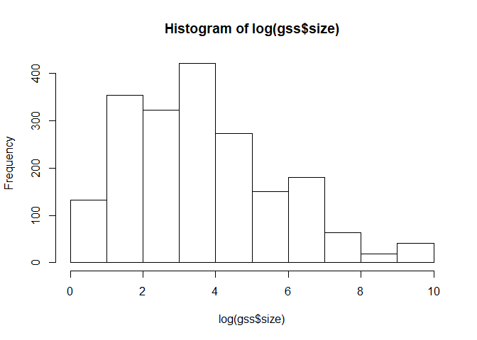
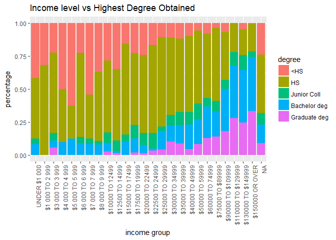
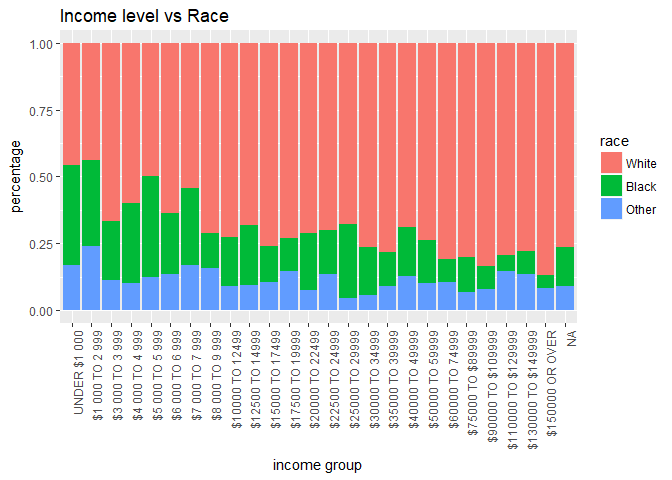
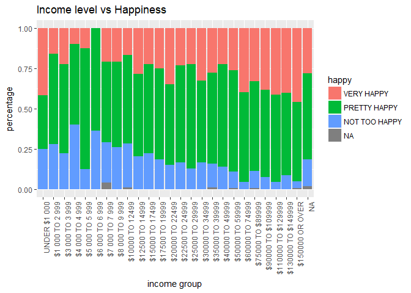

EDA Write-up
================
Ling Dai
11/26/2017

### Introduction

The EDA mainly focused on two aspects: (1) the variation within variables and (2) the association between different variables. By exploring the variation within variables, we want to identify some key demographic features of the respodents, and by exploring associations between variables, we hope to identify some trends within our sample that can possibly be extended to the whole population.

Because the data set has 1974 observations and 221 variables, it is almost impossible to analyze the distribution of each variable and the association between each of these variables. Therefore, at the beginning of the EDA, we selected a handful of key variables within in the survey to proceed with, and grouped them into three categories, namely discrete variables, ordinal variables, and nominal variables:

Ordinal variables: *educ, degree, polviews, income06, happy*
Nominal variables: *wrkstat, wrkgvt, marital, sex, race, relig, region*
Discrete variables: *sibs, childs, age, eqwlth, size*

### Key Demographics Features of Survey Repondents

``` r
age_dist <- hist(gss$age, xlab = "age (years old)", ylab = "count", labels = TRUE,
                 main = "Age Distribution")
```


``` r
childs_dist <- hist(gss$childs, xlab = "number of childs", ylab = "count", right = FALSE,
                    include.lowest = FALSE, breaks = seq(0,9,1), labels = TRUE,
                    main = "Distribution of Number of Childs")
```


``` r
marital_dist <- barplot(table(gss$marital), xlab = "marital status", ylab = "count",
                    main = "Distribution of Marital Status")
```


``` r
race_dist <- barplot(table(gss$race), xlab = "race", ylab = "count", las = 2,
                     main = "Distribution of Race")
```


According to our analysis of distribution of selected discrete variables, most of the respondents are in the age range of 20 ~ 70 years old. The youngest respondent in the sample was 18 years old, and the oldest was 89 years old. Most of the respondents had childs, with 536 exclusions. Among all the parents in our sample, 569 of them had exactly 2 kids, followed by those who had 3 children (301 parents), and those who had 1 child (274 parents). According to Plot 3 (Distribution of Marital Status), most of the survey respondents were married. The category with second most number of respondents was "Never married", and the category with least respondents was "Separated". According to Plot 4 (Distribution of Race), the sample was dominated by White people. Moreover, there are noticeably more female respondents in the sample than male respondents.

### Analysis on Income Level

``` r
income_dist <- barplot(table(gss$income06), las = 2, xlab = "income level", ylab = "count",
                       main = "Distribution of Income Level")
```



``` r
size_dist <- hist(gss$size, xlab = "size of house", ylab = "count",
                  main = "Distribution of House Size")
```



``` r
size_dist <- hist(log(gss$size))
```



``` r
ggplot(data = gss) +
  geom_bar(
    mapping = aes(x = income06,fill = degree),
    position = "fill"
  ) + theme(axis.text.x = element_text(angle = 90, hjust = 1)) +
  ggtitle("Income level vs Highest Degree Obtained") + labs(y = "percentage", x = "income group")
```



``` r
ggplot(data = gss) +
  geom_bar(
    mapping = aes(x = income06,fill = race),
    position = "fill"
  ) + theme(axis.text.x = element_text(angle = 90, hjust = 1)) +
  ggtitle("Income level vs Race") + labs(y = "percentage", x = "income group")
```



``` r
ggplot(data = gss) +
  geom_bar(
    mapping = aes(x = income06,fill = happy),
    position = "fill"
  ) + theme(axis.text.x = element_text(angle = 90, hjust = 1)) + 
  ggtitle("Income level vs Happiness") + labs(y = "percentage", x = "income group")
```



According to (Distribution of Income Level), the distribution of income has a mode at around $60000 to $74999. The shape is distribution is drastically different from the more common distribution of income curve, which has a single mode at the left end of the income spectrum, and a monotonically decreasing density as the income level increases. A possible explanation to this phenomenom is the way different income levels are grouped in the survey. The fact that each of these income levels has different widths of coverage (for example, the lowest group covers from $0 to $1000 and the highest group covers from $150000 to infinity) can cause the income distribution to have an altered shape.

A variable that is closely related to income level is housing size. Our hypothesis is that the housing size should be positively correlated to the income level. Using a histogram, we can observe that the distribution of housing size of the respondents is in fact similar to the common income distribution curve. However, because the frequency of the first bin is significantly higher than other bins, the distribution is very hard to analyze using the original histogram plot. Therefore, a histogram of its log distribution is included to further analyze the housing size distribution. From the log histogram, we can observe that the log distribution of housing size is approximately normal. This observed fact does not only imply that our hypothesis should be true, but also imply that our explanation for the distribution shape of income level may be correct.

Our analysis of income also suggested a positive correlation between highet educational degree obtained and income level. According to the stacked barplot, the proportion of graduate degree holders increases and that of high school (and lower) degree holders decreases rapidly as the income level increases. By comparing income level with race, we also observed that the proportion of white people increases and that of black people decreases slightly as the income level increases.

Not so surprisingly, we also found that happiness is positively associated with income level. According to the stacked bar plot, only a very small proportion of people in high income groups felt unhappy, while the proportion is significantly higher in low income groups.

### Analaysis on Views of Public Policies

``` r
plot(eqwlth ~ polviews, data = gss, las = 2,
     xlab = "political view", ylab = "support for equal wealth",
     main = "Support for Equal Wealth by Respondents with Different Political Views")
```


``` r
plot(natenvir ~ polviews, data = gss,
     xlab = "political view", ylab = "view on national spendings on environment",
     main = "View on national spendings on environment vs Political view")
```


``` r
plot(natcity ~ polviews, data = gss,
     xlab = "political view", ylab = "view on national effort to solve problems of cities",
     main = "View on national effort to solve problems of cities vs Political View")
```


``` r
plot(nateduc ~ polviews, data = gss,
     xlab = "political view", ylab = "view on national effort to improve education",
     main = "View on national effort to improve education vs Political View")
```


``` r
plot(nateduc ~ polviews, data = gss,
     xlab = "political view", ylab = "view on national effort to improve the condition of Black people",
     main = "View on improving the condition of Black people vs Political View")
```


Our analysis on respondents' views on public policies revealed that the opinions are often divided between conservativists and liberalists. First of all, the boxplot (Support for Equal Wealth by Respondents with Different Political Views) shows that people who identify themselves as conservativists tend to show stronger support for policies that facilitate equal wealth, whereas liberalists tend to oppose those policies. Another area where conservativists and liberalists had drastically different opnions was national spendings on environment: While a dominant proportion of liberalists believed that the national spendings on environment should be increased, the proportion is significantly lower in conservativists (about 1/2 for people who identified themselves as slightly conservative, and about 1/3 for those who identified themselves as conservative/ extremely conservative). The differences in conservativist and liberalist views were also observable in many other areas, such as "national effort to improve the codition of black people", "national effort to improve education" and "national effort to solve problems of big cities".

``` r
plot(natspac ~ degree, data = gss,
     xlab = "degree", ylab = "view on national spendings on space exploration",
     main = "View on national spendings on space exploration vs Degree")
```


``` r
plot(natarms ~ degree, data = gss,
     xlab = "degree", ylab = "view on national military spendings",
     main = "View on national military spendings vs Degree")
```


``` r
plot(natsci ~ degree, data = gss,
     xlab = "degree", ylab = "View on national science spendings",
     main = "View on national science spendings vs Degree")
```


According to our analysis, people with different levels of education also tended to show different views in certain areas. For example, the mosaic plot (Views on national spendings on space exploration vs Highest Degree obtained), we can observe that among people with higher degrees of education, a larger proportion of respondents believed that the national spending on space exploration should be increased as compared to groups with lower degrees of education. Furthermore, compared other respondents, a larger proportion of those who had a bachelor or graduate degree believed that the military spendings should be decreased. Last but not least, respondents with higher degrees of education tend to support an increase in scientific fundings when compared to their counterparts with lower degrees.
