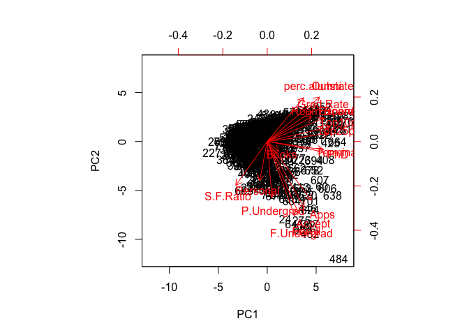
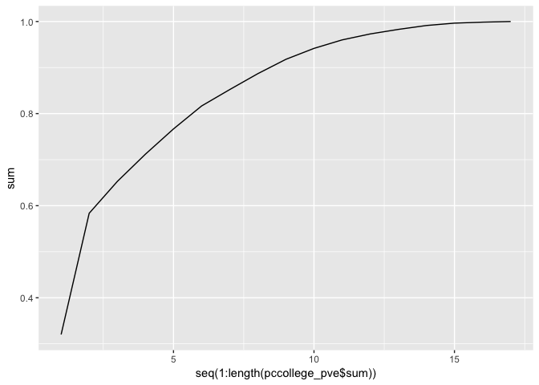
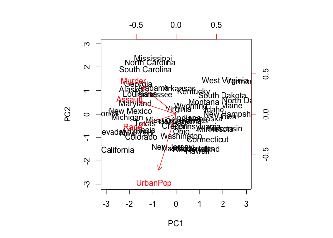
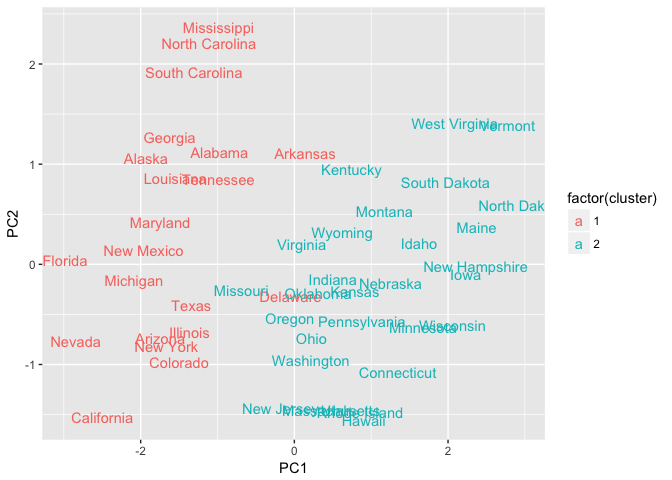
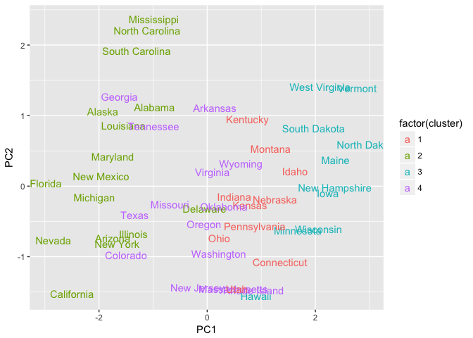
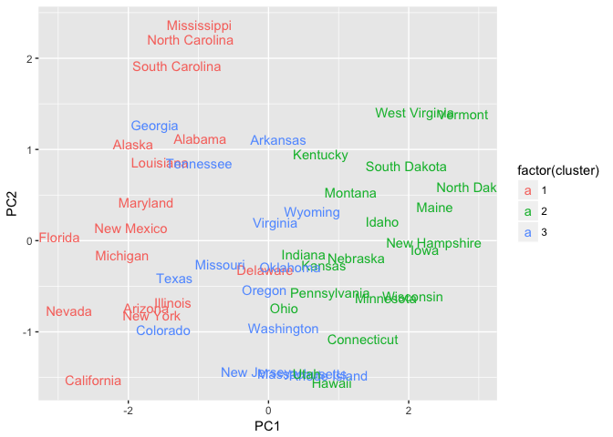
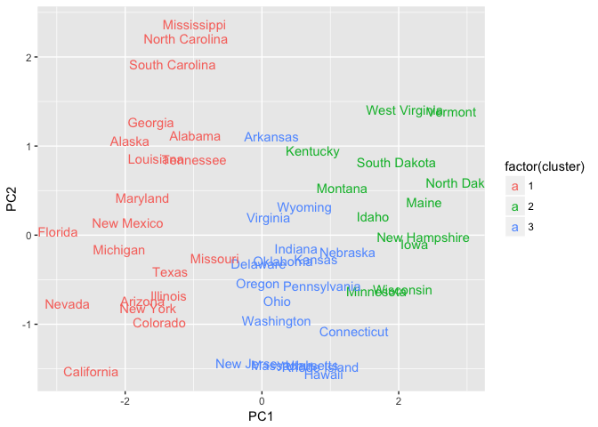
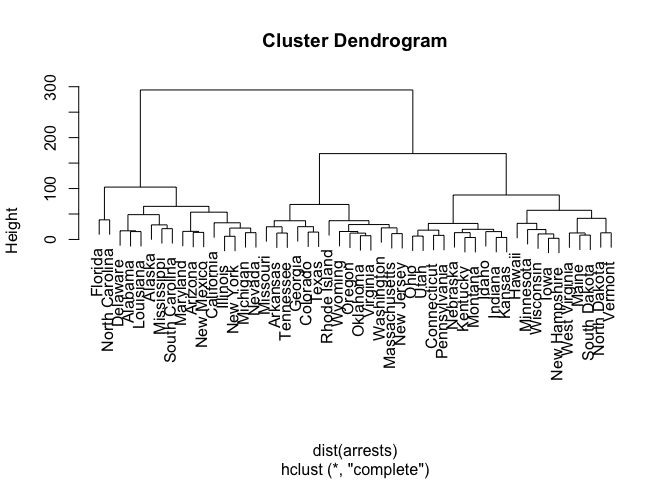
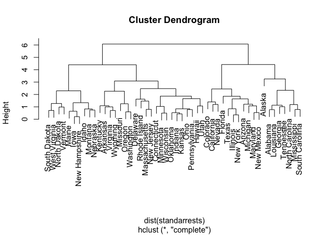

Unsupervised Learning
================
Jo Denby
2017-12-01

#### Colleges

``` r
library(tidyverse)
college <- read_csv("College.csv") %>%
  select(-Private)
```

##### 1.

``` r
pccollege <- prcomp(college, scale = TRUE)
biplot(pccollege, scale = 0)
```



Based on this biplot, the first principal component indicates that the variables with the strongest correlation are `Top 10Percent`, `Top 25Percent`, `Expend`, `Terminal`, `PhD`, and `Outstate`. For the second component, the `perc.alumni` and `Outstate` variables are those most strongly correlated with the principal component, with `F.Undergrad`, `Apps`, `Accept`, and `Enroll` having even stronger negative correlations.

##### 2.

``` r
pccollege_var <- pccollege$sdev^2
pccollege_pve <- pccollege_var/sum(pccollege_var)
pccollege_pve <- pccollege_pve %>%
  as.data.frame() %>%
  mutate("sum" = cumsum(pccollege_pve))
ggplot(pccollege_pve, aes(x=seq(1:length(pccollege_pve$sum)), y=sum)) +
  geom_line()
```



This plot describes the cumulative proportion of the dataset's variance explained by the 17 principal components.

``` r
pccollege_pve$sum[2]
```

    ## [1] 0.5836084

By adding the first two values together, we can compute the proportion of the dataset's variance explained by the first two principal components (plotted above). The calculation shows that approximately 58% of the variance is explained by the first two components.

#### States

``` r
arrests <- read_csv("USArrests.csv") %>%
  tibble::column_to_rownames("State")
```

##### 1.

``` r
pcarrests <- prcomp(arrests, scale = TRUE)
biplot(pcarrests, scale = 0)
```



##### 2.

``` r
arrestsk2 <- kmeans(arrests, 2, nstart=20)

k2df <- pcarrests$x %>%
  as.data.frame() %>%
  select(c("PC1", "PC2")) %>%
  tibble::rownames_to_column(var="state") %>%
  mutate("cluster"= arrestsk2$cluster)
  

ggplot(k2df, aes(PC1, PC2, color = factor(cluster), label = state)) + 
  geom_text()
```



The clusters seem delineated primarily along the first principal component's dimension; states within each cluster generally span PC2, with the main split occurring around a PC1 score near 0. There isn't an immediately obvious story to tell about the allocation of states to each cluster; perhaps one could say (very roughly) that northern states are assigned to one cluster and southern states assigned to the other.

##### 3.

``` r
arrestsk4 <- kmeans(arrests, 4, nstart=20)

k4df <- pcarrests$x %>%
  as.data.frame() %>%
  select(c("PC1", "PC2")) %>%
  tibble::rownames_to_column(var="state") %>%
  mutate("cluster"= arrestsk4$cluster)
  

ggplot(k4df, aes(PC1, PC2, color = factor(cluster), label = state)) + 
  geom_text()
```



Most of the further division occurs in what was Cluster 2 in the above clustering method, suggesting that that cluster (the states on the positive end of PC1) contained the most within-cluster variability. Again, the clustering boundaries occur mostly along the PC1 dimension, with most clusters staying relatively intact along PC2.

##### 4.

``` r
arrestsk3 <- kmeans(arrests, 3, nstart=20)

k3df <- pcarrests$x %>%
  as.data.frame() %>%
  select(c("PC1", "PC2")) %>%
  tibble::rownames_to_column(var="state") %>%
  mutate("cluster"= arrestsk3$cluster)
  

ggplot(k3df, aes(PC1, PC2, color = factor(cluster), label = state)) + 
  geom_text()
```



This clustering method demonstrates an intermediate division between the *K* = 2 and *K* = 4 clustering methods. Most of the new cluster is broken off from the cluster on the positive end of PC1. Again, very roughly, one might argue that the new cluster is composed of states that are intermediate between quintessentially northern and southern states.

##### 5.

``` r
pcarrests12 <- pcarrests$x %>%
  as.data.frame() %>%
  select(c("PC1", "PC2"))

pcarrestsk3 <- kmeans(pcarrests12,3,nstart = 20)

pcak3df <- pcarrests12 %>%
  tibble::rownames_to_column(var="state") %>%
  mutate("cluster"= pcarrestsk3$cluster)
  

ggplot(pcak3df, aes(PC1, PC2, color = factor(cluster), label = state)) + 
  geom_text()
```



The states still have approximately the same distribution, but the clustering algorithm results in much more discrete boundaries. Compared to the previous *K* = 3 cluster plot, the clusters have much less overlap. This is perhaps because all states are judged on an even scale when clustered using the PCA scores directly; this method allows for more faithful comparison of different states, making clustering simpler.

##### 6.

``` r
arrestshier <- hclust(dist(arrests), method = 'complete')
plot(arrestshier)
```



##### 7.

``` r
plot(arrestshier)
abline(h=125, col = 'red')
```


By cutting at approximately 125, we group the states into three distinct clusters.

Here, R outputs which state belongs to which cluster.

``` r
cutree(arrestshier,3)
```

    ##        Alabama         Alaska        Arizona       Arkansas     California 
    ##              1              1              1              2              1 
    ##       Colorado    Connecticut       Delaware        Florida        Georgia 
    ##              2              3              1              1              2 
    ##         Hawaii          Idaho       Illinois        Indiana           Iowa 
    ##              3              3              1              3              3 
    ##         Kansas       Kentucky      Louisiana          Maine       Maryland 
    ##              3              3              1              3              1 
    ##  Massachusetts       Michigan      Minnesota    Mississippi       Missouri 
    ##              2              1              3              1              2 
    ##        Montana       Nebraska         Nevada  New Hampshire     New Jersey 
    ##              3              3              1              3              2 
    ##     New Mexico       New York North Carolina   North Dakota           Ohio 
    ##              1              1              1              3              3 
    ##       Oklahoma         Oregon   Pennsylvania   Rhode Island South Carolina 
    ##              2              2              3              2              1 
    ##   South Dakota      Tennessee          Texas           Utah        Vermont 
    ##              3              2              2              3              3 
    ##       Virginia     Washington  West Virginia      Wisconsin        Wyoming 
    ##              2              2              3              3              2

##### 8.

``` r
standarrests <- arrests %>%
  scale()

standarrestshier <- hclust(dist(standarrests), method = 'complete')
plot(standarrestshier)
```



The height axis gets much smaller, indicating that, in an absolute sense, the states are more similar. Also, some of the states moved into different clusters. For example, Alaska stands out in this standardized dendrogram as an outlier compared to seemingly all other states, whereas in the previous dendrogram Alaska is grouped together with Mississippi and South Carolina without an exceptional degree.
