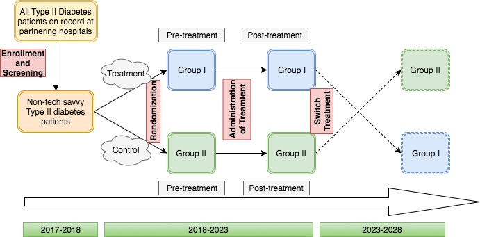

# Proposing an Experiment
```
Title: Effect of preventative programs that enhance tech-savviness on Type II Diabetes patient health and healthcare 
spendings-- a longitudinal randomized controlled trial
Author: Fiona Fan
Class: MACS 30000
Instructor: Benjamin Soltoff
```

## Background and Research Question
Last week, I proposed a survey research plan to study if tech-savviness affects the wedge between perceived and actual health amongst Type II diabetes patients, and if such wedge is a strong predictor for patients' decision to be compliant with their doctors' orders and subsequently their ultimate clinical outcomes. 

This week, for sake of argument, I will assume that the results we got from the previous study prove that tech-savviness does indeed shrink the wedge between perceived and actual health, and that tech-savvy patients are indeed more compliant and thus healthier. These results would provide policy makers with the motivation to invest in preventative programs that can enhance Type II diabetes patients' tech-savviness (meaning they are more likely to track their diabetic health measures like a1c and BMI and better manage their diabetes using technologically enhanced tools like apps). However, whether such programs will lead to less healthcare spending, which is a key concern of policy makers, remains unknown. Thus, before launching full-fledged programs across states, costing hundreds of millions of dollars, it would serve their purpose well to conduct a randomized controlled trial to see if such preventative programs will causally lead to less healthcare spending. 

## Experimental Design
The overall design of the experiment will follow that of a randomized controlled trial. [Figure 1](#fig1) documents the overall design of the experiment. It will be a mixed-design where the pre- and post-treatment outcome measures will be compared within both treatment and control groups. 



**<a name = "fig1"></a>Figure 1. Overall Design of the Experiment**
### 1. Participant Recruitment
Even though our previous priming observational and survey studies were using clinical data from Joslin Diabetes Center, with the trade-off between running out of budget and having robust results for external validity in mind, we will make it a multi-city study, recruiting patients from several major diabetes clinics across US, including Mayo Clinic, Cleveland Clinic, and UCSF Medical Center. The open recruitment of patients will span over a period of 1 year, from 2017 to 2018. We will advertise about the study over non-digital channels, like in hospital lobbies, considering the fact that we are recruiting non-tech-savvy patients. Another channel of recruitment will be the old-style telephone and email. Patient contact information will be acquired under the protection of HIPAA law and IRB regulations. A screening question of whether the potential participant uses technologically enabled diabetes management tool will be asked to prevent the tech-savvy participants from entering the study, upward-biasing our results. We hope to recruit equal number of patients in each group for maximization of statistical power.

### 2. Randomization (Digitally Enhanced)
Once we have our pool of willing participants, we will randomly select patients based on their patient ID, using a simple randomizing algorithm. To test for randomization, descriptives of patient demographics and their average clinical measures will be compared between control and treatment groups (Group I and Group II in [Figure 1](#fig1)). 

### 3. Treatment Delivery
We will devise a preventative program that educate patients on the best practice of using technologically enhanced diabetes management tools like a1c measurement devices, and apps that allow you to track clinical measures. It will also keep them updated on the most recent medical advancement achieved in the field of clinical diabetes and what that means for their treatment. In addition, the program will cover their subscription fees to the apps and the cost of the a1c devices. 

The preventative care program will be administered to patients in the treatment group (Group I in [Figure 1](#fig1)). Ideally the treatment will last for a period of 5 years (from 2018-2023), a long period to allow for the effect of the treatment on healthcare spending to manifest itself. Outcome measures (as described below) will be documented continuously and longitudinally over the years. 

***Optional Step***

Post the five years of treatment delivery, if fundings allow, we will switch the treatment and control groups. As shown in [Figure 1](#fig1), Group 2 will be the new treatment group and participate in the preventative program, while Group 1 will stop receiving the treatment, leaving the preventative program and stop their coverage of subscription to the diabetes management apps. The reason behind adding an extra step is to causally see if doing so will cut the healthcare spending in Group 2 and increase the spending in Group 1. Sometimes in longitudinal studies, there could be some time-dependent factors that could confound our results, like population fluidity (patients moving out of the state and thus dropping from the study), age, and etc. Going the extra mile will exclude those confounding factors.


### 4. Outcome measures (Digitally Enhanced)
The outcome measures will be three-fold: clinical outcome, survey outcome and financial outcome. Since this is a mixed-design study, we mainly rely on difference in differences model for our data analyses, supplemented by logistic regression for binary outcomes like if_complication, and analysis of covariance for continuous outcomes like healthcare spending and other clinical measures.
#### Clinical Outcomes
* a1c, BMI, and an array of complications, as studied in the previous observational and survey studies.
* Hospital operational measures that can be of economical interest,like hospital days, number of hospitalizations, if rehospitalization. One measure of particular interest can be the number of emergency department visits caused by diabetes. The reason is that ER visits are especially expensive and can be easily prevented. 


#### Survey Outcome
In line with our previous survey study, we will distribute follow-up surveys to the participants in both groups. The design of surveys will follow the one documented in my previous proposal. Doing so will allow us to fathom the causal mechanism behind the changes in overall diabetic healthcare spendings. More specifically, it will tell us whether the institution of such preventative programs have closed the wedge between perceived health and actual health, and whether the closure helps with the patients' decision to be more compliant. This time, we will use [RedCap](https://www.project-redcap.org/) as the digital platform. 

#### Financial Outcome
The is the key outcome of interest for the policy makers. The latest report in a longitudinal study done by the American Diabetes Association (ADA), which tracks the components of healthcare expenditure on diabetes care across years, reports that out of the $245 billion total costs, hospital inpatient care (43% of the total medical cost), prescription medications to treat the complications of diabetes (18%) and physician office visits (9%) top the chart, and together account for a majority of the costs. We will see part by part if those measures are different in the control group and treatment group, mapping to the difference in clinical outcome results.

### 5. Budget Source
The money of our study will come from governmental agencies that have aligned aims of cutting healthcare spending. 

## Assessment of Experiment Design
### 1. Validity
#### Internal validity
If our randomization step is carried out without failure, there will be little select bias. It is possible that there could be regression towards mean, as the people in this age in general become more and more tech-savvy and healthy as time moves on and technology advances. However, we are using a difference-in-difference method which will spare us the concern towards within-group changes. Overall, the very nature of RCT renders our study very strong internal validity.

#### External validity
We designed our study to span across multiple cities, so that the results can account for hospital-specific perturbations. One concern might be that since this is a voluntary study, the participants might be a self-selected group of people towards whom the rewards of the study are enticing enough. There might be some features that set our population apart from the target population at large (all Type II diabetes patients in US). To account for this, we will compare the descriptive statistics of our participants with all diabetic patients on record at the hospital to see if there are major discrepancies.

### 2. Heterogeneity
Overall, a better control over a patient's own diabetic conditions will make her a more compliant patient, as previous research has documented (Delimiter, 2006). There is a possibility where being more aware of her own clinical standing makes her more reluctant to go to doctor's appointments. To account for this potential heterogeneous effect of treatment, I will look for patients in the treatment group that report to be less and less compliant over the years and see if there are common features within this subgroup. 

### 3. Causal Mechanisms
The follow-up surveys and the breakdown of financial outcomes will give us intuitions on the mechanism in the potential cut in healthcare spending. For example, if in general the patients report to be more willing to be compliant in the treatment group, and correspondingly the costs of physician office visits go down for the hospital, then we can safely vouch for the hypothesis that the preventative program can make the patient more compliant and thus reduce her chance of progressing in her clinical symptoms. 

### 4. Ethical concerns
This is not a blinded experiment, caused by the recruitment procedure (open recruitment via advertisement). The patients in the control group are fully aware that there is a groups of their counterparts enjoying a preventative care program that they are not allowed to participate in. The could lead to a loss of enthusiasm to participate, and consequently a low response rate in the control group for the follow-up surveys. In remedy we will offer monetary rewards, as disciplined by IRB, to keep their enthusiasm on par with the treatment group.


## Conclusion
The results of the RCT will allow the policy makers to make informed budget proposals and policy decisions. As mentioned in the **Motivation** section of the first proposal, hopefully investing in preventative care programs can prevent further rise in diabetic healthcare spending, which contributes significantly to the overall rising trend of healthcare spending in US.


## Bibliography
Delamater, A. M. "Improving Patient Adherence." Clinical Diabetes 24, no. 2 (2006): 71-77. doi:10.2337/diaclin.24.2.71.


 