# Racial Equality in Education and Market Outcomes

racial equality is the belief that different racial groups, as groups, are equal, with none being inherently superior or inferior in intelligence, virtue, or beauty, and thus all groups should be treated equally. In the U.S., racial equality has become a law that regardless of what race an individual is, they will receive equal opportunities [[1]](http://www.encyclopedia.com/history/dictionaries-thesauruses-pictures-and-press-releases/racial-equality). 
In this section, I am going to explore the current situation of racial equality, in reality, using the data of General Social Survey 2012. More specifically, given the historical inequality for African Americans, we focus on the comparison between the white and the black people.

One of the most important aspects of racial equality is the equality in education. Figure 1 shows the distribution of years of education of three different racial groups in the U.S.: White, black, and others. Three distributions are highly similar in terms of the shape and the median, indicating that different racial groups received the similar education in terms of the years. It becomes even closer if we plot the distribution of degrees (see Figure 2).

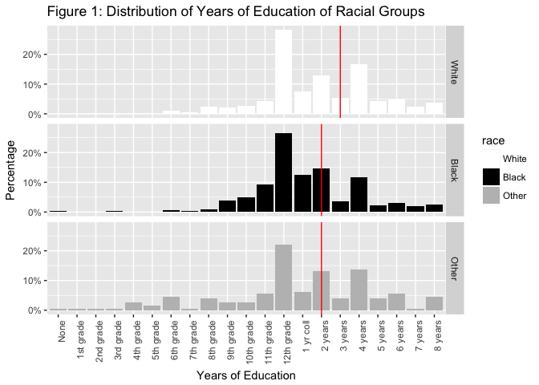

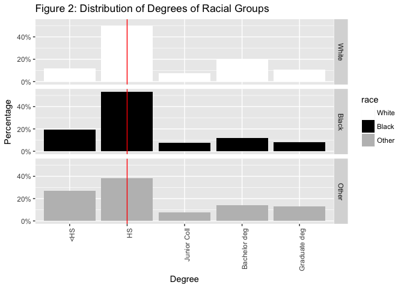

Similar educations should generate similar market outcomes. Hence, we expect the income of three racial groups to be similar, too. Nevertheless, Figure 3  below presenting the distribution of family income shows the sharp differences among three racial groups. The median of family income of white people and other racial groups are equal, much higher than the black people. After transforming the categorical variable into a continuous variable by imputation, we are able to plot the bar chart of the household income. It shows that the mean of white people's family income is significantly higher than black people's (Figure 4).

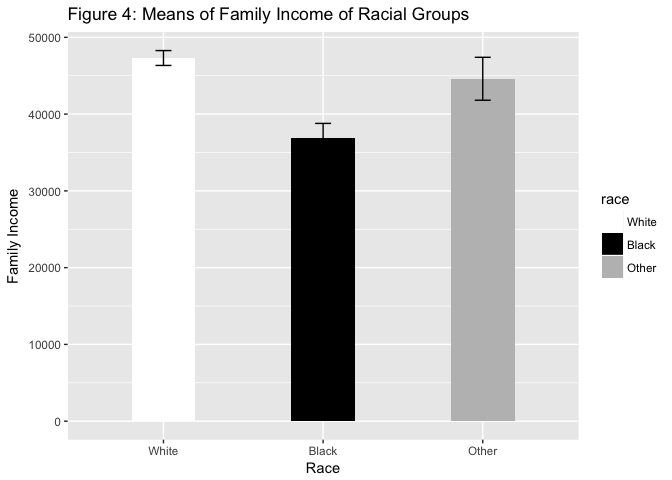

A plausible reason for the gap of family income is that the black people's work participation is lower than white people, which, actually is rejected by the data.  Figure 5 shows the percentage of full-time work participation of different racial groups. The work participation of two groups is very close. The distribution of income of respondents as individuals also does not support this hypothesis. Though the income gap is narrowed, white people still earn more than black people as individuals (Figure 6).

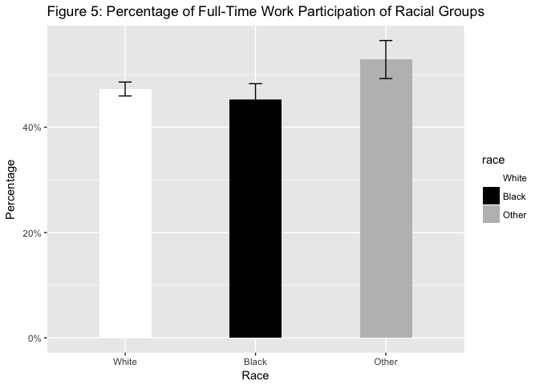

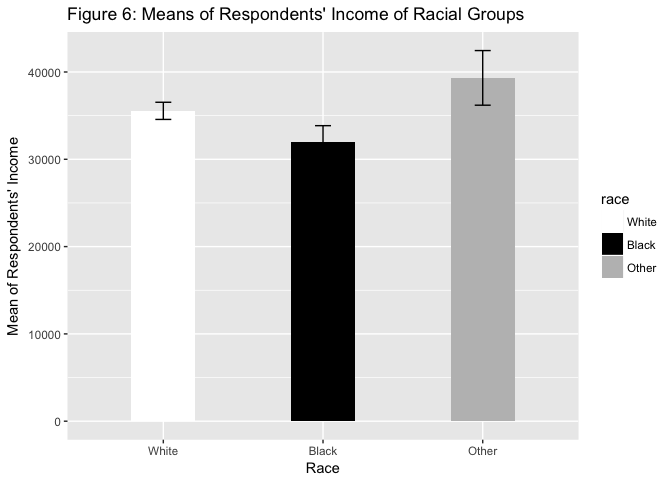

We also investigate the equality in the general happiness. Figure 7 shows that the percentage of the not too happy black people are much higher than that of the not too happy white people; the percentage of the very happy black people are much lower, as well.

Given different racial groups received an almost equal length of education, why are their market outcomes different? A straightforward conjecture is that the quality of education may not be equal. This dataset does not contain a direct measure of the quality of education, but we can use the result of a verbal test and a science quiz as proxy variables. Figure 8 and Figure 9 shows that white people have strong advantages in verbal and science tests relative to the black people, indicating they may have received a better education. Higher quality of education is positively correlated with the market outcomes, as shown in Figure 10-11.

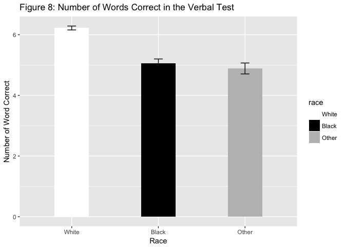

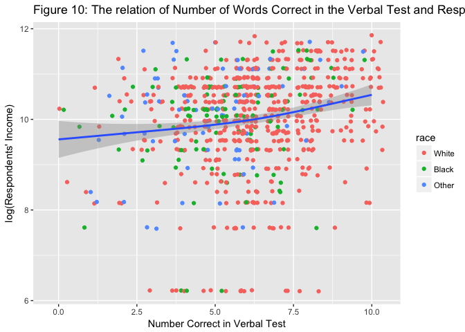

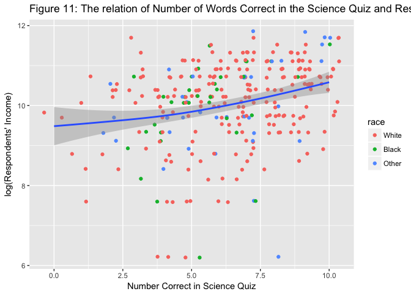

Therefore, we conclude that the racial equality in education has only been achieved partly. Though the quantity of education is similar across racial groups, the quality remains unequal.

# Who Hates Communists Most?

In this section, we are going to draw a profile of those people who extremely hates communists. We exploit the three questions in the survey: Whether to allow communists in your community to give a speech; whether to allow him or her to teach; whether to allow communist books in the library. Note that these questions measure not only the objection toward communism but also the objection toward freedom of speech, which should be kept in mind when we are making interpretations.

Figure 12 plots the overall responses toward the three questions. In general, 30% of respondents do not allow communist to speak, teach, or keep communist books in the library. We can construct an index to measure the levels of anti-communism by summing up the value of these three questions (Actually models from item response theory are more preferable, but I stick to the primitive summation here in order to avoid sophisticated statistical models as instructed by the assignment). The distribution of the index is shown in Figure 13. Roughly 50% people are not opposed to communism (or at least respect the freedom of speech), while all others showed anti-communism to some extent.

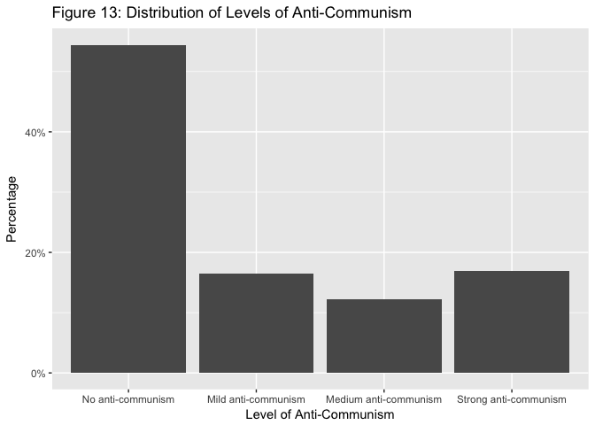

Figure 14 plot the age distributions of people at different levels of anti-communism. It shows that those who hate communists are relatively elder. This is reasonable, since most anti-communism is instilled in the crowd mainly during the cold war. Figure 15 plots the anti-communism in different racial groups. It shows that black people and other racial groups tend to hate communists more than do white people. Figure 16 shows that those who are strongly opposed to communists tend to earn less. Figure 17 reveals a significant common characteristic of people who have strong anti-communism: their years of education are much lower than those of others.

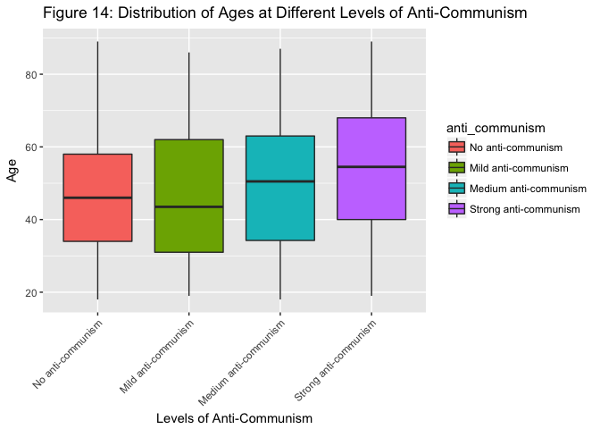

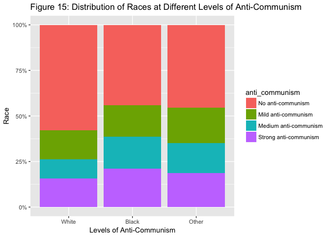

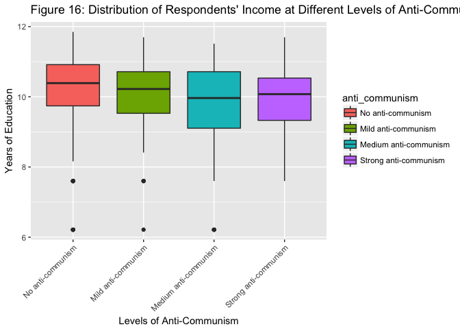

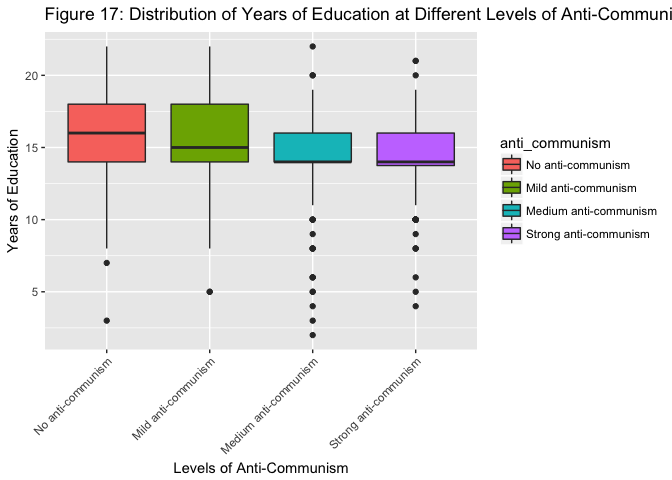

Two observations might be interesting for understanding the anti-communism among common people in the U.S. In Figure 18, I plot the attitude toward social security held by people at different levels of anti-communism. Note that social security is a typical socialism approach, which also has a deep root in communism. The figure shows that as the level of anti-communism increases, the percentage of people who believe the society's expenditure on social security is too little also increases, revealing the conflicts of their beliefs. Figure 19 is about the beliefs of the importance of thinking for themselves. It shows that the stronger the anti-communism, the less important the ability of thinking for themselves.

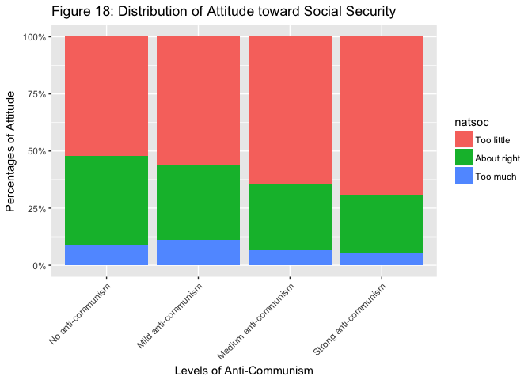

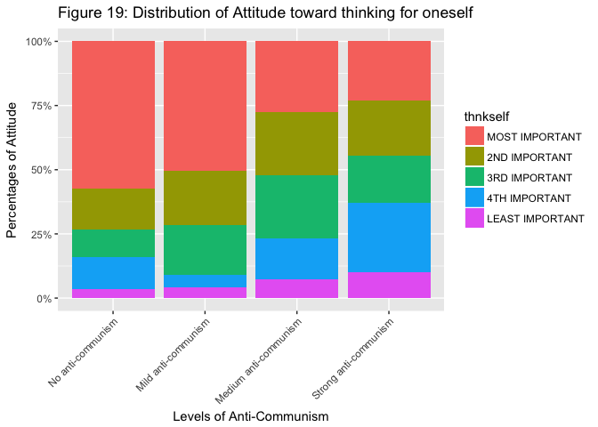

