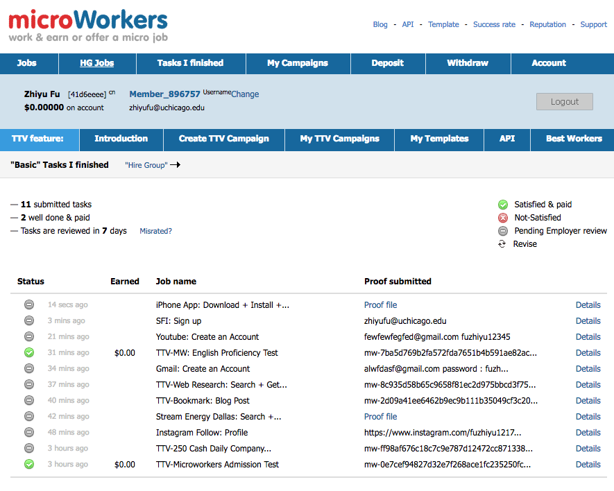

# Q1

## Interested competition: House Prices: Advanced Regression Techniques

### Goal

The goal of the competition is to predict the house price in Ames, Iowa with 79 explanatory variables describing almost every aspect of residential homes.

### What to do

I would train a (advanced) regression model based on the training set, use the model to predict the sale prices of houses in the test set, then submit my predicted prices.

   
   
```{r, message=FALSE, warning=FALSE}
#inbclude libraries
library(data.table)
library(dplyr)
library(stringi)
library(ggplot2)
if (file.exists("GlobalLandTemperaturesByCity.csv"))
  # due to the large size of the dataset, I cannot upload it to the github.
  # Therefore, I extract a subset saved as "plot_data.csv".
  # The whole data can be found at 
  #https://www.kaggle.com/berkeleyearth/climate-change-earth-surface-temperature-data/data
{
dt = fread("GlobalLandTemperaturesByCity.csv")
dt = dt[Country == "United States",] # select the U.S. only
dt[, year:=year(as.Date(dt))]
dt[, avg_temp := mean(AverageTemperature), by = year] # calculate the average yearly temperature
dt = unique(dt[year>1900, .(avg_temp, year)]) # collapse dataset
write.csv(dt, "plot_data.csv")
} else
{
  dt = fread("plot_data.csv")
}
```


```{r, message=FALSE, warning=FALSE}
p = ggplot(dt, aes(year, avg_temp)) + geom_point() + geom_smooth(se = TRUE) +
 ggtitle("Trend of average yearly temperature in the U.S. from 1900 to 2013") + ylab("Average Yearly Temperature (Celsius)") +
 xlab("Year")
# produce a pdf figure
pdf("Trend_of_average_yearly_temperature.pdf", width = 7, height = 5)
p
res = dev.off()
# display the plot here
p
```
# Q2

## Thinking More or Feeling Less? Explaining the Foreign-Language Effect on Moral Judgment

This paper found that speaking in a foreign language may blunt emotional reactions and amplify utilitarian considerations. 

Their general method is as follows: They recruited 200 bilingual participants and randomly assign them to complete the study in either their native language or their foreign language.Then they were presented with 20 moral dilemmas and asked to determine whether a given action is appropriate.

Their work can be easily reformulated as a human computation project. It is not difficult to do: just move the environment of the experiment from the laboratory to Amazon Mechanical Turk, and all procedures can keep the same.

Several benefits come with the reformulation. First, it can save the compensation considerably. The whole procedure can be completed in roughly ten minutes, which only costs 0.5 dollars per participant on MTurk, while they paid their participants 2 to 5 dollars. Second, they can get a more representative sample instead of a group which mainly consists of undergraduate students. Third, they can cover more languages to improve the external validity. In their experiment, they only test three languages: German, English, and Spanish. It may not be effective enough to be generalized to other language users. On Mturk, experimenters can easily recruit participants from 43 countries speaking various languages.


# Q3

Since I don't have an SSN, I cannot sign up for MTurk. I worked on Microworker instead.



