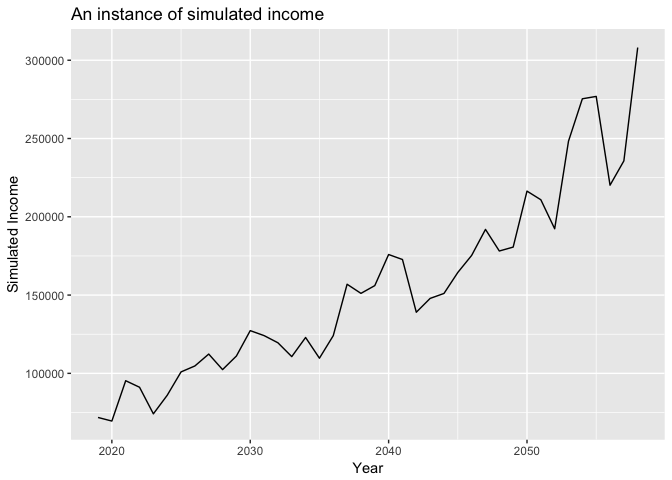
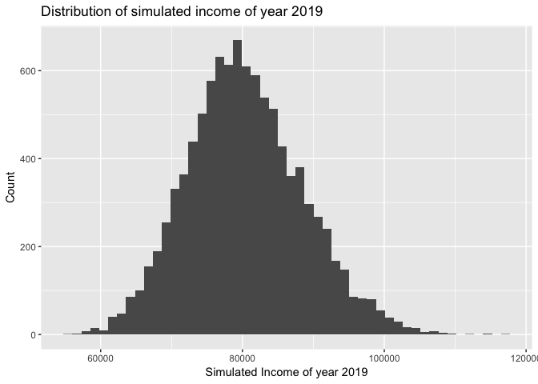
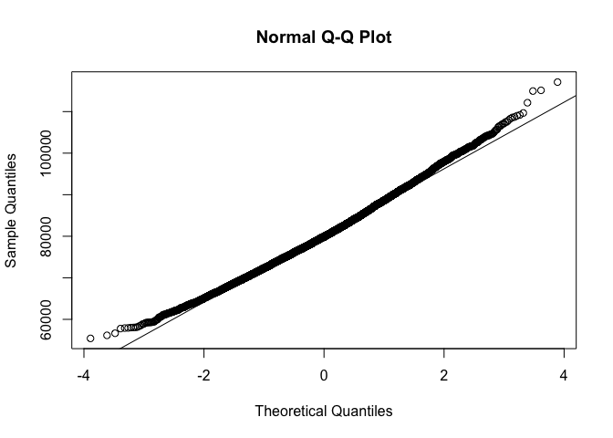
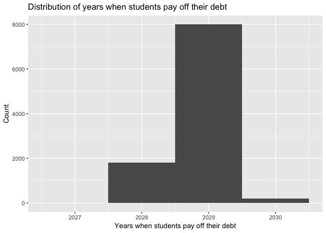

Simulation of My Lifetime Income
================================

Q1
--

First we generate a matrix of simulated income.

    set.seed(1)
    sigma = 0.1
    rho = 0.2
    g = 0.03
    log_inc0 = log(80000)
    N = 10000
    Y = 40
    simulated_income = matrix(0, N, Y)
    log_epsilon = rnorm(N, 0, sigma)
    simulated_income[,1] = log_inc0 + log_epsilon
    for (i in 2:40)
    {
      
      log_epsilon = rnorm(N, 0, sigma)
      simulated_income[,i] =  (1-rho)*(log_inc0+g*(i-1)) + rho * simulated_income[,i-1]+ log_epsilon
    }
    simulated_income = exp(simulated_income)
    one_path = simulated_income[sample.int(N, 1),]
    qplot(2019:2058, one_path, geom = "line", xlab = "Year", ylab = "Simulated Income", main = "An instance of simulated income")

Q2
-- 

1.27% of class will earn more than 100,000 in 2019, while 9.47% of
students will earn less than 70,000.

Theoretically, the simulated income is lognormally distributed. Though
the histogram of income is very close to a normal distribution, it is
still right-skewed, i.e., it has a long tail on the right. A QQ plot can
support that it is not a normal distribution.

    # ggplot(simulated_income[,1]) + geom_histogram(bins = 200)
    qplot(simulated_income[,1], bins = 50, ylab = "Count", xlab = "Simulated Income of year 2019", main = "Distribution of simulated income of year 2019")

    print("Percentage of students who earn more than 100000 in 2019")

    ## [1] "Percentage of students who earn more than 100000 in 2019"

    print(sum(simulated_income[,1]>100000)/N*100)

    ## [1] 1.27

    print("Percentage of students who earn less than 70000 in 2019")

    ## [1] "Percentage of students who earn less than 70000 in 2019"

    print(sum(simulated_income[,1]<70000)/N*100)

    ## [1] 9.47

    qqnorm(simulated_income[,1])
    qqline(simulated_income[,1])

Q3
--

The histogram is as follows. Only 17.98% students can pay off the loan
on or before 2028.

    cum_sum = t(apply(simulated_income*0.1, 1, cumsum))
    pay_off_year = sapply(apply(cum_sum>=95000, 1, which), min) + 2018
    qplot(pay_off_year, bins = length(unique(pay_off_year)), 
          xlab = "Years when students pay off their debt",
          ylab = "Count", main = "Distribution of years when students pay off their debt")

    print("The percentage of students who can pay off their debt on or before 2028.")

    ## [1] "The percentage of students who can pay off their debt on or before 2028."

    print(sum(pay_off_year<=2028)/N*100)

    ## [1] 17.98

Q4
--

With the new parameters, 69.94% of students can pay off their debt on or
before 2028.

    log_inc0 = log(85000)
    sigma = 0.15
    set.seed(1)
    log_epsilon = rnorm(N, 0, sigma)
    simulated_income[,1] = log_inc0 + log_epsilon
    for (i in 2:40)
    {
      
      log_epsilon = rnorm(N, 0, sigma)
      simulated_income[,i] =  (1-rho)*(log_inc0+g*(i-1)) + rho * simulated_income[,i-1]+ log_epsilon
    }
    simulated_income = exp(simulated_income)
    cum_sum = t(apply(simulated_income*0.1, 1, cumsum))
    pay_off_year = sapply(apply(cum_sum>=95000, 1, which), min) + 2018
    qplot(pay_off_year, bins = length(unique(pay_off_year)), 
          xlab = "Years when students pay off their debt",
          ylab = "Count", main = "Distribution of years when students pay off their debt")

    print("The percentage of students who can pay off their debt on or before 2028.")

    ## [1] "The percentage of students who can pay off their debt on or before 2028."

    print(sum(pay_off_year<=2028)/N*100)

    ## [1] 69.94
