unsupervised\_learning
================
Zhiyu Fu
12/1/2017

``` r
library(readstata13)
library(data.table)
library(stringi)
library(ggplot2)
library(dplyr)
library(foreign)
library(FactoMineR)
library(stats)
library(reshape2)
library(ggdendro)
library(dendextend)
```

Colleges
========

Read the data first.

``` r
dt = fread("College.csv")
dt[,Private:=factor(Private)]
```

Do the PCA.

``` r
pca = PCA(dt[,2:length(dt)])
```

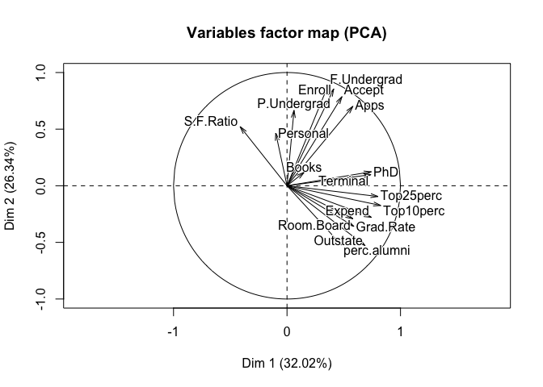

``` r
cor1 = cor(pca$ind$coord[,1], dt[,2:length(dt)])
colnames(cor1)[which(cor1 == max(abs(cor1)))]
```

    ## [1] "Top10perc"

``` r
cor2 = cor(pca$ind$coord[,2], dt[,2:length(dt)])
colnames(cor2)[which(cor2 == max(abs(cor2)))]
```

    ## [1] "F.Undergrad"

The Percent of new students from top 10% of H.S. class, Percent of new students from top 25 of H.S. class, Percent of faculty with Ph.D.'s have the strongest correlation with the first principal component; the number of fulltime undergraduates, number of parttime undergraduates, and number of applications received have the strongest correlation with the second principal component. The first two components account for 58.35% variances.

``` r
cum_var_exp = pca$eig[,3]
qplot(1:length(cum_var_exp), cum_var_exp, geom = c("point", "line"), main = "Proportion of Variance Explained",
      xlab = "# PC", ylab = "Proportion of Variance Explained")
```

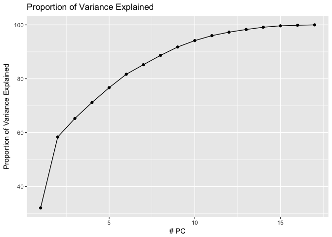

``` r
print(cum_var_exp)
```

    ##    comp 1    comp 2    comp 3    comp 4    comp 5    comp 6    comp 7 
    ##  32.02063  58.36084  65.26176  71.18475  76.67315  81.65785  85.21673 
    ##    comp 8    comp 9   comp 10   comp 11   comp 12   comp 13   comp 14 
    ##  88.67035  91.78758  94.16277  96.00420  97.30024  98.28599  99.13184 
    ##   comp 15   comp 16   comp 17 
    ##  99.64896  99.86472 100.00000

Clustering
==========

Q1: PCA
=======

starts from PCA.

``` r
dt = fread("USArrests.csv")
row.names(dt) = dt$State
pca = PCA(dt[,2:5])
```

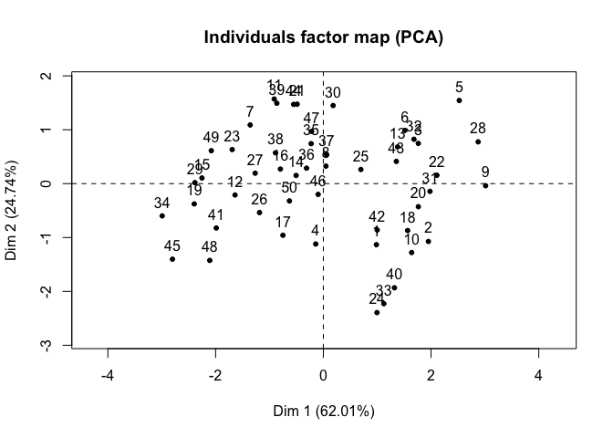

``` r
pc = data.table(pca$ind$coord[,1:2])
pc[,State := dt$State]
row.names(pc) = row.names(dt)
colnames(pc) = c("PC1", "PC2", "State")
ggplot(pc, aes(x = PC1, y = PC2)) + 
  geom_point() + geom_text(aes(label = State), vjust = -0.5)
```

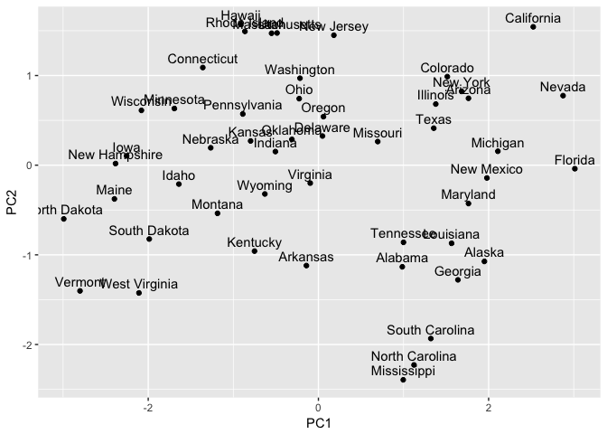

``` r
cum_var_exp = pca$eig[,3]
qplot(1:length(cum_var_exp), cum_var_exp, geom = c("point", "line"), main = "Proportion of Variance Explained",
      xlab = "# PC", ylab = "Proportion of Variance Explained")
```

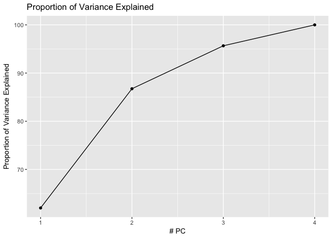

``` r
cor1 = cor(pca$ind$coord[,1], dt[,2:length(dt)])
colnames(cor1)[which(cor1 == max(abs(cor1)))]
```

    ## [1] "Assault"

``` r
cor2 = cor(pca$ind$coord[,2], dt[,2:length(dt)])
colnames(cor2)[which(cor2 == max(abs(cor2)))]
```

    ## [1] "UrbanPop"

``` r
print(cum_var_exp)
```

    ##    comp 1    comp 2    comp 3    comp 4 
    ##  62.00604  86.75017  95.66425 100.00000

The Assault arrests (per 100,000) has the strongest correlation with the first principal component; the Percent urban population has the strongest correlation with the second principal component. The first two components account for 86.75% variances.

Q2: Clustering (K = 2)
----------------------

``` r
k2 = pc
k2[, cluster := as.factor(kmeans(dt[,2:5], 2, nstart = 20)$cluster)]
center = k2[, lapply(.SD, mean), by = cluster, .SDcols = c("PC1", "PC2")]
ggplot(k2, aes(x = PC1, y = PC2)) + geom_point(aes(color = cluster)) +
  geom_text(aes(label = State), vjust = -0.5) + 
  geom_point(data = center, aes(x = PC1, y = PC2), shape = 8, size = 5) + 
  labs(title = "clustering with raw data on first two principal components (k = 2)")
```

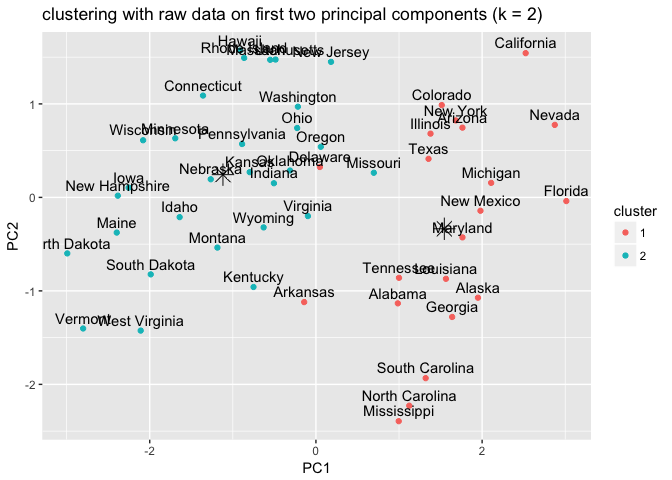

The clustering is mostly along the first principal component. At around PC1 = 0, the states are sparated into two groups. This is partly due to the fact that the first principal component accounts for 62% of the total variance. There isn't too much differentiation of two clusters along the second PC.

Q3: Clustering (K = 4)
----------------------

``` r
k2 = pc
k2[, cluster := as.factor(kmeans(dt[,2:5], 4, nstart = 20)$cluster)]
center = k2[, lapply(.SD, mean), by = cluster, .SDcols = c("PC1", "PC2")]
ggplot(k2, aes(x = PC1, y = PC2)) + geom_point(aes(color = cluster)) +
  geom_text(aes(label = State), vjust = -0.5, size = 3) + 
  geom_point(data = center, aes(x = PC1, y = PC2), shape = 8, size = 5) + 
  labs(title = "clustering with raw data on first two principal components (k = 4)")
```

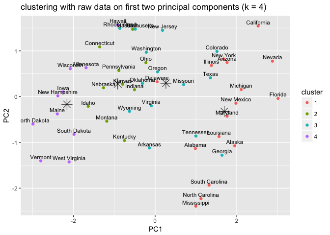

Roughly speaking, the second cluster in the previous question was divided into three clusters. The second PC is more important when separating clusters, and the lines between different clusters on PC1 become less clear.

Q4: Clustering (K = 3)
----------------------

``` r
k2 = pc
k2[, cluster := as.factor(kmeans(dt[,2:5], 3, nstart = 20)$cluster)]
center = k2[, lapply(.SD, mean), by = cluster, .SDcols = c("PC1", "PC2")]
ggplot(k2, aes(x = PC1, y = PC2)) + geom_point(aes(color = cluster)) +
  geom_text(aes(label = State), vjust = -0.5, size = 3) + 
  geom_point(data = center, aes(x = PC1, y = PC2), shape = 8, size = 5) + 
  labs(title = "clustering with raw data on first two principal components (k = 3)")
```

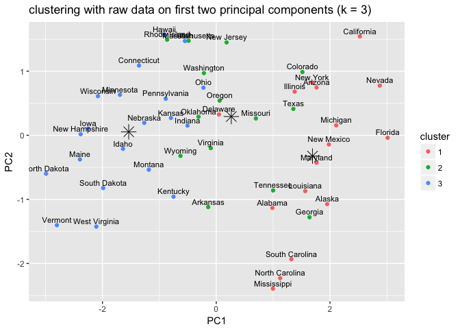 The second cluster in the two-cluster case was divided into two clusters. The pattern is similar to the previous questions. Though the PC1 dominates the division of clustering, PC2 also plays a role.

Q5: Clustering based on principal components(K = 3)
---------------------------------------------------

``` r
k2 = pc
k2[, cluster := as.factor(kmeans(k2[,1:2], 3, nstart = 20)$cluster)]
center = k2[, lapply(.SD, mean), by = cluster, .SDcols = c("PC1", "PC2")]
ggplot(k2, aes(x = PC1, y = PC2)) + geom_point(aes(color = cluster)) +
  geom_text(aes(label = State), vjust = -0.5, size = 3) + 
  geom_point(data = center, aes(x = PC1, y = PC2), shape = 8, size = 5) + 
  labs(title = "clustering based on extracted principal components (k = 3)")
```

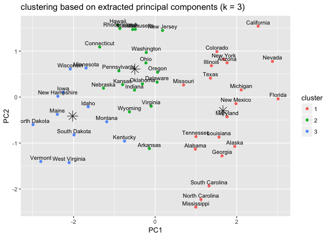

When they cluster based on principal components, the pattern of clustering on this graph is more clear. This is intuitive, since when when they cluster based on the raw data, they are are four dimensions to influence the results, then we project the four dimensions on the two-dimension plane. In this way, some meaningful factors in the four-dimension space became noises on the graph, making the pattern less clear. However, we should not pick two-dimension cluster only because it is more clear, since such clearness comes with the loss of information.

Q6: Hierarchical Clustering
---------------------------

see below.

``` r
hc = hclust(dist(USArrests, method = "euclidean"), method = "complete") 
ggdendrogram(hc, size = 2) + labs(title = "Hierarchical Clustering")
```

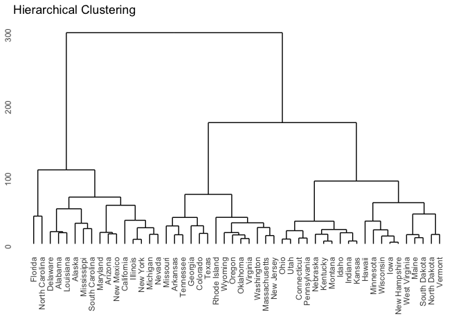 \# Q7: Hierarchical Clustering (k = 3)

See the output of the block below to see the states in each clusters.

``` r
as.dendrogram(hc) %>% color_branches(3) %>%
  plot(main = "Hierarchical Clustering (k=3)") + abline(150, 0)
```

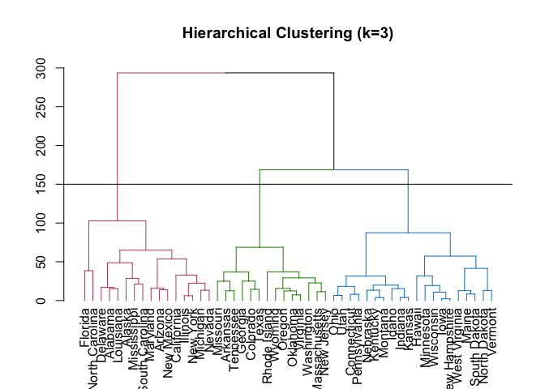

    ## numeric(0)

``` r
cluster = cutree(hc, k = 3)
print("Cluster 1: ")
```

    ## [1] "Cluster 1: "

``` r
print(stri_c(k2$State[cluster == 1], collapse = ", "))
```

    ## [1] "Alabama, Alaska, Arizona, California, Delaware, Florida, Illinois, Louisiana, Maryland, Michigan, Mississippi, Nevada, New Mexico, New York, North Carolina, South Carolina"

``` r
print("Cluster 2: ")
```

    ## [1] "Cluster 2: "

``` r
print(stri_c(k2$State[cluster == 2], collapse = ", "))
```

    ## [1] "Arkansas, Colorado, Georgia, Massachusetts, Missouri, New Jersey, Oklahoma, Oregon, Rhode Island, Tennessee, Texas, Virginia, Washington, Wyoming"

``` r
print("Cluster 3: ")
```

    ## [1] "Cluster 3: "

``` r
print(stri_c(k2$State[cluster == 3], collapse = ", "))
```

    ## [1] "Connecticut, Hawaii, Idaho, Indiana, Iowa, Kansas, Kentucky, Maine, Minnesota, Montana, Nebraska, New Hampshire, North Dakota, Ohio, Pennsylvania, South Dakota, Utah, Vermont, West Virginia, Wisconsin"

``` r
hc = hclust(dist(scale(USArrests), method = "euclidean"), method = "complete") 
  ggdendrogram(hc) + labs(title = "Hierarchical Clustering (Scaled)")
```

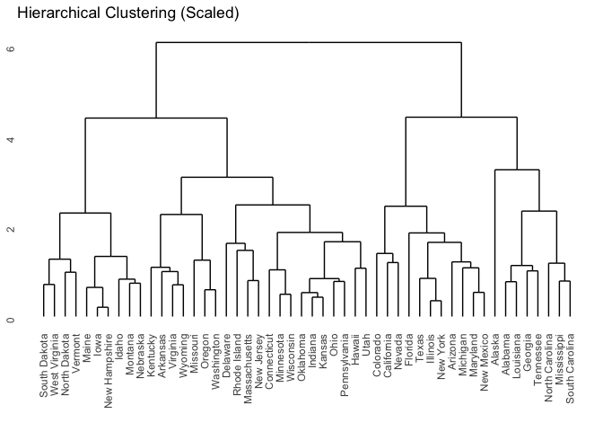

The most significant difference is that the distance is reduced. Furthermore, the tree becomes more balanced, in the sense that the disparity in size of two subtrees of a node decreases. This is because when we standardize each variable, these variable are given the same weights and are more comparable.
