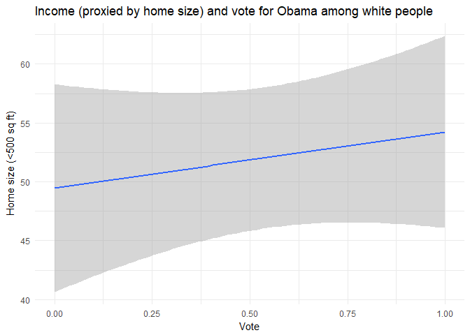
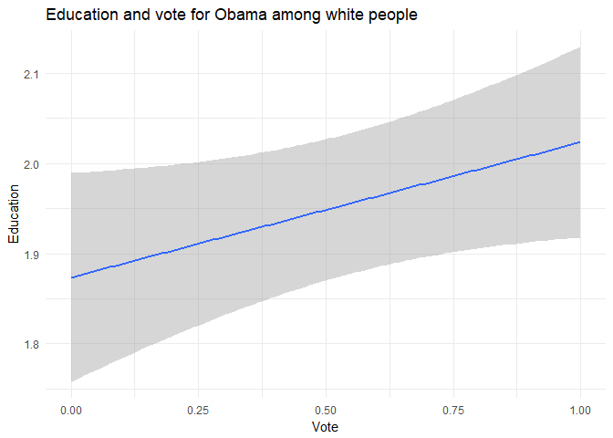

Exploratory Data Analysis of The White Working Class Hypothesis
================
Dan Gamarnik
November 26, 2017

``` r
library(dplyr)
```

    ## 
    ## Attaching package: 'dplyr'

    ## The following objects are masked from 'package:stats':
    ## 
    ##     filter, lag

    ## The following objects are masked from 'package:base':
    ## 
    ##     intersect, setdiff, setequal, union

``` r
library(ggplot2)
library(tidyverse)
```

    ## Loading tidyverse: tibble
    ## Loading tidyverse: tidyr
    ## Loading tidyverse: readr
    ## Loading tidyverse: purrr

    ## Conflicts with tidy packages ----------------------------------------------

    ## filter(): dplyr, stats
    ## lag():    dplyr, stats

``` r
library(stringr) 
library(poliscidata)


data(gss, package = "poliscidata")
# convert to tibble
gss <- as_tibble(gss)
```

Stream of consciousness exploratory data analysis
-------------------------------------------------

``` r
# Getting and converting the files
data(gss, package = "poliscidata")
# convert to tibble
gss <- as_tibble(gss)


# Was talking about whether later (adult) generations are more antagonistic towards their parents. 

ggplot(gss, aes(obey)) +
 geom_bar() +
 geom_rug() +
labs(title = "Obeyed parents well", x = "How important is obeying parents?", y = "Amount") 
```


``` r
# Lets try it with a boxplot

ggplot(gss, aes(obey, age)) +
 geom_boxplot() +
labs(title = "How important is obeying parents?", x = "Age of respondent", y = "Importance") 
```

    ## Warning: Removed 5 rows containing non-finite values (stat_boxplot).


``` r
# Okay lets trying reversing that

ggplot(gss, aes(age, obey)) +
 geom_boxplot() +
labs(title = "How important is obeying parents?", x = "Age of respondent", y = "Importance") 
```

    ## Warning: Removed 5 rows containing non-finite values (stat_boxplot).

    ## Warning: position_dodge requires non-overlapping x intervals


``` r
# There does not seem to be any kind of pattern hmm, let's look instead at the theory that the white working class tends to no longer vote for democrats. I use the 2008 election because it is the only one available.

gss %>%
filter(race == "White") %>%
ggplot(aes(pres08,income06)) +
geom_point() +
labs(title = "Income and vote among white people", x = "Vote", y = "Home size") 
```


``` r
# Unfortunatly, income is a catagorical variable (really GSS?), let's use home size as a proxy instead.

gss %>%
filter(race == "White") %>%
ggplot(aes(pres08,size)) +
geom_point() +
labs(title = "Income (proxied by home size) and vote among white people", x = "Vote", y = "Home size") 
```


``` r
# Lets trying flipping that chart

gss %>%
filter(race == "White") %>%
ggplot(aes(size,pres08)) +
geom_point() +
labs(title = "Income (proxied by home size) and vote among white people", x = "Home size", y = "Vote") 
```


``` r
# Let's trying using a boxplot

gss %>%
filter(race == "White") %>%
ggplot(aes(pres08,size)) +
geom_boxplot() +
labs(title = "Income (proxied by home size) and vote among white people", x = "Vote", y = "Home size") 
```


``` r
# Ok there are outliers in the data, lets try filtering among certain home sizes

gss %>%
filter(race == "White") %>%
ggplot(aes(pres08,size)) +
geom_bar(position = "fill",stat = "identity") +
scale_y_continuous() +
labs(title = "Income (proxied by home size) and vote among white people", x = "Vote", y = "Home size") 
```


``` r
# Let's trying filtering out richer whites and only looking at those working full time.
gss %>%    
filter(race == "White", size < 500, wrkstat == "WORKING FULL TIME") %>%
ggplot(aes(pres08,size)) +
geom_bar(position = "fill",stat = "identity") +
scale_y_continuous() +
labs(title = "Income (proxied by home size) and vote among white people", x = "Vote", y = "Home size (<500 sq ft)")
```


``` r
# Let's trying filtering out into very small homes 
gss %>%    
filter(race == "White", size < 20, wrkstat == "WORKING FULL TIME") %>%
ggplot(aes(pres08,size)) +
geom_bar(position = "fill",stat = "identity") +
scale_y_continuous() +
labs(title = "Income (proxied by home size) and vote among white people", x = "Vote", y = "Home size (<20 sq ft)")
```


``` r
# Okay that's not working so lets create a numeric variable for voting for Obama in 2008

gss$Obama[gss$pres08 == "Obama"] <- 1
```

    ## Warning: Unknown or uninitialised column: 'Obama'.

``` r
gss$Obama[gss$pres08 == "McCain"]<- 0


# NOW let's try that again

gss %>%    
filter(race == "White", size < 500, wrkstat == "WORKING FULL TIME") %>%
ggplot(aes(Obama,size)) +
geom_smooth(method = "lm") +
scale_y_continuous() +
labs(title = "Income (proxied by home size) and vote for Obama among white people", x = "Vote", y = "Home size (<500 sq ft)")
```

    ## Warning: Removed 204 rows containing non-finite values (stat_smooth).


``` r
# Interestingly, there is a positive correlation, however lets try it for those working part-time.

gss %>%    
filter(race == "White", size < 500, wrkstat == "WORKING PART TIME") %>%
ggplot(aes(Obama,size)) +
geom_smooth(method = "lm") +
scale_y_continuous() +
labs(title = "Income (proxied by home size) and vote for Obama among white people", x = "Vote", y = "Home size (<500 sq ft)")
```

    ## Warning: Removed 75 rows containing non-finite values (stat_smooth).


``` r
# Let's try among both working and part-time.

gss %>%    
filter(race == "White", size < 500) %>%
ggplot(aes(Obama,size)) +
geom_smooth(method = "lm") +
scale_y_continuous() +
labs(title = "Income (proxied by home size) and vote for Obama among white people", x = "Vote", y = "Home size (<500 sq ft)")
```

    ## Warning: Removed 483 rows containing non-finite values (stat_smooth).


``` r
# Let's see if there are gender differences, first starting with women 

gss %>%    
filter(race == "White", size < 500, sex == "Female") %>%
ggplot(aes(Obama,size)) +
geom_smooth(method = "lm") +
scale_y_continuous() +
labs(title = "Income (proxied by home size) and vote for Obama among white women", x = "Vote", y = "Home size (<500 sq ft)")
```

    ## Warning: Removed 259 rows containing non-finite values (stat_smooth).


``` r
# and now let's look at men 

gss %>%    
filter(race == "White", size < 500, sex == "Male") %>%
ggplot(aes(Obama,size)) +
geom_smooth(method = "lm") +
scale_y_continuous() +
labs(title = "Income (proxied by home size) and vote for Obama among white men", x = "Vote", y = "Home size (<500 sq ft)")
```

    ## Warning: Removed 224 rows containing non-finite values (stat_smooth).


``` r
# Let's look at how age affects this among white people

gss %>%    
filter(race == "White") %>%
ggplot(aes(Obama,age)) +
geom_smooth(method = "lm") +
scale_y_continuous() +
labs(title = "Age and vote for Obama among white people", x = "Vote", y = "Age")
```

    ## Warning: Removed 541 rows containing non-finite values (stat_smooth).


``` r
# Ok let's look at some other kinds of plots for measuring income and white people 

gss %>%
filter(race == "White", size <500 ) %>%
ggplot(aes(size, color=pres08, fill=pres08)) +
geom_density() +
scale_y_continuous() +
labs(title = "Income (proxied by home size) and vote for Obama among white people", x = "Size of home", y = "density")
```


``` r
# Now lets try with a histogram

gss %>%
filter(race == "White", size <500 ) %>%
ggplot(aes(size, color=pres08, fill=pres08)) +
geom_histogram(bins = 200) +
scale_y_continuous() +
labs(title = "Income (proxied by home size) and vote for Obama among white people", x = "Size of home", y = "density")
```


``` r
# Let's use bandwith now:
gss %>%
filter(race == "White", size <500 ) %>%
  ggplot(aes(size, color=pres08, fill=pres08))+
  geom_density() + 
  stat_density(adjust = 1.5) +
labs(title = "Income (proxied by home size) and vote for Obama among white people", x = "Size of home", y = "density")
```


``` r
# Let's try bandwith on smaller homes

gss %>%
filter(race == "White", size <100 ) %>%
  ggplot(aes(size, color=pres08, fill=pres08))+
  geom_density() + 
  stat_density(adjust = 1.5) +
labs(title = "Income (proxied by home size) and vote for Obama among white people", x = "Size of home", y = "density")
```


``` r
# Well that's odd given that there seemed to be a positive correlation between wealth and income.

# Let's try looking at these by filtering for only those with high school or less. 

gss$degree_num[gss$degree == "<HS"]<- 1
```

    ## Warning: Unknown or uninitialised column: 'degree_num'.

``` r
gss$degree_num[gss$degree == "HS"]<- 1
gss$degree_num[gss$degree == "Graduate deg"]<- 0
gss$degree_num[gss$degree == "Bachelor deg"]<- 0 
gss$degree_num[gss$degree == "Junior Coll"]<- 0 


gss %>%    
filter(race == "White", size < 500, degree_num == 1) %>%
ggplot(aes(Obama,size)) +
geom_smooth(method = "lm") +
scale_y_continuous() +
labs(title = "Income (proxied by home size) and vote for Obama among white people", x = "Vote", y = "Home size (<500 sq ft)")
```

    ## Warning: Removed 381 rows containing non-finite values (stat_smooth).


``` r
# Okay, let's use education as a variable instead of home size. 

gss$degree_num2[gss$degree == "<HS"]<- 0
```

    ## Warning: Unknown or uninitialised column: 'degree_num2'.

``` r
gss$degree_num2[gss$degree == "HS"]<- 1
gss$degree_num2[gss$degree == "Junior Coll"]<- 2
gss$degree_num2[gss$degree == "Bachelor deg"]<- 3 
gss$degree_num2[gss$degree == "Graduate deg"]<- 4

gss %>%    
filter(race == "White") %>%
ggplot(aes(Obama,degree_num2)) +
geom_smooth(method = "lm") +
scale_y_continuous() +
labs(title = "Education and vote for Obama among white people", x = "Vote", y = "education")
```

    ## Warning: Removed 540 rows containing non-finite values (stat_smooth).


``` r
# Let's see how that looks using a density plot

gss %>%
filter(race == "White", size <500 ) %>%
ggplot(aes(degree_num2, color=pres08, fill=pres08)) +
geom_density() +
scale_y_continuous() +
labs(title = "Education and voting", x = "education level", y = "density")
```


``` r
# Now lets try with a histogram

gss %>%
filter(race == "White", size <500 ) %>%
ggplot(aes(degree_num2, color=pres08, fill=pres08)) +
geom_histogram(bins = 200) +
scale_y_continuous() +
labs(title = "Education and voting", x = "education level", y = "density")
```


``` r
# Let's use bandwith now:
gss %>%
filter(race == "White", size <500 ) %>%
  ggplot(aes(degree_num2, color=pres08, fill=pres08))+
  geom_density() + 
  stat_density(adjust = 1.5) +
labs(title = "Education and voting", x = "education level", y = "density")
```


``` r
# Let's try using a boxplot

gss %>%
filter(race == "White") %>%
ggplot(aes(pres08,degree_num2)) +
geom_boxplot() +
labs(title = "Education and voting among white people", x = "Vote", y = "education level") 
```


``` r
# Let's try only using those with HS or lower

gss %>%
filter(race == "White") %>%
ggplot(aes(pres08,degree_num)) +
geom_boxplot() +
labs(title = "Education and voting among white people", x = "Vote", y = "education level") 
```


``` r
# Let's take a few graphs to see if there is any kind of correlation among black people starting with home size

gss %>%    
filter(race == "Black", size < 500) %>%
ggplot(aes(Obama,size)) +
geom_smooth(method = "lm") +
scale_y_continuous() +
labs(title = "Income (proxied by home size) and vote for Obama among black people", x = "Vote", y = "Home size (<500 sq ft)")
```

    ## Warning: Removed 64 rows containing non-finite values (stat_smooth).


``` r
# Now lets try with a histogram

gss %>%
filter(race == "Black", size <500 ) %>%
ggplot(aes(degree_num2, color=pres08, fill=pres08)) +
geom_histogram(bins = 200) +
scale_y_continuous() +
labs(title = "Education and voting", x = "education level", y = "density")
```


``` r
# Let's use bandwith now:
gss %>%
filter(race == "Black", size <500 ) %>%
  ggplot(aes(degree_num2, color=pres08, fill=pres08))+
  geom_density() + 
  stat_density(adjust = 1.5) +
labs(title = "Education and voting", x = "education level", y = "density")
```


``` r
# Let's try using a boxplot

gss %>%
filter(race == "Black") %>%
ggplot(aes(pres08,degree_num2)) +
geom_boxplot() +
labs(title = "Education and voting among black people", x = "Vote", y = "education level") 
```


``` r
# Let's try only using those with HS or lower

gss %>%
filter(race == "Black") %>%
ggplot(aes(pres08,degree_num)) +
geom_boxplot() +
labs(title = "Education and voting among black people", x = "Vote", y = "education level") 
```


Exploration write-up
--------------------

While my original (and more sociological) idea of looking at age and parental deference went nowhere, it was interesting to find some evidence for my second idea: the “white working class” (WWC) hypothesis that poorer and less educated white voters have been less likely to vote for Democrats. The data sample, admittedly, was limited since there was only the 2008 election to work with, but the results still point to a minor correlation among the data, at least when it comes to the high income and higher educated whites.

### Income

The WWC hypothesis assumes that, for various reasons having to do with de-emphasizing economic issues and over-emphasizing social issues, working class whites have become less supportive of democrats (each of these are actually their own hypothesis but this will be addressed later in the write-up). This issue has especially come up in the wake of the 2016 Democratic primary and the surprise election of Donald Trump, who won considerably among the white working class. To test this hypothesis, I looked at various measures from the General Social Survey (GSS) among white people and presidential voting.

The first measure I used was income, or more precisely, the square footage of homes. Because the GSS did not have income as a numeric variable, I instead used home size as a proxy since it can be reasonably assumed that the two are extremely highly correlated. This is supported by the data: as can be seen in the graph below, incomes increase with Obama votes among white people, or white people are more likely to vote for the Democratic presidential candidate the richer they are. This suggests that the white working class has been turning away from Democratic politicians and towards Republicans.

``` r
gss %>%    
filter(race == "White", size < 500) %>%
ggplot(aes(Obama,size)) +
geom_smooth(method = "lm") +
theme_minimal() +
scale_y_continuous() +
labs(title = "Income (proxied by home size) and vote for Obama among white people", x = "Vote", y = "Home size (<500 sq ft)")
```

    ## Warning: Removed 483 rows containing non-finite values (stat_smooth).



This is helpful for answering the hypothesis about the white working class because, often times, education is used as a proxy for class but this is often problematic. For instance, lack of education does not mean a lack of considerable wealth since it is possible to have a professional or vocational certification and make considerable amounts of money. However, I also observed the more used proxy measure of education among white people.

#### Education

A similar pattern WWC abandonment can be found for education. As can be seen in the graph below, when the vote is plotted against the education level of white people, there is a noticeable reverse correlation (albeit with very large standard errors). This suggests that, just like with income, there has been a trend for white working class people to move away from Democrats.

``` r
gss %>%    
filter(race == "White") %>%
ggplot(aes(Obama,degree_num2)) +
geom_smooth(method = "lm") +
scale_y_continuous() +
theme_minimal() +
labs(title = "Education and vote for Obama among white people", x = "Vote", y = "Education")
```

    ## Warning: Removed 540 rows containing non-finite values (stat_smooth).



### Odd pattern: poor vs middle divide?

However, despite the overall correlation there is still an interesting divide that occurred at the lower levels of income. When I only looked at smaller home sizes the correlation among whites disappeared. Similarly, the density plots looked about even at the lowest levels of income but then favored Obama at the higher levels. This suggests that there is a divide among poor and middle class whites (not mentioning those who are rich): while middle class whites are less likely to vote for Democrats, the same might not be true of poorer whites, especially if they perceive the party as helping out the poor to some level.

``` r
gss %>%    
filter(race == "White", size < 100) %>%
ggplot(aes(Obama,size)) +
geom_smooth(method = "lm") +
scale_y_continuous() +
theme_minimal() +
labs(title = "Income (proxied by home size) and vote for Obama among white people", x = "Vote", y = "Home size (<100) sq ft)")
```

    ## Warning: Removed 411 rows containing non-finite values (stat_smooth).


### What questions can this answer?

The WWC phenomena has multiple, (sometimes competing) hypotheses for why they left the party. This data can begin the answer it. As mentioned earlier, the idea that Democrats are perceived as championing liberal social issues (and thus side with cultural elites) is a different hypothesis from them de-emphasizing their economic message and thus having poorer white voters turn away from them. These issues are still being debated, especially within the modernization literature, and thus data which can gauge both income and race will be helpful for testing both hypotheses.

#### An exceptional election?

One cautionary note should be given.This GSS only had the vote during the 2008 election, which might not be representative of elections in general. Obama, as the first black President of the United States, might have gotten fewer white working class votes for that reason alone. Thus, these results should be taken with a grain of salt and further testing is needed, especially for other elections, to see if this effect holds true for other elections.
