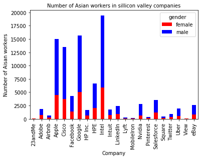

```python
#Part I
```

2


```python
import pandas as pd
```


```python
import numpy as np
```


```python
import os
```


```python
import matplotlib.pyplot as plt
```


```python
info_path = "/Users/Nancygong/Desktop/sv_diversity.csv"
```


```python
silicon_valley = pd.read_csv(info_path)
```


```python
#Plot a histogram representing the number of Aisan workers in Silicon Valley Companies

```


```python
sv = silicon_valley[(silicon_valley["count"] != "na") & (silicon_valley["race"] != "na")] 
sv_asian = sv[(sv["race"] == "Asian") & (sv["job_category"] == "Totals")]
sv_asian = sv_asian.reset_index()
sv_asian["count"] = sv_asian["count"].astype(float).fillna(0.0)

```


```python
from ggplot import *
```


```python
var = sv_asian.groupby(['company','gender'])["count"].sum()
var.unstack().plot(kind='bar',stacked=True,  color=['red','blue'])
plt.title('Number of Asian workers in sillicon valley companies', fontsize=10)
plt.xlabel('Company')
plt.ylabel('Number of Aisan workers')
plt.show()

```





3

Kaggle 
I am interested in the Dog Breed Identification Challenge. The goal of this challenge is to develop an algorithm to 
identify 120 breeds of dogs through their images with a limited number training images per class. This algorithm would
be useful for dog image classification in many applications including helping to identify homeless dogs for dog 
shelters. To submit this challenge, I need to use the train dataset of 120 breeds of dog images to develop an algorithm
through applying feature extraction and machine learning models. Then I would apply the algorithm to the test dataset 
of more than ten thousand dog images and predict a probability for each of the different breeds. Afterwards, I have to
compare the predictive results with the true type of dog in the images and calculate the accuracy of my algorithm. 
Based on the comparisons, I further modified my algorithms until I get a satisfied level of accuracy. When I finish 
developing the algorithm, I convert the table of probability of each breed for each dog into a csv file and submit it. 


Part II Improving a journal article 

I choose a research paper called “Technology addiction’s contribution to mental wellbeing: The positive effect of online social capital”. This research recruits 240 college students and measures their degrees of self-concealment, communication technology addiction, online social capital and well-being level through survey questions derived from existing multi-item scales. Then it applies the CFA models to analyze the data and conclude that “increased meditated communication(even addiction) may positively affect wellbeing for those prone to self-concealment” if online interactions can help them build their online social capital and relationships. 

The data collection process can be reformulated as human computation projects in two dimensions. First dimension is the choice of multi-item scales to measure the variables including communication technology addiction level, well-being level and etc. Very little explanation and credibility has been shown in the research regarding how the scales are selected and it only states that “we chose scales that were good fit for study goals and had been psychometrically validated in previous research”. However, misrepresentation of these scales could potentially hinder the estimated results of this research and choosing the most appropriate scales among many different options requires further cautious comparisons. In this case, research assistants or PhD students can be recruited to get involved in the process of identifying potential scales and leave them for the final determination of the researchers. Through this process better and more accurate scales will be chosen in our research and improves the accuracy of the results. 

In the other dimension, the sample population shouldn’t be restricted to college students as it could mispresent the population of our research interest. Besides, survey questions cannot measure the change of well-being over time. Instead, the researchers can recruit volunteers to participate in experiments over time and measure their well-being level changes as their use of communication technologies fluctuate over time. A larger number of online volunteers rather than college students increase the diversity and range of our sample population, making it possible to compare heterogenous effects between different subgroups. For instance, we can measure the differences in effects of online communication technology exposures on people with high self-concealment level and those with low self-concealment level.

Part III

The screen shot is in the folder
