EDA-1
================
Kanyao Han

Part I: Lab Notebook
====================

``` r
knitr::opts_chunk$set(message = FALSE, warning = FALSE)
options(digits = 3)
```

``` r
data(gss, package = "poliscidata")

# convert to tibble
library(tidyverse)
gss <- as_tibble(gss)
```

Basic Summary Statistics
------------------------

``` r
ggplot(gss, aes(race)) +
  geom_bar(aes(fill = race), show.legend = FALSE) +
  labs(title = "Race Number",
       x = "Race",
       y = "Number")
```

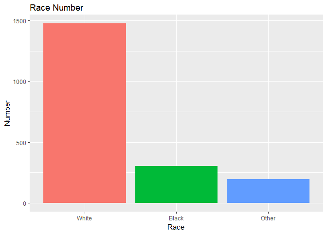

``` r
ggplot(gss, aes(income06)) +
  geom_bar(fill = "sky blue") +
  coord_flip() +
  labs(title = "Distribution of Income",
       x = "Income",
       y = "Count")
```

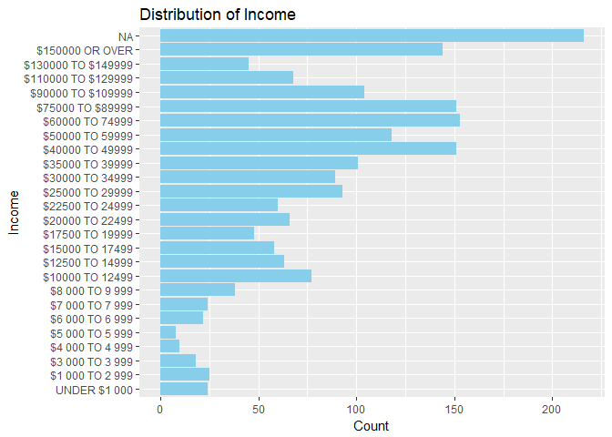

``` r
ggplot(gss, aes(degree, ..prop.., group = 1)) +
  geom_bar(show.legend = FALSE) +
  labs(title = "Education Distribution",
       x = "Degree",
       y = "Proportion")
```

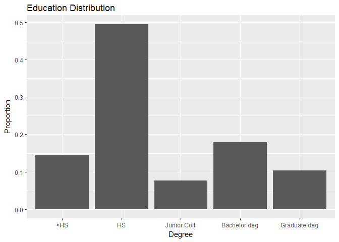

``` r
gss %>%
  drop_na(age_5) %>%
  ggplot(aes(degree, ..prop.., group = 1)) +
  geom_bar(show.legend = FALSE) +
  labs(title = "Education Distribution",
       x = "Degree",
       y = "Proportion") +
  facet_wrap(~ age_5) +
  coord_flip()
```

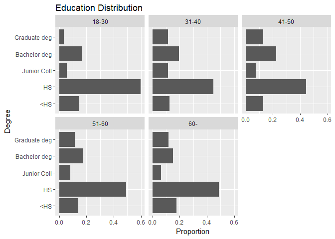

``` r
ggplot(gss, aes(age)) +
  geom_histogram(binwidth = 1, fill = "light green", color = "black") +
  labs(title = "Distribution of Age",
       x = "Income",
       y = "Count")
```

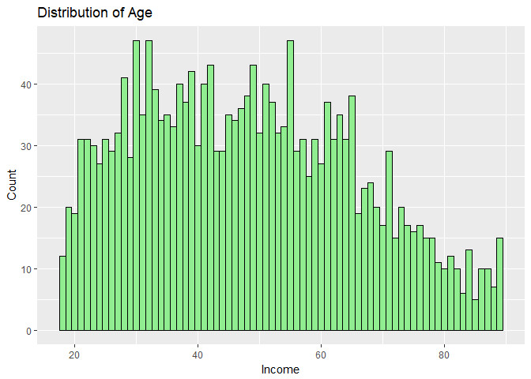

Racial Difference
-----------------

``` r
ggplot(gss, aes(as.integer(educ), color = race)) +
  geom_density() +
  labs(title = "Distribution of Eduction by Race",
       x = "Eduction Years",
       y = "Count")
```

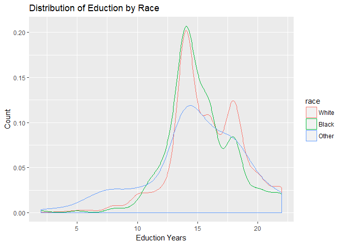

**White people has the best education level.**

``` r
ggplot(gss, aes(race, fill = marital)) +
  geom_bar(position = "fill") +
  labs(y = "Percentage") +
  scale_y_continuous(label = scales::percent) +
  labs(title = "Percentage of Marital Condition",
       x = "Race",
       y = "Percentage")
```

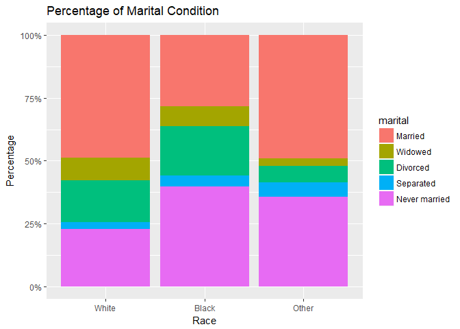

**Low marriage rate in Black group probably because of low socio-economic status.**

``` r
ggplot(gss, aes(marital, as.numeric(income06))) +
  geom_violin(fill = "sky blue") +
  geom_boxplot(width = 0.1, fill = "light green") +
  stat_summary(fun.y=mean, geom = "point", shape = 21, size = 1, fill = "red", color = "red") +
  labs(title = "Variation of Income",
       x = "Marital",
       y = "Income Level")
```

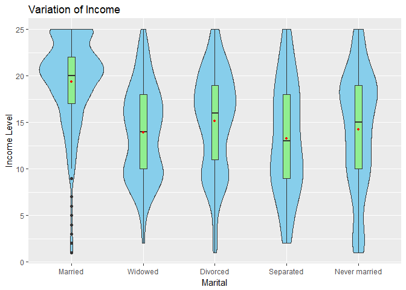

**Married group has the highest family income because it usually consists of two persons' incomes.**

``` r
gss %>%
  mutate(marital_1 = if_else(marital == "Married", "married", "non-married")) %>%
  drop_na(income06) %>%
  ggplot(aes(race, as.integer(income06))) +
  geom_violin(fill = "light blue") +
  geom_boxplot(width = 0.1, fill = "light green") +
  stat_summary(fun.y=mean, geom = "point", shape = 21, size = 1, fill = "red", color = "red") +
  facet_wrap(~ marital_1) +
  labs(title = "Variation of Income",
       x = "Marital",
       y = "Income Level")
```

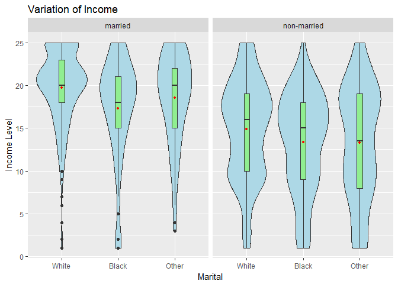

**White people have the highest economic status and Black people the lowest.**

``` r
ggplot(gss, aes(sex, as.numeric(educ))) +
  geom_boxplot(aes(fill = race), position = "dodge") +
  labs(title = "Variation of Eduction",
       x = "Race",
       y = "Education Years")
```

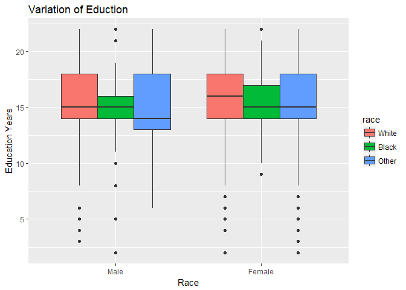

**White women have the highest education years.**

Education and Income
--------------------

``` r
ggplot(gss, aes(as.integer(income06), color = educ_4)) +
  geom_density() +
  labs(title = "Distribution of Income",
       x = "Income Level",
       y = "Density")
```

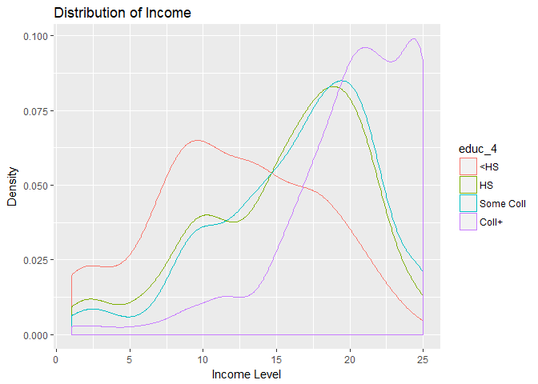

``` r
gss %>%
  drop_na(age_5, income06) %>%
  ggplot(aes(as.numeric(educ), as.integer(income06))) +
  geom_jitter(alpha = 0.4, color = "sky blue") +
  geom_smooth(se = FALSE, color = "orange") +
  geom_smooth(se = FALSE,method = "lm", color = "purple") +
  labs(title = "Relationship between Income Level and Education Years",
       x = "Education Years",
       y = "Income Level")
```

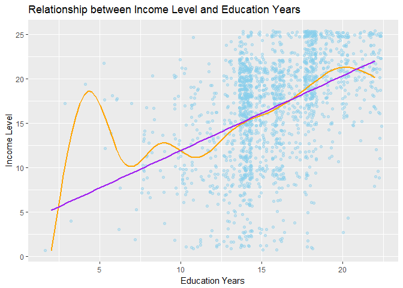

``` r
gss %>%
  drop_na(age_5, income06) %>%
  ggplot(aes(as.numeric(educ), as.integer(income06))) +
  geom_jitter(alpha = 0.4, color = "sky blue") +
  geom_smooth(se = FALSE, color = "orange") +
  facet_wrap(~ marital) +
  labs(title = "Relationship between Income Level and Education Years",
       x = "Education Years",
       y = "Income Level")
```

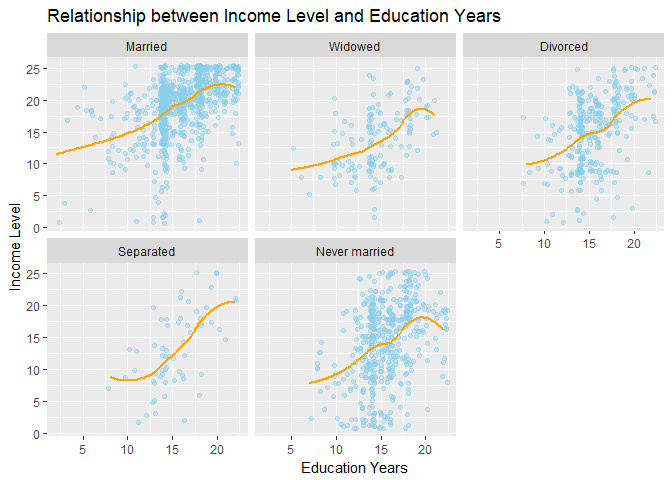

**Positive Correlation between Income and Education**

``` r
gss1 <- filter(gss, as.numeric(educ) >= 7)

gss1 %>%
  drop_na(age_5, income06) %>%
  ggplot(aes(as.integer(educ), as.integer(income06))) +
  geom_jitter(alpha = 0.4, color = "sky blue") +
  geom_smooth(se = FALSE, color = "orange") +
  geom_smooth(se = FALSE,method = "lm", color = "purple") +
  labs(title = "Relationship between Income Level and Education Years",
       x = "Education Years",
       y = "Income Level")
```

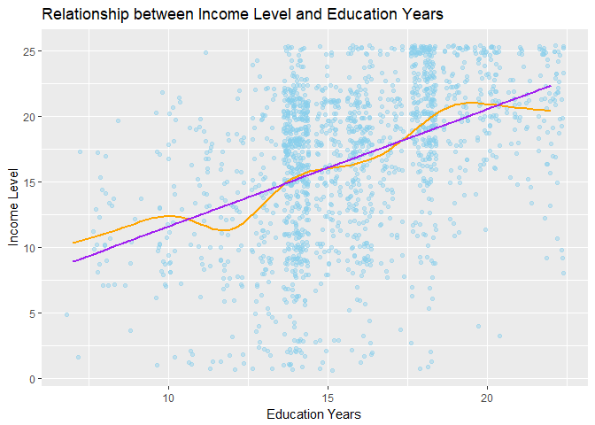

**Removing outliers**

``` r
gss1 %>%
  drop_na(age_5, income06) %>%
  ggplot(aes(as.numeric(educ), as.integer(income06))) +
  geom_jitter(alpha = 0.4, color = "sky blue") +
  geom_smooth(se = FALSE, color = "orange") +
  facet_grid(age_5 ~ race) +
  labs(title = "Relationship between Income Level and Education Years",
       x = "Education Years",
       y = "Income Level")
```

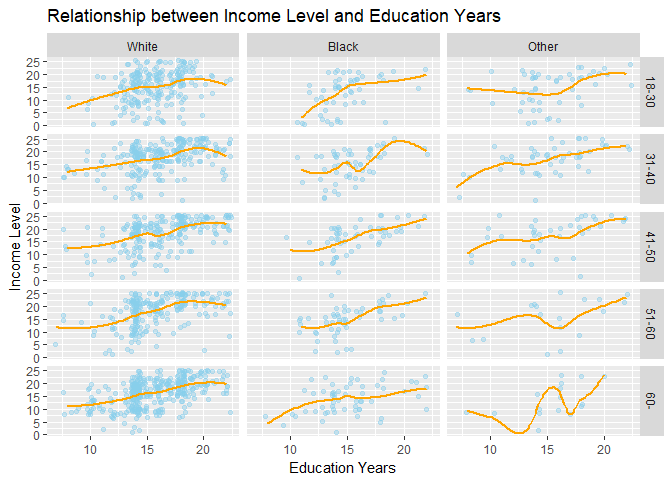

Family Member Number, Education and Income
------------------------------------------

``` r
gss2 <- gss %>%
  group_by(race) %>%
  drop_na(childs, sibs) %>%
  summarize(mean_childs = mean(childs), mean_sibs = mean(sibs)) %>%
  gather(mean_childs, mean_sibs, key = "type", value = "number")
 
ggplot(gss2, aes(type, number, fill = race)) +
  geom_col(position = "dodge") +
  labs(title = "Number of Family Members",
       x = "Race",
       y = "Number")
```

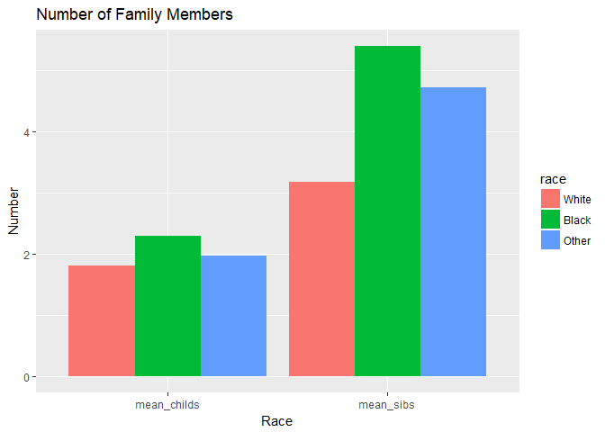

**Average children number are larger than average siblings.**

``` r
gss3 <- gather(gss, childs, sibs, key = "type", value = "number")

ggplot(gss3, aes(number, fill = type)) +
  geom_bar(show.legend = FALSE) +
  facet_wrap(~ type) +
  labs(title = "Distribution of Numbers of Family Members",
       x = "Number of Family Memebers",
       y = "Count")
```

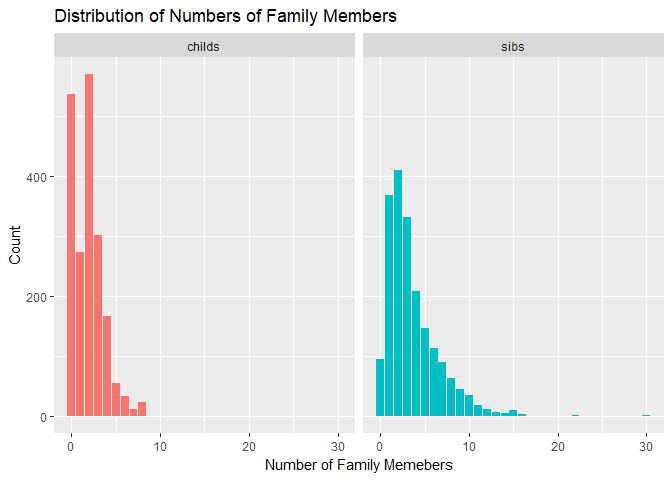

``` r
ggplot(gss3, aes(as.numeric(educ), number, color = type)) +
  geom_jitter(alpha = 0.2) +
  geom_smooth() +
  labs(title = "Relationship between Family Member Number and Education Years",
       x = "Education Years",
       y = "Number")
```

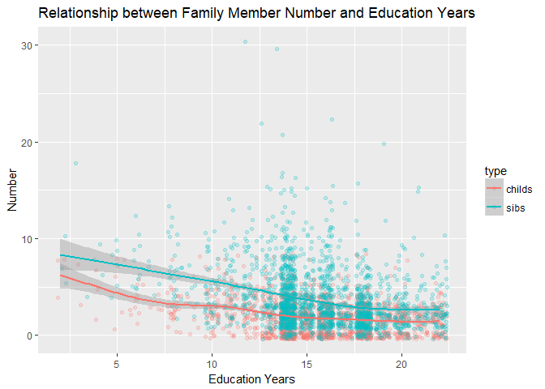

**Higher education, less siblings and childrens.**

``` r
gss3 %>%
  filter(number < 15) %>%
  ggplot(aes(as.numeric(educ), number, color = type)) +
  geom_jitter(alpha = 0.2) +
  geom_smooth() +
  labs(title = "Relationship between Family Member Number and Education Years",
       x = "Education Years",
       y = "Number")
```

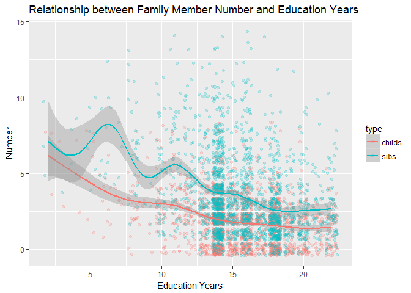

**Removing outliers**

``` r
gss %>%
  group_by(age_5) %>%
  drop_na(childs, sibs, age_5) %>%
  summarize(mean_childs = mean(childs), mean_sibs = mean(sibs)) %>%
  gather(mean_childs, mean_sibs, key = "type", value = "number") %>%
  ggplot(aes(type, number, fill = age_5)) +
  geom_col(position = "dodge") +
  labs(title = "Average Family Member Numbers by Age",
       x = "Type",
       y = "Average Number",
       fill = "Age Cohort")
```

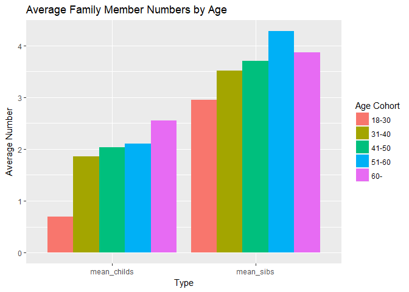

``` r
ggplot(gss3, aes(age, number)) +
  geom_jitter(alpha = 0.2, aes(color = type)) +
  geom_smooth() +
  facet_wrap(~ type, scale = "free") +
  labs(title = "Relationship between Family Member Number and Age",
       x = "Age",
       y = "Number")
```

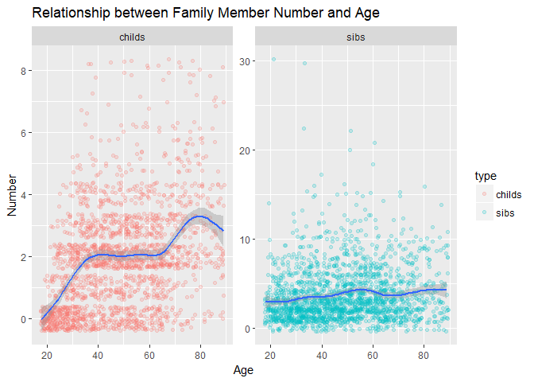

``` r
gss3 %>%
  filter(number < 15) %>%
  ggplot(aes(as.integer(income06), number, color = type)) +
  geom_jitter(alpha = 0.2) +
  geom_smooth() +
  labs(title = "Relationship between Family Member Number and Income Level",
       x = "Income Level",
       y = "Number")
```

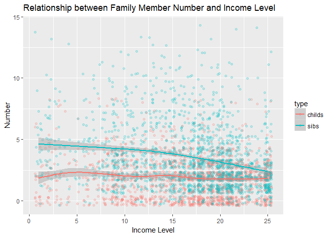

**Higher income, less children and siblings.**

``` r
gss3 %>%
  filter(number < 15) %>%
  ggplot(aes(as.integer(income06), number, color = type)) +
  geom_jitter(alpha = 0.2) +
  geom_smooth() +
  labs(title = "Relationship between Family Member Number and Income Level",
       x = "Income Level",
       y = "Number") +
  facet_wrap(~ degree)
```

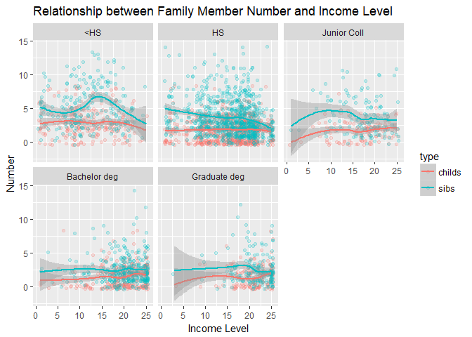

``` r
gss %>%
  filter(sibs <= 15) %>%
  group_by(income06) %>%
  drop_na(childs, sibs, income06) %>%
  summarize(mean_childs = mean(childs), mean_sibs = mean(sibs)) %>%
  gather(mean_childs, mean_sibs, key = "type", value = "number") %>%
  ggplot(aes(type, number, fill = income06)) +
  geom_col(position = "dodge") +
  labs(title = "Distribution of Family Member Number by Income Level",
       x = "Income Level",
       y = "Number")
```

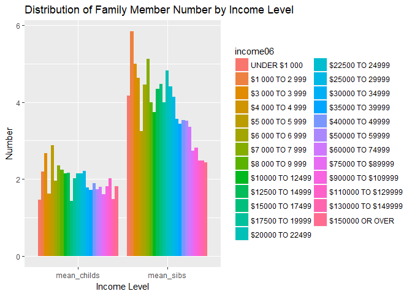

Spritual Life, Education and Happiness
--------------------------------------

``` r
gss %>%
  drop_na(postlife, degree) %>%
  ggplot(aes(degree, fill = postlife)) +
  geom_bar(position = "fill") +
  scale_y_continuous(label = scales::percent) %>%
  labs(title = "Postlife and Education",
       x = "Education")
```


``` r
gss %>%
  drop_na(reliten, degree) %>%
  ggplot(aes(degree, fill = reliten)) +
  geom_bar(position = "fill") +
  labs(y = "Percentage") +
  scale_y_continuous(label = scales::percent) +
  labs(title = "Religion and Education",
       x = "Education")
```

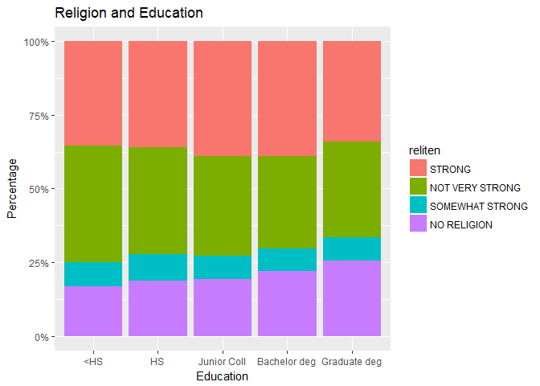

``` r
gss %>%
  group_by(degree) %>%
  drop_na(degree, reliten) %>%
  summarize(mean_reliten = mean(as.numeric(reliten))) %>%
  ggplot(aes(degree, mean_reliten, fill = degree)) +
  geom_col() +
  geom_errorbar(aes(ymin = min(mean_reliten), ymax = max(mean_reliten))) +
  labs(title = "Religion and Education",
       subtitle = "Higher Score, Less Relitious",
       x = "Education",
       y = "Religion Score")
```

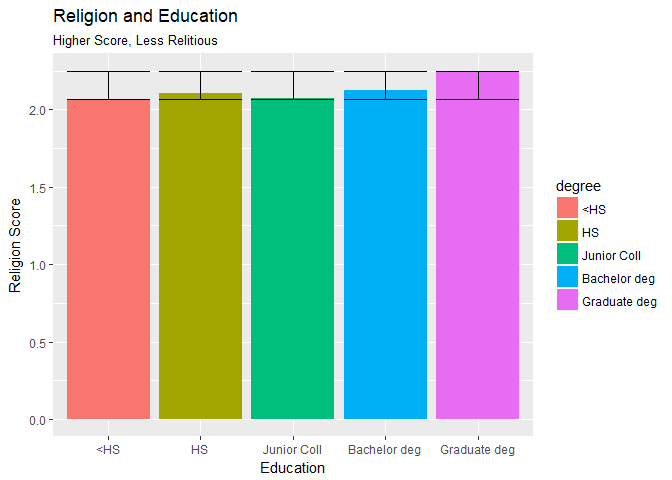

**Higher education, less religious**

``` r
gss %>%
  drop_na(reliten, happy) %>%
  ggplot(aes(reliten, fill = happy)) +
  geom_bar(position = "fill") +
  scale_y_continuous(label = scales::percent) +
  coord_flip() +
  labs(title = "Religion and Happiness",
       x = "Religion",
       y = "Happiness")
```

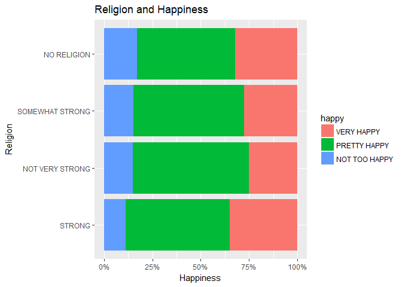

**More religious, more happy**

``` r
gss %>%
  drop_na(postlife, happy) %>%
  ggplot(aes(postlife, fill = happy)) +
  geom_bar(position = "fill") +
  scale_y_continuous(label = scales::percent) +
  coord_flip() +
    labs(title = "Postlife and Happiness",
       x = "Postlife",
       y = "Happiness")
```

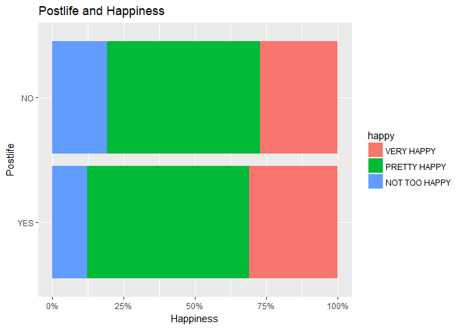

``` r
gss3 %>%
  drop_na(number, happy) %>%
  group_by(number, type) %>%
  summarize(mean_happy = mean(as.numeric(happy))) %>%
  ggplot(aes(number, mean_happy, color = type)) +
  geom_line(show.legend = FALSE) +
  facet_wrap(~ type, scale = "free") +
    labs(title = "Family Member Number and Happiness",
       x = "Number",
       y = "Average Happiness")
```

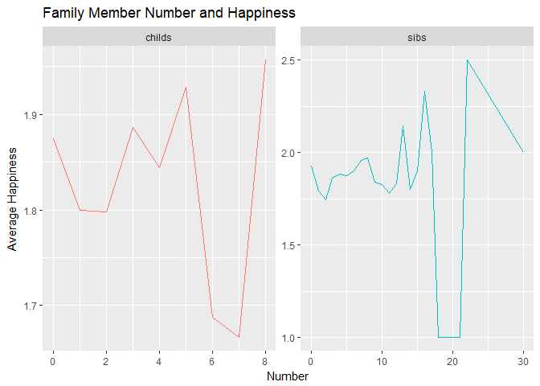

**Excluding outliers, generally, more children and siblings, more happy**

``` r
gss %>%
  group_by(degree) %>%
  drop_na(degree, happy) %>%
  summarize(mean_happiness = mean(as.numeric(happy))) %>%
  ggplot(aes(degree, mean_happiness, fill = degree)) +
  geom_col() +
  labs(title = "Education and Happiness",
       x = "Education",
       y = "Happy Score")
```

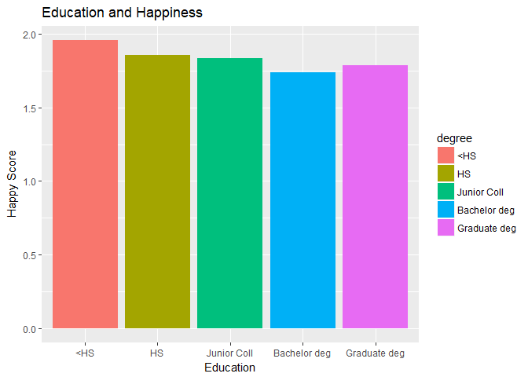

Ideology and Education
----------------------

``` r
gss4 <- gss %>%
  mutate(ideology = as.numeric(social_cons3) + as.numeric(racial_liberal3) + 
           as.numeric(reliten) + as.numeric(fund) -
           as.numeric(polviews) - as.numeric(partyid))


ggplot(gss4, aes(ideology)) +
  geom_bar(fill = "light green") +
    labs(title = "Ideology Distribution",
       x = "Ideology Score",
       y = "Count")
```

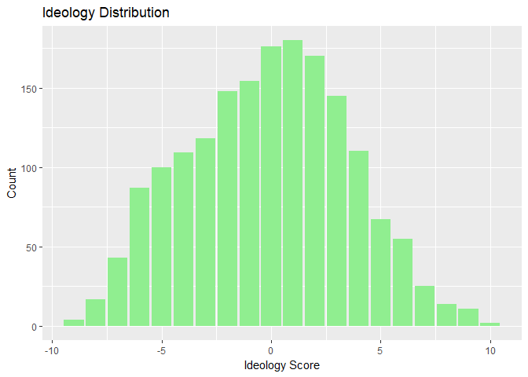

``` r
ggplot(gss4, aes(ideology, fill = race)) +
  geom_bar(show.legend = FALSE) +
  facet_wrap(~ race, scale = "free", ncol = 2) +
  labs(title = "Ideology Distribution by race",
       x = "Ideology Score",
       y = "Count")
```

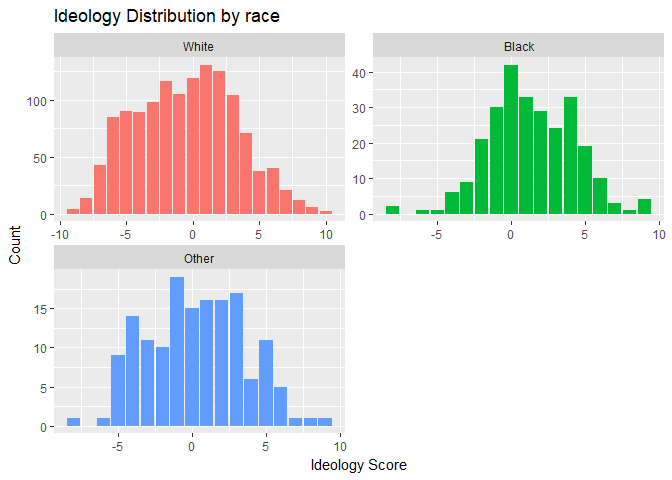

``` r
ggplot(gss4, aes(race, ideology)) +
  geom_violin() +
  stat_summary(fun.y=mean, geom = "point", shape = 21, size = 1, fill = "red", color = "red") +
  labs(title = "Ideology Distribution",
       x = "Race",
       y = "Ideology Score")
```

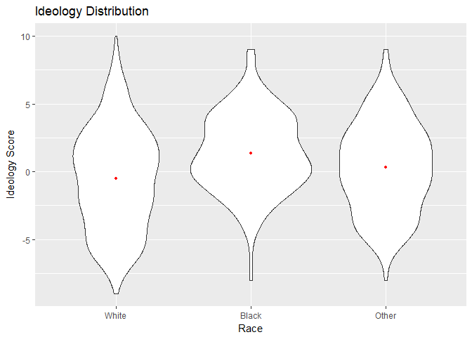

**Generally White people are more conservative.**

``` r
ggplot(gss4, aes(as.numeric(educ), ideology)) +
  geom_jitter(alpha = 0.2) +
  geom_smooth() +
  labs(title = "Relationship between Ideology and Eduction Years",
       x = "Education Years",
       y = "Ideology Scores")
```

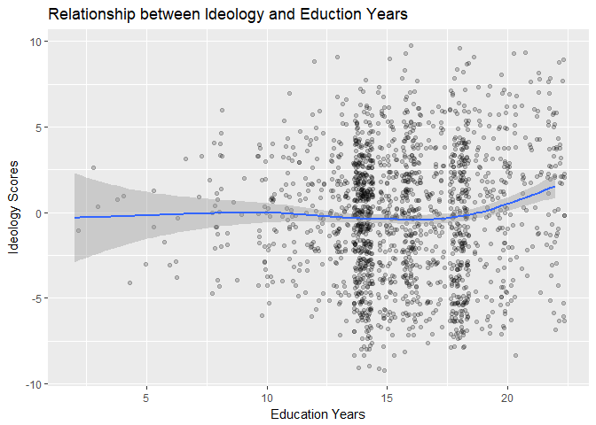

``` r
ggplot(gss4, aes(degree, ideology)) +
  geom_violin() +
  stat_summary(fun.y=mean, geom = "point", shape = 21, size = 1, fill = "red", color = "red") +
  labs(title = "Ideology and Education",
       x = "Education",
       y = "Ideology Scores")
```


**Graduate degree students are more liberal.**

``` r
ggplot(gss4, aes(as.integer(income06), ideology)) +
  geom_jitter(alpha = 0.2) +
  geom_smooth(method = "lm") +
  labs(title = "Relationship between Ideology and Income",
       x = "Income Level",
       y = "Ideology Scores")
```

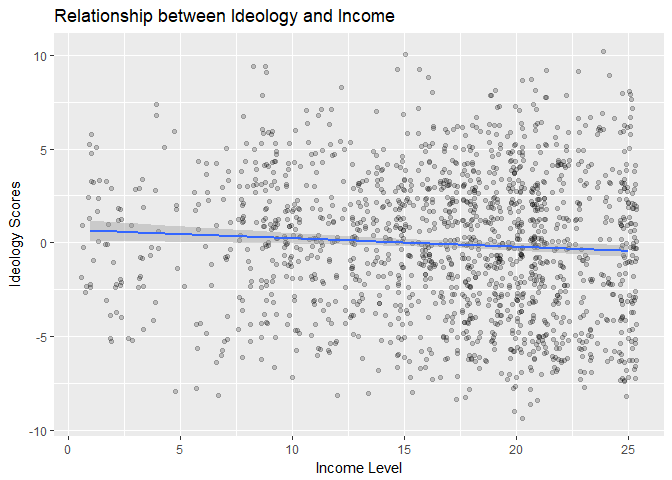

``` r
ggplot(gss4, aes(age, ideology)) +
  geom_jitter(alpha = 0.2) +
  geom_smooth(method = "lm") +
  labs(title = "Relationship between Ideology and Age",
       x = "Age",
       y = "Ideology Scores")
```

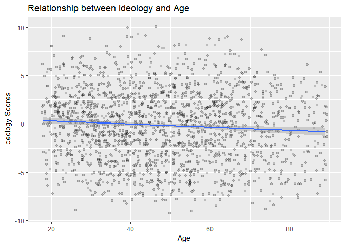

Part II: Exploration write-up
=============================

The General Social Survey contains a lot of socio-demographic information such as income, sex, education level, ideological standpoint, and so forth. In this paper I will explore the influence of education. The focus will be on its relationship with income, family member number, spiritual life and ideological standpoint.

In the first graph we can first know that more than half number of people in this sample have high school or higher degree no matter in which age cohort. Furthermore, this graph also shows that larger proportion of people in younger age cohorts obtain bachelor's or higher degree. Some people may be surprising that the age cohort of 18 - 30 is a little bit abnormal because its proportion of college+ people is much lower than any other cohort. However, considering that many people in this age cohort are still in college or even in high school, this exception is definitely normal.

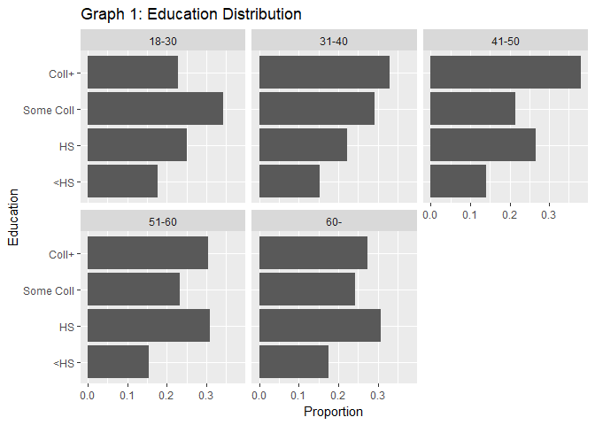

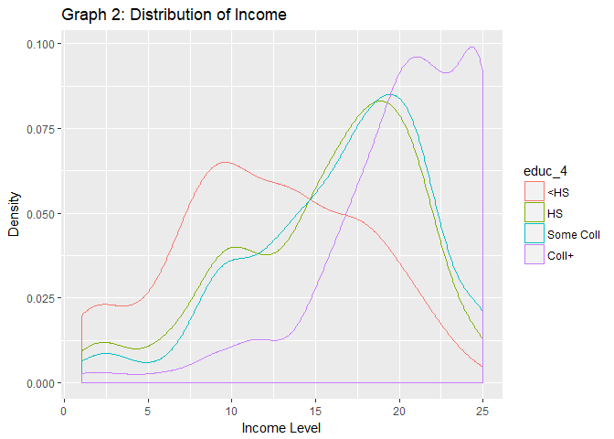

Now let's explore the relationship between education and income. As the second graph shows, those who obtain college or graduate degree are much more likely to obtain a higher income level. (It is worth noting that here I transform the 25 income intervals as 25 income level.) Besides, Graph 3 and Graph 4, which has removed the outliers, display that education year has a positive correlation with income in almost any age cohort and racial group. Most Pearson correlation coefficients are around 0.45, which is relatively high in social sciences. Additionally, the general correlation in Black group seems more close than White group. A reasonable explanation is that Black people are generally socio-economically weaker so that they have less social capital and should only rely on their own ability represented by education. For example, White people with low education might be more likely to find a good job with the help of their family members or friends who have a relatively higher socio-economic status. In this case, the influence of education on income in White group is reduced.

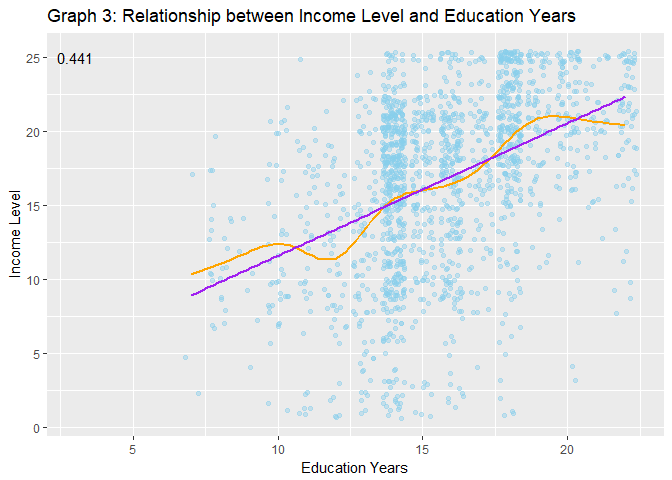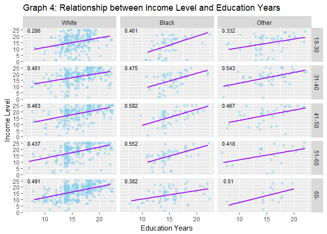

In addition to income, education can also be correlated with number of childrens and siblings. Graph 5, which has removed outliers, shows the relationship between family member number and education level. Generally speaking, education level is negatively correlated with both sibling number and children number. Besides, it is interesting that the predicted sibling number is always bigger than the predicted children number in any age. Given that the sibling number indicates the older generation's children number, we can thus assume that both sibling number, children number and thus birth rate are declining generation by generation. Graph 6 confirms this assumption. The only exception is the sibling number in the age cohort of 60+ that is smaller than 51 - 60 cohort.

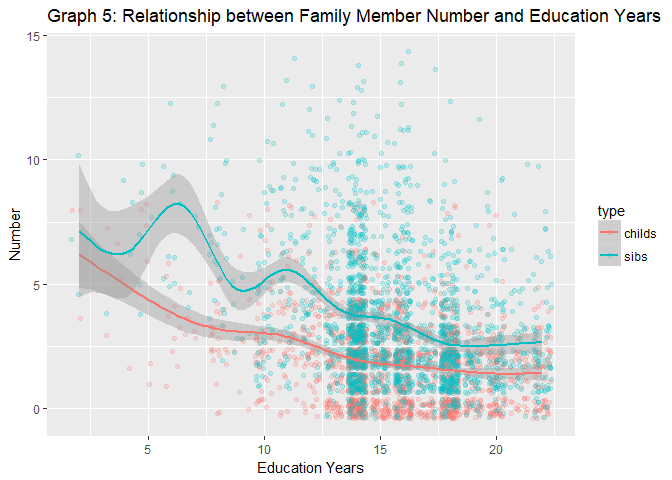

Education level cannot only be correlated with material resources, but also cultural activities. First, Graph 7 shows that lower educated people are more likely to have a stronger tie with religion. Second, I calculate the general ideology by combining several political and social variables such as party identity and attitudes toward racial problems. I find that although there is no big difference of mean and median ideology among other groups, people with graduate degree are more liberal than other groups. Finally, it is a pity that higher education level generally predicts lower happiness although people with graduate degree are slightly happier than those with bachelors degree. However, this fact does not necessarily indicate that higher education level would directly lead to lower happiness. Specifically, although I would not analyze other variables due to word limits, it is easier to find in graphs of the first part(lab notebook) that religious emotion and the number of children or sibling are positively correlated with happiness, which are negatively correlated with education level. Therefore, education level may influence other variables first and the latter further influence happiness.

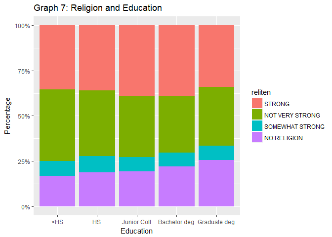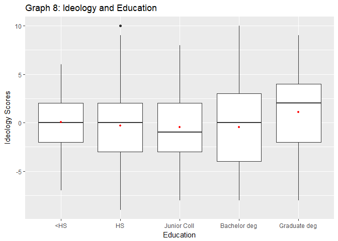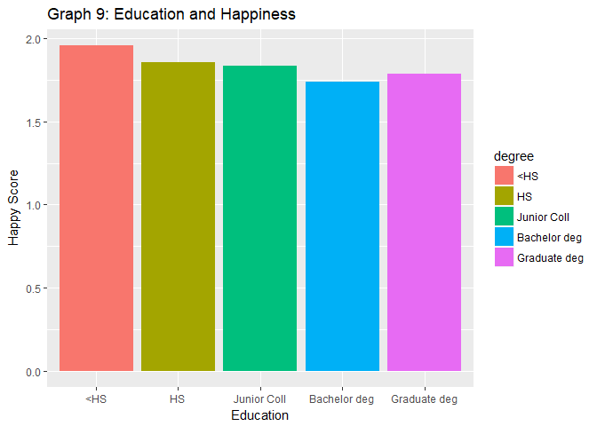

In conclusion, education level can be a predictor of many other variables. However, its effectiveness in this data and this paper should not be overestimated. First, the sample still needs to be weighted according to the population proportion in the United States since it does not necessarily reflect the real composition in the real word. Second, I take advantage of jittering point instead of real point to generate regression line in ggplot. This method will increase the variance of the sample and lower the predictory power. Finally, most analyses in this paper have to be tested by statistical inference with a set of control variables.
