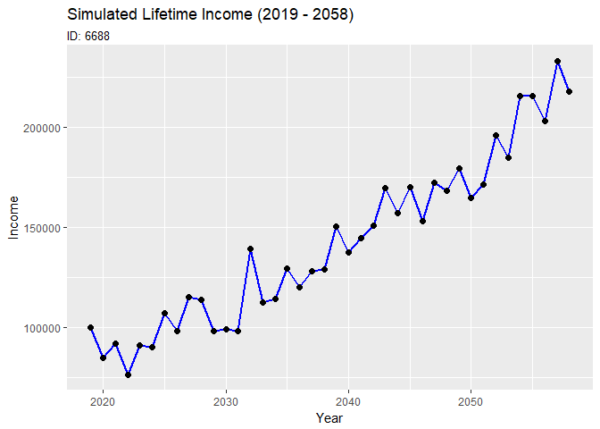
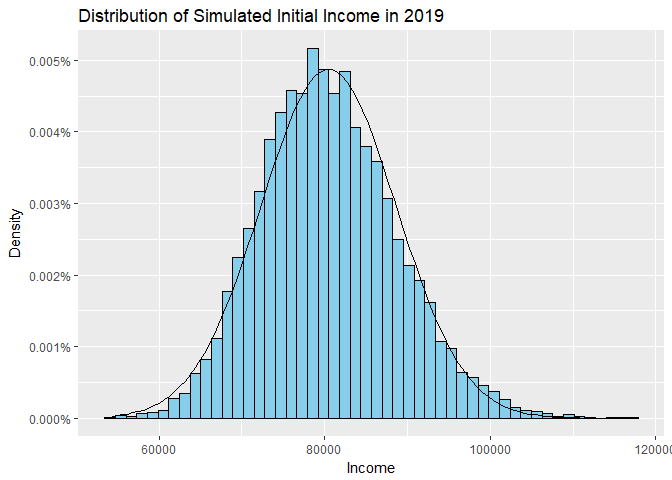
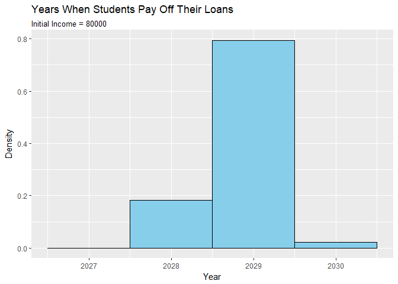
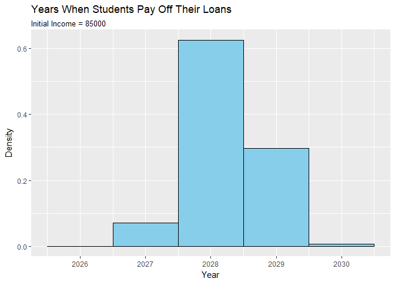

Simulation
================
Kanyao Han
Nov 3, 2017

There are two files for this assignment, one markdown and one R markdown. You can run my codes in R markdown file or review all results in markdown file.

``` r
library(tidyverse)
```

    ## + ggplot2 2.2.1          Date: 2017-11-04
    ## + tibble  1.3.3             R: 3.4.2
    ## + tidyr   0.6.3            OS: Windows 10 x64
    ## + readr   1.1.1           GUI: RTerm
    ## + purrr   0.2.2.2      Locale: English_United States.1252
    ## + dplyr   0.7.2            TZ: America/Chicago
    ## + stringr 1.2.0        
    ## + forcats 0.2.0

    ## -- Conflicts ----------------------------------------------------

    ## * filter(),  from dplyr, masks stats::filter()
    ## * lag(),     from dplyr, masks stats::lag()

``` r
library(sca)
```

Simulation Function with Tidy Data
----------------------------------

``` r
# Create the simulation function.

inc_function <- function(n_year, st_year, n_sample,
                         inc0, mu, sde, p, g){
  
  set.seed(6688)
  
# Create a matrix about normal distributed errors
  
  error_ln <- t(matrix(rnorm(n_sample * n_year, mean = mu, sd = sde), 
                     nrow = n_year))

# Preallocate a matrix about log income and then use for loop to assign values.
# In stastical model I replace (t - 2019) with (i[year] - 1). They are actually the same thing. 
  
  inc_ln <- matrix(nrow = n_sample, ncol = n_year)
  inc_ln[,1] <- log(inc0) + error_ln[,1]
  for(i in 2 : n_year){
      inc_ln[, i] <- (1 - p) * (log(inc0) + g * (i - 1)) +
        p * inc_ln[, i - 1] + error_ln[, i]
  }

# Tidy data and make sure the input is a tibble with years and incomes. 

  year <- c(st_year : (st_year + n_year - 1)) %>%
    as.tibble() %>%
    rename(year = value)
  
  sim_inc <- inc_ln %>%
    t() %>%
    as.tibble() %>%
    bind_cols(year) %>%
    gather(ID, inc_ln, 1 : n_sample) %>%
    mutate(inc = exp(inc_ln))
  
  return(sim_inc)
}
```

### Normal Distribution?

This function will generate a tidy data frame with tibble format containing 4 variables: year, ID, log income and income.

First question: Plot one of the lifetime income.
------------------------------------------------

``` r
# Simulate data

sim_inc <- inc_function(n_year = 40, st_year = 2019, n_sample = 10000, 
                       inc0 = 80000, mu = 0, sde = 0.1, p = 0.2, g = 0.03)

# Generate a graph simulating NO.6688 Income

sim_inc %>%
  filter(ID == "V6688") %>%
  ggplot(aes(year, inc)) +
  geom_line(color = "blue", size = 1) +
  geom_point(size = 2) +
  labs(title = "Simulated Lifetime Income (2019 - 2058)",
       subtitle = "ID: 6688",
       x = "Year", y = "Income")
```



Second question: Plot a histogram and answer questions.
-------------------------------------------------------

``` r
# Filter the year of 2019

sim_19 <- sim_inc %>%
  filter(year == 2019)

# Generate the histrogram and a normal distribution curve with same mean and standard error. 
  
ggplot(sim_19, aes(inc)) +
  scale_y_continuous(label = scales::percent) +
  geom_histogram(aes(y = ..density..), bins = 50, 
                 fill = "sky blue", color = "black") +
  stat_function(fun = dnorm, args = list(mean = mean(sim_19$inc),
                                         sd = sd(sim_19$inc))) +
  labs(title = "Distribution of Simulated Initial Income in 2019",
       x = "Income", y = "Density")
```



**Through Comparing the histogram with normal distribution curve, the distribution of of the histogram is extraordinarily close to normal distribution.**

### Income &gt; 100,000 dollars

``` r
rate_100k <- percent(nrow(filter(sim_19, inc > 100000)) / nrow(sim_19), d = 2)
rate_100k
```

    ## [1] "1.46 %"

### Income &lt; 70,000 dollars

``` r
rate_70k <- percent(nrow(filter(sim_19, inc < 70000)) / nrow(sim_19), d = 2)
rate_70k
```

    ## [1] "9.26 %"

**In my simulated data, around <u>1.46%</u> students will earn more than 100,000 dollors and <u>9.26%</u> students will earn less than 70,000 dollors.**

Thrid question: In what percentage of simulations you can pay off the loan in 10 years?
---------------------------------------------------------------------------------------

``` r
# First, use cumsum, mutate and group_by fucntions to generate a new variable "cumulative payoff".
# Second, filter the cumulative payoff that is higher than 95,000 dollors
# Third, filter the minimum cumulative payoff of each ID so that we obtain the year of final payoff of them.

cum_pay <- sim_inc %>%
  group_by(ID) %>%
  mutate(cum_pay = cumsum(0.1 * inc)) %>%
  filter(cum_pay >= 95000) %>%
  group_by(ID) %>%
  filter(cum_pay == min(cum_pay))

# Generate a histogram.

ggplot(cum_pay, aes(year, ..density..)) +
  geom_histogram(bins = 4.7, fill = "sky blue", color = "black") +
    labs(title = "Years When Students Pay Off Their Loans",
         subtitle = "Initial Income = 80000",
         x = "Year", y = "Density")
```



### Percent of simulations of paying off the loan in 10 years:

``` r
payoff_before_28 <- percent(nrow(filter(cum_pay, year < 2029)) / nrow(cum_pay), d = 2)
payoff_before_28
```

    ## [1] "18.27 %"

**In <u>18.27%</u> simulations I can pay off the loan in 10 years.**

Fourth question: In what percentage of simulations you can pay off the loan in 10 years if the initial income is 85000 dollars and the standard deviation is 0.15?
------------------------------------------------------------------------------------------------------------------------------------------------------------------

``` r
# simulate the second set of data
sim_inc1 <- inc_function(n_year = 40, st_year = 2019, n_sample = 10000, 
                       inc0 = 85000, mu = 0, sde = 0.15, p = 0.2, g = 0.03)

# Steps are the same as the third question.
cum_pay1 <- sim_inc1 %>%
  group_by(ID) %>%
  mutate(cum_pay = cumsum(0.1 * inc)) %>%
  filter(cum_pay >= 95000) %>%
  group_by(ID) %>%
  filter(cum_pay == min(cum_pay))

ggplot(cum_pay1, aes(year, ..density..)) +
  geom_histogram(bins = 5, fill = "sky blue", color = "black") +
    labs(title = "Years When Students Pay Off Their Loans",
         subtitle = "Initial Income = 85000",
         x = "Year", y = "Density")
```



### Percent of simulations of paying off the loan in 10 years:

``` r
payoff1_before_28 <- percent(nrow(filter(cum_pay1, year < 2029)) / nrow(cum_pay1), d = 2)
payoff1_before_28
```

    ## [1] "69.65 %"

**In <u>69.65%</u> simulations I can pay off the loan in 10 years.**
