EDA\_Explanation
================
hyunku kwon

Who divides? social and political characteristics of partisan polarization
==========================================================================

In the recent years, scholarly controversy over the political polarization in the American public has been heated (Fiorina and Abrams 2008; Lelkes 2016). General consensus about the increasing partisan hatred between Republicans and Democrats in the mass public notwithstanding, researchers have disagreed on the extent of, and the characteristics of partisan conflict (Fiorina and Abrams 2008; Abramowitz and Saunders 2008; Iyengar et al 2012). This research partially contributes to this line of research, by examining who Republicans and Democrats are: how they differ in terms of various political and social parameters.

Core findings include the following: first, we found that Republicans and Democrats share political viewpoints in various political domains. This finding implies that the heightened polarization between Republicans and Democrats may not mainly stem from disagreement over what government should do. Second, this research focuses on trust and confidence. Polarization is based on high level of conflict and us-against-them mentality, and such properties are highly related with social trust. Contra folk theory which spots Republicans as the culprit behind heightened conflict, this exploration suggests that Republicans are more likely to trust generalized others. Also, examining the patterns of trust in institutions, this research finds that Republicans and Democrats have heterogeneous evaluations of the political and social world.

Divided over what?
------------------

Scholars have warned that American politics is more divided over political issues, leading to “culture wars.” However, this research shows that Republicans and Democrats are likely to show similar political positions. This research draws on the following question to investigate the political positions: “We are faced with many problems in this country, none of which can be solved easily or inexpensively. I'm going to name some of these problems, and foreach one I'd like you to name some of these problems, and for each one I'd like you to tell me whether you think we're spending too much money on it,too little money, or about the right amount.” This index is frequently used to measure political viewpoints (Ellis and Stimson 2012)

Results show that Republicans and Democrats actually show similar viewpoints in many dimensions. Both partisans think that the government should spend more on drug addiction, education, social security, and energy policy; that government is spending too much on foreign aid; that the government is spending the right amount for parks and recreation, and supporting science. Though less similar, both think that the government is spending “too much” on welfare. This was surprising for the welfare issue has been regarded as one of the most polarizing issues.

Partisans are polarized over childcare issue, where democrats think American government is spending too little and Republicans too much or about right; similar pattern shows in environment, nation’s health, and solving problems of big cities. On the contrary, on space exploration program, Democrats think the government is spending too much while Republicans about right; similar pattern can be found in military spending.

To sum up, Republicans and Democrats seem to share similar viewpoints along various political and social issues. However, while Republicans want the government to spend more on army and space, Democrats more social, environment, and city issues. It can be said that Republicans more prioritize “state,” and Democrats “society”.

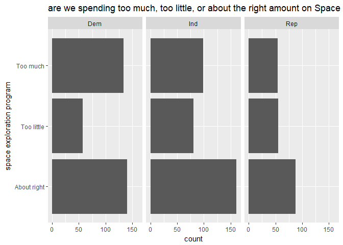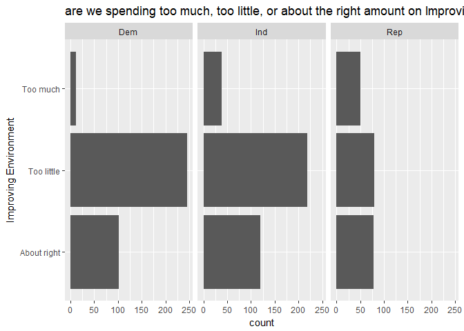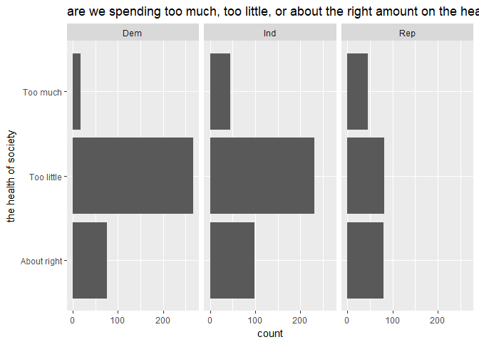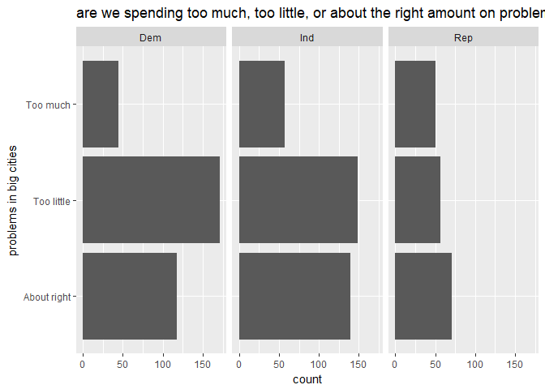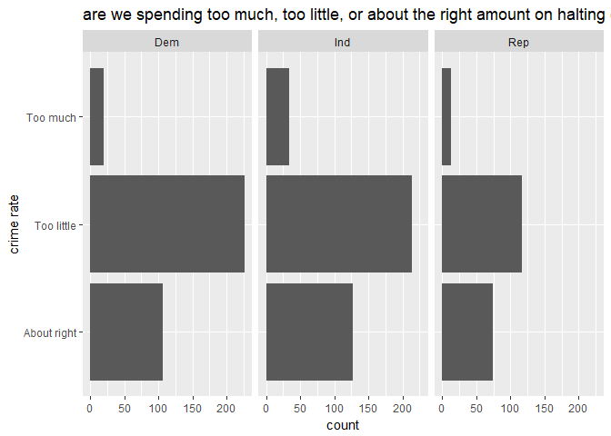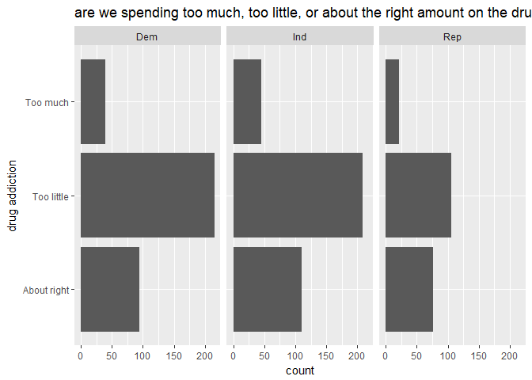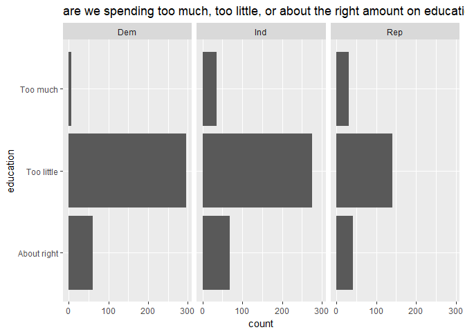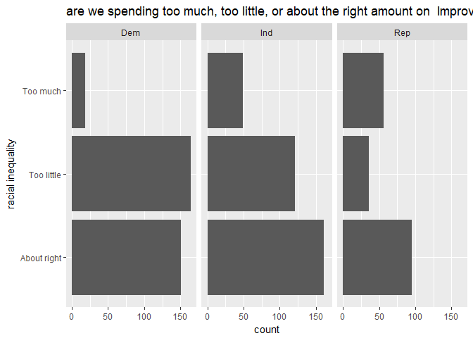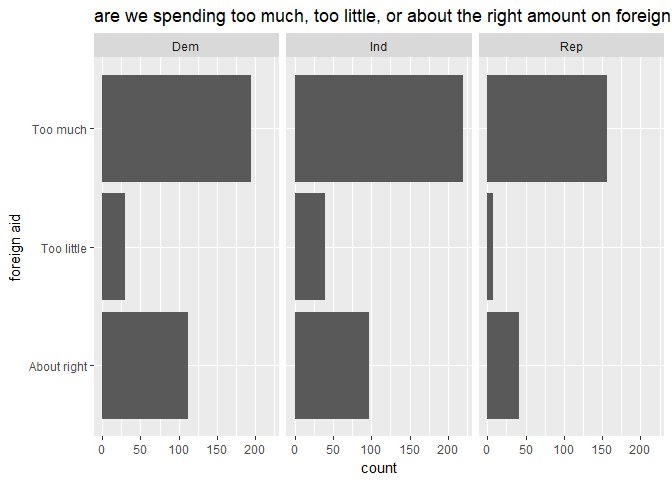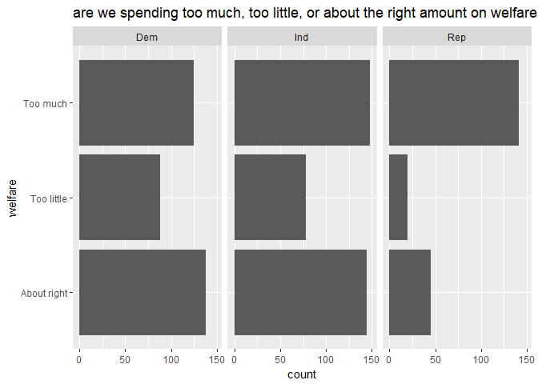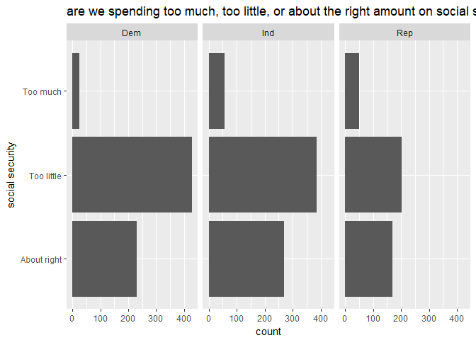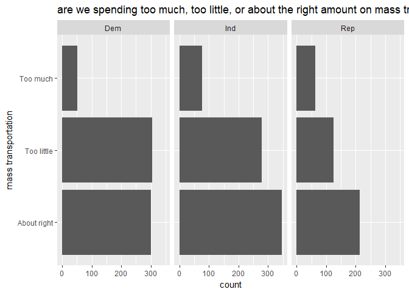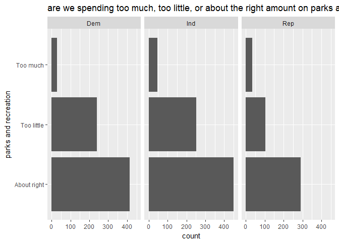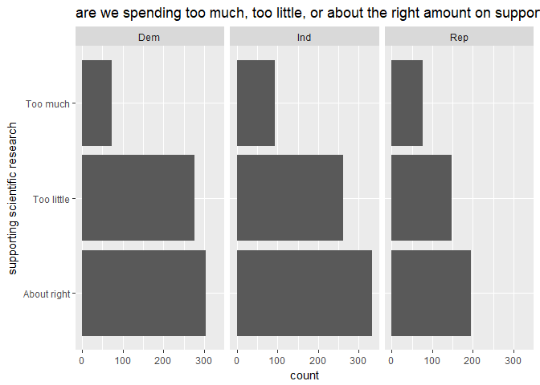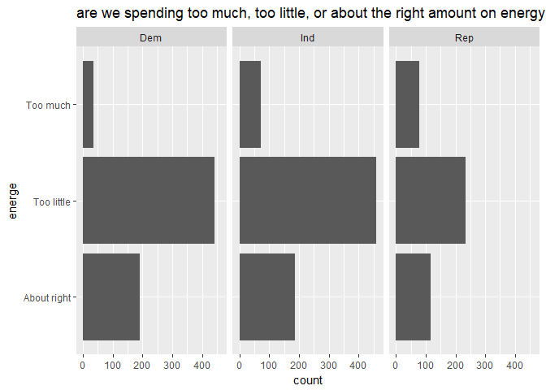

Trust and partisans
-------------------

It seems Republicans and Democrats show divergent patterns in trust and social life. First, in terms of social trust, Republicans are more likely to trust generalized others; Democrats are less likely; Independents are the least trusting. Such results are somewhat surprising, considering the fact that partisan divide has been regarded as undermining social capital in the U.S., and that Republicans have been spotted as the culprit behind such conflictual politics and society. Also, it is very interesting that Independents are the least trusting. Few research has been done on understanding Independents, and thus few characteristics have been uncovered about them. This preliminary study shows that Independents have distinct patterns in some aspects, and thus should be investigated.

In terms of social networks, Democrats are shown to be socially more connected than Republicans. This result is interesting, considering conservative ideologies which focus on associational lives and “voluntary” civil society. To understand whether such quantitative difference in social networks are related with qualitative one, I would investigate the associational patterns for future study.

Finally, Republicans and Democrats have shown diverging tendencies in trusting various institutions. While Republicans seem to have more confidence in business sector and religion than Democrats, Democrats show more trust towards federal government, labor organization, press, TV, and education system than Republicans. However, they both trust Supreme court, medicine, science, and army, but both mistrust towards legislative process.

Such results show that the partisan division in the Republicans and Democrats is related with diverging evaluations of the political and social world. Similarity in political viewpoints notwithstanding, diverging understanding of the world might lead to intensified conflict. Drawing on such findings, in understanding polarization, we should extend from merely examining the distributions of political positions in the mass public, to studying how individuals make sense of the world. In other words, ‘cultural’ approach is required for polarization studies.

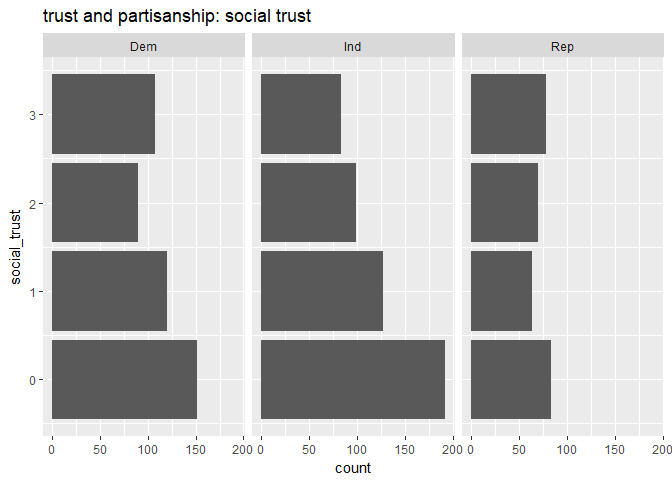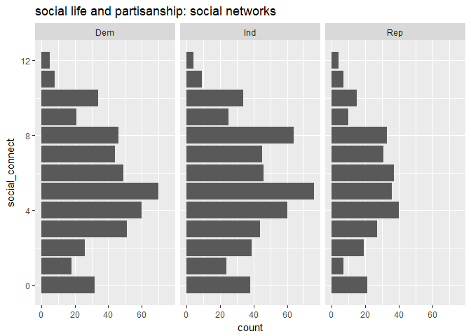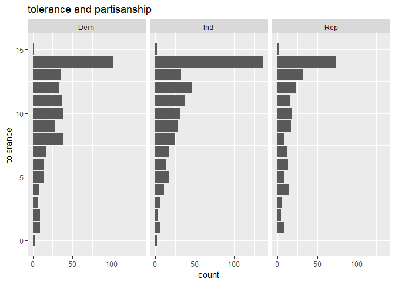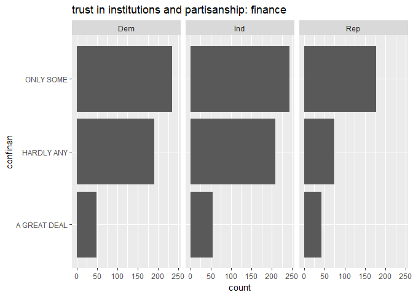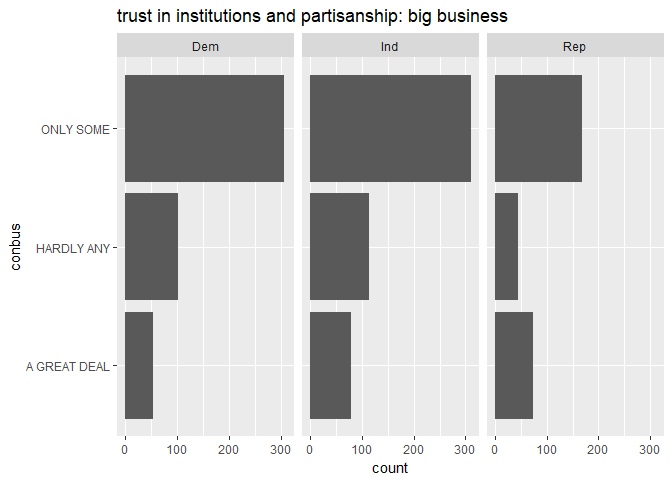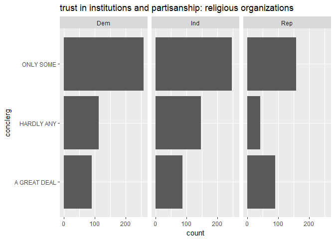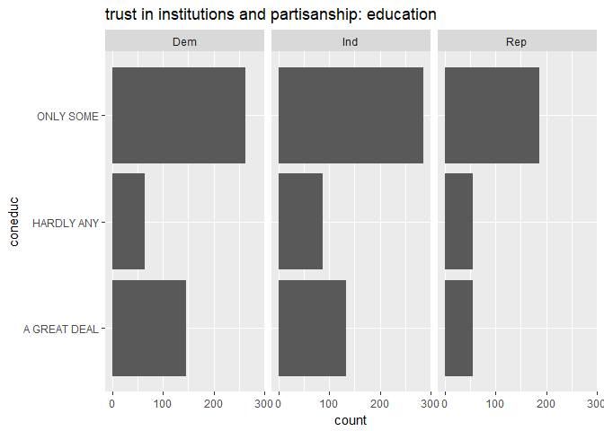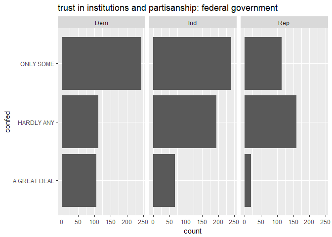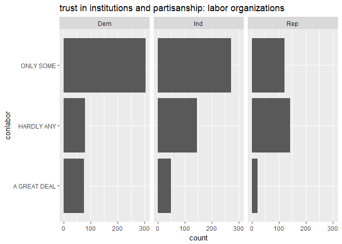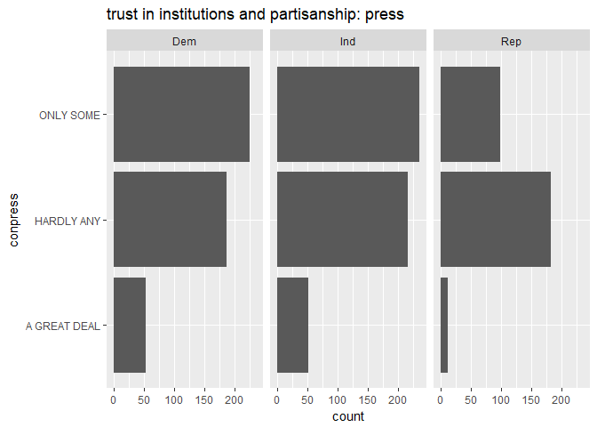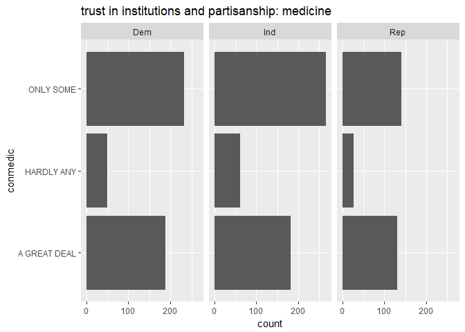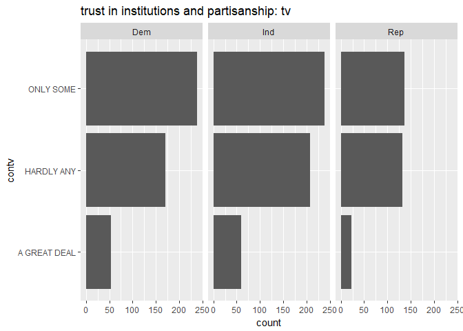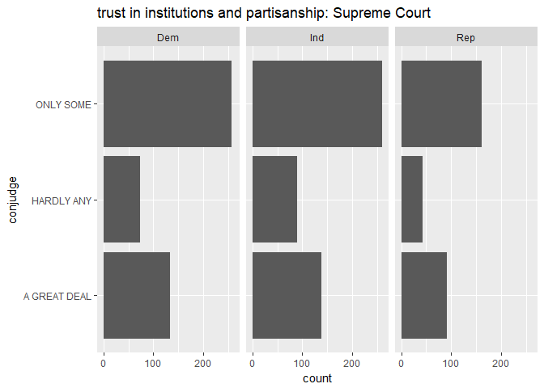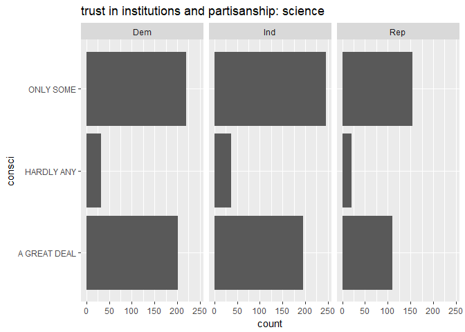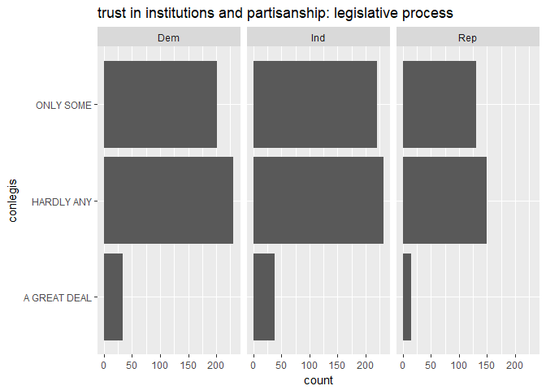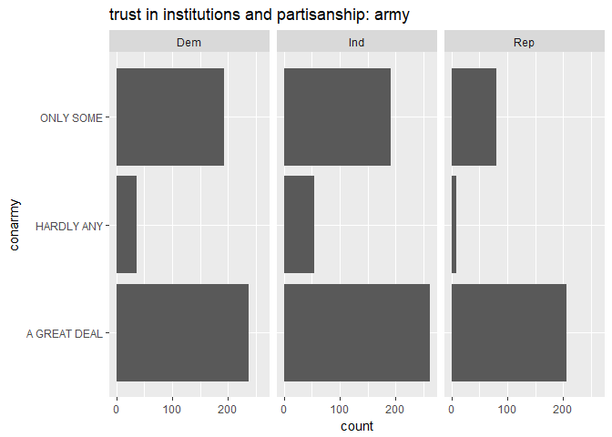
