EDA
================
hyunku kwon

``` r
library(tidyverse)
```

    ## -- Attaching packages -------------------------------------------------------------------------- tidyverse 1.2.0 --

    ## √ ggplot2 2.2.1     √ purrr   0.2.4
    ## √ tibble  1.3.4     √ dplyr   0.7.4
    ## √ tidyr   0.7.2     √ stringr 1.2.0
    ## √ readr   1.1.1     √ forcats 0.2.0

    ## -- Conflicts ----------------------------------------------------------------------------- tidyverse_conflicts() --
    ## x dplyr::filter() masks stats::filter()
    ## x dplyr::lag()    masks stats::lag()

``` r
library(foreign)
library(ggplot2)

gs <- read_csv("gss2012.csv")%>%
  select(partyid_3, educ_4,sex,race,polviews,wrkstat,age, happy, natspac,natenvir,natheal,natcity,natcrime,natdrug, nateduc,natrace,natarms,nataid,natfare,natarms,nataid, natfare,natroad,natsoc,natmass,natpark,natchld,natsci,natenrgy, social_trust, tolerance, authoritarianism, confinan, conbus,conclerg,coneduc,confed,conlabor,conpress,conmedic,contv,conjudge,consci, conlegis, conarmy,social_connect, premarsx, teensex, xmarsex, homosex)%>%
  filter(!partyid_3 == "NA")
```

    ## Parsed with column specification:
    ## cols(
    ##   .default = col_character(),
    ##   year = col_integer(),
    ##   id = col_double(),
    ##   sibs = col_integer(),
    ##   childs = col_integer(),
    ##   age = col_integer(),
    ##   size = col_integer(),
    ##   eqwlth = col_integer(),
    ##   closeblk = col_integer(),
    ##   closewht = col_integer(),
    ##   tvhours = col_integer(),
    ##   helpnot = col_integer(),
    ##   helpblk = col_integer(),
    ##   wordsum = col_integer(),
    ##   dateintv = col_integer(),
    ##   cohort = col_integer(),
    ##   feelevel = col_integer(),
    ##   lngthinv = col_integer(),
    ##   intage = col_integer(),
    ##   intyrs = col_integer(),
    ##   wtss = col_double()
    ##   # ... with 19 more columns
    ## )

    ## See spec(...) for full column specifications.

Who divides?
------------

``` r
gs %>%
  ggplot(mapping = aes(sex))+
  geom_bar()+
  facet_wrap(~partyid_3)
```

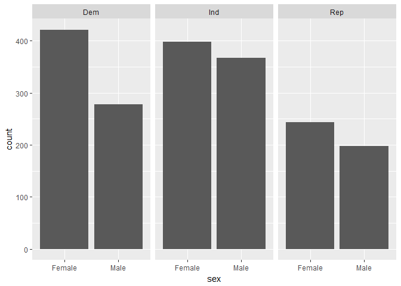

``` r
gs %>%
  ggplot(mapping = aes(educ_4))+
  geom_bar()+
  facet_wrap(~partyid_3)+
  coord_flip()
```

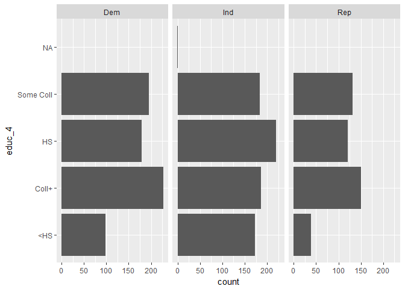

``` r
gs %>%
  ggplot(mapping = aes(polviews))+
  geom_bar()+
  facet_wrap(~partyid_3)+
  coord_flip()
```

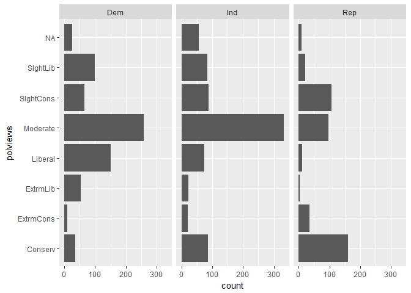

``` r
gs %>%
  ggplot(mapping = aes(wrkstat))+
  geom_bar()+
  facet_wrap(~partyid_3)+
  coord_flip()
```

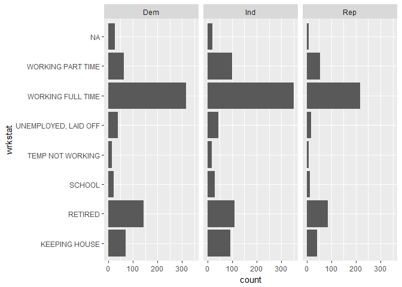

``` r
gs %>%
ggplot(aes(partyid_3,age))+
  geom_bar(stat = "summary", fun.y = "mean")
```

    ## Warning: Removed 5 rows containing non-finite values (stat_summary).

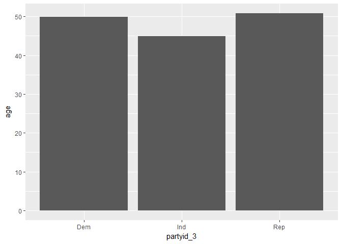

``` r
gs %>%
  ggplot(aes(happy))+
  geom_bar()+
  facet_wrap(~partyid_3)+
  coord_flip()
```

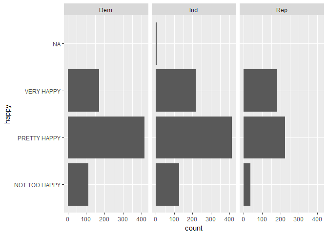

``` r
gs %>%
  ggplot(aes(authoritarianism))+
  geom_bar()+
  facet_wrap(~partyid_3)+
  coord_flip()
```

    ## Warning: Removed 632 rows containing non-finite values (stat_count).

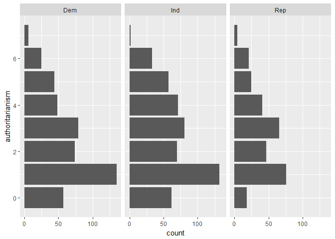

divided over what?
------------------

``` r
gs %>%
  filter(!natspac == "NA")%>%
  ggplot(aes(natspac))+
  geom_bar()+
  facet_wrap(~partyid_3)+
  coord_flip()
```

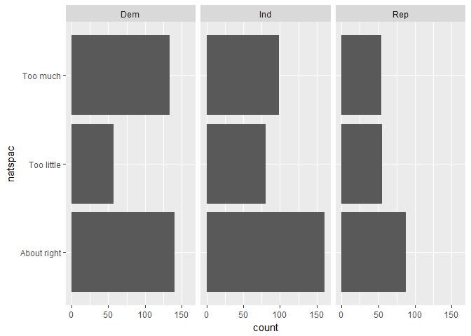

``` r
gs %>%
  filter(!natenvir == "NA")%>%
  ggplot(aes(natenvir))+
  geom_bar()+
  facet_wrap(~partyid_3)+
  coord_flip()
```

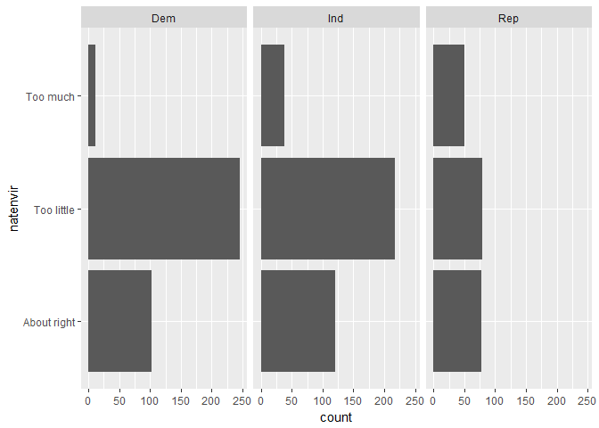

``` r
gs %>%
  filter(!natheal == "NA")%>%
  ggplot(aes(natheal))+
  geom_bar()+
  facet_wrap(~partyid_3)+
  coord_flip()
```

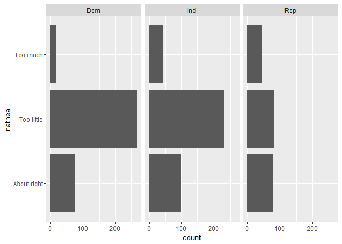

``` r
gs %>%
  filter(!natcity == "NA")%>%
  ggplot(aes(natcity))+
  geom_bar()+
  facet_wrap(~partyid_3)+
  coord_flip()
```

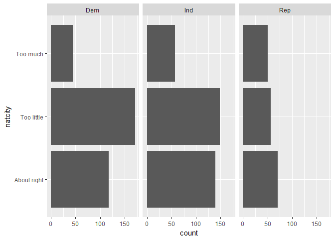

``` r
gs %>%
  filter(!natcrime == "NA")%>%
  ggplot(aes(natcrime))+
  geom_bar()+
  facet_wrap(~partyid_3)+
  coord_flip()
```

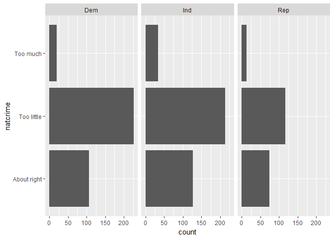

``` r
gs %>%
  filter(!natdrug == "NA")%>%
  ggplot(aes(natdrug))+
  geom_bar()+
  facet_wrap(~partyid_3)+
  coord_flip()
```

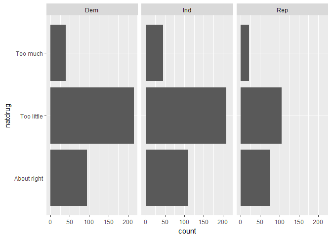

``` r
gs %>%
  filter(!nateduc == "NA")%>%
  ggplot(aes(nateduc))+
  geom_bar()+
  facet_wrap(~partyid_3)+
  coord_flip()
```

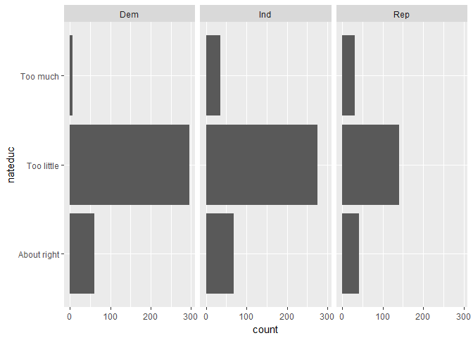

``` r
gs %>%
  filter(!natrace == "NA")%>%
  ggplot(aes(natrace))+
  geom_bar()+
  facet_wrap(~partyid_3)+
  coord_flip()
```

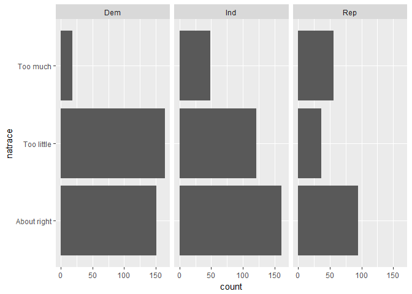

``` r
gs %>%
  filter(!natarms == "NA")%>%
  ggplot(aes(natarms))+
  geom_bar()+
  facet_wrap(~partyid_3)+
  coord_flip()
```


``` r
gs %>%
  filter(!nataid == "NA")%>%
  ggplot(aes(nataid))+
  geom_bar()+
  facet_wrap(~partyid_3)+
  coord_flip()
```

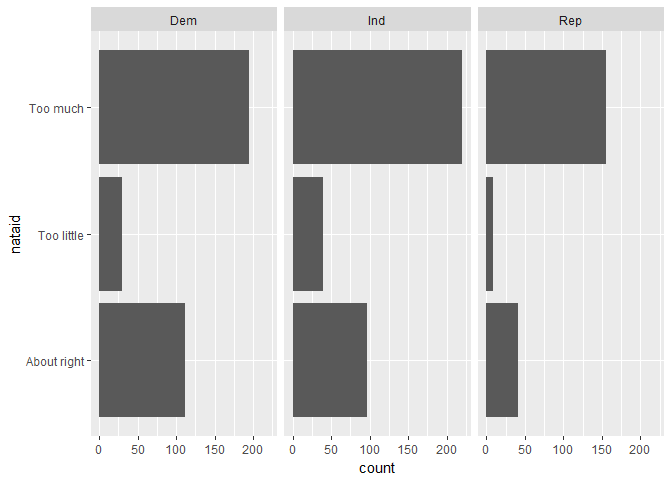

``` r
gs %>%
  filter(!natfare == "NA")%>%
  ggplot(aes(natfare))+
  geom_bar()+
  facet_wrap(~partyid_3)+
  coord_flip()
```

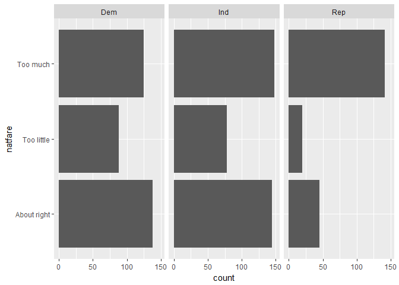

``` r
gs %>%
  filter(!natarms == "NA")%>%
  ggplot(aes(natarms))+
  geom_bar()+
  facet_wrap(~partyid_3)+
  coord_flip()
```

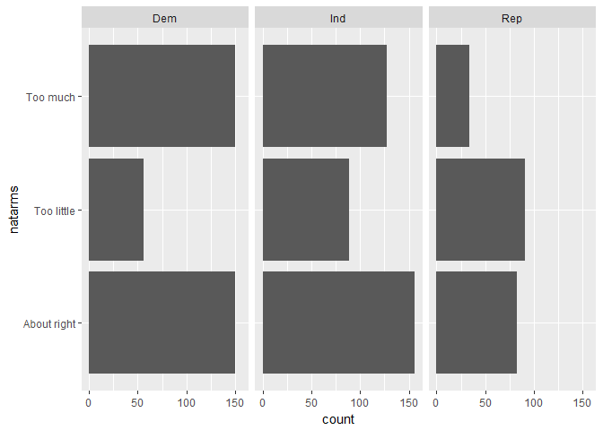

``` r
gs %>%
  filter(!natroad == "NA")%>%
  ggplot(aes(natroad))+
  geom_bar()+
  facet_wrap(~partyid_3)+
  coord_flip()
```

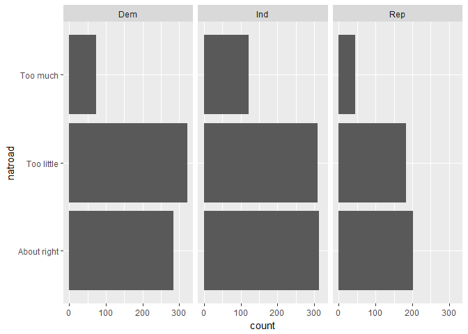

``` r
gs %>%
  filter(!natsoc == "NA")%>%
  ggplot(aes(natsoc))+
  geom_bar()+
  facet_wrap(~partyid_3)+
  coord_flip()
```

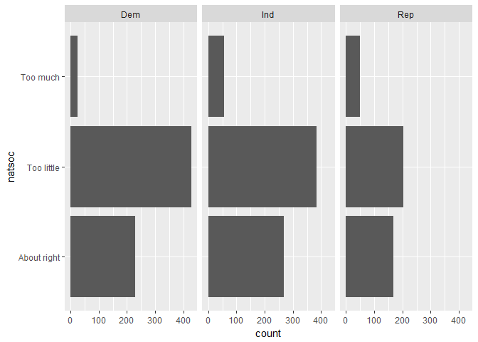

``` r
gs %>%
  filter(!natmass == "NA")%>%
  ggplot(aes(natmass))+
  geom_bar()+
  facet_wrap(~partyid_3)+
  coord_flip()
```

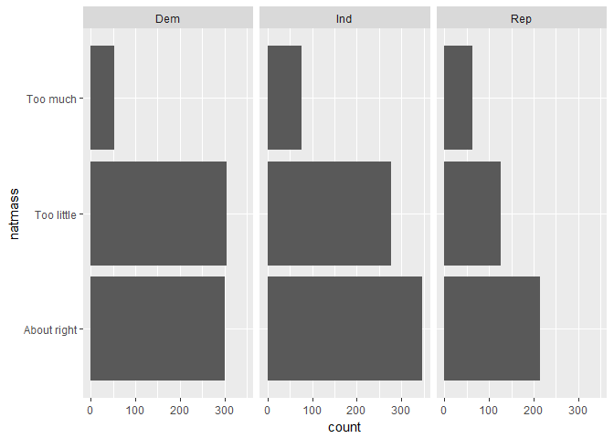

``` r
gs %>%
  filter(!natpark == "NA")%>%
  ggplot(aes(natpark))+
  geom_bar()+
  facet_wrap(~partyid_3)+
  coord_flip()
```

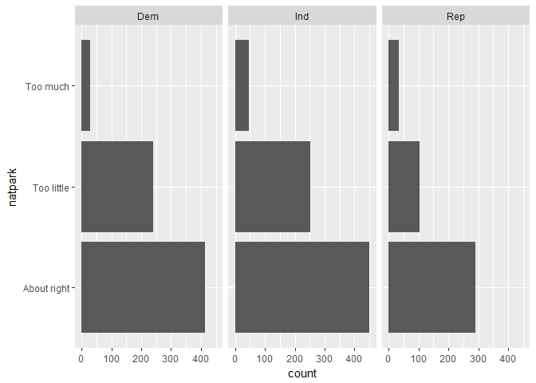

``` r
gs %>%
  filter(!natchld == "NA")%>%
  ggplot(aes(natchld))+
  geom_bar()+
  facet_wrap(~partyid_3)+
  coord_flip()
```

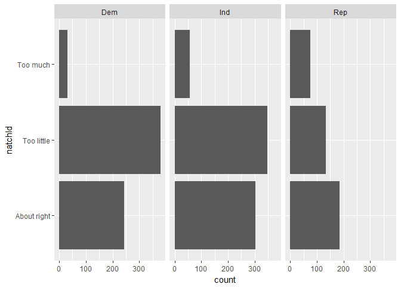

``` r
gs %>%
  filter(!natsci == "NA")%>%
  ggplot(aes(natsci))+
  geom_bar()+
  facet_wrap(~partyid_3)+
  coord_flip()
```

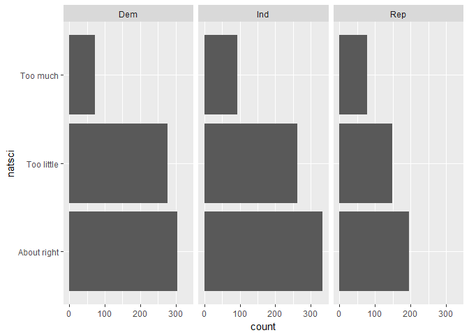

``` r
gs %>%
  filter(!natenrgy == "NA")%>%
  ggplot(aes(natenrgy))+
  geom_bar()+
  facet_wrap(~partyid_3)+
  coord_flip()
```

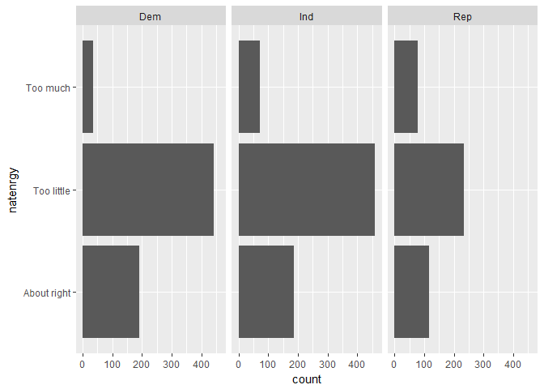

trust, tolerance, and confidence
--------------------------------

``` r
gs %>%
  filter(!social_trust == "NA")%>%
  ggplot(aes(social_trust))+
  geom_bar()+
  facet_wrap(~partyid_3)+
  coord_flip()
```

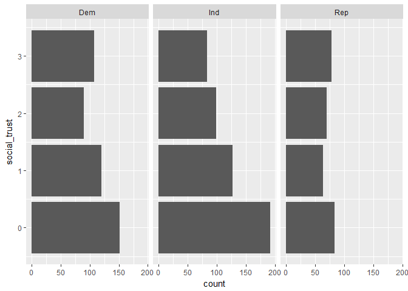

``` r
gs %>%
  filter(!social_connect == "NA")%>%
  ggplot(aes(social_connect))+
  geom_bar()+
  facet_wrap(~partyid_3)+
  coord_flip()
```

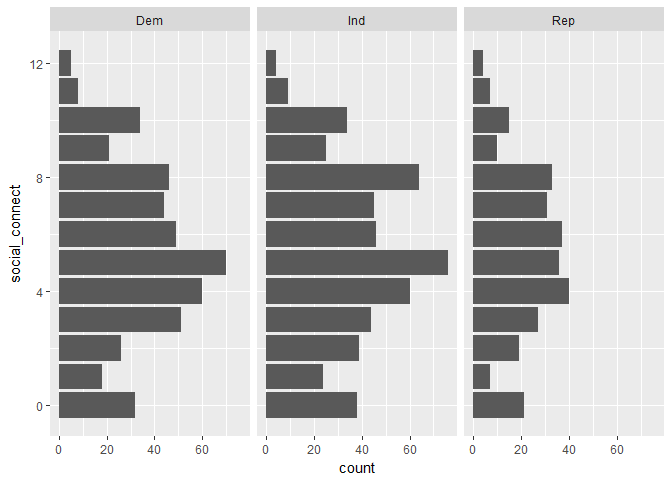

``` r
gs %>%
  filter(!tolerance == "NA")%>%
  ggplot(aes(tolerance))+
  geom_bar()+
  facet_wrap(~partyid_3)+
  coord_flip()
```

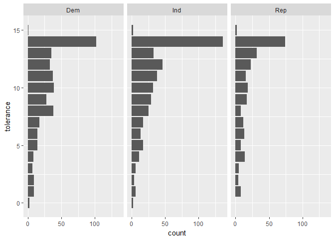

``` r
gs %>%
  filter(!confinan == "NA")%>%
  ggplot(aes(confinan))+
  geom_bar()+
  facet_wrap(~partyid_3)+
  coord_flip()
```

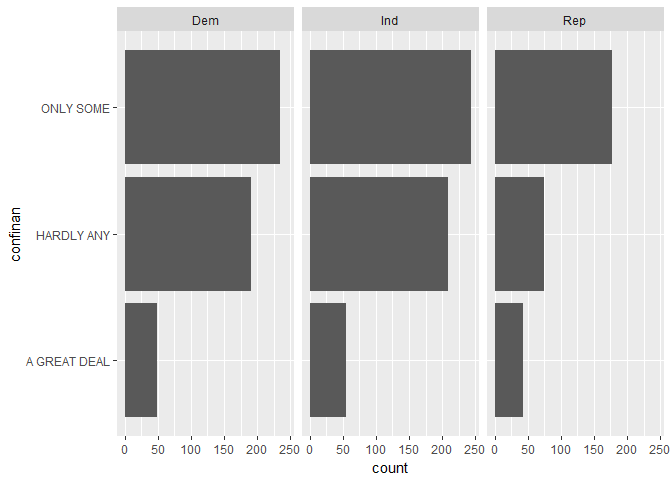

``` r
gs %>%
  filter(!conbus == "NA")%>%
  ggplot(aes(conbus))+
  geom_bar()+
  facet_wrap(~partyid_3)+
  coord_flip()
```

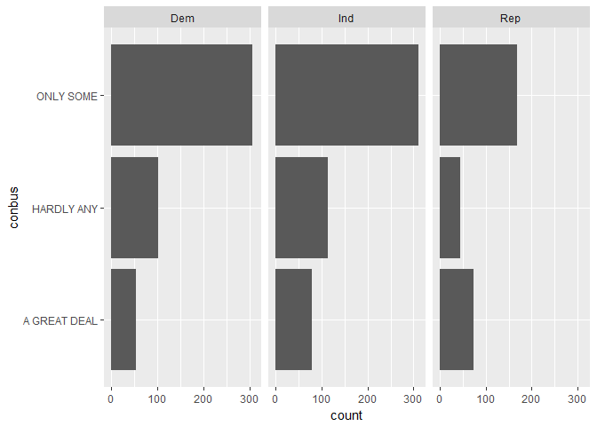

``` r
gs %>%
  filter(!conclerg == "NA")%>%
  ggplot(aes(conclerg))+
  geom_bar()+
  facet_wrap(~partyid_3)+
  coord_flip()
```

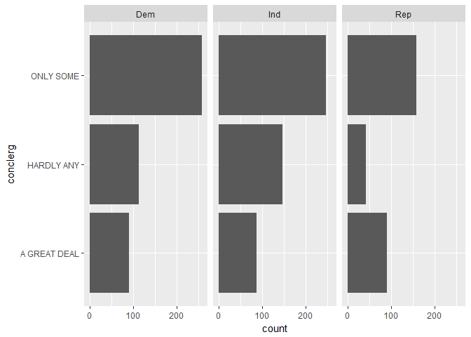

``` r
gs %>%
  filter(!coneduc == "NA")%>%
  ggplot(aes(coneduc))+
  geom_bar()+
  facet_wrap(~partyid_3)+
  coord_flip()
```


``` r
gs %>%
  filter(!confed == "NA")%>%
  ggplot(aes(confed))+
  geom_bar()+
  facet_wrap(~partyid_3)+
  coord_flip()
```

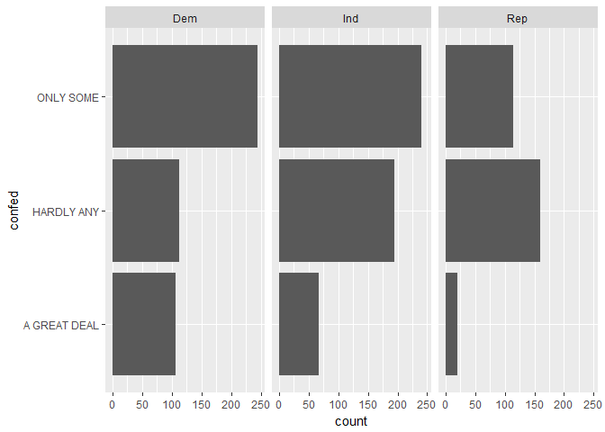

``` r
gs %>%
  filter(!conlabor == "NA")%>%
  ggplot(aes(conlabor))+
  geom_bar()+
  facet_wrap(~partyid_3)+
  coord_flip()
```

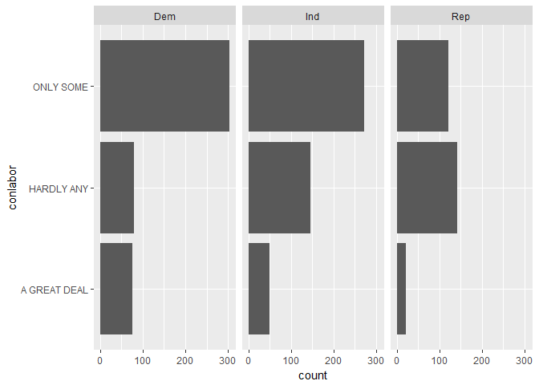

``` r
gs %>%
  filter(!conpress == "NA")%>%
  ggplot(aes(conpress))+
  geom_bar()+
  facet_wrap(~partyid_3)+
  coord_flip()
```

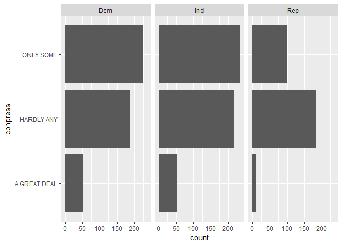

``` r
gs %>%
  filter(!conmedic == "NA")%>%
  ggplot(aes(conmedic))+
  geom_bar()+
  facet_wrap(~partyid_3)+
  coord_flip()
```

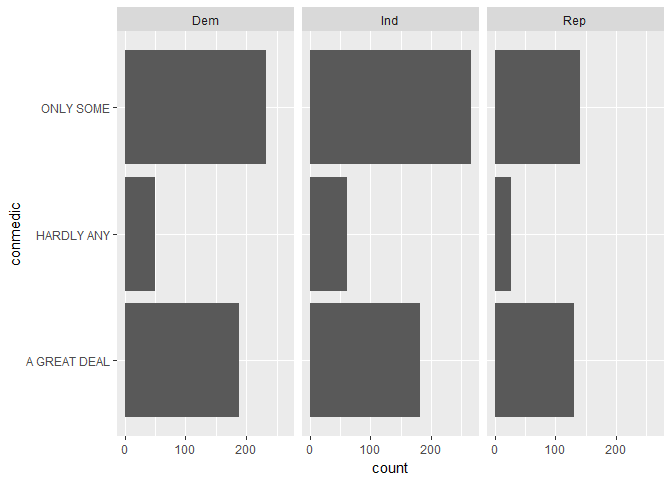

``` r
gs %>%
  filter(!contv == "NA")%>%
  ggplot(aes(contv))+
  geom_bar()+
  facet_wrap(~partyid_3)+
  coord_flip()
```

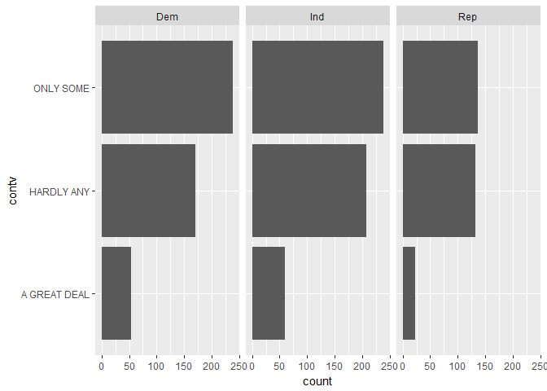

``` r
gs %>%
  filter(!conjudge == "NA")%>%
  ggplot(aes(conjudge))+
  geom_bar()+
  facet_wrap(~partyid_3)+
  coord_flip()
```

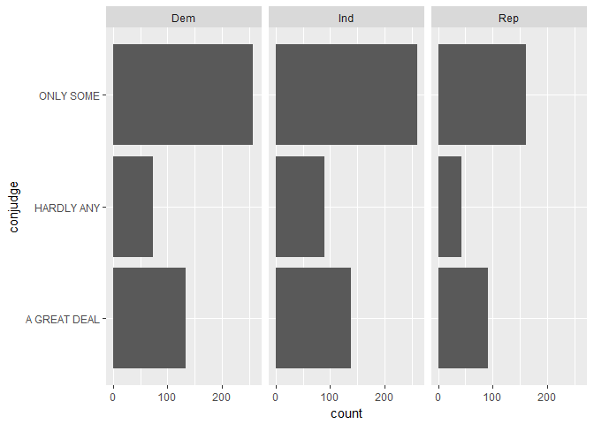

``` r
gs %>%
  filter(!coneduc == "NA")%>%
  ggplot(aes(coneduc))+
  geom_bar()+
  facet_wrap(~partyid_3)+
  coord_flip()
```

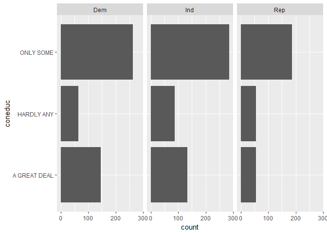

``` r
gs %>%
  filter(!consci == "NA")%>%
  ggplot(aes(consci))+
  geom_bar()+
  facet_wrap(~partyid_3)+
  coord_flip()
```

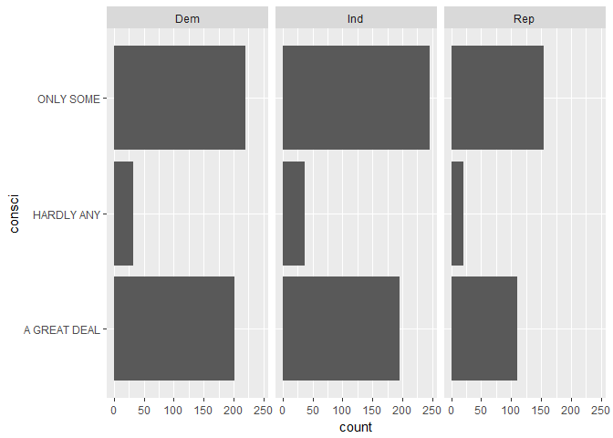

``` r
gs %>%
  filter(!conlegis == "NA")%>%
  ggplot(aes(conlegis))+
  geom_bar()+
  facet_wrap(~partyid_3)+
  coord_flip()
```

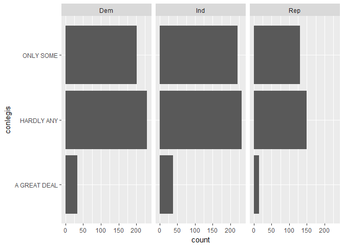

``` r
gs %>%
  filter(!conarmy == "NA")%>%
  ggplot(aes(conarmy))+
  geom_bar()+
  facet_wrap(~partyid_3)+
  coord_flip()
```

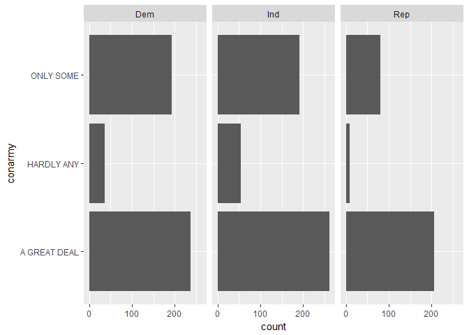

Sex and partisanship
--------------------

``` r
gs %>%
  filter(!premarsx == "NA")%>%
  ggplot(aes(premarsx))+
  geom_bar()+
  facet_wrap(~partyid_3)+
  coord_flip()
```

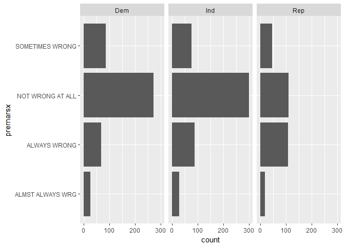

``` r
gs %>%
  filter(!teensex == "NA")%>%
  ggplot(aes(teensex))+
  geom_bar()+
  facet_wrap(~partyid_3)+
  coord_flip()
```

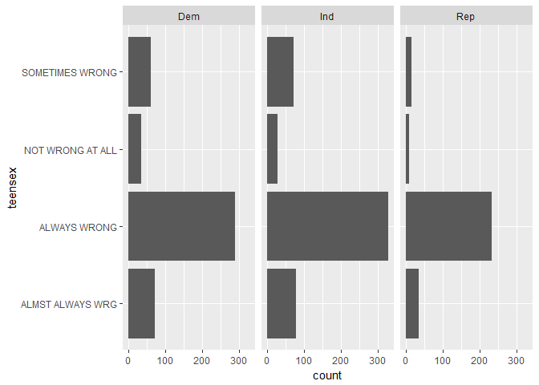

``` r
gs %>%
  filter(!xmarsex == "NA")%>%
  ggplot(aes(xmarsex))+
  geom_bar()+
  facet_wrap(~partyid_3)+
  coord_flip()
```

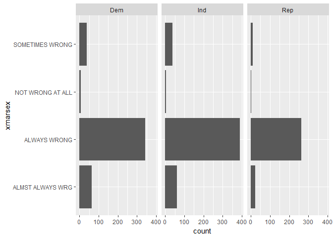

``` r
gs %>%
  filter(!homosex == "NA")%>%
  ggplot(aes(homosex))+
  geom_bar()+
  facet_wrap(~partyid_3)+
  coord_flip()
```

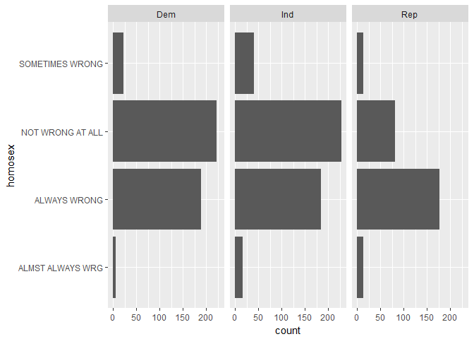
