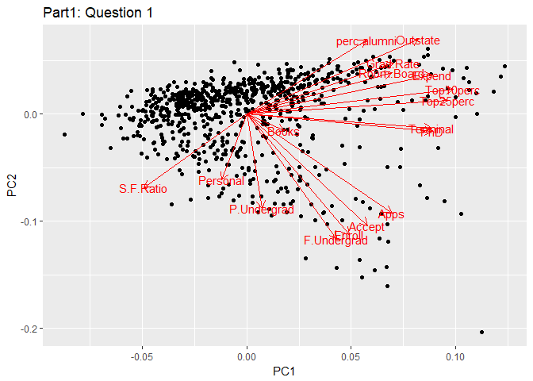
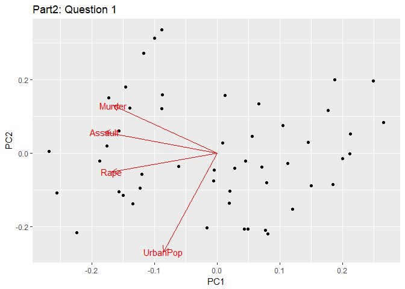
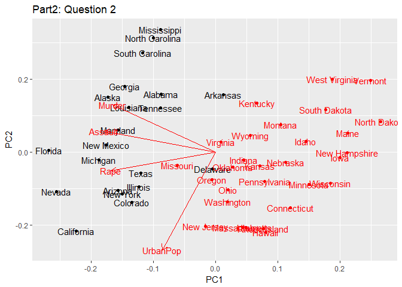
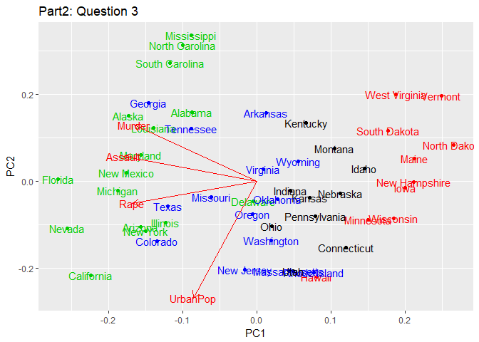
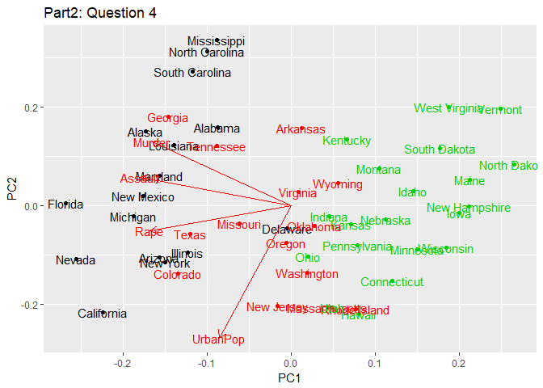
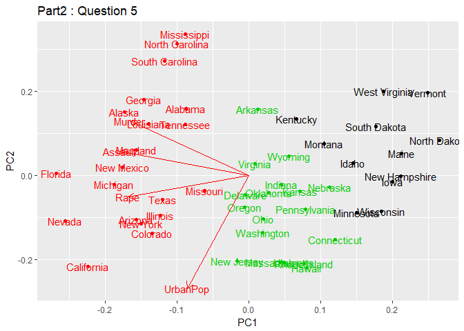
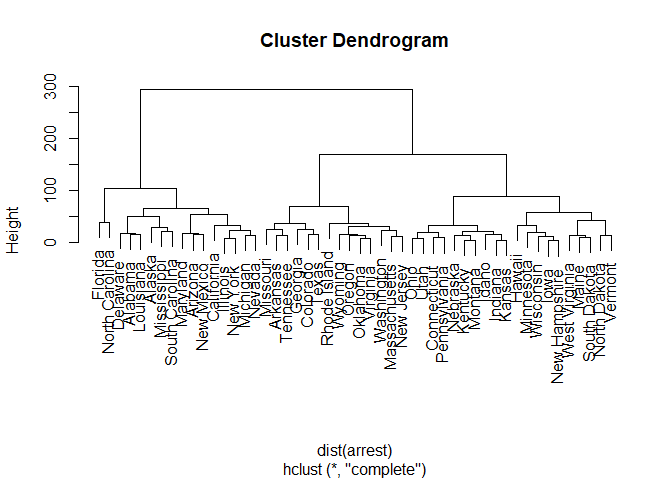
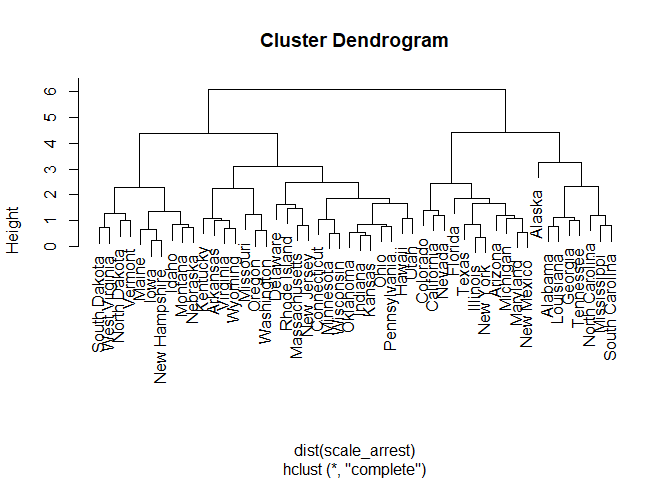

Unsupervised Learning
================
hyunku kwon

``` r
library(tidyverse)
library(dplyr)
library(ggdendro)
library(FactoMineR)
library(forcats)
library(stats)
library(readr)
library(ggfortify)
```

``` r
college <- read_csv("College.csv") %>% 
  select(-Private)%>%
  prcomp(center = TRUE, scale.=TRUE)

arrest <- read_csv("USArrests.csv") %>%
  remove_rownames %>% 
  column_to_rownames(var="State")
```

    ## Warning: Setting row names on a tibble is deprecated.

``` r
arrest_pca<- arrest%>%
  prcomp(center=TRUE, scale.=TRUE)

arrest_km2 <- kmeans(arrest, 2, nstart = 20)
arrest_km3 <- kmeans(arrest, 3, nstart = 20)
arrest_km4 <- kmeans(arrest, 4, nstart = 20)
```

### Part 1.

#### Question 1.

``` r
autoplot(college, loadings=TRUE, loadings.label=TRUE)+
  ggtitle("Part1: Question 1")
```

 PC1 is positively correlated with PhD, Top 10 perc, TOP 25 Perc, and Terminal,and PC2 is positively related with F. Undergrad, Enroll, Accept, and Apps.

#### Question 2.

``` r
summary(college)
```

    ## Importance of components:
    ##                           PC1    PC2     PC3     PC4     PC5     PC6
    ## Standard deviation     2.3331 2.1161 1.08312 1.00345 0.96593 0.92054
    ## Proportion of Variance 0.3202 0.2634 0.06901 0.05923 0.05488 0.04985
    ## Cumulative Proportion  0.3202 0.5836 0.65262 0.71185 0.76673 0.81658
    ##                            PC7     PC8     PC9    PC10    PC11    PC12
    ## Standard deviation     0.77782 0.76623 0.72796 0.63544 0.55950 0.46939
    ## Proportion of Variance 0.03559 0.03454 0.03117 0.02375 0.01841 0.01296
    ## Cumulative Proportion  0.85217 0.88670 0.91788 0.94163 0.96004 0.97300
    ##                           PC13    PC14    PC15    PC16    PC17
    ## Standard deviation     0.40936 0.37920 0.29650 0.19152 0.15165
    ## Proportion of Variance 0.00986 0.00846 0.00517 0.00216 0.00135
    ## Cumulative Proportion  0.98286 0.99132 0.99649 0.99865 1.00000

PC1 explains 32.02 %, and PC2 26.34. Thus, 58.36% of the proportion of variance in the College is explained by the first two components.

### Clustering States

#### Question 1.

``` r
autoplot(arrest_pca, loadings=TRUE, loadings.label=TRUE) +
  ggtitle("Part2: Question 1")
```



#### Question 2

``` r
autoplot(arrest_pca, label=TRUE, col=arrest_km2$cluster, loadings=TRUE, loadings.label=TRUE) +
  ggtitle("Part2: Question 2")
```

    ## Warning in if (value %in% columns) {: length > 1 À̶ó´Â Á¶°ÇÀÌ ÀÖ°í, ù¹ø°
    ## ¿ä¼Ò¸¸ÀÌ »ç¿ëµÉ °ÍÀÔ´Ï´Ù

    ## Warning in if (value %in% columns) {: length > 1 À̶ó´Â Á¶°ÇÀÌ ÀÖ°í, ù¹ø°
    ## ¿ä¼Ò¸¸ÀÌ »ç¿ëµÉ °ÍÀÔ´Ï´Ù

 From the plot, we can see how the first component is related with rape, murder, and assault, with Florida, Nevada, California positively associated and Vermont, North Dakota, Maine and Iowa negatively. Second component is more assocated with indices associated with urban population, and its relation is predominantly shown in Hawaii, Rhode Island and Massachusetts. The first cluster includes high crime states, whereas the second cluster low-crime states.

#### Question 3

``` r
autoplot(arrest_pca, label=TRUE, col=arrest_km4$cluster, loadings=TRUE, loadings.label=TRUE) +
  ggtitle("Part2: Question 3")
```

    ## Warning in if (value %in% columns) {: length > 1 À̶ó´Â Á¶°ÇÀÌ ÀÖ°í, ù¹ø°
    ## ¿ä¼Ò¸¸ÀÌ »ç¿ëµÉ °ÍÀÔ´Ï´Ù

    ## Warning in if (value %in% columns) {: length > 1 À̶ó´Â Á¶°ÇÀÌ ÀÖ°í, ù¹ø°
    ## ¿ä¼Ò¸¸ÀÌ »ç¿ëµÉ °ÍÀÔ´Ï´Ù

 Each cluster shows distinct features: the frst cluster shows high-crime states; the second includes medium-level urban popoulation states with medium-level crime rates; the third includes low-crime states with medium population; the final group includes lowest-crime states with medium population.

Question 4.

``` r
autoplot(arrest_pca, label=TRUE, col=arrest_km3$cluster, loadings=TRUE, loadings.label=TRUE) +
  ggtitle("Part2: Question 4")
```

    ## Warning in if (value %in% columns) {: length > 1 À̶ó´Â Á¶°ÇÀÌ ÀÖ°í, ù¹ø°
    ## ¿ä¼Ò¸¸ÀÌ »ç¿ëµÉ °ÍÀÔ´Ï´Ù

    ## Warning in if (value %in% columns) {: length > 1 À̶ó´Â Á¶°ÇÀÌ ÀÖ°í, ù¹ø°
    ## ¿ä¼Ò¸¸ÀÌ »ç¿ëµÉ °ÍÀÔ´Ï´Ù

 Question 4 seems to show similar patterns with Question 3. The red cluster shows high, the black cluster medium, and the green low crime rates.

#### Question 5

``` r
ques5_pca<-kmeans(arrest_pca$x[,1:2], 3,nstart = 20)

arrest_pca%>%
  autoplot(label=TRUE, col=ques5_pca$cluster, loadings=TRUE, loadings.label=TRUE)+
  ggtitle("Part2 : Question 5")
```

    ## Warning in if (value %in% columns) {: length > 1 À̶ó´Â Á¶°ÇÀÌ ÀÖ°í, ù¹ø°
    ## ¿ä¼Ò¸¸ÀÌ »ç¿ëµÉ °ÍÀÔ´Ï´Ù

    ## Warning in if (value %in% columns) {: length > 1 À̶ó´Â Á¶°ÇÀÌ ÀÖ°í, ù¹ø°
    ## ¿ä¼Ò¸¸ÀÌ »ç¿ëµÉ °ÍÀÔ´Ï´Ù

 Though Question 4 and 5 seem to show similar patterns overall, the clustering process is different: Tennesse, Texas, Missouri are grouped into the first cluster.

#### Question 6

``` r
hclust(dist(arrest), method = "complete")%>%
  plot()
```



1.  Cut the dendrogram at a height that results in three distinct clusters. Which states belong to which clusters?

The cluster each state belongs to is shown below.

``` r
hclust(dist(arrest), method = "complete")%>%
  cutree(3)
```

    ##        Alabama         Alaska        Arizona       Arkansas     California 
    ##              1              1              1              2              1 
    ##       Colorado    Connecticut       Delaware        Florida        Georgia 
    ##              2              3              1              1              2 
    ##         Hawaii          Idaho       Illinois        Indiana           Iowa 
    ##              3              3              1              3              3 
    ##         Kansas       Kentucky      Louisiana          Maine       Maryland 
    ##              3              3              1              3              1 
    ##  Massachusetts       Michigan      Minnesota    Mississippi       Missouri 
    ##              2              1              3              1              2 
    ##        Montana       Nebraska         Nevada  New Hampshire     New Jersey 
    ##              3              3              1              3              2 
    ##     New Mexico       New York North Carolina   North Dakota           Ohio 
    ##              1              1              1              3              3 
    ##       Oklahoma         Oregon   Pennsylvania   Rhode Island South Carolina 
    ##              2              2              3              2              1 
    ##   South Dakota      Tennessee          Texas           Utah        Vermont 
    ##              3              2              2              3              3 
    ##       Virginia     Washington  West Virginia      Wisconsin        Wyoming 
    ##              2              2              3              3              2

1.  Hierarchically cluster the states using complete linkage and Euclidean distance, after scaling the variables to have standard deviation. What effect does scaling the variables have on the hierarchical clustering obtained?

Scaling the variables slightly affect the clusters, but the trees stil look fairly similar. Scaling the variables is helpful because the data measures have different units, which are hard to compare otherwise.

``` r
scale_arrest<-scale(arrest) 

hclust(dist(scale_arrest), method = "complete")%>%
  plot()
```

 Simple scaling leads to such different results with different Euclidean distance. For example, while Alaska is situated very closely with Missouri on the Question 6, after scaling the data, it's not very far from it: Maine is in the first cluster, while Alaska is in the last cluster.
