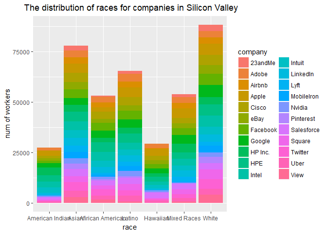

Assignment 5
================

Contents
--------

-   Kaggle open call projects:

dataset：Silicon Valley Diversity Data.csv

plot: Sillicon\_Valley.pdf and Sillicon\_Valley.png

-   Improving a journal article:

article: Journal article for human computation project.pdf

-   Amazon Mechanical Turk(use another website for this task):

pictures: screenshot1.png & screenshot2.png

Kaggle open call projects
-------------------------

#### 2.

I selected a project called "Titanic: Machine Learning from Disaster". It is a dataset about the demographic information of passengers on Titanic, including survival, ticket class, name, gender, age, the number of siblings or spouses aboard, the number of parents or children aboard, ticket number, passenger fare, cabin number and port of embarkation. There are two csv files in the dataset, one for training, and the other one for testing.

The goal of the competition is to predict which kinds of people are more likely to survive using the method of machine learning. In order to make a submission, the participant has to predict a 0 or 1 value for survival for every passenger in the test dataset. The predictive model are built on the training dataset provided.

#### 3.

I will use the "Silicon Valley Diversity Data" dataset for this part. The dataset is called :Silicon Valley Diversity Data.csv", and the plot is called "Sillicon\_Valley.pdf" or "Sillicon\_Valley.png".

The plot shows the race distribution of companies in Silicon Valley. As we can see, the White and Asian people are the majority of workers in tech companies. And it also indicates that the race distribution of workers are similiar between different companies.

``` r
setwd("E:/Chicago/persp-analysis/students/liao_andi/assignment5")
df = read.csv("dataset for Kaggle open call projects.csv")


# select the useful information
df_use = subset(df, df$count != 0 & df$count != "na" & df$job_category != "Totals" & df$job_category != "Previous_totals" & df$race != "Overall_totals")

df_use$count = as.numeric(df_use$count)


# plot the distribution
library(ggplot2)
attach(df_use)

ggplot(df_use, aes(x = race, y = count, fill = company )) + 
  geom_bar(stat = "identity") +
  labs(title = " The distribution of races for companies in Silicon Valley", x = "race", y = "num of workers") +
   theme(plot.title = element_text(hjust = 0.5)) +
   scale_x_discrete(labels = c("American Indian", "Asian", "Afirican American", "Latino", "Hawaiian", "Mixed Races", "White"))
```



``` r
# generate pdf
pdf("Sillicon_Valley.pdf", width = 10, height = 10)

ggplot(df_use, aes(x = race, y = count, fill = company )) + 
  geom_bar(stat = "identity") +
  labs(title = " The distribution of races for companies in Silicon Valley", x = "race", y = "num of workers") +
   theme(plot.title = element_text(hjust = 0.5)) +
   scale_x_discrete(labels = c("American Indian", "Asian", "Afirican American", "Latino", "Hawaiian", "Mixed Races", "White"))

dev.off()
```

    ## png 
    ##   2

Improving a journal article
---------------------------

I choose a journal article titled with "Facial expressions of emotion are not culturally universal". It's in "Journal article for human computation project.pdf".

In this reseach, researchers recruited 15 Western Caucasian and 15 East Asian observers to categorize 4800 trials of facial stimulations. Their goal is to prove that people from different culture background have different understanding of universal facial expressions of emotions (happy, surprise, fear, disgust, anger, and sad).

In the experiment, each stimulation includes a face with some facial movement and subjective mental representation. The stimulation is randomly generated by a computer graphics system based on real-person facial models. Observers are required to evaluate two aspects about each stimulation: emotion (happy, surprise, fear, disgust, anger, and sad), and intensity (five-point scale, from “very low” to “very high”).

Actually, the data collection process can be reformulated as a human computation project. 4800 trials for one observer - that's a lot of work. Besides, common people can finish the task with the help of instructions and a little training( about 5- 10 praticetrials). More importantly, the experiment itself won't suffer from experienced participants. On the contrary, we should encourage people to take part in the experiment as they want, as they are familiar to the setting and might be better at categorizing emotions after previous sections.

So if we attract as much participants from different culture backgrounds as possible, we can decrease the workload of every participant and increase the diversity of the data.

**So, how can the study be converted into a human computation project?**

After the computer graphics system is established, we should further improve it so that it can be quickly loaded and run in the web-brower environment. The link will be advertised as "Do you know how similar you are to people in your country? Come and join our little game today!" I belive that this interesting title can attact many people to participate in the study even without financial rewards.

Anyone knows the link can participate in the experiment without visiting the lab. To start the little website game, the only thing they have to do is to provide their nationality and the region they grow up. In this case, we can know their cultural background.

Instead of asking one observer to repeat the experimental procedure for 4800 times, we can redesign each section as only presenting 10 stimulations. However, the basic task for each trial will stay the same: categorizing the emotion and intensity. It's okay if participants want to exit at any moment, but their data of finished trials will be collected.

After finishing a section, participants can choose to continue with another section, or leave the interface. No matter what they choose, they will get feedbacks about their performance of last section. The feedback will show that how similar they are to people from different countries based on their behaviors of categorizing emotions.

**So, how can the human computation approach impove the study?**

The human computation project will imporve the study from three aspects.

-   Increased sample size/efficiency: Since that there are more people participating in the survey, the statistical inference from the sample will be more powerful and robust. Moreover, it will take less time to collect the same amount of data because more people are contributing to the whole dataset.

-   Diversity of sample: Compared with the original study, the sample will be far more diverse. We can't guarantee that people from every country will join our experiment, but we can ensure that people from more than two countries will be attracted to our experiment. Given the increasing diversity of sample, we are able to discover more interesting facts about human perception of emotions in a cross-culture setting.

-   More accurancy: It's easy to imagine that 30 observers in the original version of study will get tired at some point, as they have to go through 4800 faces one by one. Their answers might become less and less accurate as time goes by. However, by diving the huge task to a large number of participants, we are confident that everyone can fully focus on the task during that 10 trials.

To sum up, the data collection will be more efficient and accurate because of the method of human computation project. Therefore, the conclusion will be more convincing.

Amazon Mechanical Turk(use another website for this task)
---------------------------------------------------------

As I am unable to register for Amazon Mechanical Turk and MicroWorker, I choose another website called "<http://test.baidu.com/crowdtes>" run by Baidu (a similar search engine company like Google). It's a similar platform that recruits people to participate in the micro tasks, such as surveys and data collection tasks. I put the screenshot pictures in the folder. The time in the system is a little confusing, but I did complete it during the weekend.
