asssignment8
================

### I. Colleges

#### Q1

I presented the PCA results without and with normalization in the code. But I will only use the PCA without normalization in the write-up for this part.

For the first principal component, there are four varibales whose loadings are greater than 0.2 - F.Undergrad(0.671), Apps(0.557), Accept(0.348) and Expend(0.292). The high loading values indicate that number of fulltime undergraduates, number of applications received, number of applications accepted and instructional expenditure per student are strongly correlated with the first principal component. Besides, Enroll(0.130) and P.Undergrad(0.111) also contribute to the first princial component as their loadings are greater than 0.1.

For the second principal component, things are different. F.Undergrad is still strongly correlated with the second principal component, however, the loading value drop from 0.671 for the first principal component to 0.284 for the second principal component. There also five other variables that contribute to the second principal component, including P.Undergrad(0.080), Accept(0.077), Enroll(0.045), Apps(0.039) and Personal(0.030).

``` r
library(ggplot2)
library(ggfortify)
library(ggdendro)
library(dendextend)
```

    ## 
    ## ---------------------
    ## Welcome to dendextend version 1.6.0
    ## Type citation('dendextend') for how to cite the package.
    ## 
    ## Type browseVignettes(package = 'dendextend') for the package vignette.
    ## The github page is: https://github.com/talgalili/dendextend/
    ## 
    ## Suggestions and bug-reports can be submitted at: https://github.com/talgalili/dendextend/issues
    ## Or contact: <tal.galili@gmail.com>
    ## 
    ##  To suppress this message use:  suppressPackageStartupMessages(library(dendextend))
    ## ---------------------

    ## 
    ## Attaching package: 'dendextend'

    ## The following object is masked from 'package:ggdendro':
    ## 
    ##     theme_dendro

    ## The following object is masked from 'package:stats':
    ## 
    ##     cutree

``` r
college = read.csv("E:/Chicago/persp-analysis/students/liao_andi/assignment8/College.csv", header = TRUE)


#without normalizing
prcomp(college[, -1])
```

    ## Standard deviations (1, .., p=17):
    ##  [1] 6560.330614 6148.628507 2498.985577 1708.369628 1200.894723
    ##  [6]  788.286575  610.361484  571.942158  198.195783  159.112741
    ## [11]   20.644711   14.476032   12.545558    8.994205    5.998576
    ## [16]    5.194653    2.904872
    ## 
    ## Rotation (n x k) = (17 x 17):
    ##                       PC1           PC2           PC3           PC4
    ## Apps         5.570263e-01  0.0393606986  1.673533e-01 -6.642712e-01
    ## Accept       3.477120e-01  0.0771620231  1.623635e-01 -2.329273e-01
    ## Enroll       1.298540e-01  0.0454128642  9.663434e-03  5.883235e-02
    ## Top10perc    1.025389e-03 -0.0017055415  1.314474e-04 -1.225409e-04
    ## Top25perc    1.177421e-03 -0.0014970389  7.734472e-04  1.817197e-04
    ## F.Undergrad  6.706140e-01  0.2836718075 -2.467199e-02  5.849594e-01
    ## P.Undergrad  1.111127e-01  0.0803795425 -6.614187e-02  3.028184e-01
    ## Outstate     5.484194e-02 -0.5693227860  7.586098e-01  2.539310e-01
    ## Room.Board   2.886552e-02 -0.1059911573  1.366009e-01 -1.045605e-02
    ## Books        3.734220e-03 -0.0014290636 -2.739530e-03  8.819261e-04
    ## Personal     2.313221e-02  0.0298378541 -6.030490e-02  4.973345e-02
    ## PhD          1.138823e-03 -0.0008727170  6.278297e-04  1.064246e-03
    ## Terminal     9.895713e-04 -0.0008337844  6.772324e-04  1.125964e-03
    ## S.F.Ratio    2.859906e-05  0.0004275028  6.908259e-05 -2.505756e-05
    ## perc.alumni -1.093329e-04 -0.0011075375  8.646199e-04  5.030482e-04
    ## Expend       2.923904e-01 -0.7531527633 -5.854524e-01  9.095671e-03
    ## Grad.Rate    3.203529e-04 -0.0013650208  2.150645e-03 -1.004804e-03
    ##                       PC5           PC6           PC7           PC8
    ## Apps         1.646869e-01  5.805001e-02  0.1343426019 -0.4117935196
    ## Accept       5.805852e-03  6.028072e-02 -0.2399573361  0.8418069749
    ## Enroll      -6.407693e-02  2.130695e-02 -0.0408911751  0.1183684988
    ## Top10perc   -1.797369e-03  8.036970e-04  0.0018984182 -0.0074904898
    ## Top25perc   -1.909838e-03  5.523104e-04  0.0012509606 -0.0064277218
    ## F.Undergrad -2.814371e-01 -8.531669e-02  0.0133217513 -0.1486037856
    ## P.Undergrad  9.235353e-01  1.461951e-01 -0.1026035541  0.0001828454
    ## Outstate    -7.018530e-03  1.683414e-01  0.0502771148 -0.0442263806
    ## Room.Board   1.781679e-01 -9.634095e-01  0.0647932773  0.0599821016
    ## Books        6.590733e-03 -2.124736e-02  0.0497284497  0.0098051429
    ## Personal     6.630373e-02  8.308387e-02  0.9494853142  0.2779069057
    ## PhD          2.147683e-04 -7.388842e-04 -0.0003391354 -0.0006432685
    ## Terminal     2.877545e-04 -1.473919e-03 -0.0004799486 -0.0004205883
    ## S.F.Ratio    1.112629e-05 -8.752959e-05 -0.0002483396 -0.0002658706
    ## perc.alumni -1.273977e-03  1.536000e-03 -0.0014891545 -0.0024433949
    ## Expend      -1.924232e-02  5.622383e-03 -0.0355651865  0.0519314381
    ## Grad.Rate   -1.696984e-03 -1.324539e-03 -0.0012577631 -0.0031226662
    ##                       PC9          PC10          PC11          PC12
    ## Apps         0.0274068846 -0.0037603414  0.0043885745 -0.0030218055
    ## Accept      -0.1499897092  0.0058236220 -0.0082333714  0.0053672542
    ## Enroll       0.9783096229 -0.0077203036  0.0070856694 -0.0069258055
    ## Top10perc    0.0085115431  0.0042042949 -0.4368473612  0.2627325196
    ## Top25perc    0.0044807084  0.0056598115 -0.6220413584  0.3424975001
    ## F.Undergrad -0.1351603999 -0.0006118767  0.0019560795  0.0011169971
    ## P.Undergrad  0.0170019941  0.0012309070 -0.0020522826  0.0024854847
    ## Outstate    -0.0003089913  0.0023936845  0.0036681050 -0.0009818275
    ## Room.Board   0.0282846916 -0.0256179003  0.0001263555  0.0015901407
    ## Books        0.0091782035  0.9983638165  0.0023867083 -0.0046189912
    ## Personal     0.0013884373 -0.0489597665 -0.0021409962  0.0012458626
    ## PhD         -0.0002354317 -0.0060683267 -0.4502397729 -0.5712386308
    ## Terminal    -0.0015687087  0.0014252510 -0.3689732067 -0.5323130216
    ## S.F.Ratio   -0.0003196800  0.0001251354 -0.0028812066 -0.0234890666
    ## perc.alumni  0.0058996308 -0.0017955078 -0.1477882762  0.1242005403
    ## Expend      -0.0077922893 -0.0022115106  0.0012713591  0.0002307269
    ## Grad.Rate    0.0052798234 -0.0020932194 -0.2476923793  0.4334732805
    ##                      PC13          PC14          PC15          PC16
    ## Apps         0.0005307394 -4.007964e-04 -5.885535e-04 -1.127919e-03
    ## Accept      -0.0017596353 -1.075565e-03  1.250670e-03  2.473595e-03
    ## Enroll      -0.0013171382  3.497235e-03 -2.618667e-03 -3.102019e-03
    ## Top10perc   -0.2881680846  5.257687e-02  3.359247e-01  7.356159e-01
    ## Top25perc   -0.3833091227  4.935310e-02 -2.781733e-01 -5.185684e-01
    ## F.Undergrad  0.0007129263 -3.454547e-04  3.519353e-04  1.594045e-04
    ## P.Undergrad  0.0005722203  1.954095e-05  6.846898e-05  3.382395e-04
    ## Outstate    -0.0011142370  8.575232e-04 -3.931803e-05 -2.351418e-04
    ## Room.Board  -0.0018739877 -1.735666e-03  6.495159e-04  3.738821e-05
    ## Books        0.0063410759 -1.228008e-03  4.780734e-03 -2.346881e-03
    ## Personal     0.0019748045 -1.216373e-03 -3.688420e-04  7.592015e-05
    ## PhD          0.1683169459  7.714274e-02  5.993922e-01 -2.759489e-01
    ## Terminal     0.1482511404 -3.408003e-02 -6.667142e-01  3.358625e-01
    ## S.F.Ratio    0.0053962473  2.921777e-02  1.892065e-02 -2.099494e-02
    ## perc.alumni  0.2009066258 -9.574093e-01  6.807484e-02 -1.669537e-02
    ## Expend       0.0005390100  1.774162e-04 -2.031720e-04 -4.203305e-04
    ## Grad.Rate    0.8241823726  2.649166e-01 -3.115651e-02  1.619387e-02
    ##                      PC17
    ## Apps        -1.868469e-04
    ## Accept       2.325719e-04
    ## Enroll       6.243565e-05
    ## Top10perc    1.403704e-02
    ## Top25perc    1.256430e-03
    ## F.Undergrad -1.731433e-04
    ## P.Undergrad  1.161583e-05
    ## Outstate     1.753847e-04
    ## Room.Board   7.988910e-05
    ## Books       -3.483333e-04
    ## Personal     3.717504e-04
    ## PhD         -3.505036e-02
    ## Terminal     6.301533e-03
    ## S.F.Ratio    9.988783e-01
    ## perc.alumni  2.777505e-02
    ## Expend       3.541588e-04
    ## Grad.Rate   -1.790942e-03

``` r
college_pca = prcomp(college[, -1])

print("PC1 without normalizing")
```

    ## [1] "PC1 without normalizing"

``` r
sort(college_pca$rotation[, 1], decreasing = T)
```

    ##   F.Undergrad          Apps        Accept        Expend        Enroll 
    ##  6.706140e-01  5.570263e-01  3.477120e-01  2.923904e-01  1.298540e-01 
    ##   P.Undergrad      Outstate    Room.Board      Personal         Books 
    ##  1.111127e-01  5.484194e-02  2.886552e-02  2.313221e-02  3.734220e-03 
    ##     Top25perc           PhD     Top10perc      Terminal     Grad.Rate 
    ##  1.177421e-03  1.138823e-03  1.025389e-03  9.895713e-04  3.203529e-04 
    ##     S.F.Ratio   perc.alumni 
    ##  2.859906e-05 -1.093329e-04

``` r
print("PC2 without normalizing")
```

    ## [1] "PC2 without normalizing"

``` r
sort(college_pca$rotation[, 2], decreasing = T)
```

    ##   F.Undergrad   P.Undergrad        Accept        Enroll          Apps 
    ##  0.2836718075  0.0803795425  0.0771620231  0.0454128642  0.0393606986 
    ##      Personal     S.F.Ratio      Terminal           PhD   perc.alumni 
    ##  0.0298378541  0.0004275028 -0.0008337844 -0.0008727170 -0.0011075375 
    ##     Grad.Rate         Books     Top25perc     Top10perc    Room.Board 
    ## -0.0013650208 -0.0014290636 -0.0014970389 -0.0017055415 -0.1059911573 
    ##      Outstate        Expend 
    ## -0.5693227860 -0.7531527633

``` r
autoplot(prcomp(college[, -1]), data = college, colour = 'Private', loadings = TRUE, loadings.colour = "#999999", loadings.label = TRUE, loadings.label.size = 3, loadings.label.colour = "#91cf60") + 
  labs(title = "PCA for College dataset without normalizing") + 
  theme(plot.title = element_text(hjust = 0.5))
```

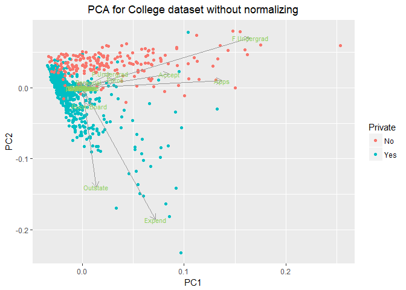

``` r
#with normalizing
prcomp(college[, -1], scale = T)
```

    ## Standard deviations (1, .., p=17):
    ##  [1] 2.3331324 2.1160899 1.0831232 1.0034481 0.9659342 0.9205429 0.7778227
    ##  [8] 0.7662347 0.7279627 0.6354389 0.5595020 0.4693901 0.4093632 0.3792007
    ## [15] 0.2964985 0.1915155 0.1516517
    ## 
    ## Rotation (n x k) = (17 x 17):
    ##                     PC1         PC2         PC3         PC4         PC5
    ## Apps         0.24876560 -0.33159823  0.06309210 -0.28131053 -0.00574141
    ## Accept       0.20760150 -0.37211675  0.10124906 -0.26781735 -0.05578609
    ## Enroll       0.17630359 -0.40372425  0.08298557 -0.16182677  0.05569364
    ## Top10perc    0.35427395  0.08241182 -0.03505553  0.05154725  0.39543434
    ## Top25perc    0.34400128  0.04477866  0.02414794  0.10976654  0.42653359
    ## F.Undergrad  0.15464096 -0.41767377  0.06139298 -0.10041234  0.04345437
    ## P.Undergrad  0.02644250 -0.31508783 -0.13968172  0.15855849 -0.30238541
    ## Outstate     0.29473642  0.24964352 -0.04659887 -0.13129136 -0.22253200
    ## Room.Board   0.24903045  0.13780888 -0.14896739 -0.18499599 -0.56091947
    ## Books        0.06475752 -0.05634184 -0.67741165 -0.08708922  0.12728883
    ## Personal    -0.04252854 -0.21992922 -0.49972112  0.23071057  0.22231102
    ## PhD          0.31831287 -0.05831132  0.12702837  0.53472483 -0.14016633
    ## Terminal     0.31705602 -0.04642945  0.06603755  0.51944302 -0.20471973
    ## S.F.Ratio   -0.17695789 -0.24666528  0.28984840  0.16118949  0.07938825
    ## perc.alumni  0.20508237  0.24659527  0.14698927 -0.01731422  0.21629741
    ## Expend       0.31890875  0.13168986 -0.22674398 -0.07927349 -0.07595812
    ## Grad.Rate    0.25231565  0.16924053  0.20806465 -0.26912907  0.10926791
    ##                      PC6          PC7          PC8          PC9
    ## Apps        -0.016237442 -0.042486349  0.103090398 -0.090227080
    ## Accept       0.007534685 -0.012949720  0.056270962 -0.177864814
    ## Enroll      -0.042557980 -0.027692894 -0.058662355 -0.128560713
    ## Top10perc   -0.052692798 -0.161332069  0.122678028  0.341099863
    ## Top25perc    0.033091590 -0.118485556  0.102491967  0.403711989
    ## F.Undergrad -0.043454235 -0.025076363 -0.078889644 -0.059441918
    ## P.Undergrad -0.191198583  0.061042346 -0.570783816  0.560672902
    ## Outstate    -0.030000391  0.108528966 -0.009845998 -0.004573329
    ## Room.Board   0.162755446  0.209744235  0.221453442  0.275022548
    ## Books        0.641054950 -0.149692034 -0.213293009 -0.133663353
    ## Personal    -0.331398003  0.633790064  0.232660840 -0.094468890
    ## PhD          0.091255521 -0.001096413  0.077040000 -0.185181525
    ## Terminal     0.154927646 -0.028477011  0.012161330 -0.254938198
    ## S.F.Ratio    0.487045875  0.219259358  0.083604874  0.274544380
    ## perc.alumni -0.047340014  0.243321156 -0.678523654 -0.255334907
    ## Expend      -0.298118619 -0.226584481  0.054159377 -0.049138881
    ## Grad.Rate    0.216163313  0.559943937  0.005335539  0.041904305
    ##                    PC10         PC11        PC12         PC13        PC14
    ## Apps        -0.05250980  0.043046207 -0.02407091  0.595830975  0.08063280
    ## Accept      -0.04114008 -0.058405585  0.14510245  0.292642398  0.03346743
    ## Enroll      -0.03448791 -0.069398883 -0.01114315 -0.444638207 -0.08569672
    ## Top10perc   -0.06402578 -0.008104814 -0.03855430  0.001023036 -0.10782819
    ## Top25perc   -0.01454923 -0.273128469  0.08935156  0.021883880  0.15174211
    ## F.Undergrad -0.02084718 -0.081157818 -0.05617677 -0.523622267 -0.05637288
    ## P.Undergrad  0.22310581  0.100693324  0.06353607  0.125997650  0.01928575
    ## Outstate    -0.18667536  0.143220673  0.82344378 -0.141856014 -0.03401154
    ## Room.Board  -0.29832424 -0.359321731 -0.35455973 -0.069748585 -0.05842898
    ## Books        0.08202922  0.031940037  0.02815937  0.011437996 -0.06684946
    ## Personal    -0.13602762 -0.018578473  0.03926403  0.039454742  0.02752862
    ## PhD          0.12345220  0.040372325 -0.02322243  0.127696382 -0.69112615
    ## Terminal     0.08857846 -0.058973403 -0.01648504 -0.058313466  0.67100861
    ## S.F.Ratio   -0.47204525  0.445000727  0.01102621 -0.017715270  0.04137410
    ## perc.alumni -0.42299971 -0.130727978 -0.18266065  0.104088088 -0.02715421
    ## Expend      -0.13228633  0.692088870 -0.32598230 -0.093746450  0.07312252
    ## Grad.Rate    0.59027107  0.219839000 -0.12210670 -0.069196978  0.03647674
    ##                     PC15         PC16         PC17
    ## Apps        -0.133405806 -0.459139498 -0.358970400
    ## Accept       0.145497511  0.518568789  0.543427250
    ## Enroll      -0.029589609  0.404318439 -0.609651110
    ## Top10perc   -0.697722522  0.148738723  0.144986329
    ## Top25perc    0.617274818 -0.051868340 -0.080347844
    ## F.Undergrad -0.009916410 -0.560363054  0.414705279
    ## P.Undergrad -0.020951598  0.052731304 -0.009017890
    ## Outstate    -0.038354479 -0.101594830 -0.050899592
    ## Room.Board  -0.003401971  0.025929338 -0.001146396
    ## Books        0.009438879 -0.002882829 -0.000772632
    ## Personal     0.003090014  0.012890402  0.001114334
    ## PhD          0.112055599 -0.029807547 -0.013813337
    ## Terminal    -0.158909651  0.027075981 -0.006209327
    ## S.F.Ratio    0.020899128  0.021247629  0.002222152
    ## perc.alumni  0.008417894 -0.003334062  0.019186974
    ## Expend       0.227742017  0.043880323  0.035309822
    ## Grad.Rate    0.003394336  0.005008447  0.013071002

``` r
college_pca = prcomp(college[, -1], scale = T)

print("PC1 with normalizing")
```

    ## [1] "PC1 with normalizing"

``` r
sort(college_pca$rotation[, 1], decreasing = T)
```

    ##   Top10perc   Top25perc      Expend         PhD    Terminal    Outstate 
    ##  0.35427395  0.34400128  0.31890875  0.31831287  0.31705602  0.29473642 
    ##   Grad.Rate  Room.Board        Apps      Accept perc.alumni      Enroll 
    ##  0.25231565  0.24903045  0.24876560  0.20760150  0.20508237  0.17630359 
    ## F.Undergrad       Books P.Undergrad    Personal   S.F.Ratio 
    ##  0.15464096  0.06475752  0.02644250 -0.04252854 -0.17695789

``` r
print("PC2 with normalizing")
```

    ## [1] "PC2 with normalizing"

``` r
sort(college_pca$rotation[, 2],decreasing = T)
```

    ##    Outstate perc.alumni   Grad.Rate  Room.Board      Expend   Top10perc 
    ##  0.24964352  0.24659527  0.16924053  0.13780888  0.13168986  0.08241182 
    ##   Top25perc    Terminal       Books         PhD    Personal   S.F.Ratio 
    ##  0.04477866 -0.04642945 -0.05634184 -0.05831132 -0.21992922 -0.24666528 
    ## P.Undergrad        Apps      Accept      Enroll F.Undergrad 
    ## -0.31508783 -0.33159823 -0.37211675 -0.40372425 -0.41767377

``` r
autoplot(prcomp(college[, -1], scale = T), data = college, colour = 'Private', loadings = TRUE, loadings.colour = "#999999", loadings.label = TRUE, loadings.label.size = 3, loadings.label.colour = "#91cf60") + 
  labs(title = "PCA for College dataset with normalizing") + 
  theme(plot.title = element_text(hjust = 0.5))
```

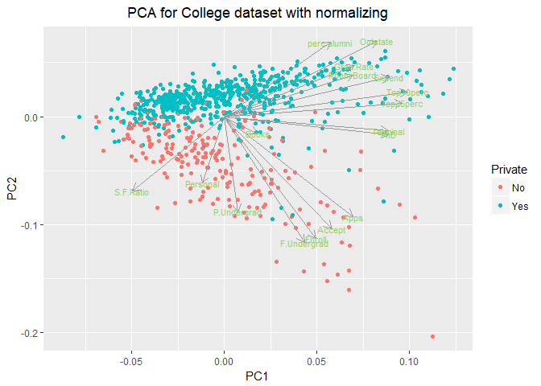

#### Q2

The cumulative proportion of variance explained by all the principal components is listed and plotted as below. In particular, the first two principal components explain about 87.1% of total variance.

``` r
college_pca = prcomp(college[, -1])

variance_explained = as.data.frame(cumsum(college_pca$sdev ^ 2 / sum(college_pca$sdev ^ 2)))

rownames(variance_explained) = colnames(college_pca$x)
colnames(variance_explained) = "cumulative proportion of variance explained"
variance_explained
```

    ##      cumulative proportion of variance explained
    ## PC1                                    0.4635922
    ## PC2                                    0.8708235
    ## PC3                                    0.9380920
    ## PC4                                    0.9695296
    ## PC5                                    0.9850640
    ## PC6                                    0.9917575
    ## PC7                                    0.9957704
    ## PC8                                    0.9992940
    ## PC9                                    0.9997171
    ## PC10                                   0.9999898
    ## PC11                                   0.9999944
    ## PC12                                   0.9999967
    ## PC13                                   0.9999984
    ## PC14                                   0.9999992
    ## PC15                                   0.9999996
    ## PC16                                   0.9999999
    ## PC17                                   1.0000000

``` r
ggplot(variance_explained, 
       aes(x = rownames(variance_explained), y = variance_explained, group=1)) +
  geom_point(color = "#00BFC4") + 
  geom_line(color = "#00BFC4") +
  scale_x_discrete(limits = c("PC1", "PC2", "PC3", "PC4", "PC5", "PC6", "PC7", "PC8", "PC9", "PC10", "PC11", "PC12", "PC13", "PC14", "PC15", "PC16", "PC17")) +
  labs(title = "Total variance explained by each component", x = "component", y = "variance") + 
  theme(plot.title = element_text(hjust = 0.5))
```

    ## Don't know how to automatically pick scale for object of type data.frame. Defaulting to continuous.

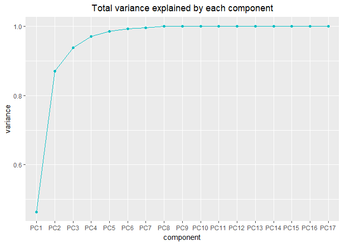

### II.USArrests

#### Q1

As can be seen from the plot below, Assault are strongly related with the first principal component, and UrbanPop are strongly related with the second principal component.

``` r
USArrests = read.csv("E:/Chicago/persp-analysis/students/liao_andi/assignment8/USArrests.csv", header = TRUE)


#without normalizing
prcomp(USArrests[, -1])
```

    ## Standard deviations (1, .., p=4):
    ## [1] 83.732400 14.212402  6.489426  2.482790
    ## 
    ## Rotation (n x k) = (4 x 4):
    ##                 PC1         PC2         PC3         PC4
    ## Murder   0.04170432 -0.04482166  0.07989066 -0.99492173
    ## Assault  0.99522128 -0.05876003 -0.06756974  0.03893830
    ## UrbanPop 0.04633575  0.97685748 -0.20054629 -0.05816914
    ## Rape     0.07515550  0.20071807  0.97408059  0.07232502

``` r
USArrests_pca = prcomp(USArrests[, -1])

print("PC1 without normalizing")
```

    ## [1] "PC1 without normalizing"

``` r
sort(USArrests_pca$rotation[, 1], decreasing = T)
```

    ##    Assault       Rape   UrbanPop     Murder 
    ## 0.99522128 0.07515550 0.04633575 0.04170432

``` r
print("PC2 without normalizing")
```

    ## [1] "PC2 without normalizing"

``` r
sort(USArrests_pca$rotation[, 2], decreasing = T)
```

    ##    UrbanPop        Rape      Murder     Assault 
    ##  0.97685748  0.20071807 -0.04482166 -0.05876003

``` r
autoplot(prcomp(USArrests[, -1]), data = USArrests, colour = "#00BFC4", loadings = TRUE, loadings.colour = "#999999", loadings.label = TRUE, loadings.label.size = 3, loadings.label.colour = "#F8766D") +
  labs(title = "PCA for USArrestse dataset without normalizing") + 
  theme(plot.title = element_text(hjust = 0.5))
```

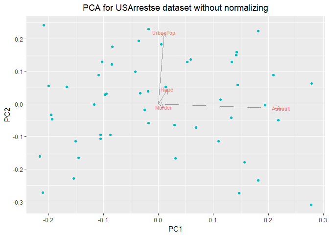

#### Q2

Using the K-means clustering with K = 2, the following plot can be generated. It is easy to observe from the plot that states with positive PC1 value are grouped into cluster1, while states with negative PC1 value are grouped into cluster2. As PC1 is strongly related with Assault, these two groups might be really different on their Assault value.

``` r
USArrests_Cluster = kmeans(USArrests[, -1], 2)
USArrests_Cluster
```

    ## K-means clustering with 2 clusters of sizes 29, 21
    ## 
    ## Cluster means:
    ##      Murder  Assault UrbanPop     Rape
    ## 1  4.841379 109.7586 64.03448 16.24828
    ## 2 11.857143 255.0000 67.61905 28.11429
    ## 
    ## Clustering vector:
    ##  [1] 2 2 2 2 2 2 1 2 2 2 1 1 2 1 1 1 1 2 1 2 1 2 1 2 1 1 1 2 1 1 2 2 2 1 1
    ## [36] 1 1 1 1 2 1 2 2 1 1 1 1 1 1 1
    ## 
    ## Within cluster sum of squares by cluster:
    ## [1] 54762.30 41636.73
    ##  (between_SS / total_SS =  72.9 %)
    ## 
    ## Available components:
    ## 
    ## [1] "cluster"      "centers"      "totss"        "withinss"    
    ## [5] "tot.withinss" "betweenss"    "size"         "iter"        
    ## [9] "ifault"

``` r
rownames(USArrests) = USArrests[, 1]
autoplot(kmeans(USArrests[, -1], 2), data = USArrests[, -1], label = TRUE, label.size = 2.5) +
  labs(title = "K-means clustering with K = 2") + 
  theme(plot.title = element_text(hjust = 0.5))
```

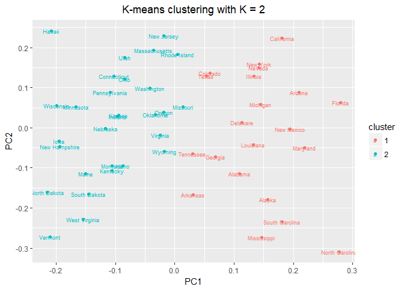

#### Q3

Using the K-means clustering with K = 4, the following plot can be generated. Similar to the case when K = 2, states are divided into four groups according to their PC1 value. States with highest and positive PC1 value are grouped into cluster1, ranging from 0.2 to 0.3, while states with lowest and negative PC1 value are grouped into cluster4, ranging from -0.225 to -0.05. Cluster 2 and cluster 3 are also different on their PC1 value, separated by PC1 = 0.1. It seems that these four groups are clustered based on their different levels of PC1.

``` r
USArrests_Cluster = kmeans(USArrests[, -1], 4)
USArrests_Cluster
```

    ## K-means clustering with 4 clusters of sizes 4, 12, 20, 14
    ## 
    ## Cluster means:
    ##      Murder  Assault UrbanPop     Rape
    ## 1 11.950000 316.5000 68.00000 26.70000
    ## 2 11.766667 257.9167 68.41667 28.93333
    ## 3  4.270000  87.5500 59.75000 14.39000
    ## 4  8.214286 173.2857 70.64286 22.84286
    ## 
    ## Clustering vector:
    ##        Alabama         Alaska        Arizona       Arkansas     California 
    ##              2              2              1              4              2 
    ##       Colorado    Connecticut       Delaware        Florida        Georgia 
    ##              4              3              2              1              4 
    ##         Hawaii          Idaho       Illinois        Indiana           Iowa 
    ##              3              3              2              3              3 
    ##         Kansas       Kentucky      Louisiana          Maine       Maryland 
    ##              3              3              2              3              1 
    ##  Massachusetts       Michigan      Minnesota    Mississippi       Missouri 
    ##              4              2              3              2              4 
    ##        Montana       Nebraska         Nevada  New Hampshire     New Jersey 
    ##              3              3              2              3              4 
    ##     New Mexico       New York North Carolina   North Dakota           Ohio 
    ##              2              2              1              3              3 
    ##       Oklahoma         Oregon   Pennsylvania   Rhode Island South Carolina 
    ##              4              4              3              4              2 
    ##   South Dakota      Tennessee          Texas           Utah        Vermont 
    ##              3              4              4              3              3 
    ##       Virginia     Washington  West Virginia      Wisconsin        Wyoming 
    ##              4              4              3              3              4 
    ## 
    ## Within cluster sum of squares by cluster:
    ## [1]  2546.350  6705.907 19263.760  9136.643
    ##  (between_SS / total_SS =  89.4 %)
    ## 
    ## Available components:
    ## 
    ## [1] "cluster"      "centers"      "totss"        "withinss"    
    ## [5] "tot.withinss" "betweenss"    "size"         "iter"        
    ## [9] "ifault"

``` r
autoplot(kmeans(USArrests[, -1], 4), data = USArrests[, -1], label = TRUE, label.size = 2.5) +
  labs(title = "K-means clustering with K = 4") + 
  theme(plot.title = element_text(hjust = 0.5))
```

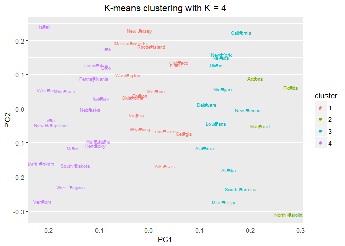

#### Q4

Using the K-means clustering with K = 3, the following plot can be generated. Similar to the case when K = 2 and K = 4, states are divided into three groups based on their PC1 value. States with PC1 value ranging from 0.1 to 0.3 are grouped into cluster1, while states with PC1 value ranging from -0.225 to -0.05 are grouped into cluster3. Cluster 2 lies in the middle, ranging from - 0.05 to 0.1. Clearly, these three groups are clustered according to their different levels of PC1 values.

``` r
USArrests_Cluster = kmeans(USArrests[, -1], 3)
USArrests_Cluster
```

    ## K-means clustering with 3 clusters of sizes 16, 14, 20
    ## 
    ## Cluster means:
    ##      Murder  Assault UrbanPop     Rape
    ## 1 11.812500 272.5625 68.31250 28.37500
    ## 2  8.214286 173.2857 70.64286 22.84286
    ## 3  4.270000  87.5500 59.75000 14.39000
    ## 
    ## Clustering vector:
    ##        Alabama         Alaska        Arizona       Arkansas     California 
    ##              1              1              1              2              1 
    ##       Colorado    Connecticut       Delaware        Florida        Georgia 
    ##              2              3              1              1              2 
    ##         Hawaii          Idaho       Illinois        Indiana           Iowa 
    ##              3              3              1              3              3 
    ##         Kansas       Kentucky      Louisiana          Maine       Maryland 
    ##              3              3              1              3              1 
    ##  Massachusetts       Michigan      Minnesota    Mississippi       Missouri 
    ##              2              1              3              1              2 
    ##        Montana       Nebraska         Nevada  New Hampshire     New Jersey 
    ##              3              3              1              3              2 
    ##     New Mexico       New York North Carolina   North Dakota           Ohio 
    ##              1              1              1              3              3 
    ##       Oklahoma         Oregon   Pennsylvania   Rhode Island South Carolina 
    ##              2              2              3              2              1 
    ##   South Dakota      Tennessee          Texas           Utah        Vermont 
    ##              3              2              2              3              3 
    ##       Virginia     Washington  West Virginia      Wisconsin        Wyoming 
    ##              2              2              3              3              2 
    ## 
    ## Within cluster sum of squares by cluster:
    ## [1] 19563.863  9136.643 19263.760
    ##  (between_SS / total_SS =  86.5 %)
    ## 
    ## Available components:
    ## 
    ## [1] "cluster"      "centers"      "totss"        "withinss"    
    ## [5] "tot.withinss" "betweenss"    "size"         "iter"        
    ## [9] "ifault"

``` r
autoplot(kmeans(USArrests[, -1], 3), data = USArrests[, -1], label = TRUE, label.size = 2.5) +
  labs(title = "K-means clustering with K = 3") + 
  theme(plot.title = element_text(hjust = 0.5))
```

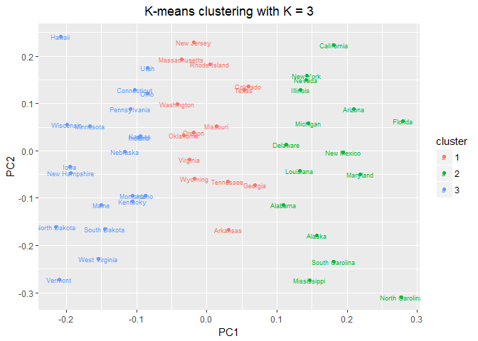

#### Q5

Using the first two principal components score vectors to conduct K-means clustering, the result is exactly the same with the clustering results using raw data.

States are divided into three differnet groups as their PC1 values vary. The first group is from 0.1 to 0.3, the second group is from - 0.05 to 0.1, and the last group is from -0.225 to -0.05. Therefore, these three groups are clustered according to their various levels of PC1 values.

``` r
USArrests_Cluster = kmeans(USArrests_pca$x, 3)
USArrests_Cluster
```

    ## K-means clustering with 3 clusters of sizes 14, 20, 16
    ## 
    ## Cluster means:
    ##          PC1       PC2        PC3        PC4
    ## 1   2.888932  5.140574  0.4091400 -0.5060975
    ## 2 -83.741577 -1.982213 -0.1620741  0.1020305
    ## 3 102.149155 -2.020236 -0.1554049  0.3152972
    ## 
    ## Clustering vector:
    ##  [1] 3 3 3 1 3 1 2 3 3 1 2 2 3 2 2 2 2 3 2 3 1 3 2 3 1 2 2 3 2 1 3 3 3 2 2
    ## [36] 1 1 2 1 3 2 1 1 2 2 1 1 2 2 1
    ## 
    ## Within cluster sum of squares by cluster:
    ## [1]  9136.643 19263.760 19563.862
    ##  (between_SS / total_SS =  86.5 %)
    ## 
    ## Available components:
    ## 
    ## [1] "cluster"      "centers"      "totss"        "withinss"    
    ## [5] "tot.withinss" "betweenss"    "size"         "iter"        
    ## [9] "ifault"

``` r
data = as.data.frame(USArrests_pca$x)
rownames(data) = USArrests[, 1]
autoplot(kmeans(data, 3), data = data, label = TRUE, label.size = 2.5) +
  labs(title = "K-means clustering with K = 3 using PCA") + 
  theme(plot.title = element_text(hjust = 0.5))
```

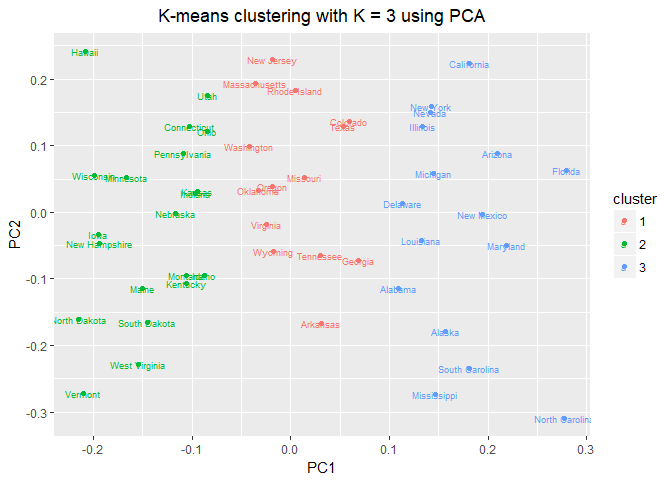

#### Q6

Using hierarchical clustering with complete linkage and Euclidean distance, the result is plotted as follows.

``` r
hc = hclust(dist(USArrests[, -1]), "complete")

ggdendrogram(hc, rotate = T,theme_dendro = F) + 
  labs(title = "Hierarchical clustering with complete linkage and Euclidean distance") + 
  theme(plot.title = element_text(hjust = 0.5))
```

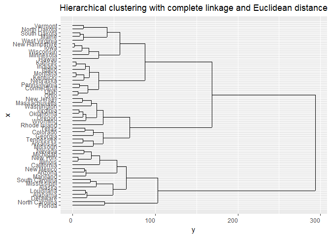

#### Q7

As shown below, the dendrogram can be cut at a height of 150 to get three different clusters.

-   Cluster 1 includes:

Alabama
Alaska
Arizona
California
Delaware
Florida
Illinois
Louisiana
Maryland
Michigan
Mississippi
Nevada
New Mexico
New York
North Carolina
South Carolina

-   Cluster 2 includes:

Arkansas
Colorado
Georgia
Massachusetts
Missouri
New Jersey
Oklahoma
Oregon
Rhode Island
Tennessee
Texas
Virginia
Washington
Wyoming

-   Cluster 3 includes:

Connecticut
Hawaii
Idaho
Indiana
Iowa
Kansas
Kentucky
Maine
Minnesota
Montana
Nebraska
New Hampshire
North Dakota
Ohio
Pennsylvania
South Dakota
Utah
Vermont
West Virginia
Wisconsin

``` r
hc = hclust(dist(USArrests[, -1]), "complete")

ggdendrogram(hc, rotate = T, theme_dendro = F) + 
  geom_hline(yintercept = 150,linetype="dashed", color = "#00BFC4") +
  labs(title = "Hierarchical clustering without scaling") +
  theme(plot.title = element_text(hjust = 0.5))
```

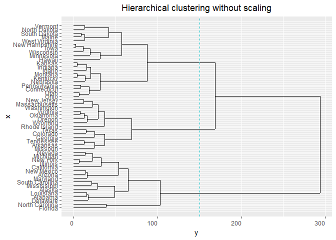

``` r
dend = color_labels(hc, k = 3)
labels_cex(dend) = 0.6
plot(dend, horiz = T, main = "Colored dendrogram without scaling but with K = 3")
```

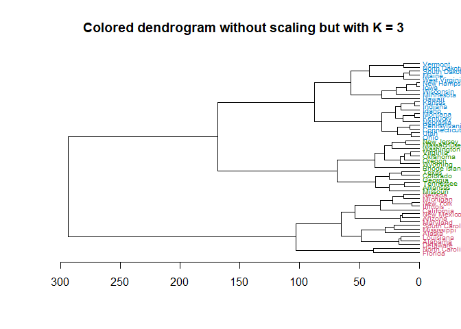

``` r
cut_tree = as.data.frame(cutree(hc, k = 3))
colnames(cut_tree) = "Cluster"
table(cut_tree)
```

    ## cut_tree
    ##  1  2  3 
    ## 16 14 20

``` r
tree1 = cut_tree
cut_tree[order(cut_tree$Cluster), , drop = F]
```

    ##                Cluster
    ## Alabama              1
    ## Alaska               1
    ## Arizona              1
    ## California           1
    ## Delaware             1
    ## Florida              1
    ## Illinois             1
    ## Louisiana            1
    ## Maryland             1
    ## Michigan             1
    ## Mississippi          1
    ## Nevada               1
    ## New Mexico           1
    ## New York             1
    ## North Carolina       1
    ## South Carolina       1
    ## Arkansas             2
    ## Colorado             2
    ## Georgia              2
    ## Massachusetts        2
    ## Missouri             2
    ## New Jersey           2
    ## Oklahoma             2
    ## Oregon               2
    ## Rhode Island         2
    ## Tennessee            2
    ## Texas                2
    ## Virginia             2
    ## Washington           2
    ## Wyoming              2
    ## Connecticut          3
    ## Hawaii               3
    ## Idaho                3
    ## Indiana              3
    ## Iowa                 3
    ## Kansas               3
    ## Kentucky             3
    ## Maine                3
    ## Minnesota            3
    ## Montana              3
    ## Nebraska             3
    ## New Hampshire        3
    ## North Dakota         3
    ## Ohio                 3
    ## Pennsylvania         3
    ## South Dakota         3
    ## Utah                 3
    ## Vermont              3
    ## West Virginia        3
    ## Wisconsin            3

#### Q8

Although trees obtained in Q7 and Q8 look similar, results of clustering are different. In Q7, states are divided relatively equally into three clusters(size = 16, 14, 20), but in Q8, cluster1(size = 8) and cluster 2(size = 11) are too small and cluster 3(size = 31) is too large. What's more, there are 10 states which used to belong to cluster 2 now belong to cluster 3, and there are also 9 states which used to belong to cluster 1 now belong to cluster 2.

It seems that after scaling, K = 3 is not yet an ideal parameter for this dataset, and K = 4 is better as it can help us to divide a subgroup from the larger cluster3. So why does K = 3 work for hierarchical clustering without scaling, but not with scaling?

I think that after standardizing, values of variables used for clustering become closer to each other, which make it harder to detect subtle differences between different states. For instance, state A with Assualt = 100 might enter into a different cluster when comparing with state B with Assualt = 80, but after scaling, they could end up with the same cluster as their Assualt value change into 1 and 0.8. The 0.2 difference is no longer powerful enough to seperate them into two different clusters.

Here are some tables comparing the outcome of clustering without scaling and with scaling.

``` r
hc = hclust(dist(scale(USArrests[, -1])), "complete")

ggdendrogram(hc, rotate = T, theme_dendro = F) + 
  geom_hline(yintercept = 5,linetype="dashed", color = "#00BFC4") +
  labs(title = "Hierarchical clustering with scaling") +  
  theme(plot.title = element_text(hjust = 0.5))
```

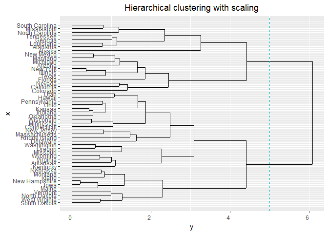

``` r
dend = color_labels(hc, k = 3)
labels_cex(dend) = 0.6
plot(dend, horiz = T, main = "Colored dendrogram with scaling but with K = 3")
```

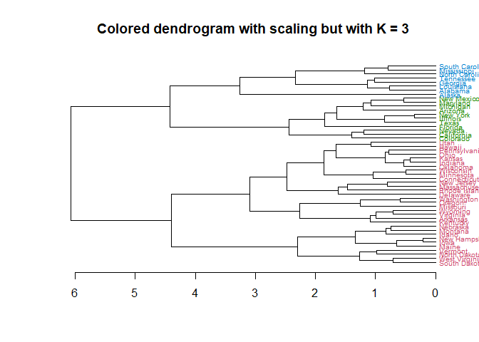

``` r
cut_tree = as.data.frame(cutree(hc, k = 3))
colnames(cut_tree) = "Cluster_Scale"
table(cut_tree)
```

    ## cut_tree
    ##  1  2  3 
    ##  8 11 31

``` r
tree2 = cut_tree
cut_tree[order(cut_tree$Cluster_Scale), , drop = F]
```

    ##                Cluster_Scale
    ## Alabama                    1
    ## Alaska                     1
    ## Georgia                    1
    ## Louisiana                  1
    ## Mississippi                1
    ## North Carolina             1
    ## South Carolina             1
    ## Tennessee                  1
    ## Arizona                    2
    ## California                 2
    ## Colorado                   2
    ## Florida                    2
    ## Illinois                   2
    ## Maryland                   2
    ## Michigan                   2
    ## Nevada                     2
    ## New Mexico                 2
    ## New York                   2
    ## Texas                      2
    ## Arkansas                   3
    ## Connecticut                3
    ## Delaware                   3
    ## Hawaii                     3
    ## Idaho                      3
    ## Indiana                    3
    ## Iowa                       3
    ## Kansas                     3
    ## Kentucky                   3
    ## Maine                      3
    ## Massachusetts              3
    ## Minnesota                  3
    ## Missouri                   3
    ## Montana                    3
    ## Nebraska                   3
    ## New Hampshire              3
    ## New Jersey                 3
    ## North Dakota               3
    ## Ohio                       3
    ## Oklahoma                   3
    ## Oregon                     3
    ## Pennsylvania               3
    ## Rhode Island               3
    ## South Dakota               3
    ## Utah                       3
    ## Vermont                    3
    ## Virginia                   3
    ## Washington                 3
    ## West Virginia              3
    ## Wisconsin                  3
    ## Wyoming                    3

``` r
tree_diff = cbind(tree1, tree2)
tree_diff
```

    ##                Cluster Cluster_Scale
    ## Alabama              1             1
    ## Alaska               1             1
    ## Arizona              1             2
    ## Arkansas             2             3
    ## California           1             2
    ## Colorado             2             2
    ## Connecticut          3             3
    ## Delaware             1             3
    ## Florida              1             2
    ## Georgia              2             1
    ## Hawaii               3             3
    ## Idaho                3             3
    ## Illinois             1             2
    ## Indiana              3             3
    ## Iowa                 3             3
    ## Kansas               3             3
    ## Kentucky             3             3
    ## Louisiana            1             1
    ## Maine                3             3
    ## Maryland             1             2
    ## Massachusetts        2             3
    ## Michigan             1             2
    ## Minnesota            3             3
    ## Mississippi          1             1
    ## Missouri             2             3
    ## Montana              3             3
    ## Nebraska             3             3
    ## Nevada               1             2
    ## New Hampshire        3             3
    ## New Jersey           2             3
    ## New Mexico           1             2
    ## New York             1             2
    ## North Carolina       1             1
    ## North Dakota         3             3
    ## Ohio                 3             3
    ## Oklahoma             2             3
    ## Oregon               2             3
    ## Pennsylvania         3             3
    ## Rhode Island         2             3
    ## South Carolina       1             1
    ## South Dakota         3             3
    ## Tennessee            2             1
    ## Texas                2             2
    ## Utah                 3             3
    ## Vermont              3             3
    ## Virginia             2             3
    ## Washington           2             3
    ## West Virginia        3             3
    ## Wisconsin            3             3
    ## Wyoming              2             3

``` r
hc.complete = hclust(dist(USArrests[, -1]), method = "complete")
hc.complete.sd = hclust(dist(scale(USArrests[, -1])), method = "complete")
table(cutree(hc.complete, 3), cutree(hc.complete.sd, 3))
```

    ##    
    ##      1  2  3
    ##   1  6  9  1
    ##   2  2  2 10
    ##   3  0  0 20
