Homework 07: Notebook
================
Kristopher Nichols
November 27, 2017

``` r
library(knitr)
library(dplyr)
library(rmarkdown)
library(tidyr)
library(foreign)
library(ggplot2)
library(tidyverse)
library(data.table)
library(scales)
```

``` r
data(gss, package = "poliscidata")
gss <- as_tibble(gss)
View(gss)
```

``` r
#1
gss %>%
  ggplot(aes(vote08_coded)) +
    geom_bar(aes(fill = pres08))
```

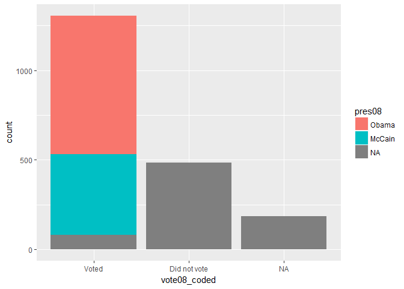

``` r
#2
gss %>%
  ggplot(aes(pres08)) +
    geom_bar()
```

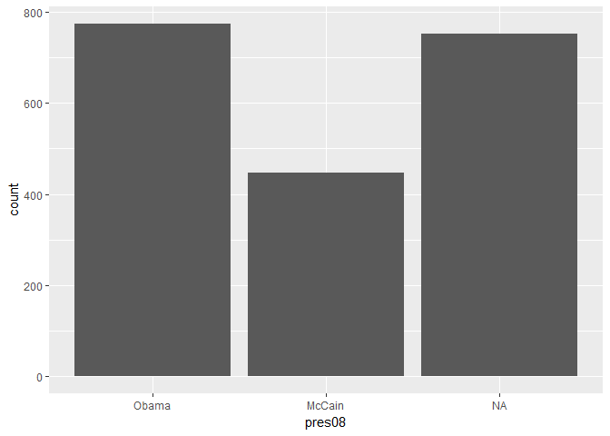

``` r
#3  Who did and didnt vote by age?
gss %>%
  ggplot(aes(vote08_coded, age)) +
    geom_count()
```

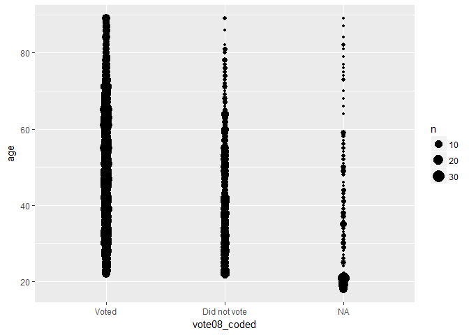

``` r
#4 Better graph
gss %>%
  ggplot(aes(vote08_coded, age)) +
    geom_violin()
```

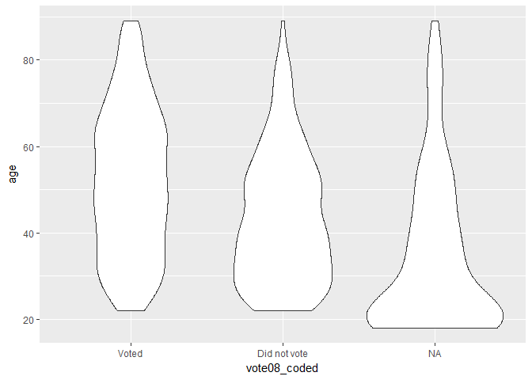

``` r
#5 Voting by age
gss %>%
  ggplot(aes(pres08, age)) +
    geom_violin()
```

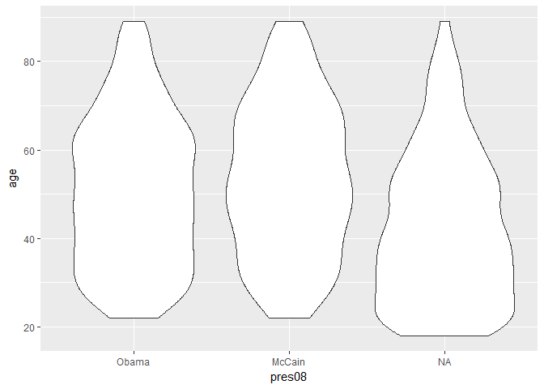

``` r
#6 Density of age 
gss %>%
  ggplot(aes(age)) +
    geom_density()
```

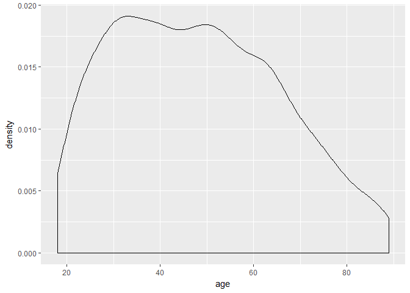

``` r
#7 More info about who voted
gss %>%
  ggplot(aes(vote08_coded, race)) +
    geom_count()
```

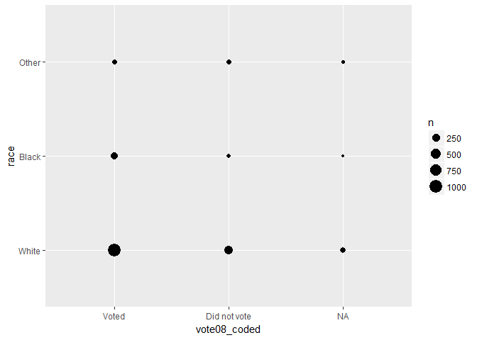

``` r
#8 Pres voting by race
gss %>%
  ggplot(aes(pres08, race)) +
    geom_count()
```

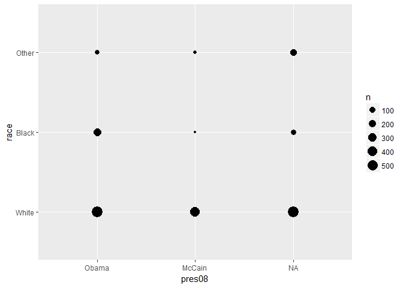

``` r
#9 Show discrepancy between number of whites in sample *important*
gss %>%
  ggplot(aes(race)) +
    geom_bar()
```

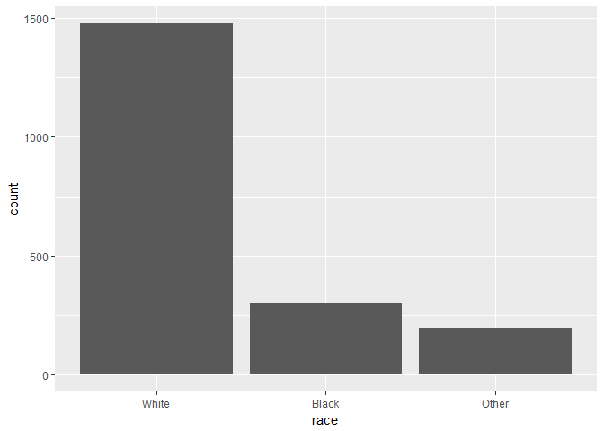

``` r
#10 Many more older whites than older blacks/others
gss %>%
  ggplot(aes(race, age)) +
    geom_violin()
```

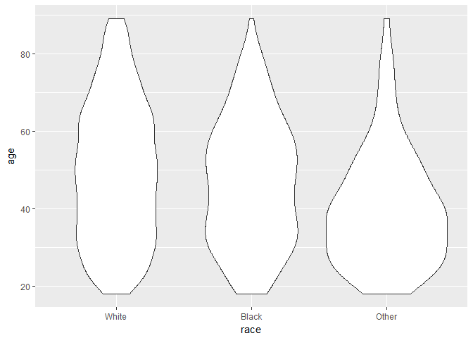

``` r
#11
gss %>%
  ggplot(aes(vote08_coded, age)) +
    geom_violin()
```


``` r
#12 Strong and Weak Dems had best showing
gss %>%
  ggplot(aes(partyid, pres08)) +
    geom_count()
```

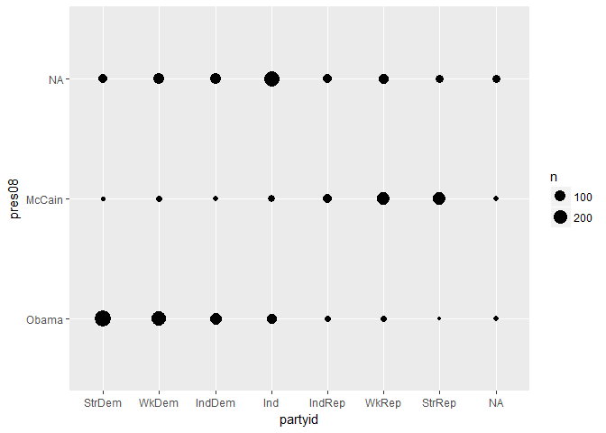

``` r
#13 As shown in #5 younger populations came out for Obama
gss %>%
  ggplot(aes(partyid, age)) +
    geom_violin()
```

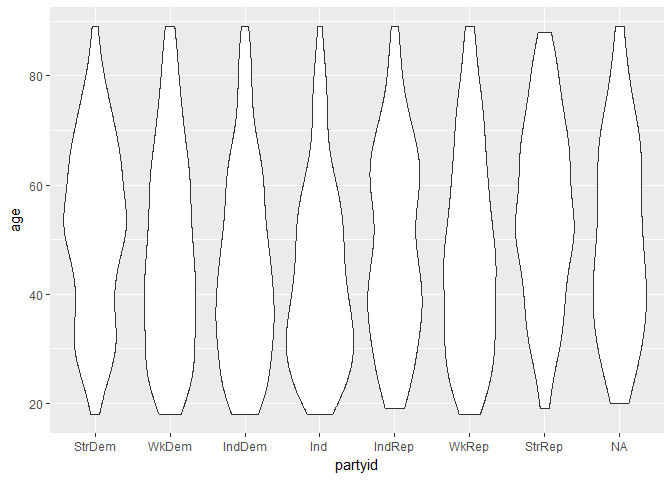

``` r
#14 #Graph data altered by large number of whites *important*
gss %>%
  ggplot(aes(partyid, race)) +
    geom_count()
```

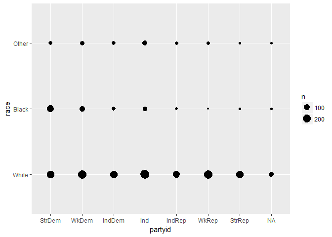

``` r
gss %>%
  ggplot(aes(partyid, race)) +
    geom_count(aes(size = ..prop.., group = race))
```

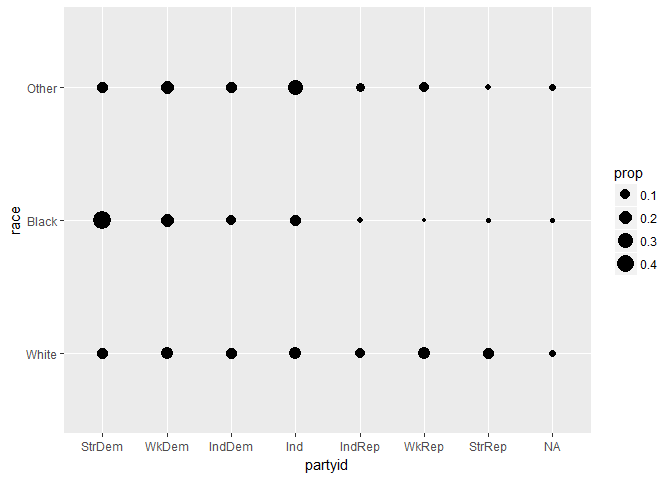

``` r
gss %>%
  ggplot(aes(polviews, race)) +
    geom_count(aes(size = ..prop.., group = race))
```

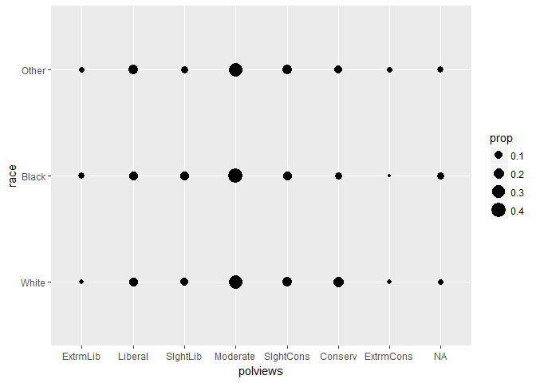

``` r
#15
gss %>%
  ggplot(aes(polviews, partyid)) +
    geom_count()
```

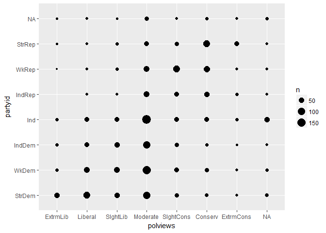

``` r
#16
gss %>%
  ggplot(aes(polviews, pres08)) +
    geom_count()
```

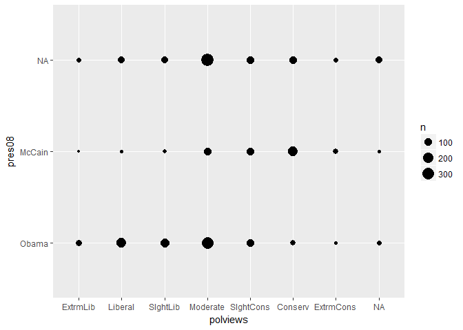

``` r
#17
gss %>%
  ggplot(aes(polviews, degree)) +
    geom_count()
```

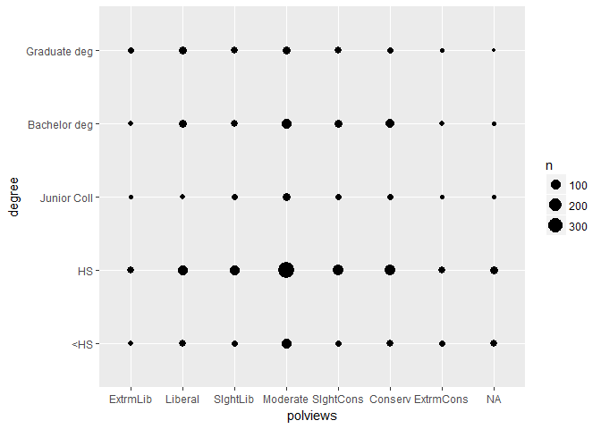

``` r
#18
gss %>%
  ggplot(aes(degree, pres08)) +
    geom_count()
```

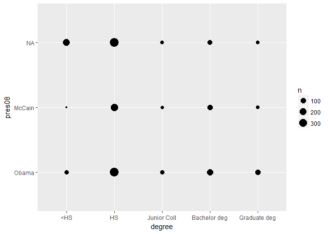

``` r
#19
gss %>%
  ggplot(aes(degree, partyid)) +
    geom_count()
```

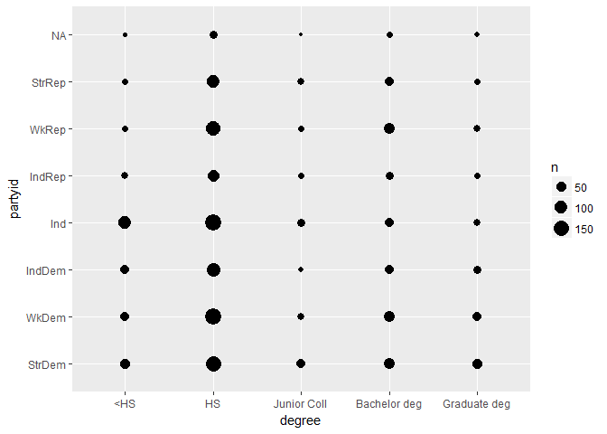

``` r
#20
gss %>%
  ggplot(aes(degree)) +
    geom_bar(aes(fill = race))
```

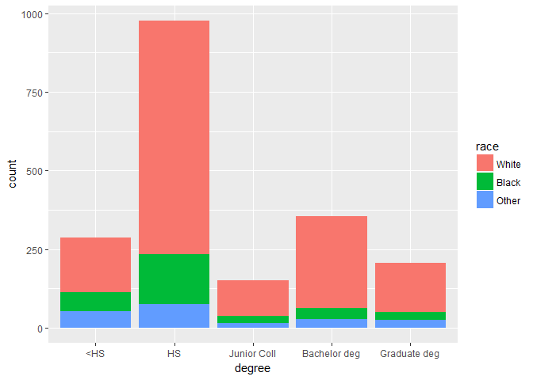

``` r
gss %>%
  ggplot(aes(relig)) +
    geom_bar() +
    theme(axis.text.x = element_text(angle = 90))
```

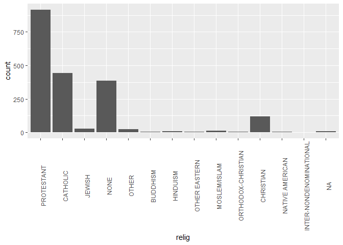

``` r
#21 Relig & Party
gss %>%
  ggplot(aes(relig, partyid)) +
    geom_count(aes(size = ..prop.., group = relig)) +
    theme(axis.text.x = element_text(angle = 90))
```

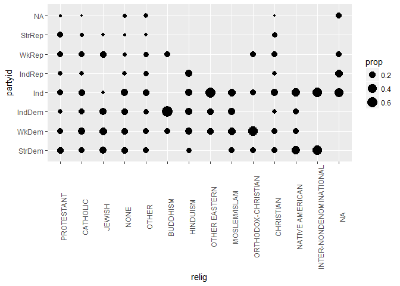

``` r
#22 Fundamentalism and PArty
gss %>%
  ggplot(aes(fund, partyid)) +
    geom_count(aes(size = ..prop.., group = fund)) +
    theme(axis.text.x = element_text(angle = 90)) +
    scale_size_area(max_size = 12)
```

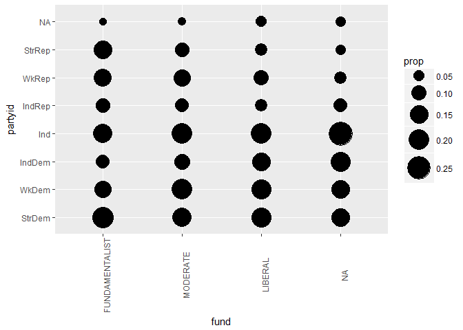

``` r
#23 Atheism keys
gss %>%
  ggplot(aes(attend, partyid)) +
    geom_count() +
    theme(axis.text.x = element_text(angle = 90)) +
    scale_size_area(max_size = 10)
```

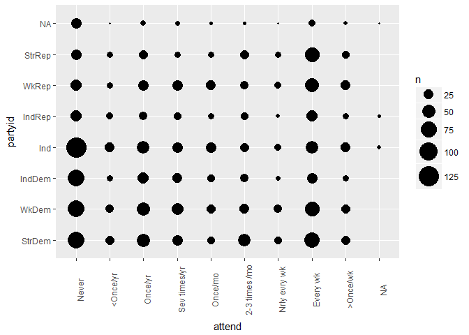

``` r
#24
gss %>%
  ggplot(aes(reliten, partyid)) +
    geom_count(aes(size = ..prop.., group = reliten)) +
    theme(axis.text.x = element_text(angle = 90)) +
    scale_size_area(max_size = 10)
```

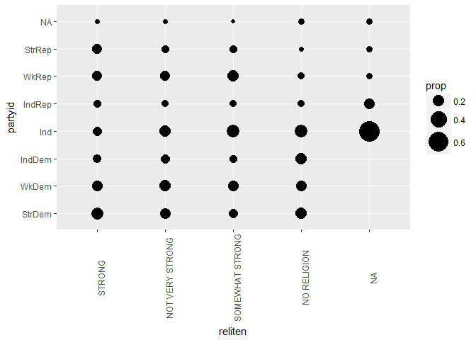

``` r
#26
gss %>%
  ggplot(aes(pray, partyid)) +
    geom_count(aes(size = ..prop.., group = pray)) +
    theme(axis.text.x = element_text(angle = 90)) +
    scale_size_area(max_size = 12)
```

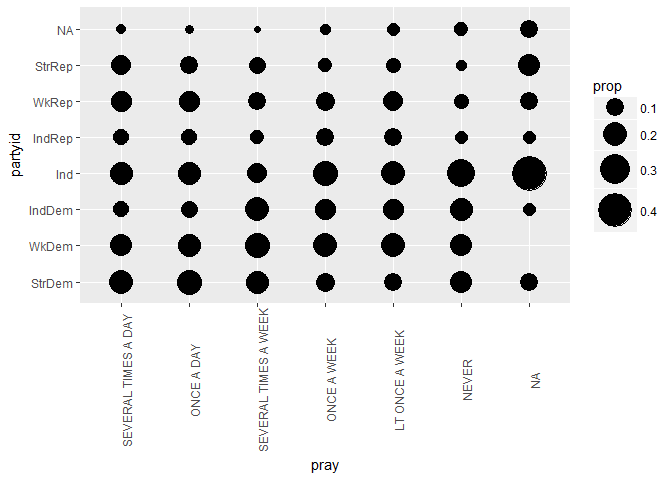

``` r
#27 Check back on how partyid relates to voting behavior
gss %>%
  ggplot(aes(partyid, vote08_coded)) +
    geom_count() +
    scale_size_area(max_size = 12)
```

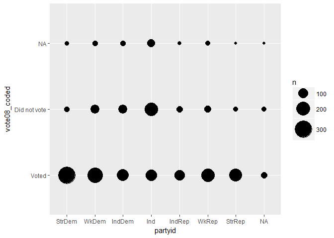

``` r
gss %>%
  ggplot(aes(relig, vote08_coded)) +
  geom_count(aes(size = ..prop.., group = relig)) +
  theme(axis.text.x = element_text(angle = 90)) +
  scale_size_area(max_size = 12)
```

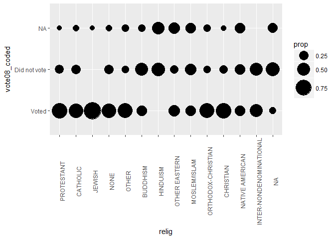

``` r
#28 Connections between religious behaviors and voting
gss %>%
  ggplot(aes(pray, vote08_coded)) +
    geom_count(aes(size = ..prop.., group = vote08_coded)) +
    theme(axis.text.x = element_text(angle = 90)) +
    scale_size_area(max_size = 12)
```

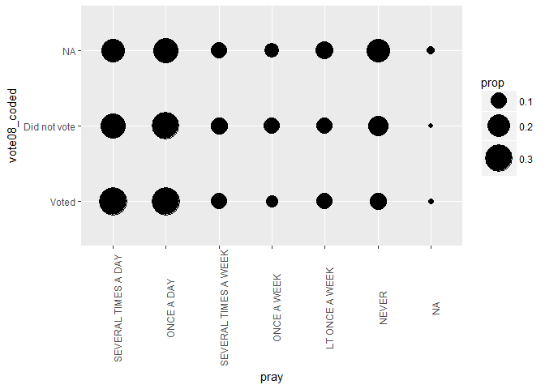

``` r
#29
gss %>%
  ggplot(aes(attend, vote08_coded)) +
    geom_count(aes(size = ..prop.., group = vote08_coded)) +
    theme(axis.text.x = element_text(angle = 90)) +
    scale_size_area(max_size = 12)
```

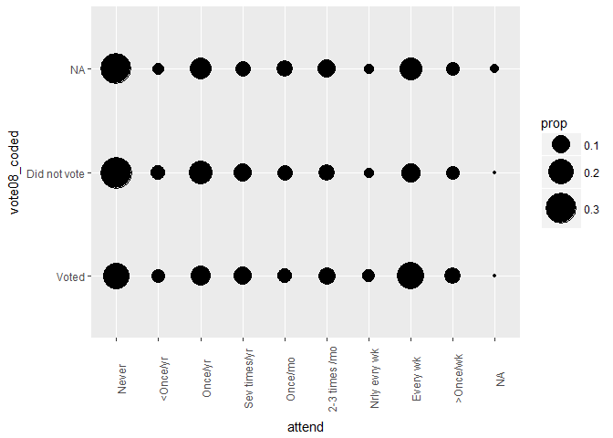

``` r
#30
gss %>%
  ggplot(aes(pray, partyid)) +
    geom_count(aes(size = ..prop.., group = pray)) +
    theme(axis.text.x = element_text(angle = 90)) +
    scale_size_area(max_size = 12)
```


``` r
#31
gss %>%
  ggplot(aes(pray, obey)) +
    geom_count(aes(size = ..prop.., group = pray)) +
    theme(axis.text.x = element_text(angle = 90)) +
    scale_size_area(max_size = 12)
```

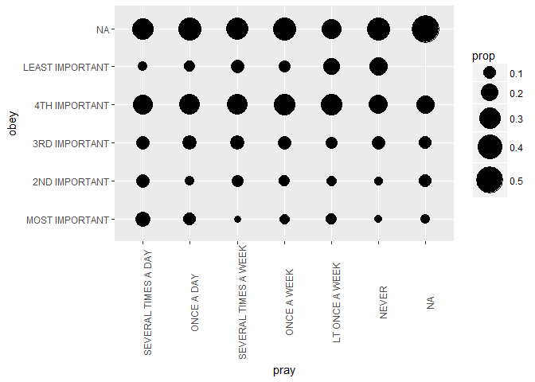

``` r
#32
gss %>%
  ggplot(aes(attend, obey)) +
    geom_count(aes(size = ..prop.., group = attend)) +
    theme(axis.text.x = element_text(angle = 90)) +
    scale_size_area(max_size = 12)
```

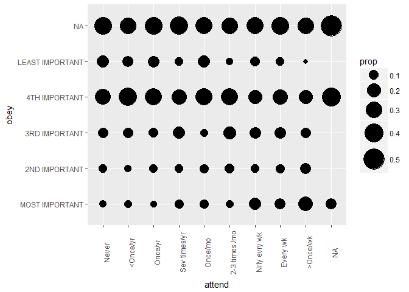

``` r
#33
gss %>%
  ggplot(aes(obey, vote08_coded)) +
    geom_count(aes(size = ..prop.., group = vote08_coded)) +
    theme(axis.text.x = element_text(angle = 90)) +
    scale_size_area(max_size = 12)
```

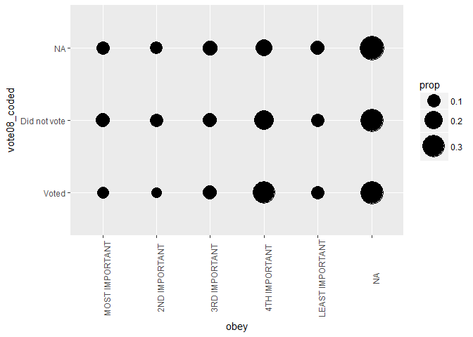

``` r
#34
gss %>%
  ggplot(aes(obey, thnkself)) +
    geom_count(aes(size = ..prop.., group = obey)) +
    theme(axis.text.x = element_text(angle = 90)) +
    scale_size_area(max_size = 12)
```

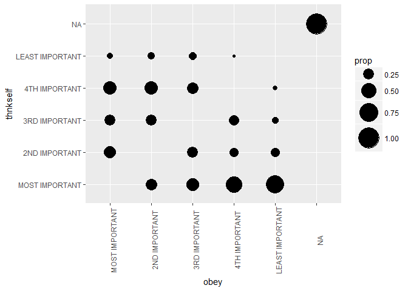

``` r
#35
gss %>%
  ggplot(aes(vote08_coded, thnkself)) +
    geom_count(aes(size = ..prop.., group = vote08_coded)) +
    theme(axis.text.x = element_text(angle = 90)) +
    scale_size_area(max_size = 12)
```


``` r
#36
gss %>%
  ggplot(aes(pray, thnkself)) +
    geom_count(aes(size = ..prop.., group = pray)) +
    theme(axis.text.x = element_text(angle = 90)) +
    scale_size_area(max_size = 12)
```

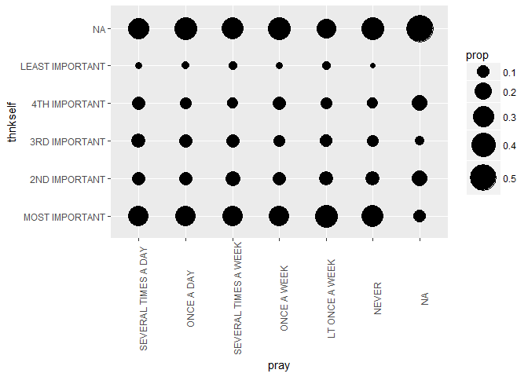

``` r
#37
gss %>%
  ggplot(aes(consci, vote08_coded)) +
    geom_count(aes(size = ..prop.., group = consci)) +
    theme(axis.text.x = element_text(angle = 90)) +
    scale_size_area(max_size = 20)
```

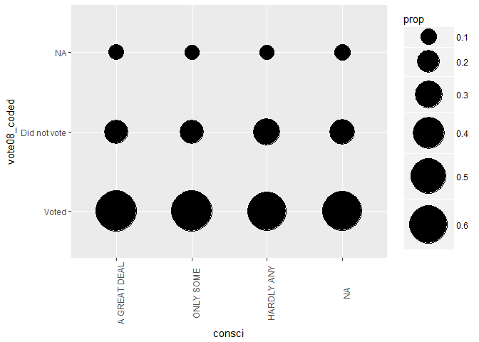

``` r
#38
gss %>%
  ggplot(aes(bible, vote08_coded)) +
    geom_count(aes(size = ..prop.., group = bible)) +
    theme(axis.text.x = element_text(angle = 90)) +
    scale_size_area(max_size = 20)
```

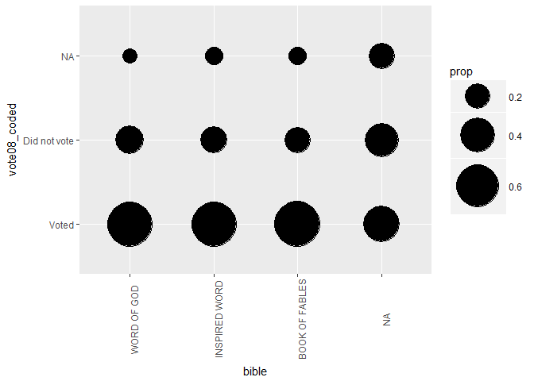

``` r
#39
gss %>%
  ggplot(aes(postlife, vote08_coded)) +
    geom_count(aes(size = ..prop.., group = postlife)) +
    theme(axis.text.x = element_text(angle = 90)) +
    scale_size_area(max_size = 20)
```

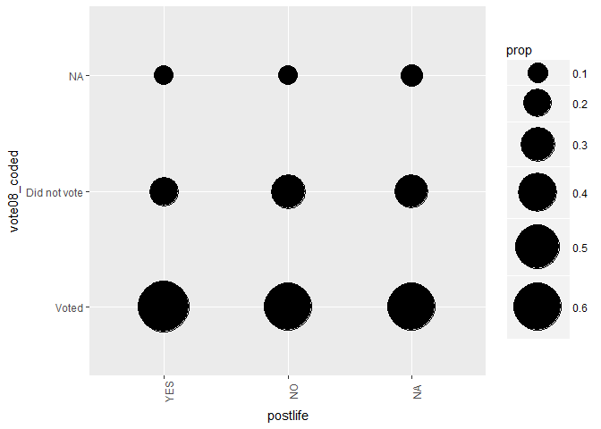

``` r
#40 Important* 
gss %>%
  ggplot(aes(spkath, vote08_coded)) +
    geom_count(aes(size = ..prop.., group = vote08_coded)) +
    theme(axis.text.x = element_text(angle = 90)) +
    scale_size_area(max_size = 20)
```

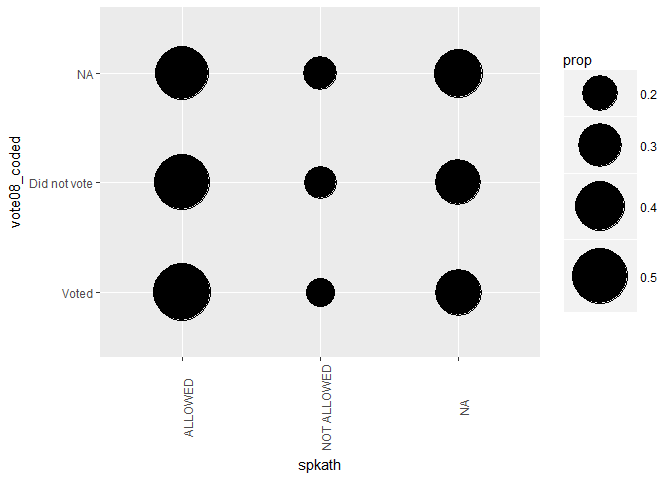

``` r
#41
gss %>%
  ggplot(aes(colath, vote08_coded)) +
    geom_count(aes(size = ..prop.., group = bible)) +
    theme(axis.text.x = element_text(angle = 90)) +
    scale_size_area(max_size = 20)
```

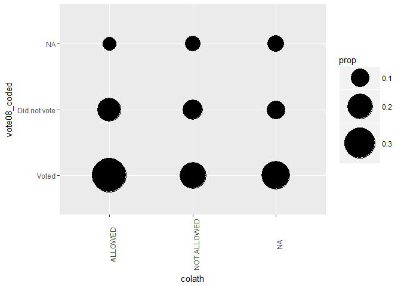

``` r
#42
gss %>%
  ggplot(aes(natsci, vote08_coded)) +
    geom_count(aes(size = ..prop.., group = bible)) +
    theme(axis.text.x = element_text(angle = 90)) +
    scale_size_area(max_size = 20)
```

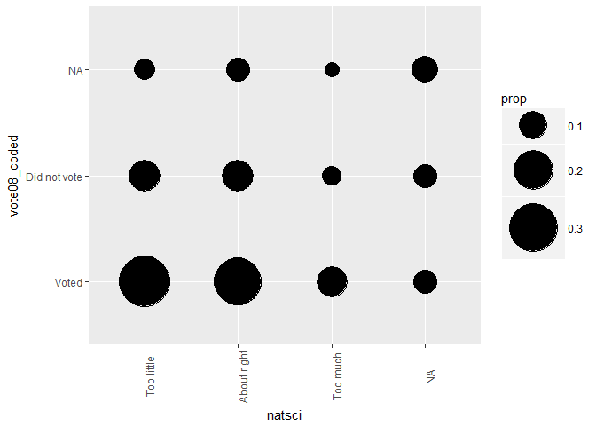

``` r
#43
gss %>%
  ggplot(aes(income06)) +
    geom_bar(aes(fill = race)) +
    theme(axis.text.x = element_text(angle = 90))
```

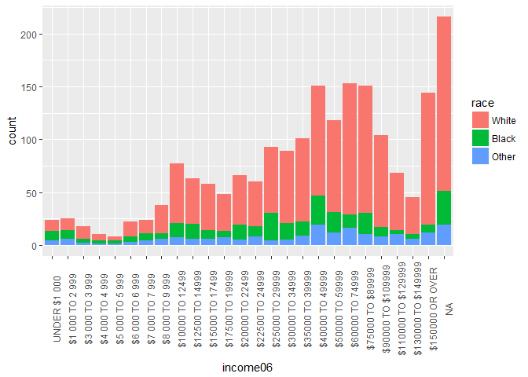

``` r
#44
gss %>%
  ggplot(aes(income06)) +
    geom_bar(aes(fill = relig)) +
    theme(axis.text.x = element_text(angle = 90))
```

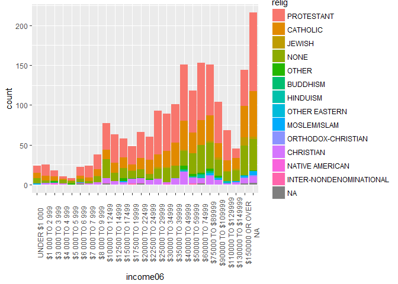
