Homework 07 - Write Up
================
Kristopher Nichols
November 27, 2017

``` r
library(knitr)
library(dplyr)
library(rmarkdown)
library(tidyr)
library(foreign)
library(ggplot2)
library(tidyverse)
library(data.table)
library(scales)
```

``` r
data(gss, package = "poliscidata")
gss <- as_tibble(gss)
```

*Demographic Investigations*

With the general social survey data I looked to investigate questions regarding how religiosity affected voting habits in the 2008 election, including my more specific hypothesis that those who are more stringent believers (e.g., pray more often, attending religious service more frequently, identifying more strongly with their belief) will have been more likely to vote. In initially looking into these questions I encountered a number of problems with the sampling methods. I found the data to be overwhelmingly filled with white, protestant, and wealthy individuals. It should be mentioned however that there are a very fair distribution across degree level with most individuals only possessing a high school level degree.

Although there were multiple questions that were asked that led to a very robust dataset, the sample was very biased (see Graph \#1) away from certain populations. This led to a few interesting questions regarding the success of Obama in the election (and in this particular sample) because as indicated by the (see Graph \#2) below, individuals who were black were much more likely to vote for Obama than McCain, but contrary to intuition, as were whites. Further investigation of this trend indicated that the difference could have emerged due to the younger than thirty population. Out of those individuals who voted for Obama, younger people were much more likely to vote for Obama, while McCain's voters were more likely to be older individuals. Furthermore, initial (see Graph \#3) indicated that white individuals were just as likely to be Democrats as black individuals but, when graphed for proportion this was clearly not true. As indicated in this (see Graph \#4) the party identification variable indicates that a much higher proportion of black individuals were strong Democrats than Whites. However, this graph does clash with another graph which indicates that in terms of political views, all three race categories (white, black, and other) were more likely to have moderate political views.

*Religiosity*

With these overarching demographic questions answered, I looked to narrow in on my primary topic of religiosity. Firstly, as briefly mentioned in the discussion of demographics, the vast majority of the religious individuals in this sample are Christian, and of the Christians the majority are Protestants. Behind the Protestants are the Catholics, and interestingly, in third place comes those with no religion. Graphs (see Graph \#5) indicate that amongst the religions, there are no incredibly strong relationships amongst religions and party identification for the most part, however, there does exist what appears to be a moderate relationship between those with no religion and their political affiliation - those who identify as not having a religion are much more likely to identify as members of the Democratic party than any other religion. Furthermore, those of Judeo-Christian religions (i.e., Protestant, Catholic, and Jewish) were slightly more likely to be of the Republican party than the other religions. I then looked to identify the variable of fundamentalism with party identification to remove potential confounds and confirm the relationship I had established, however the fundamentalism data is very peculiar. As opposed to what transpired in the previous graph, this graph indicates that there is only a slight relationship between those of the Republican party and fundamentalism, and an even more slight relationship between those of the Democratic party and liberalism, even when adjusting for proportion (see Graph 6). However, when graphing for religious service attendance habits, the possible influence of Atheists in the Democratic sample is revealed. As can be seen in (see Graph 7) those that never attend religious services are much more likely to be members of the Democratic party than not, and with the NA answer consisting of too few answers to be the Atheistic individuals it seems likely that those who responded "Never" likely included Atheists. With this tentative relationship between Atheism in Democratic party identification established, I looked to zero in on this relationship with the strength of religious belief variable which confirmed the relationship between Atheism and Democratic party membership, and also a slight relationship between individuals who are strongly religious and Republicanism (see GRAPH 8). The relationship with party identification and prayer echoed these relationships so I advanced to my main hypothesis regarding voting habits and religiosity. Initial graphs (see Graph \#9) proved my hypothesis possible, showing that those who were religious occupied a larger proportion of those that voted than those who were not religious. And when graphing prayer and those who voted, my hypothesis was tentatively confirmed. The proportion of those who voted is much higher in those pray more frequently than those who don't (see Graph \#10). Furthermore, this effect was partially confirmed by the relationship between attendance of religious services and whether individuals voted or not, with those who attend religious services the most frequently as more likely to vote than those who only attended some, but not more than those who never attend religious services (see Graph \#11). As previous religious demographic graphs may have alluded to, those who never attend religious services actually occupied the largest proportion of those who voted, indicating that again the Atheistic population is skewing these results.

``` r
# Graphs 1

gss %>%
  ggplot(aes(income06)) +
    geom_bar(aes(fill = race)) +
    theme(axis.text.x = element_text(angle = 90)) +
    labs(x = "Income Level",
       y = "Count",
       title = "Income Level and Race", fill = "Race")
```

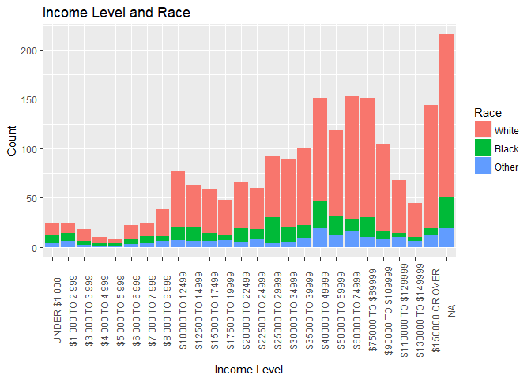

``` r
# Graph 1.2

gss %>%
  ggplot(aes(income06)) +
    geom_bar(aes(fill = relig)) +
    theme(axis.text.x = element_text(angle = 90)) +
    labs(x = "Income Level",
       y = "Count",
       title = "Income Level and Religion", fill = "Religion")
```

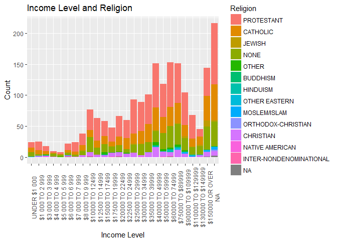

``` r
# Graph 2

gss %>%
  ggplot(aes(pres08, race)) +
    geom_count() +
    theme_bw() +
    labs(x = "Candidate Voted for",
       y = "Race",
       title = "Chosen Candidate in the 2008 Presidential Election and Race")
```

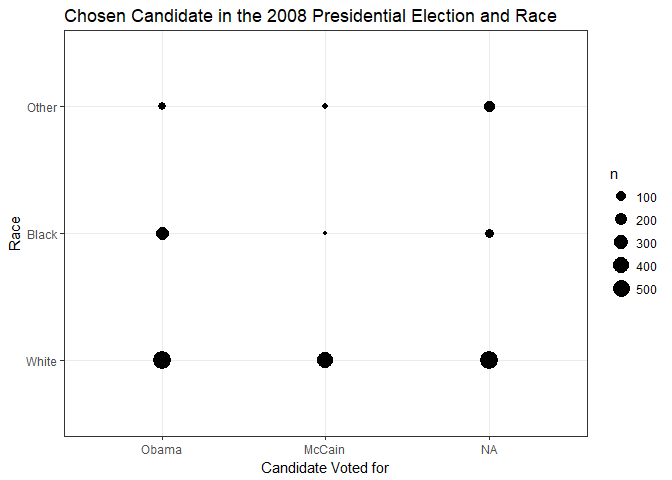

``` r
# Graph 3
gss %>%
  ggplot(aes(pres08, age)) +
    geom_violin() +
    theme_bw() +
    labs(x = "Candidate Voted for",
       y = "Age",
       title = "Chosen Candidate in the 2008 Presidential Election and Age")
```

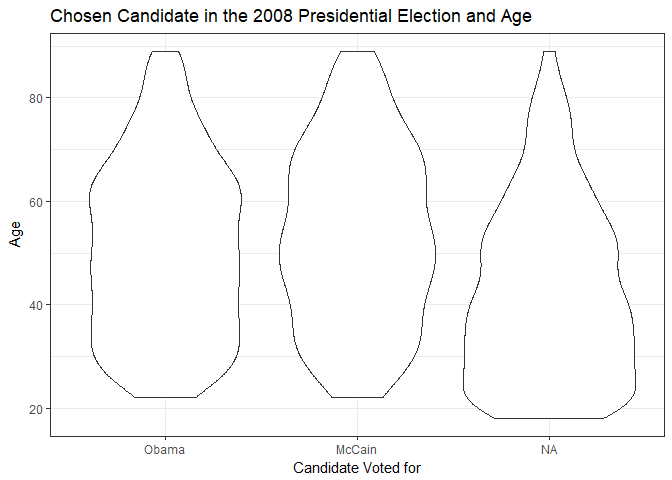

``` r
# Graph 3.2
gss %>%
  ggplot(aes(age)) +
    geom_density() +
  theme_bw() +
    labs(x = "Candidate Voted for",
       y = "Age",
       title = "Chosen Candidate in the 2008 Presidential Election and Age")
```

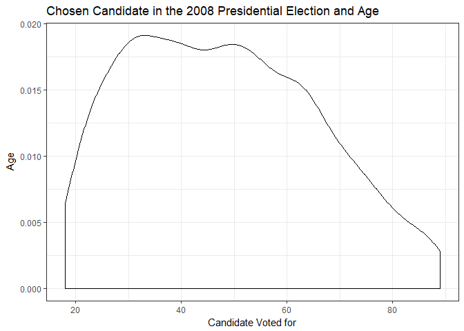

``` r
# Graph 4
gss %>%
  ggplot(aes(partyid, race)) +
    geom_count(aes(size = ..prop.., group = race)) +
    theme_bw() +
    labs(x = "Political Identity",
       y = "Race",
       title = "Political Identity and Race",
       size = "Proportion")
```

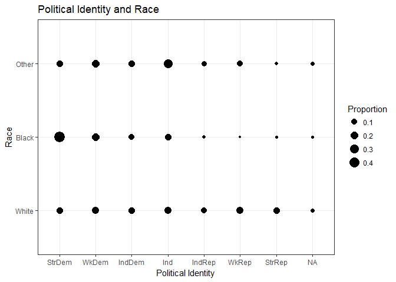

``` r
# Graph 5
gss %>%
  ggplot(aes(relig)) +
    geom_bar() +
    theme(axis.text.x = element_text(angle = 90)) +
    labs(x = "Religion",
       y = "Count",
       title = "Frequency of Each Religion")
```

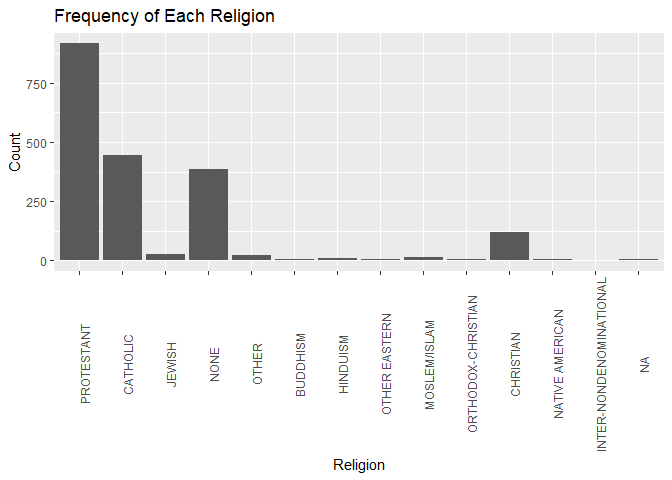

``` r
# Graph 6
gss %>%
  ggplot(aes(fund, partyid)) +
    geom_count(aes(size = ..prop.., group = fund)) +
    theme(axis.text.x = element_text(angle = 90)) +
    scale_size_area(max_size = 12) +
    theme_bw() +
    labs(x = "Fundemantalism",
       y = "Political Identity",
       title = "Fundamentalism and Political Identity",
       size = "Proportion")
```

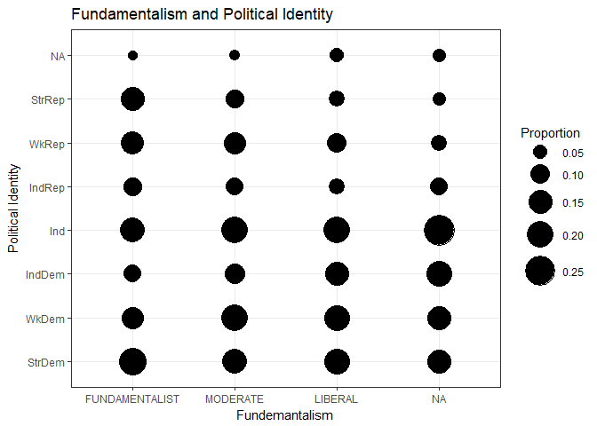

``` r
# Graph 7
gss %>%
  ggplot(aes(attend, partyid)) +
    geom_count() +
    theme(axis.text.x = element_text(angle = 90)) +
    scale_size_area(max_size = 10) +
    labs(x = "Religious Service Attendance Rate",
       y = "Political Identity",
       title = "Population Density and Life Expectancy")
```

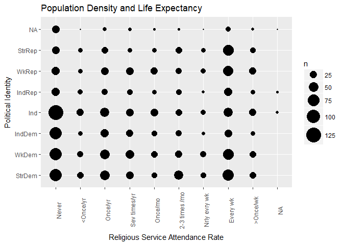

``` r
# Graph 8
gss %>%
  ggplot(aes(reliten, partyid)) +
    geom_count(aes(size = ..prop.., group = reliten)) +
    theme(axis.text.x = element_text(angle = 90)) +
    scale_size_area(max_size = 10) +
    labs(x = "Strength of Religious Belief",
       y = "Political Identity",
       title = "Strength of Religious Belief and Political Identity",
       size = "Proportion")
```

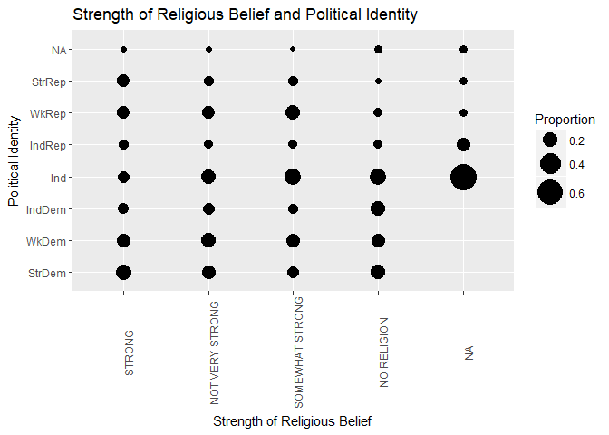

``` r
# Graph 9
gss %>%
  ggplot(aes(relig, vote08_coded)) +
  geom_count(aes(size = ..prop.., group = relig)) +
  theme(axis.text.x = element_text(angle = 90)) +
  scale_size_area(max_size = 12) +
    labs(x = "Religion",
       y = "Voting Status",
       title = "Voting Status and Religion",
       subtitle = "2008 Presidential Election",
       size = "Proportion")
```

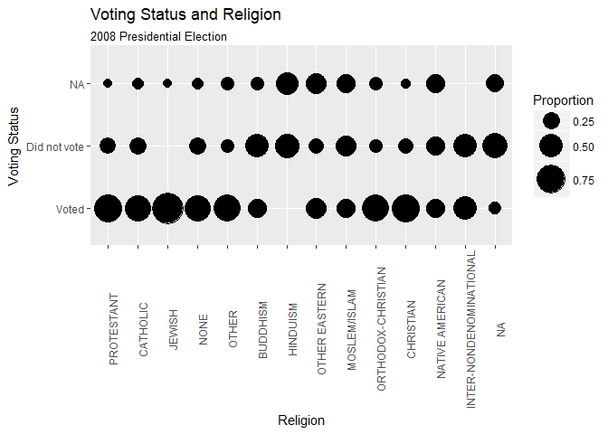

``` r
# Graph 10
gss %>%
  ggplot(aes(pray, vote08_coded)) +
    geom_count(aes(size = ..prop.., group = vote08_coded)) +
    theme(axis.text.x = element_text(angle = 90)) +
    scale_size_area(max_size = 12) +
    labs(x = "Religious Service Attendance Rate",
       y = "Voting Status",
       title = "Voting Status and Religion",
       subtitle = "2008 Presidential Election",
       size = "Proportion")
```

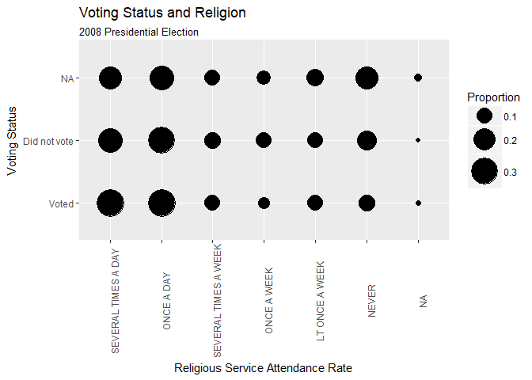

``` r
# Graph 11
gss %>%
  ggplot(aes(attend, vote08_coded)) +
    geom_count(aes(size = ..prop.., group = vote08_coded)) +
    theme(axis.text.x = element_text(angle = 90)) +
    scale_size_area(max_size = 12) +
    labs(x = "Religious Service Attendance Rate",
       y = "Voting Status",
       title = "Religious Service Attendance and Voting",
       subtitle = "Presidential Election 2008",
       size = "Proportion")
```

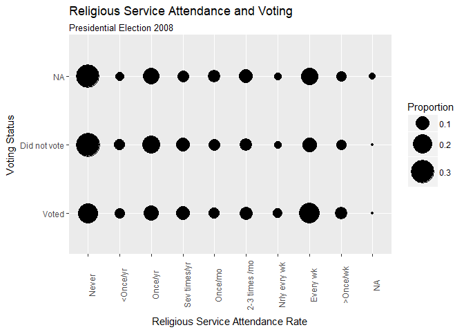
