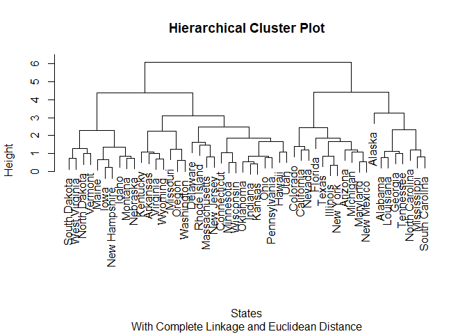

Homework 08
================
Kristopher Nichols
December 3, 2017

Libraries

``` r
library(knitr)
library(ggplot2)
library(tidyverse)
library(stats)
library(forcats)
library(tidyverse)
library(readr)
library(FactoMineR) 
library(kableExtra)
```

Load Data

``` r
College <- read_csv("~/GitHub/persp-analysis/students/nichols_kristopher/Data for HW8/College.csv")
USArrests <- read_csv("~/GitHub/persp-analysis/students/nichols_kristopher/Data for HW8/USArrests.csv")
```

Cluster College Data
====================

1 Perform PCA analysis on the college dataset and plot the first two principal components.
------------------------------------------------------------------------------------------

``` r
College1 <-College %>% 
  select(-Private)
  
pca_college <-PCA(College1, scale.unit=TRUE, graph=TRUE )
```


``` r
pc <-prcomp(College1[,-1], scale=TRUE)
head(pc$x[,1:2])
```

    ##              PC1        PC2
    ## [1,] -1.70211665 -0.3922238
    ## [2,] -1.96221682  1.3842988
    ## [3,] -1.03392146  1.4860106
    ## [4,]  3.61179071  1.3550112
    ## [5,] -2.03505656  0.4075203
    ## [6,] -0.04974564  1.4792166

Component one is most strongly associated with PhD, Terminal, Top10Perc and Top25perc, while component two is most strongly associated with F. Undergrad, Accept, Enroll, and Books. The variables associated with component one are a bit scattered, but component two seems strongly associated with variables that have to do with incoming freshman, or application-realted variables.

2 Calculate the cumulative proportion of variance explained by all the principal components.
--------------------------------------------------------------------------------------------

``` r
kable(summary.PCA(pca_college))
```

    ## 
    ## Call:
    ## PCA(X = College1, scale.unit = TRUE, graph = TRUE) 
    ## 
    ## 
    ## Eigenvalues
    ##                        Dim.1   Dim.2   Dim.3   Dim.4   Dim.5   Dim.6
    ## Variance               5.444   4.478   1.173   1.007   0.933   0.847
    ## % of var.             32.021  26.340   6.901   5.923   5.488   4.985
    ## Cumulative % of var.  32.021  58.361  65.262  71.185  76.673  81.658
    ##                        Dim.7   Dim.8   Dim.9  Dim.10  Dim.11  Dim.12
    ## Variance               0.605   0.587   0.530   0.404   0.313   0.220
    ## % of var.              3.559   3.454   3.117   2.375   1.841   1.296
    ## Cumulative % of var.  85.217  88.670  91.788  94.163  96.004  97.300
    ##                       Dim.13  Dim.14  Dim.15  Dim.16  Dim.17
    ## Variance               0.168   0.144   0.088   0.037   0.023
    ## % of var.              0.986   0.846   0.517   0.216   0.135
    ## Cumulative % of var.  98.286  99.132  99.649  99.865 100.000
    ## 
    ## Individuals (the 10 first)
    ##                 Dist    Dim.1    ctr   cos2    Dim.2    ctr   cos2  
    ## 1           |  2.458 | -1.593  0.060  0.420 |  0.767  0.017  0.097 |
    ## 2           |  5.226 | -2.192  0.114  0.176 | -0.579  0.010  0.012 |
    ## 3           |  2.395 | -1.431  0.048  0.357 | -1.093  0.034  0.208 |
    ## 4           |  4.538 |  2.856  0.193  0.396 | -2.631  0.199  0.336 |
    ## 5           |  4.250 | -2.212  0.116  0.271 |  0.022  0.000  0.000 |
    ## 6           |  2.805 | -0.572  0.008  0.042 | -1.496  0.064  0.285 |
    ## 7           |  2.727 |  0.242  0.001  0.008 | -1.506  0.065  0.305 |
    ## 8           |  2.774 |  1.750  0.072  0.398 | -1.461  0.061  0.277 |
    ## 9           |  2.917 |  0.769  0.014  0.070 | -1.984  0.113  0.463 |
    ## 10          |  4.050 | -2.771  0.182  0.468 | -0.845  0.021  0.043 |
    ##              Dim.3    ctr   cos2  
    ## 1           -0.101  0.001  0.002 |
    ## 2            2.279  0.570  0.190 |
    ## 3           -0.438  0.021  0.033 |
    ## 4            0.142  0.002  0.001 |
    ## 5            2.387  0.625  0.315 |
    ## 6            0.024  0.000  0.000 |
    ## 7            0.234  0.006  0.007 |
    ## 8           -1.027  0.116  0.137 |
    ## 9           -1.426  0.223  0.239 |
    ## 10           1.628  0.291  0.162 |
    ## 
    ## Variables (the 10 first)
    ##                Dim.1    ctr   cos2    Dim.2    ctr   cos2    Dim.3    ctr
    ## Apps        |  0.580  6.188  0.337 |  0.702 10.996  0.492 | -0.068  0.398
    ## Accept      |  0.484  4.310  0.235 |  0.787 13.847  0.620 | -0.110  1.025
    ## Enroll      |  0.411  3.108  0.169 |  0.854 16.299  0.730 | -0.090  0.689
    ## Top10perc   |  0.827 12.551  0.683 | -0.174  0.679  0.030 |  0.038  0.123
    ## Top25perc   |  0.803 11.834  0.644 | -0.095  0.201  0.009 | -0.026  0.058
    ## F.Undergrad |  0.361  2.391  0.130 |  0.884 17.445  0.781 | -0.066  0.377
    ## P.Undergrad |  0.062  0.070  0.004 |  0.667  9.928  0.445 |  0.151  1.951
    ## Outstate    |  0.688  8.687  0.473 | -0.528  6.232  0.279 |  0.050  0.217
    ## Room.Board  |  0.581  6.202  0.338 | -0.292  1.899  0.085 |  0.161  2.219
    ## Books       |  0.151  0.419  0.023 |  0.119  0.317  0.014 |  0.734 45.889
    ##               cos2  
    ## Apps         0.005 |
    ## Accept       0.012 |
    ## Enroll       0.008 |
    ## Top10perc    0.001 |
    ## Top25perc    0.001 |
    ## F.Undergrad  0.004 |
    ## P.Undergrad  0.023 |
    ## Outstate     0.003 |
    ## Room.Board   0.026 |
    ## Books        0.538 |

``` r
kable(pca_college$eig) # Single out eigenvalues for easier comparison
```

|         |  eigenvalue|  percentage of variance|  cumulative percentage of variance|
|---------|-----------:|-----------------------:|----------------------------------:|
| comp 1  |   5.4435068|              32.0206282|                           32.02063|
| comp 2  |   4.4778365|              26.3402144|                           58.36084|
| comp 3  |   1.1731558|               6.9009166|                           65.26176|
| comp 4  |   1.0069082|               5.9229892|                           71.18475|
| comp 5  |   0.9330289|               5.4884051|                           76.67315|
| comp 6  |   0.8473992|               4.9847010|                           81.65785|
| comp 7  |   0.6050082|               3.5588715|                           85.21673|
| comp 8  |   0.5871156|               3.4536213|                           88.67035|
| comp 9  |   0.5299297|               3.1172337|                           91.78758|
| comp 10 |   0.4037826|               2.3751915|                           94.16277|
| comp 11 |   0.3130425|               1.8414263|                           96.00420|
| comp 12 |   0.2203270|               1.2960414|                           97.30024|
| comp 13 |   0.1675782|               0.9857541|                           98.28599|
| comp 14 |   0.1437932|               0.8458423|                           99.13184|
| comp 15 |   0.0879113|               0.5171256|                           99.64896|
| comp 16 |   0.0366782|               0.2157540|                           99.86472|
| comp 17 |   0.0229982|               0.1352837|                          100.00000|

The first two components account for 58.36% of the varaince explained by all components.

Cluster States
==============

1 Perform PCA on the dataset and plot the observations on the first and second principal components.
----------------------------------------------------------------------------------------------------

``` r
USArrests1 <- USArrests %>% 
  select(-State)

PCArrests <-prcomp(USArrests1, scale=TRUE)
summary(PCArrests)
```

    ## Importance of components:
    ##                           PC1    PC2     PC3     PC4
    ## Standard deviation     1.5749 0.9949 0.59713 0.41645
    ## Proportion of Variance 0.6201 0.2474 0.08914 0.04336
    ## Cumulative Proportion  0.6201 0.8675 0.95664 1.00000

``` r
row.names(USArrests1) <- USArrests$State

pca <- PCA(USArrests1, scale.unit=TRUE, graph = TRUE )
```


2 Perform *K*-means clustering with *K* = 2. Plot the observations on the first and second principal components and color-code each state based on their cluster membership.
----------------------------------------------------------------------------------------------------------------------------------------------------------------------------

``` r
arrestHC2 <-HCPC(pca, nb.clust = 2, graph = FALSE)

plot.HCPC(arrestHC2, choice = "map", title = "K- Means Clustering: K = 2")
```


Component one, as seen in the graphs for question one, is associated with general crime: rape, assault, and murder. Thus it is not coincidence that cluster 2 associates higher with this component. As seen later in the assignment states in this cluster report some of the higher crime rates namely: Alaska, Texas, and Florida. Cluster one associates more strongly with component two, which is more associated with UrbanPop. This variable just seems to be a red herring, this cluster more than likely just represents lower crime rate states.

3 Perform *K*-means clustering with *K* = 4. Plot the observations on the first and second principal components and color-code each state based on their cluster membership.
----------------------------------------------------------------------------------------------------------------------------------------------------------------------------

``` r
arrestHC4 <-HCPC(pca, nb.clust = 4, graph = FALSE)

plot.HCPC(arrestHC4, choice = "map", title = "K- Means Clustering: K = 4")
```


This clustering adds more specifity to the previous graph. As we can now see that cluster one represents the states with the lowest crime rates, while clusters three and four represent states with higher crime rates, with cluster four representing states such as Florida and Alaska with the highest rates. However this clustering also allows for easier representation of the population component. As incorrectly hypothesized in the previous question, this component may help differetiate high crime rate states with high populations such as Florida, California, and Texas, from states like Alaska (also in cluster four) with high crime and lower population. This is evident in Alaska being lower on the y-axis.

4 Perform *K*-means clustering with *K* = 3. Plot the observations on the first and second principal components and color-code each state based on their cluster membership.
----------------------------------------------------------------------------------------------------------------------------------------------------------------------------

``` r
arrestHC3 <-HCPC(pca, nb.clust = 3, graph = FALSE)

plot.HCPC(arrestHC3, choice = "map", title = "K- Means Clustering: K = 3")
```


``` r
km.out <- kmeans(USArrests1, 3)
table(km.out$cluster)
```

    ## 
    ##  1  2  3 
    ## 20 14 16

This clustering technique appears to differentiate between those states with very low crime and those states with medium crime. However, states with high crime are all clustered together (cluster three).

5 Perform *K*-means clustering with *K* = 3 on the first two principal components score vectors, rather than the raw data.
--------------------------------------------------------------------------------------------------------------------------

``` r
data("USArrests")
pc <- prcomp(USArrests)
k3v <- kmeans(pc$x[,1:2], 3, nstart = 15)

# Graph made for this question using GGplot due to difficulties with graphin vector values. Labeled axes with Dim1 and Dim2 to allay confusion in comparison. Also included tables to assist with comparing slightly different graphs.

data_principle_comp <- as.data.frame(pc$x[,1:2]) 
data_principle_comp$cluster = as.factor(k3v$cluster)
ggplot(data_principle_comp, aes(data_principle_comp$PC1, data_principle_comp$PC2, color=cluster)) +
  geom_text(aes(label=rownames(data_principle_comp)), size=3) +
  labs(colour = "Cluster", 
       title = "Clustering Diagram: Principle Components One and Two with Score Vectors", 
       subtitle = "Using K-Means", 
       x = "Principle Component 1 (Dim1)",
       y = "Principle COmponent 2 (Dim2)") +
  theme_bw()
```


``` r
prarrest <- prcomp(USArrests1)
kmarrest <- kmeans(prarrest$x[, 1:2], 3)
table(kmarrest$cluster)
```

    ## 
    ##  1  2  3 
    ## 16 14 20

``` r
# Graph made for this question using GGplot due to difficulties with graphin vector values. Labeled axes with Dim1 and Dim2 to allay confusion in comparison. Also included tables to assist with comparing slightly different graphs.
```

As seen less effectively in the graph, but more effectively in the tables, the clustering of the states is very similar in shape and trend - however there are states that are placed in new clusters. Due to the differing categories, and the many states that overlap this method of clustering seems less ideal.

6 Using hierarchical clustering with complete linkage and Euclidean distance, cluster the states.
-------------------------------------------------------------------------------------------------

``` r
HierarchArrest1 <- hclust(dist(USArrests1), method = "complete")
plot(HierarchArrest1, main = "Hierarchical Cluster Plot", 
     sub = "With Complete Linkage", 
     xlab = "States")
```


In this cluster plot it can be seen that most states with higher crime rates are centered to the left.

7 Cut the dendrogram at a height that results in three distinct clusters. Which states belong to which clusters?
----------------------------------------------------------------------------------------------------------------

``` r
HierarchArrest2 <- hclust(dist(USArrests), method = "complete")
cutree(HierarchArrest2, 3)
```

    ##        Alabama         Alaska        Arizona       Arkansas     California 
    ##              1              1              1              2              1 
    ##       Colorado    Connecticut       Delaware        Florida        Georgia 
    ##              2              3              1              1              2 
    ##         Hawaii          Idaho       Illinois        Indiana           Iowa 
    ##              3              3              1              3              3 
    ##         Kansas       Kentucky      Louisiana          Maine       Maryland 
    ##              3              3              1              3              1 
    ##  Massachusetts       Michigan      Minnesota    Mississippi       Missouri 
    ##              2              1              3              1              2 
    ##        Montana       Nebraska         Nevada  New Hampshire     New Jersey 
    ##              3              3              1              3              2 
    ##     New Mexico       New York North Carolina   North Dakota           Ohio 
    ##              1              1              1              3              3 
    ##       Oklahoma         Oregon   Pennsylvania   Rhode Island South Carolina 
    ##              2              2              3              2              1 
    ##   South Dakota      Tennessee          Texas           Utah        Vermont 
    ##              3              2              2              3              3 
    ##       Virginia     Washington  West Virginia      Wisconsin        Wyoming 
    ##              2              2              3              3              2

``` r
table(cutree(HierarchArrest2,3))
```

    ## 
    ##  1  2  3 
    ## 16 14 20

8 Hierarchically cluster the states using complete linkage and Euclidean distance, after scaling the variables to have standard deviation 1. What effect does scaling the variables have on the hierarchical clustering obtained?
---------------------------------------------------------------------------------------------------------------------------------------------------------------------------------------------------------------------------------

``` r
HierarchArrest3 <- scale(USArrests1)
HierarchArrestSD <- hclust(dist(HierarchArrest3), method = "complete")
plot(HierarchArrestSD, 
     main = "Hierarchical Cluster Plot", 
     sub = "With Complete Linkage and Euclidean Distance", 
     xlab = "States")
```



Scaling the variables allows for better viszualization of the different clusters of both crime rate and population. For example, amongst the righ-most cluster Alaska stands out prominently. When referenced with our four cluster graph these states are the states with very high crime rates and lower populations - Alaska was categorized as acluster four state in that graph despite having such a low population due its apparently high crime rate and this is reflected here. However, a state like Florida, which may have stood out as the most prominent state in terms of crime using alternative clustering techniques, here it is given the context of higher population states within its hierarchical cluster (e.g., New York, Texas, Illinois), and its prominence is a bit diminished, and perhaps more accurately shown.
