Lab\_Notebook
================
Nora Nickels
11/27/2017

Assignment 7 - EDA
==================

Perspectives of Computational Analysis - Fall 2017
--------------------------------------------------

### Lab Notebook

``` r
# Install pacakges and import data. 
# install.packages("poliscidata")
data(gss, package = "poliscidata")

# Convert data to tibble
library(tidyverse)
```

    ## Loading tidyverse: ggplot2
    ## Loading tidyverse: tibble
    ## Loading tidyverse: tidyr
    ## Loading tidyverse: readr
    ## Loading tidyverse: purrr
    ## Loading tidyverse: dplyr

    ## Warning: package 'ggplot2' was built under R version 3.3.2

    ## Conflicts with tidy packages ----------------------------------------------

    ## filter(): dplyr, stats
    ## lag():    dplyr, stats

``` r
gss <- as_tibble(gss)

library(tidyverse)
library(knitr)
```

    ## Warning: package 'knitr' was built under R version 3.3.2

``` r
library(broom)
library(stringr)
library(forcats)

options(digits = 3)
set.seed(1234)
theme_set(theme_minimal())
```

``` r
# looking at age distribution
gss %>% 
  ggplot(aes(age)) +
  geom_histogram()
```

    ## `stat_bin()` using `bins = 30`. Pick better value with `binwidth`.

    ## Warning: Removed 5 rows containing non-finite values (stat_bin).

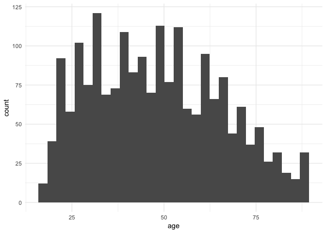

``` r
# adjusting binwidth
gss %>% 
  ggplot(aes(age)) +
  geom_histogram(binwidth = 1)
```

    ## Warning: Removed 5 rows containing non-finite values (stat_bin).

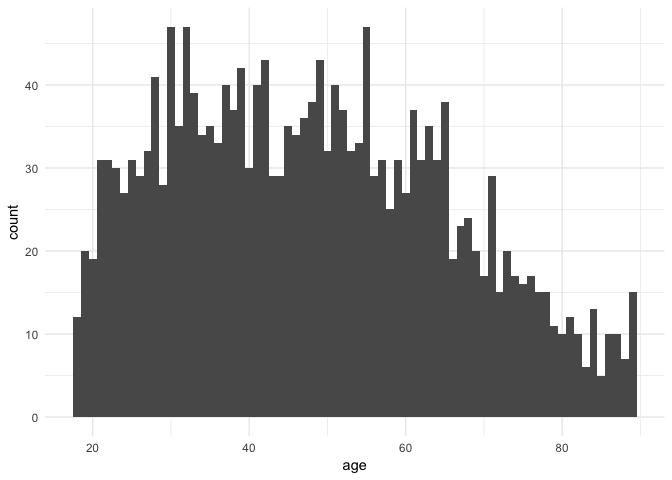

``` r
# playing around with density plot. doesn't tell me much.
gss %>% 
  ggplot(aes(age)) +
  geom_density()
```

    ## Warning: Removed 5 rows containing non-finite values (stat_density).

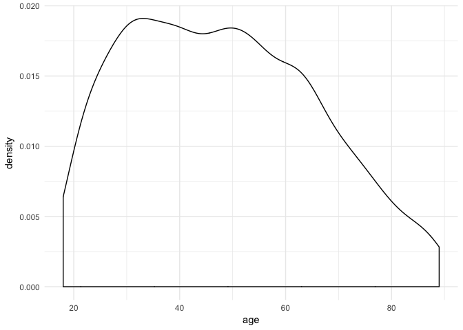

``` r
# looking at age and race distribution
gss %>%
  ggplot(aes(age)) +
    geom_histogram() +
    facet_wrap(~ race)
```

    ## `stat_bin()` using `bins = 30`. Pick better value with `binwidth`.

    ## Warning: Removed 5 rows containing non-finite values (stat_bin).

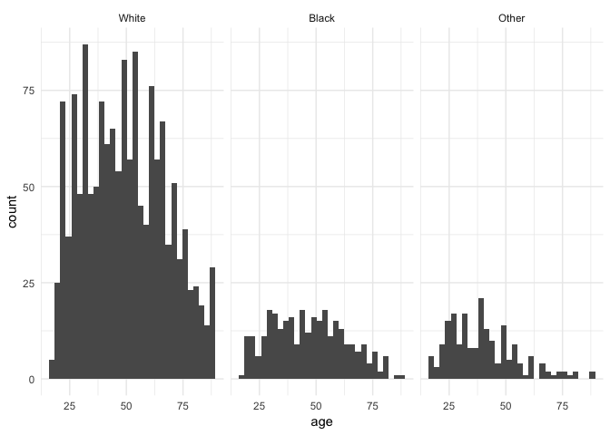

``` r
# looking at number of kids
gss %>% 
  ggplot(aes(childs)) +
  geom_histogram()
```

    ## `stat_bin()` using `bins = 30`. Pick better value with `binwidth`.

    ## Warning: Removed 3 rows containing non-finite values (stat_bin).

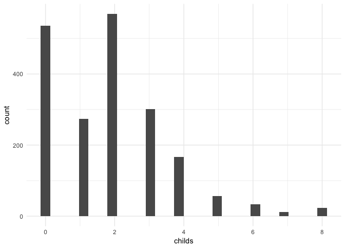

``` r
# adjusting bindwidth
gss %>% 
  ggplot(aes(childs)) +
  geom_histogram(binwidth = 1)
```

    ## Warning: Removed 3 rows containing non-finite values (stat_bin).

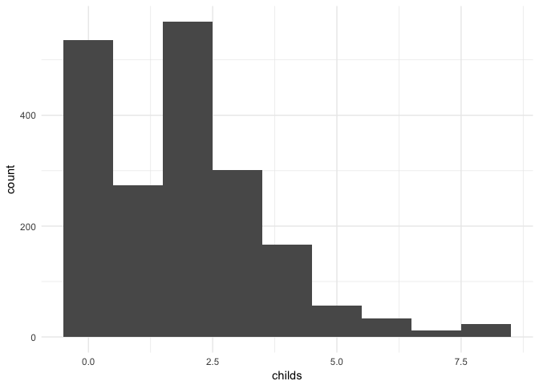

``` r
# what about number of kids by race?
gss %>%
  ggplot(aes(childs)) +
  geom_histogram(binwidth = 1) +
  facet_wrap(~ race)
```

    ## Warning: Removed 3 rows containing non-finite values (stat_bin).

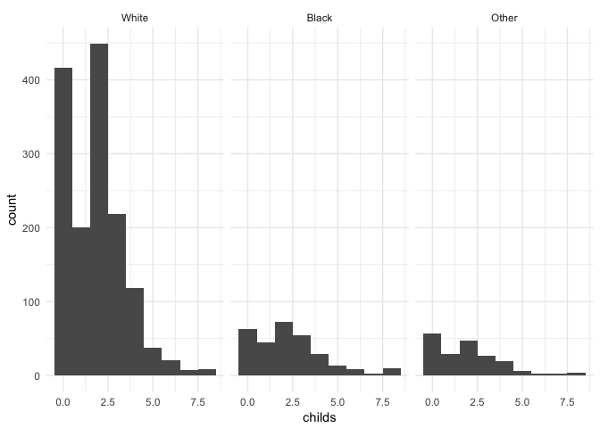

``` r
# by party id?
gss %>%
  ggplot(aes(childs)) +
  geom_histogram(binwidth = 1) +
  facet_wrap(~ partyid)
```

    ## Warning: Removed 3 rows containing non-finite values (stat_bin).

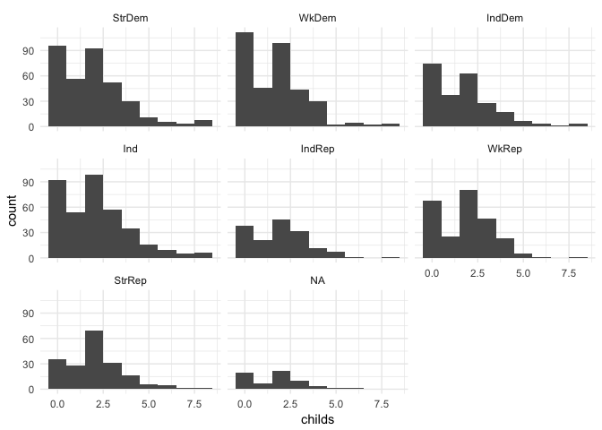

``` r
# not a lot here but good first round of looking at some of the data. still kind of interested in number of kids / siblings but want to think of something that could potentially vary with it in a more interesting way. what about faith and family size?    

# looking at religion and family size  
  
relig_summary <- gss %>%
  group_by(relig) %>%
  summarise(
    age = mean(age, na.rm = TRUE),
    sibs = mean(sibs, na.rm = TRUE),
    childs = mean(childs, na.rm = TRUE),
    n = n()
  )

# ok taking a look at religion and number of siblings
relig_summary %>%
  ggplot(aes(relig, sibs)) +
    geom_col() +
    coord_flip()
```

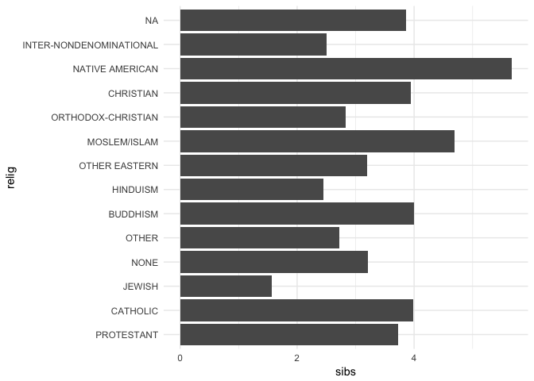

``` r
# sorting religion alphabetically 
relig_summary %>%
  ggplot(aes(factor(relig, levels = rev(sort(levels(relig)))), sibs)) +
    geom_col() +
    coord_flip()
```

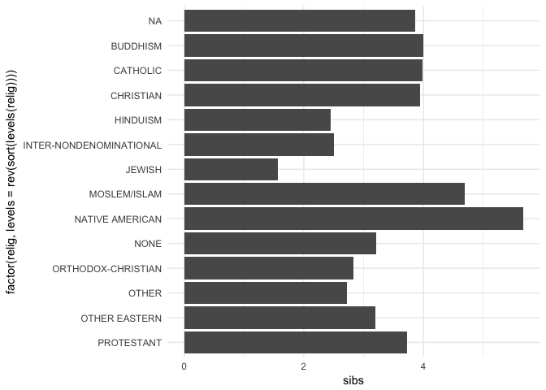

``` r
# sorting by amount of sibs. religion by number of siblings! smaller families?
relig_summary %>%
  ggplot(aes(fct_reorder(relig, sibs), sibs)) +
    geom_col() +
    coord_flip()
```

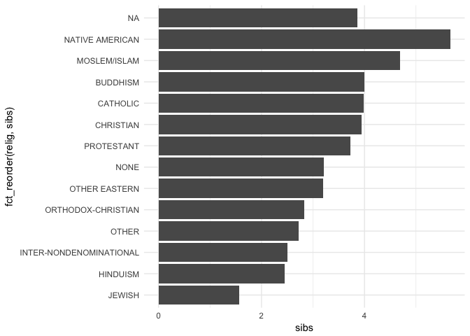

``` r
# ok same thing but number of kids?
relig_summary %>%
  ggplot(aes(fct_reorder(relig, childs), childs)) +
    geom_col() +
    coord_flip()
```

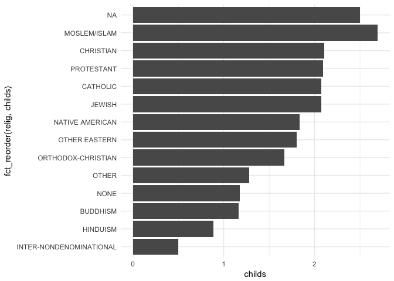

``` r
# perhaps its not so much the religion, but moreso even reported strength of your religious beliefs.
relig_strength <- gss %>%
  group_by(reliten) %>%
  summarise(
    age = mean(age, na.rm = TRUE),
    sibs = mean(sibs, na.rm = TRUE),
    childs = mean(childs, na.rm = TRUE),
    n = n()
  )

# strength of religion by number of sibs
relig_strength %>%
  ggplot(aes(fct_reorder(reliten, sibs), sibs)) +
    geom_col() +
    coord_flip()
```

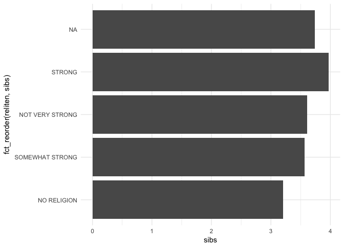

``` r
# strength of religion by number of kids
relig_strength %>%
  ggplot(aes(fct_reorder(reliten, childs), childs)) +
    geom_col() +
    coord_flip()
```

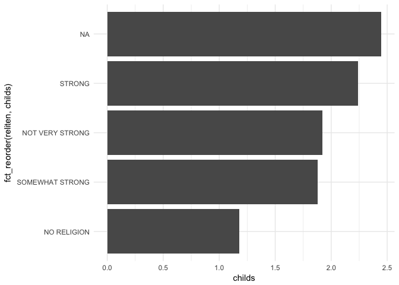

``` r
# ok tired of looking at number of kids. moving on to something else.


# try a boxplot with happiness and age
gss %>%
  ggplot(aes(happy, age)) +
    geom_boxplot()
```

    ## Warning: Removed 5 rows containing non-finite values (stat_boxplot).

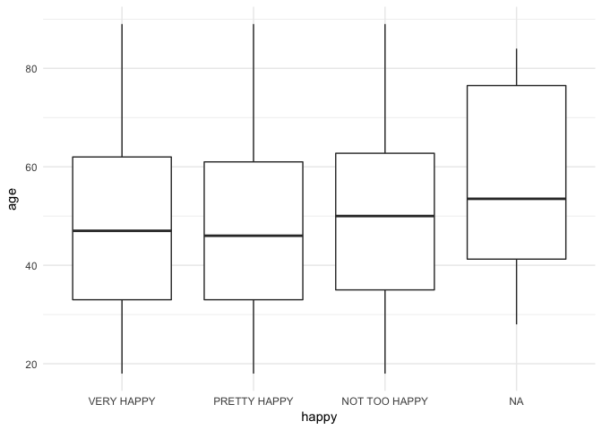

``` r
# try out a dot graph with income and age
income_summary <- gss %>%
  group_by(income06) %>%
  summarise(
    age = mean(age, na.rm = TRUE),
    n = n()
  )

ggplot(income_summary, aes(age, fct_reorder(income06, age))) +
  geom_point()
```

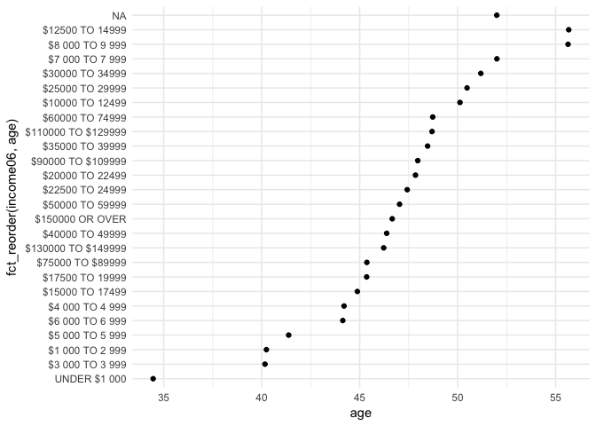

``` r
# wait makes no sense to order by income and age together. want to look for a pattern. order y axes by incomes in monetary order
ggplot(income_summary, aes(age, fct_relevel(income06, "NA"))) +
  geom_point()
```

    ## Warning: Unknown levels in `f`: NA

    ## Warning: Unknown levels in `f`: NA

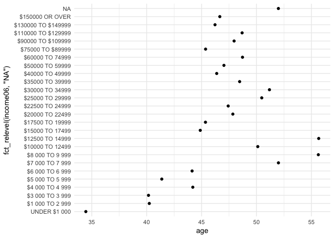

``` r
# meh kinda messy

# kinda want to go back to happiness stuff

gss %>%
  count(happy, race) %>%
  na.omit() %>%
  ggplot(aes(happy, n, fill = race)) +
  geom_col()
```


``` r
# instead of stack trying dodge
gss %>%
  count(happy, race) %>%
  na.omit() %>%
  ggplot(aes(happy, n, fill = race)) +
  geom_col(position = "dodge")
```

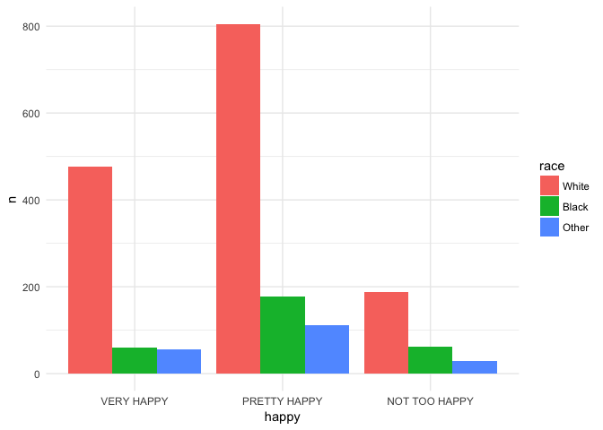

``` r
# so many more whites than blacks; look at fill to see overall proportions
gss %>%
  count(happy, race) %>%
  na.omit() %>%
  ggplot(aes(happy, n, fill = race)) +
  geom_col(position = "fill")
```

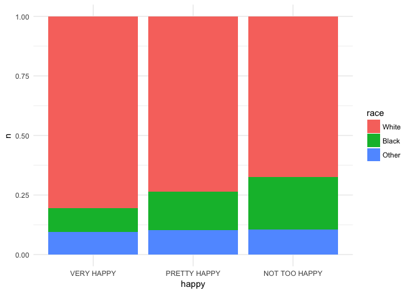

``` r
# kinda want to flip this; look at race make up of overall happiness
gss %>%
  count(race, happy) %>%
  na.omit() %>%
  ggplot(aes(race, n, fill = happy)) +
  geom_col(position = "fill")
```

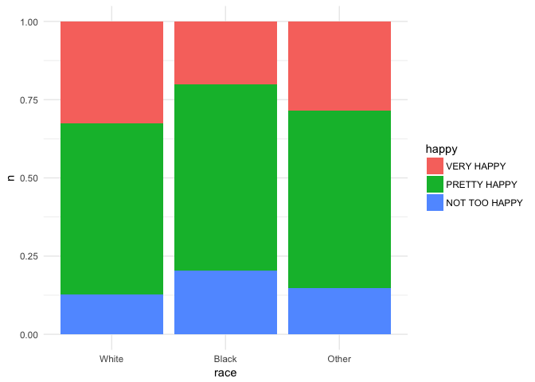

``` r
# this is kind of more meaningful to me

# what about looking at scatterplots?

# taking a look at number of kids, age, and subjective happiness
gss %>%
  ggplot(aes(x = childs, y = age, color = happy)) +
  geom_point()
```

    ## Warning: Removed 8 rows containing missing values (geom_point).

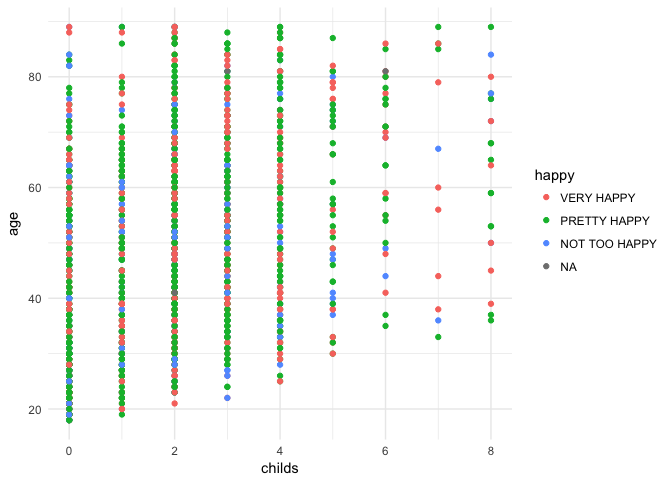

``` r
# woah goofy graph when you mess with boxplot
gss %>%
  ggplot(aes(x = childs, y = age, color = happy)) +
  geom_boxplot()
```

    ## Warning: Removed 8 rows containing non-finite values (stat_boxplot).

    ## Warning: position_dodge requires non-overlapping x intervals

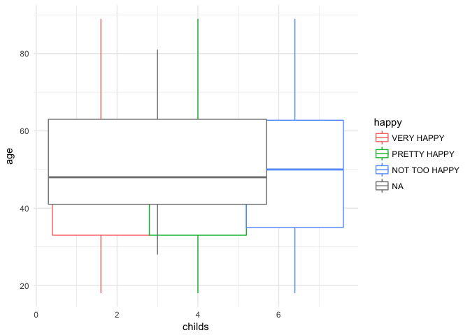

``` r
# back to scatter plot, but now looking at number of siblings
gss %>%
  ggplot(aes(x = sibs, y = age, color = happy)) +
  geom_point()
```

    ## Warning: Removed 8 rows containing missing values (geom_point).


``` r
# if i remove the color code for happiness, does it make anything more clear?
gss %>%
  ggplot(aes(x = sibs, y = age)) +
  geom_point()
```

    ## Warning: Removed 8 rows containing missing values (geom_point).

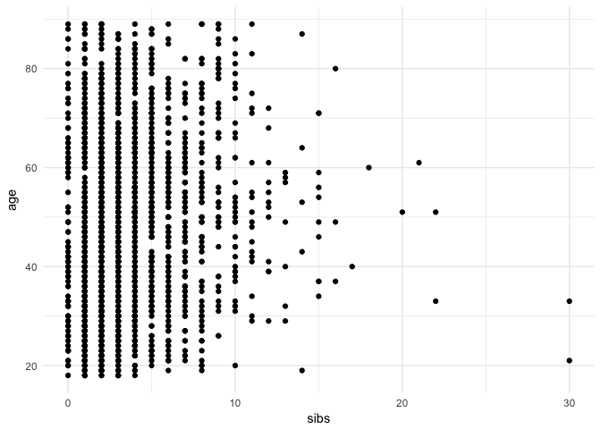

``` r
# meh not really.

# and jitter doesn't really help. not a lot of continuous variables in this data set that
gss %>%
  ggplot(aes(x = sibs, y = age)) +
  geom_jitter()
```

    ## Warning: Removed 8 rows containing missing values (geom_point).

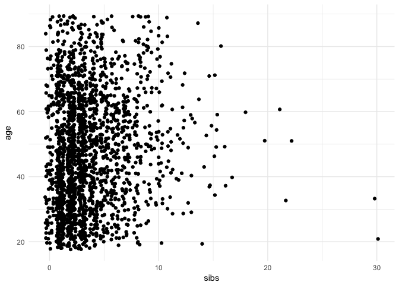

``` r
# ok back to drawing board.looking at happiness and various subjective confidences in institutions

# proportion of varying subjetive happiness and confidence in financial institutions
gss %>%
  count(confinan, happy) %>%
  na.omit() %>%
  ggplot(aes(confinan, n, fill = happy)) +
  geom_col(position = "fill")
```

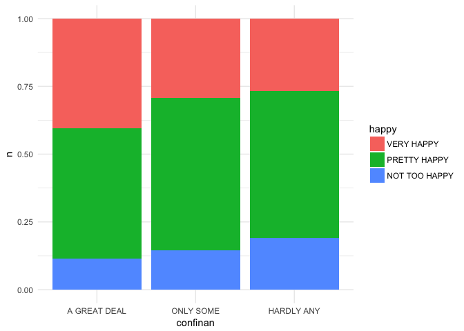

``` r
# slight proportion pattern difference in happiness and confidence in major companies?
gss %>%
  count(conbus, happy) %>%
  na.omit() %>%
  ggplot(aes(conbus, n, fill = happy)) +
  geom_col(position = "fill")
```

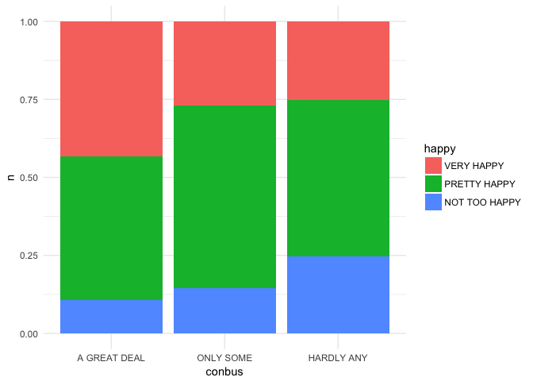

``` r
# less of pattern with happeiness and religious institutions
gss %>%
  count(conclerg, happy) %>%
  na.omit() %>%
  ggplot(aes(conclerg, n, fill = happy)) +
  geom_col(position = "fill")
```


``` r
# even less of pattern differences in terms of happiness and confidence in education
gss %>%
  count(coneduc, happy) %>%
  na.omit() %>%
  ggplot(aes(coneduc, n, fill = happy)) +
  geom_col(position = "fill")
```


``` r
# not much with medicine
gss %>%
  count(conmedic, happy) %>%
  na.omit() %>%
  ggplot(aes(conmedic, n, fill = happy)) +
  geom_col(position = "fill")
```

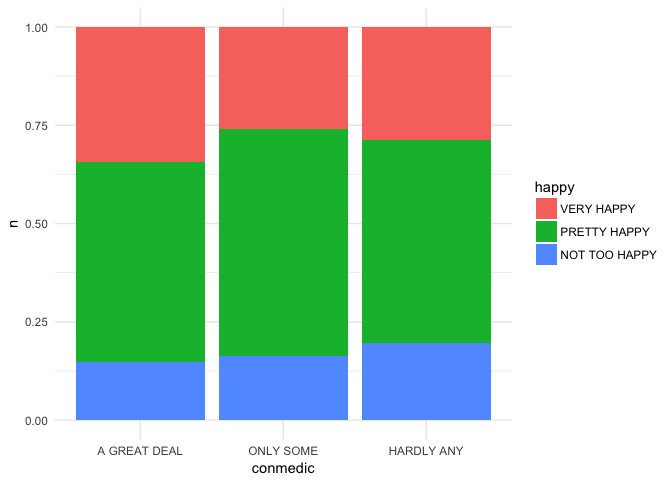

``` r
# hahah not much with tv either but funny more happy people in the "hardly any" confidence in tv
gss %>%
  count(contv, happy) %>%
  na.omit() %>%
  ggplot(aes(contv, n, fill = happy)) +
  geom_col(position = "fill")
```

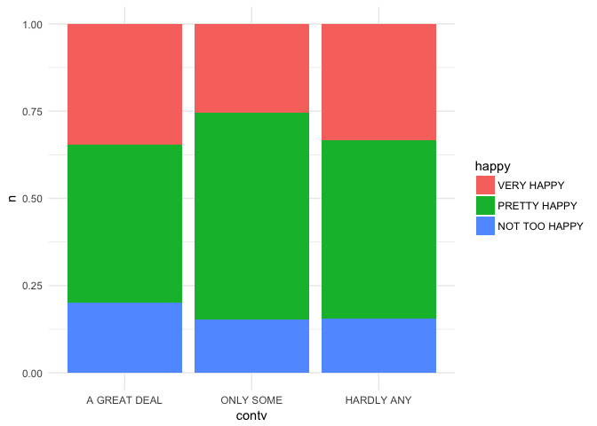

``` r
# back to happiness and number of kids or number of siblings because I can't stay away
gss %>%
  count(childs, happy) %>%
  na.omit() %>%
  ggplot(aes(childs, n, fill = happy)) +
  geom_col(position = "fill")
```

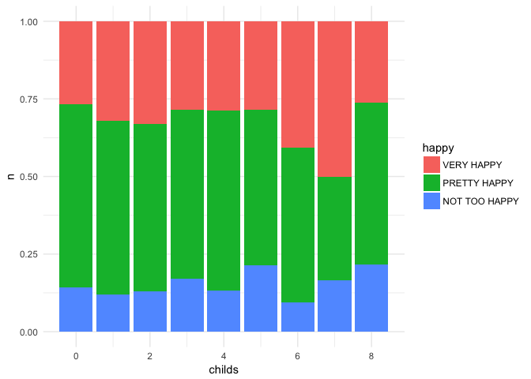

``` r
# good example of outliers here, or where proportions don't make a lot of snese. clearly people with tons of siblings are much less in count
gss %>%
  count(sibs, happy) %>%
  na.omit() %>%
  ggplot(aes(sibs, n, fill = happy)) +
  geom_col(position = "fill")
```

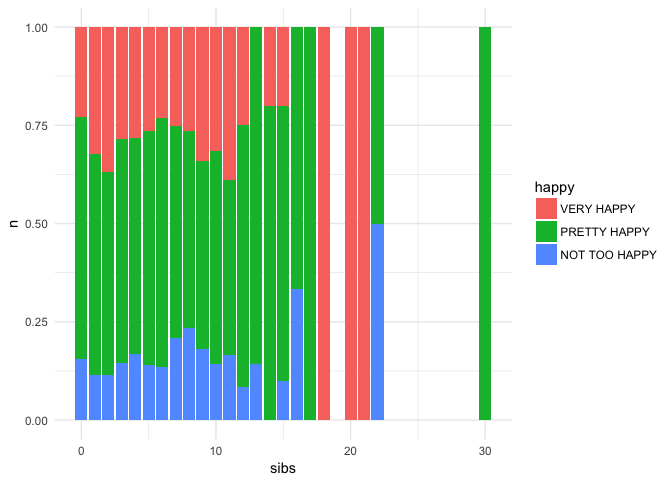
