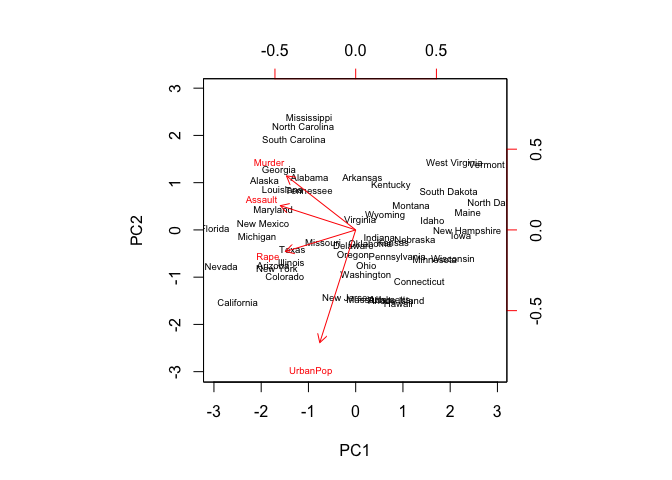
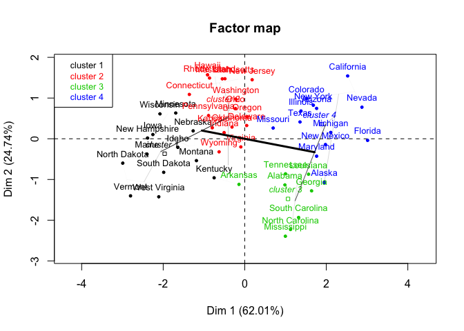
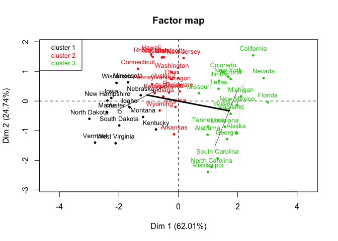
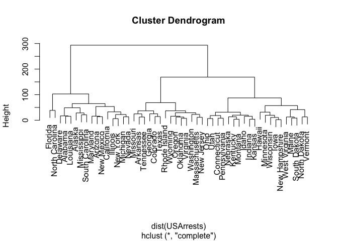
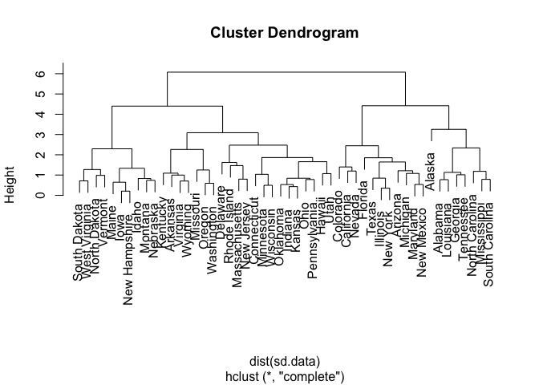

Clustering states
================
Nora Nickels
12/4/2017

Assignment 8 - Unsupervised data
================================

Perspectives of Computational Analysis - Fall 2017
--------------------------------------------------

Clustering states
=================

Introduction
------------

### 1. Perform PCA on the dataset and plot the observations on the first and second principal components.

``` r
# Perform PCA
USArrestsPCA <- prcomp(USArrests, 
                       scale=TRUE)

head(USArrestsPCA$x)
```

    ##               PC1    PC2     PC3      PC4
    ## Alabama    -0.976  1.122 -0.4398  0.15470
    ## Alaska     -1.931  1.062  2.0195 -0.43418
    ## Arizona    -1.745 -0.738  0.0542 -0.82626
    ## Arkansas    0.140  1.109  0.1134 -0.18097
    ## California -2.499 -1.527  0.5925 -0.33856
    ## Colorado   -1.499 -0.978  1.0840  0.00145

``` r
# Plot the first two principle components.
USArrestsPCA$rotation
```

    ##             PC1    PC2    PC3    PC4
    ## Murder   -0.536  0.418 -0.341  0.649
    ## Assault  -0.583  0.188 -0.268 -0.743
    ## UrbanPop -0.278 -0.873 -0.378  0.134
    ## Rape     -0.543 -0.167  0.818  0.089

``` r
biplot(USArrestsPCA, scale = 0, cex = .6)
```



### 2. Perform \(K\)-means clustering with \(K=2\). Plot the observations on the first and second principal components and color-code each state based on their cluster membership. Describe your results.

``` r
# Use FactoMineR to do clustering with K = 2 clusters.

USArrestsPCA_2 <- PCA(USArrests, scale.unit=TRUE, graph = TRUE )
```


``` r
res.hcpc <-  HCPC(USArrestsPCA_2, nb.clust = 2, graph = FALSE)

plot.HCPC(res.hcpc, choice = "map")
```


Clustering with K = 2, and looking at the variables map and the factor map, it appears that the first component seems associate with states like Florida, Arizona, Nevada, and California. This first component is correlated more strongly with with rape, assault, and murder, according to the variable factor map.The second component is associate with states like New Jersey, Hawaii, Rhode Island, and Massachusetts. This component is more strongly associated with the Urban Population variable. In terms of clustering, cluster two is more associated with the first component, whereas cluster one may be a little more associated with the second dimension component.

### 3. Perform \(K\)-means clustering with \(K=4\). Plot the observations on the first and second principal components and color-code each state based on their cluster membership. Describe your results.

``` r
res.hcpc <-  HCPC(USArrestsPCA_2, nb.clust = 4, graph = FALSE)

plot.HCPC(res.hcpc, choice = "map")
```



Cluster 2 may be most associated with urban populations, and clusters 3 and 4 may be more associate with rape, assault, and murder.

### 4. Perform \(K\)-means clustering with \(K=3\). Plot the observations on the first and second principal components and color-code each state based on their cluster membership. Describe your results.

``` r
res.hcpc <-  HCPC(USArrestsPCA_2, nb.clust = 3, graph = FALSE)

plot.HCPC(res.hcpc, choice = "map")
```



With three clusters, cluster 2 may be more correlated with urban pop, whereas cluster 3 maye be more associated with rape, assault, and murder.

### 5. Perform \(K\)-means clustering with \(K=3\) on the first two principal components score vectors, rather than the raw data. Describe your results and compare them to the clustering results with \(K=3\) based on the raw data.

``` r
km.out <- kmeans(USArrests, 3)
km.out$centers
```

    ##   Murder Assault UrbanPop Rape
    ## 1   8.21   173.3     70.6 22.8
    ## 2   4.27    87.5     59.8 14.4
    ## 3  11.81   272.6     68.3 28.4

``` r
km.out$cluster
```

    ##        Alabama         Alaska        Arizona       Arkansas     California 
    ##              3              3              3              1              3 
    ##       Colorado    Connecticut       Delaware        Florida        Georgia 
    ##              1              2              3              3              1 
    ##         Hawaii          Idaho       Illinois        Indiana           Iowa 
    ##              2              2              3              2              2 
    ##         Kansas       Kentucky      Louisiana          Maine       Maryland 
    ##              2              2              3              2              3 
    ##  Massachusetts       Michigan      Minnesota    Mississippi       Missouri 
    ##              1              3              2              3              1 
    ##        Montana       Nebraska         Nevada  New Hampshire     New Jersey 
    ##              2              2              3              2              1 
    ##     New Mexico       New York North Carolina   North Dakota           Ohio 
    ##              3              3              3              2              2 
    ##       Oklahoma         Oregon   Pennsylvania   Rhode Island South Carolina 
    ##              1              1              2              1              3 
    ##   South Dakota      Tennessee          Texas           Utah        Vermont 
    ##              2              1              1              2              2 
    ##       Virginia     Washington  West Virginia      Wisconsin        Wyoming 
    ##              1              1              2              2              1

``` r
table(km.out$cluster)
```

    ## 
    ##  1  2  3 
    ## 14 20 16

``` r
pr.out <- prcomp(USArrests)
km.out <- kmeans(pr.out$x[, 1:2], 3)
km.out$centers
```

    ##      PC1   PC2
    ## 1   2.89  5.14
    ## 2 -83.74 -1.98
    ## 3 102.15 -2.02

``` r
km.out$cluster
```

    ##        Alabama         Alaska        Arizona       Arkansas     California 
    ##              3              3              3              1              3 
    ##       Colorado    Connecticut       Delaware        Florida        Georgia 
    ##              1              2              3              3              1 
    ##         Hawaii          Idaho       Illinois        Indiana           Iowa 
    ##              2              2              3              2              2 
    ##         Kansas       Kentucky      Louisiana          Maine       Maryland 
    ##              2              2              3              2              3 
    ##  Massachusetts       Michigan      Minnesota    Mississippi       Missouri 
    ##              1              3              2              3              1 
    ##        Montana       Nebraska         Nevada  New Hampshire     New Jersey 
    ##              2              2              3              2              1 
    ##     New Mexico       New York North Carolina   North Dakota           Ohio 
    ##              3              3              3              2              2 
    ##       Oklahoma         Oregon   Pennsylvania   Rhode Island South Carolina 
    ##              1              1              2              1              3 
    ##   South Dakota      Tennessee          Texas           Utah        Vermont 
    ##              2              1              1              2              2 
    ##       Virginia     Washington  West Virginia      Wisconsin        Wyoming 
    ##              1              1              2              2              1

``` r
table(km.out$cluster)
```

    ## 
    ##  1  2  3 
    ## 14 20 16

If I did this correctly, the clusters are the same according to the tables, but the tables regarding the centers of the clusters are different.

### 6. Using hierarchical clustering with complete linkage and Euclidean distance, cluster the states.

``` r
hc.complete <- hclust(dist(USArrests), method = "complete")

plot(hc.complete)
```



### 7. Cut the dendrogram at a height that results in three distinct clusters. Which states belong to which clusters?

``` r
hc.complete <- hclust(dist(USArrests), method = "complete")

cutree(hc.complete, 3)
```

    ##        Alabama         Alaska        Arizona       Arkansas     California 
    ##              1              1              1              2              1 
    ##       Colorado    Connecticut       Delaware        Florida        Georgia 
    ##              2              3              1              1              2 
    ##         Hawaii          Idaho       Illinois        Indiana           Iowa 
    ##              3              3              1              3              3 
    ##         Kansas       Kentucky      Louisiana          Maine       Maryland 
    ##              3              3              1              3              1 
    ##  Massachusetts       Michigan      Minnesota    Mississippi       Missouri 
    ##              2              1              3              1              2 
    ##        Montana       Nebraska         Nevada  New Hampshire     New Jersey 
    ##              3              3              1              3              2 
    ##     New Mexico       New York North Carolina   North Dakota           Ohio 
    ##              1              1              1              3              3 
    ##       Oklahoma         Oregon   Pennsylvania   Rhode Island South Carolina 
    ##              2              2              3              2              1 
    ##   South Dakota      Tennessee          Texas           Utah        Vermont 
    ##              3              2              2              3              3 
    ##       Virginia     Washington  West Virginia      Wisconsin        Wyoming 
    ##              2              2              3              3              2

Cutree function designates which states belong to which clusters.

### 8. Hierarchically cluster the states using complete linkage and Euclidean distance, after scaling the variables to have standard deviation \(1\). What effect does scaling the variables have on the hierarchical clustering obtained?

``` r
sd.data <- scale(USArrests)

hc.complete.sd <- hclust(dist(sd.data), method = "complete")

plot(hc.complete.sd)
```



The clustering of the trees seems different after scaling. With the heights on the y axis so much more spread out, it seems that it's more clear where you would cut if you were asked to cut the dendogram visually.
