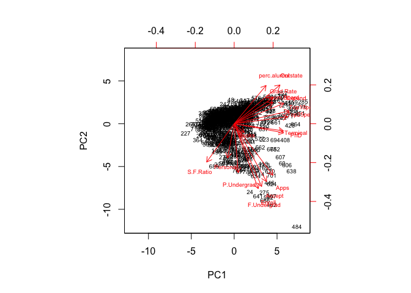
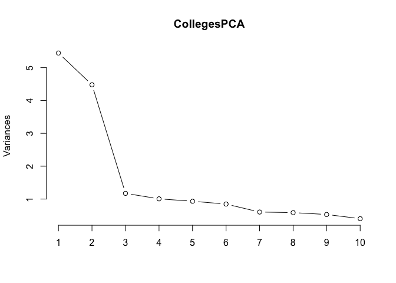

Colleges
================
Nora Nickels
12/4/2017

Assignment 8 - Unsupervised data
================================

Perspectives of Computational Analysis - Fall 2017
--------------------------------------------------

Colleges
========

### 1. Perform PCA analysis on the college dataset and plot the first two principal components. Describe the results.

**What variables appear strongly correlated on the first principal component?**

**What about the second principal component?**

``` r
# Perform PCA on Colleges data set.
CollegesPCA <- prcomp(Colleges,
                 scale = TRUE) 

head(CollegesPCA$x)
```

    ##         PC1     PC2     PC3     PC4    PC5      PC6    PC7     PC8    PC9
    ## [1,] -1.592 -0.7668  0.1010  0.9212  0.743 -0.29811  0.638  0.8788  0.093
    ## [2,] -2.191  0.5785 -2.2773 -3.5866 -1.059 -0.17702  0.237 -0.0469  1.113
    ## [3,] -1.430  1.0921  0.4378 -0.6768  0.369 -0.95997 -0.248 -0.3085 -0.105
    ## [4,]  2.854  2.6289 -0.1416  1.2947  0.184 -1.05883 -1.249  0.1476  0.379
    ## [5,] -2.211 -0.0216 -2.3855  1.1138 -0.684  0.00491 -2.158  0.6240 -0.160
    ## [6,] -0.571  1.4954 -0.0243 -0.0669  0.376 -0.66791 -1.609  0.5290  0.263
    ##         PC10   PC11    PC12    PC13     PC14     PC15     PC16     PC17
    ## [1,] -0.0486  0.399  0.0896 -0.0521  0.18002 -0.00175  0.09308 -0.09349
    ## [2,] -0.9645 -0.212 -0.0972 -0.2434 -0.74373 -0.10364  0.05022  0.17395
    ## [3,] -0.6402 -0.155  0.3445  0.0975  0.22738  0.02254  0.00405 -0.00376
    ## [4,] -0.4609 -0.420 -0.6867 -0.0754 -0.00338  0.07313  0.19142  0.17514
    ## [5,] -0.3632 -0.153  0.0505  0.2670 -0.61401  0.27382 -0.01065 -0.04831
    ## [6,]  0.6941 -0.100  1.0931 -0.1311 -0.09439 -0.22086 -0.05699  0.03856

``` r
# Plot the first two principle components.
CollegesPCA$rotation
```

    ##                 PC1     PC2     PC3     PC4      PC5      PC6     PC7
    ## Apps         0.2488 -0.3316  0.0631 -0.2813 -0.00574 -0.01624 -0.0425
    ## Accept       0.2076 -0.3721  0.1012 -0.2678 -0.05579  0.00753 -0.0129
    ## Enroll       0.1763 -0.4037  0.0830 -0.1618  0.05569 -0.04256 -0.0277
    ## Top10perc    0.3543  0.0824 -0.0351  0.0515  0.39543 -0.05269 -0.1613
    ## Top25perc    0.3440  0.0448  0.0241  0.1098  0.42653  0.03309 -0.1185
    ## F.Undergrad  0.1546 -0.4177  0.0614 -0.1004  0.04345 -0.04345 -0.0251
    ## P.Undergrad  0.0264 -0.3151 -0.1397  0.1586 -0.30239 -0.19120  0.0610
    ## Outstate     0.2947  0.2496 -0.0466 -0.1313 -0.22253 -0.03000  0.1085
    ## Room.Board   0.2490  0.1378 -0.1490 -0.1850 -0.56092  0.16276  0.2097
    ## Books        0.0648 -0.0563 -0.6774 -0.0871  0.12729  0.64105 -0.1497
    ## Personal    -0.0425 -0.2199 -0.4997  0.2307  0.22231 -0.33140  0.6338
    ## PhD          0.3183 -0.0583  0.1270  0.5347 -0.14017  0.09126 -0.0011
    ## Terminal     0.3171 -0.0464  0.0660  0.5194 -0.20472  0.15493 -0.0285
    ## S.F.Ratio   -0.1770 -0.2467  0.2898  0.1612  0.07939  0.48705  0.2193
    ## perc.alumni  0.2051  0.2466  0.1470 -0.0173  0.21630 -0.04734  0.2433
    ## Expend       0.3189  0.1317 -0.2267 -0.0793 -0.07596 -0.29812 -0.2266
    ## Grad.Rate    0.2523  0.1692  0.2081 -0.2691  0.10927  0.21616  0.5599
    ##                  PC8      PC9    PC10    PC11    PC12     PC13    PC14
    ## Apps         0.10309 -0.09023 -0.0525  0.0430 -0.0241  0.59583  0.0806
    ## Accept       0.05627 -0.17786 -0.0411 -0.0584  0.1451  0.29264  0.0335
    ## Enroll      -0.05866 -0.12856 -0.0345 -0.0694 -0.0111 -0.44464 -0.0857
    ## Top10perc    0.12268  0.34110 -0.0640 -0.0081 -0.0386  0.00102 -0.1078
    ## Top25perc    0.10249  0.40371 -0.0145 -0.2731  0.0894  0.02188  0.1517
    ## F.Undergrad -0.07889 -0.05944 -0.0208 -0.0812 -0.0562 -0.52362 -0.0564
    ## P.Undergrad -0.57078  0.56067  0.2231  0.1007  0.0635  0.12600  0.0193
    ## Outstate    -0.00985 -0.00457 -0.1867  0.1432  0.8234 -0.14186 -0.0340
    ## Room.Board   0.22145  0.27502 -0.2983 -0.3593 -0.3546 -0.06975 -0.0584
    ## Books       -0.21329 -0.13366  0.0820  0.0319  0.0282  0.01144 -0.0668
    ## Personal     0.23266 -0.09447 -0.1360 -0.0186  0.0393  0.03945  0.0275
    ## PhD          0.07704 -0.18518  0.1235  0.0404 -0.0232  0.12770 -0.6911
    ## Terminal     0.01216 -0.25494  0.0886 -0.0590 -0.0165 -0.05831  0.6710
    ## S.F.Ratio    0.08360  0.27454 -0.4720  0.4450  0.0110 -0.01772  0.0414
    ## perc.alumni -0.67852 -0.25533 -0.4230 -0.1307 -0.1827  0.10409 -0.0272
    ## Expend       0.05416 -0.04914 -0.1323  0.6921 -0.3260 -0.09375  0.0731
    ## Grad.Rate    0.00534  0.04190  0.5903  0.2198 -0.1221 -0.06920  0.0365
    ##                 PC15     PC16      PC17
    ## Apps        -0.13341 -0.45914 -0.358970
    ## Accept       0.14550  0.51857  0.543427
    ## Enroll      -0.02959  0.40432 -0.609651
    ## Top10perc   -0.69772  0.14874  0.144986
    ## Top25perc    0.61727 -0.05187 -0.080348
    ## F.Undergrad -0.00992 -0.56036  0.414705
    ## P.Undergrad -0.02095  0.05273 -0.009018
    ## Outstate    -0.03835 -0.10159 -0.050900
    ## Room.Board  -0.00340  0.02593 -0.001146
    ## Books        0.00944 -0.00288 -0.000773
    ## Personal     0.00309  0.01289  0.001114
    ## PhD          0.11206 -0.02981 -0.013813
    ## Terminal    -0.15891  0.02708 -0.006209
    ## S.F.Ratio    0.02090  0.02125  0.002222
    ## perc.alumni  0.00842 -0.00333  0.019187
    ## Expend       0.22774  0.04388  0.035310
    ## Grad.Rate    0.00339  0.00501  0.013071

``` r
biplot(CollegesPCA, scale = 0, cex = .6)
```



The first principal component seems to be most strongly correlated with 'PhD', 'Terminal', 'Top10perc', 'Top25perc', and 'Expend'. The second principal component seems to be most strongly correlated, negatively, with 'Apps', 'Accept', 'P.Undergrad', 'F.undergrad', and 'Enroll', and fairly strongly positive correlated with 'perc.Alumni' and 'Outstate'.

### 2. Calculate the cumulative proportion of variance explained by all the principal components (see 10.2.3 in ISLR).

``` r
# Summarizing importance of PCs.
summary(CollegesPCA)
```

    ## Importance of components:
    ##                         PC1   PC2   PC3    PC4    PC5    PC6    PC7    PC8
    ## Standard deviation     2.33 2.116 1.083 1.0034 0.9659 0.9205 0.7778 0.7662
    ## Proportion of Variance 0.32 0.263 0.069 0.0592 0.0549 0.0498 0.0356 0.0345
    ## Cumulative Proportion  0.32 0.584 0.653 0.7118 0.7667 0.8166 0.8522 0.8867
    ##                           PC9   PC10   PC11  PC12    PC13    PC14    PC15
    ## Standard deviation     0.7280 0.6354 0.5595 0.469 0.40936 0.37920 0.29650
    ## Proportion of Variance 0.0312 0.0238 0.0184 0.013 0.00986 0.00846 0.00517
    ## Cumulative Proportion  0.9179 0.9416 0.9600 0.973 0.98286 0.99132 0.99649
    ##                           PC16    PC17
    ## Standard deviation     0.19152 0.15165
    ## Proportion of Variance 0.00216 0.00135
    ## Cumulative Proportion  0.99865 1.00000

``` r
# Plot of variances associated with PCs.
plot(CollegesPCA, type = "l")
```



**Approximately how much of the variance in College is explained by the first two principal components?**

Approximately 58.3% of the variance is explained by the first two principal components. This is a fairly large amount of importance, especially when compared to the components beyond the first two, as seen by the variances graph.
