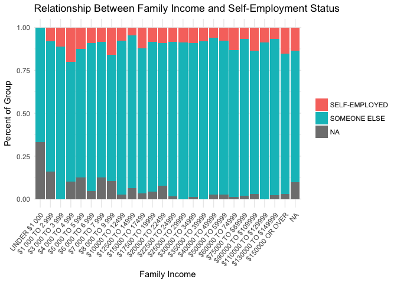
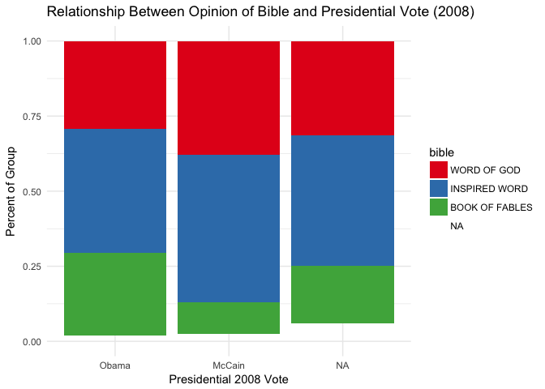
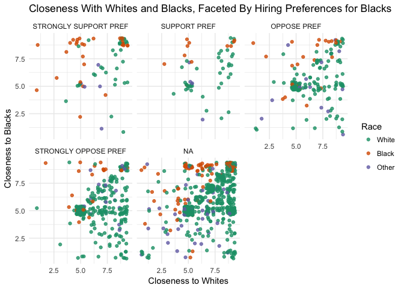

Exploration Write-Up (Part 2)
================

Introduction
------------

In exploring through this data I separated my work into 3 main categories. These categories are family income, factors affecting how people voted in the 2008 presidential election, and racial preferences (i.e. what affects how close people report being with black people). In this write-up I will go through each of these sections and give a general write-up about what I found, and include a graph supporting my findings.

Family Incomes
--------------

The first factor I looked at was family incomes. I made graphs looking at the relationship between family income education, happiness, work status, among others. The relationship between education and income was positive but not tight, likewise there was a positive relationship between happiness and family income, but most people still reported being "pretty happy" compared to "very happy". There was little to no relationship between age and family income.

One group who was especially interesting to study was the group with the highest family incomes ($150,000 OR OVER). The wealthiest people were especially likely to report that hard work is key to getting ahead, but the group third in family incomes ($110,000 TO $129,999) did not share that sentiment which was a bit counter intuitive. It could be that this is the group that begins to consider themselves middle class, but this is only speculation. People of all wealth groups agreed that "being popular" was not important, but this attitude was especially prevalent among the families with the highest incomes. The highest group for family income was also much more likely than other groups to rate religion as "strongly important". This was intuitive to me because I read the book "The Millionaire Mind" several years ago which reports a similar finding. Families in the highest income bracket did not want to answer how they voted in the 2008 presidential election more than any other group. This non-response bias could be interesting to look at in further research.

One finding I was off guard to find was that self employment is more or less heterogeneous among family incomes. My hypothesis was that the families with the highest incomes would be more likely to be self-employed because they were entrepreneurs. I was wrong about this. Below is a graph with the supporting data.

Voting in the 2008 Presidential Election
----------------------------------------

In this sample, most people reported voting for Obama, but there was a huge number of people who did not respond who they voted for. This was also salient when I plotted who people voted for against where they people placed themselves on the political spectrum. It was fairly rare for someone who considered themselves liberal to vote for McCain. However, people from all across the political spectrum decided not to report how they voted. This is definitely something for researchers to look further into, and is likely related to the failure by most people to report predict the Trump win.

I then tried to look at the connections between between who people voted for and their opinions about other factors. There was little to no relationship between supporting space exploration and how people voted. Similarly, there was only a weak relationship between who people voted for and halting natural crime. However, people who voted for McCain seemed more likely than average to think that not enough money was being spent on defense. This is intuitive because McCain was a war veteran, and campaigned on that. In regards to spending on scientific research, there was not much a relationship between who people voted for.

It did look like people who voted for Obama tended to think less of the Bible than people who voted for McCain or did not report their votes. This is graphed below.

Racial Preferences
------------------

The first graph a made for this section was a jittered scatter plot comparing people’s self reported closeness with whites and blacks. The finding was intuitive and black people tended to reported more closeness with black people than whites and vice versa. However, there was a fairly strong relationship of people feeling equally close with both races. Next I looked into opinions about marijuana legalization and closeness with blacks, as well as bible opinions. Both of these graphs were fairly uninformative because of the large number of people reported a medium (5) closeness with blacks which dominated the other groups.

Next I filtered the results to look at only people who did not feel close with black (which I defined as closeness with blacks less than 2.5), and found that these people were less likely to vote for Obama, but this wasn’t very related with strength of religion or opinion on homosexual speech or even “preference for hiring blacks”.

However, when I faceted by hiring preferences in regards to blacks, and graphed by reported closeness to whites and blacks I found pretty interesting results. People who “strongly opposed” hiring blacks generally tended to feel slightly more close with whites, whereas people who “strongly supported”, were much more likely to be equal or more favorable to be blacks. However, both groups were largely outnumbered, by people who did not answer the hiring preferences question.

