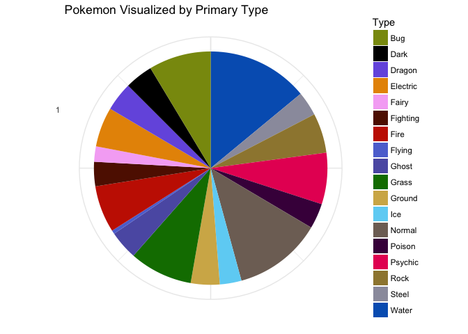
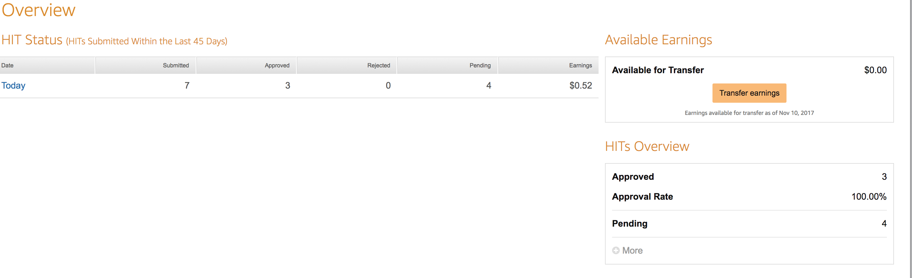

Collaboration Assignment
================

Kaggle open call projects (3 points)
====================================

Create a Kaggle Account
-----------------------

(<https://www.kaggle.com/johnhenrypezzuto>)

Kaggle Competitions Page
------------------------

#### What is the Goal of the Competition

[The Kaggle Contest I decided to look into](https://www.kaggle.com/c/web-traffic-time-series-forecasting) was a Web Traffic Time Series Forecasting challenge. The challenge specifcally was to forecast the future web traffic of approximately 145,000 Wikipedia articles, based on past observations of Wikipedia page views.

The winners of the contest were announced November 12th 2017.

The top 3 winning teams will split $25,000 paid for by Google Inc. and Voleon.

#### What Do You Have to Do to Make a Submission

-   To participate in Kaggle competitions you need to be over 18 years old, have a registered Kaggle account, and not a resident of Crimea, Cuba, Iran, Syria, North Korea, or Sudan.

-   Submissions are evaluated on SMAPE between forecasts and actual values. Lower SMAPE scores are better (ie. SMAPE = 0 when the actual and predicted values are both 0.)

-   To participate in this challenge teams need to accept the compeition rules by September 1st 2017, and submit their final project by September 12th 2017.

-   The contest has two stages. The first stage involves is a training stage in which teams meausure on historical data (Wikipedia page views from January, 1st, 2017 up until March 1st, 2017), and second stage where participants need to score future data (daily Wikipedia page views between September 13th, 2017 and November 13th, 2017). Teams can use any method to predict the data, though most teams will use some type of state-of-the-art machine learning algorithms. The winner will be decided by who can forecast the page views of future Wikipedia article most accurately by the day.

-   To enter the contest, you need to predict web traffic for each article and day combination. Submit this via a .csv file.

Kaggle Data Sets
----------------

The dataset I chose to analyze was a complete list from the 90's craze called Pokemon. The dataset is available [here](https://www.kaggle.com/abcsds/pokemon).The dataset includes a full list of every Pokemon created. It's "type", and some specific attributions about their other stats (e.g. Attack, Defense, etc.). Because "type" is especially important in the world of Pokemon training (you wouldn't want to bring a fire type to a swimming pool), I decided to create a visual of the most common Pokemon types.

#### Load Packages and Data

``` r
library(tidyverse)
```

    ## Loading tidyverse: ggplot2
    ## Loading tidyverse: tibble
    ## Loading tidyverse: tidyr
    ## Loading tidyverse: readr
    ## Loading tidyverse: purrr
    ## Loading tidyverse: dplyr

    ## Conflicts with tidy packages ----------------------------------------------

    ## filter(): dplyr, stats
    ## lag():    dplyr, stats

``` r
library(RColorBrewer)
library(scales)
```

    ## 
    ## Attaching package: 'scales'

    ## The following object is masked from 'package:purrr':
    ## 
    ##     discard

    ## The following object is masked from 'package:readr':
    ## 
    ##     col_factor

``` r
Pokemon <- read_csv("Pokemon.csv")
```

    ## Parsed with column specification:
    ## cols(
    ##   `#` = col_integer(),
    ##   Name = col_character(),
    ##   `Type 1` = col_character(),
    ##   `Type 2` = col_character(),
    ##   Total = col_integer(),
    ##   HP = col_integer(),
    ##   Attack = col_integer(),
    ##   Defense = col_integer(),
    ##   `Sp. Atk` = col_integer(),
    ##   `Sp. Def` = col_integer(),
    ##   Speed = col_integer(),
    ##   Generation = col_integer(),
    ##   Legendary = col_character()
    ## )

``` r
theme_set(theme_minimal())
```

#### Visual Pokemon By Distribution by Type

Color Selection was based on in game graphics via [this photo](https://vignette.wikia.nocookie.net/robloxpokemonbrickbronze/images/5/5f/Type.png/revision/latest?cb=20170426085006)

``` r
Pokemon %>% 
  group_by(`Type 1`) %>% 
  mutate(Type = `Type 1`) %>% 
  ggplot(aes(x = factor(1),fill = Type))+
  geom_bar(width = 1)+
  coord_polar(theta = "y")+
  theme(axis.text.x=element_blank())+
  labs(x = "", y="", title = "Pokemon Visualized by Primary Type")+
  scale_fill_manual(values=c(   "#89970E",  "#000000",  "#765EE1",  "#E79302"   ,"#F5B0F5"  ,"#601500", "#C72100",  "#5D73D4",  "#5D5DB2", "#0E7B00","#D3B356",  "#6DD3F5", "#7F6F65", "#47004A", "#E72062", "#9E863D", "#9B9BAB", "#0061BE"))
```



Improve a Journal Article
=========================

#### Summary of their study

[The article I chose to read](http://www.pnas.org/content/111/24/8788.full) was the class article about a large scale study between Cornell and Facebook where they found that that by controlling the "positivity" content of Facebook user's newsfeed they could impact the mood of Facebook users.

The positivity of user's newsfeeds was determined by whether posts had "at least one positive or negative word", which is a very crude way for measuring positivity. I propose instead that we outsource the determining of positive or negative content to Facebook users via a human computation approach. This would could create a more valid measure of postive and negative Facebook posts.

#### How would I formulate the data collection as a human computation project?

Instead, the human computational approach should rate the emotional content of posts simply by the type of emoji responses the post gets. Facebook has "Happy" and "Excited" faces, or "Sad" and "Angry" faces which can indicate a positive or negative post. Facebook likes are relatively neutral. By measuring the emoji response a post gets rather than single words, the human computational approach creates a much more accurate depiction of whether content is positive or negative.

Since most users have hundreds of friends new posts can be classified almost instantly. This would *split* the work among Facebook friends. Facebook could then *apply* these results to the experimental conditions and *combine* posts based on content after they've been rated. People in the experimental condition would get their new posts a moment later than other users but the time difference would be almost neglibible. There is also a large amount of reliability because it is likely that more than one user will rate posts.

#### How might this improve the study?

This would improve the study by being a more accurate measure of whether a post is positive or negative than looking for single words. The study could then look at the impact of post content more faithfully than just using a broad sweep as it did with single word choices. Facebook is naturally an interactive platform, so this would not require much change. By classifying posts more efficiently, it is more likely that the authors will be able to see the external effect they were looking for.

Single word choices will not be able to pick up sarcasm, the way that human beings will be able to. Though humans may occassional misattribute the correct emojis, if the reliability is not good, the most can be excluded.

Amazon Mechanical Turk
======================

#### "Your Account"



#### "Qualifications"


