Lab Notebook (Part 1)
================

### Get Data, Load Packages

``` r
rm(list=ls())
data(gss, package = "poliscidata")

# convert to tibble
library(tidyverse)
gss <- as_tibble(gss)
theme_set(theme_minimal())
```

Exploring Income
================

``` r
gss %>% 
  ggplot(aes(income06))+
  geom_bar()
```

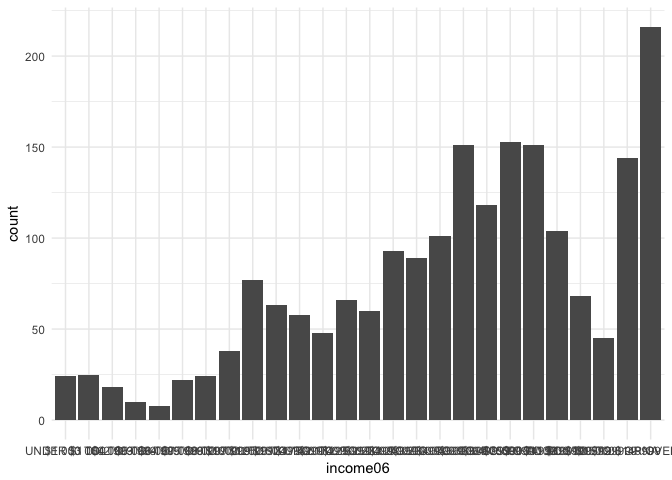

### Relationship between family income, and education

``` r
gss %>% 
  ggplot(aes(educ, income06))+
  geom_count()
```

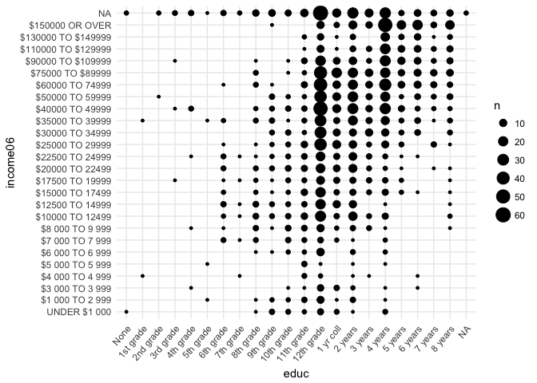

``` r
gss %>% 
  ggplot(aes(income06))+
  geom_bar()+
  facet_wrap(~happy)
```

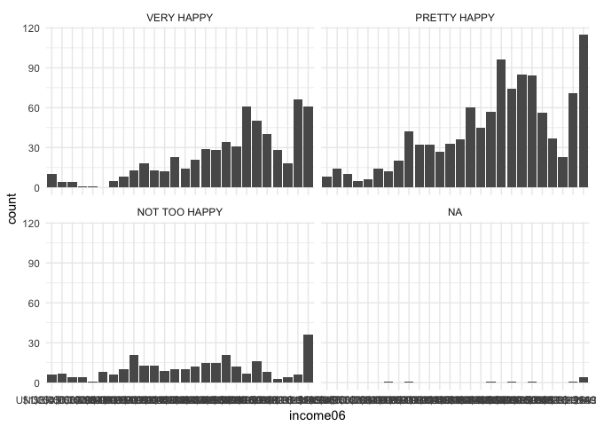

### It's looks like wealthier people tend to be working fill time , but the most wealthy people may be retired. Low income people tend not to be employed full time as much

``` r
gss %>% 
  ggplot(aes(as.factor(income06), fill=wrkstat))+
  geom_bar(position = "fill")
```

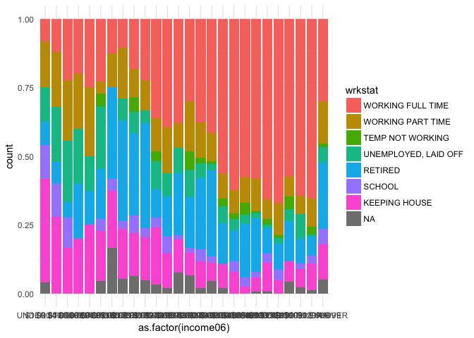

### Employment for someone else is similar accross the spectrum

``` r
gss %>% 
  ggplot(aes(as.factor(income06), fill=wrkslf))+
  geom_bar(position = "fill")
```

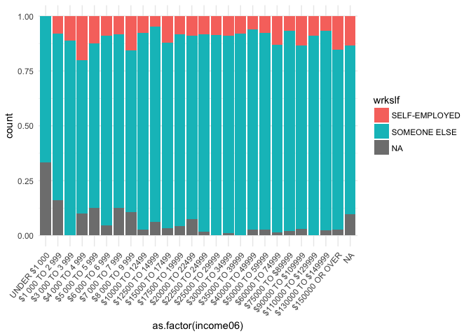

### The most wealthy families seem to be mixed of all ages. No clear pattern between age and wealth

``` r
gss %>% 
  ggplot(aes(income06, age))+
  geom_jitter()
```

    ## Warning: Removed 5 rows containing missing values (geom_point).

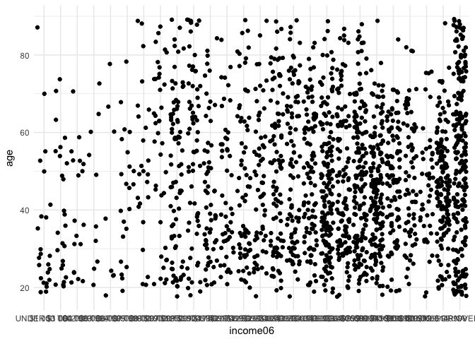

``` r
gss %>% 
  ggplot(aes(income06))+
  geom_bar()+
  facet_wrap(~workhard)+
  labs(title = "Importance of Hard Work")
```

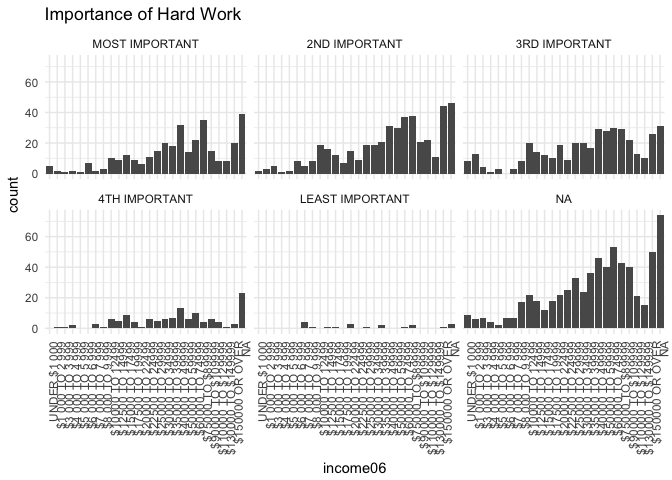

``` r
gss %>% 
  ggplot(aes(income06))+
  geom_bar()+
  facet_wrap(~getahead)+
  labs(title = "How to Get Ahead")
```

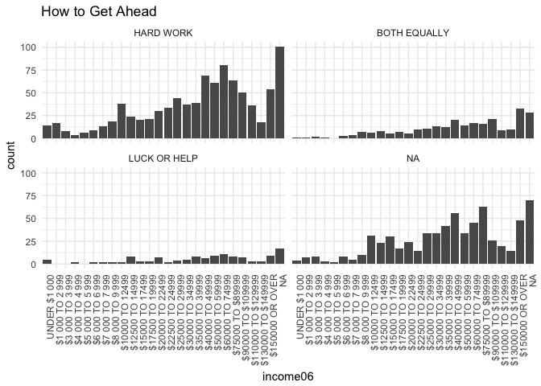

### No one seems to think being popular is important

``` r
gss %>% 
  ggplot(aes(income06))+
  geom_bar()+
  facet_wrap(~popular)+
  labs(title = "How Important is Being Popular")
```

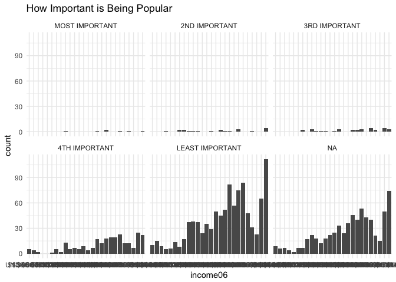

graph 10

### The most wealthy families rate religion as strongly important

``` r
gss %>% 
  ggplot(aes(income06))+
  geom_bar()+
  facet_wrap(~reliten)+
  labs(title = "Religion")
```

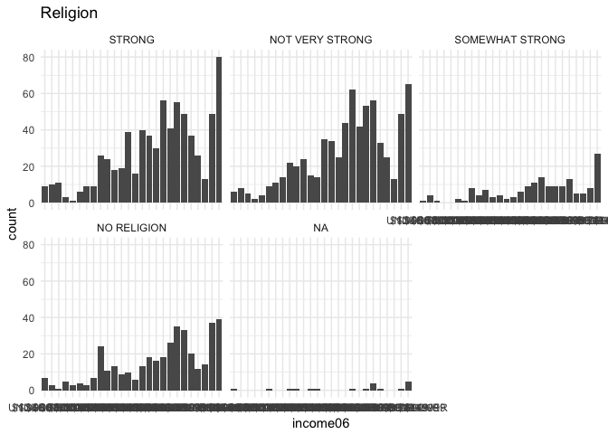

### A lot of really wealthy families didn't want to answer who they voted for

``` r
gss %>% 
  ggplot(aes(income06))+
  geom_bar()+
  facet_wrap(~pres08)
```

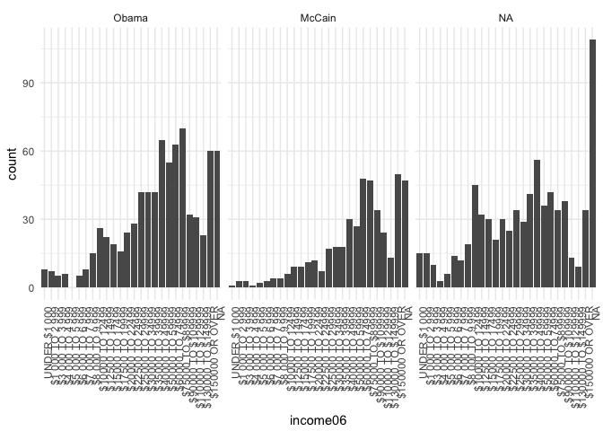

``` r
gss %>% 
  ggplot(aes(abpoor, income06))+
  geom_count()
```

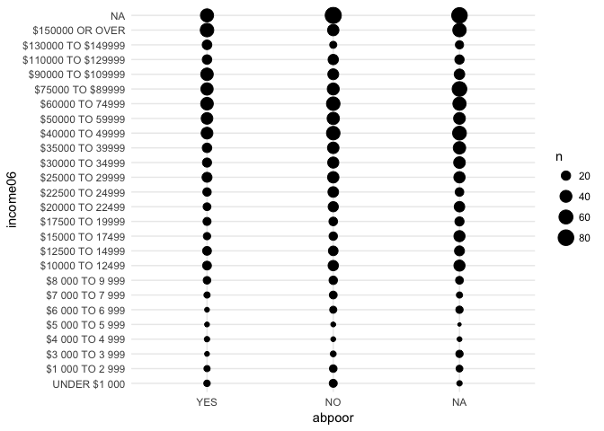

Exploring Presidential Votes and Other Views
============================================

``` r
gss %>% 
  ggplot(aes(pres08))+
  geom_bar()
```


Librerals rarely expressed voting for McCain
--------------------------------------------

``` r
gss %>% 
  ggplot(aes(pres08, polviews))+
  geom_jitter()
```

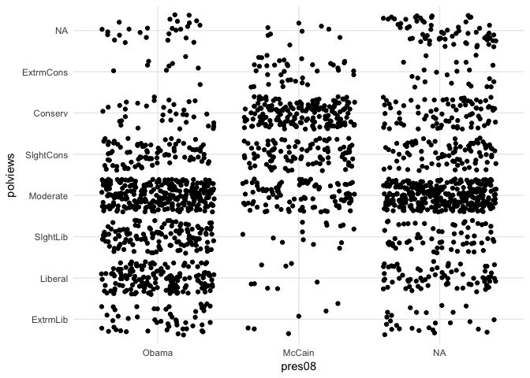

### No clear relation between opinion for space exploration and presidential vote

``` r
gss %>% 
  ggplot(aes(as.factor(pres08), fill=natspac))+
  geom_bar(position = "fill")
```


Not much of a relationship between who they voted for and halting natural crime
-------------------------------------------------------------------------------

``` r
gss %>% 
  ggplot(aes(as.factor(pres08), fill=natcrime))+
  geom_bar(position = "fill")
```


### People who votes for McCain seem to think there was too little on Defense being spent more than other votes. This is intuitive.

``` r
gss %>% 
  ggplot(aes(as.factor(pres08), fill=natarms))+
  geom_bar(position = "fill")
```

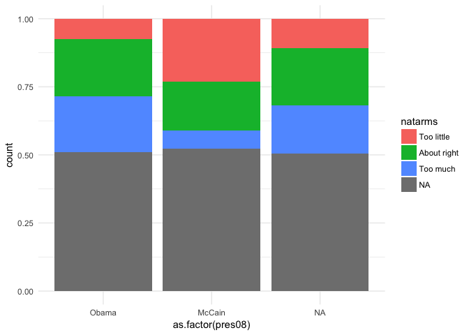

### Not clear relationship for supporting sciencetific research

``` r
gss %>% 
  ggplot(aes(as.factor(pres08), fill=natsci))+
  geom_bar(position = "fill")
```

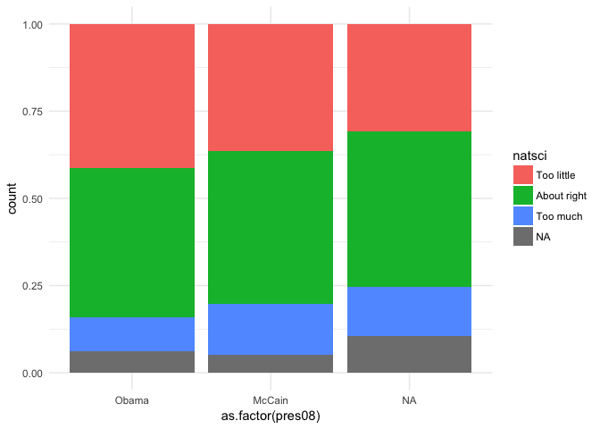

### Obama voters look less religious than McCain voters

``` r
gss %>% 
  ggplot(aes(as.factor(pres08), fill=bible))+
  geom_bar(position = "fill")
```


Who are these people with a lot of siblings?
============================================

20

``` r
gss %>% 
  ggplot(aes(childs, sibs, group=childs))+
  geom_boxplot()
```

    ## Warning: Removed 5 rows containing non-finite values (stat_boxplot).

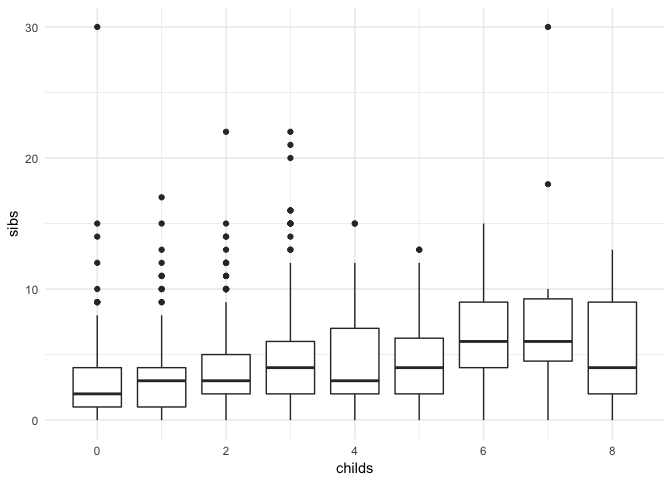

### Baseline for education

``` r
gss %>% 
  ggplot(aes(educ))+
  geom_bar()
```

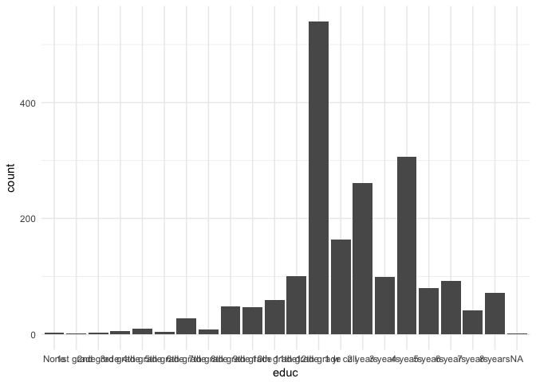

### People with &gt;20 siblings seem lower educated than normal

``` r
gss %>% 
  filter(sibs > 20) %>% 
  ggplot(aes(educ))+
  geom_bar()
```

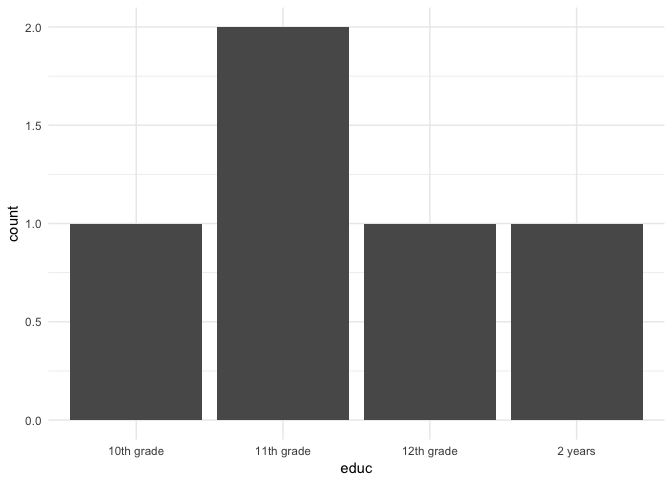

### About normal in regards to opinions in childcare

``` r
gss %>% 
  filter(sibs > 20) %>% 
  ggplot(aes(natchld))+
  geom_bar()
```


Looking into Racial Preferences
===============================

### Most people seem to feel equally close to white and black people. Seems to be more who feel close to whites than blacks though

``` r
gss %>% 
  ggplot(aes(closewht, closeblk, color=race))+
  geom_jitter()
```

    ## Warning: Removed 680 rows containing missing values (geom_point).

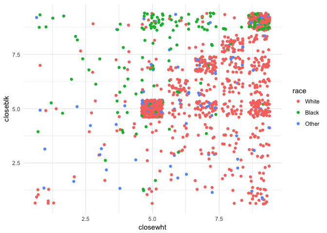

### People who feel closer to blacks seem to be more supporitive of legalizing marijuana

``` r
gss %>%
  ggplot(aes(grass, closeblk, group=grass))+
  geom_boxplot()
```

    ## Warning: Removed 680 rows containing non-finite values (stat_boxplot).

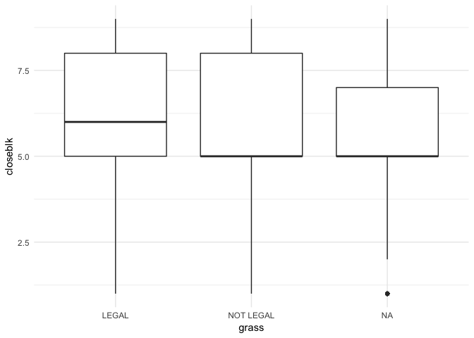

### No clear relationship between feeling close to blacks and opinions about the bible

``` r
gss %>%
  ggplot(aes(closeblk, bible))+
  geom_count()
```

    ## Warning: Removed 680 rows containing non-finite values (stat_sum).


### Most people prefer not to answer whether they think if blacks get ahead without favors... but of the people who do answer, they seem to strongly agree that blacks get ahead without favors

``` r
gss %>%
  ggplot(aes(closeblk, wrkwayup, color=race))+
  geom_jitter()
```

    ## Warning: Removed 680 rows containing missing values (geom_point).

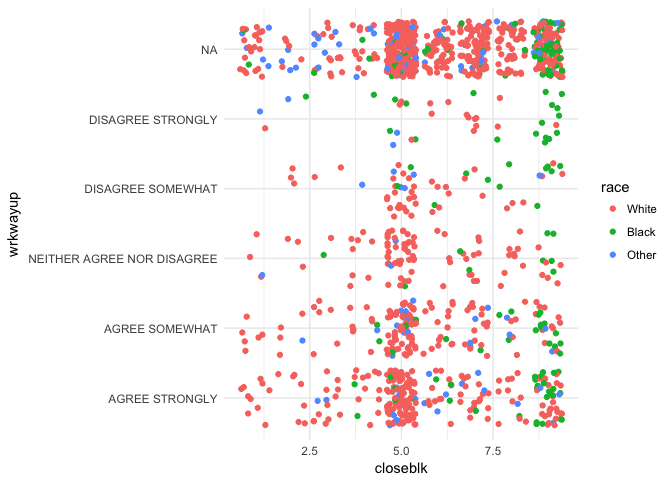

### People who felt close to blacks didnt comment on removing racist books. However, the only other thing we can see is that people who were closer and less closer to blacks both agreed on removing racist books

``` r
gss %>%
  ggplot(aes(librac, closeblk))+
  geom_boxplot()
```

    ## Warning: Removed 680 rows containing non-finite values (stat_boxplot).


### People who were less close to blacks were less likely to vote for Obama

``` r
gss %>% 
  filter(closeblk <2.5) %>% 
  ggplot(aes(pres08))+
  geom_bar()
```


30

### Basline for allowing homosexual speech

``` r
gss %>% 
  ggplot(aes(spkhomo))+
  geom_bar()
```


### People less close to blacks seem like they are more apt to saying "not allowed" than bigger population. Relationship could be compromised because of y axis however

``` r
gss %>% 
  filter(closeblk <2.5) %>% 
  ggplot(aes(spkhomo))+
  geom_bar()
```


### Baseline for religious

``` r
gss %>% 
  ggplot(aes(reliten))+
  geom_bar()
```

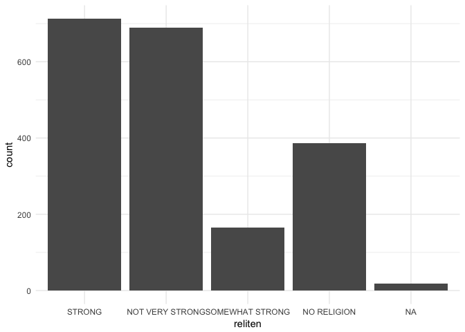

### Not close to blacks is not radically associated with strength of religion

``` r
gss %>% 
  filter(closeblk <2.5) %>% 
  ggplot(aes(reliten))+
  geom_bar()
```

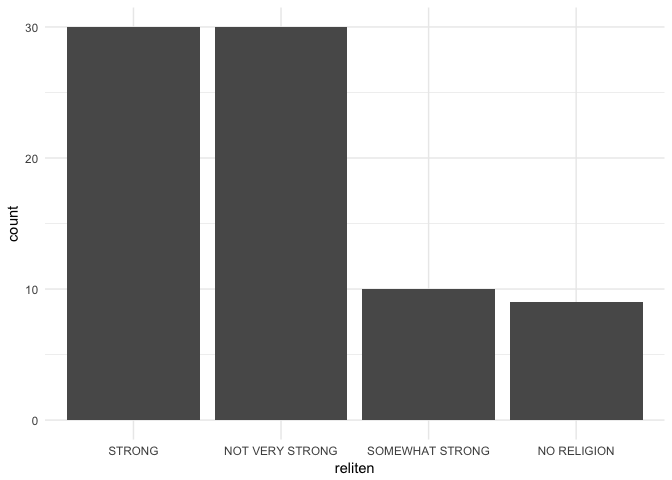

### Favor Preference in Hiring Blacks

``` r
gss %>% 
  ggplot(aes(affrmact))+
  geom_bar()
```

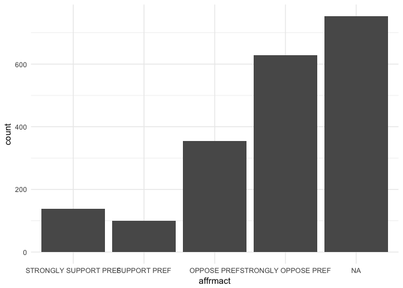

### Preference for hiring blacks for people who don't feel close to blacks

``` r
gss %>% 
  filter(closeblk <2.5) %>% 
  ggplot(aes(affrmact))+
  geom_bar()
```

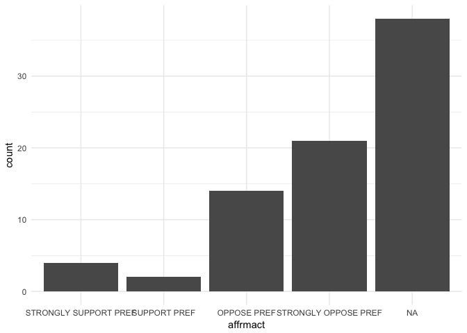

### Of the people who have an "oppose" preference in hiring blacks, most of them feel equally close to whites and blacks, or just more close to whites. The "support" group tends to be equal or favorable to hiring blacks

``` r
gss %>% 
  ggplot(aes(closewht, closeblk, color = race))+
  geom_jitter() +
  facet_wrap(~affrmact)
```

    ## Warning: Removed 680 rows containing missing values (geom_point).

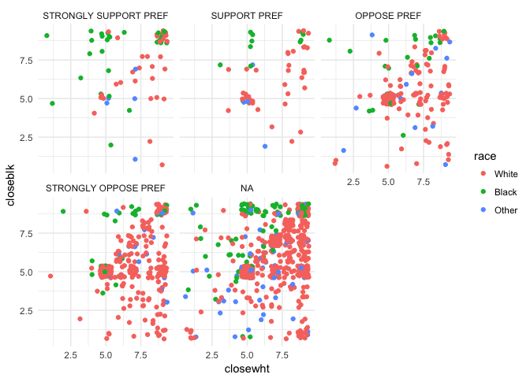
