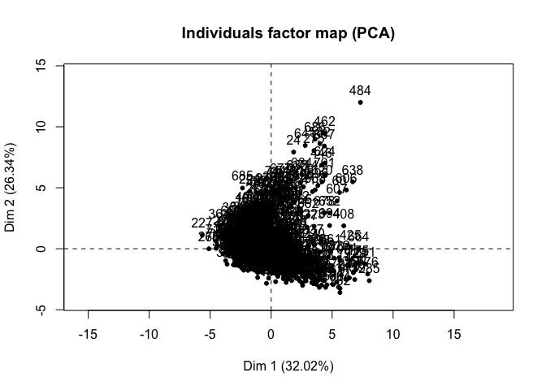
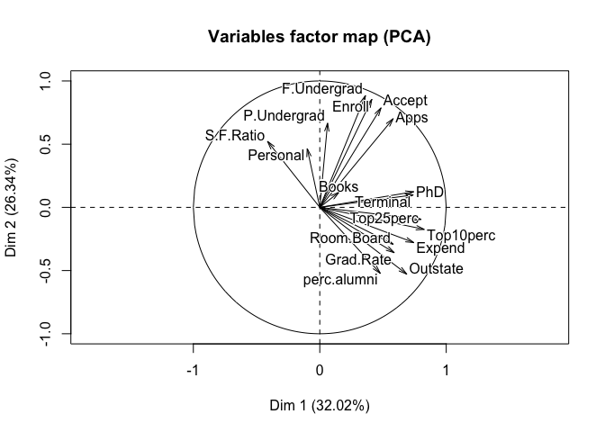
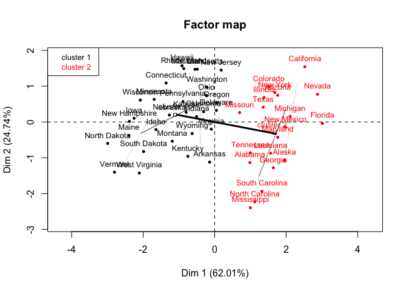
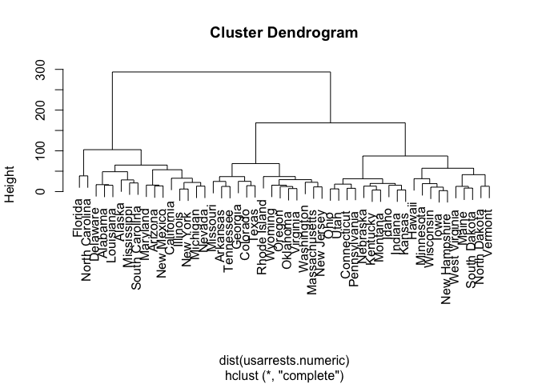
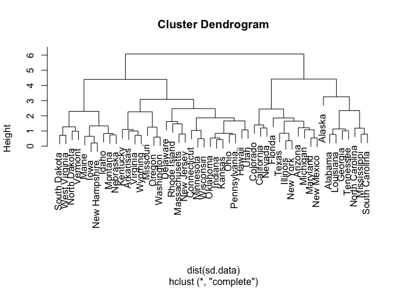

Unsupervised\_Learning
================

Load Packages and Data
======================

``` r
rm(list=ls())
library(tidyverse)
library(FactoMineR)
library(stats)
library(ggdendro)
library(forcats)

usarrests <- read_csv("USArrests.csv")
college <- read_csv("College.csv")
```

Colleges
========

### 1. Perform PCA analysis on the college dataset and plot the first two principal components. Describe the results.

The first component seems associated with 'Top25perc', 'PhD', 'Terminal, and 'Top10Perc'. This may be perhaps describing successful students. The second component seems associated with 'F. Undergrad', 'Enroll', 'Accept', and 'Apps'. This might be more associated with college admissions.

``` r
college.numeric <- college %>% 
  select(-Private)
  
pca <- PCA(college.numeric, scale.unit=TRUE, graph = TRUE )
```



### 2. Calculate the cumulative proportion of variance explained by all the principal components (see 10.2.3 in ISLR). Approximately how much of the variance in College is explained by the first two principal components?

The first two PCs describe 58.361% of variation.

``` r
summary.PCA(pca)
```

    ## 
    ## Call:
    ## PCA(X = college.numeric, scale.unit = TRUE, graph = TRUE) 
    ## 
    ## 
    ## Eigenvalues
    ##                        Dim.1   Dim.2   Dim.3   Dim.4   Dim.5   Dim.6
    ## Variance               5.444   4.478   1.173   1.007   0.933   0.847
    ## % of var.             32.021  26.340   6.901   5.923   5.488   4.985
    ## Cumulative % of var.  32.021  58.361  65.262  71.185  76.673  81.658
    ##                        Dim.7   Dim.8   Dim.9  Dim.10  Dim.11  Dim.12
    ## Variance               0.605   0.587   0.530   0.404   0.313   0.220
    ## % of var.              3.559   3.454   3.117   2.375   1.841   1.296
    ## Cumulative % of var.  85.217  88.670  91.788  94.163  96.004  97.300
    ##                       Dim.13  Dim.14  Dim.15  Dim.16  Dim.17
    ## Variance               0.168   0.144   0.088   0.037   0.023
    ## % of var.              0.986   0.846   0.517   0.216   0.135
    ## Cumulative % of var.  98.286  99.132  99.649  99.865 100.000
    ## 
    ## Individuals (the 10 first)
    ##                 Dist    Dim.1    ctr   cos2    Dim.2    ctr   cos2  
    ## 1           |  2.458 | -1.593  0.060  0.420 |  0.767  0.017  0.097 |
    ## 2           |  5.226 | -2.192  0.114  0.176 | -0.579  0.010  0.012 |
    ## 3           |  2.395 | -1.431  0.048  0.357 | -1.093  0.034  0.208 |
    ## 4           |  4.538 |  2.856  0.193  0.396 | -2.631  0.199  0.336 |
    ## 5           |  4.250 | -2.212  0.116  0.271 |  0.022  0.000  0.000 |
    ## 6           |  2.805 | -0.572  0.008  0.042 | -1.496  0.064  0.285 |
    ## 7           |  2.727 |  0.242  0.001  0.008 | -1.506  0.065  0.305 |
    ## 8           |  2.774 |  1.750  0.072  0.398 | -1.461  0.061  0.277 |
    ## 9           |  2.917 |  0.769  0.014  0.070 | -1.984  0.113  0.463 |
    ## 10          |  4.050 | -2.771  0.182  0.468 | -0.845  0.021  0.043 |
    ##              Dim.3    ctr   cos2  
    ## 1           -0.101  0.001  0.002 |
    ## 2            2.279  0.570  0.190 |
    ## 3           -0.438  0.021  0.033 |
    ## 4            0.142  0.002  0.001 |
    ## 5            2.387  0.625  0.315 |
    ## 6            0.024  0.000  0.000 |
    ## 7            0.234  0.006  0.007 |
    ## 8           -1.027  0.116  0.137 |
    ## 9           -1.426  0.223  0.239 |
    ## 10           1.628  0.291  0.162 |
    ## 
    ## Variables (the 10 first)
    ##                Dim.1    ctr   cos2    Dim.2    ctr   cos2    Dim.3    ctr
    ## Apps        |  0.580  6.188  0.337 |  0.702 10.996  0.492 | -0.068  0.398
    ## Accept      |  0.484  4.310  0.235 |  0.787 13.847  0.620 | -0.110  1.025
    ## Enroll      |  0.411  3.108  0.169 |  0.854 16.299  0.730 | -0.090  0.689
    ## Top10perc   |  0.827 12.551  0.683 | -0.174  0.679  0.030 |  0.038  0.123
    ## Top25perc   |  0.803 11.834  0.644 | -0.095  0.201  0.009 | -0.026  0.058
    ## F.Undergrad |  0.361  2.391  0.130 |  0.884 17.445  0.781 | -0.066  0.377
    ## P.Undergrad |  0.062  0.070  0.004 |  0.667  9.928  0.445 |  0.151  1.951
    ## Outstate    |  0.688  8.687  0.473 | -0.528  6.232  0.279 |  0.050  0.217
    ## Room.Board  |  0.581  6.202  0.338 | -0.292  1.899  0.085 |  0.161  2.219
    ## Books       |  0.151  0.419  0.023 |  0.119  0.317  0.014 |  0.734 45.889
    ##               cos2  
    ## Apps         0.005 |
    ## Accept       0.012 |
    ## Enroll       0.008 |
    ## Top10perc    0.001 |
    ## Top25perc    0.001 |
    ## F.Undergrad  0.004 |
    ## P.Undergrad  0.023 |
    ## Outstate     0.003 |
    ## Room.Board   0.026 |
    ## Books        0.538 |

Clustering States
=================

### 1. Perform PCA on the dataset and plot the observations on the first and second principal components.

``` r
usarrests.numeric <- usarrests %>% 
  select(-State)


row.names(usarrests.numeric) <- usarrests$State

pca <- PCA(usarrests.numeric, scale.unit=TRUE, graph = TRUE )
```


### 2. Perform K-means clustering with K=2. Plot the observations on the first and second principal components and color-code each state based on their cluster membership.

The first component seems associate with states like "Florida", "Nevada", and "California". This component is associated with rape, assault, and murder. From now on when I mention "crime" I am talking about association with rape, assault and murder. Cluster two is more associated with this component. The second component is associate with states like "Hawaii", "Rhode Island", and "Massachusetts". This component is more associated most with Urban Population. Cluster 1 may be a little more associated with this component, but not by much.

``` r
res.hcpc <-  HCPC(pca, nb.clust = 2, graph = FALSE)

plot.HCPC(res.hcpc, choice = "map")
```



### 3. Perform K-means clustering with K=4. Plot the observations on the first and second principal components and color-code each state based on their cluster membership.

Cluster 1 is likely states with lower crime, and lower urban population. Cluster 2 is higher urban population and less crime. Cluster 3 is lower urban population and more crime. Cluster 4 is higher urban population and higher crime.

``` r
res.hcpc <-  HCPC(pca, nb.clust = 4, graph=FALSE)
plot.HCPC(res.hcpc, choice = "map")
```


### 4. Perform K-means clustering with K=3. Plot the observations on the first and second principal components and color-code each state based on their cluster membership.

Cluster 1 looks like the lower crime states. Cluster 2 looks like the medium crime states. Cluster 3 looks like it is associated with crime.

``` r
res.hcpc <-  HCPC(pca, nb.clust = 3, graph=FALSE)
plot.HCPC(res.hcpc, choice = "map")
```


``` r
km.out <- kmeans(usarrests.numeric, 3)
km.out$centers
```

    ##      Murder  Assault UrbanPop     Rape
    ## 1  8.214286 173.2857 70.64286 22.84286
    ## 2  4.270000  87.5500 59.75000 14.39000
    ## 3 11.812500 272.5625 68.31250 28.37500

``` r
km.out$cluster
```

    ##        Alabama         Alaska        Arizona       Arkansas     California 
    ##              3              3              3              1              3 
    ##       Colorado    Connecticut       Delaware        Florida        Georgia 
    ##              1              2              3              3              1 
    ##         Hawaii          Idaho       Illinois        Indiana           Iowa 
    ##              2              2              3              2              2 
    ##         Kansas       Kentucky      Louisiana          Maine       Maryland 
    ##              2              2              3              2              3 
    ##  Massachusetts       Michigan      Minnesota    Mississippi       Missouri 
    ##              1              3              2              3              1 
    ##        Montana       Nebraska         Nevada  New Hampshire     New Jersey 
    ##              2              2              3              2              1 
    ##     New Mexico       New York North Carolina   North Dakota           Ohio 
    ##              3              3              3              2              2 
    ##       Oklahoma         Oregon   Pennsylvania   Rhode Island South Carolina 
    ##              1              1              2              1              3 
    ##   South Dakota      Tennessee          Texas           Utah        Vermont 
    ##              2              1              1              2              2 
    ##       Virginia     Washington  West Virginia      Wisconsin        Wyoming 
    ##              1              1              2              2              1

``` r
table(km.out$cluster)
```

    ## 
    ##  1  2  3 
    ## 14 20 16

### 5. Perform K-means clustering with K=3 on the first two principal components score vectors, rather than the raw data. Describe your results and compare them to the clustering results with K=3 based on the raw data.

Compared to the inital k=3 cluster, these results are similar. The centers are different. The clusters seems to be mostly the same (though they are ordered differently)

``` r
pr.out <- prcomp(usarrests.numeric)
km.out <- kmeans(pr.out$x[, 1:2], 3)
km.out$centers
```

    ##          PC1       PC2
    ## 1   2.888932  5.140574
    ## 2 102.149155 -2.020236
    ## 3 -83.741577 -1.982213

``` r
km.out$cluster
```

    ##        Alabama         Alaska        Arizona       Arkansas     California 
    ##              2              2              2              1              2 
    ##       Colorado    Connecticut       Delaware        Florida        Georgia 
    ##              1              3              2              2              1 
    ##         Hawaii          Idaho       Illinois        Indiana           Iowa 
    ##              3              3              2              3              3 
    ##         Kansas       Kentucky      Louisiana          Maine       Maryland 
    ##              3              3              2              3              2 
    ##  Massachusetts       Michigan      Minnesota    Mississippi       Missouri 
    ##              1              2              3              2              1 
    ##        Montana       Nebraska         Nevada  New Hampshire     New Jersey 
    ##              3              3              2              3              1 
    ##     New Mexico       New York North Carolina   North Dakota           Ohio 
    ##              2              2              2              3              3 
    ##       Oklahoma         Oregon   Pennsylvania   Rhode Island South Carolina 
    ##              1              1              3              1              2 
    ##   South Dakota      Tennessee          Texas           Utah        Vermont 
    ##              3              1              1              3              3 
    ##       Virginia     Washington  West Virginia      Wisconsin        Wyoming 
    ##              1              1              3              3              1

``` r
table(km.out$cluster)
```

    ## 
    ##  1  2  3 
    ## 14 16 20

### 6. Using hierarchical clustering with complete linkage and Euclidean distance, cluster the states.

``` r
hc.complete <- hclust(dist(usarrests.numeric), method = "complete")
plot(hc.complete)
```



### 7. Cut the dendrogram at a height that results in three distinct clusters. Which states belong to which clusters?

The cluster each state belongs to is shown below.

``` r
hc.complete <- hclust(dist(usarrests.numeric), method = "complete")
cutree(hc.complete, 3)
```

    ##        Alabama         Alaska        Arizona       Arkansas     California 
    ##              1              1              1              2              1 
    ##       Colorado    Connecticut       Delaware        Florida        Georgia 
    ##              2              3              1              1              2 
    ##         Hawaii          Idaho       Illinois        Indiana           Iowa 
    ##              3              3              1              3              3 
    ##         Kansas       Kentucky      Louisiana          Maine       Maryland 
    ##              3              3              1              3              1 
    ##  Massachusetts       Michigan      Minnesota    Mississippi       Missouri 
    ##              2              1              3              1              2 
    ##        Montana       Nebraska         Nevada  New Hampshire     New Jersey 
    ##              3              3              1              3              2 
    ##     New Mexico       New York North Carolina   North Dakota           Ohio 
    ##              1              1              1              3              3 
    ##       Oklahoma         Oregon   Pennsylvania   Rhode Island South Carolina 
    ##              2              2              3              2              1 
    ##   South Dakota      Tennessee          Texas           Utah        Vermont 
    ##              3              2              2              3              3 
    ##       Virginia     Washington  West Virginia      Wisconsin        Wyoming 
    ##              2              2              3              3              2

### 8. Hierarchically cluster the states using complete linkage and Euclidean distance, after scaling the variables to have standard deviation. What effect does scaling the variables have on the hierarchical clustering obtained?

Scaling the variables slightly affect the clusters, but the trees stil look fairly similar. Scaling the variables is helpful because the data measures have different units, which are hard to compare otherwise.

``` r
sd.data <- scale(usarrests.numeric)
hc.complete.sd <- hclust(dist(sd.data), method = "complete")
plot(hc.complete.sd)
```


