Assignment7\_notebook
================
Mengchen Shi
11/26/2017

``` r
#install.packages("poliscidata")
data(gss, package = "poliscidata")
# convert to tibble
library(tidyverse)
```

    ## Loading tidyverse: ggplot2
    ## Loading tidyverse: tibble
    ## Loading tidyverse: tidyr
    ## Loading tidyverse: readr
    ## Loading tidyverse: purrr
    ## Loading tidyverse: dplyr

    ## Conflicts with tidy packages ----------------------------------------------

    ## filter(): dplyr, stats
    ## lag():    dplyr, stats

``` r
gss <- as_tibble(gss)
```

#### Basic demographic information

##### Graph 1

``` r
gss %>% 
  ggplot(aes(age))+
  geom_histogram(bins = 50)
```

    ## Warning: Removed 5 rows containing non-finite values (stat_bin).

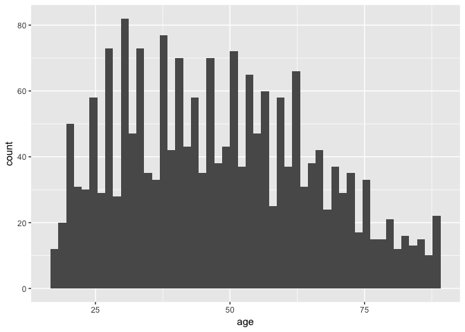

``` r
# generating counts of peoples' ages
# Question - what is the distribution of people's ages in the U.S.?
```

##### Graph 2

``` r
gss %>% 
  ggplot(aes(sex))+
  geom_bar()
```

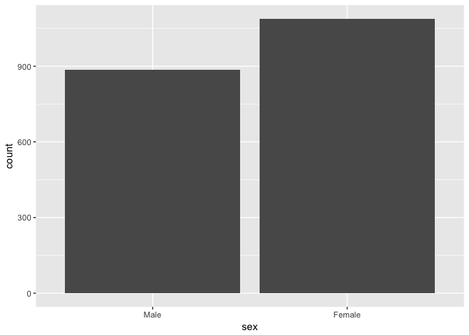

``` r
# generating counts of peoples' gender
```

##### Graph 3

``` r
gss %>% 
  ggplot(aes(age, fill = sex))+
  geom_bar(position = "fill")
```

    ## Warning: Removed 5 rows containing non-finite values (stat_count).

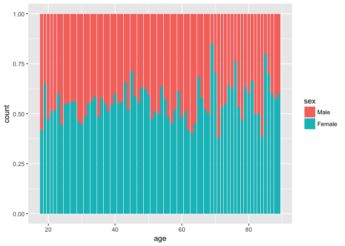

``` r
# generating proportions of peoples' ages and gender
# Question - what is the gender proportion in different age groups?
```

##### Graph 5

``` r
gss %>% 
  ggplot(aes(race))+
  geom_bar()
```


``` r
# generating counts of peoples' race
# Question - what is the distribution of people's race in the U.S.?
```

##### Graph 6

``` r
gss %>% 
  ggplot(aes(race, fill=sex))+
  geom_bar(position = "fill")
```

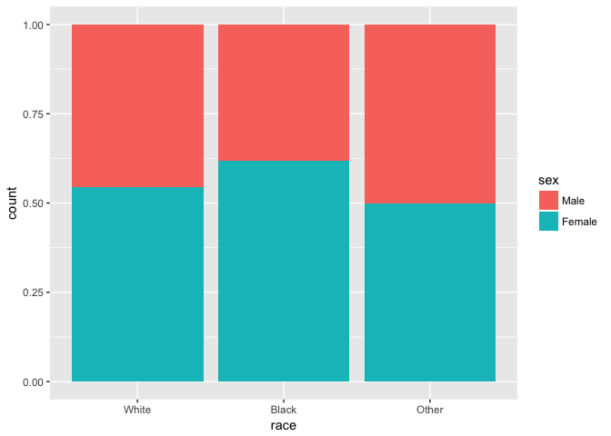

``` r
# generating proportion of peoples' race and gender
# Question - what is the gender proportion in different race groups?
```

##### Graph 7

``` r
gss %>% 
  ggplot(aes(age, fill=race))+
  geom_bar(position = "fill")
```

    ## Warning: Removed 5 rows containing non-finite values (stat_count).

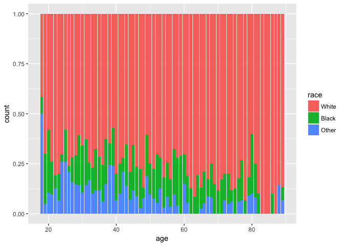

``` r
# generating proportion of peoples' ages and race
# Question - what is the race proportion in different age groups?
```

#### Exploring education

##### Graph 8

``` r
gss %>% 
  ggplot(aes(educ))+
  geom_histogram(stat="count")
```

    ## Warning: Ignoring unknown parameters: binwidth, bins, pad


``` r
# generating counts of peoples' years of education
# Question - what is the distribution of peoples years of education?
```

##### Graph 9

``` r
gss %>% 
  ggplot(aes(degree))+
  geom_histogram(stat="count")
```

    ## Warning: Ignoring unknown parameters: binwidth, bins, pad

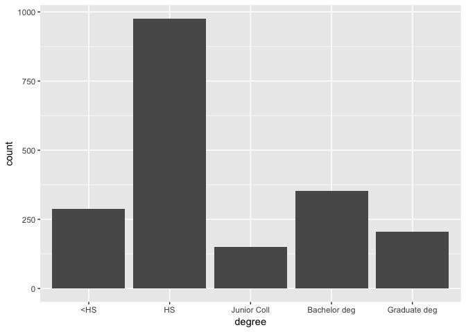

``` r
# generating counts of peoples' degrees
# Question - what is the distribution of peoples' degrees?
```

#### Exploring ideology

##### Graph 10

``` r
gss %>%
ggplot(aes(polviews)) +
  geom_bar()
```

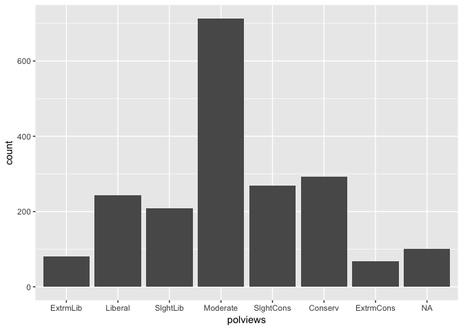

``` r
# generating counts of peoples' ideologies
# Question - what is the distribution of peoples' ideologies?
```

##### Graph 11

``` r
gss %>%
ggplot(aes(race, fill = polviews)) +
  geom_bar(position = "fill")
```

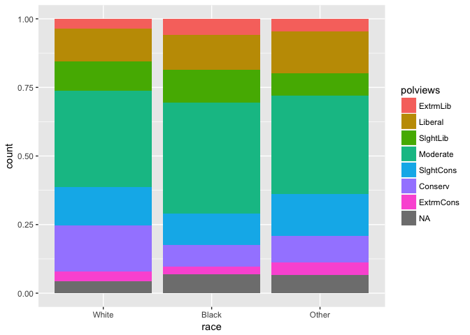

``` r
# generating proportion of peoples' ideologies
# Question - what is the proportions of peoples' ideologies in different race groups?
```

##### Graph 12

``` r
gss %>%
ggplot(aes(degree, fill=polviews)) +
  geom_bar(position = "fill")
```

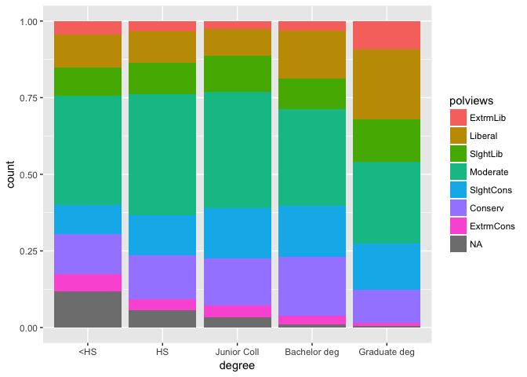

``` r
# generating proportion of peoples' ideologies
# Question - what is the proportions of peoples' ideologies in groups with different degrees?
```

##### Graph 13

``` r
gss %>%
ggplot(aes(age, fill=polviews)) +
  geom_bar(position = "fill")
```

    ## Warning: Removed 5 rows containing non-finite values (stat_count).

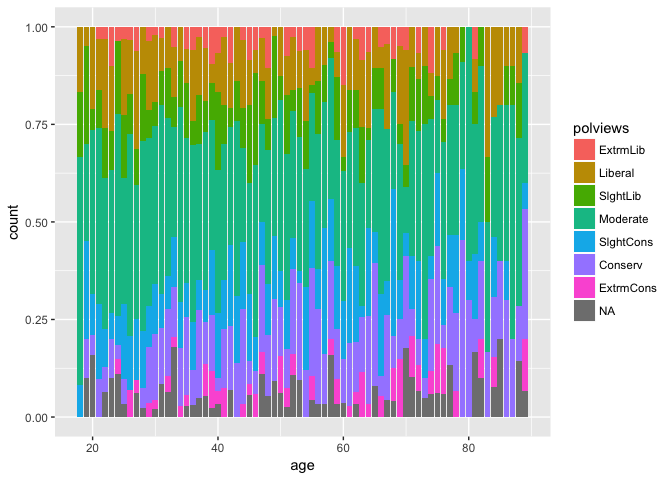

``` r
# generating proportion of peoples' ideologies
# Question - what is the proportions of peoples' ideologies in different age groups?
```

#### Exploring income

##### Graph 14

``` r
gss %>%
ggplot(aes(income06)) +
  geom_bar()
```

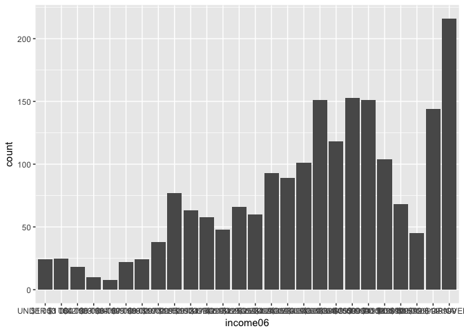

``` r
# generating proportion of peoples' income
```

##### Graph 15

``` r
gss %>%
ggplot(aes(income06, age)) +
  geom_boxplot()
```

    ## Warning: Removed 5 rows containing non-finite values (stat_boxplot).

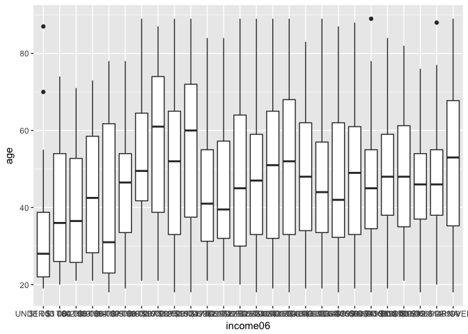

``` r
# generating proportion of peoples' income in different age groups
```

##### Graph 16

``` r
gss %>%
ggplot(aes(race, income06)) +
  geom_jitter()
```

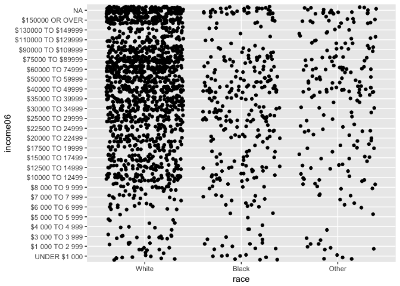

``` r
# generating proportion of peoples' income in different race groups
```

##### Graph 17

``` r
gss %>%
ggplot(aes(income06, fill=educ)) +
  geom_bar(position = "fill")
```

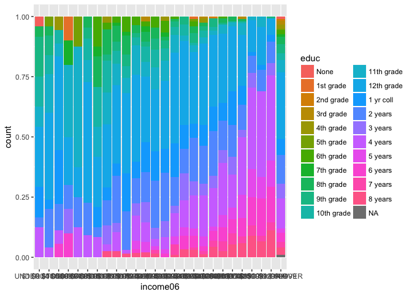

``` r
gss %>%
ggplot(aes(income06)) +
  geom_bar(stat = "count")+
  facet_wrap(~degree)
```


``` r
# generating proportion of peoples' incomes in different years of education and degrees
```

##### Graph 18

``` r
gss %>%
ggplot(aes(income06, fill = polviews)) +
  geom_bar(position = "fill")
```

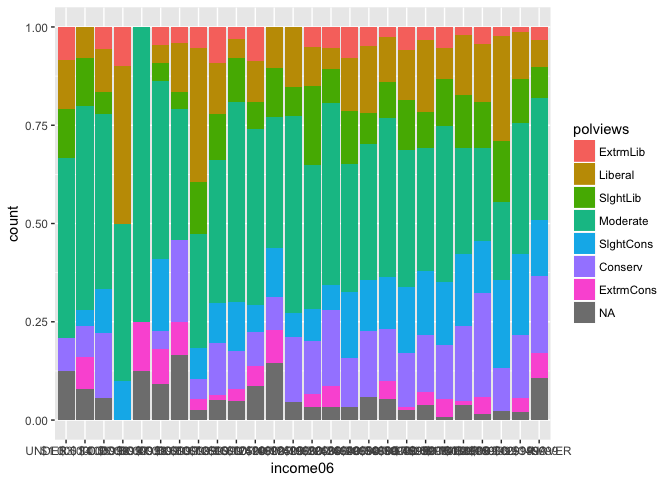

``` r
# generating proportion of peoples' incomes in different ideology groups
```

#### Exploring confidence in the federal government

##### Graph 19 & 20

``` r
gss %>%
ggplot(aes(confed)) +
  geom_bar()
```

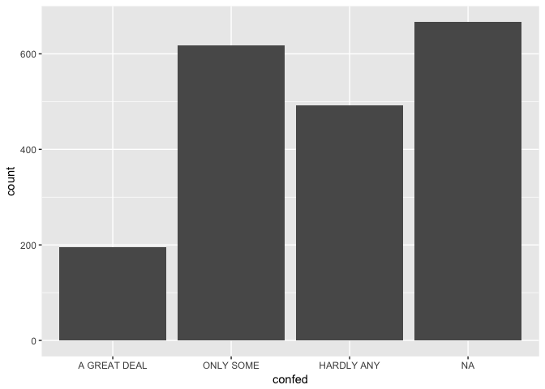

``` r
gss %>%
  count(confed) %>%
  na.omit() %>%
  mutate(pct = n / sum(n)) %>%
  with(pie(pct, labels = confed, clockwise = TRUE))
```


``` r
# generating counts of peoples' confidence in the federal government
# Question - what is the distribution of peoples' confidence in the federal government?
```

##### Graph 21

``` r
gss %>%
ggplot(aes(race, fill = confed)) +
  geom_bar(position = "fill")
```

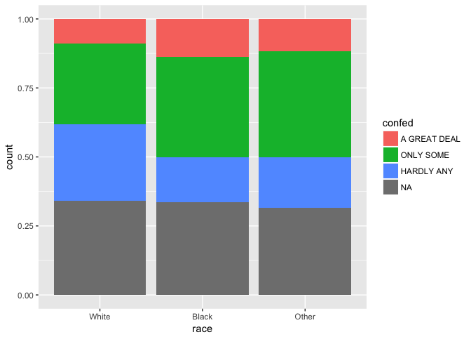

``` r
# Question - what is the proportion of peoples' confidence in the federal government in different race group?
```

##### Graph 22

``` r
gss %>%
ggplot(aes(fill = confed, income06)) +
  geom_bar(position = "fill")
```

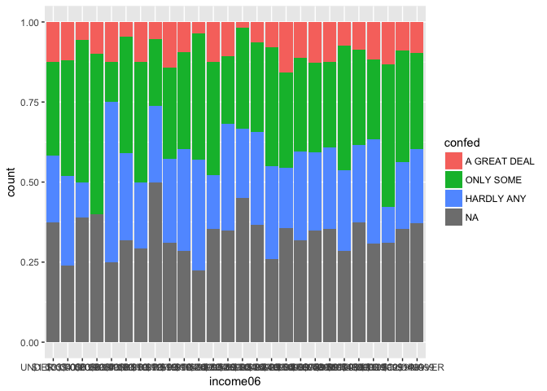

``` r
# Question - what is the proportion of peoples' confidence in the federal government in different race group?
```

##### Graph 23

``` r
gss %>%
ggplot(aes(confed, fill = degree)) +
  geom_bar(position = "fill")
```

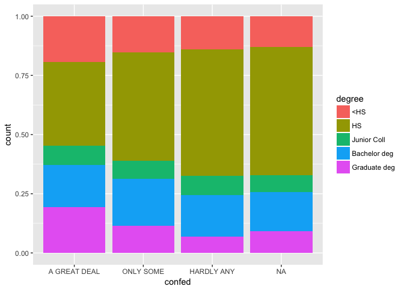

``` r
# Question - what is the proportion of peoples' confidence in the federal government in different degree groups?
```

##### Graph 24

``` r
gss %>%
ggplot(aes(polviews, fill=confed)) +
  geom_bar(position = "fill")
```

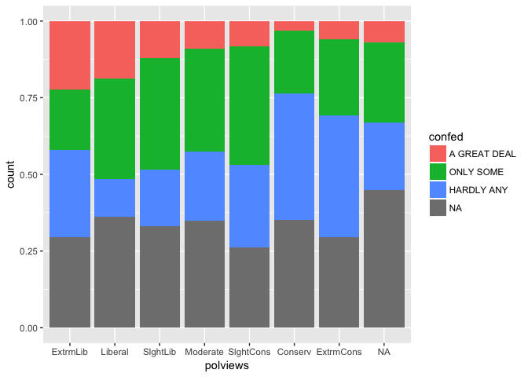

``` r
# Question - what is the proportion of peoples' confidence in the federal government in different ideology groups?
```

##### Graph 25

``` r
gss %>% 
  ggplot(aes(degree, polviews, color = race))+
  geom_jitter()
```

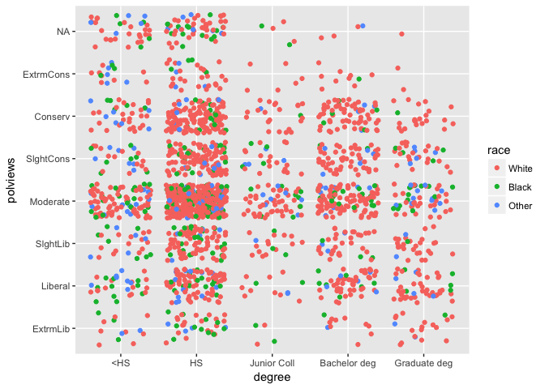

``` r
# Question - what is the proportion of peoples' confidence in the federal government in different ideology groups and races?
```

##### Graph 26

``` r
gss %>% 
  ggplot(aes(age, polviews, color = race))+
  geom_jitter()
```

    ## Warning: Removed 5 rows containing missing values (geom_point).

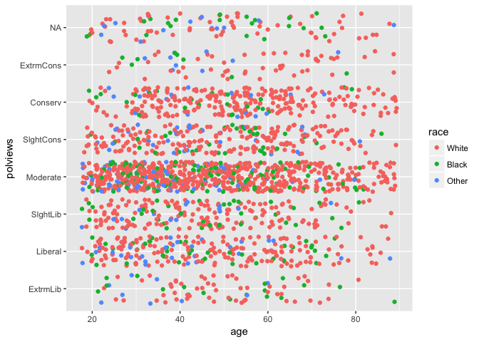

##### Graph 27

``` r
gss %>% 
  ggplot(aes(age, confed, color = race))+
  geom_jitter() +
  facet_wrap(~polviews)
```

    ## Warning: Removed 5 rows containing missing values (geom_point).

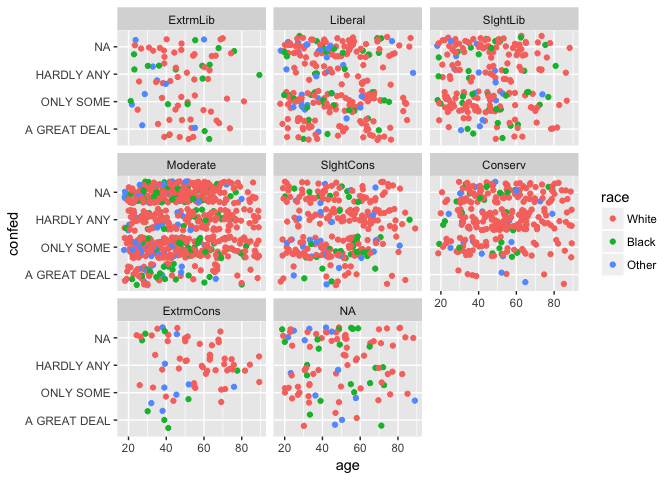

``` r
# Question - what is the proportion of peoples' confidence in the federal government in different ideology groups and age groups?
```

##### Graph 28

``` r
gss %>% 
  ggplot(aes(polviews, fill = conjudge))+
  geom_bar(position = "fill")
```

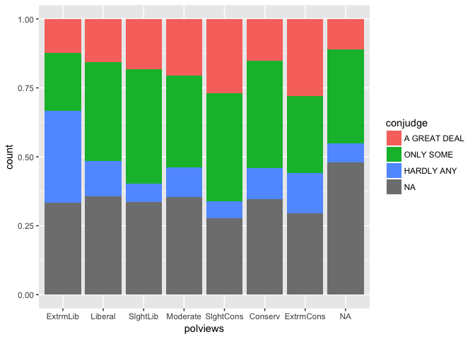

``` r
# Question -what are the difference of confidence in the U.S Supreme Court people have among people with different incomes?
```

##### Graph 29

``` r
gss %>% 
  ggplot(aes(income06, fill = conjudge))+
  geom_bar(position = "fill")
```

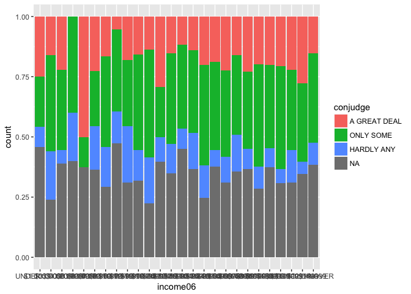

``` r
# Question -what are the difference of confidence in the U.S Supreme Court people have among people with different incomes?
```

##### Graph 30

``` r
gss %>% 
  ggplot(aes(polviews, fill = conlegis))+
  geom_bar(position = "fill")
```

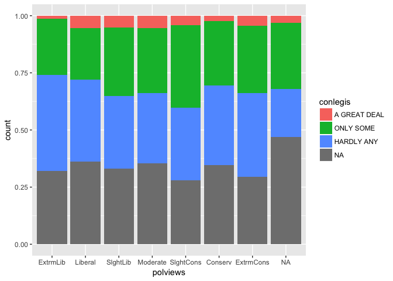

``` r
# Question -what are the difference of confidence in the Congress people have among people with different incomes?
```

##### Graph 31

``` r
gss %>% 
  ggplot(aes(income06, fill = conlegis))+
  geom_bar(position = "fill")
```

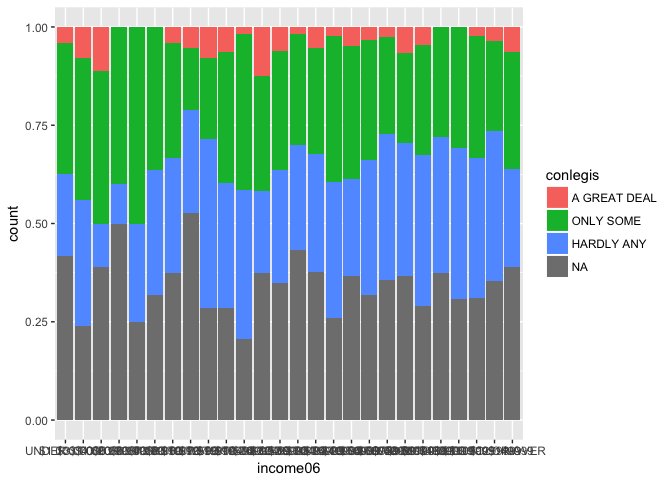

``` r
# Question -what are the difference of confidence in the Congress people have among people with different incomes?
```

##### Graph 32

``` r
gss %>%
  mutate(degree = abbreviate(degree, 20)) %>%
  ggplot(aes(income06, age)) +
  geom_point(size = 1) +
  facet_wrap(~ degree)
```

    ## Warning: Removed 5 rows containing missing values (geom_point).

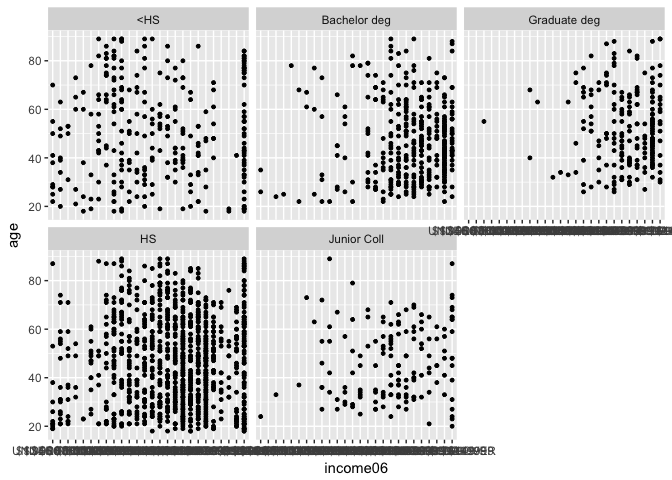

``` r
#Question -what are the relationships between income and age among people with different degrees?
```
