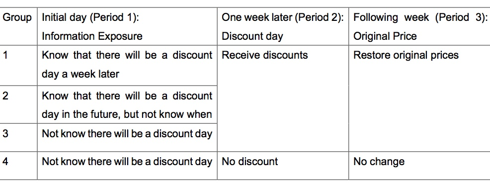

# Persp-Analysis Assignment 3

#### Name: Mengchen Shi

#### Date: October 29th, 2017

## Do discount seasons really boost consumption?
### Introduction
Discount seasons are welcome by both sellers and shoppers. Black Friday is absolutely a typical example of a popular discount season that everybody is excitedly looking forward to. There is no doubt that Black Friday stimulates consumption desire and creates a great amount of trading volume every year. However, given the constraint that people’s consumption capacity is limited, consumption before and after the discount day might be reduced due to the centralized shopping on the discount day. It is not uncommon to hear people saying “I will not buy it right now. It will be cheaper on Black Friday”, or “I am broke after Black Friday.”, or “I bought too many things on Black Friday. I swear I will not buy anything in the next few months!”. It seems that consumers reschedule their shopping plan according to discount seasons, but the total consumption does not change. Here comes our research question: do discount seasons really boost consumption? 

### Experiment Design
We plan to design a digital field experiment to explore this problem. The experiment aims to obverse how customers change their shopping behaviors in response to discounts and whether the whole trading volume changes accordingly. 

The experiment need to be conducted with powerful partners, namely, mobile game suppliers. Mobile games mainly make profits by receiving advertisement fees and by selling gaming equipment. The later way provides us with an ideal platform to observe shopping behaviors. 

Here is an example of how to conduct the experiment on Monopoly, which is a popular mobile game generated from a classic board game. The target of the game is to earn “money” by investing in properties and stocks. Instead of determining who is the winner by playing only one round as it is in board game, the mobile game is now a long-term game that players can continuously play the game and accumulate their virtual wealth. There is a store in the game that players can purchase items such as vehicles, antiques and other tools to help them accumulate wealth quickly. Items can be paid by virtual money which can be earned in the game or paid by players with real money.

To test players’ reactions to discounts in the store, we divide 500 players into four groups (100 players each). Each group contains the same proportions of different kinds of players. That is, the compositions of four groups are controlled to be identical. The following chart illustrates how to give treatments to each group.

As the chart shows, we give different information about discount to different groups at the initial day. One week later, we offer discounts to group 1, 2 and 3, but not 4. After the discount day, products will be back to the original prices. Group 4 is the control group. Other groups are treatment groups.

Next, we calculate the trading volumes in three periods for each group. After that, we can draw conclusions by comparing different groups.

By comparing Group 3 and 4, we can know how much an unexpected discount changes total consumption and consuming behaviors during and after the discount. 

By comparing Group 1 and 3, we can know how discount information change players’ behaviors in three periods. For instance, the result might be that players in Group 1 consume much less before (period 1) and after (period 3) the discount day than players in Group 3, but the total consumptions of three periods in two groups are the same. If this situation happens, we may conclude that a well-expected discount only reschedules the consumption but cannot boost consumption in the long run. 

By comparing Group 1 and 2, we can know whether players reschedule their shopping plans according to a well-informed discount date (as Black Friday). This step is an auxiliary experiment that helps us to figure out whether it is the certainty of the future discount date that reshapes the players’ consumption schedules.

### Discussion
You may wonder why we do not conduct the experiment on a real e-commerce platform. It is because there are too many sellers for consumers to choose that it is hard to calculate the total consumption accurately. Besides, it is hard to control cost and treatment in a real discount season as Black Friday. 

There are five more benefits from conducting the experiment on mobile games. First, we do not need to recruit participants – players are already there. Second, players’ shopping behaviors reflect their shopping habits in the real world. Third, one game can be regarded as a complete market so that it is easy to control the treatment. Fourth, players’ behaviors in the game are simplified so that they can be analyzed more easily. Last, pre-treatment information is available to enable more complex measurement of the experiment. 

While the benefits of this digital field experiment are obvious, we can further enhance the experiment in three aspects.

#### Validity
As for the internal validity, the digital experiment ensures treatment delivered as designed and to measure outcomes for all participants efficiently. However, we cannot ensure that all the chosen participants will be actively involved in the mobile game during our experiment, which will lead to sample loss. Luckily, as pre-treatment information such as characteristics of the participants, is available, we can eliminate this concern by selecting active players as participants. Moreover, we can divide players evenly into each group according to their characteristics such as age, gender and level to avoid the disturbing effects caused by these confounding variables.

The construct invalidity of this experiment might come from the fact that people’s consumption behaviors in a mobile game are not the same as that in the real world. Obviously, consumption in games is not equal to the real concept “consumption” in daily life. In the real world, consumers are facing much more complex choices over much longer periods, and the expenses in daily life are much higher than that in the game. We hope to minimize this invalidity by basing the experiment on mobile games that stimulate the complex real world and repeating the experiment in different mobile games to enrich the variety of consumption. 

There is a concern about external validity that since a mobile game only offers one kind of consumption, not all consumption patterns are covered. We should repeat our experiment in different mobile games that provide various kinds of game equipment to test whether the results of this experiment would generalize to other situations.

#### Heterogeneity of treatment effects
There might be two sorts of heterogeneity of treatment effects.
The first is that discount might have different effects on different products. For example, the total consumptions of cheap products (e.g., fast-moving consumer goods) do not change, but the consumptions of luxurious and durable goods are boosted by discount. We can test this effect by comparing the consumption of “energy” (fast-moving goods) and “vehicles” (durable goods) in the game.

The second heterogeneity of treatment effect is that discount might have different effects on different consumers. In the real world, wealthier consumers are less sensitive to discount than consumers with less money, so their consumption changes in response to a discount differ. Since we have pre-treatment information about participants, we can verify this theory in the game by comparing the consumption between “wealthier” participants (with more virtual money) and “poor” participants.

#### Mechanisms
Why it seems like a discount boosts consumption dramatically but the overall consumption remains unchanged? Or, how are consuming behaviors influenced by expectation of a discount? The experiment enables us to explore these questions as well. We can add a group with participants that are informed of that the possibility of a discount in the next week is 50%. The group will receive discount in period 2. By comparing this group with Group 1, 2 and 3, we can figure out whether it is the certainty of a discount (the possibility and the determined date) that changes participants’ choices of consuming over different periods. 

