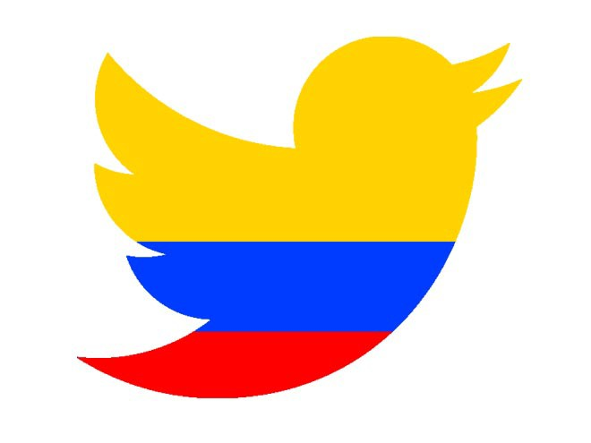
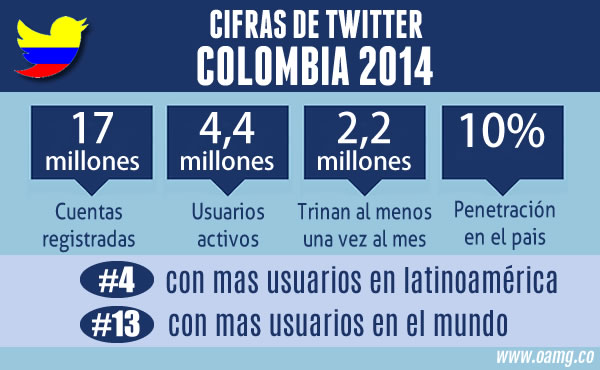

```{r setup, include=FALSE}
knitr::opts_chunk$set(echo = TRUE)
```

**General research question: Can social media trends predict voting outcomes?**

**Specific research question (application to survey research project): What rationale underlies active Colombian “Tweeters” mentioning of election-related topics in the time before the Colombian presidential elections?**



In Assignment 1, I proposed a research project to investigate if trends in tweets related to (and the sentiment in them about) the peace accords in Colombia could have predicted the surprising outcome of the 2016 national plebiscite in which the electorate voted against these agreements. My broader underlying research goal was to explore if social media trends can predict voting outcomes, with the specific research question focusing on these trends in tweeting behavior. For this proposal, I have decided to keep the overall research objective, but use a proposed survey project that would shift the specific focus. Instead of looking at past tweeting trends in relation to past outcomes (an observational approach), I propose using ecological momentary assessments (EMAs) in order to investigate the rationale underlying why people use tweets. Specifically, I propose to use EMAs via smartphones to digitally survey Colombian “Tweeters” when they tweet in reference to the 2018 presidential elections during the three months before the vote. My goal with this research question is to explore why individuals are using twitter in reference to an election, and thus possibly better understanding how social media trends may be used to understand the outcomes. For example, if the findings demonstrate that the majority of this social media use comes in an attempt to convince others when the “Tweeter” feels like their message/opinion/perspective is in the minority and not being addressed in the public sphere, that would most likely indicate a different relationship between social media usage and election results than if tweeting is being used to rally what is perceived as a silent, but unmotivated base.


The proposed survey research project would involve first identifying different subgroups of social media users, recruiting participants from each, and then sending them digital survey questions when they are tweeting about the election in the three months prior to the vote. As the first step, I would use analyses of social media usage in Colombia to separate users who are individuals (instead of groups) into multiple levels of activity ranging from rare to frequent. I would particularly focus on those who were actively using twitter politically in the lead up to the 2016 plebiscite, since that is the most recent vote. I recognize that behaviors on social media may have changed since that vote or may be different for a presidential election versus a plebiscite, but I believe that this is the best option that I would have to compare and sample based on. The number of groups that I would create would depend on the spread of the users and the existing literature on different categories of social media use. Next, I would attempt to recruit a sample of participants from each of these groups by randomly choosing from these lists. I would consider oversampling from the less active groups to make sure I had sufficient participation from those (and could use weighting in the analysis to balance this). Once I have a final list of participants, I would also try to use whatever data is linked to their social media usage (i.e., location, job, etc.) to try to evaluate the possibility of non-response bias for those who did not agree to participate versus those who did.



Once I have these participants, I would then use EMAs to digitally survey directly them via their smartphones following twitter activity about the election. In particular, every time they posted a politically-related post, I would have them asked about what caused them to make that post, what audience they had in mind for it, and what did they hope was the effect of doing it. I would gather this data in the three months before the 2018 Colombian presidential elections in order to how these responses may shift not only by group, but also in relation to the proximity of the election (in Colombia, there are limits to the campaigning season, and the last of these windows is the three months before the election). Since it is likely that either the more active users would be tweeting often and thus might have fatigue from frequent surveys being sent or the less active ones would not want to spend much time engaging in social media surveys, I would use quick quantitative surveys that had likert-scale responses. In other words, drawing on the literature, I would ask them a small number of targeted possibilities for their motivation on ranges from strongly disagree to strongly agree. This approach would lose the depth of open-ended questions that would allow participants to elaborate on their reasons, but would at the same time do a better job of harnessing the frequency of digital methods without causing problematic respondent fatigue. 

For my analyses, I would investigate the trends in these responses, exploring differences by party affiliation, level of social media activity, geography, etc). I would then investigate the association between the findings that emerge and the trends in the polls, as well as the final outcome. It would not be possible to make a causal connection, especially since this is not a random control trial, but it could be a first step in better understanding the relationship between social media and voting outcomes.

By using EMAs, I would be able to better get at the reasoning behind why “Tweeters” are posting in relation to political votes. Specifically, EMAs via smart phones would allow me to collect data about the underlying reasons for these posts in real-world contexts and as they are happening. Traditional analog survey methods usually suffer from participants having to recall rationales and behaviors in the past (and thus are affected by incomplete or incorrect memory). This methodology, however, has the advantage of being time-based and thus makes it possible to prompt participants for their feelings and thoughts immediately following the behavior being studied. Additionally, becauses EMAs are a cost-effective way of surveying participants at multiple times, I would be able to trace the trends and changes in rationales over the three-month period before the election. 

EMAs and digital survey methods also have their drawbacks, though I believe that the research design and question mitigates some of these concerns. First, since I am interested in behaviors of those using social media, the need to provide the technology or training to conduct digital EMAs would be minimal. This research project would thus save on costs and most likely not face the technological obstacles when using these methods with certain populations. In fact, there is often the worry that using digital methods misses certain portions of the population who may not be as likely to engage with this technology. My research question, however, focuses on those who do engage with social media. Furthermore, I am including in the study design participants who may not be as active on social media (and in fact, oversampling them) in order to include in this analysis a broad range from the most active to casual users. 
	
Finally, one of the major concerns around collecting data with digital methods are the ethical issues that may arise. Often, a benefit of EMAs through smartphones is being able to use digital traces to verify or augment the data collected via survey. In the case of my research question, the focus is not on location (which would not add much to this analysis), but rather on being able to gather data at multiple timepoints and immediately following social media activity. Therefore, digital tracing would not be collected. Additionally, while the survey data would be private (i.e., asking them for information that is not in the public realm), the data about what they are posting and when they post is public information in that they are choosing to make it openly available by posting it. There are still legitimate concerns that are specifically related to digital survey methods. These may include the security of data and information, as well as participants possibly worrying that other data could be collected about them. In order to address these concerns, I would focus on making sure that there was space for participants to voice worries they had and for these to be addressed during the informed consent process. In particular it could be useful to develop a FAQ sheet around data and privacy questions that may come up that could be shared with them as part of the process.
