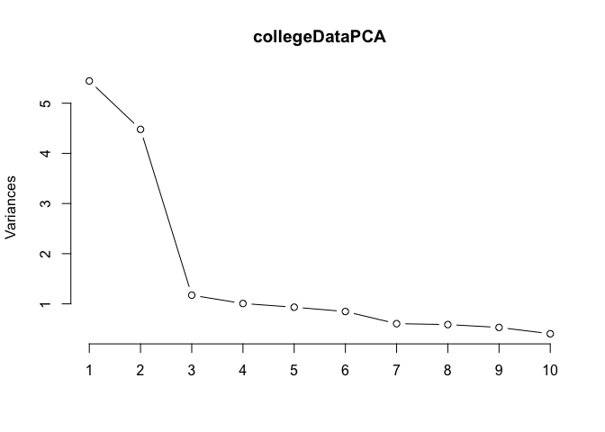
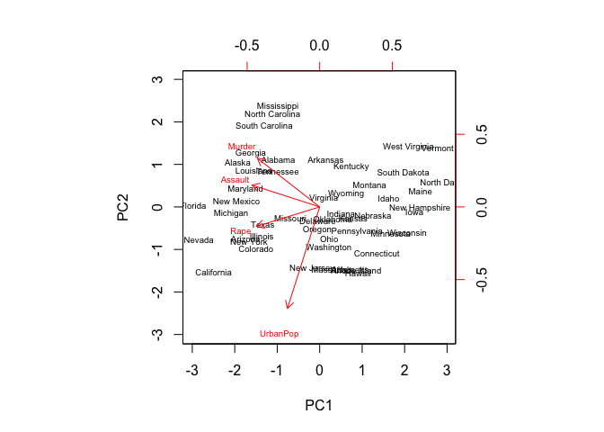
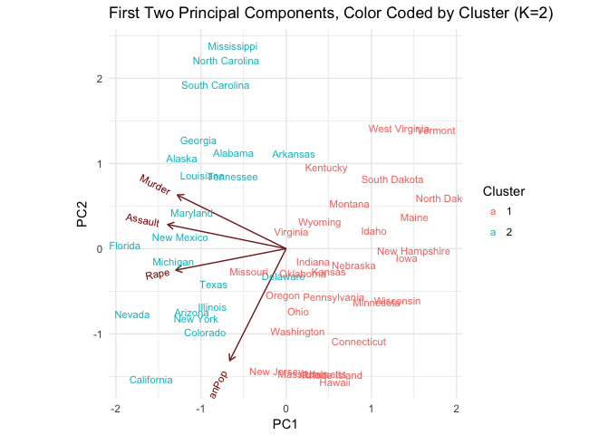
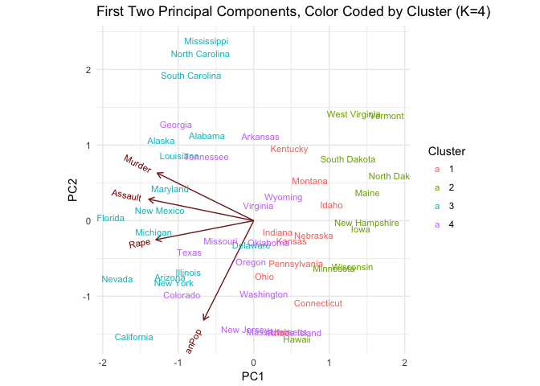
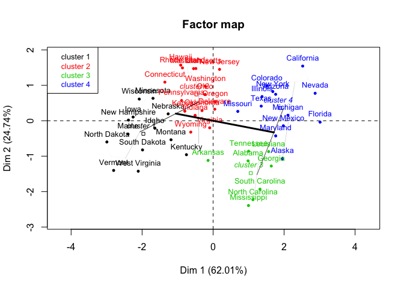
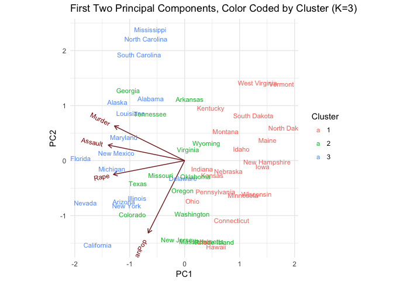
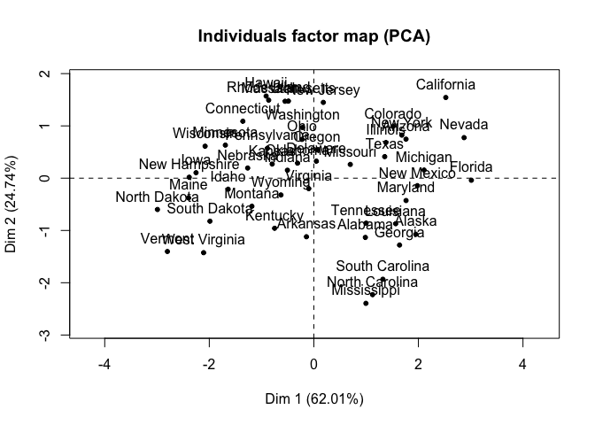
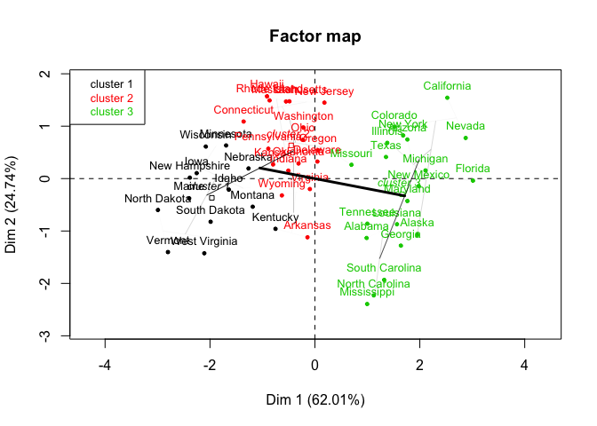
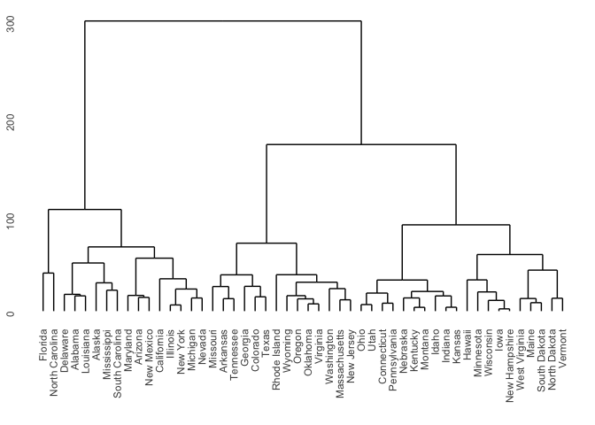

Assignment 8
================
Gabriel Velez
11/30/2017

``` r
knitr::opts_chunk$set(echo = TRUE)
# Libraries needed
library(tidyverse)
```

    ## Loading tidyverse: ggplot2
    ## Loading tidyverse: tibble
    ## Loading tidyverse: tidyr
    ## Loading tidyverse: readr
    ## Loading tidyverse: purrr
    ## Loading tidyverse: dplyr

    ## Warning: package 'ggplot2' was built under R version 3.3.2

    ## Conflicts with tidy packages ----------------------------------------------

    ## filter(): dplyr, stats
    ## lag():    dplyr, stats

``` r
library(knitr)
#install.packages("ggfortify")
library(ggfortify)
```

    ## Warning: package 'ggfortify' was built under R version 3.3.2

``` r
library(forcats)
library(broom)
library(modelr)
```

    ## 
    ## Attaching package: 'modelr'

    ## The following object is masked from 'package:broom':
    ## 
    ##     bootstrap

``` r
library(stringr)
```

    ## Warning: package 'stringr' was built under R version 3.3.2

``` r
#install.packages("ISLR")
library(ISLR)
```

    ## Warning: package 'ISLR' was built under R version 3.3.2

``` r
library(rcfss)
library(grid)
library(gridExtra)
```

    ## Warning: package 'gridExtra' was built under R version 3.3.2

    ## 
    ## Attaching package: 'gridExtra'

    ## The following object is masked from 'package:dplyr':
    ## 
    ##     combine

``` r
library(ggbiplot)
```

    ## Loading required package: plyr

    ## -------------------------------------------------------------------------

    ## You have loaded plyr after dplyr - this is likely to cause problems.
    ## If you need functions from both plyr and dplyr, please load plyr first, then dplyr:
    ## library(plyr); library(dplyr)

    ## -------------------------------------------------------------------------

    ## 
    ## Attaching package: 'plyr'

    ## The following objects are masked from 'package:dplyr':
    ## 
    ##     arrange, count, desc, failwith, id, mutate, rename, summarise,
    ##     summarize

    ## The following object is masked from 'package:purrr':
    ## 
    ##     compact

    ## Loading required package: scales

    ## Warning: package 'scales' was built under R version 3.3.2

    ## 
    ## Attaching package: 'scales'

    ## The following object is masked from 'package:purrr':
    ## 
    ##     discard

    ## The following objects are masked from 'package:readr':
    ## 
    ##     col_factor, col_numeric

    ## 
    ## Attaching package: 'ggbiplot'

    ## The following object is masked from 'package:ggfortify':
    ## 
    ##     ggbiplot

``` r
#install.packages("ggdendro")
library(ggdendro)
library(tidytext)
library(tm)
```

    ## Loading required package: NLP

    ## Warning: package 'NLP' was built under R version 3.3.2

    ## 
    ## Attaching package: 'NLP'

    ## The following object is masked from 'package:ggplot2':
    ## 
    ##     annotate

``` r
#library(topicmodels)
#install.packages("FactoMineR")
library(FactoMineR)
```

    ## Warning: package 'FactoMineR' was built under R version 3.3.2

``` r
options(digits = 3)
set.seed(1234)
theme_set(theme_minimal())


# Importing data 
collegeData <- read.csv("College.csv")

# Dropping First Variable
collegeData$Private <- NULL
collegeData$X <- NULL
```

Colleges
--------

1.  Perform PCA analysis on the college dataset and plot the first two principal components. Describe the results.

<!-- -->

1.  What variables appear strongly correlated on the first principal component?
2.  What about the second principal component?

``` r
# Doing PCA 
collegeDataPCA <- prcomp(collegeData,
                 scale = TRUE) 

head(collegeDataPCA$x)
```

    ##         PC1     PC2     PC3     PC4    PC5      PC6    PC7     PC8    PC9
    ## [1,] -1.592 -0.7668  0.1010  0.9212  0.743 -0.29811  0.638  0.8788  0.093
    ## [2,] -2.191  0.5785 -2.2773 -3.5866 -1.059 -0.17702  0.237 -0.0469  1.113
    ## [3,] -1.430  1.0921  0.4378 -0.6768  0.369 -0.95997 -0.248 -0.3085 -0.105
    ## [4,]  2.854  2.6289 -0.1416  1.2947  0.184 -1.05883 -1.249  0.1476  0.379
    ## [5,] -2.211 -0.0216 -2.3855  1.1138 -0.684  0.00491 -2.158  0.6240 -0.160
    ## [6,] -0.571  1.4954 -0.0243 -0.0669  0.376 -0.66791 -1.609  0.5290  0.263
    ##         PC10   PC11    PC12    PC13     PC14     PC15     PC16     PC17
    ## [1,] -0.0486  0.399  0.0896 -0.0521  0.18002 -0.00175  0.09308 -0.09349
    ## [2,] -0.9645 -0.212 -0.0972 -0.2434 -0.74373 -0.10364  0.05022  0.17395
    ## [3,] -0.6402 -0.155  0.3445  0.0975  0.22738  0.02254  0.00405 -0.00376
    ## [4,] -0.4609 -0.420 -0.6867 -0.0754 -0.00338  0.07313  0.19142  0.17514
    ## [5,] -0.3632 -0.153  0.0505  0.2670 -0.61401  0.27382 -0.01065 -0.04831
    ## [6,]  0.6941 -0.100  1.0931 -0.1311 -0.09439 -0.22086 -0.05699  0.03856

``` r
# Plotting
plot(collegeDataPCA, type = "l")
```


``` r
# Looking at components
collegeDataPCA$rotation
```

    ##                 PC1     PC2     PC3     PC4      PC5      PC6     PC7
    ## Apps         0.2488 -0.3316  0.0631 -0.2813 -0.00574 -0.01624 -0.0425
    ## Accept       0.2076 -0.3721  0.1012 -0.2678 -0.05579  0.00753 -0.0129
    ## Enroll       0.1763 -0.4037  0.0830 -0.1618  0.05569 -0.04256 -0.0277
    ## Top10perc    0.3543  0.0824 -0.0351  0.0515  0.39543 -0.05269 -0.1613
    ## Top25perc    0.3440  0.0448  0.0241  0.1098  0.42653  0.03309 -0.1185
    ## F.Undergrad  0.1546 -0.4177  0.0614 -0.1004  0.04345 -0.04345 -0.0251
    ## P.Undergrad  0.0264 -0.3151 -0.1397  0.1586 -0.30239 -0.19120  0.0610
    ## Outstate     0.2947  0.2496 -0.0466 -0.1313 -0.22253 -0.03000  0.1085
    ## Room.Board   0.2490  0.1378 -0.1490 -0.1850 -0.56092  0.16276  0.2097
    ## Books        0.0648 -0.0563 -0.6774 -0.0871  0.12729  0.64105 -0.1497
    ## Personal    -0.0425 -0.2199 -0.4997  0.2307  0.22231 -0.33140  0.6338
    ## PhD          0.3183 -0.0583  0.1270  0.5347 -0.14017  0.09126 -0.0011
    ## Terminal     0.3171 -0.0464  0.0660  0.5194 -0.20472  0.15493 -0.0285
    ## S.F.Ratio   -0.1770 -0.2467  0.2898  0.1612  0.07939  0.48705  0.2193
    ## perc.alumni  0.2051  0.2466  0.1470 -0.0173  0.21630 -0.04734  0.2433
    ## Expend       0.3189  0.1317 -0.2267 -0.0793 -0.07596 -0.29812 -0.2266
    ## Grad.Rate    0.2523  0.1692  0.2081 -0.2691  0.10927  0.21616  0.5599
    ##                  PC8      PC9    PC10    PC11    PC12     PC13    PC14
    ## Apps         0.10309 -0.09023 -0.0525  0.0430 -0.0241  0.59583  0.0806
    ## Accept       0.05627 -0.17786 -0.0411 -0.0584  0.1451  0.29264  0.0335
    ## Enroll      -0.05866 -0.12856 -0.0345 -0.0694 -0.0111 -0.44464 -0.0857
    ## Top10perc    0.12268  0.34110 -0.0640 -0.0081 -0.0386  0.00102 -0.1078
    ## Top25perc    0.10249  0.40371 -0.0145 -0.2731  0.0894  0.02188  0.1517
    ## F.Undergrad -0.07889 -0.05944 -0.0208 -0.0812 -0.0562 -0.52362 -0.0564
    ## P.Undergrad -0.57078  0.56067  0.2231  0.1007  0.0635  0.12600  0.0193
    ## Outstate    -0.00985 -0.00457 -0.1867  0.1432  0.8234 -0.14186 -0.0340
    ## Room.Board   0.22145  0.27502 -0.2983 -0.3593 -0.3546 -0.06975 -0.0584
    ## Books       -0.21329 -0.13366  0.0820  0.0319  0.0282  0.01144 -0.0668
    ## Personal     0.23266 -0.09447 -0.1360 -0.0186  0.0393  0.03945  0.0275
    ## PhD          0.07704 -0.18518  0.1235  0.0404 -0.0232  0.12770 -0.6911
    ## Terminal     0.01216 -0.25494  0.0886 -0.0590 -0.0165 -0.05831  0.6710
    ## S.F.Ratio    0.08360  0.27454 -0.4720  0.4450  0.0110 -0.01772  0.0414
    ## perc.alumni -0.67852 -0.25533 -0.4230 -0.1307 -0.1827  0.10409 -0.0272
    ## Expend       0.05416 -0.04914 -0.1323  0.6921 -0.3260 -0.09375  0.0731
    ## Grad.Rate    0.00534  0.04190  0.5903  0.2198 -0.1221 -0.06920  0.0365
    ##                 PC15     PC16      PC17
    ## Apps        -0.13341 -0.45914 -0.358970
    ## Accept       0.14550  0.51857  0.543427
    ## Enroll      -0.02959  0.40432 -0.609651
    ## Top10perc   -0.69772  0.14874  0.144986
    ## Top25perc    0.61727 -0.05187 -0.080348
    ## F.Undergrad -0.00992 -0.56036  0.414705
    ## P.Undergrad -0.02095  0.05273 -0.009018
    ## Outstate    -0.03835 -0.10159 -0.050900
    ## Room.Board  -0.00340  0.02593 -0.001146
    ## Books        0.00944 -0.00288 -0.000773
    ## Personal     0.00309  0.01289  0.001114
    ## PhD          0.11206 -0.02981 -0.013813
    ## Terminal    -0.15891  0.02708 -0.006209
    ## S.F.Ratio    0.02090  0.02125  0.002222
    ## perc.alumni  0.00842 -0.00333  0.019187
    ## Expend       0.22774  0.04388  0.035310
    ## Grad.Rate    0.00339  0.00501  0.013071

``` r
# Plotting components
biplot(collegeDataPCA, scale = 0, cex = .6)
```

 This data seems to show that the first two principal components explain a significant amount of the variance in colleges, and that from there each of the additional components does not explain much (and each one is about equal, with a slight downward trend). In terms of what aspects are most correlated with these two components:

*1A)* Based on this analysis, on the first principal component, it seems like Top 10 perc, Top 25 perc, PHD, Terminal, and Expend are all strongly correlated (i.e., I have chosen over .30) with this component. In other words, this component seems to be most strongly correlated with the percentage of students from the top 10% of their high school class, the percentage of students from the top 25% of their high school class (which would make sense that both these would be associated), the percentage of faculty with PhDs, the percentage of faculty with terminal degrees, and the instructional expenditure per student. Out of state tuition is also close to the threshold I choose at .29.

*1B)* For the second, it seems like Apps, Accept, Enroll, F. undergrad, are P.undergrad are all strong correlated (negatively). These are the number of applications received, the number of applications accepted, the number of new students enrolled, the number of full time undergraduates and the number of part time undergraduates. It also seems to be somewhat positively correlated with out of state tuition and proportion of alumni who donate.

*2)* Calculate the cumulative proportion of variance explained by all the principal components (see 10.2.3 in ISLR). Approximately how much of the variance in College is explained by the first two principal components?

``` r
# Looking at it graphically
plot(collegeDataPCA, type = "l")
```



``` r
# Getting more specific amount of variance
summary(collegeDataPCA)
```

    ## Importance of components:
    ##                         PC1   PC2   PC3    PC4    PC5    PC6    PC7    PC8
    ## Standard deviation     2.33 2.116 1.083 1.0034 0.9659 0.9205 0.7778 0.7662
    ## Proportion of Variance 0.32 0.263 0.069 0.0592 0.0549 0.0498 0.0356 0.0345
    ## Cumulative Proportion  0.32 0.584 0.653 0.7118 0.7667 0.8166 0.8522 0.8867
    ##                           PC9   PC10   PC11  PC12    PC13    PC14    PC15
    ## Standard deviation     0.7280 0.6354 0.5595 0.469 0.40936 0.37920 0.29650
    ## Proportion of Variance 0.0312 0.0238 0.0184 0.013 0.00986 0.00846 0.00517
    ## Cumulative Proportion  0.9179 0.9416 0.9600 0.973 0.98286 0.99132 0.99649
    ##                           PC16    PC17
    ## Standard deviation     0.19152 0.15165
    ## Proportion of Variance 0.00216 0.00135
    ## Cumulative Proportion  0.99865 1.00000

About 58 % of the variance is explained by the first two principal components. As noted above, the third component doesn't add much more explanation (only about 7 percent), and then each additional component adds a similar (though decreasing with each additional component) amount.

Clustering States
-----------------

*1)* Perform PCA on the dataset and plot the observations on the first and second principal components.

``` r
# Doing PCA 
USArrestsPCA <- prcomp(USArrests,
                 scale = TRUE) 

# Looking at components
USArrestsPCA$rotation
```

    ##             PC1    PC2    PC3    PC4
    ## Murder   -0.536  0.418 -0.341  0.649
    ## Assault  -0.583  0.188 -0.268 -0.743
    ## UrbanPop -0.278 -0.873 -0.378  0.134
    ## Rape     -0.543 -0.167  0.818  0.089

``` r
# Plotting components
biplot(USArrestsPCA, scale = 0, cex = .6)
```



*2)* Perform *K*-means clustering with *K* = 2. Plot the observations on the first and second principal components and color-code each state based on their cluster membership. Describe your results.

``` r
# Doing clustering with  K = 2
USArrestsK2 <- USArrests %>%
  mutate(k2 = kmeans(USArrests, 2, nstart = 20)$cluster)


# Creating Column of State Names for Graph
USArrestsRow <- cbind(rownames(USArrests), data.frame(USArrests, row.names=NULL))

# Plotting 2 Principal Components, Color Coded by Cluster
ggbiplot(USArrestsPCA, groups=factor(USArrestsK2$k2), labels = USArrestsRow[,1]) +
   labs(title = "First Two Principal Components, Color Coded by Cluster (K=2)",
        x = "PC1",
        y = "PC2") +
      guides(color=guide_legend(title="Cluster"))
```



``` r
# A second way to look at it using a different package (Factor Miner)
USArrestsPCA2FM <- PCA(USArrests, scale.unit=TRUE, graph = TRUE )
```


``` r
HCPCUSA2 <-  HCPC(USArrestsPCA2FM, nb.clust = 2, graph = FALSE)

plot.HCPC(HCPCUSA2, choice = "map")
```


These results show that when we are using just two principal components and two clusters, the clusters look like they are pretty much divided by whether they load positively or negatively onto the first principal component. Delaware and Arkansas seem to be the only states that are part of cluster 2 that are around 0 for PC1,

*3)* Perform *K*-means clustering with *K* = 4. Plot the observations on the first and second principal components and color-code each state based on their cluster membership. Describe your results.

``` r
# Doing clustering for K =4
USArrestsK4 <- USArrests %>%
  mutate(k2 = kmeans(USArrests, 2, nstart = 20)$cluster,
         k3 = kmeans(USArrests, 3, nstart = 20)$cluster,
         k4 = kmeans(USArrests, 4, nstart = 20)$cluster)

# Plotting
ggbiplot(USArrestsPCA, groups=factor(USArrestsK4$k4), labels = USArrestsRow[,1]) +
   labs(title = "First Two Principal Components, Color Coded by Cluster (K=4)",
        x = "PC1",
        y = "PC2") +
      guides(color=guide_legend(title="Cluster"))
```



``` r
# A second way to look at it using a different package (Factor Miner)
USArrestsPCA4FM <- PCA(USArrests, scale.unit=TRUE, graph = TRUE )
```


``` r
HCPCUSA4 <-  HCPC(USArrestsPCA4FM, nb.clust = 4, graph = FALSE)

plot.HCPC(HCPCUSA4, choice = "map")
```



Now, it looks like when we have four clusters, that they are grouped more or less also by splitting the loading onto PC1 into four groups. This is a little less stark of a split then when we had 2 cluster, however. For example, Colorado is close to New York, Arizona, and Illinois on this grid, but is in cluster 2, even though the other three states are in cluster 3. There are some other similar examples as well, but as with the 2 cluster graph, this seems to show that the loadings for PC1 are associated more with the clusters than the loadings for PC2.

*4)* Perform *K*-means clustering with *K* = 3. Plot the observations on the first and second principal components and color-code each state based on their cluster membership. Describe your results.

``` r
# Doing clustering for K=3
USArrestsK3 <- USArrests %>%
  mutate(k2 = kmeans(USArrests, 2, nstart = 20)$cluster,
         k3 = kmeans(USArrests, 3, nstart = 20)$cluster)

# Plotting
ggbiplot(USArrestsPCA, groups=factor(USArrestsK3$k3), labels = USArrestsRow[,1]) +
   labs(title = "First Two Principal Components, Color Coded by Cluster (K=3)",
        x = "PC1",
        y = "PC2") +
      guides(color=guide_legend(title="Cluster"))
```



``` r
# A second way to look at it using a different package (Factor Miner)
USArrestsPCA3FM <- PCA(USArrests, scale.unit=TRUE, graph = TRUE )
```



``` r
HCPCUSA3 <-  HCPC(USArrestsPCA3FM, nb.clust = 3, graph = FALSE)

plot.HCPC(HCPCUSA3, choice = "map")
```



Now, we see similar results to when their are four cluster, but that 2 and 4 from the previous analysis are merged as cluster 3 in this one. Colorado and Texas are still in a different cluster from Illinois, Arizona, and New York (even though they are close on the plot), Delaware is still a bit of an outlier in that it's loading onto PC1 is about 0, but it is not in the same cluster as many of the others that have a similar loading onto PC1.

*5)* Perform *K*-means clustering with *K* = 3 on the first two principal components score vectors, rather than the raw data. Describe your results and compare them to the clustering results with *K* = 3 based on the raw data.

``` r
# Clustering on raw data
KM3 <- kmeans(USArrests, 3)

# On score vectors
KMPred3 <- kmeans(USArrestsPCA$x[, 1:2], 3)

# Printing
print(KM3)
```

    ## K-means clustering with 3 clusters of sizes 20, 14, 16
    ## 
    ## Cluster means:
    ##   Murder Assault UrbanPop Rape
    ## 1   4.27    87.5     59.8 14.4
    ## 2   8.21   173.3     70.6 22.8
    ## 3  11.81   272.6     68.3 28.4
    ## 
    ## Clustering vector:
    ##        Alabama         Alaska        Arizona       Arkansas     California 
    ##              3              3              3              2              3 
    ##       Colorado    Connecticut       Delaware        Florida        Georgia 
    ##              2              1              3              3              2 
    ##         Hawaii          Idaho       Illinois        Indiana           Iowa 
    ##              1              1              3              1              1 
    ##         Kansas       Kentucky      Louisiana          Maine       Maryland 
    ##              1              1              3              1              3 
    ##  Massachusetts       Michigan      Minnesota    Mississippi       Missouri 
    ##              2              3              1              3              2 
    ##        Montana       Nebraska         Nevada  New Hampshire     New Jersey 
    ##              1              1              3              1              2 
    ##     New Mexico       New York North Carolina   North Dakota           Ohio 
    ##              3              3              3              1              1 
    ##       Oklahoma         Oregon   Pennsylvania   Rhode Island South Carolina 
    ##              2              2              1              2              3 
    ##   South Dakota      Tennessee          Texas           Utah        Vermont 
    ##              1              2              2              1              1 
    ##       Virginia     Washington  West Virginia      Wisconsin        Wyoming 
    ##              2              2              1              1              2 
    ## 
    ## Within cluster sum of squares by cluster:
    ## [1] 19264  9137 19564
    ##  (between_SS / total_SS =  86.5 %)
    ## 
    ## Available components:
    ## 
    ## [1] "cluster"      "centers"      "totss"        "withinss"    
    ## [5] "tot.withinss" "betweenss"    "size"         "iter"        
    ## [9] "ifault"

``` r
print(KMPred3)
```

    ## K-means clustering with 3 clusters of sizes 12, 20, 18
    ## 
    ## Cluster means:
    ##      PC1    PC2
    ## 1  2.002  0.410
    ## 2 -1.645  0.297
    ## 3  0.493 -0.603
    ## 
    ## Clustering vector:
    ##        Alabama         Alaska        Arizona       Arkansas     California 
    ##              2              2              2              3              2 
    ##       Colorado    Connecticut       Delaware        Florida        Georgia 
    ##              2              3              3              2              2 
    ##         Hawaii          Idaho       Illinois        Indiana           Iowa 
    ##              3              1              2              3              1 
    ##         Kansas       Kentucky      Louisiana          Maine       Maryland 
    ##              3              1              2              1              2 
    ##  Massachusetts       Michigan      Minnesota    Mississippi       Missouri 
    ##              3              2              1              2              2 
    ##        Montana       Nebraska         Nevada  New Hampshire     New Jersey 
    ##              1              3              2              1              3 
    ##     New Mexico       New York North Carolina   North Dakota           Ohio 
    ##              2              2              2              1              3 
    ##       Oklahoma         Oregon   Pennsylvania   Rhode Island South Carolina 
    ##              3              3              3              3              2 
    ##   South Dakota      Tennessee          Texas           Utah        Vermont 
    ##              1              2              2              3              1 
    ##       Virginia     Washington  West Virginia      Wisconsin        Wyoming 
    ##              3              3              1              1              3 
    ## 
    ## Within cluster sum of squares by cluster:
    ## [1]  9.42 31.02 12.66
    ##  (between_SS / total_SS =  68.8 %)
    ## 
    ## Available components:
    ## 
    ## [1] "cluster"      "centers"      "totss"        "withinss"    
    ## [5] "tot.withinss" "betweenss"    "size"         "iter"        
    ## [9] "ifault"

It looks like now the states are clustered a bit differently, including having a different number of states in each cluster. The cluster means can be negative and are centered mor eor less around 0 for the using the score vectors instead of the raw data. Also, we are only clustering on two variables (the first two principal components instead of the four variables in the original). Additionally, the cluster sum of squares is also lower (68.85% instead of 86.5%)

*6)* Using hierarchical clustering with complete linkage and Euclidean distance, cluster the states.

``` r
# Doing hierarchical cluster
USArrestsHcComplete <- hclust(dist(USArrests), method = "complete")

# Graphing the dendrogram
ggdendrogram(USArrestsHcComplete)
```



*7)* Cut the dendrogram at a height that results in three distinct clusters. Which states belong to which clusters?

``` r
# Looking at graph about, a height of 150 would seem to do this.
h <- 150
USArrestsHcData <- dendro_data(USArrestsHcComplete)
USArrestsHcLabs <- label(USArrestsHcData) %>%
  left_join(data_frame(label = as.factor(seq.int(nrow(USArrests))),
                       cl = as.factor(cutree(USArrestsHcComplete, h = h))))
```

    ## Joining, by = "label"

    ## Warning in left_join_impl(x, y, by$x, by$y, suffix$x, suffix$y): joining
    ## factors with different levels, coercing to character vector

``` r
# plot dendrogram
ggdendrogram(USArrestsHcComplete, labels = FALSE) +
  geom_text(data = USArrestsHcLabs,
            aes(label = label, x = x, y = 0),
            vjust = .5, angle = 90) +
  geom_hline(yintercept = h, linetype = 2) +
  theme(axis.text.x = element_blank(),
        legend.position = "none")
```


``` r
# Another way to look at which states would be grouped
cutree(USArrestsHcComplete, 3)
```

    ##        Alabama         Alaska        Arizona       Arkansas     California 
    ##              1              1              1              2              1 
    ##       Colorado    Connecticut       Delaware        Florida        Georgia 
    ##              2              3              1              1              2 
    ##         Hawaii          Idaho       Illinois        Indiana           Iowa 
    ##              3              3              1              3              3 
    ##         Kansas       Kentucky      Louisiana          Maine       Maryland 
    ##              3              3              1              3              1 
    ##  Massachusetts       Michigan      Minnesota    Mississippi       Missouri 
    ##              2              1              3              1              2 
    ##        Montana       Nebraska         Nevada  New Hampshire     New Jersey 
    ##              3              3              1              3              2 
    ##     New Mexico       New York North Carolina   North Dakota           Ohio 
    ##              1              1              1              3              3 
    ##       Oklahoma         Oregon   Pennsylvania   Rhode Island South Carolina 
    ##              2              2              3              2              1 
    ##   South Dakota      Tennessee          Texas           Utah        Vermont 
    ##              3              2              2              3              3 
    ##       Virginia     Washington  West Virginia      Wisconsin        Wyoming 
    ##              2              2              3              3              2

Based on this analysis, the first cluster has the states from Florida to Nevada on the dendogram, the second has Missouri to New Jersey, and the third has Ohio to Vermont.

*8)* Hierarchically cluster the states using complete linkage and Euclidean distance, after scaling the variables to have standard deviation 1. What effect does scaling the variables have on the hierarchical clustering obtained?

``` r
# Rescaling
USArrestsSTD <- scale(USArrests, center = FALSE, scale= TRUE)

# Doing hierarchical clustering
USArrestsHcCompSTD <- hclust(dist(USArrestsSTD), method = "complete")

# Plotting
ggdendrogram(USArrestsHcCompSTD)
```


It changes both the grouping of the states, the scale, and where you would have to cut to dendogram to have a certain number of clusters. For axample, Vermont is now closest to Maine and North Dakota, whereas before it was closest to North Dakota with Maine and South Dakota next as a pair. Furthermore, the next closest in the original was West Virginia, which is now several branches away in the middle. To this end, it seems to change the analyses.
