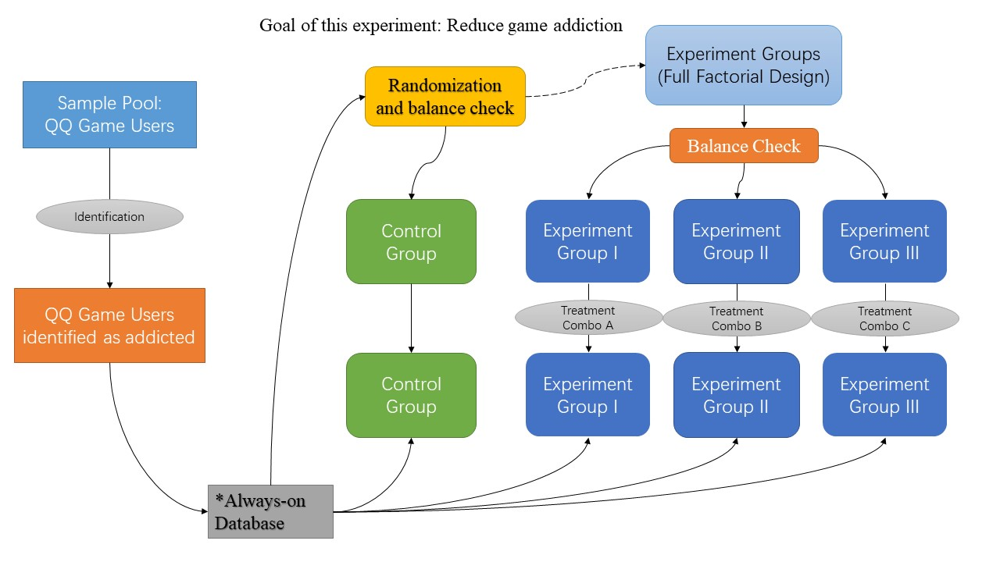

### Foreword
Thanks for Ryan’s comment on my second assignment. I notice that some terms used in my paper are very field-specific, and I will add an appendix explaining these terms following this submission.

# Proposing an Experiment
```
Title: Online Game Addiction Reduction from an IBM perspective
Author: Jiang Wang
Class: MACS 30000
Instructor: Benjamin Soltoff
```


## Introduction
The game industry is developing fast. From game consoles to smartphones, we can find enjoyable video games almost everywhere. With more enjoyable games, however, people become more addicted. Medias in China and South Korea report that at least 6% of college students are addicted to video games. In China, a significant number of college students spend their nights playing games, distance themselves from their parents and friends, and do poorly at school. The public health institute of China also reports poor health status among addicted students, and obesity has become a major public health concern in China other than smoking. Recently, the central government has been designing a new bill to prevent online game addition. Last month, one of the central spokesperson said that there would be a stricter ID screening process to online game players.

In this study, I am going to develop online interventions that prevents addiction. The paradigm used in this paper is Glanz’s (2013) Integrated Behavior Model (IBM). Due to the length of this paper, only three important IBM concepts are introduced: descriptive norms, injunctive norms, and attention. Descriptive norms refer to how other people behave, and people tend to follow descriptive norms. For example, if no other student play games in a student’s class, then it is less likely for that student to play games himself. Injunctive norms refer to the expectations of other people. A similar example would be a student is less likely to play games if his parents do not allow him to play games. Finally, attention refers to how people themselves think about a behavior. For example, if a person thinks playing games is harmful, then he is less likely to play games. A further description of that would be included in appendix.

## Research Question
This study aims at using IBM to develop interventions that reduces game addiction. Three concepts refer to three interventions.

Hypothesis 1: The introduction of unambiguous references (descriptive norms) will reduce addiction.

Hypothesis 2: The introduction of emoticons (injunctive norms) will reduce addiction.

Hypothesis 3: The delivery of game playing advice will reduce addiction.

Addiction is defined as playing games for more than 2 hours per day in the past 30 games (monitored electronically). For more information of the interventions, please refer to Treatment delivery part in experiment design.

## Experiment Design
All the processes of the experiment are shown in graph 1. Easily observed, this experiment is digital-based.

**<a name = "fig1"></a>Figure 1. Design of the Experiment**

#### 1. Recruiting Participants
In this study, I collaborate with Tencent’s game department to process the whole experiment. Participants will be recruited from Tencent’s database. Each player of Tencent is required to register a QQ account before they can access any game managed by Tencent, and participants are selected based on the information of the QQ accounts. QQ users who have played games for more than 2 hours per day for the past 30 days are identified as addicted and included in this study. There will be an informed consent process before each participant is enrolled in this experiment, and people who opt-out will neither be included in the control or the experiment groups.

#### 2. Randomization
After recruiting enough participants, I randomly assign the participants into the treatment group and the experiment group. Randomization ensures all the (hidden) covariates are distributed equally into two groups. A balance check is applied in this process to check if the available covariates are equal in the two groups. Further, as there are three treatments, this study enforces a full factorial design, which means there are eight experimental groups. Participants in the experimental group is randomly assigned into different subgroups and a balance check is also conducted in this process.

#### 3. Treatment Delivery
There are three treatments in this study. First are the unambiguous references (descriptive norms). Participants who receive this treatment will get small pop-up windows every half an hour after the participants have played for a game for continuous 24 hours. The pop-up window will show the average time played of all the players of a single day (dynamic) and therefore gives unambiguous references for the participants in the experiment group. 

Second are the emoticons (injunctive norms). In this case players also receive pop-up windows, however, emoticons rather than numbers are shown in these windows. If players play for less than 3 hours per day, they will receive a yellow smile face suggesting them to have a rest. If players play for over 5 hours per day, they will receive a read angry face requesting them to take a rest.

Finally, participants who are assigned game advice will receive some the harmfulness of being addicted to online games and some tips to get rid of addiction. Doing so will increase the participants’ attention to the potential harms of addiction.

To avoid researcher’s bias, an automated algorithm is developed to assign each participant randomly to either control or experiment groups without the interruption of researchers.

#### 4. Outcome Measurement
The outcome, addiction, is measured by the number of hours playing games in the past 30 days. Tencent’s database is used to measure addiction, and since it is always-on, it enables me to conduct the posttest whenever I want, short-term, mid-term, or long-term. Another advantage of measuring outcomes of this study is that it does not influence the behaviors of participants. Therefore, I do not need to worry about the potential effects of posttests on participants. 
### Justification
Firstly,  many stakeholders are asking for new treatments to preventing game addiction in mainland China. Parents are worried that addiction will lead to bad academic prospects for their children. Employers may worry that their employees may spend too much time playing games to complete their work on time. The Chinese government is currently taking action to enforce antiaddiction laws (e.g. Screening). Moreover, game publishers, such as Tencent and NetEase, are also thinking of implementing a monitor system that prevents addiction without losing their players. Tencent receives criticisms from a lot of parents because many of their players are students, and is now thinking a new strategy to prevent some of their players from overplaying their games.

The reason for using Tencent’s database is that Tencent owns more than 60% of the market share of games in China. By collaborating with Tencent, I can access at least 60% of the game players in China. In fact, it is commonsense that almost every game player has a QQ account in China, and the number (60%) is clearly underestimated.

This research is advantageous in terms of cost. Collaborating with Tencent, this study uses existent system with strong engineering support. As established previously, this experiment has little recruitment and variable cost. Only a fixed cost is needed, which is used to develop the in-game extensions and algorithms for this experiment. Additionally, this research will face with little ethical issues because Tencent has the authority to use all of user data for its own purpose. There will be no harm to participants as long as the data are shared within the organization.

## Assessment

#### 1. Statistical Conclusion Validity and Construct Validity
A key statistical conclusion validity problem of this research is that it requires multiple comparison of multiple groups. Therefore, traditional statistical methods cannot satisfy the problem because it is likely to increase the alpha level. For example, 8 independent decisions with a 0.05 level alpha will yield a combined alpha of 0.336 (1-0.95^8). For construct validity, this research uses a similar approach to Schultz (2007), and constructs should be similar to those of that paper. Additional tests on construct validity are based on a case-by-case basis. For example, Cronbach’s alpha is applied if survey is needed in this study.

#### 2. Internal Validity and Heterogeneity of Treatment Effects
Internal validity is treated seriously in this study. Randomization is used to increase internal validity. It ensures that all covariates, either hidden or observable, are equally distributed in control and experiment groups. Further, there is a two-step balance check in this study, either between the control and experiment groups and between the experiment groups with different treatments. Balance check ensures that the treatment is orthogonal to all the covariates in the pretreatment stage.
 
Manipulation check is also applied to ensure that different people in the experiment (control) groups receive the same treatment. Manipulation check also makes sure that non-compliance and interference does not occur. The Manipulation check is given in a new window when each participant tries to shut down the pop-up window. The new window will replicate the information in the previous window in a concise manner and therefore makes sure that each participant understands the information in the pop-up window. 

Attrition is also a potential problem in this study. Even though this experiment does not offer an opt-out option, someone may opt-out the experiment by not logging onto QQ and playing games. To ensure that attrition does not threat internal validity, a statistical test is applied whenever a participant opt-out of the experiment. When the outcome (addiction reduction) is independent of whether a participant is opt-out or not, then attrition does not affect our research outcomes. If not, then advanced statistical methods are needed to balance the effect of attrition. Finally, there may be several unobservable covariates that may affect our outcomes. In that case, randomization is very important to ensure an unbiased estimate.

Heterogeneity of treatment effects is the key of this research, and I think Schultz et al. (2007) provides a good example of how to visualize the treatment effects. The goal of this study is to prevent addiction to online games of most of the players, especially students. Therefore, it is important to see the average treated effect on the young group (aged below 22). 

#### 3. Mechanisms and External Validity
This research studies good online interventions to addiction, from a IBM perspective. From that, mechanism is not the goal of this research. Even though this study implements a full factorial design, mechanism cannot be fully explained because of lack of key variables (e.g. social network, living environment). Nevertheless, it is possible to append these missing variables. For example, the screening process link players account to their ID numbers, and it is possible to get some variables based on their ID number from the government. The collaboration between the government, game companies, and communities may yield fruitful studies in the future.

In terms of validity, the setting of interest is the same as the setting of our experiment. Therefore, it is fair to argue that this experiment has strong external validity. A potential threat to external validity is the drifting nature of the game industry. In a specific period, a specific type of game may be more popular than others, and people tend to become addicted to games for different reasons. For example, ten years ago, when MMORPG is very popular, a main reason for people to stay online is to farm golds and rare items, therefore decreasing item drop rate is very effective approach to prevent addition. However, nowadays the most popular games are MOBA other than MMORPG. Players stay online more to experience the excitement of defeating others rather than farming golds and items. In this case, previous effective approaches become ineffective. Hence, some interventions may be outdated as the game industry evolves, and the interventions of this study needs to be insensitive to drifts to be generalizable to games 10 years after.

## Appendix
**QQ**: It is a Chinese version of what’up. Before Wechat becomes popular, people usually connects with each other by QQ. Besides that, an QQ account is needed to access all the games offered by Tencent. The tradition stems from the establishment of Tencent Games and has been effective since them.

**pop-up windows**: Usually online game developers avoid pop-up windows because they are likely to affect game experience. However, it is quite popular in China because the government requires all the developers to implement overplaying notifications for unregistered players and players aged below 18.

**Balance Check**: A balance check makes sure that all groups are balanced on observable covariates, rather than all covariates. Despite some controversies of this method, I believe balance check, combined with the large sample size, will yields a good randomization of the sample.

**Integrated Behavior Model**: This is a popular public health model. For more information, please refer to http://www.med.upenn.edu/hbhe4/part2-ch4-integrated-behavior-model.shtml. Note that I only implement part of this model, due to the length of this paper.

**ID Screening**: A player needs to submit a legal ID number before registering a game account (e.g. QQ account). However, note that it is possible for people to use other people’s ID number to register a game account, which is the reason I do not use this information.

**MMORPG**: Massively multiplayer online role-playing games. The goal of this type of game is to see a player get stronger by defeating monsters, getting experience (leveling up), and farming in-game currency and items.

**MOBA**: Multiplayer Online Battle Arena. The goal of this type of game is to defeat other players.

