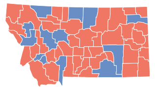

## Part I: The Four Principles
#### Respect for Persons
By respect for persons, Salganik really means respect people’s autonomy and obtain informed consent before conducting the research. Based on this idea, the main problem of this research is its implicit (inclusion) design. Voters in Montana received the treatment the time they got the flyer, and it was impossible for them to opt-out if they did not like the research. Even though researchers attached a link that provided more research information, the feeling of being “lab rats” upset a lot of Montanans. The lack of informed consent is plausible, since it is impossible to reach every voter in Montana, but I think the researchers could go further by consulting local officials to check if this design was acceptable. 
The researchers also failed to respect the candidates when they assume some candidates were surely to lose the election before conduction their research. Further, even though they used baseline statistics as a justification, as Prof. Johnson pointed out, their statistics all relied on “guesswork” and their assumption was not bolstered by strong facts. 
#### Beneficence
Beneficence means maximizing possible benefits and minizine possible harms (or no harm when possible). I do not think this research follows the principle of beneficence. This research is great in that it offers great benefits to the society as well as voters. Provided with more (and accurate) information, voters can make better decisions, and if everybody makes the best decision, combined with increased turnout rate, it is more likely people will choose a better government official that acts in the best interests of its people. However, the researchers neglected the effects of their treatments on the broader community. Considering that the researchers sampled 15% of eligible voters in Montana, the treatment was very likely to have an impact on the election. If the research did change the result of the election, the lives of a lot of people, the voters, the people, especially the candidates, would change. In fact, one of the two contests, Wheat vs VanDyke, was hotly contested before the election day (in part because some outstate Republicans spent millions on his campaign). This contest was very different from the one in June, and the treatments were very likely to change the election result. A final comment on beneficence is that, as Salganik has pointed out, the researchers should invite people outside the academia to view the research design before it is conducted. I would not be too bold to argue that researchers are always confining themselves to their ivory tower, but people who have little knowledge about the research will sometimes provide valuable advice to protect the research from potential ethical issues.
#### Justice
By justice, Salganik means whether benefits and harms are distributed evenly across different subgroups. Based on the information I know, the researchers paid little attention to justice. Despite the huge societal and individual benefits, the researchers did not have clear plans how to benefit Montanans with their research. Further, I think the researchers should foresee a potential controversy and disruption when they were planning to sample 15% of eligible voters, but they seemed to have neglected it. Based on the reports after the event, the researchers clearly did not prepare a compensation plan and remained silent when disruption occurred.
#### Respect for Law and Public Interest
Finally, it comes ‘respect for laws and public’, and the researchers did not follow this principle very well. It was clear that the researchers did not consult with attorneys specializing in Montanan state laws before they send the flyers. They largely ignore the election laws in Montana, which is a reason they were sued. Further, the use of the state seal is a such unwise move that Montanans would easily connect the research with fraud. Finally, I would conclude my part here with more reflection on the culture of nonpartisan election. John Patty is true by pointing out that party influences permeate nonpartisan elections. However, the spirit of nonpartisan election (stemming from “Jurisdiction Independence”) has a long tradition from the Progressive Era and is the thing Americans are proud of. When the researchers tried to compare the nonpartisan election candidate with two national partisan leaders (Obama and Romney), the election became less nonpartisan. This would certainly upset some people. Out of the 50 states, there are 15 states who use nonpartisan elections to select their judges. I believe these states do this for a reason, and I believe the people there honor this system. I am sad that the flyers disrupted these people, and I am extremely sorry for that.
## Part II: Random Sampling

**Graph1. Montana Election Map (2008)**

In fact, Montana turns out to be a very conservative state. As the graph show, most areas in Montana are conservative (red). If a random sampling is conducted, over a hundred thousand flyers are sent to a majority of conservative individuals. The research would then indeed break the law by calling more people to vote for the conservative candidate (VanDyke) against the liberal candidate (Wheat).

(Well, it seems there are two ways of random sampling, by households, or by precincts (stratified). The researchers used the latter, which is more practible. However, no matter which way, you will have more conservatives than liberals in Montana)

## Part III: Sampling Design
This is what I discussed about in part II. Tt is a comfort to see that they researchers were trying to control the impact of their treatment. I would give the researchers a thumb, but the sampling design (more leaning left than leaning right) turned out to be one of the two pieces of evidence in deciding that they broke the state election law (the other is the ideology spectrum). This warns that social scientists should be rigid when designing their research and avert potential risk when necessary. Even though the researchers make good justification for their research design, their justification are held without strong proof. I believe the researchers could do this more wisely by changing their research design, such as controlling their sample size, or include more neutral (neither liberal or conservative) voters in their sample. In conclusion, I am a little happy with the design because it proves that the researchers really mean no harm, but I am also regretted that their estimation, such as the turnout rate is low in people leaning left, comes with no strong fact. 
## Part IV: Baseline Estimation
 No, it cannot. I believe the charm of the US political system comes from its unpredictability. The US political system from time to time yields surprise election results, and no people are sure to win. A year ago, many people believed Clinton would have a sure win, but it turned out to be an unexpected defeat. Whoever think that the state of Pennsylvania would become red after continued to give their votes to the Democratic president candidates for 28 years. This is the US political system, and Americans are proud of this. Making a research assumption that a candidate is surely to win is no better than trying to win a lottery. Further, as I have pointed out in part I, this assumption is also a disrespect to the other candidate. I believe every candidate, if they try hard and connect actively with their people, will win the election. In the election system, nobody is sure to win.
## Part V: *Ex ante* and *ex post*
This is a question of *ex ante* and *ex post*. I agree with John Patty in that researches should be judged *ex ante* rather than *ex post*. In all, field experiments are designed to make some interventions in the real world. It is unable to measure something without making changes, and great discoveries sometimes come with a cost. What researchers should do, is to make sure their interventions are controllable so that the observable changes won’t interrupt people’s daily lives. This is the *ex ante* perspective. The fact is that, the researchers did not foresee the potential interruption to their participants and the whole environment, so whatever the election result is, the researchers fell short of their ethical duty.
## Part VI: CrowdPAC, the Ethical Dilemma
This is an ethical dilemma, and the issue can only be decided on the case by case basis. Now let’s get some facts about this research. Bonica is an assistant professor in Stanford. He and his colleges received $250,000 from Hewlett for their research, and Stanford matched $100,000. Bonica is also a cofounder of the CrowdPAC (a startup), and the result of this research is very likely to be used in improving the services of the startup. Stanford called this “pipelining”, and they are strongly against it:

*“Pipelining. Many times, the faculty member wishes to continue to do research at Stanford in the area of interest to their Start-up. Stanford is particularly concerned that University resources will be used to benefit the company, particularly new companies that do not have their own facilities or many employees (i.e., the “virtual” company.) Stanford should not be the research or development arm of a Start-up…….”* (From Stanford: Best practices for faculty start-ups)

Stanford further design rules to prevent pipelining when faculty members are in the conflicts of interests. Based on their website, all of research data and results shall be owned by Stanford expect transfer agreements are signed. I believe Stanford has made a clear rule when their faculty members are in conflicts of interests, and Professor Bonica would certainly raise eyebrows when he tries to benefit CrowdPAC by his research (many people also think it is the reason why the research has not been submitted to Stanford IRB).

But in fact there is something more complicated. This research as well as CrowdPAC are both based on Bonica’s database called DIME (Database on Ideology, Money in Politics, and Elections), developed by Bonica when he was a graduate student in NYU. The problem is, can CrowdPAC use DIME and the algorithms developed by Bonica? Does Bonica has the ownership of DIME so that he can use that in his startup? I am not a lawyer, so I am not sure about this issue. However, one comment I can make is that there are surely some ethical problems if Bonica wants to use this research to benefit CrowdPAC. The tricky part is that how do you know Bonica applies the research he conducts in Stanford to make money? There are no patents in political science and it is very difficult to know Bonica has ever benefited CrowdPAC by his research. DIME was created before Bonica joined Stanford, so I guess it is fair for Bonica to use the database to make money.

## Part VII: Some improvements of the research
Clearly one way to get rid of ethical issues is to conduct a partisan research, or political advocacy. For example, Bonica can receive funding from the Republicans and send mailers to people to vote for a candidate (e.g. VanDyke). However, this may make some ethical issues that people do not like partisan influences in a nonpartisan race, so the researchers cannot do it aboveboard (and therefore unable to publish a paper). Another improvement following this is that Bonica can actually send an equal number of flyers to liberal-centric and conservative-centric voters. Or he can include more centric voters to avoid controversy. However, I believe Bonica may be interested in heterogeneous effects, so this may not be a good idea. Finally, following this will be a controlled sample size so that the people in the treatment group will not be around 15% of the eligible voters. Unfortunately, I believe the researchers must have done this for a reason, for example, they are interested in the heterogeneous effects of some subgroups, or the effects divided by locality, or some contagious effects, in that if people who did not receive the treatments but live in areas next the treatment areas would have some change of their behavior. So even though this seems to be a large sample, but it may be a good sample size after power analysis.

This comes my suggestion, that considering that there are 15 states in the US that run nonpartisan elections, the research can select a small portion of the voters from each of the 15 states so that they can control the impact. I believe the researchers have drawn sample from not only Montana, but also California and New Hampshire. The total sample size is likely to be over 200,000, which amounts to 13,333 sample in each of the state. So instead of sampling 15% of the eligible voters in Montana, I advise sample 10,000 to 20,000 voters in each of the 15 states that run nonpartisan elections. Considering that there may be more variability, the sample size may need to be over 20,000 per state. Moreover, I think it is good to draw more sample from big states such as California and draw small samples from small states. It is also advised that the researchers collect historic data so that they can have more comparison (which seems the researchers have done some part of it).
 
Finally, there are something I would like to make comments. The use of the Great Seal of Montana is very unwise. I believe the researchers have meant no harm, but it is just not advisable. The researchers can, at least get some form of consent before conducting their research (e.g. discussion with local leaders). Moreover, it is quite intriguing why the researchers did not submit their proposals to Stanford IRB. However, I would think IRB review, which is mainly based on biomedical principles, are not applicable to social science research. Before conducting a field experiments, the researchers need to invite the stakeholders to study the research design, offer compensation, and reach agreement.

Overall, I have made one major design and some small fixes in Bonica et. al.’s research. It has been a little wordy, but I hope you understand this is because these young, ambitious political scientists have pondered over a lot of circumstances, created a well-defined research, and any changes would compromise costs. 

Please do not criticize them because I believe it is only by these ambitious social scientists who are not afraid of mistakes can our lives get better. People learn from their mistakes, and I believe Montana Election Experiment poses new challenges for social scientists so that they can design better researches.

## Notes
John Patty's Blog: 

**http://www.mathofpolitics.com/2014/10/27/well-in-a-worst-case-scenario-your-treatment-works/**

Best practices for faculty start-ups (Stanford):

**https://otl.stanford.edu/documents/bp_faculty_sus.pdf**
