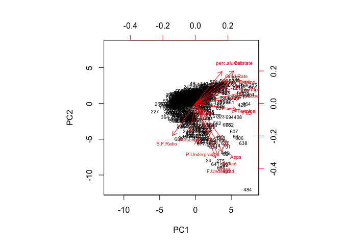
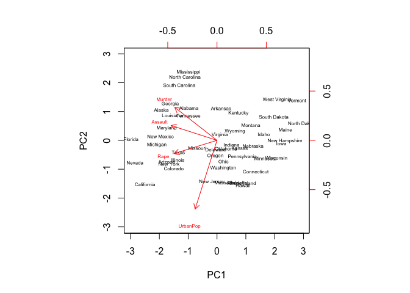
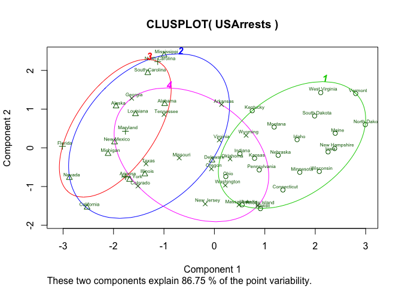
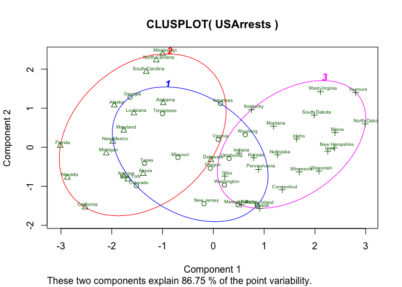
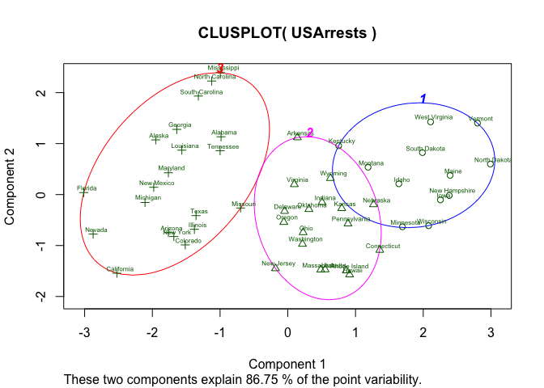
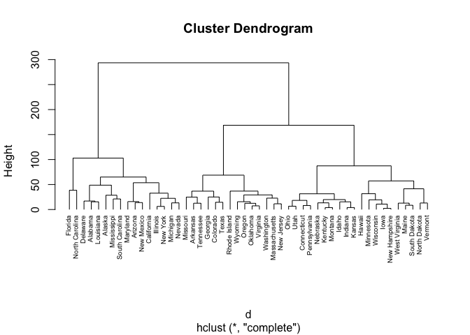
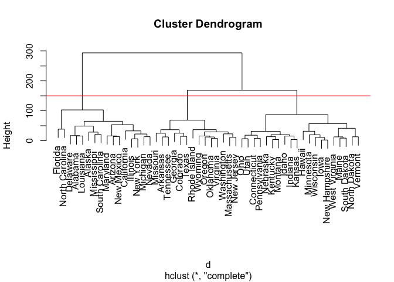
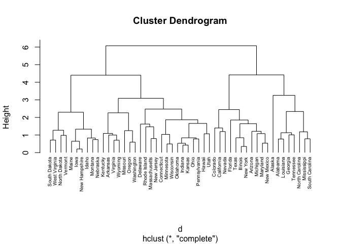

Unsupervised-learning
================
Lerong Wang
12/3/2017

Colleges
--------

### 1. Perform PCA analysis on the college dataset and plot the first two principal components.

``` r
library(tidyverse)
```

    ## ── Attaching packages ────────────────────────────────── tidyverse 1.2.1 ──

    ## ✔ ggplot2 2.2.1     ✔ purrr   0.2.4
    ## ✔ tibble  1.3.4     ✔ dplyr   0.7.4
    ## ✔ tidyr   0.7.2     ✔ stringr 1.2.0
    ## ✔ readr   1.1.1     ✔ forcats 0.2.0

    ## Warning: package 'ggplot2' was built under R version 3.3.2

    ## Warning: package 'tibble' was built under R version 3.3.2

    ## Warning: package 'tidyr' was built under R version 3.3.2

    ## Warning: package 'readr' was built under R version 3.3.2

    ## Warning: package 'purrr' was built under R version 3.3.2

    ## Warning: package 'dplyr' was built under R version 3.3.2

    ## Warning: package 'stringr' was built under R version 3.3.2

    ## Warning: package 'forcats' was built under R version 3.3.2

    ## ── Conflicts ───────────────────────────────────── tidyverse_conflicts() ──
    ## ✖ dplyr::filter() masks stats::filter()
    ## ✖ dplyr::lag()    masks stats::lag()

``` r
library(cluster) 
```

``` r
college <- read_csv("College.csv")
```

    ## Parsed with column specification:
    ## cols(
    ##   Apps = col_double(),
    ##   Accept = col_integer(),
    ##   Enroll = col_double(),
    ##   Top10perc = col_integer(),
    ##   Top25perc = col_integer(),
    ##   F.Undergrad = col_double(),
    ##   P.Undergrad = col_integer(),
    ##   Outstate = col_double(),
    ##   Room.Board = col_double(),
    ##   Books = col_double(),
    ##   Personal = col_double(),
    ##   PhD = col_integer(),
    ##   Terminal = col_integer(),
    ##   S.F.Ratio = col_double(),
    ##   perc.alumni = col_integer(),
    ##   Expend = col_integer(),
    ##   Grad.Rate = col_integer()
    ## )

``` r
pr.out <- prcomp(college, scale = TRUE)
biplot(pr.out, scale = 0, cex = .6)
```



``` r
pr.out
```

    ## Standard deviations:
    ##  [1] 2.3331324 2.1160899 1.0831232 1.0034481 0.9659342 0.9205429 0.7778227
    ##  [8] 0.7662347 0.7279627 0.6354389 0.5595020 0.4693901 0.4093632 0.3792007
    ## [15] 0.2964985 0.1915155 0.1516517
    ## 
    ## Rotation:
    ##                     PC1         PC2         PC3         PC4         PC5
    ## Apps         0.24876560 -0.33159823  0.06309210 -0.28131053 -0.00574141
    ## Accept       0.20760150 -0.37211675  0.10124906 -0.26781735 -0.05578609
    ## Enroll       0.17630359 -0.40372425  0.08298557 -0.16182677  0.05569364
    ## Top10perc    0.35427395  0.08241182 -0.03505553  0.05154725  0.39543434
    ## Top25perc    0.34400128  0.04477866  0.02414794  0.10976654  0.42653359
    ## F.Undergrad  0.15464096 -0.41767377  0.06139298 -0.10041234  0.04345437
    ## P.Undergrad  0.02644250 -0.31508783 -0.13968172  0.15855849 -0.30238541
    ## Outstate     0.29473642  0.24964352 -0.04659887 -0.13129136 -0.22253200
    ## Room.Board   0.24903045  0.13780888 -0.14896739 -0.18499599 -0.56091947
    ## Books        0.06475752 -0.05634184 -0.67741165 -0.08708922  0.12728883
    ## Personal    -0.04252854 -0.21992922 -0.49972112  0.23071057  0.22231102
    ## PhD          0.31831287 -0.05831132  0.12702837  0.53472483 -0.14016633
    ## Terminal     0.31705602 -0.04642945  0.06603755  0.51944302 -0.20471973
    ## S.F.Ratio   -0.17695789 -0.24666528  0.28984840  0.16118949  0.07938825
    ## perc.alumni  0.20508237  0.24659527  0.14698927 -0.01731422  0.21629741
    ## Expend       0.31890875  0.13168986 -0.22674398 -0.07927349 -0.07595812
    ## Grad.Rate    0.25231565  0.16924053  0.20806465 -0.26912907  0.10926791
    ##                      PC6          PC7          PC8          PC9
    ## Apps        -0.016237442 -0.042486349  0.103090398 -0.090227080
    ## Accept       0.007534685 -0.012949720  0.056270962 -0.177864814
    ## Enroll      -0.042557980 -0.027692894 -0.058662355 -0.128560713
    ## Top10perc   -0.052692798 -0.161332069  0.122678028  0.341099863
    ## Top25perc    0.033091590 -0.118485556  0.102491967  0.403711989
    ## F.Undergrad -0.043454235 -0.025076363 -0.078889644 -0.059441918
    ## P.Undergrad -0.191198583  0.061042346 -0.570783816  0.560672902
    ## Outstate    -0.030000391  0.108528966 -0.009845998 -0.004573329
    ## Room.Board   0.162755446  0.209744235  0.221453442  0.275022548
    ## Books        0.641054950 -0.149692034 -0.213293009 -0.133663353
    ## Personal    -0.331398003  0.633790064  0.232660840 -0.094468890
    ## PhD          0.091255521 -0.001096413  0.077040000 -0.185181525
    ## Terminal     0.154927646 -0.028477011  0.012161330 -0.254938198
    ## S.F.Ratio    0.487045875  0.219259358  0.083604874  0.274544380
    ## perc.alumni -0.047340014  0.243321156 -0.678523654 -0.255334907
    ## Expend      -0.298118619 -0.226584481  0.054159377 -0.049138881
    ## Grad.Rate    0.216163313  0.559943937  0.005335539  0.041904305
    ##                    PC10         PC11        PC12         PC13        PC14
    ## Apps        -0.05250980  0.043046207 -0.02407091  0.595830975  0.08063280
    ## Accept      -0.04114008 -0.058405585  0.14510245  0.292642398  0.03346743
    ## Enroll      -0.03448791 -0.069398883 -0.01114315 -0.444638207 -0.08569672
    ## Top10perc   -0.06402578 -0.008104814 -0.03855430  0.001023036 -0.10782819
    ## Top25perc   -0.01454923 -0.273128469  0.08935156  0.021883880  0.15174211
    ## F.Undergrad -0.02084718 -0.081157818 -0.05617677 -0.523622267 -0.05637288
    ## P.Undergrad  0.22310581  0.100693324  0.06353607  0.125997650  0.01928575
    ## Outstate    -0.18667536  0.143220673  0.82344378 -0.141856014 -0.03401154
    ## Room.Board  -0.29832424 -0.359321731 -0.35455973 -0.069748585 -0.05842898
    ## Books        0.08202922  0.031940037  0.02815937  0.011437996 -0.06684946
    ## Personal    -0.13602762 -0.018578473  0.03926403  0.039454742  0.02752862
    ## PhD          0.12345220  0.040372325 -0.02322243  0.127696382 -0.69112615
    ## Terminal     0.08857846 -0.058973403 -0.01648504 -0.058313466  0.67100861
    ## S.F.Ratio   -0.47204525  0.445000727  0.01102621 -0.017715270  0.04137410
    ## perc.alumni -0.42299971 -0.130727978 -0.18266065  0.104088088 -0.02715421
    ## Expend      -0.13228633  0.692088870 -0.32598230 -0.093746450  0.07312252
    ## Grad.Rate    0.59027107  0.219839000 -0.12210670 -0.069196978  0.03647674
    ##                     PC15         PC16         PC17
    ## Apps        -0.133405806 -0.459139498 -0.358970400
    ## Accept       0.145497511  0.518568789  0.543427250
    ## Enroll      -0.029589609  0.404318439 -0.609651110
    ## Top10perc   -0.697722522  0.148738723  0.144986329
    ## Top25perc    0.617274818 -0.051868340 -0.080347844
    ## F.Undergrad -0.009916410 -0.560363054  0.414705279
    ## P.Undergrad -0.020951598  0.052731304 -0.009017890
    ## Outstate    -0.038354479 -0.101594830 -0.050899592
    ## Room.Board  -0.003401971  0.025929338 -0.001146396
    ## Books        0.009438879 -0.002882829 -0.000772632
    ## Personal     0.003090014  0.012890402  0.001114334
    ## PhD          0.112055599 -0.029807547 -0.013813337
    ## Terminal    -0.158909651  0.027075981 -0.006209327
    ## S.F.Ratio    0.020899128  0.021247629  0.002222152
    ## perc.alumni  0.008417894 -0.003334062  0.019186974
    ## Expend       0.227742017  0.043880323  0.035309822
    ## Grad.Rate    0.003394336  0.005008447  0.013071002

Top10perc, Top23perc, PhD, Terminal, and expend appear strongly correlated on the first principal component. Apps, Accept, F.Undergrad, and P.Undergrad appear strongly correlated on the second principal component.

### 2. Calculate the cumulative proportion of variance explained by all the principal components.

``` r
summary(pr.out)
```

    ## Importance of components:
    ##                           PC1    PC2     PC3     PC4     PC5     PC6
    ## Standard deviation     2.3331 2.1161 1.08312 1.00345 0.96593 0.92054
    ## Proportion of Variance 0.3202 0.2634 0.06901 0.05923 0.05488 0.04985
    ## Cumulative Proportion  0.3202 0.5836 0.65262 0.71185 0.76673 0.81658
    ##                            PC7     PC8     PC9    PC10    PC11    PC12
    ## Standard deviation     0.77782 0.76623 0.72796 0.63544 0.55950 0.46939
    ## Proportion of Variance 0.03559 0.03454 0.03117 0.02375 0.01841 0.01296
    ## Cumulative Proportion  0.85217 0.88670 0.91788 0.94163 0.96004 0.97300
    ##                           PC13    PC14    PC15    PC16    PC17
    ## Standard deviation     0.40936 0.37920 0.29650 0.19152 0.15165
    ## Proportion of Variance 0.00986 0.00846 0.00517 0.00216 0.00135
    ## Cumulative Proportion  0.98286 0.99132 0.99649 0.99865 1.00000

Approximately 58.36% of the variance is explained by the first two principal components.

Clustering states
-----------------

### 1. Perform PCA on the dataset and plot the observations on the first and second principal components.

``` r
usarrests <- read_csv("USArrests.csv") 
```

    ## Parsed with column specification:
    ## cols(
    ##   State = col_character(),
    ##   Murder = col_double(),
    ##   Assault = col_integer(),
    ##   UrbanPop = col_integer(),
    ##   Rape = col_double()
    ## )

``` r
pcarrests<-prcomp(USArrests,scale=TRUE)
biplot(pcarrests,scale = 0, cex= .5)
```



### 2. k-means clustering with k=2

``` r
fit <- kmeans(USArrests, 2)
clusplot(USArrests, fit$cluster, color=TRUE, labels=2, lines=0, cex.txt = 0.5)
```


By setting k=2, we get 2 clusters that are splited around 0 of principal component 1. The two clusters appear to have a roughly distinct boundary.

### 3. k-means clustering with k=4

``` r
fit <- kmeans(USArrests, 4)
clusplot(USArrests, fit$cluster, color=TRUE, labels=2, lines=0, cex.txt = 0.5)
```



Cluster boundaries also appear along principal component 1. However, cluster boundaries are not as distinct as the boundary we obtained in question 2.

### 4. k-means clustering with k=3

``` r
fit <- kmeans(USArrests, 3)
clusplot(USArrests, fit$cluster, color=TRUE, labels=2, lines=0, cex.txt = 0.5)
```



Cluster boundaries also appear along principal component 1. The cluster boundaries of k-means clustering with k=3 seems to be an intermediate stage between k=2 and k=4.

### 5. k-means clustering with k=3 on first two principal components score vectors

``` r
fit <- kmeans(pcarrests$x[,1:2], 3)
clusplot(USArrests, fit$cluster, color=TRUE, labels=2, lines=0, cex.txt = 0.5)
```



The members of each cluster become slightly different than those in last question, but most states in each cluster still remain. The cluster boundaries become more distinct.

### 6. Using hierarchical clustering with complete linkage and Euclidean distance, cluster the states.

``` r
df <- USArrests
df <- na.omit(df)
d <- dist(df, method = "euclidean")
hc1 <- hclust(d, method = "complete" )
plot(hc1, cex = 0.6, hang = -1)
```



### 7.Cut the dendrogram at a height that results in three distinct clusters. Which states belong to which clusters?

``` r
plot(hc1)
abline(h=150, col = 'red')
```



``` r
cutree(hc1,3)
```

    ##        Alabama         Alaska        Arizona       Arkansas     California 
    ##              1              1              1              2              1 
    ##       Colorado    Connecticut       Delaware        Florida        Georgia 
    ##              2              3              1              1              2 
    ##         Hawaii          Idaho       Illinois        Indiana           Iowa 
    ##              3              3              1              3              3 
    ##         Kansas       Kentucky      Louisiana          Maine       Maryland 
    ##              3              3              1              3              1 
    ##  Massachusetts       Michigan      Minnesota    Mississippi       Missouri 
    ##              2              1              3              1              2 
    ##        Montana       Nebraska         Nevada  New Hampshire     New Jersey 
    ##              3              3              1              3              2 
    ##     New Mexico       New York North Carolina   North Dakota           Ohio 
    ##              1              1              1              3              3 
    ##       Oklahoma         Oregon   Pennsylvania   Rhode Island South Carolina 
    ##              2              2              3              2              1 
    ##   South Dakota      Tennessee          Texas           Utah        Vermont 
    ##              3              2              2              3              3 
    ##       Virginia     Washington  West Virginia      Wisconsin        Wyoming 
    ##              2              2              3              3              2

``` r
table(cutree(hc1,3))
```

    ## 
    ##  1  2  3 
    ## 16 14 20

### 8

``` r
df <- USArrests %>%
  scale()
df <- na.omit(df)
d <- dist(df, method = "euclidean")
hc1 <- hclust(d, method = "complete" )
plot(hc1, cex = 0.6, hang = -1)
```



``` r
cutree(hc1, 4)
```

    ##        Alabama         Alaska        Arizona       Arkansas     California 
    ##              1              1              2              3              2 
    ##       Colorado    Connecticut       Delaware        Florida        Georgia 
    ##              2              3              3              2              1 
    ##         Hawaii          Idaho       Illinois        Indiana           Iowa 
    ##              3              4              2              3              4 
    ##         Kansas       Kentucky      Louisiana          Maine       Maryland 
    ##              3              3              1              4              2 
    ##  Massachusetts       Michigan      Minnesota    Mississippi       Missouri 
    ##              3              2              3              1              3 
    ##        Montana       Nebraska         Nevada  New Hampshire     New Jersey 
    ##              4              4              2              4              3 
    ##     New Mexico       New York North Carolina   North Dakota           Ohio 
    ##              2              2              1              4              3 
    ##       Oklahoma         Oregon   Pennsylvania   Rhode Island South Carolina 
    ##              3              3              3              3              1 
    ##   South Dakota      Tennessee          Texas           Utah        Vermont 
    ##              4              1              2              3              4 
    ##       Virginia     Washington  West Virginia      Wisconsin        Wyoming 
    ##              3              3              4              3              3

``` r
table(cutree(hc1,4))
```

    ## 
    ##  1  2  3  4 
    ##  8 11 21 10

``` r
cutree(hc1, 3)
```

    ##        Alabama         Alaska        Arizona       Arkansas     California 
    ##              1              1              2              3              2 
    ##       Colorado    Connecticut       Delaware        Florida        Georgia 
    ##              2              3              3              2              1 
    ##         Hawaii          Idaho       Illinois        Indiana           Iowa 
    ##              3              3              2              3              3 
    ##         Kansas       Kentucky      Louisiana          Maine       Maryland 
    ##              3              3              1              3              2 
    ##  Massachusetts       Michigan      Minnesota    Mississippi       Missouri 
    ##              3              2              3              1              3 
    ##        Montana       Nebraska         Nevada  New Hampshire     New Jersey 
    ##              3              3              2              3              3 
    ##     New Mexico       New York North Carolina   North Dakota           Ohio 
    ##              2              2              1              3              3 
    ##       Oklahoma         Oregon   Pennsylvania   Rhode Island South Carolina 
    ##              3              3              3              3              1 
    ##   South Dakota      Tennessee          Texas           Utah        Vermont 
    ##              3              1              2              3              3 
    ##       Virginia     Washington  West Virginia      Wisconsin        Wyoming 
    ##              3              3              3              3              3

``` r
table(cutree(hc1,3))
```

    ## 
    ##  1  2  3 
    ##  8 11 31

The cluster dendrogram breaks into different smaller clusters more earlier. In the above results, I first divide them into 4 clusters, which is the more obvious case. Then I divide them into 3 clusters, as what we did in question 7. The members of each cluster appear different than what we obtained in the last question.

References
----------

<https://stat.ethz.ch/R-manual/R-devel/library/cluster/html/clusplot.default.html>
