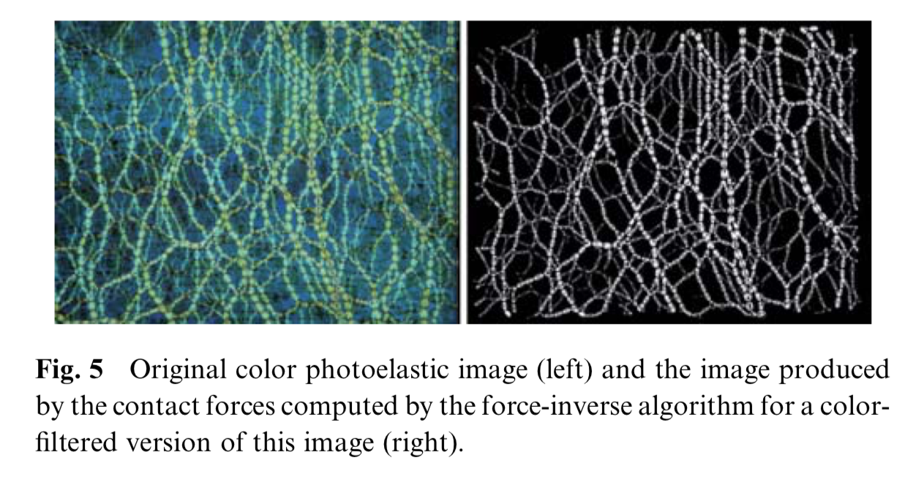
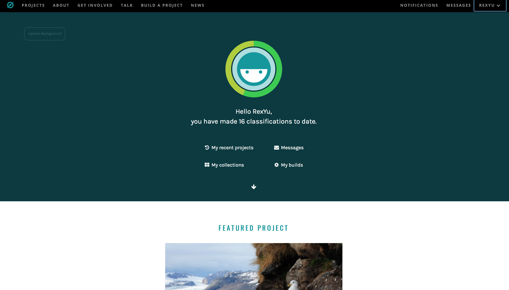
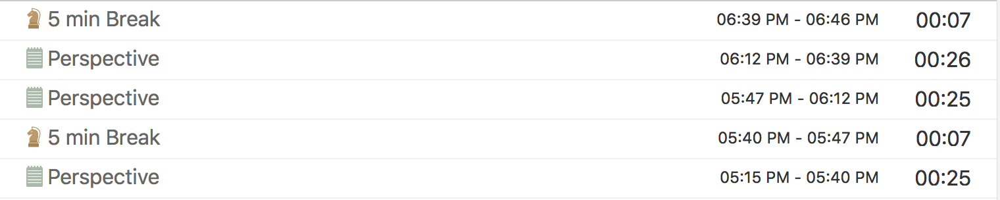

#Q1

###(1)

Account [@irexyu](https://www.kaggle.com/irexyu)

###(2)
I am interested in the open call question: Zillow Prize: Zillow’s Home Value Prediction (Zestimate). The goal of this competition is to improve the accuracy of the Zestimate, which is an online system built for estimating real estate value by Zillow. This competition is divided into two rounds. In the first round, also called qualifying round, participants are required to build a model in order to improve the Zestimate residual error. For the final stage, they are required to build a home valuation algorithm from bottom to top. 

To make a submission, participants have to use the given data as a training sample and predict a log error for each property for each time point between the Zestimate price and sale price, then submit the prediction file.

###(3)
The data set that I used here is [Kaggle ML and Data Science Survey, 2017](https://www.kaggle.com/kaggle/kaggle-survey-2017). 
Something interesting about this survey is that it shows that overall, people holding a data analysis related job position prefer using Python than R.
(Click the icon for Github view)
.pdf)
--

	require(ggthemes)
	require(data.table)
	require(dplyr, warn.conflicts = FALSE)
	require(ggplot2)
	require(tibble)
	##Read data
	data <- as_tibble(suppressWarnings(fread("/Users/Rex/Downloads/kaggle-survey-2017/multipleChoiceResponses.csv")))
	
	data %>%
	  filter(LanguageRecommendationSelect == "R" | LanguageRecommendationSelect == "Python") %>%
	  group_by(CurrentJobTitleSelect, LanguageRecommendationSelect) %>%
	  count() %>%
	  ggplot(aes(CurrentJobTitleSelect, n, color = LanguageRecommendationSelect)) +
	  ggtitle("Python vs. R used by Job Title") +
	  labs(x = "Job Title", y = "Frequency") +
	  geom_point(size = 4) +
	  theme_solarized(light = FALSE) +
	  scale_colour_solarized("red") +
	  theme(
	    axis.text.x = element_text(angle = 330, hjust = 0),
	    axis.title.x = element_text(margin = margin(t = 12))
	  )

#Q2
The [jamming process](https://en.wikipedia.org/wiki/Jamming_(physics)) has attracted many physicists' interest in recent years. Knowing the jamming property of a material enables us to gain a deeper understanding of its phase transition and, further, its physical and chemical property during a phase transition. Researchers study jamming process usually by analyzing the corresponding optical changes when giving a pressure on a set of particles with [photoelasticity](https://en.wikipedia.org/wiki/Photoelasticity). For example, [Physics of active jamming during collective cellular motion in a monolayer](http://www.pnas.org/content/112/50/15314.full.pdf) studies collective celluar motion using [PIV analysis](https://en.wikipedia.org/wiki/Particle_image_velocimetry). Widely-used softwares are [OpenPIV](http://www.openpiv.net) and [MatPIV](http://folk.uio.no/jks/matpiv/). However, when jamming study occured, there was not such softwares. Thus, these image processing tasks can be handled with human computation.

In PIV analysis, the main task is to convert original images with optical information into a force line graph for further analysis (See below).

To formulate this image processing task to a human computation one, we can create our project on [Zoouniverse](https://www.zooniverse.org) using the original images which we obtained from prior experiments and recruit volunteers who are interested in our project. Once saw our project, volunteers would go through a brief tutorial which teaches them how to identify and mark force lines. After the tutorial, the volunteer would begin real identification of force lines. 

Usually, there would be tens of thousands images produced with necessary information for a specific particle composition (for example, a set of triangular and rectangular particles witout friction). Here are the advantages for doing that. First, this big problem is divided into micro-tasks that can be solved by people withour specialized skills, which transform a nearly impossibile task to an easy one. Second, it can save a lot of money and time. Recruiting research assistants is much more costly than using micro-task platforms. Also, it is impossible to recruit 2,000 RAs to do that.

#Q3
I am not eligible to register an MTurk account so I used [Zooniverse](https://www.zooniverse.org/) instead since as Benjamin said: 
>
I am not familiar with other micro-task job market sites similar to Amazon MTurk, so I cannot assign you to work on a different site. If you are aware of one that you can legally participate on, feel free to use that site instead of MTurk - again, completing an hour's worth of micro-task assignments.

I spent one hour on participating two projects. The first one requires volunteers to identify different seabirds and label them in images. 

The other one is to identify a certain pattern (circular or elliptical sections with concentric rings) in an image and count the number of rings in that pattern. As shown below.

Finally, I finished 16 classifications. The Seabirdwatch is much more time-consuming for the reason that sometimes birds are nearly indistinguishable with their environment and there could be too many birds in one picture.

	