yu\_liqiang\_EDA\_Lab\_Notebook
================
Liqiang Yu
11/26/2017

### Load Data

    ## ── Attaching packages ─────────────────────────────────────────────────────── tidyverse 1.2.1 ──

    ## ✔ ggplot2 2.2.1     ✔ purrr   0.2.4
    ## ✔ tibble  1.3.4     ✔ dplyr   0.7.4
    ## ✔ tidyr   0.7.2     ✔ stringr 1.2.0
    ## ✔ readr   1.1.1     ✔ forcats 0.2.0

    ## ── Conflicts ────────────────────────────────────────────────────────── tidyverse_conflicts() ──
    ## ✖ dplyr::filter() masks stats::filter()
    ## ✖ dplyr::lag()    masks stats::lag()

    ## 
    ## Attaching package: 'GGally'

    ## The following object is masked from 'package:dplyr':
    ## 
    ##     nasa

### Gathering basic information about our data for later use

``` r
summary(gss) ##Result hidden
```

Variable variation exploration
==============================

### Race distribution for this survey

``` r
gss %>%

  ggplot(aes(race))+
  geom_bar()
```


### Sex distribution for this survey

``` r
gss %>%

  ggplot(aes(sex))+
  geom_bar()
```


### Age distribution for interviewee

``` r
summary(gss$age)
```

    ##    Min. 1st Qu.  Median    Mean 3rd Qu.    Max.    NA's 
    ##   18.00   33.00   47.00   48.19   61.00   89.00       5

``` r
gss %>%

  ggplot(aes(age))+
  geom_density()
```

    ## Warning: Removed 5 rows containing non-finite values (stat_density).


### Age dis among sex groups

``` r
ggplot(gss, aes(age, color = sex)) +
  geom_density()
```

    ## Warning: Removed 5 rows containing non-finite values (stat_density).


### Work status

``` r
gss %>%

  ggplot(aes(wrkstat))+
  geom_bar()
```

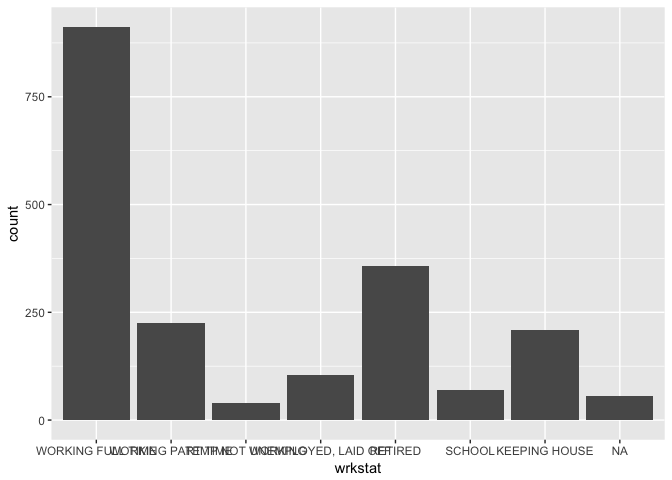

### Education status

``` r
gss %>%

  ggplot(aes(educ))+
  geom_bar()
```

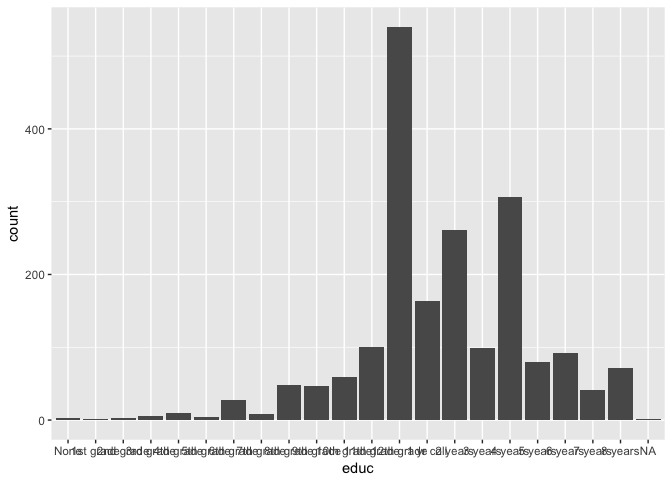

### People's opinion about gunlaw (require a person to obtain a police permit before he or she could buy a gun)?

``` r
gss %>%

  ggplot(aes(gunlaw))+
  geom_bar()
```


### How would you say things are these days, very happy, pretty happy, or not too happy?

``` r
gss %>%

  ggplot(aes(happy))+
  geom_bar()
```


### Violin plot of age

``` r
ggplot(gss, aes("", age)) +
  geom_violin() +
  labs(title = "Violin plot of age for gss data",
       x = NULL,
       y = "Age")
```

    ## Warning: Removed 5 rows containing non-finite values (stat_ydensity).

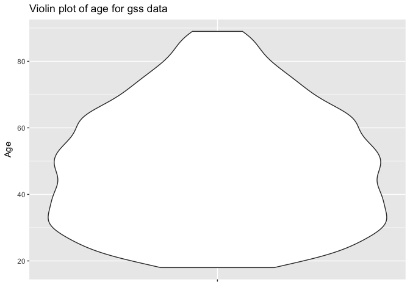

Outliers
========

### Extract variables we are interested in

``` r
gssr <- gss[, c("age", "sex", "marital", "educ", "income06", "happy")]
gssr <- within(gssr,{
    age1 <- as.numeric(age) 
    educ1 <- as.numeric(educ) 
    sex1 <- as.numeric(sex)  
    #code income into categories
    cincome <- as.numeric(income06) })
ggpairs(gssr[,c("age1", "educ1", "sex1", "cincome")],diag = list(continuous = "bar"),lower = list(continuous = "smooth"))
```

    ## Warning in check_and_set_ggpairs_defaults("diag", diag, continuous =
    ## "densityDiag", : Changing diag$continuous from 'bar' to 'barDiag'

    ## `stat_bin()` using `bins = 30`. Pick better value with `binwidth`.

    ## Warning: Removed 5 rows containing non-finite values (stat_bin).

    ## Warning in (function (data, mapping, alignPercent = 0.6, method =
    ## "pearson", : Removed 7 rows containing missing values

    ## Warning in (function (data, mapping, alignPercent = 0.6, method =
    ## "pearson", : Removed 5 rows containing missing values

    ## Warning in (function (data, mapping, alignPercent = 0.6, method =
    ## "pearson", : Removed 219 rows containing missing values

    ## Warning: Removed 7 rows containing non-finite values (stat_smooth).

    ## Warning: Removed 7 rows containing missing values (geom_point).

    ## `stat_bin()` using `bins = 30`. Pick better value with `binwidth`.

    ## Warning: Removed 2 rows containing non-finite values (stat_bin).

    ## Warning in (function (data, mapping, alignPercent = 0.6, method =
    ## "pearson", : Removed 2 rows containing missing values

    ## Warning in (function (data, mapping, alignPercent = 0.6, method =
    ## "pearson", : Removed 216 rows containing missing values

    ## Warning: Removed 5 rows containing non-finite values (stat_smooth).

    ## Warning: Removed 5 rows containing missing values (geom_point).

    ## Warning: Removed 2 rows containing non-finite values (stat_smooth).

    ## Warning: Removed 2 rows containing missing values (geom_point).

    ## `stat_bin()` using `bins = 30`. Pick better value with `binwidth`.

    ## Warning in (function (data, mapping, alignPercent = 0.6, method =
    ## "pearson", : Removed 216 rows containing missing values

    ## Warning: Removed 219 rows containing non-finite values (stat_smooth).

    ## Warning: Removed 219 rows containing missing values (geom_point).

    ## Warning: Removed 216 rows containing non-finite values (stat_smooth).

    ## Warning: Removed 216 rows containing missing values (geom_point).

    ## Warning: Removed 216 rows containing non-finite values (stat_smooth).

    ## Warning: Removed 216 rows containing missing values (geom_point).

    ## `stat_bin()` using `bins = 30`. Pick better value with `binwidth`.

    ## Warning: Removed 216 rows containing non-finite values (stat_bin).

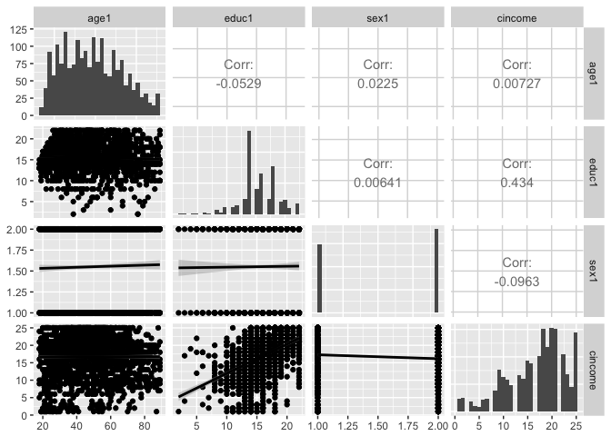

### Check outliers for age

``` r
ggplot(gss,aes("",age)) +
  geom_boxplot() 
```

    ## Warning: Removed 5 rows containing non-finite values (stat_boxplot).

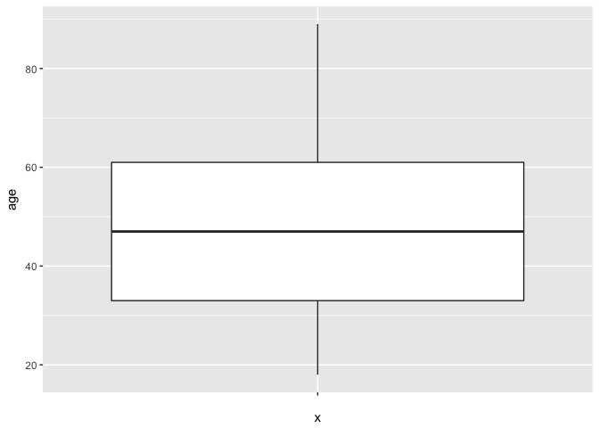

``` r
summary(gss$age)
```

    ##    Min. 1st Qu.  Median    Mean 3rd Qu.    Max.    NA's 
    ##   18.00   33.00   47.00   48.19   61.00   89.00       5

### Outliers for education

``` r
ggplot(gssr,aes("",educ1)) +
  geom_boxplot() 
```

    ## Warning: Removed 2 rows containing non-finite values (stat_boxplot).

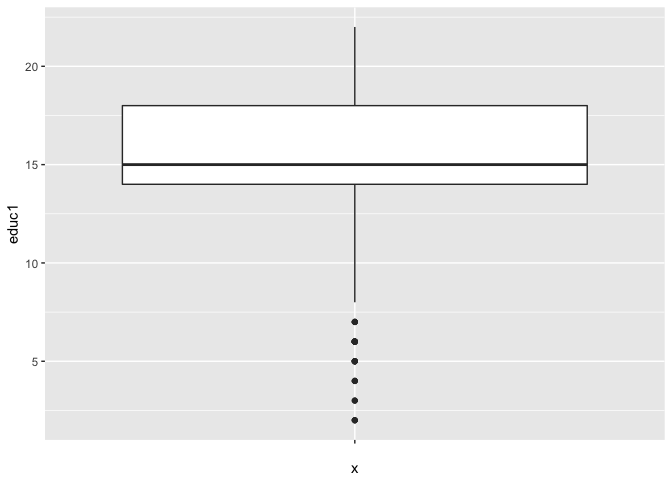

``` r
summary(gssr$educ1) #Further investigation for outliers
```

    ##    Min. 1st Qu.  Median    Mean 3rd Qu.    Max.    NA's 
    ##    2.00   14.00   15.00   15.53   18.00   22.00       2

``` r
ggplot(gssr,aes(educ1)) +
  geom_histogram(binwidth  = 1) #Outliers most in <7.5 range
```

    ## Warning: Removed 2 rows containing non-finite values (stat_bin).

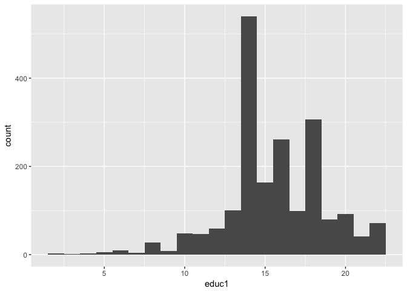

### Outliers for income

``` r
ggplot(gssr,aes("",cincome)) +
  geom_boxplot() 
```

    ## Warning: Removed 216 rows containing non-finite values (stat_boxplot).

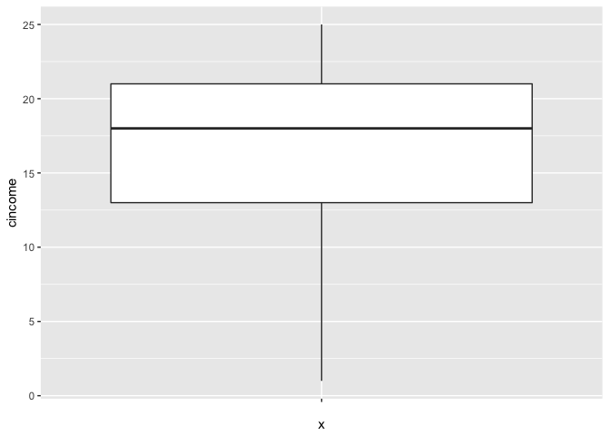

Covariation
===========

### Heatmap

``` r
cormat_heatmap <- function(data){
  # generate correlation matrix
  cormat <- round(cor(data), 2)
  
  # melt into a tidy table
  get_upper_tri <- function(cormat){
    cormat[lower.tri(cormat)]<- NA
    return(cormat)
  }
  
  upper_tri <- get_upper_tri(cormat)
  
  # reorder matrix based on coefficient value
  reorder_cormat <- function(cormat){
    # Use correlation between variables as distance
    dd <- as.dist((1-cormat)/2)
    hc <- hclust(dd)
    cormat <-cormat[hc$order, hc$order]
  }
  
  cormat <- reorder_cormat(cormat)
  upper_tri <- get_upper_tri(cormat)
  
  # Melt the correlation matrix
  melted_cormat <- reshape2::melt(upper_tri, na.rm = TRUE)
  
  # Create a ggheatmap
  ggheatmap <- ggplot(melted_cormat, aes(Var2, Var1, fill = value))+
    geom_tile(color = "white")+
    scale_fill_gradient2(low = "blue", high = "red", mid = "white", 
                         midpoint = 0, limit = c(-1,1), space = "Lab", 
                         name="Pearson\nCorrelation") +
    theme_minimal()+ # minimal theme
    theme(axis.text.x = element_text(angle = 45, vjust = 1, 
                                     size = 12, hjust = 1))+
    coord_fixed()
  
  # add correlation values to graph
  ggheatmap + 
    geom_text(aes(Var2, Var1, label = value), color = "black", size = 4) +
    theme(
      axis.title.x = element_blank(),
      axis.title.y = element_blank(),
      panel.grid.major = element_blank(),
      panel.background = element_blank(),
      axis.ticks = element_blank(),
      legend.position = "bottom")
}
gssr_tidy <- gssr %>%
  na.omit()
  cormat_heatmap(select_if(gssr_tidy, is.numeric))
```


### Density estimation of income

``` r
summary(gssr$cincome)
```

    ##    Min. 1st Qu.  Median    Mean 3rd Qu.    Max.    NA's 
    ##    1.00   13.00   18.00   16.67   21.00   25.00     216

``` r
gssr %>%

  ggplot(aes(cincome))+
  geom_density(aes(color = "Gaussian"), kernel = "gaussian") +
  geom_density(aes(color = "Epanechnikov"), kernel = "epanechnikov") +
  geom_density(aes(color = "Rectangular"), kernel = "rectangular") +
  geom_density(aes(color = "Triangular"), kernel = "triangular") +
  geom_density(aes(color = "Biweight"), kernel = "biweight") +
  labs(title = "Density estimator of income level for gss data",
       x = "Income level",
       y = "Density")
```

    ## Warning: Removed 216 rows containing non-finite values (stat_density).

    ## Warning: Removed 216 rows containing non-finite values (stat_density).

    ## Warning: Removed 216 rows containing non-finite values (stat_density).

    ## Warning: Removed 216 rows containing non-finite values (stat_density).

    ## Warning: Removed 216 rows containing non-finite values (stat_density).

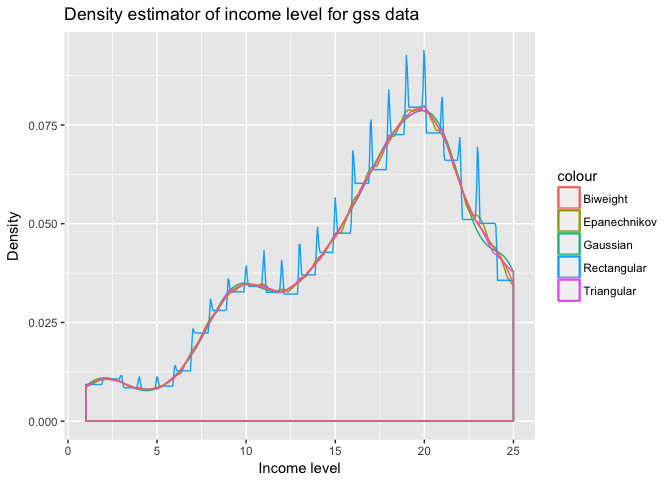

### Income and education relation

``` r
ggplot(gssr,aes(educ1,cincome))+ geom_col()+coord_flip()
```

    ## Warning: Removed 216 rows containing missing values (position_stack).


### Jitter and smooth line between income and education

``` r
ggplot(gssr,aes(educ1,cincome))+ geom_jitter()+geom_smooth()
```

    ## `geom_smooth()` using method = 'gam'

    ## Warning: Removed 216 rows containing non-finite values (stat_smooth).

    ## Warning: Removed 216 rows containing missing values (geom_point).

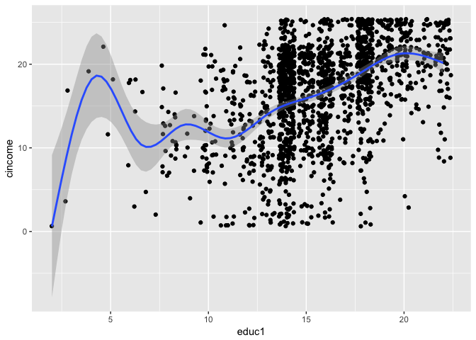

### Jitter and smooth line between income and education (more clearly)

``` r
gssr <- within(gssr, {reduc <- pmin(pmax(educ1, 9), 18) })
ggplot(gssr,aes(reduc,cincome))+ geom_jitter()+geom_smooth()
```

    ## `geom_smooth()` using method = 'gam'

    ## Warning: Removed 216 rows containing non-finite values (stat_smooth).

    ## Warning: Removed 216 rows containing missing values (geom_point).


``` r
ggplot(gssr,aes(reduc,cincome))+ geom_jitter()+geom_smooth()+facet_wrap(~ sex, scales = "free_y")
```

    ## `geom_smooth()` using method = 'gam'

    ## Warning: Removed 216 rows containing non-finite values (stat_smooth).

    ## Warning: Removed 216 rows containing missing values (geom_point).

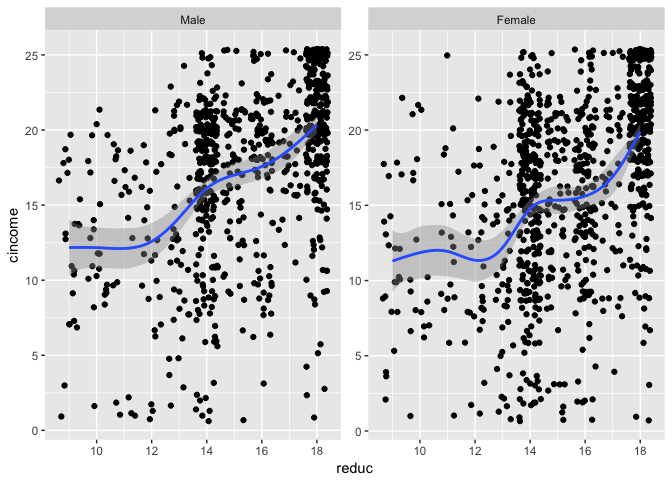

### Jitter and smooth line between income and age

``` r
ggplot(gssr,aes(age1,cincome))+ geom_jitter()+geom_smooth()
```

    ## `geom_smooth()` using method = 'gam'

    ## Warning: Removed 219 rows containing non-finite values (stat_smooth).

    ## Warning: Removed 219 rows containing missing values (geom_point).

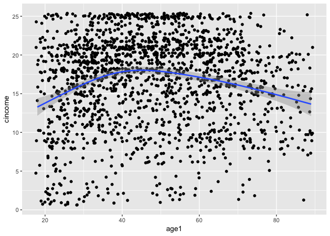

### Education distribution between sex group

``` r
gssr_median <- gssr %>%
  group_by(sex1) %>%
  summarize(median = median(educ1,na.rm = T))
ggplot(gssr) +
  geom_histogram(aes(educ1), binwidth = 1) +
  geom_vline(data = gssr_median, aes(xintercept = median), color = "red") +
  facet_wrap(~ sex1, ncol = 1)
```

    ## Warning: Removed 2 rows containing non-finite values (stat_bin).

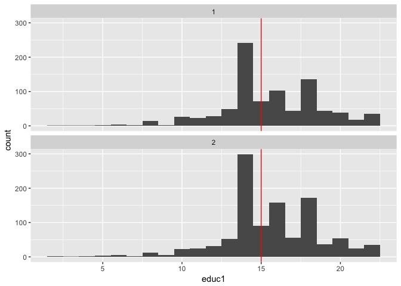

### Income distribution between sex group

``` r
gssr_median2 <- gssr %>%
  group_by(sex1) %>%
  summarize(median = median(cincome,na.rm = T))
ggplot(gssr) +
  geom_histogram(aes(cincome), binwidth = 1) +
  geom_vline(data = gssr_median2, aes(xintercept = median), color = "red") +
  facet_wrap(~ sex1, ncol = 1)
```

    ## Warning: Removed 216 rows containing non-finite values (stat_bin).

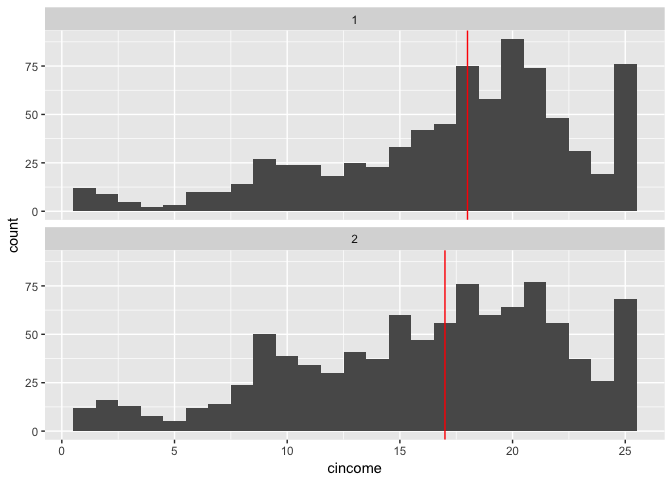

### Happiness among different sex groups

``` r
gss %>%
  count(happy, sex) %>%
  na.omit() %>%
  mutate(happy = factor(happy, levels = c("VERY HAPPY", "PRETTY HAPPY",
                                            "NOT TOO HAPPY", "NA"))) %>%
  ggplot(aes(happy, n, fill = sex)) +
  geom_col()
```

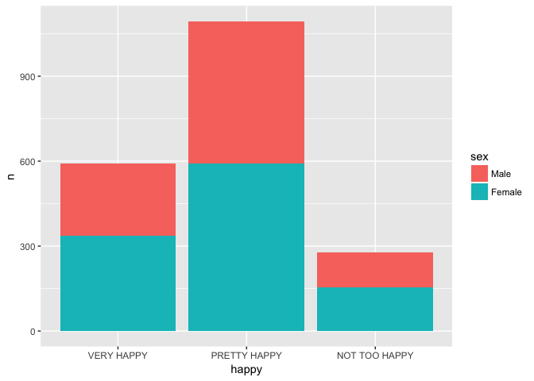

### Happiness among different work status

``` r
gss %>%
  count(happy, wrkstat) %>%
  na.omit() %>%
  mutate(happy = factor(happy, levels = c("VERY HAPPY", "PRETTY HAPPY",
                                            "NOT TOO HAPPY", "NA"))) %>%
  ggplot(aes(happy, n, fill = wrkstat)) +
  geom_col()
```

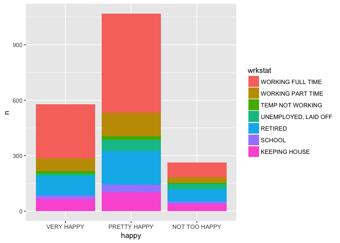

``` r
gss %>%
  count(happy, wrkstat) %>%
  na.omit() %>%
  mutate(happy = factor(happy, levels = c("VERY HAPPY", "PRETTY HAPPY",
                                            "NOT TOO HAPPY", "NA"))) %>%
  ggplot(aes(happy, n, fill = wrkstat)) +
  geom_col(position = "dodge")
```

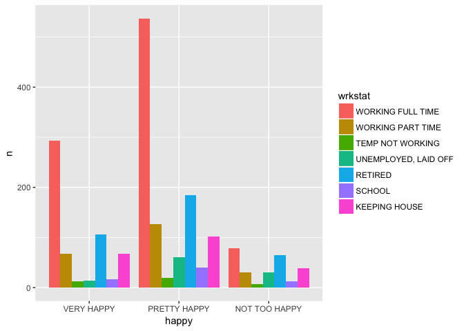

### Work status among different sex groups

``` r
gss %>%
  count(wrkstat, sex) %>%
  na.omit() %>%
  mutate(wrkstat = factor(wrkstat, levels = c("WORKING FULL TIME","RETIRED","WORKING PART TIME", "UNEMPLOYED, LAID OFF" ,"TEMP NOT WORKING" ))) %>%
  ggplot(aes(wrkstat, n, fill = sex)) +
  geom_col()
```

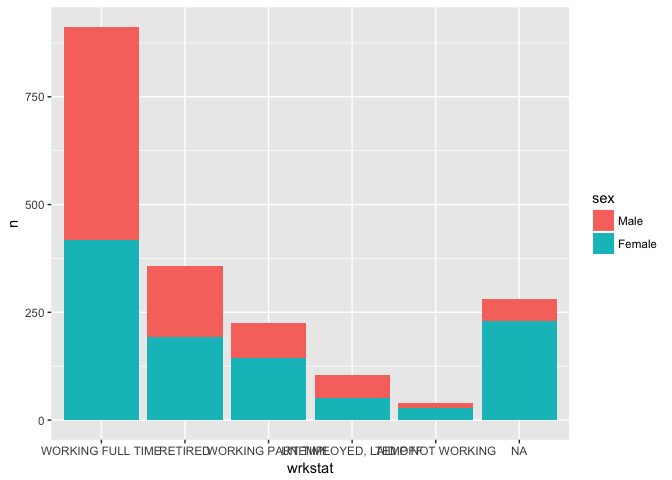

### Income level among different age groups and work status groups (219 missing values)

``` r
ggplot(data = gss, mapping = aes(x = age, y = as.numeric(income06), color = wrkstat)) +
  geom_point()
```

    ## Warning: Removed 219 rows containing missing values (geom_point).

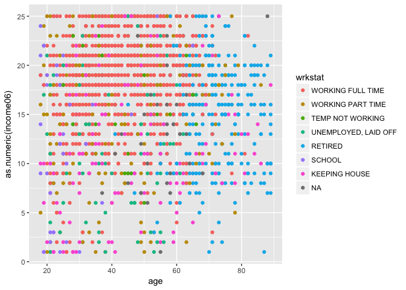
