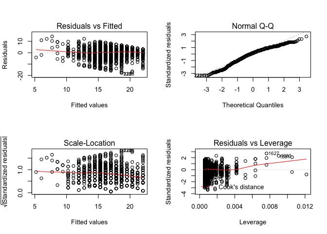
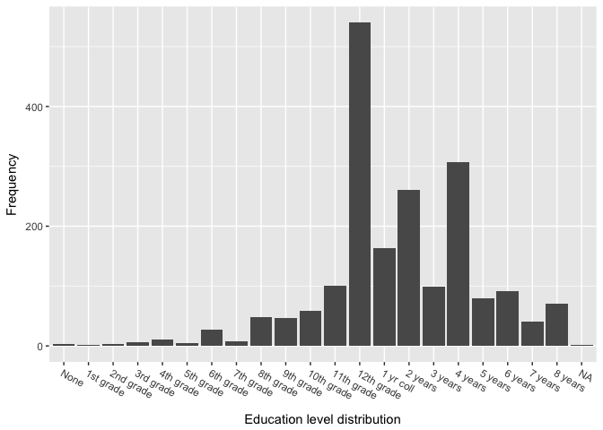
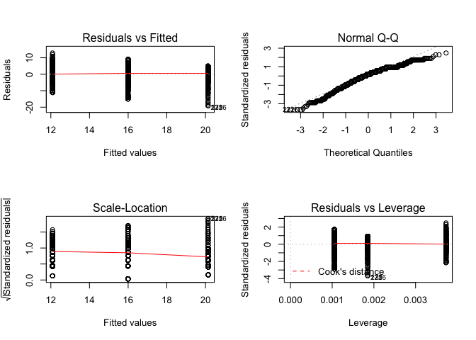

yu\_liqiang\_EDA\_write-up
================
Liqiang Yu
11/27/2017

Evaluate four family income factors --- age, sex, education level and work status
=================================================================================

Introduction
------------

From previous exploratory data analysis, we have noticed that family income can be affected by one's age, sex, education level or his work status. However, how much does each variable influence family income and how significant is each factor are still unclear. So our goal is to build a linear regression model to examine each factor in terms of their significance and their influence in interpreting family income.

Data Description
----------------

The General Social Survey (GSS) gathers data on American society in order to monitor and explain trends and constants in attitudes, behaviors, and attributes. It is conducted biannually through in-person interviews using a probability sampling approach. It is one of the most commonly studied datasets in the social science disciplines.

Here is an example of GSS data: \#\#\#\#Load Data

    ## ── Attaching packages ─────────────────────────────────────────────────────── tidyverse 1.2.1 ──

    ## ✔ ggplot2 2.2.1     ✔ purrr   0.2.4
    ## ✔ tibble  1.3.4     ✔ dplyr   0.7.4
    ## ✔ tidyr   0.7.2     ✔ stringr 1.2.0
    ## ✔ readr   1.1.1     ✔ forcats 0.2.0

    ## ── Conflicts ────────────────────────────────────────────────────────── tidyverse_conflicts() ──
    ## ✖ dplyr::filter() masks stats::filter()
    ## ✖ dplyr::lag()    masks stats::lag()

    ## 
    ## Attaching package: 'GGally'

    ## The following object is masked from 'package:dplyr':
    ## 
    ##     nasa

    ## # A tibble: 1,974 x 221
    ##     year    id           wrkstat       wrkslf     wrkgvt       marital
    ##    <dbl> <dbl>            <fctr>       <fctr>     <fctr>        <fctr>
    ##  1  2012     1 WORKING PART TIME SOMEONE ELSE    PRIVATE Never married
    ##  2  2012     2 WORKING PART TIME SOMEONE ELSE    PRIVATE Never married
    ##  3  2012     3 WORKING FULL TIME SOMEONE ELSE    PRIVATE       Married
    ##  4  2012     4              <NA> SOMEONE ELSE    PRIVATE       Married
    ##  5  2012     5           RETIRED SOMEONE ELSE GOVERNMENT     Separated
    ##  6  2012     6              <NA> SOMEONE ELSE    PRIVATE       Widowed
    ##  7  2012     7     KEEPING HOUSE SOMEONE ELSE    PRIVATE       Married
    ##  8  2012     8     KEEPING HOUSE         <NA>       <NA>     Separated
    ##  9  2012     9     KEEPING HOUSE         <NA>       <NA>       Married
    ## 10  2012    10 WORKING FULL TIME SOMEONE ELSE    PRIVATE Never married
    ## # ... with 1,964 more rows, and 215 more variables: sibs <dbl>,
    ## #   childs <dbl>, age <dbl>, educ <fctr>, degree <fctr>, sex <fctr>,
    ## #   race <fctr>, polviews <fctr>, partyid <fctr>, mobile16 <fctr>,
    ## #   born <fctr>, income06 <fctr>, rincom06 <fctr>, region <fctr>,
    ## #   size <dbl>, vote08_coded <fctr>, pres08 <fctr>, natspac <fctr>,
    ## #   natenvir <fctr>, natheal <fctr>, natcity <fctr>, natcrime <fctr>,
    ## #   natdrug <fctr>, nateduc <fctr>, natrace <fctr>, natarms <fctr>,
    ## #   nataid <fctr>, natfare <fctr>, natroad <fctr>, natsoc <fctr>,
    ## #   natmass <fctr>, natpark <fctr>, natchld <fctr>, natsci <fctr>,
    ## #   natenrgy <fctr>, eqwlth <dbl>, spkath <fctr>, colath <fctr>,
    ## #   libath <fctr>, spkrac <fctr>, colrac <fctr>, librac <fctr>,
    ## #   spkcom <fctr>, colcom <fctr>, libcom <fctr>, spkmil <fctr>,
    ## #   colmil <fctr>, libmil <fctr>, spkhomo <fctr>, colhomo <fctr>,
    ## #   libhomo <fctr>, spkmslm <fctr>, colmslm <fctr>, libmslm <fctr>,
    ## #   cappun <fctr>, gunlaw <fctr>, courts <fctr>, grass <fctr>,
    ## #   relig <fctr>, fund <fctr>, attend <fctr>, reliten <fctr>,
    ## #   postlife <fctr>, pray <fctr>, bible <fctr>, affrmact <fctr>,
    ## #   wrkwayup <fctr>, closeblk <dbl>, closewht <dbl>, happy <fctr>,
    ## #   confinan <fctr>, conbus <fctr>, conclerg <fctr>, coneduc <fctr>,
    ## #   confed <fctr>, conlabor <fctr>, conpress <fctr>, conmedic <fctr>,
    ## #   contv <fctr>, conjudge <fctr>, consci <fctr>, conlegis <fctr>,
    ## #   conarmy <fctr>, obey <fctr>, popular <fctr>, thnkself <fctr>,
    ## #   workhard <fctr>, helpoth <fctr>, union <fctr>, getahead <fctr>,
    ## #   abdefect <fctr>, abnomore <fctr>, abhlth <fctr>, abpoor <fctr>,
    ## #   abrape <fctr>, absingle <fctr>, abany <fctr>, divlaw <fctr>,
    ## #   premarsx <fctr>, teensex <fctr>, ...

Experimental Setup
------------------

### Linear Regression

In linear regression (also called multiple regression), we hope to find the equation of *y* = *B*<sub>0</sub> + *B*<sub>1</sub>*X*<sub>1</sub> + *B*<sub>2</sub>*X*<sub>2</sub> + ... + *B*<sub>*k*</sub>*X*<sub>*k*</sub> + *e*. By using our training data from a limited number of k predictors, we obtain our regression relation *y* = *b*<sub>0</sub> + *b*<sub>1</sub>*x*<sub>1</sub> + *b*<sub>2</sub>*x*<sub>2</sub> + ... + *b*<sub>*k*</sub>*x*<sub>*k*</sub>. We will aslo want to make sure that we reward simpler models over more complex models. Another question that we will need to consider is whether any of our predictors will have an interaction with each other.

### A simple model

First we want to start with a simple model: \#\#\#\#A simple model

    ## 
    ## Call:
    ## lm(formula = cincome ~ educ1, data = gssr)
    ## 
    ## Residuals:
    ##      Min       1Q   Median       3Q      Max 
    ## -17.6679  -3.2494   0.8065   3.8576  14.2762 
    ## 
    ## Coefficients:
    ##             Estimate Std. Error t value Pr(>|t|)    
    ## (Intercept)  3.51451    0.66408   5.292 1.36e-07 ***
    ## educ1        0.84186    0.04172  20.177  < 2e-16 ***
    ## ---
    ## Signif. codes:  0 '***' 0.001 '**' 0.01 '*' 0.05 '.' 0.1 ' ' 1
    ## 
    ## Residual standard error: 5.281 on 1756 degrees of freedom
    ##   (216 observations deleted due to missingness)
    ## Multiple R-squared:  0.1882, Adjusted R-squared:  0.1877 
    ## F-statistic: 407.1 on 1 and 1756 DF,  p-value: < 2.2e-16

We can see that p-value is significant here for our education level categorical variable, but R-square shows that education only accounts for 18.82% of total variance of family income. Then we examine its residuals and normality:

``` r
par(mfrow = c(2, 2))
plot(model1)
```



We can conclude that the model fits our data well and residuals are nearly normally distributed (Q-Q Plot), although we can observe that there are some outliers from the last graph.

### Add education level

From the education level distribution, we can also categorize education level into three categories: 1. without a high school degree (&lt;= 11th grade) 2. a high school degree but not a college degree (12th grade to 3yr college) 3. a college degree (4yr college and above)

#### Categorize education level into 3 levels



#### Add new education level into previous model

``` r
model1_3 <-update(model1, . ~ . * educ2)
summary(model1_3)
```

    ## 
    ## Call:
    ## lm(formula = cincome ~ educ1 + educ2 + educ1:educ2, data = gssr)
    ## 
    ## Residuals:
    ##      Min       1Q   Median       3Q      Max 
    ## -18.8276  -3.0317   0.8581   3.9781  12.9185 
    ## 
    ## Coefficients:
    ##              Estimate Std. Error t value Pr(>|t|)    
    ## (Intercept)  11.41704    1.66162   6.871 8.83e-12 ***
    ## educ1         0.06041    0.14732   0.410    0.682    
    ## educ21       -2.81189    2.91787  -0.964    0.335    
    ## educ22        3.49298    3.46716   1.007    0.314    
    ## educ1:educ21  0.43470    0.21773   1.996    0.046 *  
    ## educ1:educ22  0.21279    0.21652   0.983    0.326    
    ## ---
    ## Signif. codes:  0 '***' 0.001 '**' 0.01 '*' 0.05 '.' 0.1 ' ' 1
    ## 
    ## Residual standard error: 5.204 on 1752 degrees of freedom
    ##   (216 observations deleted due to missingness)
    ## Multiple R-squared:  0.2137, Adjusted R-squared:  0.2115 
    ## F-statistic: 95.24 on 5 and 1752 DF,  p-value: < 2.2e-16

Although R-square increases by doing so, p-values are not significant. We then try a model using new categorized education variable:

#### Only use education level with 3 catrgories

``` r
model1_1 <- lm(cincome ~ educ2, data = gssr)
summary(model1_1)
```

    ## 
    ## Call:
    ## lm(formula = cincome ~ educ2, data = gssr)
    ## 
    ## Residuals:
    ##      Min       1Q   Median       3Q      Max 
    ## -19.1352  -3.0858   0.9142   4.0063  12.9142 
    ## 
    ## Coefficients:
    ##             Estimate Std. Error t value Pr(>|t|)    
    ## (Intercept)  12.0858     0.3187   37.92   <2e-16 ***
    ## educ21        3.9079     0.3609   10.83   <2e-16 ***
    ## educ22        8.0494     0.3899   20.65   <2e-16 ***
    ## ---
    ## Signif. codes:  0 '***' 0.001 '**' 0.01 '*' 0.05 '.' 0.1 ' ' 1
    ## 
    ## Residual standard error: 5.218 on 1755 degrees of freedom
    ##   (216 observations deleted due to missingness)
    ## Multiple R-squared:  0.208,  Adjusted R-squared:  0.2071 
    ## F-statistic: 230.5 on 2 and 1755 DF,  p-value: < 2.2e-16

``` r
par(mfrow = c(2, 2))
plot(model1_1)
```



The result gives a better estimate, with R-square 20.8% (compare to 18.8%) and all p-values are significant. Our model is pretty good in terms of residual distribution, outliers and normality from four graphs above. We will use this model for estimating the relation between family income and education level.

### Add age variable

We now want to evaluate age variable, by adding age variable into our model:

``` r
model2 <- update(model1_1, . ~ . * age1)
summary(model2)
```

    ## 
    ## Call:
    ## lm(formula = cincome ~ educ2 + age1 + educ2:age1, data = gssr)
    ## 
    ## Residuals:
    ##     Min      1Q  Median      3Q     Max 
    ## -19.064  -3.041   0.931   3.973  12.887 
    ## 
    ## Coefficients:
    ##              Estimate Std. Error t value Pr(>|t|)    
    ## (Intercept) 12.265946   0.857661  14.302  < 2e-16 ***
    ## educ21       3.582791   0.989082   3.622   0.0003 ***
    ## educ22       7.606025   1.120541   6.788 1.55e-11 ***
    ## age1        -0.003724   0.016459  -0.226   0.8210    
    ## educ21:age1  0.006917   0.019136   0.361   0.7178    
    ## educ22:age1  0.009204   0.021780   0.423   0.6726    
    ## ---
    ## Signif. codes:  0 '***' 0.001 '**' 0.01 '*' 0.05 '.' 0.1 ' ' 1
    ## 
    ## Residual standard error: 5.226 on 1749 degrees of freedom
    ##   (219 observations deleted due to missingness)
    ## Multiple R-squared:  0.2081, Adjusted R-squared:  0.2058 
    ## F-statistic: 91.91 on 5 and 1749 DF,  p-value: < 2.2e-16

In the summary, with a p-value of 0.8 of age variable, we conclude that age is not a significant factor of family income. Also, R-square increased by only 0.01%, so age is neither a influtial variable.

### Add sex variable

Add sex variable to our previous model:

``` r
model3 <- update(model1_1, . ~ . * sex1)
summary(model3)
```

    ## 
    ## Call:
    ## lm(formula = cincome ~ educ2 + sex1 + educ2:sex1, data = gssr)
    ## 
    ## Residuals:
    ##      Min       1Q   Median       3Q      Max 
    ## -19.3715  -2.9165   0.6865   3.6865  13.4559 
    ## 
    ## Coefficients:
    ##             Estimate Std. Error t value Pr(>|t|)    
    ## (Intercept)  13.7438     1.0061  13.660  < 2e-16 ***
    ## educ21        4.7140     1.1506   4.097 4.37e-05 ***
    ## educ22        7.0725     1.2373   5.716 1.28e-08 ***
    ## sex1         -1.0998     0.6335  -1.736   0.0827 .  
    ## educ21:sex1  -0.4723     0.7188  -0.657   0.5112    
    ## educ22:sex1   0.6551     0.7754   0.845   0.3983    
    ## ---
    ## Signif. codes:  0 '***' 0.001 '**' 0.01 '*' 0.05 '.' 0.1 ' ' 1
    ## 
    ## Residual standard error: 5.185 on 1752 degrees of freedom
    ##   (216 observations deleted due to missingness)
    ## Multiple R-squared:  0.2194, Adjusted R-squared:  0.2171 
    ## F-statistic: 98.46 on 5 and 1752 DF,  p-value: < 2.2e-16

The p-value (0.08) of sex indicates that sex is neither a good estimator, which makes sense since a family usually consists of both males and females. Our R-square increased by 1.1% because we also added interaction varible into our model.

### Add work status

``` r
model4 <- update(model1_1, . ~ . * wrkstat1)
summary(model4)
```

    ## 
    ## Call:
    ## lm(formula = cincome ~ educ2 + wrkstat1 + educ2:wrkstat1, data = gssr)
    ## 
    ## Residuals:
    ##      Min       1Q   Median       3Q      Max 
    ## -19.2766  -2.7036   0.6902   3.6902  13.7377 
    ## 
    ## Coefficients:
    ##                 Estimate Std. Error t value Pr(>|t|)    
    ## (Intercept)      15.1171     0.5773  26.187  < 2e-16 ***
    ## educ21            2.8523     0.6395   4.460 8.74e-06 ***
    ## educ22            6.0135     0.6682   8.999  < 2e-16 ***
    ## wrkstat1         -0.8091     0.1343  -6.026 2.05e-09 ***
    ## educ21:wrkstat1   0.1496     0.1543   0.969   0.3325    
    ## educ22:wrkstat1   0.3821     0.1722   2.220   0.0266 *  
    ## ---
    ## Signif. codes:  0 '***' 0.001 '**' 0.01 '*' 0.05 '.' 0.1 ' ' 1
    ## 
    ## Residual standard error: 5.048 on 1708 degrees of freedom
    ##   (260 observations deleted due to missingness)
    ## Multiple R-squared:  0.2558, Adjusted R-squared:  0.2537 
    ## F-statistic: 117.4 on 5 and 1708 DF,  p-value: < 2.2e-16

``` r
par(mfrow = c(2, 2))
plot(model1_1)
```


R-squre increased by almost 5% and the p-value of work status is significant. Our final model is pretty good in terms of residual distribution, outliers and normality from model examination above. We conclude that work status is another significant factor of family income.

Summary
=======

We use linear regression model to evaluate four factors: age, sex, education level and work status that could have a significant influence on family income. We find out that education level and work status are significant variables, which accounts for 25.58% variance of family income.
